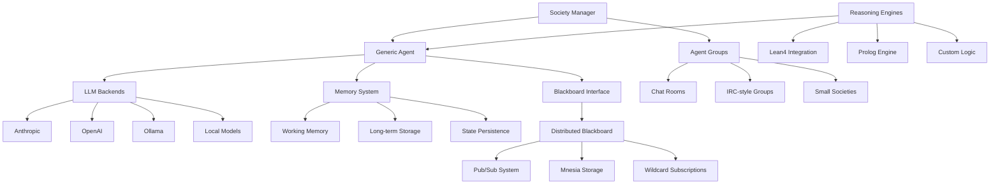

# 🏔️ Prismatic Next-Gen: Systems-First Alpine Development Plan

## 📋 Executive Summary

This document outlines a comprehensive 8-phase alpine-style development plan focused on building Prismatic from the ground up, starting with core agent infrastructure. The approach prioritizes low-level, foundational systems that can be incrementally enhanced with higher-level cognitive capabilities.

## 🎯 Project Context & Philosophy

- **Current Workspace**: `/home/korczis/dev/prismatic` - Next-gen Elixir/Phoenix implementation
- **Legacy Source**: `/home/korczis/dev/prismatic-legacy` - Reference architecture and patterns
- **Development Philosophy**: Systems-first, bottom-up approach with solid foundations
- **Core Principle**: Build generic, extensible agent infrastructure that can support any cognitive model

## 🏗️ Systems Architecture Overview



## 🗺️ 8-Phase Development Roadmap

---

## 🤖 Phase 1: Core Agent System (Weeks 1-2)
**Goal**: Build generic agent infrastructure with pluggable LLM backends and basic memory

### 🎯 Objectives:
- Create generic agent GenServer with configurable LLM backends
- Implement multi-LLM support (Anthropic, OpenAI, Ollama, local models)
- Build basic memory system with working memory and conversation history
- Establish agent lifecycle management and supervision
- **Add IEx testing interface for easy agent creation and interaction**
- **Create basic LiveView interface for agent management**

### 🏗️ Implementation Steps:

#### 1. **Agent Core** (`lib/prismatic/agent/`)
```elixir
# Agent GenServer with pluggable backends
defmodule Prismatic.Agent do
  use GenServer
  
  defstruct [
    :id,
    :name,
    :llm_backend,
    :memory,
    :config,
    :state
  ]
end
```

#### 2. **LLM Backend System** (`lib/prismatic/llm/`)
```elixir
# Generic LLM backend behavior
defmodule Prismatic.LLM.Backend do
  @callback generate(prompt :: String.t(), opts :: keyword()) :: 
    {:ok, String.t()} | {:error, term()}
  @callback stream(prompt :: String.t(), opts :: keyword()) :: 
    Enumerable.t()
end

# Implementations for each provider
- Prismatic.LLM.Anthropic
- Prismatic.LLM.OpenAI  
- Prismatic.LLM.Ollama
- Prismatic.LLM.Local
```

#### 3. **Memory System** (`lib/prismatic/memory/`)
```elixir
defmodule Prismatic.Memory do
  defstruct [
    :working_memory,    # Current conversation context
    :episodic_memory,   # Conversation history
    :semantic_memory,   # Facts and knowledge
    :procedural_memory  # Skills and procedures
  ]
end
```

#### 4. **Agent Supervision**
```elixir
# Dynamic supervisor for agent instances
defmodule Prismatic.Agent.Supervisor do
  use DynamicSupervisor
  
  def start_agent(agent_config) do
    DynamicSupervisor.start_child(__MODULE__, {Prismatic.Agent, agent_config})
  end
end
```

#### 5. **IEx Testing Interface** (`lib/prismatic/iex_helpers.ex`)
```elixir
defmodule Prismatic.IExHelpers do
  # Easy agent creation and testing in IEx
  def create_agent(name, llm_backend \\ :anthropic, opts \\ []) do
    config = %{
      name: name,
      llm_backend: llm_backend,
      memory: %Prismatic.Memory{},
      config: Map.new(opts)
    }
    Prismatic.Agent.Supervisor.start_agent(config)
  end
  
  def chat(agent_id, message) do
    Prismatic.Agent.send_message(agent_id, message)
  end
  
  def inspect_memory(agent_id) do
    Prismatic.Agent.get_memory(agent_id)
  end
  
  def set_context(agent_id, context) do
    Prismatic.Agent.update_config(agent_id, %{context: context})
  end
  
  # Quick agent creation shortcuts
  def quick_agent(name), do: create_agent(name, :anthropic)
  def test_agent(), do: create_agent("TestAgent", :anthropic, context: "You are a helpful test assistant")
end
```

#### 6. **Basic LiveView Interface** (`lib/prismatic_web/live/agent_live.ex`)
```elixir
defmodule PrismaticWeb.AgentLive do
  use PrismaticWeb, :live_view
  
  def mount(_params, _session, socket) do
    agents = Prismatic.Agent.Registry.list_agents()
    {:ok, assign(socket, agents: agents, selected_agent: nil)}
  end
  
  def render(assigns) do
    ~H"""
    <div class="container mx-auto p-4">
      <h1 class="text-2xl font-bold mb-4">Agent Management</h1>
      
      <!-- Agent Creation Form -->
      <div class="bg-white p-4 rounded shadow mb-4">
        <h2 class="text-lg font-semibold mb-2">Create New Agent</h2>
        <form phx-submit="create_agent">
          <input type="text" name="name" placeholder="Agent Name" class="border p-2 mr-2" />
          <select name="llm_backend" class="border p-2 mr-2">
            <option value="anthropic">Anthropic</option>
            <option value="openai">OpenAI</option>
            <option value="ollama">Ollama</option>
          </select>
          <button type="submit" class="bg-blue-500 text-white px-4 py-2 rounded">Create</button>
        </form>
      </div>
      
      <!-- Agent List -->
      <div class="grid grid-cols-1 md:grid-cols-2 lg:grid-cols-3 gap-4">
        <%= for agent <- @agents do %>
          <div class="bg-white p-4 rounded shadow">
            <h3 class="font-semibold"><%= agent.name %></h3>
            <p class="text-sm text-gray-600">Backend: <%= agent.llm_backend %></p>
            <button phx-click="select_agent" phx-value-id={agent.id}
                    class="mt-2 bg-green-500 text-white px-3 py-1 rounded text-sm">
              Interact
            </button>
          </div>
        <% end %>
      </div>
    </div>
    """
  end
  
  def handle_event("create_agent", %{"name" => name, "llm_backend" => backend}, socket) do
    case Prismatic.IExHelpers.create_agent(name, String.to_atom(backend)) do
      {:ok, agent_pid} ->
        agents = Prismatic.Agent.Registry.list_agents()
        {:noreply, assign(socket, agents: agents)}
      {:error, reason} ->
        {:noreply, put_flash(socket, :error, "Failed to create agent: #{reason}")}
    end
  end
end
```

### 📊 Success Metrics:
- [ ] Agent can be created with any LLM backend
- [ ] Multiple agents can run concurrently
- [ ] Memory system stores and retrieves conversation history
- [ ] Agent supervision handles crashes gracefully
- [ ] Basic agent API functional (send message, get response)
- [ ] **IEx helpers allow easy agent creation and testing**
- [ ] **LiveView interface provides basic agent management**

### 🚧 Risk Mitigation:
- Start with one LLM backend, add others incrementally
- Use simple in-memory storage initially
- Implement comprehensive error handling
- Create agent testing utilities

---

## 📋 Phase 2: Blackboard System (Weeks 3-4)
**Goal**: Implement distributed blackboard with pub/sub capabilities and Mnesia storage

### 🎯 Objectives:
- Build distributed blackboard system using Mnesia
- Implement pub/sub mechanism with wildcard subscriptions
- Create blackboard API for reading, writing, and subscribing
- Add blackboard persistence and replication across nodes

### 🏗️ Implementation Steps:

#### 1. **Blackboard Core** (`lib/prismatic/blackboard/`)
```elixir
defmodule Prismatic.Blackboard do
  # Core blackboard operations
  def write(key, value, metadata \\ %{})
  def read(key)
  def read_pattern(pattern)  # Mnesia wildcard matching
  def subscribe(pattern)     # Subscribe to key patterns
  def unsubscribe(pattern)
  
  # Blackboard entry structure
  defstruct [
    :key,
    :value,
    :timestamp,
    :author,      # Which agent wrote this
    :metadata,
    :ttl          # Optional expiration
  ]
end
```

#### 2. **Mnesia Schema** (`lib/prismatic/blackboard/storage.ex`)
```elixir
# Mnesia table for blackboard entries
defmodule Prismatic.Blackboard.Storage do
  def setup_tables do
    :mnesia.create_table(:blackboard_entries, [
      attributes: [:key, :value, :timestamp, :author, :metadata, :ttl],
      type: :set,
      disc_copies: [node()],
      index: [:author, :timestamp]
    ])
  end
end
```

#### 3. **Pub/Sub System** (`lib/prismatic/blackboard/pubsub.ex`)
```elixir
defmodule Prismatic.Blackboard.PubSub do
  # Pattern-based subscriptions
  def subscribe(agent_pid, pattern)
  def notify_subscribers(key, value, metadata)
  
  # Wildcard pattern matching
  # Examples:
  # "agent.*" - all agent-related keys
  # "society.room1.*" - all keys for room1
  # "*.status" - all status updates
end
```

#### 4. **Blackboard API** (`lib/prismatic/blackboard/api.ex`)
```elixir
# High-level API for agents
defmodule Prismatic.Blackboard.API do
  def publish(agent_id, key, value, opts \\ [])
  def read(key_or_pattern)
  def subscribe(agent_id, pattern, callback)
  def query(conditions)  # Complex queries
end
```

### 📊 Success Metrics:
- [ ] Agents can write to and read from blackboard
- [ ] Wildcard pattern subscriptions working
- [ ] Mnesia replication across multiple nodes
- [ ] Pub/sub notifications delivered reliably
- [ ] Blackboard performance under concurrent load

### 🚧 Risk Mitigation:
- Start with single-node Mnesia, add distribution later
- Implement subscription cleanup to prevent memory leaks
- Add blackboard monitoring and metrics
- Create blackboard testing and debugging tools

---

## 💾 Phase 3: Agent Persistence (Weeks 5-6)
**Goal**: Implement complete agent state serialization and restoration

### 🎯 Objectives:
- Serialize complete agent state including memory and configuration
- Implement agent state restoration after application restart
- Create agent state versioning and migration system
- Add agent state backup and recovery mechanisms

### 🏗️ Implementation Steps:

#### 1. **State Serialization** (`lib/prismatic/agent/persistence.ex`)
```elixir
defmodule Prismatic.Agent.Persistence do
  # Serialize complete agent state
  def serialize_agent(agent_pid) do
    state = :sys.get_state(agent_pid)
    %{
      id: state.id,
      name: state.name,
      llm_backend: state.llm_backend,
      memory: serialize_memory(state.memory),
      config: state.config,
      internal_state: state.state,
      version: current_version(),
      timestamp: DateTime.utc_now()
    }
  end
  
  def deserialize_agent(serialized_state) do
    # Restore agent from serialized state
    # Handle version migrations if needed
  end
end
```

#### 2. **Memory Persistence** (`lib/prismatic/memory/persistence.ex`)
```elixir
defmodule Prismatic.Memory.Persistence do
  # Efficient memory serialization
  def serialize_memory(memory) do
    %{
      working_memory: serialize_working_memory(memory.working_memory),
      episodic_memory: serialize_episodic_memory(memory.episodic_memory),
      semantic_memory: serialize_semantic_memory(memory.semantic_memory),
      procedural_memory: serialize_procedural_memory(memory.procedural_memory)
    }
  end
  
  # Incremental memory updates for efficiency
  def update_memory_checkpoint(agent_id, memory_delta)
end
```

#### 3. **State Storage** (`lib/prismatic/agent/storage.ex`)
```elixir
defmodule Prismatic.Agent.Storage do
  # Multiple storage backends
  def save_agent_state(agent_id, state, backend \\ :mnesia)
  def load_agent_state(agent_id, backend \\ :mnesia)
  def list_saved_agents(backend \\ :mnesia)
  
  # Storage backends:
  # :mnesia - Distributed storage
  # :ets - Fast local storage
  # :disk - File-based storage
  # :postgres - Database storage
end
```

#### 4. **Agent Registry** (`lib/prismatic/agent/registry.ex`)
```elixir
defmodule Prismatic.Agent.Registry do
  # Track all agents and their states
  def register_agent(agent_id, agent_pid)
  def get_agent(agent_id)
  def list_agents()
  def save_all_agents()
  def restore_all_agents()
  
  # Automatic periodic saves
  def start_auto_save(interval \\ :timer.minutes(5))
end
```

### 📊 Success Metrics:
- [ ] Agent state can be completely serialized and restored
- [ ] Application restart preserves all agent states
- [ ] Memory serialization is efficient and compact
- [ ] State versioning handles schema changes
- [ ] Automatic backup system prevents data loss

### 🚧 Risk Mitigation:
- Implement incremental state saves to reduce overhead
- Add state validation and corruption detection
- Create state migration testing framework
- Build state debugging and inspection tools

---

## 👥 Phase 4: Society Management (Weeks 7-8)
**Goal**: Create agent societies with group dynamics and interaction patterns

### 🎯 Objectives:
- Implement society/group management system
- Create IRC-style chat rooms and small societies
- Add group-specific blackboard namespaces
- Implement inter-agent communication patterns
- **Add scenario-based interaction system inspired by crisis negotiation training**
- **Implement agent impersonation capabilities for user interaction**
- **Create society persistence with scenario save/load functionality**
- **Add comprehensive LiveView interface for society creation and management**

### 🏗️ Implementation Steps:

#### 1. **Society Core** (`lib/prismatic/society/`)
```elixir
defmodule Prismatic.Society do
  defstruct [
    :id,
    :name,
    :type,          # :chat_room, :small_society, :research_group
    :members,       # List of agent IDs
    :config,        # Society-specific configuration
    :blackboard_ns, # Blackboard namespace
    :created_at,
    :metadata
  ]
  
  # Society operations
  def create_society(name, type, config \\ %{})
  def add_member(society_id, agent_id)
  def remove_member(society_id, agent_id)
  def broadcast_message(society_id, message, from_agent)
  def get_society_blackboard(society_id)
end
```

#### 2. **Society Types** (`lib/prismatic/society/types/`)
```elixir
# Different society behaviors
defmodule Prismatic.Society.ChatRoom do
  # IRC-style chat room
  # - Public messages to all members
  # - Private messages between members
  # - Topic management
  # - Member join/leave notifications
end

defmodule Prismatic.Society.SmallSociety do
  # Small society simulation
  # - Role-based interactions
  # - Social dynamics
  # - Reputation systems
  # - Group decision making
end

defmodule Prismatic.Society.ResearchGroup do
  # Collaborative research environment
  # - Shared knowledge base
  # - Task distribution
  # - Result aggregation
  # - Peer review processes
end
```

#### 3. **Group Communication** (`lib/prismatic/society/communication.ex`)
```elixir
defmodule Prismatic.Society.Communication do
  # Message routing within societies
  def send_message(from_agent, to_agent_or_group, message)
  def broadcast_to_society(society_id, message, from_agent)
  def private_message(from_agent, to_agent, message)
  
  # Message types
  defmodule Message do
    defstruct [
      :id,
      :from,
      :to,          # agent_id or society_id
      :type,        # :public, :private, :system
      :content,
      :timestamp,
      :metadata
    ]
  end
end
```

#### 4. **Society Blackboard** (`lib/prismatic/society/blackboard.ex`)
```elixir
defmodule Prismatic.Society.Blackboard do
  # Society-specific blackboard namespaces
  def write_to_society(society_id, key, value, agent_id)
  def read_from_society(society_id, key_pattern)
  def subscribe_to_society(society_id, agent_id, pattern)
  
  # Namespace examples:
  # "society.room1.messages.*"
  # "society.room1.members.*"
  # "society.room1.topic"
  # "society.room1.status.*"
end
```

#### 5. **Scenario System** (`lib/prismatic/society/scenarios.ex`)
```elixir
defmodule Prismatic.Society.Scenarios do
  # Crisis negotiation and training scenarios
  defstruct [
    :id,
    :name,
    :description,
    :initial_state,
    :agents,           # Agent configurations for scenario
    :objectives,       # Training objectives
    :success_metrics,  # How to measure success
    :modalities,       # Tracked agent states (paranoia, trust, etc.)
    :timeline,         # Scenario progression
    :metadata
  ]
  
  def create_scenario(name, config)
  def load_scenario(scenario_id)
  def start_scenario(scenario_id, society_id)
  def track_modality_changes(scenario_id, agent_id, modality, value)
  def generate_scenario_report(scenario_id)
end
```

#### 6. **Agent Impersonation** (`lib/prismatic/society/impersonation.ex`)
```elixir
defmodule Prismatic.Society.Impersonation do
  # Allow users to act as agents in scenarios
  def start_impersonation(user_id, agent_id, society_id)
  def end_impersonation(user_id, agent_id)
  def send_as_agent(user_id, agent_id, message, target)
  def get_agent_context(agent_id)  # Show user the agent's current state
  
  # Impersonation session tracking
  defstruct [
    :user_id,
    :agent_id,
    :society_id,
    :started_at,
    :actions_taken,
    :context_snapshot
  ]
end
```

#### 7. **Society LiveView Interface** (`lib/prismatic_web/live/society_live.ex`)
```elixir
defmodule PrismaticWeb.SocietyLive do
  use PrismaticWeb, :live_view
  
  def render(assigns) do
    ~H"""
    <div class="society-management">
      <!-- Society Creation Panel -->
      <div class="create-society-panel">
        <h2>Create New Society</h2>
        <form phx-submit="create_society">
          <input type="text" name="name" placeholder="Society Name (e.g., Crisis Room 1)" />
          <select name="type">
            <option value="chat_room">IRC-style Chat Room</option>
            <option value="crisis_scenario">Crisis Negotiation Training</option>
            <option value="research_group">Research Collaboration</option>
          </select>
          <textarea name="global_prompt" placeholder="Room-specific global prompt/instructions"></textarea>
          <button type="submit">Create Society</button>
        </form>
      </div>
      
      <!-- Society List -->
      <div class="society-list">
        <%= for society <- @societies do %>
          <div class="society-card" phx-click="select_society" phx-value-id={society.id}>
            <h3><%= society.name %></h3>
            <p>Type: <%= society.type %></p>
            <p>Members: <%= length(society.members) %></p>
            <div class="society-actions">
              <button phx-click="join_society" phx-value-id={society.id}>Join</button>
              <button phx-click="manage_society" phx-value-id={society.id}>Manage</button>
              <button phx-click="save_society" phx-value-id={society.id}>Save State</button>
            </div>
          </div>
        <% end %>
      </div>
      
      <!-- Selected Society Management -->
      <%= if @selected_society do %>
        <div class="society-management-panel">
          <h2>Managing: <%= @selected_society.name %></h2>
          
          <!-- Agent Management -->
          <div class="agent-management">
            <h3>Agents in Society</h3>
            <%= for agent <- @selected_society.members do %>
              <div class="agent-card">
                <span><%= agent.name %></span>
                <div class="agent-stats">
                  <%= for {trait, value} <- agent.current_traits do %>
                    <span class="trait"><%= trait %>: <%= value %></span>
                  <% end %>
                </div>
                <div class="agent-actions">
                  <button phx-click="impersonate_agent" phx-value-id={agent.id}>Impersonate</button>
                  <button phx-click="modify_agent" phx-value-id={agent.id}>Modify</button>
                  <button phx-click="remove_agent" phx-value-id={agent.id}>Remove</button>
                </div>
              </div>
            <% end %>
            
            <!-- Add Agent Form -->
            <form phx-submit="add_agent_to_society">
              <input type="hidden" name="society_id" value={@selected_society.id} />
              <input type="text" name="agent_name" placeholder="Agent Name" />
              <select name="agent_template">
                <option value="negotiator">Crisis Negotiator</option>
                <option value="subject">Crisis Subject</option>
                <option value="observer">Observer</option>
                <option value="custom">Custom Agent</option>
              </select>
              <button type="submit">Add Agent</button>
            </form>
          </div>
          
          <!-- Scenario Controls -->
          <%= if @selected_society.type == "crisis_scenario" do %>
            <div class="scenario-controls">
              <h3>Scenario Management</h3>
              <select name="scenario_template">
                <option value="psychiatric_crisis">Psychiatric Crisis</option>
                <option value="hostage_situation">Hostage Situation</option>
                <option value="domestic_dispute">Domestic Dispute</option>
              </select>
              <button phx-click="start_scenario">Start Scenario</button>
              <button phx-click="pause_scenario">Pause</button>
              <button phx-click="reset_scenario">Reset</button>
            </div>
          <% end %>
        </div>
      <% end %>
    </div>
    """
  end
  
  # Event handlers for society management
  def handle_event("create_society", params, socket)
  def handle_event("add_agent_to_society", params, socket)
  def handle_event("impersonate_agent", %{"id" => agent_id}, socket)
  def handle_event("start_scenario", params, socket)
end
```

### 📊 Success Metrics:
- [ ] Multiple society types can be created and managed
- [ ] Agents can join/leave societies dynamically
- [ ] Group communication works reliably
- [ ] Society-specific blackboards isolated properly
- [ ] Different society types exhibit distinct behaviors
- [ ] **Scenario system supports crisis negotiation training**
- [ ] **Agent impersonation allows seamless user interaction**
- [ ] **Society persistence enables save/load of complex scenarios**
- [ ] **LiveView interface provides intuitive society management**

### 🚧 Risk Mitigation:
- Start with simple chat room implementation
- Implement proper message ordering and delivery
- Add society monitoring and debugging tools
- Create society testing scenarios

---

## 🧠 Phase 5: Reasoning Engines (Weeks 9-10)
**Goal**: Implement pluggable reasoning systems with Lean4 and Prolog integration

### 🎯 Objectives:
- Create pluggable reasoning engine architecture
- Integrate Lean4 for formal reasoning and proof verification
- Add Prolog engine for logic programming and knowledge representation
- Implement custom reasoning modules for specific domains

### 🏗️ Implementation Steps:

#### 1. **Reasoning Engine Core** (`lib/prismatic/reasoning/`)
```elixir
defmodule Prismatic.Reasoning.Engine do
  @callback reason(input :: term(), context :: map()) :: 
    {:ok, result :: term()} | {:error, reason :: term()}
  @callback validate(reasoning :: term()) :: boolean()
  @callback explain(reasoning :: term()) :: String.t()
end

defmodule Prismatic.Reasoning.Manager do
  # Manage multiple reasoning engines per agent
  def add_engine(agent_id, engine_type, config)
  def remove_engine(agent_id, engine_type)
  def reason_with(agent_id, engine_type, input, context)
  def get_available_engines(agent_id)
end
```

#### 2. **Lean4 Integration** (`lib/prismatic/reasoning/lean4.ex`)
```elixir
defmodule Prismatic.Reasoning.Lean4 do
  @behaviour Prismatic.Reasoning.Engine
  
  # Formal reasoning and proof verification
  def reason(theorem, context) do
    # Convert to Lean4 syntax
    lean_code = translate_to_lean4(theorem, context)
    
    # Execute Lean4 proof checker
    case execute_lean4(lean_code) do
      {:ok, proof} -> {:ok, %{theorem: theorem, proof: proof, verified: true}}
      {:error, reason} -> {:error, reason}
    end
  end
  
  # Mathematical reasoning
  def verify_proof(theorem, proof)
  def find_counterexample(conjecture)
  def simplify_expression(expression)
end
```

#### 3. **Prolog Integration** (`lib/prismatic/reasoning/prolog.ex`)
```elixir
defmodule Prismatic.Reasoning.Prolog do
  @behaviour Prismatic.Reasoning.Engine
  
  # Logic programming and knowledge representation
  def reason(query, knowledge_base) do
    # Convert to Prolog syntax
    prolog_query = translate_to_prolog(query)
    prolog_kb = translate_kb_to_prolog(knowledge_base)
    
    # Execute Prolog query
    case execute_prolog_query(prolog_query, prolog_kb) do
      {:ok, solutions} -> {:ok, solutions}
      {:error, reason} -> {:error, reason}
    end
  end
  
  # Knowledge base operations
  def add_fact(kb, fact)
  def add_rule(kb, rule)
  def query_kb(kb, query)
  def explain_derivation(kb, conclusion)
end
```

#### 4. **Custom Reasoning Modules** (`lib/prismatic/reasoning/custom/`)
```elixir
# Domain-specific reasoning engines
defmodule Prismatic.Reasoning.Causal do
  # Causal reasoning and inference
  def infer_causes(effect, context)
  def predict_effects(cause, context)
  def find_causal_chains(start_event, end_event, context)
end

defmodule Prismatic.Reasoning.Temporal do
  # Temporal reasoning and planning
  def sequence_events(events, constraints)
  def plan_actions(goal, current_state, available_actions)
  def resolve_temporal_conflicts(events)
end

defmodule Prismatic.Reasoning.Probabilistic do
  # Probabilistic reasoning and uncertainty
  def bayesian_inference(evidence, prior_beliefs)
  def monte_carlo_simulation(model, parameters)
  def uncertainty_propagation(inputs, model)
end
```

### 📊 Success Metrics:
- [ ] Lean4 integration working for formal proofs
- [ ] Prolog engine handling logic queries correctly
- [ ] Custom reasoning modules providing domain expertise
- [ ] Agents can use multiple reasoning engines simultaneously
- [ ] Reasoning results integrated with agent decision making

### 🚧 Risk Mitigation:
- Start with simple reasoning tasks
- Implement proper error handling for external tools
- Create reasoning engine testing framework
- Add reasoning performance monitoring

---

## 🧩 Phase 6: Advanced Memory Systems (Weeks 11-12)
**Goal**: Implement trait-based memory, learning systems, and knowledge evolution

### 🎯 Objectives:
- Enhance memory system with trait-based organization
- Implement learning and adaptation mechanisms
- Add knowledge graph capabilities for semantic memory
- Create memory consolidation and forgetting mechanisms
- **Add real-time trait/modality tracking inspired by crisis negotiation system**
- **Implement dynamic agent state visualization and analytics**
- **Create trait evolution system with temporal tracking**

### 🏗️ Implementation Steps:

#### 1. **Trait-Based Memory** (`lib/prismatic/memory/traits.ex`)
```elixir
defmodule Prismatic.Memory.TraitBased do
  # Memory organized by personality traits
  defstruct [
    :analytical_memory,    # Facts, logic, analysis
    :emotional_memory,     # Emotional experiences
    :social_memory,        # Social interactions, relationships
    :creative_memory,      # Ideas, inspirations, innovations
    :procedural_memory     # Skills, procedures, habits
  ]
  
  # Trait-specific memory operations
  def store_by_trait(memory, trait_type, content, context)
  def retrieve_by_trait(memory, trait_type, query)
  def cross_trait_associations(memory, content)
end
```

#### 2. **Learning System** (`lib/prismatic/learning/`)
```elixir
defmodule Prismatic.Learning.Core do
  # Different learning mechanisms
  def reinforcement_learning(agent_id, action, reward, context)
  def observational_learning(agent_id, observed_behavior, outcome)
  def conceptual_learning(agent_id, new_concept, examples)
  def skill_learning(agent_id, skill, practice_data)
  
  # Learning adaptation
  def adapt_behavior(agent_id, feedback)
  def update_beliefs(agent_id, new_evidence)
  def refine_strategies(agent_id, performance_data)
end
```

#### 3. **Knowledge Graph** (`lib/prismatic/memory/knowledge_graph.ex`)
```elixir
defmodule Prismatic.Memory.KnowledgeGraph do
  # Semantic memory as knowledge graph
  defstruct [
    :nodes,        # Concepts, entities, facts
    :edges,        # Relationships, associations
    :weights,      # Strength of associations
    :metadata      # Timestamps, sources, confidence
  ]
  
  # Graph operations
  def add_concept(graph, concept, properties)
  def add_relationship(graph, from_concept, to_concept, relation_type)
  def find_path(graph, start_concept, end_concept)
  def get_neighbors(graph, concept, relation_type)
  def strengthen_association(graph, concept1, concept2)
  def weaken_association(graph, concept1, concept2)
end
```

#### 4. **Memory Consolidation** (`lib/prismatic/memory/consolidation.ex`)
```elixir
defmodule Prismatic.Memory.Consolidation do
  # Memory consolidation and forgetting
  def consolidate_memories(agent_id, time_period)
  def forget_unused_memories(agent_id, threshold)
  def strengthen_important_memories(agent_id, importance_criteria)
  def merge_similar_memories(agent_id, similarity_threshold)
  
  # Memory maintenance
  def cleanup_expired_memories(agent_id)
  def optimize_memory_structure(agent_id)
  def backup_critical_memories(agent_id)
end
```

#### 5. **Real-time Trait Tracking** (`lib/prismatic/traits/tracker.ex`)
```elixir
defmodule Prismatic.Traits.Tracker do
  # Inspired by crisis negotiation modality tracking
  defstruct [
    :agent_id,
    :trait_history,    # Time-series data for each trait
    :current_state,    # Current trait values
    :change_triggers,  # What caused trait changes
    :trend_analysis,   # Trend detection and prediction
    :alerts           # Threshold-based alerts
  ]
  
  def track_trait_change(agent_id, trait_name, old_value, new_value, trigger)
  def get_trait_timeline(agent_id, trait_name, time_range)
  def analyze_trait_trends(agent_id, traits)
  def detect_significant_changes(agent_id, threshold)
  def generate_trait_heatmap(agent_id, time_period)
  
  # Crisis negotiation style tracking
  def track_modality(agent_id, modality, value, context) do
    # Examples: paranoia, trust, emotional_stability, cooperation
    change_event = %{
      timestamp: DateTime.utc_now(),
      modality: modality,
      previous_value: get_current_value(agent_id, modality),
      new_value: value,
      change: value - get_current_value(agent_id, modality),
      context: context,
      trigger: extract_trigger(context)
    }
    
    store_change_event(agent_id, change_event)
    broadcast_change(agent_id, change_event)
  end
end
```

#### 6. **Dynamic State Visualization** (`lib/prismatic_web/live/agent_analytics_live.ex`)
```elixir
defmodule PrismaticWeb.AgentAnalyticsLive do
  use PrismaticWeb, :live_view
  
  def render(assigns) do
    ~H"""
    <div class="agent-analytics">
      <!-- Real-time Trait Dashboard -->
      <div class="trait-dashboard">
        <h2>Agent: <%= @agent.name %> - Live State</h2>
        
        <!-- Current Trait Values -->
        <div class="current-traits">
          <%= for {trait, value} <- @agent.current_traits do %>
            <div class="trait-meter">
              <label><%= trait %></label>
              <div class="meter-bar">
                <div class="meter-fill" style={"width: #{value * 10}%"}></div>
              </div>
              <span class="trait-value"><%= Float.round(value, 2) %></span>
            </div>
          <% end %>
        </div>
        
        <!-- Trait Timeline Chart -->
        <div class="trait-timeline" id="trait-chart" phx-hook="TraitChart">
          <!-- Chart.js or similar visualization -->
        </div>
        
        <!-- Change Log -->
        <div class="change-log">
          <h3>Recent Changes</h3>
          <%= for change <- @recent_changes do %>
            <div class="change-entry">
              <span class="timestamp"><%= change.timestamp %></span>
              <span class="trait"><%= change.trait %></span>
              <span class={"change #{if change.delta > 0, do: "positive", else: "negative"}"}>
                <%= if change.delta > 0, do: "+", else: "" %><%= change.delta %>
              </span>
              <span class="trigger"><%= change.trigger %></span>
            </div>
          <% end %>
        </div>
      </div>
      
      <!-- Heatmap Visualization -->
      <div class="trait-heatmap">
        <h3>Trait Evolution Heatmap</h3>
        <div id="heatmap" phx-hook="TraitHeatmap" data-agent-id={@agent.id}>
          <!-- D3.js heatmap showing trait changes over time -->
        </div>
      </div>
    </div>
    """
  end
  
  def mount(%{"agent_id" => agent_id}, _session, socket) do
    if connected?(socket) do
      # Subscribe to real-time trait changes
      Phoenix.PubSub.subscribe(Prismatic.PubSub, "agent_traits:#{agent_id}")
    end
    
    agent = Prismatic.Agent.get_agent(agent_id)
    recent_changes = Prismatic.Traits.Tracker.get_recent_changes(agent_id, 50)
    
    {:ok, assign(socket, agent: agent, recent_changes: recent_changes)}
  end
  
  def handle_info({:trait_changed, change_event}, socket) do
    # Real-time updates when traits change
    updated_changes = [change_event | socket.assigns.recent_changes] |> Enum.take(50)
    {:noreply, assign(socket, recent_changes: updated_changes)}
  end
end
```

### 📊 Success Metrics:
- [ ] Trait-based memory organization working effectively
- [ ] Learning mechanisms showing measurable improvement
- [ ] Knowledge graph supporting complex queries
- [ ] Memory consolidation maintaining important information
- [ ] Memory system performance optimized for large datasets
- [ ] **Real-time trait tracking provides crisis negotiation style analytics**
- [ ] **Dynamic visualization shows agent state evolution clearly**
- [ ] **Trait evolution system enables temporal analysis and prediction**

### 🚧 Risk Mitigation:
- Implement memory size limits and cleanup mechanisms
- Add memory performance monitoring
- Create memory debugging and visualization tools
- Test memory systems with large datasets

---

## 🌐 Phase 7: Distributed Operations (Weeks 13-14)
**Goal**: Implement multi-node agent societies with distributed coordination

### 🎯 Objectives:
- Enable agent societies to span multiple nodes
- Implement distributed coordination and consensus mechanisms
- Add node discovery and cluster management
- Create fault tolerance and recovery systems

### 🏗️ Implementation Steps:

#### 1. **Distributed Architecture** (`lib/prismatic/distributed/`)
```elixir
defmodule Prismatic.Distributed.Cluster do
  # Node management and discovery
  def join_cluster(node_name)
  def leave_cluster(node_name)
  def list_cluster_nodes()
  def get_node_status(node_name)
  
  # Load balancing
  def distribute_agents(agents, nodes)
  def rebalance_cluster()
  def migrate_agent(agent_id, from_node, to_node)
end
```

#### 2. **Distributed Societies** (`lib/prismatic/distributed/societies.ex`)
```elixir
defmodule Prismatic.Distributed.Societies do
  # Societies spanning multiple nodes
  def create_distributed_society(name, nodes, config)
  def add_remote_member(society_id, agent_id, node)
  def broadcast_across_nodes(society_id, message)
  def sync_society_state(society_id)
  
  # Cross-node communication
  def send_cross_node_message(from_agent, to_agent, message)
  def replicate_society_data(society_id, target_nodes)
end
```

#### 3. **Consensus Mechanisms** (`lib/prismatic/distributed/consensus.ex`)
```elixir
defmodule Prismatic.Distributed.Consensus do
  # Distributed decision making
  def propose_decision(society_id, proposal, proposer_agent)
  def vote_on_proposal(society_id, proposal_id, agent_id, vote)
  def reach_consensus(society_id, proposal_id)
  def execute_consensus_decision(society_id, decision)
  
  # Conflict resolution
  def resolve_conflicts(conflicting_states)
  def elect_leader(society_id, candidates)
  def coordinate_distributed_action(society_id, action)
end
```

#### 4. **Fault Tolerance** (`lib/prismatic/distributed/fault_tolerance.ex`)
```elixir
defmodule Prismatic.Distributed.FaultTolerance do
  # Node failure handling
  def handle_node_failure(failed_node)
  def redistribute_agents(failed_node_agents)
  def restore_society_state(affected_societies)
  
  # Data replication
  def replicate_critical_data(data, replication_factor)
  def verify_data_integrity(data_id)
  def repair_corrupted_data(data_id)
  
  # Recovery mechanisms
  def initiate_cluster_recovery()
  def restore_from_backup(backup_id)
  def validate_cluster_state()
end
```

### 📊 Success Metrics:
- [ ] Agents can communicate across multiple nodes
- [ ] Societies function correctly in distributed environment
- [ ] Node failures handled gracefully with minimal disruption
- [ ] Distributed consensus mechanisms working reliably
- [ ] Cluster performance scales with additional nodes

### 🚧 Risk Mitigation:
- Start with two-node setup, expand gradually
- Implement comprehensive monitoring and alerting
- Create distributed system testing framework
- Add network partition handling

---

## 🖥️ Phase 8: Management Interface (Weeks 15-16)
**Goal**: Create comprehensive monitoring, control, and debugging interface

### 🎯 Objectives:
- Build real-time monitoring dashboard for agents and societies
- Create agent and society management interface
- Add debugging and introspection tools
- Implement system analytics and reporting
- **Create comprehensive scenario management and replay system**
- **Add export capabilities for training scenarios and analytics**
- **Implement advanced IEx helpers for power users and developers**

### 🏗️ Implementation Steps:

#### 1. **Management Dashboard** (`lib/prismatic_web/live/management/`)
```elixir
defmodule PrismaticWeb.ManagementLive do
  # Real-time system overview
  def render_system_status()
  def render_agent_list()
  def render_society_overview()
  def render_blackboard_activity()
  def render_performance_metrics()
end
```

#### 2. **Agent Management** (`lib/prismatic_web/live/agent_management/`)
```elixir
defmodule PrismaticWeb.AgentManagementLive do
  # Agent lifecycle management
  def create_agent_form()
  def agent_detail_view(agent_id)
  def agent_memory_inspector(agent_id)
  def agent_conversation_history(agent_id)
  def agent_performance_metrics(agent_id)
  
  # Agent control
  def start_agent(agent_config)
  def stop_agent(agent_id)
  def restart_agent(agent_id)
  def update_agent_config(agent_id, new_config)
end
```

#### 3. **Society Management** (`lib/prismatic_web/live/society_management/`)
```elixir
defmodule PrismaticWeb.SocietyManagementLive do
  # Society oversight
  def society_dashboard(society_id)
  def member_interaction_graph(society_id)
  def society_message_history(society_id)
  def society_blackboard_view(society_id)
  
  # Society control
  def create_society_form()
  def add_member_to_society(society_id, agent_id)
  def remove_member_from_society(society_id, agent_id)
  def modify_society_settings(society_id, settings)
end
```

#### 4. **System Analytics** (`lib/prismatic/analytics/`)
```elixir
defmodule Prismatic.Analytics do
  # System performance analytics
  def agent_performance_report(time_period)
  def society_interaction_analysis(society_id, time_period)
  def blackboard_usage_statistics(time_period)
  def reasoning_engine_effectiveness(time_period)
  
  # Predictive analytics
  def predict_agent_behavior(agent_id, scenario)
  def forecast_society_dynamics(society_id, time_horizon)
  def identify_system_bottlenecks()
  def recommend_optimizations()
end
```

### 📊 Success Metrics:
- [ ] Real-time dashboard showing complete system state
- [ ] Agent and society management fully functional
- [ ] Debugging tools help identify and resolve issues
- [ ] Analytics provide actionable insights
- [ ] System can be operated effectively through web interface

### 🚧 Risk Mitigation:
- Use proven LiveView patterns for real-time updates
- Implement proper access control and security
- Add comprehensive error handling and user feedback
- Create user documentation and tutorials

---

## 🔄 Implementation Strategy

### Development Principles:
1. **Systems-First**: Build solid infrastructure before adding cognitive features
2. **Incremental**: Each phase adds value while maintaining system stability
3. **Testable**: Comprehensive testing at every level
4. **Observable**: Built-in monitoring and debugging from day 1
5. **Extensible**: Architecture supports future enhancements

### Technical Stack:
- **Core**: Elixir/OTP with GenServer-based agents
- **Storage**: Mnesia for distributed state, PostgreSQL for persistence
- **Communication**: Phoenix PubSub for real-time messaging
- **Web Interface**: Phoenix LiveView for real-time management
- **External Tools**: Lean4, Prolog, various LLM APIs

### Quality Assurance:
- **Unit Tests**: 90%+ coverage for all modules
- **Integration Tests**: End-to-end scenarios for each phase
- **Performance Tests**: Load testing for concurrent operations
- **Chaos Engineering**: Fault injection and recovery testing

---

## 📈 Success Metrics & KPIs

### Phase Completion Criteria:
- **Functionality**: All specified features working correctly
- **Performance**: System handles expected load without degradation
- **Reliability**: System recovers gracefully from failures
- **Usability**: Management interface is intuitive and effective
- **Documentation**: Complete API docs and usage examples

### Overall Project Success:
- **Scalability**: System supports 100+ concurrent agents
- **Reliability**: 99.9% uptime with proper fault tolerance
- **Extensibility**: New reasoning engines can be added easily
- **Performance**: Sub-100ms response times for basic operations
- **Maintainability**: Clean, well-documented, testable codebase

---

## 🎯 Next Steps

1. **Phase 1 Kickoff**: Begin core agent system implementation
2. **Environment Setup**: Configure development tools and CI/CD
3. **Architecture Review**: Validate technical decisions with stakeholders
4. **Team Coordination**: Establish development workflows and standards
5. **Progress Tracking**: Set up project monitoring and reporting

This systems-first approach ensures we build a solid foundation that can support any cognitive architecture while providing immediate value through basic agent functionality.