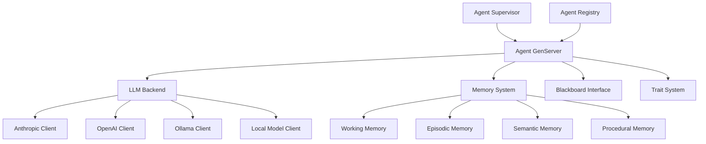

# Agent System Documentation

The agent system is the core foundation of Prismatic, providing generic, extensible agent infrastructure that can support any cognitive model.

## 📋 Overview

Agents in Prismatic are GenServer-based processes that can:
- Use multiple LLM backends (Anthropic, OpenAI, Ollama, local models)
- Maintain persistent memory and conversation history
- Interact with the distributed blackboard system
- Participate in societies and scenarios
- Be easily created and tested via IEx helpers

## 🏗️ Architecture



## 📚 Documentation Structure

- [`core-design.md`](core-design.md) - Core agent architecture and design principles
- [`llm-backends.md`](llm-backends.md) - LLM backend system and implementations
- [`memory-system.md`](memory-system.md) - Agent memory architecture
- [`lifecycle.md`](lifecycle.md) - Agent lifecycle management and supervision
- [`iex-helpers.md`](iex-helpers.md) - IEx testing and development tools
- [`api-reference.md`](api-reference.md) - Complete API documentation
- [`examples.md`](examples.md) - Usage examples and patterns

## 🚀 Quick Start

### Creating an Agent in IEx

```elixir
# Simple agent creation
{:ok, agent} = Prismatic.IExHelpers.create_agent("TestAgent", :anthropic)

# Chat with the agent
response = Prismatic.IExHelpers.chat(agent.id, "Hello, how are you?")

# Inspect agent memory
memory = Prismatic.IExHelpers.inspect_memory(agent.id)
```

### Creating an Agent Programmatically

```elixir
config = %{
  name: "MyAgent",
  llm_backend: :anthropic,
  memory: %Prismatic.Memory{},
  config: %{
    context: "You are a helpful assistant",
    temperature: 0.7
  }
}

{:ok, agent_pid} = Prismatic.Agent.Supervisor.start_agent(config)
```

## 🎯 Implementation Status

- [ ] **Phase 1**: Core agent infrastructure
  - [ ] Agent GenServer implementation
  - [ ] LLM backend system
  - [ ] Basic memory system
  - [ ] Agent supervision
  - [ ] IEx helpers
  - [ ] Basic LiveView interface

## 🔗 Related Documentation

- [Development Plan](../development-plan.md) - Overall project roadmap
- [Blackboard System](../blackboard/README.md) - Agent communication system
- [Memory System](../memory/README.md) - Detailed memory architecture
- [Societies](../societies/README.md) - Agent group management