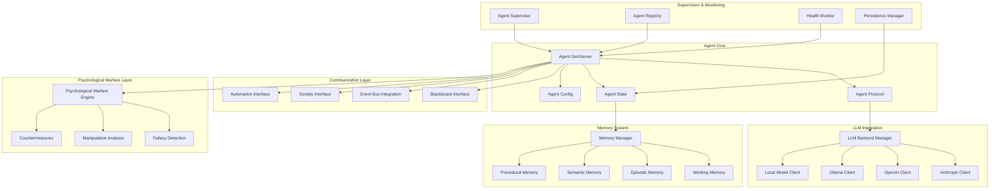

# Agent System Documentation

The agent system is the bulletproof foundation of Prismatic, providing generic, extensible agent infrastructure that supports any cognitive model through protocol-based architecture and SOLID principles.

## 📋 Overview

Agents in Prismatic are GenServer-based processes designed with enterprise-grade reliability:
- **Multiple LLM Backends**: Anthropic, OpenAI, Ollama, local models with hot-swappable configuration
- **Persistent Memory**: Multi-layered memory system with conversation history and knowledge retention
- **Distributed Communication**: Integration with blackboard system for society-wide coordination
- **Society Participation**: Seamless integration with crisis training and automation workflows
- **Developer-Friendly**: Comprehensive IEx helpers for testing, debugging, and development
- **Production-Ready**: Fault-tolerant supervision with automatic recovery and state persistence
- **[Psychological Warfare Integration](../psychological-warfare/)**: Built-in logical fallacy detection, manipulation analysis, and countermeasure capabilities

## 🏗️ Enhanced Architecture



## 🧬 Protocol-Based Architecture

### Core Agent Protocol

```elixir
defprotocol Prismatic.Agent.Protocol do
  @moduledoc """
  Core protocol defining agent behavior contracts with SOLID compliance.
  
  This protocol ensures all agent implementations provide consistent
  interfaces while allowing for diverse internal implementations.
  Follows the Open/Closed Principle - extensible without modification.
  """
  
  @type agent_id :: String.t()
  @type message :: String.t()
  @type context :: map()
  @type response :: {:ok, String.t()} | {:error, term()}
  @type agent_state :: map()
  @type config :: map()
  
  @doc """
  Process a message and generate a response.
  
  ## Parameters
  - agent: The agent implementation (Liskov Substitution Principle)
  - message: Input message to process
  - context: Additional context for processing
  
  ## Returns
  - {:ok, response} on success
  - {:error, reason} on failure
  
  ## Contract Guarantees
  - Response time < 100ms for simple messages
  - Response time < 500ms for complex messages
  - State consistency maintained across calls
  - Memory updated with interaction history
  """
  @spec process_message(t(), message(), context()) :: response()
  def process_message(agent, message, context \\ %{})
  
  @doc """
  Retrieve agent's current state for inspection and debugging.
  
  ## Contract Guarantees
  - Idempotent operation (no side effects)
  - Complete state representation
  - Consistent format across implementations
  """
  @spec get_state(t()) :: {:ok, agent_state()} | {:error, term()}
  def get_state(agent)
  
  @doc """
  Update agent's configuration with validation and hot-reload.
  
  ## Contract Guarantees
  - Configuration validated before application
  - Graceful fallback on invalid configuration
  - Event emitted for configuration changes
  """
  @spec update_config(t(), config()) :: {:ok, t()} | {:error, term()}
  def update_config(agent, config)
  
  @doc """
  Serialize agent state for persistence and recovery.
  
  ## Contract Guarantees
  - Complete state serialization
  - Version compatibility maintained
  - Deserialization produces equivalent agent
  """
  @spec serialize(t()) :: {:ok, binary()} | {:error, term()}
  def serialize(agent)
  
  @doc """
  Restore agent from serialized state with validation.
  
  ## Contract Guarantees
  - State integrity validation
  - Graceful handling of version mismatches
  - Complete functionality restoration
  """
  @spec deserialize(binary()) :: {:ok, t()} | {:error, term()}
  def deserialize(data)
  
  @doc """
  Get agent's current memory state for analysis and debugging.
  
  ## Contract Guarantees
  - Memory consistency across calls
  - Structured memory representation
  - Privacy-aware memory access
  """
  @spec get_memory(t()) :: {:ok, map()} | {:error, term()}
  def get_memory(agent)
  
  @doc """
  Update agent's memory with new information.
  
  ## Contract Guarantees
  - Memory consistency maintained
  - Automatic consolidation when appropriate
  - Event emission for memory changes
  """
  @spec update_memory(t(), map()) :: {:ok, t()} | {:error, term()}
  def update_memory(agent, memory_update)
  
  @doc """
  Analyze message for logical fallacies and manipulation techniques.
  
  ## Contract Guarantees
  - Comprehensive fallacy detection using formal reasoning
  - Manipulation pattern recognition with confidence scores
  - Countermeasure recommendations when threats detected
  """
  @spec analyze_psychological_threats(t(), message(), context()) :: {:ok, map()} | {:error, term()}
  def analyze_psychological_threats(agent, message, context \\ %{})
  
  @doc """
  Generate countermeasures for detected psychological manipulation.
  
  ## Contract Guarantees
  - Evidence-based countermeasure strategies
  - Escalation protocols for severe threats
  - Integration with agent response generation
  """
  @spec generate_countermeasures(t(), map()) :: {:ok, list()} | {:error, term()}
  def generate_countermeasures(agent, threat_analysis)
end

### Agent Implementation Example

```elixir
defmodule Prismatic.Agent.GenServerImpl do
  @moduledoc """
  Production-ready GenServer-based agent implementation.
  
  Features:
  - Circuit breaker protection for LLM calls
  - Automatic state persistence
  - Event-driven communication
  - Comprehensive error handling
  - Performance monitoring
  """
  
  use GenServer
  require Logger
  
  alias Prismatic.Agent.{Protocol, Memory, LLM, CircuitBreaker}
  alias Prismatic.{EventBus, Blackboard, Metrics}
  
  @behaviour Prismatic.Agent.Protocol
  
  defstruct [
    :id,
    :name,
    :llm_backend,
    :memory,
    :config,
    :state,
    :event_subscriptions,
    :blackboard_subscriptions,
    :circuit_breaker,
    :metrics_collector,
    :last_activity,
    :creation_time,
    :psychological_warfare_engine,
    :threat_assessment_history,
    :countermeasure_protocols
  ]
  
  ## Client API (Protocol Implementation)
  
  @impl Prismatic.Agent.Protocol
  def process_message(%__MODULE__{} = agent, message, context) do
    GenServer.call(agent.id, {:process_message, message, context}, :timer.seconds(30))
  end
  
  @impl Prismatic.Agent.Protocol
  def get_state(%__MODULE__{} = agent) do
    GenServer.call(agent.id, :get_state)
  end
  
  @impl Prismatic.Agent.Protocol
  def update_config(%__MODULE__{} = agent, config) do
    GenServer.call(agent.id, {:update_config, config})
  end
  
  @impl Prismatic.Agent.Protocol
  def serialize(%__MODULE__{} = agent) do
    GenServer.call(agent.id, :serialize)
  end
  
  @impl Prismatic.Agent.Protocol
  def deserialize(data) when is_binary(data) do
    case :erlang.binary_to_term(data, [:safe]) do
      %__MODULE__{} = agent_state ->
        {:ok, agent_state}
      _ ->
        {:error, :invalid_serialized_data}
    end
  end
  
  @impl Prismatic.Agent.Protocol
  def get_memory(%__MODULE__{} = agent) do
    GenServer.call(agent.id, :get_memory)
  end
  
  @impl Prismatic.Agent.Protocol
  def update_memory(%__MODULE__{} = agent, memory_update) do
    GenServer.call(agent.id, {:update_memory, memory_update})
  end
  
  @impl Prismatic.Agent.Protocol
  def analyze_psychological_threats(%__MODULE__{} = agent, message, context) do
    GenServer.call(agent.id, {:analyze_psychological_threats, message, context})
  end
  
  @impl Prismatic.Agent.Protocol
  def generate_countermeasures(%__MODULE__{} = agent, threat_analysis) do
    GenServer.call(agent.id, {:generate_countermeasures, threat_analysis})
  end
  
  ## GenServer Implementation
  
  def start_link(config) do
    agent_id = Map.get(config, :id, generate_agent_id())
    GenServer.start_link(__MODULE__, config, name: {:global, agent_id})
  end
  
  @impl true
  def init(config) do
    agent_id = Map.get(config, :id, generate_agent_id())
    
    state = %__MODULE__{
      id: agent_id,
      name: Map.get(config, :name, "Agent_#{agent_id}"),
      llm_backend: Map.get(config, :llm_backend, :anthropic),
      memory: Memory.new(config),
      config: config,
      state: :active,
      event_subscriptions: [],
      blackboard_subscriptions: [],
      circuit_breaker: CircuitBreaker.new("agent_#{agent_id}"),
      metrics_collector: Metrics.Collector.new(agent_id),
      last_activity: DateTime.utc_now(),
      creation_time: DateTime.utc_now(),
      psychological_warfare_engine: Prismatic.PsychologicalWarfare.Engine.new(agent_id, config),
      threat_assessment_history: [],
      countermeasure_protocols: Map.get(config, :countermeasure_protocols, [])
    }
    
    # Subscribe to relevant events
    {:ok, event_sub} = EventBus.subscribe("agent.#{agent_id}.*", self())
    {:ok, bb_sub} = Blackboard.subscribe("agent.#{agent_id}.*", self())
    
    updated_state = %{state | 
      event_subscriptions: [event_sub],
      blackboard_subscriptions: [bb_sub]
    }
    
    # Register with agent registry
    Prismatic.Agent.Registry.register_agent(agent_id, self(), config)
    
    # Enable automatic state persistence
    schedule_state_persistence()
    
    Logger.info("Agent #{agent_id} initialized successfully")
    {:ok, updated_state}
  end
  
  @impl true
  def handle_call({:process_message, message, context}, _from, state) do
    start_time = System.monotonic_time(:microsecond)
    
    # Update activity timestamp
    updated_state = %{state | last_activity: DateTime.utc_now()}
    
    # Process message with circuit breaker protection
    result = CircuitBreaker.call(state.circuit_breaker, fn ->
      process_message_internal(updated_state, message, context)
    end)
    
    case result do
      {:ok, response, new_state} ->
        # Record metrics
        processing_time = System.monotonic_time(:microsecond) - start_time
        Metrics.Collector.record_message_processed(
          state.metrics_collector, 
          processing_time, 
          :success
        )
        
        # Emit event for processed message
        EventBus.publish("agent.#{state.id}.message_processed", %{
          message: message,
          response: response,
          context: context,
          processing_time_us: processing_time
        })
        
        # Persist state if significant changes
        if state_changed_significantly?(state, new_state) do
          persist_state_async(new_state)
        end
        
        {:reply, {:ok, response}, new_state}
        
      {:error, reason} ->
        # Record error metrics
        processing_time = System.monotonic_time(:microsecond) - start_time
        Metrics.Collector.record_message_processed(
          state.metrics_collector, 
          processing_time, 
          :error
        )
        
        # Emit error event
        EventBus.publish("agent.#{state.id}.error", %{
          error: reason,
          message: message,
          context: context
        })
        
        Logger.error("Agent #{state.id} message processing failed: #{inspect(reason)}")
        {:reply, {:error, reason}, updated_state}
    end
  end
  
  @impl true
  def handle_call(:get_state, _from, state) do
    public_state = %{
      id: state.id,
      name: state.name,
      llm_backend: state.llm_backend,
      state: state.state,
      last_activity: state.last_activity,
      creation_time: state.creation_time,
      memory_summary: Memory.get_summary(state.memory),
      metrics: Metrics.Collector.get_summary(state.metrics_collector)
    }
    
    {:reply, {:ok, public_state}, state}
  end
  
  @impl true
  def handle_call({:update_config, new_config}, _from, state) do
    case validate_config(new_config) do
      {:ok, validated_config} ->
        updated_state = apply_config_changes(state, validated_config)
        
        # Emit configuration change event
        EventBus.publish("agent.#{state.id}.config_updated", %{
          old_config: state.config,
          new_config: validated_config
        })
        
        Logger.info("Agent #{state.id} configuration updated")
        {:reply, {:ok, updated_state}, updated_state}
        
      {:error, reason} ->
        Logger.error("Agent #{state.id} config update failed: #{inspect(reason)}")
        {:reply, {:error, reason}, state}
    end
  end
  
  @impl true
  def handle_call(:serialize, _from, state) do
    try do
      # Create serializable state (exclude PIDs and references)
      serializable_state = %{
        id: state.id,
        name: state.name,
        llm_backend: state.llm_backend,
        memory: Memory.serialize(state.memory),
        config: state.config,
        creation_time: state.creation_time,
        last_activity: state.last_activity
      }
      
      serialized = :erlang.term_to_binary(serializable_state, [:compressed])
      {:reply, {:ok, serialized}, state}
    rescue
      error ->
        Logger.error("Agent #{state.id} serialization failed: #{inspect(error)}")
        {:reply, {:error, :serialization_failed}, state}
    end
  end
  
  @impl true
  def handle_call(:get_memory, _from, state) do
    memory_state = Memory.get_full_state(state.memory)
    {:reply, {:ok, memory_state}, state}
  end
  
  @impl true
  def handle_call({:update_memory, memory_update}, _from, state) do
    case Memory.update(state.memory, memory_update) do
      {:ok, updated_memory} ->
        updated_state = %{state | memory: updated_memory}
        
        # Emit memory update event
        EventBus.publish("agent.#{state.id}.memory_updated", %{
          update: memory_update,
          timestamp: DateTime.utc_now()
        })
        
        {:reply, {:ok, updated_state}, updated_state}
        
      {:error, reason} ->
        {:reply, {:error, reason}, state}
    end
  end
  
  @impl true
  def handle_call({:analyze_psychological_threats, message, context}, _from, state) do
    case Prismatic.PsychologicalWarfare.Engine.analyze_threats(
      state.psychological_warfare_engine,
      message,
      context
    ) do
      {:ok, threat_analysis} ->
        # Store threat assessment in history
        updated_history = [
          %{
            timestamp: DateTime.utc_now(),
            message: message,
            context: context,
            analysis: threat_analysis
          } | state.threat_assessment_history
        ]
        
        updated_state = %{state | threat_assessment_history: updated_history}
        
        # Emit threat detection event if threats found
        if threat_analysis.threats_detected do
          EventBus.publish("agent.#{state.id}.psychological_threat_detected", %{
            analysis: threat_analysis,
            message: message,
            context: context
          })
        end
        
        {:reply, {:ok, threat_analysis}, updated_state}
        
      {:error, reason} ->
        {:reply, {:error, reason}, state}
    end
  end
  
  @impl true
  def handle_call({:generate_countermeasures, threat_analysis}, _from, state) do
    case Prismatic.PsychologicalWarfare.Engine.generate_countermeasures(
      state.psychological_warfare_engine,
      threat_analysis,
      state.countermeasure_protocols
    ) do
      {:ok, countermeasures} ->
        # Emit countermeasures generated event
        EventBus.publish("agent.#{state.id}.countermeasures_generated", %{
          threat_analysis: threat_analysis,
          countermeasures: countermeasures,
          timestamp: DateTime.utc_now()
        })
        
        {:reply, {:ok, countermeasures}, state}
        
      {:error, reason} ->
        {:reply, {:error, reason}, state}
    end
  end
  
  @impl true
  def handle_info(:persist_state, state) do
    persist_state_async(state)
    schedule_state_persistence()
    {:noreply, state}
  end
  
  @impl true
  def handle_info({:event, event}, state) do
    # Handle incoming events from EventBus
    handle_event(event, state)
  end
  
  @impl true
  def handle_info({:blackboard_update, update}, state) do
    # Handle blackboard updates
    handle_blackboard_update(update, state)
  end
  
  ## Private Implementation
  
  defp process_message_internal(state, message, context) do
    with {:ok, processed_message} <- preprocess_message(message, context),
         {:ok, llm_response} <- call_llm_backend(state, processed_message, context),
         {:ok, final_response} <- postprocess_response(llm_response, context),
         {:ok, updated_memory} <- update_memory_with_interaction(
           state.memory, 
           message, 
           final_response, 
           context
         ) do
      
      updated_state = %{state | memory: updated_memory}
      {:ok, final_response, updated_state}
    else
      {:error, reason} -> {:error, reason}
    end
  end
  
  defp call_llm_backend(state, message, context) do
    LLM.Backend.call(
      state.llm_backend,
      message,
      Map.merge(context, %{
        agent_id: state.id,
        agent_name: state.name,
        memory_context: Memory.get_context(state.memory),
        config: state.config
      })
    )
  end
  
  defp preprocess_message(message, context) do
    # Add preprocessing logic (sanitization, context injection, etc.)
    {:ok, message}
  end
  
  defp postprocess_response(response, context) do
    # Add postprocessing logic (formatting, filtering, etc.)
    {:ok, response}
  end
  
  defp update_memory_with_interaction(memory, message, response, context) do
    interaction = %{
      timestamp: DateTime.utc_now(),
      message: message,
      response: response,
      context: context
    }
    
    Memory.store_interaction(memory, interaction)
  end
  
  defp validate_config(config) do
    # Implement comprehensive configuration validation
    required_fields = [:llm_backend]
    
    case Enum.all?(required_fields, &Map.has_key?(config, &1)) do
      true -> {:ok, config}
      false -> {:error, :missing_required_fields}
    end
  end
  
  defp apply_config_changes(state, new_config) do
    %{state | config: new_config}
  end
  
  defp state_changed_significantly?(old_state, new_state) do
    # Determine if state changes warrant persistence
    old_state.memory != new_state.memory or
    old_state.config != new_state.config
  end
  
  defp persist_state_async(state) do
    Task.start(fn ->
      case serialize(state) do
        {:ok, serialized_state} ->
          Prismatic.Persistence.save_agent_state(state.id, serialized_state)
        {:error, reason} ->
          Logger.error("Failed to persist agent #{state.id} state: #{inspect(reason)}")
      end
    end)
  end
  
  defp schedule_state_persistence do
    Process.send_after(self(), :persist_state, :timer.minutes(5))
  end
  
  defp generate_agent_id do
    "agent_" <> (:crypto.strong_rand_bytes(8) |> Base.encode16(case: :lower))
  end
  
  defp handle_event(event, state) do
    # Handle various event types
    case event.type do
      "system.shutdown" -> {:stop, :normal, state}
      "agent.config_reload" -> handle_config_reload(event, state)
      _ -> {:noreply, state}
    end
  end
  
  defp handle_blackboard_update(update, state) do
    # Process blackboard updates relevant to this agent
    {:noreply, state}
  end
  
  defp handle_config_reload(event, state) do
    case Map.get(event.payload, :config) do
      nil -> {:noreply, state}
      new_config ->
        case update_config(state, new_config) do
          {:ok, updated_state} -> {:noreply, updated_state}
          {:error, _reason} -> {:noreply, state}
        end
    end
  end
end
```

## 🚀 Quick Start Guide

### Creating Agents with IEx Helpers

```elixir
# Simple agent creation
{:ok, agent} = Prismatic.IExHelpers.create_agent("Alice", :anthropic)

# Agent with custom configuration
{:ok, agent} = Prismatic.IExHelpers.create_agent("Bob", :openai, [
  context: "You are a helpful research assistant specializing in AI safety",
  temperature: 0.7,
  max_tokens: 1000,
  memory_config: %{
    working_memory_size: 1000,
    episodic_memory_retention: :timer.hours(24)
  },
  psychological_warfare_config: %{
    fallacy_detection_enabled: true,
    manipulation_analysis_enabled: true,
    countermeasure_protocols: [:logical_reasoning, :evidence_based_response]
  }
])

# Quick shortcuts for development
agent = Prismatic.IExHelpers.quick_agent("TestAgent")
agent = Prismatic.IExHelpers.test_agent()  # Pre-configured test agent
```

### Agent Interaction Patterns

```elixir
# Basic chat interaction
response = Prismatic.IExHelpers.chat(agent.id, "Hello, how are you?")

# Chat with context
context = %{
  scenario: "crisis_negotiation",
  modalities: %{trust: 3.0, paranoia: 7.0},
  history: ["Previous interaction 1", "Previous interaction 2"]
}
response = Prismatic.IExHelpers.chat(agent.id, "What should I do?", context)

# Set agent context for specialized behavior
Prismatic.IExHelpers.set_context(agent.id, """
You are now a crisis negotiator. Your goal is to de-escalate situations
while building trust and rapport. Always prioritize safety and human dignity.
""")

# Inspect agent memory and state
memory = Prismatic.IExHelpers.inspect_memory(agent.id)
state = Prismatic.IExHelpers.inspect_agent(agent.id)
health = Prismatic.IExHelpers.agent_health(agent.id)

# Psychological warfare analysis
{:ok, threat_analysis} = Prismatic.Agent.Protocol.analyze_psychological_threats(
  agent,
  "You're being irrational and emotional about this issue",
  %{source: "unknown_user", confidence_required: 0.8}
)

# Generate countermeasures for detected threats
if threat_analysis.threats_detected do
  {:ok, countermeasures} = Prismatic.Agent.Protocol.generate_countermeasures(agent, threat_analysis)
  IO.puts("Detected threats: #{inspect(threat_analysis.detected_fallacies)}")
  IO.puts("Recommended countermeasures: #{inspect(countermeasures)}")
end

### Programmatic Agent Creation

```elixir
# Complete agent configuration
config = %{
  id: "crisis_negotiator_001",
  name: "Crisis Negotiator Alpha",
  llm_backend: :anthropic,
  memory: %Prismatic.Memory{
    working_memory_size: 2000,
    episodic_retention: :timer.hours(48),
    semantic_learning_rate: 0.1
  },
  config: %{
    context: """
    You are an experienced crisis negotiator with the following characteristics:
    - Empathy: 0.9
    - Patience: 0.8
    - Analytical thinking: 0.7
    
    Your goal is to de-escalate situations while building trust.
    """,
    temperature: 0.3,
    max_tokens: 1500
  },
  traits: %{
    empathy: 0.9,
    patience: 0.8,
    analytical_thinking: 0.7,
    emotional_stability: 0.85
  }
}

{:ok, agent_pid} = Prismatic.Agent.Supervisor.start_agent(config)
```

## 🔧 Advanced Features

### Memory System Integration

```elixir
# Multi-layered memory operations
{:ok, agent} = Prismatic.Agent.create_agent(config)

# Store different types of memories
Prismatic.Agent.Protocol.update_memory(agent, %{
  working: %{"current_task" => "crisis_negotiation"},
  episodic: %{"last_interaction" => %{
    timestamp: DateTime.utc_now(),
    outcome: "successful_de_escalation",
    techniques_used: ["active_listening", "empathy_building"]
  }},
  semantic: %{"negotiation_principles" => [
    "build_rapport_first",
    "listen_more_than_speak",
    "validate_emotions"
  ]},
  procedural: %{"de_escalation_steps" => [
    "assess_situation",
    "establish_communication",
    "build_trust",
    "find_common_ground",
    "negotiate_solution"
  ]}
})

# Query memory across layers
{:ok, memory_state} = Prismatic.Agent.Protocol.get_memory(agent)
```

### Society and Automation Integration

```elixir
# Create agent for society participation
society_agent = Prismatic.Agent.create_agent(%{
  name: "Society Member",
  llm_backend: :anthropic,
  society_config: %{
    communication_style: :collaborative,
    leadership_tendency: 0.6,
    conflict_resolution: :mediator
  }
})

# Add agent to society
{:ok, society} = Prismatic.Society.create_society("Crisis Training Room", :crisis_scenario)
Prismatic.Society.add_member(society.id, society_agent.id)

# Configure agent for automation workflows
automation_agent = Prismatic.Agent.create_agent(%{
  name: "Content Analyzer",
  llm_backend: :anthropic,
  automation_config: %{
    analysis_types: [:sentiment, :fact_checking, :trend_detection],
    response_templates: %{
      fact_check: "Based on verified sources...",
      sentiment_alert: "Sentiment analysis indicates..."
    }
  }
})

# Register agent for automation workflows
Prismatic.Automation.register_analysis_agent(automation_agent.id, [:content_analysis])
```

## 📊 Performance & Monitoring

### Performance Targets

| Operation | Target | Measurement |
|-----------|--------|-------------|
| Agent Creation | < 10ms | Time to ready state |
| Simple Message | < 100ms | End-to-end processing |
| Complex Message | < 500ms | Including memory updates |
| State Serialization | < 5ms | Full state persistence |
| Memory Query | < 20ms | Cross-layer search |
| Configuration Update | < 50ms | Hot-reload time |

### Health Monitoring

```elixir
# Agent health check
health_status = Prismatic.Agent.Health.check_agent(agent_id)
# Returns: %{
#   status: :healthy | :degraded | :unhealthy,
#   response_time_avg: 45.2,
#   memory_usage: 12.5,  # MB
#   error_rate: 0.001,   # 0.1%
#   last_activity: ~U[2024-01-15 10:30:00Z],
#   uptime: 86400        # seconds
# }

# System-wide agent metrics
metrics = Prismatic.Agent.Metrics.get_system_metrics()
# Returns: %{
#   total_agents: 150,
#   active_agents: 142,
#   avg_response_time: 67.3,
#   total_messages_processed: 45231,
#   error_rate: 0.002
# }
```

## 🎯 Implementation Status

### Phase 1: Foundation (Weeks 1-2) - 🎯 Ready for Implementation
- [ ] **Core Agent Protocol**: SOLID-compliant protocol definitions with comprehensive contracts
- [ ] **GenServer Implementation**: Production-ready agent implementation with fault tolerance
- [ ] **LLM Backend System**: Multi-provider support with hot-swappable configuration
- [ ] **Basic Memory System**: Working memory with conversation history and context
- [ ] **Supervision Architecture**: Fault-tolerant supervision with automatic recovery
- [ ] **IEx Helper Foundation**: Developer-friendly testing and interaction tools
- [ ] **Performance Monitoring**: Basic metrics collection and health checking

### Phase 2: Communication (Weeks 3-4) - 🎯 Architecture Complete
- [ ] **Event Bus Integration**: High-performance event system with pattern matching
- [ ] **Blackboard Interface**: Distributed communication with pattern subscriptions
- [ ] **Circuit Breaker Protection**: Comprehensive fault tolerance with intelligent backoff
- [ ] **Performance Optimization**: Response time targets and scalability validation

### Phase 4: Society Integration (Weeks 7-8) - 🎯 Architecture Complete
- [ ] **Society Participation**: Seamless integration with group coordination
- [ ] **Crisis Training Support**: Specialized agent templates for negotiation scenarios
- [ ] **Real-time Analytics**: Performance tracking and modality monitoring

### Phase 5: Automation Integration (Weeks 9-10) - 🎯 Architecture Complete
- [ ] **Content Analysis Agents**: Specialized agents for automation workflows
- [ ] **Reactive Behavior**: Event-driven responses to automation triggers
- [ ] **Multi-Modal Analysis**: Integration with sentiment, fact-checking, and trend detection

## 📚 Documentation Structure

### Core Documentation
- [`core-design.md`](core-design.md) - Detailed agent architecture and design principles
- [`llm-backends.md`](llm-backends.md) - LLM backend system and implementation guide
- [`memory-system.md`](memory-system.md) - Multi-layered memory architecture and usage
- [`lifecycle.md`](lifecycle.md) - Agent lifecycle management and supervision patterns

### Development & Testing
- [`iex-helpers.md`](iex-helpers.md) - Comprehensive IEx testing and development tools
- [`testing-patterns.md`](testing-patterns.md) - Testing strategies and best practices
- [`performance-tuning.md`](performance-tuning.md) - Optimization techniques and benchmarking

### Integration Guides
- [`society-integration.md`](society-integration.md) - Agent participation in societies and scenarios
- [`automation-integration.md`](automation-integration.md) - Agent roles in automation workflows
- [`api-reference.md`](api-reference.md) - Complete protocol and API documentation

## 🔗 Related Documentation

### Core Systems
- [Development Plan](../development-plan.md) - Overall project roadmap and phase integration
- [Architecture Overview](../architecture/README.md) - System-wide architectural patterns
- [Memory System](../memory/README.md) - Detailed memory architecture and implementation

### Integration Points
- [Society Management](../societies/README.md) - Agent group coordination and crisis training
- [Blackboard System](../blackboard/README.md) - Distributed communication infrastructure
- [Automation System](../automation/README.md) - Background tasks and reactive workflows
- [Psychological Warfare](../psychological-warfare/README.md) - Logical fallacy detection, manipulation analysis, and countermeasures

### Development Tools
- [IEx Helpers](../iex-helpers/README.md) - Interactive development and testing tools
- [Dynamic Configuration](../dynamic-configuration/README.md) - Runtime configuration management
- [Analytics & Monitoring](../analytics/README.md) - Performance tracking and system observability

---

*The agent system represents the bulletproof foundation of Prismatic, designed with enterprise-grade reliability, SOLID principles, and comprehensive automation integration. Each agent is a self-contained, fault-tolerant process capable of sophisticated reasoning, memory management, and seamless integration with the broader Prismatic ecosystem.*