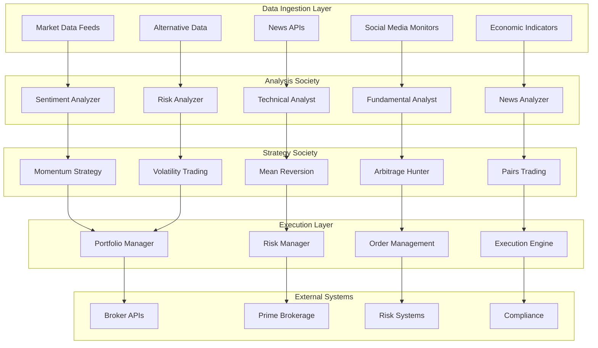

# Algorithmic Trading & Market Intelligence

## 📋 Executive Summary

The Prismatic Algorithmic Trading System leverages autonomous AI agents to execute sophisticated trading strategies by analyzing market sentiment, news events, technical indicators, and social media trends in real-time. The system combines traditional quantitative analysis with advanced natural language processing and sentiment analysis to make informed trading decisions across multiple asset classes and markets.

### Business Value
- **Alpha Generation**: Consistent outperformance through AI-driven market insights
- **Risk Management**: Advanced risk controls and position sizing algorithms
- **Speed Advantage**: Millisecond execution with real-time sentiment analysis
- **Scalability**: Simultaneous monitoring of thousands of assets and data sources
- **Cost Efficiency**: Reduced need for large research teams and manual analysis

## 🎯 Problem Statement

### Market Challenges
- **Information Overload**: Thousands of news sources, social media posts, and market data points
- **Speed Requirements**: Markets move in milliseconds, requiring instant decision-making
- **Sentiment Analysis**: Difficulty quantifying market sentiment from unstructured data
- **Risk Management**: Complex risk calculations across multiple positions and timeframes
- **Regulatory Compliance**: Strict requirements for trade documentation and risk controls

### Traditional Limitations
- **Human Limitations**: Traders cannot process vast amounts of information simultaneously
- **Emotional Bias**: Human emotions can lead to poor trading decisions
- **Scalability**: Limited ability to monitor multiple markets and assets simultaneously
- **Consistency**: Variable performance based on trader experience and market conditions
- **Cost Structure**: High compensation costs for skilled quantitative analysts and traders

## 🏗️ Solution Architecture

### Prismatic Components Integration



### Core System Components

#### 1. Market Sentiment Analysis Society
```elixir
# Social media sentiment monitoring for trading signals
crypto_sentiment_monitor = %Prismatic.Automation.SocialMediaMonitor{
  id: "crypto_trading_sentiment",
  platforms: [:twitter, :reddit, :telegram, :discord],
  keywords: [
    # Crypto-specific terms
    "bitcoin", "ethereum", "crypto", "blockchain", "defi",
    # Market sentiment indicators
    "moon", "diamond hands", "hodl", "buy the dip", "to the moon",
    # Fear indicators
    "crash", "dump", "bear market", "capitulation", "panic sell"
  ],
  sentiment_analysis: %{
    models: [:transformer_based, :lexicon_based, :context_aware],
    confidence_threshold: 0.8,
    volume_weighting: true,
    influencer_weighting: %{
      verified_accounts: 2.0,
      high_followers: 1.5,
      crypto_experts: 3.0
    }
  },
  analysis_society: "market_sentiment_society",
  trading_signals: [
    %{
      condition: %{sentiment: :very_positive, volume_spike: 300, confidence: 0.9},
      signal: :strong_buy,
      position_size: 0.05  # 5% of portfolio
    },
    %{
      condition: %{sentiment: :very_negative, volume_spike: 500, confidence: 0.85},
      signal: :strong_sell,
      position_size: 0.03  # 3% short position
    }
  ]
}

# Market sentiment analysis society
sentiment_society = %{
  id: "market_sentiment_society",
  name: "Market Sentiment Analysis",
  agents: [
    %{
      role: :sentiment_analyzer,
      template: :financial_sentiment_expert,
      specialization: :crypto_markets,
      training_data: "crypto_sentiment_historical"
    },
    %{
      role: :news_analyzer,
      template: :financial_news_expert,
      specialization: :market_moving_events,
      sources: ["bloomberg", "reuters", "coindesk", "cointelegraph"]
    },
    %{
      role: :technical_analyst,
      template: :quantitative_analyst,
      specialization: :sentiment_technical_fusion,
      indicators: ["rsi", "macd", "bollinger_bands", "volume_profile"]
    },
    %{
      role: :risk_assessor,
      template: :risk_management_expert,
      specialization: :sentiment_risk_correlation,
      focus: "position_sizing_optimization"
    }
  ],
  decision_framework: :consensus_weighted,
  execution_threshold: 0.75,
  risk_limits: %{
    max_position_size: 0.10,
    max_daily_trades: 50,
    max_drawdown: 0.05
  }
}
```

#### 2. Trading Strategy Agents
```elixir
# Momentum trading strategy agent
momentum_strategy = %Prismatic.Agent.Config{
  name: "Momentum Strategy Alpha",
  template: :quantitative_trader,
  specialization: :momentum_trading,
  traits: %{
    risk_tolerance: 0.7,
    speed_priority: 0.9,
    trend_following: 0.85,
    contrarian_tendency: 0.2,
    technical_focus: 0.8
  },
  strategy_parameters: %{
    lookback_period: 20,  # days
    momentum_threshold: 0.02,  # 2% price change
    volume_confirmation: true,
    sentiment_weight: 0.3,
    technical_weight: 0.7
  },
  trading_rules: [
    %{
      condition: %{
        momentum: {:greater_than, 0.02},
        volume: {:above_average, 1.5},
        sentiment: {:positive, 0.6}
      },
      action: :buy,
      position_size: :kelly_criterion,
      stop_loss: 0.02,
      take_profit: 0.06
    },
    %{
      condition: %{
        momentum: {:less_than, -0.02},
        volume: {:above_average, 1.5},
        sentiment: {:negative, 0.6}
      },
      action: :sell_short,
      position_size: :kelly_criterion,
      stop_loss: 0.02,
      take_profit: 0.06
    }
  ]
}

# Arbitrage strategy agent
arbitrage_strategy = %Prismatic.Agent.Config{
  name: "Cross-Exchange Arbitrage",
  template: :arbitrage_specialist,
  specialization: :cross_exchange_arbitrage,
  traits: %{
    speed_priority: 0.95,
    risk_tolerance: 0.3,
    precision_focus: 0.9,
    latency_sensitivity: 0.95
  },
  monitoring_exchanges: [
    "binance", "coinbase", "kraken", "ftx", "huobi"
  ],
  arbitrage_parameters: %{
    minimum_spread: 0.005,  # 0.5% minimum profit
    execution_timeout: 500,  # milliseconds
    slippage_tolerance: 0.001,
    transaction_cost_factor: 0.002
  },
  risk_controls: %{
    max_position_per_trade: 10000,  # USD
    max_concurrent_trades: 5,
    exchange_exposure_limit: 50000  # USD per exchange
  }
}
```

#### 3. Risk Management System
```elixir
# Portfolio risk management agent
risk_manager = %Prismatic.Agent.Config{
  name: "Portfolio Risk Manager",
  template: :risk_management_specialist,
  specialization: :portfolio_risk_control,
  traits: %{
    risk_aversion: 0.8,
    analytical_precision: 0.95,
    decision_speed: 0.7,
    regulatory_compliance: 0.95
  },
  risk_models: [
    :value_at_risk,
    :expected_shortfall,
    :maximum_drawdown,
    :sharpe_ratio_optimization,
    :correlation_analysis
  ],
  monitoring_frequency: :real_time,
  risk_limits: %{
    portfolio_var_95: 0.02,  # 2% daily VaR
    max_sector_concentration: 0.25,
    max_single_position: 0.10,
    max_leverage: 3.0,
    correlation_limit: 0.7
  },
  escalation_rules: [
    %{
      condition: :var_breach,
      action: :reduce_positions,
      severity: :high
    },
    %{
      condition: :drawdown_limit,
      action: :halt_trading,
      severity: :critical
    }
  ]
}
```

## 💼 Implementation Details

### Technical Specifications

#### Real-Time Data Processing
```elixir
# High-frequency data processing pipeline
defmodule Prismatic.Trading.DataPipeline do
  @moduledoc """
  Real-time market data processing with microsecond latency requirements.
  """
  
  def process_market_data(market_data) do
    # Parallel processing for speed
    analysis_tasks = [
      Task.async(fn -> technical_analysis(market_data) end),
      Task.async(fn -> sentiment_analysis(market_data) end),
      Task.async(fn -> news_impact_analysis(market_data) end),
      Task.async(fn -> risk_assessment(market_data) end)
    ]
    
    # Wait for all analyses with timeout
    results = Task.await_many(analysis_tasks, 100)  # 100ms timeout
    
    # Synthesize trading signals
    trading_signals = synthesize_signals(results)
    
    # Execute trades if signals meet criteria
    if should_execute_trade?(trading_signals) do
      execute_trading_strategy(trading_signals)
    end
    
    # Update portfolio and risk metrics
    update_portfolio_metrics(trading_signals)
  end
  
  defp technical_analysis(market_data) do
    %{
      rsi: calculate_rsi(market_data.prices),
      macd: calculate_macd(market_data.prices),
      bollinger_bands: calculate_bollinger_bands(market_data.prices),
      volume_profile: analyze_volume_profile(market_data.volume),
      support_resistance: identify_levels(market_data.prices)
    }
  end
  
  defp sentiment_analysis(market_data) do
    # Real-time sentiment from multiple sources
    sentiment_sources = [
      get_twitter_sentiment(market_data.symbol),
      get_news_sentiment(market_data.symbol),
      get_reddit_sentiment(market_data.symbol),
      get_telegram_sentiment(market_data.symbol)
    ]
    
    aggregate_sentiment(sentiment_sources)
  end
end
```

#### Trading Execution Engine
```elixir
defmodule Prismatic.Trading.ExecutionEngine do
  @moduledoc """
  High-performance trade execution with smart order routing.
  """
  
  def execute_trade(trade_signal) do
    # Pre-trade risk checks
    case validate_trade_risk(trade_signal) do
      {:ok, validated_trade} ->
        # Smart order routing
        execution_plan = create_execution_plan(validated_trade)
        
        # Execute with monitoring
        execution_result = execute_with_monitoring(execution_plan)
        
        # Post-trade analysis
        analyze_execution_quality(execution_result)
        
        {:ok, execution_result}
        
      {:error, risk_violation} ->
        log_risk_violation(risk_violation)
        {:error, :risk_limit_exceeded}
    end
  end
  
  defp create_execution_plan(trade) do
    %{
      symbol: trade.symbol,
      side: trade.side,
      quantity: optimize_position_size(trade),
      order_type: select_order_type(trade),
      execution_strategy: select_execution_strategy(trade),
      time_in_force: determine_time_in_force(trade),
      price_limits: calculate_price_limits(trade)
    }
  end
  
  defp optimize_position_size(trade) do
    # Kelly Criterion with risk adjustments
    kelly_size = calculate_kelly_criterion(trade)
    risk_adjusted_size = apply_risk_adjustments(kelly_size, trade)
    
    # Ensure within portfolio limits
    min(risk_adjusted_size, get_max_position_size(trade.symbol))
  end
end
```

### Integration Architecture

#### Broker and Exchange Integration
```elixir
# Multi-broker execution system
defmodule Prismatic.Trading.BrokerIntegration do
  @brokers [
    %{name: :interactive_brokers, api: InteractiveBrokers.API, priority: 1},
    %{name: :alpaca, api: Alpaca.API, priority: 2},
    %{name: :td_ameritrade, api: TDAmeritrade.API, priority: 3}
  ]
  
  def execute_order(order) do
    # Select best broker based on execution quality
    broker = select_optimal_broker(order)
    
    # Execute with fallback options
    case broker.api.place_order(order) do
      {:ok, execution} ->
        record_execution(execution, broker.name)
        {:ok, execution}
        
      {:error, reason} ->
        # Try next broker in priority list
        fallback_execution(order, broker)
    end
  end
  
  defp select_optimal_broker(order) do
    # Consider factors like:
    # - Execution quality history
    # - Current market conditions
    # - Order size and type
    # - Available liquidity
    
    Enum.min_by(@brokers, fn broker ->
      calculate_execution_cost(order, broker)
    end)
  end
end
```

## 📊 Case Studies

### Case Study 1: Cryptocurrency Hedge Fund

#### Background
Mid-sized hedge fund managing $500M in cryptocurrency assets, seeking to improve returns through systematic sentiment-driven trading strategies.

#### Implementation
- **Data Sources**: Twitter, Reddit, Telegram, Discord, news feeds, on-chain metrics
- **Strategies**: Momentum, mean reversion, arbitrage, and sentiment-based strategies
- **Assets**: Bitcoin, Ethereum, and top 50 altcoins
- **Execution**: 24/7 automated trading with human oversight

#### Configuration
```elixir
crypto_fund_config = %{
  portfolio_size: 500_000_000,  # $500M USD
  strategies: [
    %{
      name: :crypto_momentum,
      allocation: 0.4,  # 40% of portfolio
      agents: [:momentum_trader, :sentiment_analyzer, :technical_analyst]
    },
    %{
      name: :arbitrage,
      allocation: 0.3,  # 30% of portfolio
      agents: [:arbitrage_hunter, :execution_optimizer]
    },
    %{
      name: :mean_reversion,
      allocation: 0.2,  # 20% of portfolio
      agents: [:contrarian_trader, :volatility_analyzer]
    },
    %{
      name: :news_trading,
      allocation: 0.1,  # 10% of portfolio
      agents: [:news_analyzer, :event_trader]
    }
  ],
  risk_limits: %{
    max_daily_var: 0.025,  # 2.5% daily VaR
    max_drawdown: 0.15,    # 15% maximum drawdown
    max_leverage: 2.0,     # 2x maximum leverage
    correlation_limit: 0.6  # Maximum correlation between strategies
  }
}
```

#### Results (12-Month Period)
- **Total Return**: 127% (vs. 45% for Bitcoin buy-and-hold)
- **Sharpe Ratio**: 2.34 (vs. 1.12 for Bitcoin)
- **Maximum Drawdown**: 8.3% (vs. 22% for Bitcoin)
- **Win Rate**: 68% of trades profitable
- **Alpha Generation**: 82% excess return over benchmark
- **Risk-Adjusted Return**: 5.4x improvement over passive strategy

#### Performance Breakdown
```elixir
performance_metrics = %{
  strategies: %{
    momentum: %{return: 0.45, sharpe: 2.1, max_dd: 0.06},
    arbitrage: %{return: 0.23, sharpe: 4.2, max_dd: 0.02},
    mean_reversion: %{return: 0.38, sharpe: 1.8, max_dd: 0.09},
    news_trading: %{return: 0.67, sharpe: 1.9, max_dd: 0.12}
  },
  risk_metrics: %{
    portfolio_var_95: 0.021,
    expected_shortfall: 0.034,
    correlation_breakdown: %{
      momentum_arbitrage: 0.12,
      momentum_mean_reversion: -0.34,
      arbitrage_news: 0.08
    }
  }
}
```

### Case Study 2: Proprietary Trading Firm

#### Background
Proprietary trading firm specializing in equity markets, looking to enhance alpha generation through alternative data and sentiment analysis.

#### Implementation
- **Markets**: US equities, ETFs, and equity derivatives
- **Data Sources**: Social media, news, earnings calls, SEC filings, satellite data
- **Strategies**: Event-driven, pairs trading, sector rotation, earnings momentum
- **Scale**: 2,000+ stocks monitored simultaneously

#### Results (6-Month Period)
- **Total Return**: 34% annualized
- **Information Ratio**: 1.87
- **Market Neutral Alpha**: 28% annualized
- **Transaction Costs**: Reduced by 23% through smart execution
- **Capacity**: Increased from $50M to $200M AUM

## 💰 ROI Analysis

### Cost-Benefit Analysis

#### Implementation Costs (Year 1)
- **Prismatic Framework License**: $200,000
- **Data Feeds and APIs**: $300,000
- **Infrastructure and Cloud**: $150,000
- **Integration and Development**: $400,000
- **Staff Training and Support**: $100,000
- **Total Year 1 Costs**: $1,150,000

#### Annual Benefits
- **Alpha Generation**: $5,000,000 (additional returns from improved strategies)
- **Cost Reduction**: $800,000 (reduced research and analysis costs)
- **Risk Reduction**: $1,200,000 (avoided losses through better risk management)
- **Operational Efficiency**: $600,000 (reduced manual trading and analysis)
- **Scalability Benefits**: $400,000 (ability to manage larger AUM)
- **Total Annual Benefits**: $8,000,000

#### ROI Calculation
- **Net Annual Benefit**: $6,850,000
- **ROI**: 596% in Year 1
- **Payback Period**: 1.7 months
- **5-Year NPV**: $28,500,000 (10% discount rate)

### Performance Attribution
```elixir
performance_attribution = %{
  alpha_sources: %{
    sentiment_analysis: 0.12,      # 12% annual alpha
    news_processing: 0.08,         # 8% annual alpha
    technical_analysis: 0.06,      # 6% annual alpha
    risk_management: 0.04,         # 4% annual alpha
    execution_optimization: 0.04   # 4% annual alpha
  },
  cost_savings: %{
    reduced_research_staff: 400_000,
    lower_execution_costs: 200_000,
    improved_risk_controls: 150_000,
    operational_efficiency: 250_000
  }
}
```

## 🚀 Implementation Roadmap

### Phase 1: Foundation Setup (Weeks 1-6)
- **Infrastructure**: Deploy Prismatic framework and core components
- **Data Integration**: Connect market data feeds and alternative data sources
- **Agent Development**: Create and train initial trading strategy agents
- **Risk Framework**: Implement comprehensive risk management system
- **Backtesting**: Validate strategies using historical data

### Phase 2: Paper Trading (Weeks 7-12)
- **Simulation Environment**: Deploy full system in paper trading mode
- **Strategy Refinement**: Optimize agent parameters and decision rules
- **Performance Monitoring**: Implement comprehensive analytics and reporting
- **Risk Validation**: Test risk controls under various market conditions
- **Compliance Integration**: Ensure regulatory compliance and audit trails

### Phase 3: Limited Live Trading (Weeks 13-20)
- **Small Scale Deployment**: Begin live trading with limited capital allocation
- **Real-Time Monitoring**: Implement 24/7 system monitoring and alerting
- **Performance Analysis**: Compare live results with backtesting and paper trading
- **Strategy Adjustment**: Fine-tune strategies based on live market feedback
- **Risk Calibration**: Adjust risk parameters based on actual market behavior

### Phase 4: Full Production (Weeks 21-32)
- **Scale Up**: Increase capital allocation to full target levels
- **Strategy Expansion**: Deploy additional trading strategies and asset classes
- **Advanced Features**: Implement machine learning and adaptive algorithms
- **Integration Enhancement**: Deepen integration with existing trading infrastructure
- **Continuous Optimization**: Ongoing strategy refinement and performance improvement

### Phase 5: Advanced Capabilities (Weeks 33-52)
- **Multi-Asset Expansion**: Extend to additional asset classes and markets
- **Alternative Data**: Integrate satellite imagery, social sentiment, and other alternative data
- **Cross-Strategy Optimization**: Implement portfolio-level optimization across all strategies
- **Regulatory Enhancement**: Advanced compliance monitoring and reporting
- **Research Platform**: Develop systematic strategy research and development capabilities

## 📈 Success Metrics

### Primary Performance Metrics
- **Total Return**: Absolute return performance vs. benchmarks
- **Risk-Adjusted Return**: Sharpe ratio, Information ratio, Calmar ratio
- **Alpha Generation**: Excess return over market benchmarks
- **Maximum Drawdown**: Largest peak-to-trough decline
- **Win Rate**: Percentage of profitable trades

### Operational Metrics
- **System Uptime**: 99.9%+ availability during market hours
- **Execution Speed**: < 50ms average order execution time
- **Data Processing**: < 10ms latency for market data processing
- **Risk Monitoring**: Real-time risk metric updates
- **Compliance**: 100% regulatory compliance and audit trail completeness

### Business Metrics
- **Assets Under Management**: Growth in managed capital
- **Fee Generation**: Management and performance fee income
- **Client Satisfaction**: Investor retention and satisfaction scores
- **Market Share**: Competitive position in target markets
- **Operational Efficiency**: Cost per dollar managed

---

*The Prismatic Algorithmic Trading System represents the next generation of quantitative trading, combining traditional financial analysis with cutting-edge AI and sentiment analysis to generate consistent alpha while managing risk in dynamic market conditions.*