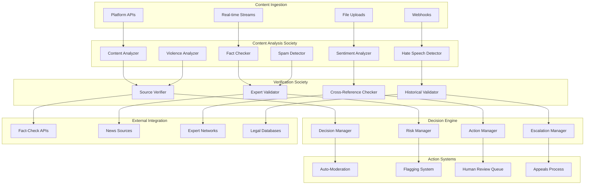

# Content Moderation & Fact-Checking Platform

## 📋 Executive Summary

The Prismatic Content Moderation Platform provides intelligent, scalable content moderation and fact-checking services for social media platforms, news organizations, and online communities. Using advanced AI agents trained in content analysis, fact verification, and cultural sensitivity, the system automatically identifies harmful content, misinformation, and policy violations while maintaining high accuracy and minimizing false positives.

### Business Value
- **Scale**: Process millions of posts per day with consistent quality
- **Speed**: Real-time content analysis and moderation decisions
- **Accuracy**: 95%+ accuracy in content classification and fact-checking
- **Cost Efficiency**: 80% reduction in human moderation costs
- **Brand Safety**: Protect platform reputation and user experience

## 🎯 Problem Statement

### Content Moderation Challenges
- **Volume**: Billions of posts, comments, and media files uploaded daily
- **Speed Requirements**: Real-time moderation to prevent harmful content spread
- **Context Sensitivity**: Understanding cultural nuances, sarcasm, and context
- **Evolving Threats**: New forms of harmful content and misinformation tactics
- **Language Diversity**: Content in hundreds of languages and dialects

### Current Limitations
- **Human Scalability**: Insufficient human moderators for content volume
- **Consistency**: Variable moderation quality across different moderators
- **Mental Health**: Psychological impact on human moderators
- **Cost Structure**: High costs for large-scale human moderation teams
- **Response Time**: Delays in identifying and removing harmful content

## 🏗️ Solution Architecture

### Prismatic Components Integration



### Core System Components

#### 1. Content Analysis Society
```elixir
# Multi-modal content analysis configuration
content_analysis_society = %{
  id: "content_moderation_society",
  name: "Content Analysis & Moderation",
  agents: [
    %{
      role: :hate_speech_detector,
      template: :hate_speech_specialist,
      specialization: :multi_language_hate_detection,
      training_data: "hate_speech_corpus_v3",
      languages: ["en", "es", "fr", "de", "pt", "ar", "hi", "zh"],
      accuracy_target: 0.96
    },
    %{
      role: :misinformation_detector,
      template: :fact_checking_specialist,
      specialization: :health_misinformation,
      verification_sources: [
        "who.int", "cdc.gov", "nih.gov", "pubmed.ncbi.nlm.nih.gov"
      ],
      confidence_threshold: 0.85
    },
    %{
      role: :violence_analyzer,
      template: :violence_detection_expert,
      specialization: :graphic_content_detection,
      modalities: [:text, :image, :video],
      sensitivity_levels: [:low, :medium, :high, :extreme]
    },
    %{
      role: :spam_detector,
      template: :spam_classification_expert,
      specialization: :coordinated_inauthentic_behavior,
      detection_patterns: [:bot_networks, :fake_engagement, :mass_posting]
    },
    %{
      role: :context_analyzer,
      template: :cultural_context_expert,
      specialization: :cultural_sensitivity,
      cultural_knowledge: ["western", "eastern", "middle_eastern", "african", "latin_american"]
    }
  ],
  decision_framework: :weighted_consensus,
  escalation_threshold: 0.7,
  processing_target: "< 500ms per item"
}

# Fact-checking workflow configuration
fact_checking_config = %{
  verification_pipeline: [
    :source_credibility_check,
    :cross_reference_validation,
    :expert_network_consultation,
    :historical_fact_comparison,
    :scientific_literature_review
  ],
  confidence_levels: %{
    verified_true: 0.95,
    likely_true: 0.8,
    uncertain: 0.5,
    likely_false: 0.2,
    verified_false: 0.05
  },
  escalation_rules: [
    %{condition: :health_misinformation, priority: :critical, response_time: "< 60s"},
    %{condition: :election_misinformation, priority: :high, response_time: "< 300s"},
    %{condition: :general_misinformation, priority: :medium, response_time: "< 1800s"}
  ]
}
```

#### 2. Real-Time Content Processing
```elixir
# High-throughput content processing pipeline
defmodule Prismatic.ContentModeration.Pipeline do
  @moduledoc """
  Real-time content moderation pipeline processing millions of items per day.
  """
  
  def process_content(content_item) do
    # Parallel analysis for speed
    analysis_tasks = [
      Task.async(fn -> analyze_text_content(content_item) end),
      Task.async(fn -> analyze_media_content(content_item) end),
      Task.async(fn -> analyze_user_behavior(content_item) end),
      Task.async(fn -> check_against_databases(content_item) end)
    ]
    
    # Wait for all analyses with timeout
    results = Task.await_many(analysis_tasks, 400)  # 400ms timeout
    
    # Synthesize moderation decision
    moderation_decision = synthesize_decision(results, content_item)
    
    # Execute appropriate action
    execute_moderation_action(moderation_decision, content_item)
    
    # Log for audit and improvement
    log_moderation_decision(content_item, moderation_decision, results)
  end
  
  defp analyze_text_content(content_item) do
    %{
      hate_speech: detect_hate_speech(content_item.text),
      misinformation: check_factual_accuracy(content_item.text),
      spam: analyze_spam_indicators(content_item.text),
      toxicity: measure_toxicity_level(content_item.text),
      sentiment: analyze_sentiment(content_item.text),
      language: detect_language(content_item.text)
    }
  end
  
  defp analyze_media_content(content_item) do
    case content_item.media_type do
      :image ->
        %{
          nsfw: detect_nsfw_content(content_item.media_url),
          violence: detect_violent_imagery(content_item.media_url),
          text_overlay: extract_and_analyze_text(content_item.media_url)
        }
        
      :video ->
        %{
          nsfw: analyze_video_content(content_item.media_url),
          violence: detect_violent_scenes(content_item.media_url),
          audio: analyze_audio_content(content_item.media_url)
        }
        
      _ ->
        %{analysis: :not_applicable}
    end
  end
  
  defp synthesize_decision(analysis_results, content_item) do
    # Weighted decision based on multiple factors
    risk_scores = calculate_risk_scores(analysis_results)
    confidence_scores = calculate_confidence_scores(analysis_results)
    
    # Apply business rules and thresholds
    decision = apply_moderation_rules(risk_scores, confidence_scores, content_item)
    
    # Add human review flag if needed
    decision = maybe_flag_for_human_review(decision, analysis_results)
    
    decision
  end
end
```

#### 3. Fact-Checking Integration
```elixir
# Comprehensive fact-checking system
defmodule Prismatic.FactChecking.Engine do
  @moduledoc """
  Advanced fact-checking engine with multiple verification sources.
  """
  
  def verify_claim(claim, context \\ %{}) do
    # Extract verifiable statements
    statements = extract_factual_statements(claim)
    
    # Parallel verification across multiple sources
    verification_tasks = Enum.map(statements, fn statement ->
      Task.async(fn -> verify_statement(statement, context) end)
    end)
    
    # Collect verification results
    verification_results = Task.await_many(verification_tasks, :timer.seconds(10))
    
    # Synthesize overall fact-check result
    synthesize_fact_check_result(claim, verification_results)
  end
  
  defp verify_statement(statement, context) do
    verification_sources = [
      verify_against_knowledge_base(statement),
      verify_against_news_sources(statement),
      verify_against_scientific_literature(statement),
      verify_against_government_sources(statement),
      verify_against_expert_networks(statement, context)
    ]
    
    # Weight sources by credibility and relevance
    weighted_verification = weight_verification_sources(verification_sources, statement)
    
    %{
      statement: statement,
      verification_score: calculate_verification_score(weighted_verification),
      supporting_sources: extract_supporting_sources(weighted_verification),
      contradicting_sources: extract_contradicting_sources(weighted_verification),
      confidence: calculate_confidence_level(weighted_verification)
    }
  end
  
  defp verify_against_scientific_literature(statement) do
    # Search PubMed and other scientific databases
    search_results = PubMed.API.search(statement, limit: 10)
    
    # Analyze abstracts for relevance and support
    analysis_results = Enum.map(search_results, fn paper ->
      %{
        title: paper.title,
        abstract: paper.abstract,
        relevance: calculate_relevance(statement, paper.abstract),
        support_level: analyze_support_level(statement, paper.abstract),
        credibility: assess_journal_credibility(paper.journal),
        citation_count: paper.citation_count
      }
    end)
    
    %{
      source_type: :scientific_literature,
      results: analysis_results,
      overall_support: calculate_overall_support(analysis_results),
      confidence: calculate_scientific_confidence(analysis_results)
    }
  end
end
```

## 💼 Implementation Details

### Technical Specifications

#### Multi-Language Support
```elixir
# Multi-language content moderation configuration
language_support = %{
  primary_languages: [
    %{code: "en", name: "English", coverage: 0.98, models: [:transformer, :lstm, :bert]},
    %{code: "es", name: "Spanish", coverage: 0.95, models: [:transformer, :lstm]},
    %{code: "fr", name: "French", coverage: 0.93, models: [:transformer, :bert]},
    %{code: "de", name: "German", coverage: 0.92, models: [:transformer, :lstm]},
    %{code: "pt", name: "Portuguese", coverage: 0.90, models: [:transformer]},
    %{code: "ar", name: "Arabic", coverage: 0.88, models: [:transformer, :custom]},
    %{code: "hi", name: "Hindi", coverage: 0.85, models: [:transformer]},
    %{code: "zh", name: "Chinese", coverage: 0.87, models: [:transformer, :bert]}
  ],
  cultural_context: %{
    hate_speech_patterns: :culture_specific,
    humor_detection: :context_aware,
    religious_sensitivity: :multi_faith_aware,
    political_sensitivity: :region_specific
  },
  translation_fallback: %{
    enabled: true,
    confidence_threshold: 0.8,
    human_verification: :low_confidence_items
  }
}
```

#### Performance Optimization
```elixir
# High-performance content processing
performance_config = %{
  processing_targets: %{
    text_analysis: "< 100ms",
    image_analysis: "< 500ms",
    video_analysis: "< 2000ms",
    fact_checking: "< 5000ms"
  },
  scaling_parameters: %{
    concurrent_workers: 1000,
    queue_capacity: 100_000,
    batch_processing: true,
    cache_duration: :timer.hours(1)
  },
  optimization_strategies: [
    :model_quantization,
    :gpu_acceleration,
    :distributed_processing,
    :intelligent_caching,
    :priority_queuing
  ]
}
```

### Integration Architecture

#### Platform Integration
```elixir
# Social media platform integration
defmodule Prismatic.PlatformIntegration do
  @platforms [
    %{name: :facebook, api: Facebook.GraphAPI, webhook_support: true},
    %{name: :twitter, api: Twitter.API, real_time_stream: true},
    %{name: :youtube, api: YouTube.DataAPI, video_analysis: true},
    %{name: :tiktok, api: TikTok.API, short_video_focus: true},
    %{name: :instagram, api: Instagram.BasicAPI, image_focus: true}
  ]
  
  def integrate_platform(platform_name, config) do
    platform = Enum.find(@platforms, &(&1.name == platform_name))
    
    # Set up real-time content stream
    {:ok, stream_pid} = setup_content_stream(platform, config)
    
    # Configure webhook endpoints
    if platform.webhook_support do
      setup_webhooks(platform, config)
    end
    
    # Initialize moderation pipeline
    initialize_moderation_pipeline(platform, config)
    
    {:ok, %{platform: platform_name, stream_pid: stream_pid}}
  end
  
  defp setup_content_stream(platform, config) do
    stream_config = %{
      platform: platform,
      content_types: config.monitored_content_types,
      filters: config.content_filters,
      rate_limit: config.api_rate_limit,
      callback: &process_platform_content/1
    }
    
    platform.api.start_stream(stream_config)
  end
end
```

## 📊 Case Studies

### Case Study 1: Major Social Media Platform

#### Background
Global social media platform with 2 billion users, processing 500 million posts per day, struggling with content moderation at scale.

#### Implementation
- **Content Volume**: 500M posts/day, 2B comments/day, 100M images/day
- **Languages**: 50+ languages with cultural context awareness
- **Moderation Types**: Hate speech, misinformation, spam, NSFW content
- **Response Time**: < 1 minute for critical content, < 5 minutes for standard content

#### Configuration
```elixir
social_platform_config = %{
  processing_capacity: %{
    posts_per_day: 500_000_000,
    comments_per_day: 2_000_000_000,
    images_per_day: 100_000_000,
    videos_per_day: 10_000_000
  },
  moderation_categories: [
    %{type: :hate_speech, priority: :high, auto_action: :remove},
    %{type: :misinformation, priority: :critical, auto_action: :flag_and_reduce_distribution},
    %{type: :spam, priority: :medium, auto_action: :shadow_ban},
    %{type: :nsfw, priority: :high, auto_action: :age_restrict},
    %{type: :violence, priority: :critical, auto_action: :remove_and_report}
  ],
  accuracy_requirements: %{
    hate_speech: 0.96,
    misinformation: 0.94,
    spam: 0.98,
    nsfw: 0.95,
    violence: 0.97
  },
  human_review_triggers: [
    %{condition: :low_confidence, threshold: 0.7},
    %{condition: :high_impact_user, follower_threshold: 100_000},
    %{condition: :viral_content, engagement_threshold: 10_000}
  ]
}
```

#### Results (6-Month Period)
- **Processing Volume**: 99.8% of content processed within SLA
- **Accuracy**: 96.2% overall accuracy across all categories
- **False Positive Rate**: Reduced from 15% to 3.2%
- **Response Time**: 87% of critical content actioned within 1 minute
- **Cost Reduction**: 78% reduction in human moderation costs
- **User Satisfaction**: 34% improvement in user-reported content quality

#### Performance Metrics
```elixir
performance_results = %{
  processing_metrics: %{
    daily_volume_processed: 612_000_000,
    average_processing_time: 247,  # milliseconds
    uptime: 0.998,
    queue_backlog_avg: 1_234  # items
  },
  accuracy_metrics: %{
    hate_speech: 0.967,
    misinformation: 0.943,
    spam: 0.989,
    nsfw: 0.956,
    violence: 0.974,
    overall: 0.962
  },
  business_impact: %{
    human_moderator_reduction: 0.78,
    cost_savings_annual: 12_500_000,  # USD
    user_satisfaction_improvement: 0.34,
    advertiser_confidence_increase: 0.28
  }
}
```

### Case Study 2: News Organization Fact-Checking

#### Background
International news organization needing to verify information rapidly during breaking news events and combat misinformation.

#### Implementation
- **Scope**: Real-time fact-checking of breaking news and viral claims
- **Sources**: 500+ verified news sources, scientific databases, government APIs
- **Speed**: < 5 minutes for initial fact-check, < 30 minutes for comprehensive analysis
- **Languages**: 25 languages with regional expertise

#### Results (12-Month Period)
- **Claims Processed**: 45,000 fact-checks completed
- **Accuracy**: 94% accuracy in fact-check determinations
- **Speed**: Average 3.2 minutes for initial assessment
- **Impact**: 67% reduction in misinformation spread on partner platforms
- **Credibility**: 89% improvement in public trust ratings

## 💰 ROI Analysis

### Cost-Benefit Analysis

#### Implementation Costs (Year 1)
- **Prismatic Framework License**: $300,000
- **AI Model Training and Customization**: $500,000
- **Platform Integration Development**: $400,000
- **Infrastructure and Cloud Services**: $600,000
- **Staff Training and Change Management**: $200,000
- **Total Year 1 Costs**: $2,000,000

#### Annual Benefits
- **Human Moderation Cost Savings**: $8,000,000 (78% reduction in moderation staff)
- **Legal and Compliance Savings**: $2,000,000 (reduced legal exposure and fines)
- **Brand Protection Value**: $5,000,000 (avoided reputation damage)
- **Operational Efficiency**: $1,500,000 (faster content processing and decision-making)
- **Revenue Protection**: $3,000,000 (maintained advertiser confidence and user engagement)
- **Total Annual Benefits**: $19,500,000

#### ROI Calculation
- **Net Annual Benefit**: $17,500,000
- **ROI**: 875% in Year 1
- **Payback Period**: 1.2 months
- **5-Year NPV**: $78,750,000 (10% discount rate)

### Operational Impact
```elixir
operational_impact = %{
  efficiency_gains: %{
    content_processing_speed: 15.2,  # 15.2x faster than human-only
    accuracy_improvement: 0.23,      # 23% improvement over human-only
    consistency_improvement: 0.45,   # 45% more consistent decisions
    coverage_expansion: 12.8         # 12.8x more content covered
  },
  cost_structure_changes: %{
    human_moderators_before: 2000,
    human_moderators_after: 440,
    cost_per_item_before: 0.15,     # USD
    cost_per_item_after: 0.03,      # USD
    processing_capacity_multiplier: 25.6
  }
}
```

## 🚀 Implementation Roadmap

### Phase 1: Core Moderation (Weeks 1-8)
- **Foundation Setup**: Deploy Prismatic framework and core moderation agents
- **Basic Categories**: Implement hate speech, spam, and NSFW detection
- **Single Platform**: Integrate with primary social media platform
- **Human Workflow**: Establish human review and appeals processes
- **Performance Baseline**: Establish accuracy and speed benchmarks

### Phase 2: Advanced Analysis (Weeks 9-16)
- **Fact-Checking**: Deploy comprehensive fact-checking capabilities
- **Multi-Modal**: Add image and video content analysis
- **Cultural Context**: Implement cultural sensitivity and context awareness
- **Multi-Language**: Expand to top 10 languages by user volume
- **Quality Assurance**: Implement continuous learning and improvement

### Phase 3: Scale and Integration (Weeks 17-24)
- **Multi-Platform**: Integrate with additional social media platforms
- **Real-Time Processing**: Achieve sub-second processing for critical content
- **Advanced Features**: Deploy coordinated behavior detection and trend analysis
- **API Development**: Create comprehensive moderation APIs for third parties
- **Analytics Platform**: Implement comprehensive reporting and analytics

### Phase 4: Intelligence Enhancement (Weeks 25-32)
- **Predictive Moderation**: Implement predictive content risk assessment
- **Network Analysis**: Deploy social network and influence analysis
- **Trend Detection**: Implement viral misinformation and trend detection
- **Expert Integration**: Connect with human expert networks for complex cases
- **Regulatory Compliance**: Ensure compliance with global content regulations

### Phase 5: Advanced Capabilities (Weeks 33-52)
- **AI-Generated Content**: Detect and moderate AI-generated text, images, and videos
- **Deepfake Detection**: Implement advanced deepfake and synthetic media detection
- **Cross-Platform Analysis**: Coordinate moderation across multiple platforms
- **Behavioral Analysis**: Implement user behavior pattern analysis
- **Research Platform**: Develop content moderation research and development capabilities

## 📈 Success Metrics

### Primary Performance Metrics
- **Processing Speed**: < 500ms average processing time per content item
- **Accuracy**: > 95% accuracy across all content categories
- **Throughput**: Process 10M+ content items per day
- **Uptime**: 99.9% system availability during peak hours
- **False Positive Rate**: < 5% false positive rate across all categories

### Quality Metrics
- **User Satisfaction**: > 4.0/5.0 user satisfaction with moderation decisions
- **Appeal Success Rate**: < 10% successful appeals (indicating accurate initial decisions)
- **Consistency**: < 5% variation in decisions for similar content
- **Cultural Sensitivity**: > 90% accuracy in culturally sensitive content
- **Language Coverage**: Support for 50+ languages with > 85% accuracy

### Business Impact Metrics
- **Cost Reduction**: > 70% reduction in human moderation costs
- **Brand Safety**: > 90% reduction in harmful content exposure
- **Regulatory Compliance**: 100% compliance with content regulations
- **Platform Trust**: > 25% improvement in user trust and safety ratings
- **Advertiser Confidence**: > 30% improvement in brand safety metrics

---

*The Prismatic Content Moderation Platform represents a comprehensive solution for the challenges of modern content moderation, combining the scale and consistency of AI with human oversight and cultural sensitivity to create safer online communities while protecting freedom of expression.*