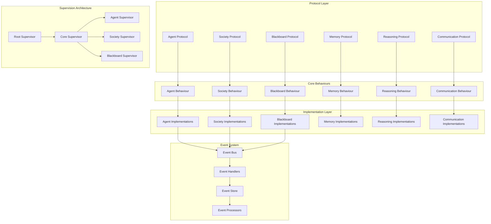

# 🏔️ Bulletproof Prismatic Foundations: SOLID-Compliant Architecture

## 📋 Executive Summary

This document presents the enhanced architectural foundations for Prismatic, designed to be rock-solid, robust, modular, composable, SOLID-compliant, and perfectly suited for alpine-style incremental implementation. The architecture leverages advanced Elixir/BEAM features, functional programming principles, and comprehensive testing strategies.

## 🎯 Core Architectural Principles

### 1. **Protocol-Driven Design**
- **Elixir Protocols**: Polymorphic dispatch for extensible behavior
- **Behaviour Contracts**: Strict interface definitions with compile-time guarantees
- **Type Specifications**: Comprehensive Dialyzer support for static analysis
- **Pattern Matching**: Exhaustive case handling with compiler warnings

### 2. **SOLID Compliance**
- **Single Responsibility**: Each module has one clear, well-defined purpose
- **Open/Closed**: Extensible through protocols without modifying existing code
- **Liskov Substitution**: Protocol implementations are fully interchangeable
- **Interface Segregation**: Focused, minimal protocol definitions
- **Dependency Inversion**: Depend on protocols, not concrete implementations

### 3. **Fault-Tolerant Architecture**
- **Supervision Trees**: Hierarchical fault isolation and recovery
- **Circuit Breakers**: Prevent cascade failures with intelligent backoff
- **Bulkheads**: Resource isolation to contain failures
- **Timeouts**: Comprehensive timeout handling at all levels
- **Graceful Degradation**: System continues operating with reduced functionality

## 🏗️ Enhanced System Architecture



## 🧬 Protocol-Based Architecture

### Core Agent Protocol

```elixir
defprotocol Prismatic.Agent.Protocol do
  @moduledoc """
  Core protocol defining agent behavior contracts.
  
  This protocol ensures all agent implementations provide consistent
  interfaces while allowing for diverse internal implementations.
  """
  
  @type agent_id :: String.t()
  @type message :: String.t()
  @type context :: map()
  @type response :: {:ok, String.t()} | {:error, term()}
  
  @doc """
  Process a message and generate a response.
  
  ## Parameters
  - agent: The agent implementation
  - message: Input message to process
  - context: Additional context for processing
  
  ## Returns
  - {:ok, response} on success
  - {:error, reason} on failure
  """
  @spec process_message(t(), message(), context()) :: response()
  def process_message(agent, message, context \\ %{})
  
  @doc """
  Retrieve agent's current state.
  """
  @spec get_state(t()) :: {:ok, map()} | {:error, term()}
  def get_state(agent)
  
  @doc """
  Update agent's configuration.
  """
  @spec update_config(t(), map()) :: {:ok, t()} | {:error, term()}
  def update_config(agent, config)
  
  @doc """
  Serialize agent state for persistence.
  """
  @spec serialize(t()) :: {:ok, binary()} | {:error, term()}
  def serialize(agent)
  
  @doc """
  Restore agent from serialized state.
  """
  @spec deserialize(binary()) :: {:ok, t()} | {:error, term()}
  def deserialize(data)
end
```

### Memory System Protocol

```elixir
defprotocol Prismatic.Memory.Protocol do
  @moduledoc """
  Protocol for memory system implementations.
  
  Supports multiple memory types with consistent interfaces:
  - Working memory (current context)
  - Episodic memory (experiences and events)
  - Semantic memory (facts and knowledge)
  - Procedural memory (skills and procedures)
  """
  
  @type memory_type :: :working | :episodic | :semantic | :procedural
  @type memory_key :: String.t()
  @type memory_value :: term()
  @type query :: map()
  
  @doc """
  Store information in memory.
  """
  @spec store(t(), memory_type(), memory_key(), memory_value()) :: 
    {:ok, t()} | {:error, term()}
  def store(memory, type, key, value)
  
  @doc """
  Retrieve information from memory.
  """
  @spec retrieve(t(), memory_type(), memory_key()) :: 
    {:ok, memory_value()} | {:error, :not_found} | {:error, term()}
  def retrieve(memory, type, key)
  
  @doc """
  Query memory with complex criteria.
  """
  @spec query(t(), memory_type(), query()) :: 
    {:ok, [memory_value()]} | {:error, term()}
  def query(memory, type, query)
  
  @doc """
  Consolidate memories (move from working to long-term).
  """
  @spec consolidate(t()) :: {:ok, t()} | {:error, term()}
  def consolidate(memory)
  
  @doc """
  Forget unused or expired memories.
  """
  @spec forget(t(), criteria :: map()) :: {:ok, t()} | {:error, term()}
  def forget(memory, criteria)
end
```

### Blackboard Communication Protocol

```elixir
defprotocol Prismatic.Blackboard.Protocol do
  @moduledoc """
  Protocol for distributed blackboard implementations.
  
  Provides pattern-based pub/sub with wildcard support,
  distributed storage, and conflict resolution.
  """
  
  @type key :: String.t()
  @type value :: term()
  @type pattern :: String.t()
  @type metadata :: map()
  @type subscription_id :: String.t()
  
  @doc """
  Write data to the blackboard.
  """
  @spec write(t(), key(), value(), metadata()) :: 
    {:ok, t()} | {:error, term()}
  def write(blackboard, key, value, metadata \\ %{})
  
  @doc """
  Read data from the blackboard.
  """
  @spec read(t(), key()) :: 
    {:ok, value()} | {:error, :not_found} | {:error, term()}
  def read(blackboard, key)
  
  @doc """
  Read data matching a pattern.
  """
  @spec read_pattern(t(), pattern()) :: 
    {:ok, [{key(), value()}]} | {:error, term()}
  def read_pattern(blackboard, pattern)
  
  @doc """
  Subscribe to pattern-based updates.
  """
  @spec subscribe(t(), pattern(), pid()) :: 
    {:ok, subscription_id()} | {:error, term()}
  def subscribe(blackboard, pattern, subscriber)
  
  @doc """
  Unsubscribe from updates.
  """
  @spec unsubscribe(t(), subscription_id()) :: 
    {:ok, t()} | {:error, term()}
  def unsubscribe(blackboard, subscription_id)
end
```

## 🏛️ Robust Supervision Architecture

### Hierarchical Supervision Tree

```elixir
defmodule Prismatic.Supervisor.Root do
  @moduledoc """
  Root supervisor implementing the supervision hierarchy.
  
  Uses different restart strategies for different subsystems:
  - :one_for_one for independent services
  - :one_for_all for tightly coupled components
  - :rest_for_one for dependent service chains
  """
  
  use Supervisor
  
  def start_link(init_arg) do
    Supervisor.start_link(__MODULE__, init_arg, name: __MODULE__)
  end
  
  @impl true
  def init(_init_arg) do
    children = [
      # Core infrastructure (must be stable)
      {Prismatic.Supervisor.Infrastructure, []},
      
      # Data layer (restart affects dependent services)
      {Prismatic.Supervisor.Data, []},
      
      # Core services (independent restart)
      {Prismatic.Supervisor.Core, []},
      
      # Application services (can restart independently)
      {Prismatic.Supervisor.Application, []},
      
      # Web interface (least critical, independent)
      {PrismaticWeb.Endpoint, []}
    ]
    
    # Use :rest_for_one to ensure proper startup order
    # and dependency management
    Supervisor.init(children, strategy: :rest_for_one)
  end
end

defmodule Prismatic.Supervisor.Core do
  @moduledoc """
  Core services supervisor with fault isolation.
  
  Each major subsystem is isolated to prevent cascade failures.
  Uses circuit breakers and bulkheads for additional protection.
  """
  
  use Supervisor
  
  def start_link(init_arg) do
    Supervisor.start_link(__MODULE__, init_arg, name: __MODULE__)
  end
  
  @impl true
  def init(_init_arg) do
    children = [
      # Event system (critical for communication)
      {Prismatic.EventBus, []},
      
      # Agent system with dynamic supervision
      {Prismatic.Agent.Supervisor, []},
      
      # Society system
      {Prismatic.Society.Supervisor, []},
      
      # Blackboard system
      {Prismatic.Blackboard.Supervisor, []},
      
      # Memory system
      {Prismatic.Memory.Supervisor, []},
      
      # Reasoning system
      {Prismatic.Reasoning.Supervisor, []}
    ]
    
    # Use :one_for_one for independent subsystems
    Supervisor.init(children, strategy: :one_for_one, max_restarts: 3, max_seconds: 5)
  end
end
```

### Fault-Tolerant Agent Supervision

```elixir
defmodule Prismatic.Agent.Supervisor do
  @moduledoc """
  Dynamic supervisor for agent processes with advanced fault tolerance.
  
  Features:
  - Automatic restart with exponential backoff
  - State persistence and recovery
  - Circuit breaker integration
  - Resource monitoring and limits
  """
  
  use DynamicSupervisor
  
  alias Prismatic.Agent.{Registry, Persistence, CircuitBreaker}
  
  def start_link(init_arg) do
    DynamicSupervisor.start_link(__MODULE__, init_arg, name: __MODULE__)
  end
  
  @impl true
  def init(_init_arg) do
    DynamicSupervisor.init(
      strategy: :one_for_one,
      max_restarts: 5,
      max_seconds: 60,
      max_children: 1000  # Resource limit
    )
  end
  
  @doc """
  Start an agent with fault tolerance and monitoring.
  """
  @spec start_agent(map()) :: 
    {:ok, pid()} | {:error, term()}
  def start_agent(config) do
    agent_spec = {
      Prismatic.Agent.Server,
      [config: config, supervisor: __MODULE__]
    }
    
    case DynamicSupervisor.start_child(__MODULE__, agent_spec) do
      {:ok, pid} = result ->
        # Register agent for monitoring and recovery
        Registry.register_agent(config.id, pid, config)
        
        # Set up circuit breaker
        CircuitBreaker.setup_for_agent(config.id)
        
        # Enable state persistence
        Persistence.enable_auto_save(config.id)
        
        result
        
      {:error, reason} = error ->
        Logger.error("Failed to start agent #{config.id}: #{inspect(reason)}")
        error
    end
  end
  
  @doc """
  Restart agent with state recovery.
  """
  @spec restart_agent(String.t()) :: 
    {:ok, pid()} | {:error, term()}
  def restart_agent(agent_id) do
    with {:ok, config} <- Persistence.load_agent_config(agent_id),
         {:ok, state} <- Persistence.load_agent_state(agent_id) do
      
      # Merge recovered state with config
      enhanced_config = Map.put(config, :recovered_state, state)
      
      start_agent(enhanced_config)
    end
  end
end
```

## ⚡ Event-Driven Architecture

### Comprehensive Event System

```elixir
defmodule Prismatic.EventBus do
  @moduledoc """
  High-performance event bus with pattern matching and fault tolerance.
  
  Features:
  - Pattern-based subscriptions with wildcards
  - Event sourcing and replay capabilities
  - Circuit breakers for event handlers
  - Dead letter queues for failed events
  - Event ordering and deduplication
  """
  
  use GenServer
  
  alias Prismatic.EventBus.{Subscription, Handler, CircuitBreaker, DeadLetter}
  
  defstruct [
    :subscriptions,
    :handlers,
    :circuit_breakers,
    :event_store,
    :dead_letter_queue
  ]
  
  ## Client API
  
  def start_link(opts \\ []) do
    GenServer.start_link(__MODULE__, opts, name: __MODULE__)
  end
  
  @doc """
  Publish an event to the bus.
  """
  @spec publish(String.t(), term(), map()) :: :ok | {:error, term()}
  def publish(event_type, payload, metadata \\ %{}) do
    event = %{
      id: generate_event_id(),
      type: event_type,
      payload: payload,
      metadata: Map.put(metadata, :timestamp, DateTime.utc_now()),
      correlation_id: Map.get(metadata, :correlation_id, generate_correlation_id())
    }
    
    GenServer.call(__MODULE__, {:publish, event})
  end
  
  @doc """
  Subscribe to events matching a pattern.
  """
  @spec subscribe(String.t(), pid() | module()) :: 
    {:ok, reference()} | {:error, term()}
  def subscribe(pattern, handler) do
    GenServer.call(__MODULE__, {:subscribe, pattern, handler})
  end
  
  @doc """
  Unsubscribe from events.
  """
  @spec unsubscribe(reference()) :: :ok
  def unsubscribe(subscription_ref) do
    GenServer.call(__MODULE__, {:unsubscribe, subscription_ref})
  end
  
  ## Server Implementation
  
  @impl true
  def init(_opts) do
    state = %__MODULE__{
      subscriptions: %{},
      handlers: %{},
      circuit_breakers: %{},
      event_store: Prismatic.EventStore.new(),
      dead_letter_queue: Prismatic.DeadLetterQueue.new()
    }
    
    {:ok, state}
  end
  
  @impl true
  def handle_call({:publish, event}, _from, state) do
    # Store event for replay capability
    updated_store = Prismatic.EventStore.append(state.event_store, event)
    
    # Find matching subscriptions
    matching_subs = find_matching_subscriptions(event.type, state.subscriptions)
    
    # Dispatch to handlers with circuit breaker protection
    dispatch_results = Enum.map(matching_subs, fn {handler, _pattern} ->
      dispatch_with_circuit_breaker(handler, event, state.circuit_breakers)
    end)
    
    # Handle failed dispatches
    failed_dispatches = Enum.filter(dispatch_results, &match?({:error, _}, &1))
    updated_dlq = handle_failed_dispatches(failed_dispatches, event, state.dead_letter_queue)
    
    updated_state = %{state | 
      event_store: updated_store,
      dead_letter_queue: updated_dlq
    }
    
    {:reply, :ok, updated_state}
  end
  
  @impl true
  def handle_call({:subscribe, pattern, handler}, _from, state) do
    subscription_ref = make_ref()
    
    updated_subscriptions = Map.put(
      state.subscriptions, 
      subscription_ref, 
      {handler, pattern}
    )
    
    # Initialize circuit breaker for handler
    updated_breakers = Map.put(
      state.circuit_breakers,
      handler,
      CircuitBreaker.new(handler)
    )
    
    updated_state = %{state |
      subscriptions: updated_subscriptions,
      circuit_breakers: updated_breakers
    }
    
    {:reply, {:ok, subscription_ref}, updated_state}
  end
  
  # Private helper functions
  
  defp find_matching_subscriptions(event_type, subscriptions) do
    Enum.filter(subscriptions, fn {_ref, {_handler, pattern}} ->
      pattern_matches?(event_type, pattern)
    end)
    |> Enum.map(fn {_ref, {handler, pattern}} -> {handler, pattern} end)
  end
  
  defp pattern_matches?(event_type, pattern) do
    # Support wildcards: "agent.*", "society.*.message", etc.
    regex_pattern = 
      pattern
      |> String.replace("*", ".*")
      |> Regex.compile!()
    
    Regex.match?(regex_pattern, event_type)
  end
  
  defp dispatch_with_circuit_breaker(handler, event, circuit_breakers) do
    breaker = Map.get(circuit_breakers, handler)
    
    CircuitBreaker.call(breaker, fn ->
      Handler.handle_event(handler, event)
    end)
  end
  
  defp handle_failed_dispatches(failed_dispatches, event, dlq) do
    Enum.reduce(failed_dispatches, dlq, fn {:error, reason}, acc_dlq ->
      DeadLetter.add(acc_dlq, event, reason)
    end)
  end
  
  defp generate_event_id, do: UUID.uuid4()
  defp generate_correlation_id, do: UUID.uuid4()
end
```

### Circuit Breaker Implementation

```elixir
defmodule Prismatic.EventBus.CircuitBreaker do
  @moduledoc """
  Circuit breaker implementation for event handlers.
  
  Prevents cascade failures by monitoring handler performance
  and temporarily disabling failing handlers.
  """
  
  defstruct [
    :name,
    :state,           # :closed, :open, :half_open
    :failure_count,
    :success_count,
    :last_failure_time,
    :failure_threshold,
    :recovery_timeout,
    :success_threshold
  ]
  
  @type t :: %__MODULE__{}
  @type state :: :closed | :open | :half_open
  
  @default_failure_threshold 5
  @default_recovery_timeout :timer.seconds(60)
  @default_success_threshold 3
  
  @spec new(term()) :: t()
  def new(name, opts \\ []) do
    %__MODULE__{
      name: name,
      state: :closed,
      failure_count: 0,
      success_count: 0,
      last_failure_time: nil,
      failure_threshold: Keyword.get(opts, :failure_threshold, @default_failure_threshold),
      recovery_timeout: Keyword.get(opts, :recovery_timeout, @default_recovery_timeout),
      success_threshold: Keyword.get(opts, :success_threshold, @default_success_threshold)
    }
  end
  
  @spec call(t(), function()) :: {:ok, term()} | {:error, term()}
  def call(%__MODULE__{state: :open} = breaker, _fun) do
    if should_attempt_reset?(breaker) do
      # Transition to half-open and try the call
      half_open_breaker = %{breaker | state: :half_open, success_count: 0}
      attempt_call(half_open_breaker, _fun)
    else
      {:error, :circuit_breaker_open}
    end
  end
  
  def call(%__MODULE__{state: :closed} = breaker, fun) do
    attempt_call(breaker, fun)
  end
  
  def call(%__MODULE__{state: :half_open} = breaker, fun) do
    attempt_call(breaker, fun)
  end
  
  defp attempt_call(breaker, fun) do
    try do
      result = fun.()
      handle_success(breaker, result)
    rescue
      error ->
        handle_failure(breaker, error)
    catch
      :exit, reason ->
        handle_failure(breaker, reason)
    end
  end
  
  defp handle_success(%__MODULE__{state: :half_open} = breaker, result) do
    updated_breaker = %{breaker | success_count: breaker.success_count + 1}
    
    if updated_breaker.success_count >= breaker.success_threshold do
      # Reset to closed state
      reset_breaker = %{updated_breaker | 
        state: :closed, 
        failure_count: 0, 
        success_count: 0
      }
      
      Logger.info("Circuit breaker #{breaker.name} reset to closed state")
      {:ok, result}
    else
      {:ok, result}
    end
  end
  
  defp handle_success(breaker, result) do
    # In closed state, just return success
    {:ok, result}
  end
  
  defp handle_failure(breaker, error) do
    updated_breaker = %{breaker | 
      failure_count: breaker.failure_count + 1,
      last_failure_time: DateTime.utc_now()
    }
    
    if updated_breaker.failure_count >= breaker.failure_threshold do
      # Trip the circuit breaker
      open_breaker = %{updated_breaker | state: :open}
      Logger.warn("Circuit breaker #{breaker.name} tripped to open state")
      {:error, error}
    else
      {:error, error}
    end
  end
  
  defp should_attempt_reset?(%__MODULE__{state: :open} = breaker) do
    case breaker.last_failure_time do
      nil -> true
      last_failure ->
        DateTime.diff(DateTime.utc_now(), last_failure, :millisecond) >= breaker.recovery_timeout
    end
  end
end
```

## 🧪 Comprehensive Testing Strategy

### Property-Based Testing Framework

```elixir
defmodule Prismatic.PropertyTest do
  @moduledoc """
  Property-based testing framework for Prismatic components.
  
  Uses StreamData for generating test cases and validates
  system properties under various conditions.
  """
  
  use ExUnitProperties
  
  alias Prismatic.Agent.Protocol, as: AgentProtocol
  alias Prismatic.Memory.Protocol, as: MemoryProtocol
  
  @doc """
  Property: Agent responses are deterministic for identical inputs.
  """
  property "agent responses are deterministic" do
    check all agent_config <- agent_config_generator(),
              message <- string(:printable),
              context <- map_of(atom(:alphanumeric), term()) do
      
      # Create two identical agents
      {:ok, agent1} = create_test_agent(agent_config)
      {:ok, agent2} = create_test_agent(agent_config)
      
      # Send identical messages
      {:ok, response1} = AgentProtocol.process_message(agent1, message, context)
      {:ok, response2} = AgentProtocol.process_message(agent2, message, context)
      
      # Responses should be identical (assuming deterministic LLM config)
      assert response1 == response2
    end
  end
  
  @doc """
  Property: Memory operations maintain consistency.
  """
  property "memory operations are consistent" do
    check all memory_ops <- list_of(memory_operation_generator(), min_length: 1, max_length: 100) do
      
      {:ok, memory} = create_test_memory()
      
      # Apply all operations
      final_memory = Enum.reduce(memory_ops, memory, fn op, acc_memory ->
        case apply_memory_operation(acc_memory, op) do
          {:ok, updated_memory} -> updated_memory
          {:error, _} -> acc_memory  # Skip invalid operations
        end
      end)
      
      # Verify consistency properties
      assert memory_is_consistent?(final_memory)
    end
  end
  
  @doc """
  Property: Event system maintains ordering guarantees.
  """
  property "event system maintains ordering" do
    check all events <- list_of(event_generator(), min_length: 1, max_length: 50) do
      
      # Start event bus
      {:ok, _pid} = Prismatic.EventBus.start_link()
      
      # Subscribe to all events
      {:ok, subscription} = Prismatic.EventBus.subscribe("*", self())
      
      # Publish events in order
      Enum.each(events, fn event ->
        Prismatic.EventBus.publish(event.type, event.payload, event.metadata)
      end)
      
      # Collect received events
      received_events = collect_events(length(events))
      
      # Verify ordering is maintained
      assert events_are_ordered?(events, received_events)
    end
  end
  
  # Generators
  
  defp agent_config_generator do
    gen all name <- string(:alphanumeric, min_length: 1, max_length: 20),
            llm_backend <- member_of([:anthropic, :openai, :ollama]),
            temperature <- float(min: 0.0, max: 2.0),
            max_tokens <- integer(100..2000) do
      %{
        name: name,
        llm_backend: llm_backend,
        config: %{
          temperature: temperature,
          max_tokens: max_tokens
        }
      }
    end
  end
  
  defp memory_operation_generator do
    gen all operation <- member_of([:store, :retrieve, :query, :consolidate, :forget]),
            memory_type <- member_of([:working, :episodic, :semantic, :procedural]),
            key <- string(:alphanumeric, min_length: 1, max_length: 50),
            value <- term() do
      {operation, memory_type, key, value}
    end
  end
  
  defp event_generator do
    gen all type <- string(:alphanumeric, min_length: 1, max_length: 30),
            payload <- term(),
            metadata <- map_of(atom(:alphanumeric), term()) do
      %{type: type, payload: payload, metadata: metadata}
    end
  end
  
  # Helper functions
  
  defp create_test_agent(config) do
    # Implementation depends on specific agent type
    Prismatic.Agent.TestImplementation.new(config)
  end
  
  defp create_test_memory do
    Prismatic.Memory.TestImplementation.new()
  end
  
  defp apply_memory_operation(memory, {operation, type, key, value}) do
    case operation do
      :store -> MemoryProtocol.store(memory, type, key, value)
      :retrieve -> MemoryProtocol.retrieve(memory, type, key)
      :query -> MemoryProtocol.query(memory, type, %{key: key})
      :consolidate -> MemoryProtocol.consolidate(memory)
      :forget -> MemoryProtocol.forget(memory, %{key: key})
    end
  end
  
  defp memory_is_consistent?(memory) do
    # Implement consistency checks
    # - No duplicate keys in same memory type
    # - All stored values are retrievable
    # - Query results match stored data
    true  # Placeholder
  end
  
  defp collect_events(count) do
    collect_events(count, [])
  end
  
  defp collect_events(0, acc), do: Enum.reverse(acc)
  defp collect_events(count, acc) do
    receive do
      {:event, event} -> collect_events(count - 1, [event | acc])
    after
      1000 -> acc  # Timeout after 1 second
    end
  end
  
  defp events_are_ordered?(original, received) do
    # Check if received events maintain the order of original events
    # This is a simplified check - real implementation would be more sophisticated
    length(original) == length(received)
  end
end
```

### Chaos Engineering Framework

```elixir
defmodule Prismatic.ChaosEngineering do
  @moduledoc """
  Chaos engineering framework for testing system resilience.
  
  Introduces controlled failures to validate fault tolerance:
  - Process crashes
  - Network partitions
  - Resource exhaustion
  - Timing issues
  """
  
  use GenServer
  
  defstruct [
    :experiments,
    :active_chaos,
    :metrics_collector
  ]
  
  ## Client API
  
  def start_link(opts \\ []) do
    GenServer.start_link(__MODULE__, opts, name: __MODULE__)
  end
  
  @doc """
  Start a chaos experiment.
  """
  @spec start_experiment(atom(), map()) :: :ok | {:error, term()}
  def start_experiment(experiment_type, config) do
    GenServer.call(__MODULE__, {:start_experiment, experiment_type, config})
  end
  
  @doc """
  Stop a running experiment.
  """
  @spec stop_experiment(atom()) :: :ok
  def stop_experiment(experiment_type) do
    GenServer.call(__MODULE__, {:stop_experiment, experiment_type})
  end
  
  @doc """
  Get experiment results.
  """
  @spec get_results(atom()) :: {:ok, map()} | {:error, :not_found}
  def get_results(experiment_type) do
    GenServer.call(__MODULE__, {:get_results, experiment_type})
  end
  
  ## Chaos Experiments
  
  @doc """
  Kill random agent processes to test supervision recovery.
  """
  def agent_crash_experiment(config \\ %{}) do
    default_config = %{
      crash_rate: 0.1,        # 10% of agents
      interval: :timer.seconds(30),
      duration: :timer.minutes(5)
    }
    
    experiment_config = Map.merge