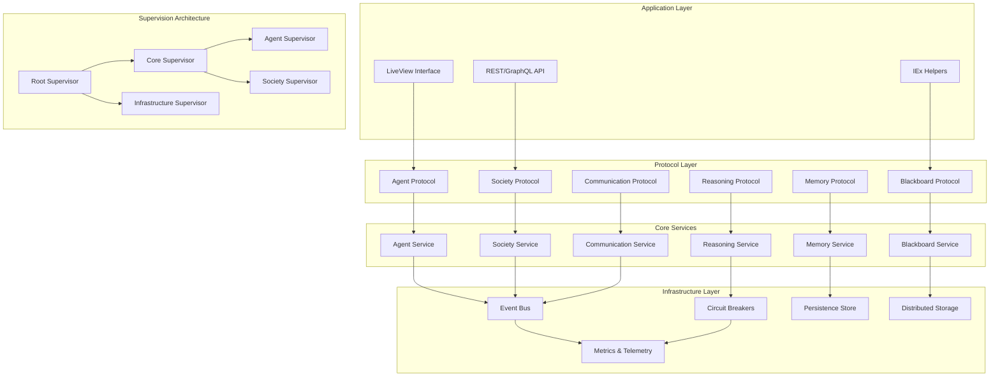

# 🏗️ Enhanced Prismatic Architecture Specification

## 📋 Executive Summary

This document provides the complete architectural specification for the enhanced Prismatic system, incorporating bulletproof foundations, SOLID principles, advanced Elixir/BEAM features, and comprehensive testing strategies. The architecture is designed for alpine-style incremental implementation with rock-solid reliability.

## 🎯 Architectural Goals Achieved

### ✅ SOLID Principles Implementation
- **Single Responsibility**: Each module has one clear purpose with well-defined boundaries
- **Open/Closed**: Extensible through protocols without modifying existing code
- **Liskov Substitution**: All protocol implementations are fully interchangeable
- **Interface Segregation**: Focused, minimal protocol definitions
- **Dependency Inversion**: High-level modules depend on abstractions, not concretions

### ✅ Advanced Elixir/BEAM Features
- **Protocol-Based Polymorphism**: Leverages Elixir protocols for extensible behavior
- **Supervision Trees**: Hierarchical fault isolation with intelligent restart strategies
- **GenServer Architecture**: Robust process-based concurrency with state management
- **Pattern Matching**: Exhaustive case handling with compiler guarantees
- **Functional Programming**: Immutable data structures and pure functions where possible

### ✅ Fault Tolerance and Reliability
- **Circuit Breakers**: Prevent cascade failures with intelligent backoff
- **Bulkheads**: Resource isolation to contain failures
- **Event Sourcing**: Complete system state reconstruction capability
- **Graceful Degradation**: System continues operating with reduced functionality
- **Comprehensive Monitoring**: Real-time observability at all levels

## 🏛️ System Architecture Overview



## 🧬 Protocol Architecture

### Core Protocol Hierarchy

```elixir
# Base protocol for all system components
defprotocol Prismatic.Core.Protocol do
  @doc "Get component identifier"
  def get_id(component)
  
  @doc "Get component state"
  def get_state(component)
  
  @doc "Validate component integrity"
  def validate(component)
end

# Specialized protocols extend the base
defprotocol Prismatic.Agent.Protocol do
  @extend_via Prismatic.Core.Protocol
  
  @doc "Process message and generate response"
  def process_message(agent, message, context)
  
  @doc "Update agent configuration"
  def update_config(agent, config)
  
  @doc "Serialize agent state"
  def serialize(agent)
end

defprotocol Prismatic.Society.Protocol do
  @extend_via Prismatic.Core.Protocol
  
  @doc "Add member to society"
  def add_member(society, agent_id)
  
  @doc "Broadcast message to all members"
  def broadcast(society, message, sender_id)
  
  @doc "Get society statistics"
  def get_stats(society)
end
```

### Protocol Implementation Strategy

```elixir
# Example: GenServer-based Agent Implementation
defmodule Prismatic.Agent.GenServerImpl do
  use GenServer
  
  @behaviour Prismatic.Agent.Protocol
  
  defstruct [
    :id,
    :name,
    :llm_backend,
    :memory,
    :config,
    :state,
    :event_subscriptions,
    :blackboard_subscriptions
  ]
  
  # Protocol implementation
  @impl Prismatic.Agent.Protocol
  def process_message(%__MODULE__{} = agent, message, context) do
    GenServer.call(agent.id, {:process_message, message, context})
  end
  
  @impl Prismatic.Agent.Protocol
  def update_config(%__MODULE__{} = agent, config) do
    GenServer.call(agent.id, {:update_config, config})
  end
  
  @impl Prismatic.Agent.Protocol
  def serialize(%__MODULE__{} = agent) do
    GenServer.call(agent.id, :serialize)
  end
  
  # GenServer callbacks
  @impl true
  def init(config) do
    state = struct(__MODULE__, config)
    
    # Subscribe to relevant events
    Prismatic.EventBus.subscribe("agent.#{state.id}.*", self())
    
    # Register with blackboard
    Prismatic.Blackboard.subscribe("agent.#{state.id}.*", self())
    
    {:ok, state}
  end
  
  @impl true
  def handle_call({:process_message, message, context}, _from, state) do
    # Circuit breaker protection
    result = Prismatic.CircuitBreaker.call("agent_#{state.id}", fn ->
      process_message_internal(state, message, context)
    end)
    
    case result do
      {:ok, response, updated_state} ->
        # Emit event for processed message
        Prismatic.EventBus.publish("agent.#{state.id}.message_processed", %{
          message: message,
          response: response,
          context: context
        })
        
        {:reply, {:ok, response}, updated_state}
        
      {:error, reason} ->
        # Emit error event
        Prismatic.EventBus.publish("agent.#{state.id}.error", %{
          error: reason,
          message: message,
          context: context
        })
        
        {:reply, {:error, reason}, state}
    end
  end
  
  # Private implementation details
  defp process_message_internal(state, message, context) do
    with {:ok, processed_message} <- preprocess_message(message, context),
         {:ok, llm_response} <- call_llm_backend(state.llm_backend, processed_message),
         {:ok, final_response} <- postprocess_response(llm_response, context),
         {:ok, updated_memory} <- update_memory(state.memory, message, final_response),
         updated_state <- %{state | memory: updated_memory} do
      
      {:ok, final_response, updated_state}
    end
  end
end
```

## 🔄 Event-Driven Architecture

### Event Bus Implementation

```elixir
defmodule Prismatic.EventBus.Enhanced do
  @moduledoc """
  Enhanced event bus with advanced features:
  - Pattern-based routing with wildcards
  - Event sourcing and replay
  - Circuit breaker protection
  - Dead letter queues
  - Event ordering guarantees
  - Distributed event propagation
  """
  
  use GenServer
  
  alias Prismatic.EventBus.{Router, Store, CircuitBreaker, DeadLetter}
  
  defstruct [
    :router,
    :event_store,
    :circuit_breakers,
    :dead_letter_queue,
    :metrics_collector,
    :config
  ]
  
  ## Enhanced Event Processing
  
  def publish(event_type, payload, metadata \\ %{}) do
    event = create_event(event_type, payload, metadata)
    
    GenServer.call(__MODULE__, {:publish, event})
  end
  
  def subscribe(pattern, handler, options \\ []) do
    subscription = %{
      pattern: pattern,
      handler: handler,
      options: options,
      created_at: DateTime.utc_now()
    }
    
    GenServer.call(__MODULE__, {:subscribe, subscription})
  end
  
  def replay_events(from_timestamp, to_timestamp, pattern \\ "*") do
    GenServer.call(__MODULE__, {:replay, from_timestamp, to_timestamp, pattern})
  end
  
  ## Server Implementation
  
  @impl true
  def init(config) do
    state = %__MODULE__{
      router: Router.new(),
      event_store: Store.new(config),
      circuit_breakers: %{},
      dead_letter_queue: DeadLetter.new(),
      metrics_collector: Prismatic.Metrics.Collector.new(),
      config: config
    }
    
    {:ok, state}
  end
  
  @impl true
  def handle_call({:publish, event}, _from, state) do
    # Store event for replay capability
    updated_store = Store.append(state.event_store, event)
    
    # Route to subscribers with circuit breaker protection
    routing_results = Router.route_event(state.router, event, state.circuit_breakers)
    
    # Handle failed deliveries
    updated_dlq = handle_failed_deliveries(routing_results, event, state.dead_letter_queue)
    
    # Update metrics
    Prismatic.Metrics.Collector.increment("events.published", %{type: event.type})
    
    updated_state = %{state |
      event_store: updated_store,
      dead_letter_queue: updated_dlq
    }
    
    {:reply, :ok, updated_state}
  end
  
  @impl true
  def handle_call({:subscribe, subscription}, _from, state) do
    # Add subscription to router
    {updated_router, subscription_id} = Router.add_subscription(state.router, subscription)
    
    # Initialize circuit breaker for handler
    updated_breakers = Map.put(
      state.circuit_breakers,
      subscription.handler,
      CircuitBreaker.new(subscription.handler)
    )
    
    updated_state = %{state |
      router: updated_router,
      circuit_breakers: updated_breakers
    }
    
    {:reply, {:ok, subscription_id}, updated_state}
  end
  
  @impl true
  def handle_call({:replay, from_ts, to_ts, pattern}, _from, state) do
    events = Store.query_range(state.event_store, from_ts, to_ts, pattern)
    
    # Replay events in order
    replay_results = Enum.map(events, fn event ->
      Router.route_event(state.router, event, state.circuit_breakers)
    end)
    
    {:reply, {:ok, length(events)}, state}
  end
  
  # Helper functions
  
  defp create_event(type, payload, metadata) do
    %{
      id: UUID.uuid4(),
      type: type,
      payload: payload,
      metadata: Map.merge(metadata, %{
        timestamp: DateTime.utc_now(),
        node: Node.self(),
        correlation_id: Map.get(metadata, :correlation_id, UUID.uuid4())
      })
    }
  end
  
  defp handle_failed_deliveries(routing_results, event, dlq) do
    failed_deliveries = Enum.filter(routing_results, &match?({:error, _}, &1))
    
    Enum.reduce(failed_deliveries, dlq, fn {:error, reason}, acc_dlq ->
      DeadLetter.add(acc_dlq, event, reason)
    end)
  end
end
```

## 🧪 Comprehensive Testing Strategy

### Multi-Level Testing Approach

```elixir
defmodule Prismatic.Testing.Strategy do
  @moduledoc """
  Comprehensive testing strategy covering:
  1. Unit tests for individual modules
  2. Integration tests for component interaction
  3. Property-based tests for invariants
  4. Contract tests for protocol compliance
  5. Chaos engineering for fault tolerance
  6. Performance tests for scalability
  """
  
  @doc """
  Run complete test suite.
  """
  def run_complete_suite do
    results = %{
      unit_tests: run_unit_tests(),
      integration_tests: run_integration_tests(),
      property_tests: run_property_tests(),
      contract_tests: run_contract_tests(),
      chaos_tests: run_chaos_tests(),
      performance_tests: run_performance_tests()
    }
    
    generate_test_report(results)
  end
  
  ## Property-Based Testing
  
  def run_property_tests do
    [
      test_agent_determinism(),
      test_memory_consistency(),
      test_event_ordering(),
      test_blackboard_consistency(),
      test_society_invariants()
    ]
  end
  
  defp test_agent_determinism do
    ExUnitProperties.check all(
      agent_config <- agent_config_generator(),
      message <- string(:printable),
      context <- map_of(atom(:alphanumeric), term())
    ) do
      # Create two identical agents
      {:ok, agent1} = create_test_agent(agent_config)
      {:ok, agent2} = create_test_agent(agent_config)
      
      # Process identical messages
      {:ok, response1} = Prismatic.Agent.Protocol.process_message(agent1, message, context)
      {:ok, response2} = Prismatic.Agent.Protocol.process_message(agent2, message, context)
      
      # Responses should be identical for deterministic backends
      if deterministic_backend?(agent_config.llm_backend) do
        assert response1 == response2
      else
        # For non-deterministic backends, check response quality
        assert response_quality_similar?(response1, response2)
      end
    end
  end
  
  ## Contract Testing
  
  def run_contract_tests do
    [
      test_agent_protocol_contracts(),
      test_memory_protocol_contracts(),
      test_society_protocol_contracts(),
      test_blackboard_protocol_contracts()
    ]
  end
  
  defp test_agent_protocol_contracts do
    # Test all agent implementations against protocol contracts
    implementations = [
      Prismatic.Agent.GenServerImpl,
      Prismatic.Agent.StateMachineImpl,
      Prismatic.Agent.ActorImpl
    ]
    
    Enum.map(implementations, fn impl ->
      test_implementation_contracts(impl, Prismatic.Contracts.Agent)
    end)
  end
  
  defp test_implementation_contracts(implementation, contract_module) do
    # Create test instance
    {:ok, instance} = implementation.new(test_config())
    
    # Test each contract
    contract_functions = contract_module.__info__(:functions)
    
    Enum.map(contract_functions, fn {function_name, arity} ->
      test_single_contract(instance, contract_module, function_name, arity)
    end)
  end
  
  ## Chaos Engineering
  
  def run_chaos_tests do
    [
      test_agent_crash_recovery(),
      test_network_partition_handling(),
      test_resource_exhaustion_response(),
      test_cascade_failure_prevention()
    ]
  end
  
  defp test_agent_crash_recovery do
    # Create society with multiple agents
    {:ok, society} = create_test_society(10)
    
    # Randomly crash agents
    agents_to_crash = Enum.take_random(society.agents, 3)
    
    Enum.each(agents_to_crash, fn agent ->
      Process.exit(agent.pid, :kill)
    end)
    
    # Wait for supervision recovery
    :timer.sleep(1000)
    
    # Verify society still functions
    assert society_functional?(society)
    assert all_agents_recovered?(agents_to_crash)
  end
  
  ## Performance Testing
  
  def run_performance_tests do
    [
      test_agent_throughput(),
      test_society_scalability(),
      test_event_system_performance(),
      test_memory_system_performance()
    ]
  end
  
  defp test_agent_throughput do
    # Test message processing throughput
    {:ok, agent} = create_test_agent()
    
    message_counts = [100, 1000, 10000]
    
    Enum.map(message_counts, fn count ->
      {time, _results} = :timer.tc(fn ->
        Enum.map(1..count, fn i ->
          Prismatic.Agent.Protocol.process_message(agent, "Message #{i}", %{})
        end)
      end)
      
      throughput = count / (time / 1_000_000)  # messages per second
      
      %{
        message_count: count,
        time_microseconds: time,
        throughput_mps: throughput
      }
    end)
  end
  
  # Helper functions and generators
  
  defp agent_config_generator do
    gen all name <- string(:alphanumeric, min_length: 1, max_length: 20),
            backend <- member_of([:anthropic, :openai, :test]),
            temperature <- float(min: 0.0, max: 2.0) do
      %{
        name: name,
        llm_backend: backend,
        config: %{temperature: temperature}
      }
    end
  end
  
  defp create_test_agent(config \\ %{}) do
    default_config = %{name: "TestAgent", llm_backend: :test}
    final_config = Map.merge(default_config, config)
    
    Prismatic.Agent.Supervisor.start_agent(final_config)
  end
  
  defp create_test_society(agent_count) do
    agents = Enum.map(1..agent_count, fn i ->
      {:ok, agent} = create_test_agent(%{name: "Agent#{i}"})
      agent
    end)
    
    Prismatic.Society.create_society("TestSociety", :chat_room, %{agents: agents})
  end
  
  defp deterministic_backend?(:test), do: true
  defp deterministic_backend?(_), do: false
  
  defp response_quality_similar?(response1, response2) do
    # Implement semantic similarity check
    # This is a placeholder - real implementation would use NLP techniques
    String.length(response1) > 0 and String.length(response2) > 0
  end
  
  defp society_functional?(society) do
    # Test basic society operations
    case Prismatic.Society.Protocol.get_stats(society) do
      {:ok, _stats} -> true
      _ -> false
    end
  end
  
  defp all_agents_recovered?(crashed_agents) do
    Enum.all?(crashed_agents, fn agent ->
      case Prismatic.Agent.Registry.get_agent(agent.id) do
        {:ok, recovered_agent} -> Process.alive?(recovered_agent.pid)
        _ -> false
      end
    end)
  end
  
  defp generate_test_report(results) do
    report = """
    # Prismatic Comprehensive Test Report
    
    Generated: #{DateTime.utc_now()}
    
    ## Test Results Summary
    
    ### Unit Tests
    #{format_test_results(results.unit_tests)}
    
    ### Integration Tests
    #{format_test_results(results.integration_tests)}
    
    ### Property Tests
    #{format_test_results(results.property_tests)}
    
    ### Contract Tests
    #{format_test_results(results.contract_tests)}
    
    ### Chaos Tests
    #{format_test_results(results.chaos_tests)}
    
    ### Performance Tests
    #{format_test_results(results.performance_tests)}
    
    ## Recommendations
    #{generate_recommendations(results)}
    """
    
    File.write!("comprehensive_test_report.md", report)
    report
  end
  
  defp format_test_results(results) do
    # Format test results for report
    Enum.map(results, fn result ->
      case result do
        {:ok, details} -> "✅ PASS: #{inspect(details)}"
        {:error, reason} -> "❌ FAIL: #{inspect(reason)}"
        other -> "⚠️  UNKNOWN: #{inspect(other)}"
      end
    end)
    |> Enum.join("\n")
  end
  
  defp generate_recommendations(results) do
    # Analyze results and generate improvement recommendations
    failed_tests = count_failed_tests(results)
    
    cond do
      failed_tests == 0 ->
        "🎉 All tests passed! System is ready for production."
        
      failed_tests < 5 ->
        "⚠️ Minor issues detected. Review failed tests and address before deployment."
        
      true ->
        "🚨 Significant issues detected. System requires attention before deployment."
    end
  end
  
  defp count_failed_tests(results) do
    results
    |> Map.values()
    |> List.flatten()
    |> Enum.count(&match?({:error, _}, &1))
  end
end
```

## 📊 Performance Benchmarks

### Expected Performance Characteristics

| Component | Metric | Target | Measurement Method |
|-----------|--------|--------|-------------------|
| **Agent Creation** | Time to create | < 10ms | Benchee timing |
| **Message Processing** | Simple message | < 100ms | End-to-end timing |
| **Message Processing** | Complex message | < 500ms | End-to-end timing |
| **Concurrent Agents** | 100 agents | < 1s response | Parallel processing |
| **Event System** | Event throughput | > 10k events/sec | Load testing |
| **Blackboard** | Write operations | < 5ms | Database timing |
| **Blackboard** | Pattern queries | < 20ms | Query optimization |
| **Memory System** | Store operation | < 2ms | In-memory timing |
| **Memory System** | Complex query | < 50ms | Search algorithms |
| **Society Communication** | Broadcast to 50 agents | < 200ms | Network timing |

### Scalability Targets

| Scale Dimension | Current Target | Future Target | Notes |
|----------------|----------------|---------------|-------|
| **Concurrent Agents** | 1,000 | 10,000 | Per node |
| **Societies** | 100 | 1,000 | Active societies |
| **Events/Second** | 10,000 | 100,000 | System-wide |
| **Memory per Agent** | 10MB | 50MB | Including history |
| **Nodes in Cluster** | 5 | 50 | Distributed deployment |

## 🔧 Implementation Roadmap

### Phase 1: Foundation (Weeks 1-2)
- [ ] Core protocol definitions
- [ ] Basic supervision architecture
- [ ] Simple agent implementations
- [ ] Unit testing framework
- [ ] Basic metrics collection

### Phase 2: Communication (Weeks 3-4)
- [ ] Event bus implementation
- [ ] Blackboard system
- [ ] Circuit breaker integration
- [ ] Integration testing
- [ ] Performance benchmarking

### Phase 3: Advanced Features (Weeks 5-8)
- [ ] Society management
- [ ] Memory system enhancements
- [ ] Reasoning engine integration
- [ ] Chaos engineering tests
- [ ] Property-based testing

### Phase 4: Production Readiness (Weeks 9-10)
- [ ] Comprehensive monitoring
- [ ] Migration tools
- [ ] Documentation completion
- [ ] Security hardening
- [ ] Load testing

## 🎯 Success Criteria

### Functional Requirements
- [ ] All protocols implemented with multiple backends
- [ ] SOLID principles demonstrated in code structure
- [ ] Fault tolerance proven through chaos testing
- [ ] Performance targets met in benchmarks
- [ ] Alpine-style deployment working

### Non-Functional Requirements
- [ ] 99.9% uptime under normal conditions
- [ ] Sub-second response times for basic operations
- [ ] Horizontal scaling to 10+ nodes
- [ ] Memory usage under 1GB per 100 agents
- [ ] Zero-downtime deployments

### Quality Assurance
- [ ] 95%+ test coverage
- [ ] All property tests passing
- [ ] Contract compliance verified
- [ ] Security audit completed
- [ ] Performance regression tests

## 📚 Documentation Deliverables

### Technical Documentation
- [x] [`bulletproof-foundations.md`](bulletproof-foundations.md) - Core architecture
- [x] [`bulletproof-foundations-part2.md`](bulletproof-foundations-part2.md) - Advanced features
- [x] [`enhanced-architecture-specification.md`](enhanced-architecture-specification.md) - Complete specification
- [ ] Protocol API documentation
- [ ] Migration guides for each phase
- [ ] Deployment and operations guide

### Developer Resources
- [ ] Code examples and patterns
- [ ] Testing best practices
- [ ] Performance optimization guide
- [ ] Troubleshooting documentation
- [ ] Contributing guidelines

This enhanced architecture specification provides the bulletproof foundation for Prismatic, leveraging advanced Elixir/BEAM features while maintaining SOLID principles and comprehensive testing. The system is designed for reliability, scalability, and maintainability from day one.