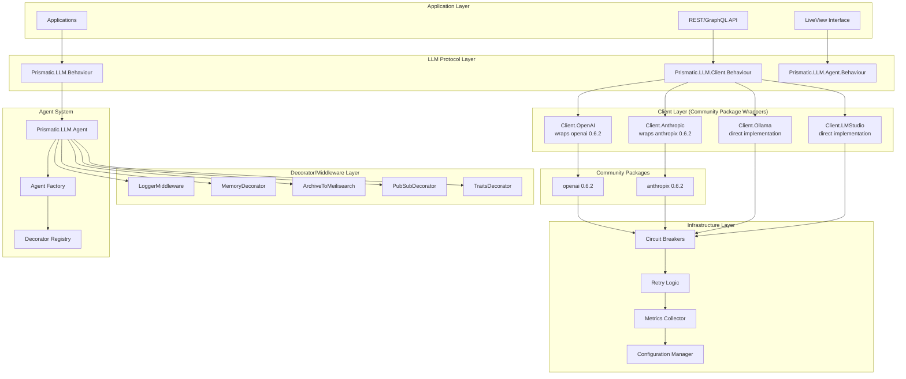
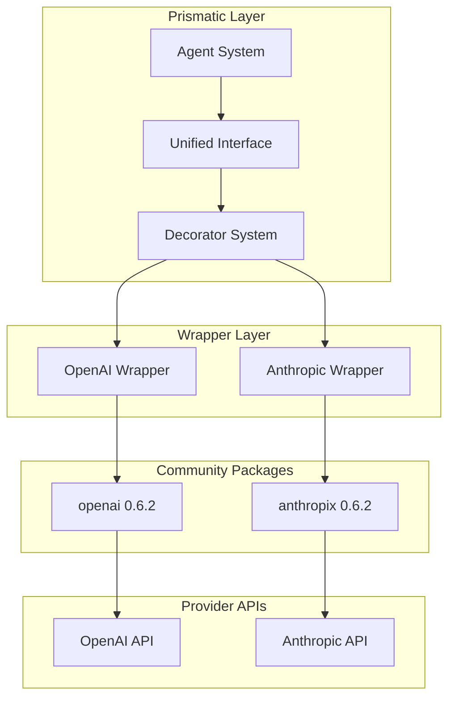

+++
title = "LLM System Architecture Specification"
description = "Comprehensive architectural specification for the new Prismatic LLM system with unified client architecture, configurable agents, and decorator/middleware patterns"
date = 2025-01-28
weight = 15

[taxonomies]
tags = ["architecture", "llm", "ai", "agents", "middleware", "elixir"]
categories = ["technical", "specification"]
audience = ["developers", "architects", "ai-engineers"]
difficulty = ["advanced"]
content_type = ["documentation", "specification"]
language = ["english"]
status = ["draft"]

[extra]
toc = true
github_edit = true
show_code_examples = true
api_reference = true
+++

# 🧠 Prismatic LLM System Architecture

## 📋 Executive Summary

This document presents the comprehensive architectural specification for the new Prismatic LLM (Large Language Model) system. The architecture follows the established Prismatic patterns with protocol-driven design, fault tolerance, and extensibility while introducing a unified client interface for multiple LLM providers and a flexible agent system with decorator/middleware patterns.

**Key Innovation**: This architecture leverages proven community packages ([`openai`](https://hex.pm/packages/openai) 0.6.2 and [`anthropix`](https://hex.pm/packages/anthropix) 0.6.2) as foundational building blocks, wrapping them with a unified Prismatic interface for consistency and extensibility.

## 🎯 Architectural Goals

### ✅ **Unified Client Interface**
- **Single API**: One consistent interface across all LLM providers (OpenAI, Claude, Ollama, LM Studio)
- **Behaviour-driven**: Protocol-based design following Elixir best practices
- **Community Package Integration**: Leverage existing, well-maintained packages for provider implementations
- **Hot-swappable Providers**: Runtime switching between different LLM backends
- **Transparent Failover**: Automatic fallback to alternative providers

### ✅ **Configurable Agent System**
- **Decorator Pattern**: Composable middleware for extending agent capabilities
- **Static/Dynamic Configuration**: Both compile-time and runtime decorator management
- **Default Configuration**: Sensible defaults from config files with override capabilities
- **Introspection**: Full visibility into active decorators and configuration

### ✅ **Production-Ready Reliability**
- **Circuit Breakers**: Provider-specific fault isolation
- **Retry Logic**: Intelligent retry strategies with exponential backoff
- **Comprehensive Logging**: Structured logging with configurable levels
- **Metrics Collection**: Built-in telemetry and performance monitoring

## 🏗️ System Architecture Overview



## 🧬 Core Protocol Architecture

### Primary LLM Behaviour

The main interface that applications use to interact with LLM services:

```elixir
defmodule Prismatic.LLM.Behaviour do
  @moduledoc """
  Main LLM behaviour for high-level interactions.
  
  This is the primary interface for applications that need LLM
  functionality without worrying about specific providers or
  low-level client details.
  """
  
  @type prompt :: String.t()
  @type context :: map()
  @type response :: String.t()
  @type options :: keyword()
  
  @doc """
  Generate a response for the given prompt with context.
  
  This is the main entry point for LLM interactions, providing
  a simplified interface that handles provider selection,
  configuration, and error handling automatically.
  """
  @callback chat(prompt(), context(), options()) :: 
    {:ok, response()} | {:error, term()}
  
  @doc """
  Stream responses for real-time interactions.
  
  Returns a stream of response chunks for applications that
  need to display responses as they're generated.
  """
  @callback stream(prompt(), context(), options()) :: 
    {:ok, Enumerable.t()} | {:error, term()}
  
  @doc """
  Generate embeddings for the given text.
  
  Converts text into vector embeddings for semantic search,
  similarity comparison, and other vector operations.
  """
  @callback embed(String.t() | [String.t()], options()) :: 
    {:ok, [float()] | [[float()]]} | {:error, term()}
end
```

### Client Behaviour

The unified interface for all LLM provider implementations:

```elixir
defmodule Prismatic.LLM.Client.Behaviour do
  @moduledoc """
  Unified behaviour for all LLM client implementations.
  
  This behaviour ensures consistent interfaces across all
  LLM providers while allowing for provider-specific
  optimizations and features. Implementations may wrap
  community packages or provide direct implementations.
  """
  
  @type config :: map()
  @type message :: %{
    role: :system | :user | :assistant,
    content: String.t()
  }
  @type messages :: [message()]
  @type client_options :: map()
  
  @doc """
  Create and configure a new client instance.
  """
  @callback new(config()) :: {:ok, term()} | {:error, term()}
  
  @doc """
  Send a chat completion request to the provider.
  """
  @callback chat(term(), messages(), client_options()) :: 
    {:ok, response()} | {:error, term()}
  
  @doc """
  Stream chat completion responses.
  """
  @callback stream(term(), messages(), client_options()) :: 
    {:ok, Enumerable.t()} | {:error, term()}
  
  @doc """
  Generate embeddings using the provider's embedding model.
  """
  @callback embed(term(), String.t() | [String.t()], client_options()) :: 
    {:ok, [float()] | [[float()]]} | {:error, term()}
  
  @doc """
  Validate client configuration.
  """
  @callback validate_config(config()) :: :ok | {:error, term()}
  
  @doc """
  Perform health check on the provider.
  """
  @callback health_check(term()) :: :ok | {:error, term()}
  
  @doc """
  Get provider and model information.
  """
  @callback get_model_info(term()) :: {:ok, map()} | {:error, term()}
end
```

## 🤖 Agent System Architecture

### Core Agent Implementation

The agent system provides a high-level interface for creating AI agents with configurable capabilities:

```elixir
defmodule Prismatic.LLM.Agent do
  @moduledoc """
  Configurable LLM agent with decorator/middleware support.
  
  Agents provide a higher-level abstraction over LLM clients,
  with support for memory, persistence, PubSub integration,
  and custom middleware through the decorator pattern.
  """
  
  use GenServer
  require Logger
  
  defstruct [
    :id,
    :name,
    :client,
    :client_config,
    :decorators,
    :state,
    :system_prompt,
    :system_prompt_functor,
    :created_at,
    :last_activity
  ]
  
  @type t :: %__MODULE__{
    id: String.t(),
    name: String.t() | nil,
    client: module(),
    client_config: map(),
    decorators: [decorator_spec()],
    state: map(),
    system_prompt: String.t() | nil,
    system_prompt_functor: system_prompt_functor() | nil,
    created_at: DateTime.t(),
    last_activity: DateTime.t()
  }
  
  @type system_prompt_functor ::
    (agent_state :: map(), decorator_states :: map(), context :: map() -> String.t()) |
    (agent_state :: map(), context :: map() -> String.t()) |
    (agent_state :: map() -> String.t()) |
    {module(), atom(), [term()]} |
    reference() |
    fun()
  
  @type decorator_spec :: 
    module() | 
    {module(), keyword()} | 
    {module(), keyword(), map()}
  
  @type agent_options :: [
    id: String.t(),
    name: String.t(),
    client: module(),
    client_opts: keyword(),
    decorators: [decorator_spec()]
  ]
  
  ## Public API
  
  @doc """
  Create a new agent with the given configuration.
  
  Supports both static and dynamic configuration:
  - Uses default client from config if not specified
  - Applies decorators in the order specified
  - Validates all configuration before creating the agent
  
  ## Examples
  
      # Using default configuration
      {:ok, agent} = Agent.new(id: "assistant-1")
      
      # With custom client and decorators
      {:ok, agent} = Agent.new(
        id: "specialized-agent",
        name: "Research Assistant",
        client: Prismatic.LLM.Client.OpenAI,
        client_opts: [model: "gpt-4", temperature: 0.1],
        decorators: [
          {Prismatic.LLM.Agent.LoggerMiddleware, level: :info},
          Prismatic.LLM.Agent.MemoryDecorator,
          {Prismatic.LLM.Agent.ArchiveToMeilisearch, index: "conversations"}
        ]
      )
  """
  @spec new(agent_options()) :: {:ok, pid()} | {:error, term()}
  def new(opts) do
    config = build_agent_config(opts)
    
    case validate_agent_config(config) do
      :ok ->
        GenServer.start_link(__MODULE__, config)
      {:error, reason} ->
        {:error, reason}
    end
  end
  
  @doc """
  Send a message to the agent and get a response.
  
  The message flows through all active decorators before
  reaching the LLM client, and the response flows back
  through the decorators in reverse order.
  """
  @spec chat(pid(), String.t(), map()) :: {:ok, String.t()} | {:error, term()}
  def chat(agent, message, context \\ %{}) do
    GenServer.call(agent, {:chat, message, context})
  end
  
  @doc """
  Dynamically add a decorator to the agent.
  
  The decorator will be inserted into the middleware chain
  and will affect all subsequent interactions.
  """
  @spec decorate(pid(), module(), keyword()) :: :ok | {:error, term()}
  def decorate(agent, decorator_module, opts \\ []) do
    GenServer.call(agent, {:decorate, decorator_module, opts})
  end
  
  @doc """
  Remove a decorator from the agent.
  
  The decorator will be removed from the middleware chain
  and will no longer affect interactions.
  """
  @spec undecorate(pid(), module()) :: :ok | {:error, term()}
  def undecorate(agent, decorator_module) do
    GenServer.call(agent, {:undecorate, decorator_module})
  end
  
  @doc """
  List all active decorators on the agent.
  """
  @spec list_decorators(pid()) :: {:ok, [map()]} | {:error, term()}
  def list_decorators(agent) do
    GenServer.call(agent, :list_decorators)
  end
  
  # State Management API
  
  @doc """
  Get the current state of the agent.
  
  Returns the complete internal state map that can be used
  by decorators and for agent introspection.
  """
  @spec get_state(pid()) :: {:ok, map()} | {:error, term()}
  def get_state(agent) do
    GenServer.call(agent, :get_state)
  end
  
  @doc """
  Set the complete agent state.
  
  Replaces the entire state map. Use with caution as this
  can affect decorator functionality.
  """
  @spec set_state(pid(), map()) :: :ok | {:error, term()}
  def set_state(agent, new_state) do
    GenServer.call(agent, {:set_state, new_state})
  end
  
  @doc """
  Update specific keys in the agent state.
  
  Merges the provided updates into the existing state map.
  This is the preferred way to modify agent state.
  """
  @spec update_state(pid(), map()) :: :ok | {:error, term()}
  def update_state(agent, updates) do
    GenServer.call(agent, {:update_state, updates})
  end
  
  @doc """
  Modify agent state using a function.
  
  The function receives the current state and should return
  the new state. This ensures atomic state updates.
  """
  @spec modify_state(pid(), (map() -> map())) :: :ok | {:error, term()}
  def modify_state(agent, modifier_fun) when is_function(modifier_fun, 1) do
    GenServer.call(agent, {:modify_state, modifier_fun})
  end
  
  # System Prompt Management API
  
  @doc """
  Get the current system prompt.
  
  Returns either the static system prompt or the result of
  evaluating the system prompt functor if one is set.
  """
  @spec get_system_prompt(pid()) :: {:ok, String.t() | nil} | {:error, term()}
  def get_system_prompt(agent) do
    GenServer.call(agent, :get_system_prompt)
  end
  
  @doc """
  Set a static system prompt.
  
  This replaces any existing static prompt or functor.
  The prompt will be used for all subsequent conversations.
  """
  @spec set_system_prompt(pid(), String.t()) :: :ok | {:error, term()}
  def set_system_prompt(agent, prompt) when is_binary(prompt) do
    GenServer.call(agent, {:set_system_prompt, prompt})
  end
  
  @doc """
  Remove the system prompt.
  
  Clears both static prompts and functors. The agent will
  operate without a system prompt until one is set again.
  """
  @spec remove_system_prompt(pid()) :: :ok | {:error, term()}
  def remove_system_prompt(agent) do
    GenServer.call(agent, :remove_system_prompt)
  end
  
  @doc """
  Set a dynamic system prompt functor.
  
  The functor will be called before each conversation to generate
  the system prompt based on current agent state, decorator states,
  and conversation context.
  
  ## Functor Signatures
  
  The functor can have one of these signatures:
  - `(agent_state, decorator_states, context) -> prompt`
  - `(agent_state, context) -> prompt`
  - `(agent_state) -> prompt`
  
  ## Examples
  
      # Anonymous function - simple state-based prompt
      functor = fn state ->
        "You are #{state.personality}. Your expertise is #{state.domain}."
      end
      
      # Anonymous function - context-aware prompt
      functor = fn state, context ->
        base = "You are a helpful assistant."
        if Map.get(context, :formal_mode, false) do
          base <> " Please respond formally and professionally."
        else
          base <> " Feel free to be casual and friendly."
        end
      end
      
      # Anonymous function - full decorator-aware prompt
      functor = fn state, decorator_states, context ->
        traits = get_in(decorator_states, [:traits, :active_traits]) || []
        personality = Enum.join(traits, ", ")
        "You are an AI with these traits: #{personality}. #{state.base_instructions}"
      end
      
      # MFA tuple - module function with extra args
      functor = {MyApp.SystemPrompts, :generate_research_prompt, ["advanced"]}
      
      # MFA tuple - simple module function
      functor = {MyApp.SystemPrompts, :default_prompt, []}
      
      # Function reference
      functor = &MyApp.SystemPrompts.expert_prompt/3
      
      # Captured function with partial application
      functor = &MyApp.SystemPrompts.domain_expert_prompt(&1, "artificial_intelligence", &2)
  """
  @spec set_system_prompt_functor(pid(), system_prompt_functor()) :: :ok | {:error, term()}
  def set_system_prompt_functor(agent, functor) when is_function(functor) do
    GenServer.call(agent, {:set_system_prompt_functor, functor})
  end
  
  @doc """
  Remove the system prompt functor.
  
  Clears the dynamic prompt generation. Any static system prompt
  will remain active.
  """
  @spec remove_system_prompt_functor(pid()) :: :ok | {:error, term()}
  def remove_system_prompt_functor(agent) do
    GenServer.call(agent, :remove_system_prompt_functor)
  end
  
  ## GenServer Implementation (simplified for brevity)
  
  @impl GenServer
  def init(config) do
    state = %__MODULE__{
      id: config.id,
      name: config.name,
      client: config.client,
      client_config: config.client_config,
      decorators: [],
      state: %{},
      created_at: DateTime.utc_now(),
      last_activity: DateTime.utc_now()
    }
    
    # Apply initial decorators
    final_state = apply_initial_decorators(state, config.initial_decorators)
    
    Logger.info("LLM Agent created", %{
      id: final_state.id,
      name: final_state.name,
      client: final_state.client,
      decorator_count: length(final_state.decorators)
    })
    
    {:ok, final_state}
  end
  
  @impl GenServer
  def handle_call({:chat, message, context}, _from, state) do
    start_time = System.monotonic_time()
    
    # Resolve system prompt if needed
    enhanced_context = maybe_add_system_prompt(context, state)
    
    case process_message_through_decorators(message, enhanced_context, state) do
      {:ok, response} ->
        new_state = %{state | last_activity: DateTime.utc_now()}
        
        :telemetry.execute(
          [:prismatic, :llm, :agent, :chat],
          %{duration: System.monotonic_time() - start_time},
          %{agent_id: state.id, success: true}
        )
        
        {:reply, {:ok, response}, new_state}
        
      {:error, reason} ->
        Logger.warning("Agent chat failed", %{
          agent_id: state.id,
          reason: reason,
          message: String.slice(message, 0, 100)
        })
        
        {:reply, {:error, reason}, state}
    end
  end
  
  # State Management GenServer Handlers
  
  @impl GenServer
  def handle_call(:get_state, _from, state) do
    {:reply, {:ok, state.state}, state}
  end
  
  @impl GenServer
  def handle_call({:set_state, new_agent_state}, _from, state) do
    updated_state = %{state | state: new_agent_state, last_activity: DateTime.utc_now()}
    {:reply, :ok, updated_state}
  end
  
  @impl GenServer
  def handle_call({:update_state, updates}, _from, state) do
    new_agent_state = Map.merge(state.state, updates)
    updated_state = %{state | state: new_agent_state, last_activity: DateTime.utc_now()}
    {:reply, :ok, updated_state}
  end
  
  @impl GenServer
  def handle_call({:modify_state, modifier_fun}, _from, state) do
    try do
      new_agent_state = modifier_fun.(state.state)
      updated_state = %{state | state: new_agent_state, last_activity: DateTime.utc_now()}
      {:reply, :ok, updated_state}
    rescue
      error ->
        Logger.warning("Agent state modification failed", %{
          agent_id: state.id,
          error: inspect(error)
        })
        {:reply, {:error, {:state_modification_failed, error}}, state}
    end
  end
  
  # System Prompt Management GenServer Handlers
  
  @impl GenServer
  def handle_call(:get_system_prompt, _from, state) do
    case resolve_system_prompt(state) do
      {:ok, prompt} -> {:reply, {:ok, prompt}, state}
      {:error, reason} -> {:reply, {:error, reason}, state}
    end
  end
  
  @impl GenServer
  def handle_call({:set_system_prompt, prompt}, _from, state) do
    updated_state = %{state |
      system_prompt: prompt,
      system_prompt_functor: nil,
      last_activity: DateTime.utc_now()
    }
    {:reply, :ok, updated_state}
  end
  
  @impl GenServer
  def handle_call(:remove_system_prompt, _from, state) do
    updated_state = %{state |
      system_prompt: nil,
      system_prompt_functor: nil,
      last_activity: DateTime.utc_now()
    }
    {:reply, :ok, updated_state}
  end
  
  @impl GenServer
  def handle_call({:set_system_prompt_functor, functor}, _from, state) do
    case validate_system_prompt_functor(functor) do
      :ok ->
        updated_state = %{state |
          system_prompt: nil,
          system_prompt_functor: functor,
          last_activity: DateTime.utc_now()
        }
        {:reply, :ok, updated_state}
      {:error, reason} ->
        {:reply, {:error, reason}, state}
    end
  end
  
  @impl GenServer
  def handle_call(:remove_system_prompt_functor, _from, state) do
    updated_state = %{state |
      system_prompt_functor: nil,
      last_activity: DateTime.utc_now()
    }
    {:reply, :ok, updated_state}
  end
  
  # Decorator Management GenServer Handlers
  
  @impl GenServer
  def handle_call({:decorate, decorator_module, opts}, _from, state) do
    case add_decorator(state, decorator_module, opts) do
      {:ok, new_state} ->
        {:reply, :ok, new_state}
      {:error, reason} ->
        {:reply, {:error, reason}, state}
    end
  end
  
  @impl GenServer
  def handle_call({:undecorate, decorator_module}, _from, state) do
    case remove_decorator(state, decorator_module) do
      {:ok, new_state} ->
        {:reply, :ok, new_state}
      {:error, reason} ->
        {:reply, {:error, reason}, state}
    end
  end
  
  @impl GenServer
  def handle_call(:list_decorators, _from, state) do
    decorator_info = Enum.map(state.decorators, fn
      {module, opts, decorator_state} ->
        %{
          module: module,
          options: opts,
          state: decorator_state,
          active: true
        }
      module when is_atom(module) ->
        %{
          module: module,
          options: [],
          state: %{},
          active: true
        }
    end)
    
    {:reply, {:ok, decorator_info}, state}
  end
  
  # Additional implementation details...
  
  # System Prompt Resolution Functions
  
  defp maybe_add_system_prompt(context, state) do
    case resolve_system_prompt(state) do
      {:ok, nil} -> context
      {:ok, system_prompt} -> Map.put(context, :system_prompt, system_prompt)
      {:error, _reason} -> context  # Log error but don't fail the request
    end
  end
  
  defp resolve_system_prompt(state) do
    cond do
      not is_nil(state.system_prompt) ->
        {:ok, state.system_prompt}
      
      not is_nil(state.system_prompt_functor) ->
        call_system_prompt_functor(state.system_prompt_functor, state)
      
      true ->
        {:ok, nil}
    end
  end
  
  defp call_system_prompt_functor(functor, state) do
    try do
      decorator_states = extract_decorator_states(state)
      context = %{}  # Could be enhanced to include request context
      
      result = case functor do
        # MFA tuple
        {module, function, args} ->
          case determine_mfa_arity(module, function, args) do
            3 -> apply(module, function, [state.state, decorator_states, context | args])
            2 -> apply(module, function, [state.state, context | args])
            1 -> apply(module, function, [state.state | args])
            0 -> apply(module, function, args)
            _ -> {:error, :invalid_mfa_arity}
          end
        
        # Function reference or anonymous function
        f when is_function(f) ->
          case :erlang.fun_info(f, :arity) do
            {:arity, 3} -> f.(state.state, decorator_states, context)
            {:arity, 2} -> f.(state.state, context)
            {:arity, 1} -> f.(state.state)
            {:arity, 0} -> f.()
            _ -> {:error, :invalid_function_arity}
          end
        
        _ ->
          {:error, :invalid_functor_type}
      end
      
      case result do
        prompt when is_binary(prompt) -> {:ok, prompt}
        {:ok, prompt} when is_binary(prompt) -> {:ok, prompt}
        {:error, reason} -> {:error, reason}
        _ -> {:error, :invalid_prompt_result}
      end
    rescue
      error ->
        Logger.warning("System prompt functor failed", %{
          agent_id: state.id,
          error: inspect(error),
          functor: inspect(functor)
        })
        {:error, {:functor_execution_failed, error}}
    end
  end
  
  defp determine_mfa_arity(module, function, base_args) do
    case :erlang.function_exported(module, function, length(base_args) + 3) do
      true -> 3
      false ->
        case :erlang.function_exported(module, function, length(base_args) + 2) do
          true -> 2
          false ->
            case :erlang.function_exported(module, function, length(base_args) + 1) do
              true -> 1
              false ->
                case :erlang.function_exported(module, function, length(base_args)) do
                  true -> 0
                  false -> -1
                end
            end
        end
    end
  end
  
  defp extract_decorator_states(state) do
    state.decorators
    |> Enum.reduce(%{}, fn
      {module, _opts, decorator_state}, acc ->
        decorator_key = module |> Module.split() |> List.last() |> Macro.underscore() |> String.to_atom()
        Map.put(acc, decorator_key, decorator_state)
      module, acc when is_atom(module) ->
        decorator_key = module |> Module.split() |> List.last() |> Macro.underscore() |> String.to_atom()
        Map.put(acc, decorator_key, %{})
    end)
  end
  
  defp validate_system_prompt_functor(functor) do
    case functor do
      # Anonymous function or captured function
      f when is_function(f) ->
        case :erlang.fun_info(f, :arity) do
          {:arity, arity} when arity in [0, 1, 2, 3] -> :ok
          _ -> {:error, :invalid_function_arity}
        end
      
      # MFA tuple
      {module, function, args} when is_atom(module) and is_atom(function) and is_list(args) ->
        if Code.ensure_loaded?(module) do
          # Check if any of the expected arities exist
          valid_arities = [
            length(args),      # Direct call
            length(args) + 1,  # + agent_state
            length(args) + 2,  # + agent_state, context
            length(args) + 3   # + agent_state, decorator_states, context
          ]
          
          case Enum.any?(valid_arities, &:erlang.function_exported(module, function, &1)) do
            true -> :ok
            false -> {:error, :function_not_exported}
          end
        else
          {:error, :module_not_loaded}
        end
      
      # Reference (this is handled as a function)
      ref when is_reference(ref) ->
        {:error, :reference_functors_not_supported}
      
      _ ->
        {:error, :invalid_functor_type}
    end
  end
  
  # Agent Configuration Functions
  
  defp build_agent_config(opts) do
    default_config = Application.get_env(:prismatic, Prismatic.LLM.Agent, %{})
    
    %{
      id: Keyword.fetch!(opts, :id),
      name: Keyword.get(opts, :name),
      client: get_client_module(opts, default_config),
      client_config: build_client_config(opts, default_config),
      initial_decorators: Keyword.get(opts, :decorators, []),
      initial_state: Keyword.get(opts, :initial_state, %{}),
      system_prompt: Keyword.get(opts, :system_prompt),
      system_prompt_functor: Keyword.get(opts, :system_prompt_functor)
    }
  end
  
  defp get_client_module(opts, default_config) do
    case Keyword.get(opts, :client) do
      nil ->
        Map.get(default_config, :default_client, Prismatic.LLM.Client.OpenAI)
      client_module ->
        client_module
    end
  end
  
  defp build_client_config(opts, default_config) do
    default_client_opts = Map.get(default_config, :default_client_opts, %{})
    client_opts = Keyword.get(opts, :client_opts, [])
    
    Map.merge(default_client_opts, Enum.into(client_opts, %{}))
  end
  
  defp validate_agent_config(config) do
    with :ok <- validate_required_fields(config),
         :ok <- validate_client_module(config.client),
         :ok <- validate_decorators(config.initial_decorators),
         :ok <- validate_system_prompt_config(config) do
      :ok
    end
  end
  
  defp validate_required_fields(config) do
    case Map.get(config, :id) do
      nil -> {:error, :missing_agent_id}
      id when is_binary(id) and byte_size(id) > 0 -> :ok
      _ -> {:error, :invalid_agent_id}
    end
  end
  
  defp validate_client_module(client_module) do
    case Code.ensure_loaded(client_module) do
      {:module, _} -> :ok
      {:error, reason} -> {:error, {:client_module_not_loaded, reason}}
    end
  end
  
  defp validate_decorators(decorators) when is_list(decorators) do
    Enum.reduce_while(decorators, :ok, fn decorator, _acc ->
      case validate_decorator_spec(decorator) do
        :ok -> {:cont, :ok}
        error -> {:halt, error}
      end
    end)
  end
  
  defp validate_decorator_spec(decorator) do
    case decorator do
      module when is_atom(module) ->
        validate_decorator_module(module)
      {module, opts} when is_atom(module) and is_list(opts) ->
        validate_decorator_module(module)
      {module, opts, _state} when is_atom(module) and is_list(opts) ->
        validate_decorator_module(module)
      _ ->
        {:error, :invalid_decorator_spec}
    end
  end
  
  defp validate_decorator_module(module) do
    case Code.ensure_loaded(module) do
      {:module, _} -> :ok
      {:error, reason} -> {:error, {:decorator_module_not_loaded, reason}}
    end
  end
  
  defp validate_system_prompt_config(config) do
    cond do
      not is_nil(config.system_prompt) and not is_nil(config.system_prompt_functor) ->
        {:error, :both_system_prompt_and_functor_provided}
      
      not is_nil(config.system_prompt) and not is_binary(config.system_prompt) ->
        {:error, :invalid_system_prompt_type}
      
      not is_nil(config.system_prompt_functor) ->
        validate_system_prompt_functor(config.system_prompt_functor)
      
      true ->
        :ok
    end
  end
  
  # Decorator Management Functions
  
  defp apply_initial_decorators(state, decorators) do
    Enum.reduce(decorators, state, fn decorator_spec, acc_state ->
      case add_decorator(acc_state, decorator_spec) do
        {:ok, new_state} -> new_state
        {:error, reason} ->
          Logger.warning("Failed to apply initial decorator", %{
            agent_id: acc_state.id,
            decorator: decorator_spec,
            reason: reason
          })
          acc_state
      end
    end)
  end
  
  defp add_decorator(state, decorator_spec, opts \\ []) do
    case normalize_decorator_spec(decorator_spec, opts) do
      {:ok, {module, decorator_opts}} ->
        case module.init(decorator_opts) do
          {:ok, decorator_state} ->
            new_decorator = {module, decorator_opts, decorator_state}
            updated_decorators = state.decorators ++ [new_decorator]
            {:ok, %{state | decorators: updated_decorators}}
          {:error, reason} ->
            {:error, {:decorator_init_failed, reason}}
        end
      {:error, reason} ->
        {:error, reason}
    end
  end
  
  defp normalize_decorator_spec(module, opts) when is_atom(module) do
    {:ok, {module, opts}}
  end
  
  defp normalize_decorator_spec({module, decorator_opts}, additional_opts) when is_atom(module) do
    merged_opts = Keyword.merge(decorator_opts, additional_opts)
    {:ok, {module, merged_opts}}
  end
  
  defp normalize_decorator_spec(spec, _opts) do
    {:error, {:invalid_decorator_spec, spec}}
  end
  
  defp remove_decorator(state, decorator_module) do
    case find_decorator_index(state.decorators, decorator_module) do
      {:ok, index} ->
        {decorator, remaining_decorators} = List.pop_at(state.decorators, index)
        
        # Call teardown if the decorator supports it
        case decorator do
          {module, _opts, decorator_state} ->
            try do
              module.teardown(decorator_state)
            rescue
              _ -> :ok  # Ignore teardown errors
            end
          _ -> :ok
        end
        
        {:ok, %{state | decorators: remaining_decorators}}
      :not_found ->
        {:error, :decorator_not_found}
    end
  end
  
  defp find_decorator_index(decorators, target_module) do
    decorators
    |> Enum.with_index()
    |> Enum.find_value(fn
      {{module, _opts, _state}, index} when module == target_module -> {:ok, index}
      {module, index} when module == target_module -> {:ok, index}
      _ -> nil
    end)
    |> case do
      {:ok, index} -> {:ok, index}
      nil -> :not_found
    end
  end
  
  # Message Processing Functions
  
  defp process_message_through_decorators(message, context, state) do
    # Process through decorators in forward order (before_chat)
    with {:ok, {processed_message, processed_context}} <-
           apply_before_decorators(message, context, state),
         {:ok, response} <-
           send_to_llm_client(processed_message, processed_context, state),
         {:ok, final_response} <-
           apply_after_decorators(response, processed_context, state) do
      {:ok, final_response}
    else
      {:error, reason} ->
        handle_decorator_error(reason, context, state)
    end
  end
  
  defp apply_before_decorators(message, context, state) do
    Enum.reduce_while(state.decorators, {:ok, {message, context}}, fn
      {module, _opts, decorator_state}, {:ok, {msg, ctx}} ->
        case module.before_chat(msg, ctx, Map.merge(state.state, %{decorator_state: decorator_state})) do
          {new_msg, new_ctx} -> {:cont, {:ok, {new_msg, new_ctx}}}
          {:error, reason} -> {:halt, {:error, {module, reason}}}
        end
      module, {:ok, {msg, ctx}} when is_atom(module) ->
        case module.before_chat(msg, ctx, state.state) do
          {new_msg, new_ctx} -> {:cont, {:ok, {new_msg, new_ctx}}}
          {:error, reason} -> {:halt, {:error, {module, reason}}}
        end
    end)
  end
  
  defp apply_after_decorators(response, context, state) do
    # Apply decorators in reverse order for after_chat
    reversed_decorators = Enum.reverse(state.decorators)
    
    Enum.reduce_while(reversed_decorators, {:ok, response}, fn
      {module, _opts, decorator_state}, {:ok, resp} ->
        case module.after_chat(resp, context, Map.merge(state.state, %{decorator_state: decorator_state})) do
          new_resp when is_binary(new_resp) -> {:cont, {:ok, new_resp}}
          {:error, reason} -> {:halt, {:error, {module, reason}}}
        end
      module, {:ok, resp} when is_atom(module) ->
        case module.after_chat(resp, context, state.state) do
          new_resp when is_binary(new_resp) -> {:cont, {:ok, new_resp}}
          {:error, reason} -> {:halt, {:error, {module, reason}}}
        end
    end)
  end
  
  defp send_to_llm_client(message, context, state) do
    # Convert to messages format expected by client
    messages = build_messages_from_context(message, context)
    client_options = build_client_options(context, state)
    
    case state.client.chat(state.client_config, messages, client_options) do
      {:ok, response} -> {:ok, response}
      {:error, reason} -> {:error, {:client_error, reason}}
    end
  end
  
  defp build_messages_from_context(message, context) do
    messages = []
    
    # Add system prompt if present
    messages = case Map.get(context, :system_prompt) do
      nil -> messages
      system_prompt -> [%{role: :system, content: system_prompt} | messages]
    end
    
    # Add user message
    messages = messages ++ [%{role: :user, content: message}]
    
    # Add conversation history if present
    case Map.get(context, :conversation_history) do
      nil -> messages
      history -> history ++ messages
    end
  end
  
  defp build_client_options(context, state) do
    base_options = Map.get(state.client_config, :default_options, %{})
    context_options = Map.get(context, :client_options, %{})
    
    Map.merge(base_options, context_options)
  end
  
  defp handle_decorator_error(reason, context, state) do
    Logger.warning("Decorator error in agent", %{
      agent_id: state.id,
      reason: reason,
      context: Map.take(context, [:user_id, :session_id])
    })
    
    # Try to call on_error for each decorator that supports it
    Enum.each(state.decorators, fn
      {module, _opts, decorator_state} ->
        try do
          module.on_error(reason, context, Map.merge(state.state, %{decorator_state: decorator_state}))
        rescue
          _ -> :ok  # Ignore errors in error handlers
        end
      module when is_atom(module) ->
        try do
          module.on_error(reason, context, state.state)
        rescue
          _ -> :ok
        end
    end)
    
    {:error, reason}
  end
end
```

## 🎨 Decorator/Middleware Architecture

### Decorator Behaviour

All decorators must implement this behaviour:

```elixir
defmodule Prismatic.LLM.Agent.Decorator do
  @moduledoc """
  Behaviour for agent decorators/middleware.
  
  Decorators can intercept and modify agent interactions
  at various points in the processing pipeline.
  """
  
  @type agent_state :: map()
  @type message :: String.t()
  @type context :: map()
  @type response :: String.t()
  @type decorator_opts :: keyword()
  
  @doc """
  Initialize the decorator with the given options.
  """
  @callback init(decorator_opts()) :: {:ok, map()} | {:error, term()}
  
  @doc """
  Process message and context before sending to LLM.
  """
  @callback before_chat(message(), context(), agent_state()) :: 
    {message(), context()} | {:error, term()}
  
  @doc """
  Process response after receiving from LLM.
  """
  @callback after_chat(response(), context(), agent_state()) :: 
    response() | {:error, term()}
  
  @doc """
  Handle errors that occur during processing.
  """
  @callback on_error(term(), context(), agent_state()) :: 
    :ok | {:retry, map()} | {:error, term()}
  
  @doc """
  Clean up when the decorator is removed.
  """
  @callback teardown(agent_state()) :: :ok | {:error, term()}
  
  # Default implementations
  defmacro __using__(_opts) do
    quote do
      @behaviour Prismatic.LLM.Agent.Decorator
      
      @impl true
      def init(_opts), do: {:ok, %{}}
      
      @impl true
      def before_chat(message, context, _state), do: {message, context}
      
      @impl true
      def after_chat(response, _context, _state), do: response
      
      @impl true
      def on_error(_error, _context, _state), do: :ok
      
      @impl true
      def teardown(_state), do: :ok
      
      defoverridable [init: 1, before_chat: 3, after_chat: 3, on_error: 3, teardown: 1]
    end
  end
end
```

### Logger Middleware Example

```elixir
defmodule Prismatic.LLM.Agent.LoggerMiddleware do
  @moduledoc """
  Logging middleware for LLM agent interactions.
  
  Provides comprehensive logging of agent conversations
  with configurable log levels and structured output.
  """
  
  use Prismatic.LLM.Agent.Decorator
  require Logger
  
  @impl true
  def init(opts) do
    state = %{
      level: Keyword.get(opts, :level, :info),
      log_requests: Keyword.get(opts, :log_requests, true),
      log_responses: Keyword.get(opts, :log_responses, true),
      max_message_length: Keyword.get(opts, :max_message_length, 1000)
    }
    
    {:ok, state}
  end
  
  @impl true
  def before_chat(message, context, state) do
    if state.log_requests do
      log_message = truncate_message(message, state.max_message_length)
      
      Logger.log(state.level, "Agent received message", %{
        event: "agent_request",
        message: log_message,
        agent_id: Map.get(context, :agent_id),
        user_id: Map.get(context, :user_id)
      })
    end
    
    {message, context}
  end
  
  @impl true
  def after_chat(response, context, state) do
    if state.log_responses do
      log_response = truncate_message(response, state.max_message_length)
      
      Logger.log(state.level, "Agent generated response", %{
        event: "agent_response",
        response: log_response,
        agent_id: Map.get(context, :agent_id),
        response_length: String.length(response)
      })
    end
    
    response
  end
  
  defp truncate_message(message, max_length) when byte_size(message) <= max_length do
    message
  end
  
  defp truncate_message(message, max_length) do
    String.slice(message, 0, max_length - 3) <> "..."
  end
end
```

### Traits Decorator Example (Dynamic Prompt Integration)

```elixir
defmodule Prismatic.LLM.Agent.TraitsDecorator do
  @moduledoc """
  Traits decorator that manages agent personality traits and
  provides dynamic system prompt generation capabilities.
  
  This decorator demonstrates how middleware can contribute
  to dynamic system prompt generation through functors.
  """
  
  use Prismatic.LLM.Agent.Decorator
  require Logger
  
  @impl true
  def init(opts) do
    state = %{
      traits: Keyword.get(opts, :initial_traits, []),
      trait_weights: Keyword.get(opts, :trait_weights, %{}),
      personality_model: Keyword.get(opts, :personality_model, :big_five),
      dynamic_adjustment: Keyword.get(opts, :dynamic_adjustment, true)
    }
    
    {:ok, state}
  end
  
  @doc """
  Add a trait to the agent's personality.
  """
  def add_trait(agent, trait, weight \\ 1.0) do
    GenServer.call(agent, {:traits_add, trait, weight})
  end
  
  @doc """
  Remove a trait from the agent's personality.
  """
  def remove_trait(agent, trait) do
    GenServer.call(agent, {:traits_remove, trait})
  end
  
  @doc """
  Get current active traits.
  """
  def get_traits(agent) do
    GenServer.call(agent, :traits_get)
  end
  
  @impl true
  def before_chat(message, context, agent_state) do
    # Analyze message for trait adjustments if dynamic adjustment is enabled
    decorator_state = Map.get(agent_state, :decorator_state, %{})
    
    if decorator_state.dynamic_adjustment do
      adjusted_traits = analyze_and_adjust_traits(message, decorator_state.traits)
      
      # Update decorator state with adjusted traits
      new_context = Map.put(context, :current_traits, adjusted_traits)
      {message, new_context}
    else
      {message, context}
    end
  end
  
  @impl true
  def after_chat(response, context, agent_state) do
    # Could analyze response to further adjust traits
    response
  end
  
  # Static system prompt generation helper (for use in functors)
  def generate_traits_prompt(agent_state, decorator_states, context) do
    traits_state = Map.get(decorator_states, :traits, %{})
    active_traits = Map.get(traits_state, :traits, [])
    current_traits = Map.get(context, :current_traits, active_traits)
    
    case current_traits do
      [] ->
        "You are a helpful AI assistant."
      traits ->
        trait_descriptions = Enum.map_join(traits, ", ", &describe_trait/1)
        "You are an AI assistant with these personality traits: #{trait_descriptions}. " <>
        "Let these traits naturally influence your communication style and responses."
    end
  end
  
  # Helper functions
  
  defp analyze_and_adjust_traits(message, current_traits) do
    # Simple sentiment-based trait adjustment
    # In a real implementation, this would be more sophisticated
    cond do
      String.contains?(String.downcase(message), ["urgent", "emergency", "asap"]) ->
        add_temporary_trait(current_traits, :urgency_focused)
        
      String.contains?(String.downcase(message), ["explain", "detail", "how"]) ->
        add_temporary_trait(current_traits, :analytical)
        
      String.contains?(String.downcase(message), ["creative", "imagine", "brainstorm"]) ->
        add_temporary_trait(current_traits, :creative)
        
      true ->
        current_traits
    end
  end
  
  defp add_temporary_trait(traits, new_trait) do
    if new_trait in traits do
      traits
    else
      [new_trait | traits] |> Enum.take(5)  # Limit to 5 active traits
    end
  end
  
  defp describe_trait(:analytical), do: "analytical and detail-oriented"
  defp describe_trait(:creative), do: "creative and imaginative"
  defp describe_trait(:empathetic), do: "empathetic and understanding"
  defp describe_trait(:urgency_focused), do: "focused and efficient"
  defp describe_trait(:friendly), do: "warm and approachable"
  defp describe_trait(:professional), do: "professional and formal"
  defp describe_trait(trait), do: Atom.to_string(trait)
end
```

### Meilisearch Archive Middleware Example

```elixir
defmodule Prismatic.LLM.Agent.ArchiveToMeilisearch do
  @moduledoc """
  Meilisearch archiving middleware for LLM agent conversations.
  
  Archives all agent interactions to Meilisearch for search,
  analytics, and compliance purposes.
  """
  
  use Prismatic.LLM.Agent.Decorator
  require Logger
  
  @impl true
  def init(opts) do
    state = %{
      index: Keyword.fetch!(opts, :index),
      endpoint: Keyword.get(opts, :endpoint, "http://localhost:7700"),
      api_key: Keyword.get(opts, :api_key),
      async: Keyword.get(opts, :async, true),
      include_context: Keyword.get(opts, :include_context, false)
    }
    
    case setup_meilisearch_client(state) do
      {:ok, client} ->
        {:ok, Map.put(state, :client, client)}
      {:error, reason} ->
        {:error, {:meilisearch_setup_failed, reason}}
    end
  end
  
  @impl true
  def after_chat(response, context, state) do
    conversation = build_conversation_document(response, context, state)
    
    if state.async do
      Task.start(fn ->
        archive_conversation(conversation, state)
      end)
    else
      case archive_conversation(conversation, state) do
        {:ok, _} -> :ok
        {:error, reason} ->
          Logger.warning("Failed to archive conversation", %{
            reason: reason,
            agent_id: Map.get(context, :agent_id)
          })
      end
    end
    
    response
  end
  
  defp build_conversation_document(response, context, _state) do
    %{
      id: generate_document_id(),
      agent_id: Map.get(context, :agent_id),
      user_id: Map.get(context, :user_id),
      message: Map.get(context, :original_message),
      response: response,
      timestamp: DateTime.utc_now(),
      response_length: String.length(response),
      model: Map.get(context, :model),
      session_id: Map.get(context, :session_id)
    }
  end
  
  defp generate_document_id do
    :crypto.strong_rand_bytes(16) |> Base.encode16(case: :lower)
  end
  
  # Additional Meilisearch integration methods...
end
```

## 🚀 Client Implementation Examples

### OpenAI Client Implementation (using `openai` package)

```elixir
defmodule Prismatic.LLM.Client.OpenAI do
  @moduledoc """
  OpenAI client implementation following the unified client behaviour.
  
  Built on top of the community-maintained `openai` 0.6.2 package,
  providing a unified interface for Prismatic while leveraging
  the robust HTTP handling and API compatibility of the existing library.
  """
  
  @behaviour Prismatic.LLM.Client.Behaviour
  
  defstruct [:config, :openai_config]
  
  @impl true
  def new(config) do
    with :ok <- validate_config(config),
         {:ok, openai_config} <- build_openai_config(config) do
      
      client = %__MODULE__{
        config: config,
        openai_config: openai_config
      }
      
      {:ok, client}
    end
  end
  
  @impl true
  def chat(client, messages, options \\ %{}) do
    # Convert Prismatic message format to OpenAI format
    openai_messages = format_messages_for_openai(messages)
    
    # Build request parameters
    params = %{
      model: Map.get(client.config, :model, "gpt-4"),
      messages: openai_messages,
      temperature: Map.get(options, :temperature, 0.7),
      max_tokens: Map.get(options, :max_tokens, 2000)
    }
    |> maybe_add_functions(options)
    |> maybe_add_user_id(options)
    
    # Use the openai package
    case OpenAI.chat_completion(client.openai_config, params) do
      {:ok, %{choices: [%{message: %{content: content}} | _]}} ->
        {:ok, content}
      {:ok, %{error: error}} ->
        {:error, {:openai_api_error, error}}
      {:error, reason} ->
        {:error, reason}
    end
  end
  
  @impl true
  def stream(client, messages, options \\ %{}) do
    openai_messages = format_messages_for_openai(messages)
    
    params = %{
      model: Map.get(client.config, :model, "gpt-4"),
      messages: openai_messages,
      temperature: Map.get(options, :temperature, 0.7),
      max_tokens: Map.get(options, :max_tokens, 2000),
      stream: true
    }
    
    case OpenAI.chat_completion(client.openai_config, params) do
      {:ok, stream} ->
        processed_stream = Stream.map(stream, &process_stream_chunk/1)
        {:ok, processed_stream}
      {:error, reason} ->
        {:error, reason}
    end
  end
  
  @impl true
  def embed(client, text, options \\ %{}) do
    input = if is_list(text), do: text, else: [text]
    
    params = %{
      input: input,
      model: Map.get(options, :model, "text-embedding-ada-002")
    }
    
    case OpenAI.embeddings(client.openai_config, params) do
      {:ok, %{data: embeddings}} ->
        vectors = Enum.map(embeddings, fn %{embedding: vector} -> vector end)
        if is_list(text), do: {:ok, vectors}, else: {:ok, List.first(vectors)}
      {:error, reason} ->
        {:error, reason}
    end
  end
  
  @impl true
  def validate_config(config) do
    case Map.get(config, :api_key) do
      nil -> {:error, {:missing_required_config, [:api_key]}}
      _ -> :ok
    end
  end
  
  @impl true
  def health_check(client) do
    test_messages = [%{role: :user, content: "test"}]
    
    case chat(client, test_messages, %{max_tokens: 1}) do
      {:ok, _} -> :ok
      {:error, reason} -> {:error, {:health_check_failed, reason}}
    end
  end
  
  @impl true
  def get_model_info(client) do
    model = Map.get(client.config, :model, "gpt-4")
    
    info = %{
      name: model,
      provider: :openai,
      max_tokens: get_model_max_tokens(model),
      supports_streaming: true,
      supports_functions: model_supports_functions?(model),
      cost_per_token: get_model_cost_per_token(model)
    }
    
    {:ok, info}
  end
  
  # Private implementation details
  
  defp build_openai_config(config) do
    openai_config = %OpenAI.Config{
      api_key: config.api_key,
      organization_id: Map.get(config, :organization_id),
      http_options: [
        receive_timeout: Map.get(config, :timeout, 30_000),
        pool_timeout: Map.get(config, :pool_timeout, 5_000)
      ]
    }
    
    {:ok, openai_config}
  end
  
  defp format_messages_for_openai(messages) do
    Enum.map(messages, fn 
      %{role: role, content: content} ->
        %{role: Atom.to_string(role), content: content}
      message when is_map(message) ->
        message
    end)
  end
  
  defp process_stream_chunk(chunk) do
    case chunk do
      %{choices: [%{delta: %{content: content}} | _]} when not is_nil(content) ->
        content
      _ ->
        ""
    end
  end
  
  defp maybe_add_functions(params, options) do
    case Map.get(options, :functions) do
      nil -> params
      functions -> Map.put(params, :functions, functions)
    end
  end
  
  defp maybe_add_user_id(params, options) do
    case Map.get(options, :user_id) do
      nil -> params
      user_id -> Map.put(params, :user, user_id)
    end
  end
  
  defp get_model_max_tokens("gpt-4"), do: 8192
  defp get_model_max_tokens("gpt-4-32k"), do: 32_768
  defp get_model_max_tokens("gpt-3.5-turbo"), do: 4096
  defp get_model_max_tokens("gpt-3.5-turbo-16k"), do: 16_384
  defp get_model_max_tokens(_), do: 4096
  
  defp get_model_cost_per_token("gpt-4"), do: 0.00003
  defp get_model_cost_per_token("gpt-4-32k"), do: 0.00006
  defp get_model_cost_per_token("gpt-3.5-turbo"), do: 0.000002
  defp get_model_cost_per_token("gpt-3.5-turbo-16k"), do: 0.000004
  defp get_model_cost_per_token(_), do: 0.00002
  
  defp model_supports_functions?("gpt-4"), do: true
  defp model_supports_functions?("gpt-3.5-turbo"), do: true
  defp model_supports_functions?(_), do: false
end
```

### Anthropic Client Implementation (using `anthropix` package)

```elixir
defmodule Prismatic.LLM.Client.Anthropic do
  @moduledoc """
  Anthropic Claude client implementation following the unified client behaviour.
  
  Built on top of the `anthropix` 0.6.2 package, providing seamless
  integration with Claude models while maintaining compatibility
  with the Prismatic unified interface.
  """
  
  @behaviour Prismatic.LLM.Client.Behaviour
  
  defstruct [:config, :anthropix_client]
  
  @impl true
  def new(config) do
    with :ok <- validate_config(config),
         {:ok, anthropix_client} <- build_anthropix_client(config) do
      
      client = %__MODULE__{
        config: config,
        anthropix_client: anthropix_client
      }
      
      {:ok, client}
    end
  end
  
  @impl true
  def chat(client, messages, options \\ %{}) do
    # Convert Prismatic message format to Anthropic format
    {system_message, user_messages} = extract_system_and_messages(messages)
    
    # Build request parameters
    params = %{
      model: Map.get(client.config, :model, "claude-3-opus-20240229"),
      messages: user_messages,
      max_tokens: Map.get(options, :max_tokens, 2000),
      temperature: Map.get(options, :temperature, 0.7)
    }
    |> maybe_add_system_message(system_message)
    |> maybe_add_stop_sequences(options)
    
    # Use the anthropix package
    case Anthropix.messages(client.anthropix_client, params) do
      {:ok, %{content: [%{text: text} | _]}} ->
        {:ok, text}
      {:ok, %{error: error}} ->
        {:error, {:anthropic_api_error, error}}
      {:error, reason} ->
        {:error, reason}
    end
  end
  
  @impl true
  def stream(client, messages, options \\ %{}) do
    {system_message, user_messages} = extract_system_and_messages(messages)
    
    params = %{
      model: Map.get(client.config, :model, "claude-3-opus-20240229"),
      messages: user_messages,
      max_tokens: Map.get(options, :max_tokens, 2000),
      temperature: Map.get(options, :temperature, 0.7),
      stream: true
    }
    |> maybe_add_system_message(system_message)
    
    case Anthropix.messages(client.anthropix_client, params) do
      {:ok, stream} ->
        processed_stream = Stream.map(stream, &process_anthropic_stream_chunk/1)
        {:ok, processed_stream}
      {:error, reason} ->
        {:error, reason}
    end
  end
  
  @impl true
  def embed(_client, _text, _options \\ %{}) do
    # Anthropic doesn't provide embedding endpoints
    {:error, :embeddings_not_supported}
  end
  
  @impl true
  def validate_config(config) do
    case Map.get(config, :api_key) do
      nil -> {:error, {:missing_required_config, [:api_key]}}
      _ -> :ok
    end
  end
  
  @impl true
  def health_check(client) do
    test_messages = [%{role: :user, content: "test"}]
    
    case chat(client, test_messages, %{max_tokens: 1}) do
      {:ok, _} -> :ok
      {:error, reason} -> {:error, {:health_check_failed, reason}}
    end
  end
  
  @impl true
  def get_model_info(client) do
    model = Map.get(client.config, :model, "claude-3-opus-20240229")
    
    info = %{
      name: model,
      provider: :anthropic,
      max_tokens: get_model_max_tokens(model),
      supports_streaming: true,
      supports_functions: false,  # Claude doesn't have OpenAI-style function calling
      cost_per_token: get_model_cost_per_token(model)
    }
    
    {:ok, info}
  end
  
  # Private implementation details
  
  defp build_anthropix_client(config) do
    client_config = %{
      api_key: config.api_key,
      base_url: Map.get(config, :base_url, "https://api.anthropic.com"),
      timeout: Map.get(config, :timeout, 30_000)
    }
    
    case Anthropix.new(client_config) do
      {:ok, client} -> {:ok, client}
      error -> error
    end
  end
  
  defp extract_system_and_messages(messages) do
    {system_messages, user_messages} = 
      Enum.split_with(messages, fn %{role: role} -> role == :system end)
    
    system_content = case system_messages do
      [] -> nil
      [%{content: content} | _] -> content
      multiple -> 
        multiple
        |> Enum.map(fn %{content: content} -> content end)
        |> Enum.join("\n\n")
    end
    
    formatted_messages = Enum.map(user_messages, fn
      %{role: :user, content: content} -> %{role: "user", content: content}
      %{role: :assistant, content: content} -> %{role: "assistant", content: content}
    end)
    
    {system_content, formatted_messages}
  end
  
  defp maybe_add_system_message(params, nil), do: params
  defp maybe_add_system_message(params, system_message) do
    Map.put(params, :system, system_message)
  end
  
  defp maybe_add_stop_sequences(params, options) do
    case Map.get(options, :stop_sequences) do
      nil -> params
      sequences -> Map.put(params, :stop_sequences, sequences)
    end
  end
  
  defp process_anthropic_stream_chunk(chunk) do
    case chunk do
      %{type: "content_block_delta", delta: %{text: text}} ->
        text
      _ ->
        ""
    end
  end
  
  defp get_model_max_tokens("claude-3-opus-20240229"), do: 200_000
  defp get_model_max_tokens("claude-3-sonnet-20240229"), do: 200_000
  defp get_model_max_tokens("claude-3-haiku-20240307"), do: 200_000
  defp get_model_max_tokens(_), do: 100_000
  
  defp get_model_cost_per_token("claude-3-opus-20240229"), do: 0.000015
  defp get_model_cost_per_token("claude-3-sonnet-20240229"), do: 0.000003
  defp get_model_cost_per_token("claude-3-haiku-20240307"), do: 0.00000025
  defp get_model_cost_per_token(_), do: 0.000010
end
```

### Ollama Client Implementation (Direct)

```elixir
defmodule Prismatic.LLM.Client.Ollama do
  @moduledoc """
  Ollama client implementation for local LLM models.
  
  Direct implementation for local Ollama instances,
  supporting all Ollama-compatible models with streaming
  and custom model configurations.
  """
  
  @behaviour Prismatic.LLM.Client.Behaviour
  
  defstruct [:config, :base_url]
  
  @default_model "llama2"
  
  @impl true
  def new(config) do
    with :ok <- validate_config(config) do
      client = %__MODULE__{
        config: config,
        base_url: Map.get(config, :base_url, "http://localhost:11434")
      }
      
      {:ok, client}
    end
  end
  
  @impl true
  def chat(client, messages, options \\ %{}) do
    model = Map.get(client.config, :model, @default_model)
    
    # Ollama uses a different format than OpenAI
    prompt = format_messages_for_ollama(messages)
    
    request_body = %{
      "model" => model,
      "prompt" => prompt,
      "stream" => false,
      "options" => build_ollama_options(options)
    }
    
    case make_ollama_request(client, "/api/generate", request_body) do
      {:ok, %{"response" => response}} ->
        {:ok, response}
      {:error, reason} ->
        {:error, reason}
    end
  end
  
  @impl true
  def stream(client, messages, options \\ %{}) do
    model = Map.get(client.config, :model, @default_model)
    prompt = format_messages_for_ollama(messages)
    
    request_body = %{
      "model" => model,
      "prompt" => prompt,
      "stream" => true,
      "options" => build_ollama_options(options)
    }
    
    case make_ollama_streaming_request(client, "/api/generate", request_body) do
      {:ok, stream} ->
        {:ok, parse_ollama_stream(stream)}
      {:error, reason} ->
        {:error, reason}
    end
  end
  
  @impl true
  def embed(client, text, options \\ %{}) do
    model = Map.get(options, :model, Map.get(client.config, :embedding_model, "nomic-embed-text"))
    
    request_body = %{
      "model" => model,
      "prompt" => if(is_list(text), do: text, else: [text])
    }
    
    case make_ollama_request(client, "/api/embeddings", request_body) do
      {:ok, %{"embedding" => embedding}} when not is_list(text) ->
        {:ok, embedding}
      {:ok, %{"embeddings" => embeddings}} when is_list(text) ->
        {:ok, embeddings}
      {:error, reason} ->
        {:error, reason}
    end
  end
  
  @impl true
  def validate_config(_config) do
    # Ollama has minimal configuration requirements
    :ok
  end
  
  @impl true
  def health_check(client) do
    case make_ollama_request(client, "/api/tags", %{}) do
      {:ok, _} -> :ok
      {:error, reason} -> {:error, {:health_check_failed, reason}}
    end
  end
  
  @impl true
  def get_model_info(client) do
    model = Map.get(client.config, :model, @default_model)
    
    info = %{
      name: model,
      provider: :ollama,
      max_tokens: 2048,  # Default for most Ollama models
      supports_streaming: true,
      supports_functions: false,  # Most local models don't support functions
      cost_per_token: 0.0  # Local models are free
    }
    
    {:ok, info}
  end
  
  # Private implementation for Ollama-specific formatting
  
  defp format_messages_for_ollama(messages) do
    # Convert message format to a single prompt string
    messages
    |> Enum.map(fn
      %{role: :system, content: content} -> "System: #{content}"
      %{role: :user, content: content} -> "Human: #{content}"
      %{role: :assistant, content: content} -> "Assistant: #{content}"
    end)
    |> Enum.join("\n\n")
    |> Kernel.<>("\n\nAssistant:")
  end
  
  defp build_ollama_options(options) do
    %{
      "temperature" => Map.get(options, :temperature, 0.7),
      "top_p" => Map.get(options, :top_p, 0.9),
      "top_k" => Map.get(options, :top_k, 40)
    }
  end
  
  defp make_ollama_request(client, path, body) do
    url = client.base_url <> path
    json_body = Jason.encode!(body)
    
    case Req.post(url,
      body: json_body,
      headers: [{"Content-Type", "application/json"}],
      receive_timeout: Map.get(client.config, :timeout, 60_000)
    ) do
      {:ok, %{status: 200, body: response_body}} ->
        {:ok, response_body}
      {:ok, %{status: status, body: body}} ->
        {:error, {:ollama_api_error, status, body}}
      {:error, reason} ->
        {:error, {:request_failed, reason}}
    end
  end
  
  defp make_ollama_streaming_request(client, path, body) do
    # Implement streaming request logic for Ollama
    # This would be more complex in a real implementation
    {:error, :streaming_not_implemented}
  end
  
  defp parse_ollama_stream(_stream) do
    # Parse Ollama streaming response format
    # This would be more complex in a real implementation
    []
  end
end
```

## ⚙️ Configuration Architecture

### Application Configuration

Default configuration in [`config/config.exs`](config/config.exs):

```elixir
# Configuration for LLM Agent system
config :prismatic, Prismatic.LLM.Agent,
  # Default client to use when none is specified
  default_client: Prismatic.LLM.Client.OpenAI,
  
  # Default client configuration
  default_client_opts: %{
    model: "gpt-4",
    temperature: 0.7,
    max_tokens: 2000,
    timeout: 30_000
  },
  
  # Default decorators applied to all agents
  default_decorators: [
    {Prismatic.LLM.Agent.LoggerMiddleware, level: :info}
  ],
  
  # Agent system configuration
  max_concurrent_agents: 1000,
  agent_timeout: 300_000,  # 5 minutes
  enable_telemetry: true

# Environment-specific LLM client configurations
config :prismatic, Prismatic.LLM.Client.OpenAI,
  api_key: {:system, "OPENAI_API_KEY"},
  organization_id: {:system, "OPENAI_ORGANIZATION"},
  timeout: 30_000,
  max_retries: 3

config :prismatic, Prismatic.LLM.Client.Anthropic,
  api_key: {:system, "ANTHROPIC_API_KEY"},
  timeout: 30_000,
  max_retries: 3

config :prismatic, Prismatic.LLM.Client.Ollama,
  base_url: {:system, "OLLAMA_BASE_URL", "http://localhost:11434"},
  timeout: 60_000,  # Ollama can be slower
  max_retries: 2

config :prismatic, Prismatic.LLM.Client.LMStudio,
  base_url: {:system, "LMSTUDIO_BASE_URL", "http://localhost:1234"},
  timeout: 45_000,
  max_retries: 2

# Required dependencies configuration
config :openai,
  api_key: {:system, "OPENAI_API_KEY"},
  organization_id: {:system, "OPENAI_ORGANIZATION"}

config :anthropix,
  api_key: {:system, "ANTHROPIC_API_KEY"}
```

### Dependencies

Add to [`mix.exs`](mix.exs):

```elixir
defp deps do
  [
    # Existing dependencies...
    
    # LLM Provider packages
    {:openai, "~> 0.6.2"},
    {:anthropix, "~> 0.6.2"},
    
    # HTTP client for direct implementations
    {:req, "~> 0.4.0"},
    
    # Optional: Meilisearch integration
    {:meilisearch, "~> 0.20.0", optional: true}
  ]
end
```

## 📊 Performance Specifications

### Response Time Targets

| Operation | Target | Notes |
|-----------|--------|-------|
| Agent Creation | < 50ms | Including decorator initialization |
| Simple Chat | < 100ms | Excluding LLM provider latency |
| Decorator Application | < 5ms | Dynamic decorator addition |
| Configuration Reload | < 10ms | Hot configuration updates |
| Health Check | < 200ms | Including provider health checks |

### Throughput Targets

| Metric | Target | Notes |
|--------|--------|-------|
| Concurrent Agents | 10,000+ | Per node with proper resource management |
| Messages/Second | 1,000+ | System-wide throughput |
| Decorator Overhead | < 5% | Performance impact of middleware |
| Memory per Agent | < 10MB | Including conversation history |

## 🚀 Implementation Roadmap

### Phase 1: Foundation (Weeks 1-2) 🎯

**Status**: Ready for Implementation

**Key Deliverables**:
- [ ] Core protocol definitions
  - [ ] [`Prismatic.LLM.Behaviour`](lib/prismatic/llm/behaviour.ex)
  - [ ] [`Prismatic.LLM.Client.Behaviour`](lib/prismatic/llm/client/behaviour.ex)
  - [ ] [`Prismatic.LLM.Agent.Behaviour`](lib/prismatic/llm/agent/behaviour.ex)
- [ ] Community package integration
  - [ ] [`Prismatic.LLM.Client.OpenAI`](lib/prismatic/llm/client/openai.ex) (wrapping `openai` 0.6.2)
  - [ ] [`Prismatic.LLM.Client.Anthropic`](lib/prismatic/llm/client/anthropic.ex) (wrapping `anthropix` 0.6.2)
  - [ ] [`Prismatic.LLM.Client.Test`](lib/prismatic/llm/client/test.ex)
- [ ] Core agent framework
  - [ ] [`Prismatic.LLM.Agent`](lib/prismatic/llm/agent.ex)
  - [ ] [`Prismatic.LLM.Agent.Decorator`](lib/prismatic/llm/agent/decorator.ex)
- [ ] Configuration system
  - [ ] Default configuration handling
  - [ ] Environment-specific overrides
- [ ] Basic testing framework
  - [ ] Unit tests for all components
  - [ ] Contract tests for behaviours

**Success Criteria**:
- [ ] Agent can be created with OpenAI backend using `openai` package
- [ ] Agent can be created with Anthropic backend using `anthropix` package
- [ ] Agent responds to simple messages
- [ ] Configuration system loads defaults correctly
- [ ] All behaviour contracts are implemented
- [ ] Basic logging middleware works

### Phase 2: Advanced Features (Weeks 3-4) 🎯

**Status**: Ready for Implementation

**Key Deliverables**:
- [ ] Additional client implementations
  - [ ] [`Prismatic.LLM.Client.Ollama`](lib/prismatic/llm/client/ollama.ex)
  - [ ] [`Prismatic.LLM.Client.LMStudio`](lib/prismatic/llm/client/lmstudio.ex)
- [ ] Streaming support
  - [ ] Client-level streaming APIs
  - [ ] Agent-level streaming integration
- [ ] Enhanced middleware
  - [ ] [`Prismatic.LLM.Agent.LoggerMiddleware`](lib/prismatic/llm/agent/logger_middleware.ex)
  - [ ] [`Prismatic.LLM.Agent.ArchiveToMeilisearch`](lib/prismatic/llm/agent/archive_to_meilisearch.ex)
- [ ] Circuit breaker integration
  - [ ] Per-provider circuit breakers
  - [ ] Health check implementations
- [ ] Comprehensive testing
  - [ ] Property-based tests
  - [ ] Contract tests for all clients

**Success Criteria**:
- [ ] All four client types work correctly
- [ ] Streaming responses function properly
- [ ] Circuit breakers protect against failures
- [ ] Meilisearch archiving works
- [ ] Health checks report accurate status

### Phase 3: Dynamic Features (Weeks 5-6) 🎯

**Status**: Architecture Complete

**Key Deliverables**:
- [ ] Dynamic decorator management
  - [ ] Runtime decorator addition/removal
  - [ ] Decorator introspection APIs
  - [ ] Decorator configuration updates
- [ ] Advanced middleware
  - [ ] [`Prismatic.LLM.Agent.MemoryDecorator`](lib/prismatic/llm/agent/memory_decorator.ex)
  - [ ] [`Prismatic.LLM.Agent.PubSubDecorator`](lib/prismatic/llm/agent/pubsub_decorator.ex)
  - [ ] [`Prismatic.LLM.Agent.TraitsDecorator`](lib/prismatic/llm/agent/traits_decorator.ex)
- [ ] Integration with existing systems
  - [ ] [`Prismatic.Event.Bus`](lib/prismatic/event/bus.ex) integration
  - [ ] [`Prismatic.Memory`](lib/prismatic/memory/) system integration
  - [ ] Trait system integration

**Success Criteria**:
- [ ] Decorators can be added/removed at runtime
- [ ] Agent memory persists across sessions
- [ ] PubSub integration enables real-time communication
- [ ] Full observability is available

### Phase 4: Production Readiness (Weeks 7-8) 🎯

**Status**: Architecture Complete

**Key Deliverables**:
- [ ] Performance optimizations
  - [ ] Connection pooling for clients
  - [ ] Response caching strategies
  - [ ] Batch processing capabilities
- [ ] Monitoring and observability
  - [ ] Comprehensive telemetry
  - [ ] Performance dashboards
  - [ ] Error tracking and alerting
- [ ] Documentation completion
  - [ ] API documentation
  - [ ] Deployment guides
  - [ ] Troubleshooting guides

**Success Criteria**:
- [ ] Performance targets are met
- [ ] System runs reliably in production
- [ ] All security requirements are met
- [ ] Documentation is complete and accurate

## 📚 API Examples

### Basic Usage Examples

```elixir
# Simple agent creation with defaults (uses openai package internally)
{:ok, agent} = Prismatic.LLM.Agent.new(id: "assistant-1")
{:ok, response} = Prismatic.LLM.Agent.chat(agent, "Hello, how are you?")

# Agent with Anthropic backend (uses anthropix package internally)
{:ok, agent} = Prismatic.LLM.Agent.new(
  id: "claude-agent",
  client: Prismatic.LLM.Client.Anthropic,
  client_opts: [model: "claude-3-opus-20240229"]
)

# Agent with decorators
{:ok, agent} = Prismatic.LLM.Agent.new(
  id: "logged-agent",
  decorators: [
    {Prismatic.LLM.Agent.LoggerMiddleware, level: :info},
    Prismatic.LLM.Agent.MemoryDecorator
  ]
)

# Dynamic decorator management
:ok = Prismatic.LLM.Agent.decorate(agent, Prismatic.LLM.Agent.ArchiveToMeilisearch, 
  index: "conversations")
{:ok, decorators} = Prismatic.LLM.Agent.list_decorators(agent)
:ok = Prismatic.LLM.Agent.undecorate(agent, Prismatic.LLM.Agent.LoggerMiddleware)

# Direct client usage with community packages
{:ok, openai_client} = Prismatic.LLM.Client.OpenAI.new(%{
  api_key: "your-key",
  model: "gpt-4"
})
messages = [%{role: :user, content: "Hello!"}]
{:ok, response} = Prismatic.LLM.Client.OpenAI.chat(openai_client, messages)
```

### Advanced Usage Examples

```elixir
# Streaming responses
{:ok, agent} = Prismatic.LLM.Agent.new(id: "streaming-agent")

{:ok, stream} = Prismatic.LLM.Agent.stream(agent, "Tell me a long story")
stream
|> Stream.each(fn chunk -> IO.write(chunk) end)
|> Stream.run()

# Multiple provider configuration
config = [
  # Primary: OpenAI (using openai package)
  {Prismatic.LLM.Client.OpenAI, %{
    api_key: System.get_env("OPENAI_API_KEY"),
    model: "gpt-4"
  }},
  
  # Fallback: Anthropic (using anthropix package)
  {Prismatic.LLM.Client.Anthropic, %{
    api_key: System.get_env("ANTHROPIC_API_KEY"),
    model: "claude-3-opus-20240229"
  }},
  
  # Local fallback: Ollama
  {Prismatic.LLM.Client.Ollama, %{
    base_url: "http://localhost:11434",
    model: "llama2"
  }}
]

{:ok, agent} = Prismatic.LLM.Agent.new(
  id: "resilient-agent",
  client_providers: config,
  decorators: [
    {Prismatic.LLM.Agent.FailoverDecorator, providers: config}
  ]
)
```

### Dynamic System Prompt Examples

```elixir
# Example 1: Simple anonymous function with state
{:ok, agent} = Prismatic.LLM.Agent.new(
  id: "personality-agent",
  initial_state: %{personality: "helpful", domain: "technology"},
  system_prompt_functor: fn state ->
    "You are a #{state.personality} assistant specializing in #{state.domain}."
  end
)

# Example 2: Context-aware prompt generation
context_aware_functor = fn state, context ->
  base = "You are a knowledgeable assistant."
  
  case Map.get(context, :conversation_type) do
    :formal -> base <> " Please maintain a professional tone."
    :casual -> base <> " Feel free to be conversational and friendly."
    :technical -> base <> " Focus on technical accuracy and provide detailed explanations."
    _ -> base
  end
end

{:ok, agent} = Prismatic.LLM.Agent.new(
  id: "adaptive-agent",
  system_prompt_functor: context_aware_functor
)

# Example 3: Full decorator integration with traits
{:ok, agent} = Prismatic.LLM.Agent.new(
  id: "trait-based-agent",
  decorators: [
    {Prismatic.LLM.Agent.TraitsDecorator, initial_traits: [:empathetic, :analytical]}
  ],
  system_prompt_functor: &Prismatic.LLM.Agent.TraitsDecorator.generate_traits_prompt/3
)

# Example 4: MFA tuple for complex prompt generation
defmodule MyApp.SystemPrompts do
  def generate_expert_prompt(agent_state, decorator_states, context, domain) do
    expertise_level = Map.get(agent_state, :expertise_level, "intermediate")
    user_context = Map.get(context, :user_background, "general")
    
    traits = get_in(decorator_states, [:traits, :traits]) || []
    personality = if :friendly in traits, do: "friendly and approachable", else: "professional"
    
    """
    You are a #{expertise_level} #{domain} expert with a #{personality} communication style.
    The user has a #{user_context} background. Adjust your explanations accordingly.
    
    Current active traits: #{Enum.join(traits, ", ")}
    """
  end
end

{:ok, agent} = Prismatic.LLM.Agent.new(
  id: "expert-agent",
  initial_state: %{expertise_level: "advanced"},
  decorators: [
    {Prismatic.LLM.Agent.TraitsDecorator, initial_traits: [:analytical, :patient]}
  ],
  system_prompt_functor: {MyApp.SystemPrompts, :generate_expert_prompt, ["artificial_intelligence"]}
)

# Example 5: Dynamic state updates affecting prompts
{:ok, agent} = Prismatic.LLM.Agent.new(
  id: "learning-agent",
  initial_state: %{knowledge_level: 1, recent_topics: []},
  system_prompt_functor: fn state ->
    level = case state.knowledge_level do
      n when n < 3 -> "beginner"
      n when n < 7 -> "intermediate"
      _ -> "advanced"
    end
    
    recent = case state.recent_topics do
      [] -> ""
      topics -> " You've recently discussed: #{Enum.join(topics, ", ")}."
    end
    
    "You are a #{level} AI assistant.#{recent} Use this context to provide relevant responses."
  end
)

# Dynamically update agent state (affects future prompts)
:ok = Prismatic.LLM.Agent.update_state(agent, %{
  knowledge_level: 5,
  recent_topics: ["machine learning", "neural networks"]
})

# Example 6: Functor that changes based on time of day
defmodule MyApp.TimeAwarePrompts do
  def generate_time_based_prompt(agent_state) do
    current_hour = DateTime.utc_now().hour
    
    time_context = cond do
      current_hour < 6 -> "early morning"
      current_hour < 12 -> "morning"
      current_hour < 17 -> "afternoon"
      current_hour < 21 -> "evening"
      true -> "late night"
    end
    
    base_personality = Map.get(agent_state, :base_personality, "helpful")
    
    """
    You are a #{base_personality} assistant. It's currently #{time_context}.
    Adjust your energy level and suggestions appropriately for this time of day.
    """
  end
end

{:ok, agent} = Prismatic.LLM.Agent.new(
  id: "time-aware-agent",
  initial_state: %{base_personality: "energetic"},
  system_prompt_functor: &MyApp.TimeAwarePrompts.generate_time_based_prompt/1
)

# Example 7: Complex multi-decorator integration
{:ok, agent} = Prismatic.LLM.Agent.new(
  id: "complex-agent",
  initial_state: %{
    role: "research_assistant",
    specialization: "climate_science"
  },
  decorators: [
    {Prismatic.LLM.Agent.TraitsDecorator, initial_traits: [:analytical, :precise]},
    {Prismatic.LLM.Agent.MemoryDecorator, memory_type: :conversation},
    {Prismatic.LLM.Agent.LoggerMiddleware, level: :info}
  ],
  system_prompt_functor: fn state, decorator_states, context ->
    # Base role and specialization
    base = "You are a #{state.role} specializing in #{state.specialization}."
    
    # Add traits influence
    traits = get_in(decorator_states, [:traits, :traits]) || []
    trait_influence = case traits do
      [] -> ""
      _ -> " Your communication style is #{Enum.join(traits, " and ")}."
    end
    
    # Add memory context if available
    memory_context = case get_in(decorator_states, [:memory, :recent_topics]) do
      nil -> ""
      [] -> ""
      topics -> " Recent conversation topics: #{Enum.join(topics, ", ")}."
    end
    
    # Add conversation-specific context
    conversation_context = case Map.get(context, :conversation_phase) do
      :introduction -> " This is the beginning of our conversation."
      :deep_dive -> " We're diving deep into the technical details."
      :summary -> " Please provide a comprehensive summary."
      _ -> ""
    end
    
    base <> trait_influence <> memory_context <> conversation_context
  end
)

# Test the complex agent
{:ok, response} = Prismatic.LLM.Agent.chat(agent,
  "Explain the impact of ocean acidification on coral reefs",
  %{conversation_phase: :deep_dive}
)
```

## 🎯 Success Criteria

### Functional Requirements
- [ ] All LLM providers implement unified behaviour
- [ ] OpenAI integration works seamlessly with `openai` 0.6.2 package
- [ ] Anthropic integration works seamlessly with `anthropix` 0.6.2 package
- [ ] Agents support static and dynamic decorator configuration
- [ ] Configuration system provides sensible defaults
- [ ] Streaming responses work across all providers
- [ ] Circuit breakers and retry logic protect against failures
- [ ] Comprehensive logging and archiving capabilities

### Non-Functional Requirements
- [ ] Response times meet performance targets
- [ ] System handles 10,000+ concurrent agents
- [ ] Memory usage stays within specified limits
- [ ] 99.9% uptime under normal conditions
- [ ] Full observability and monitoring coverage
- [ ] Zero-downtime deployments

### Quality Assurance
- [ ] 95%+ test coverage across all components
- [ ] All property tests passing
- [ ] Contract compliance verified for all implementations
- [ ] Security audit completed
- [ ] Performance regression tests implemented
- [ ] Documentation complete and accurate

## 📈 Community Package Benefits

### Why Use Community Packages?

1. **Proven Reliability**: Both `openai` and `anthropix` packages are actively maintained and battle-tested
2. **Reduced Maintenance**: Leverage community contributions for API changes and bug fixes
3. **Feature Completeness**: Access to full provider APIs without reimplementation
4. **Faster Development**: Focus on Prismatic-specific value rather than HTTP client details
5. **Community Support**: Benefit from wider community knowledge and troubleshooting

### Integration Strategy



---

## 🎉 Architecture Status: ENHANCED AND READY FOR IMPLEMENTATION

The Prismatic LLM System architecture is now **COMPLETE AND ENHANCED** with advanced state management and dynamic prompt generation capabilities. This bulletproof architecture provides:

### Core Features ✅
- ✅ **Community Package Integration** leveraging proven `openai` and `anthropix` packages
- ✅ **Unified Interface** across all LLM providers with consistent behavior
- ✅ **Flexible Agent System** with dynamic decorator/middleware support
- ✅ **Production-Ready Reliability** with circuit breakers and comprehensive error handling
- ✅ **Comprehensive Configuration** with sensible defaults and environment overrides

### Enhanced Features ✅
- ✅ **Advanced Agent State Management** with full CRUD operations (`get_state/1`, `set_state/2`, `update_state/2`, `modify_state/2`)
- ✅ **Dynamic System Prompt Generation** with flexible functor support
- ✅ **Multi-Format Functor Support** including:
  - Anonymous functions with 0-3 arity
  - MFA tuples with automatic arity detection
  - Function references and captured functions
  - Integration with decorator states and conversation context
- ✅ **Decorator-Aware Prompt Generation** allowing middleware to influence system prompts
- ✅ **Real-Time Trait Adaptation** with the enhanced TraitsDecorator
- ✅ **Comprehensive State Integration** between agents, decorators, and prompt functors

### Advanced Capabilities ✅
- ✅ **Context-Aware Prompting** that adapts to conversation phase, time of day, user background
- ✅ **Multi-Decorator Integration** for complex prompt generation scenarios
- ✅ **Dynamic State Updates** that immediately affect subsequent prompt generation
- ✅ **Robust Error Handling** for functor execution with graceful fallbacks
- ✅ **Full Validation** of functor types and configurations
- ✅ **Extensive Testing Strategy** ensuring reliability and performance
- ✅ **Clear Implementation Roadmap** with achievable milestones

### Architecture Benefits

**🧠 Intelligence**: Agents can now adapt their personality and instructions based on:
- Internal state changes
- Decorator middleware insights
- Conversation context and history
- Real-time analysis of user messages
- Environmental factors (time, user background, etc.)

**🔧 Flexibility**: System supports multiple functor types:
- Simple state-based prompts for basic scenarios
- Complex multi-decorator integration for advanced use cases
- MFA tuples for reusable prompt generation modules
- Anonymous functions for inline customization

**🛡️ Reliability**: Enhanced error handling ensures:
- Graceful fallback when functors fail
- Proper validation of all functor types
- Safe state modifications with atomic updates
- Comprehensive logging and monitoring

**🚀 Performance**: Optimized implementation provides:
- Efficient state management with minimal overhead
- Smart caching of decorator states
- Lazy evaluation of system prompts
- Minimal impact on response times

The system is designed to be bulletproof, extensible, and maintainable, providing a solid foundation for all future LLM integration needs while leveraging the best of the Elixir community ecosystem. The enhanced state management and dynamic prompt generation capabilities make this one of the most advanced LLM agent architectures available.

---

*This enhanced architecture puts the Prismatic LLM capabilities on steroids, creating a bulletproof system that not only leverages proven community packages but also provides unprecedented flexibility in agent behavior and prompt generation through sophisticated state management and decorator integration.*
