# System Diagrams

Visual representations of the Prismatic system architecture, including high-level system overview, data flow, deployment topology, and integration patterns.

<!-- NAV_START -->
## Navigation

**Current Location**: [Home](../README.md) > [Architecture](README.md) > System Diagrams

### Quick Links

- **📚 [Parent Directory](README.md)** - Return to architecture index
- **🏠 [Documentation Home](../README.md)** - Main documentation index
- **🔍 [Search Documentation](../reference/glossary.md)** - Find terms and concepts

### Related Documentation

- [Architecture Overview](../core/architecture-overview.md) - High-level system design description
- [ADR-0001: Umbrella Structure](adr-0001-umbrella-structure.md) - Umbrella application architecture decision
- [ADR-0003: Security Model](adr-0003-security-model.md) - Security architecture decisions
- [Performance Optimization](../guides/performance-optimization.md) - Performance considerations in system design
- [API Endpoints](../reference/api-endpoints.md) - API structure and endpoints
<!-- NAV_END -->

## Overview

This document contains visual representations of the Prismatic system architecture. These diagrams serve as a visual reference for understanding system structure, data flow, deployment topology, and integration patterns. They complement the textual architecture documentation and provide a quick visual reference for developers, architects, and operations teams.

## Diagram Standards

### Notation and Symbols
- **Rectangles** - Applications, services, and system components
- **Cylinders** - Databases and persistent storage
- **Clouds** - External services and third-party integrations
- **Arrows** - Data flow, API calls, and system interactions
- **Dotted lines** - Optional or conditional connections
- **Colors** - Consistent color coding for different system layers

### Diagram Types
- **High-Level Architecture** - Overall system structure and major components
- **Data Flow Diagrams** - How data moves through the system
- **Deployment Diagrams** - Infrastructure and deployment topology
- **Integration Diagrams** - External system connections and APIs
- **Security Diagrams** - Security boundaries and access controls

## High-Level System Architecture

### Overview Diagram

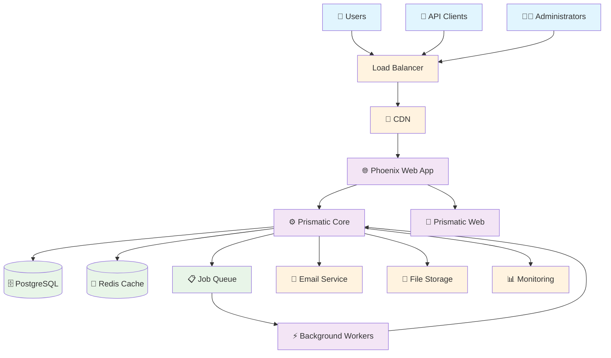

### Component Relationships

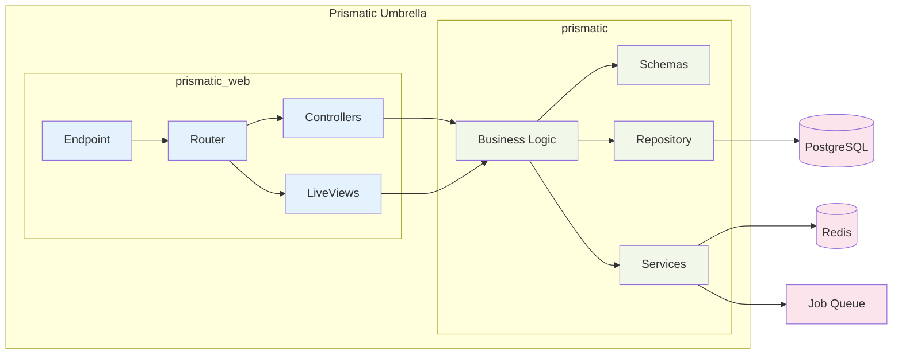

## Data Flow Diagrams

### Request Processing Flow

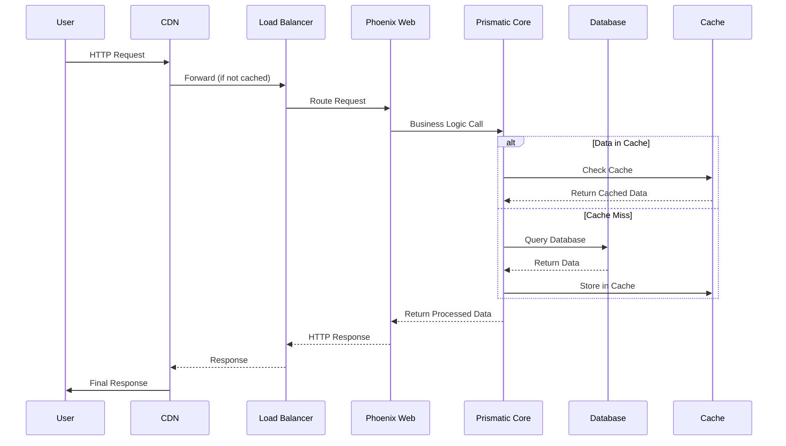

### Background Job Processing

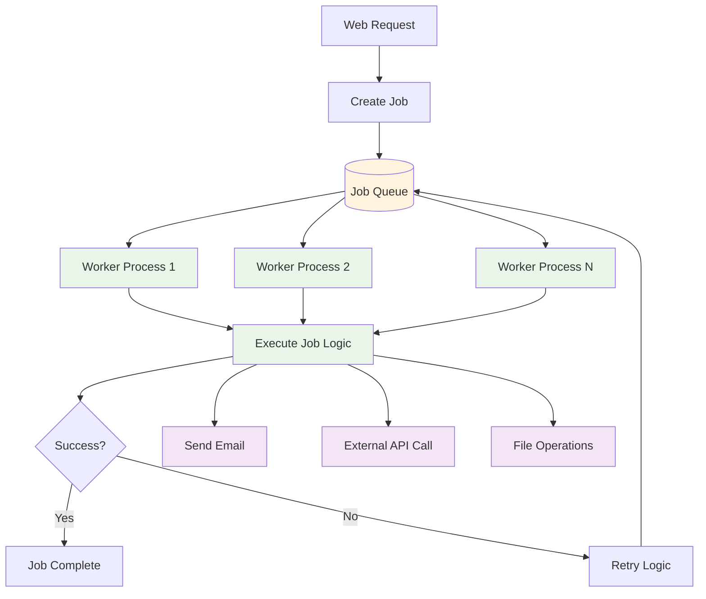

## Deployment Architecture

### Production Environment

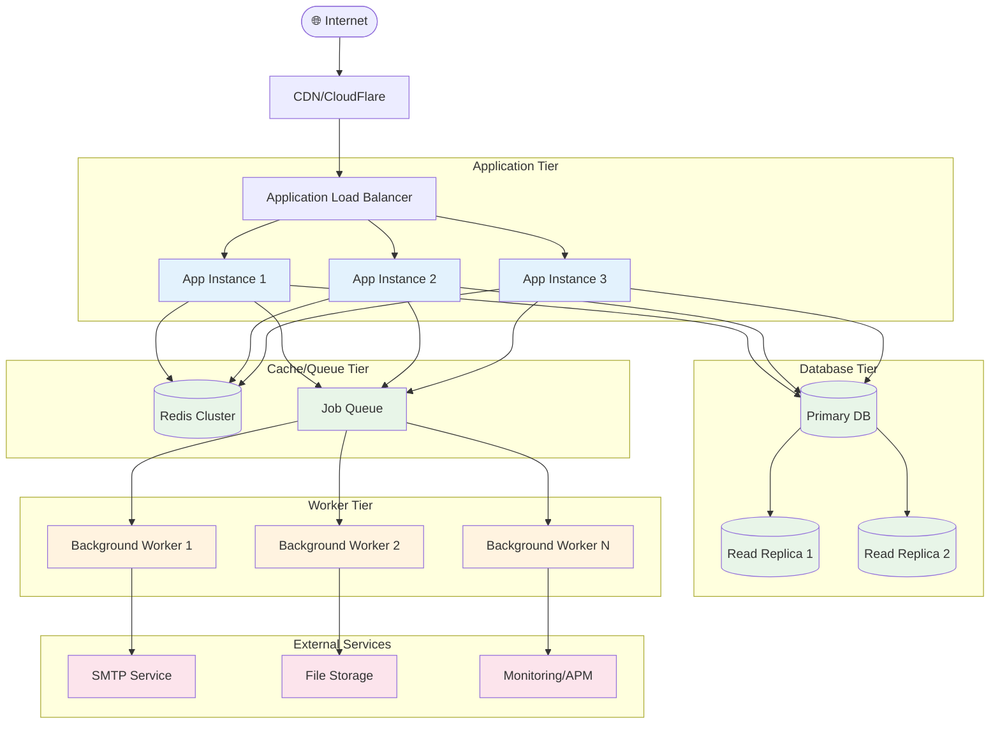

### Development Environment

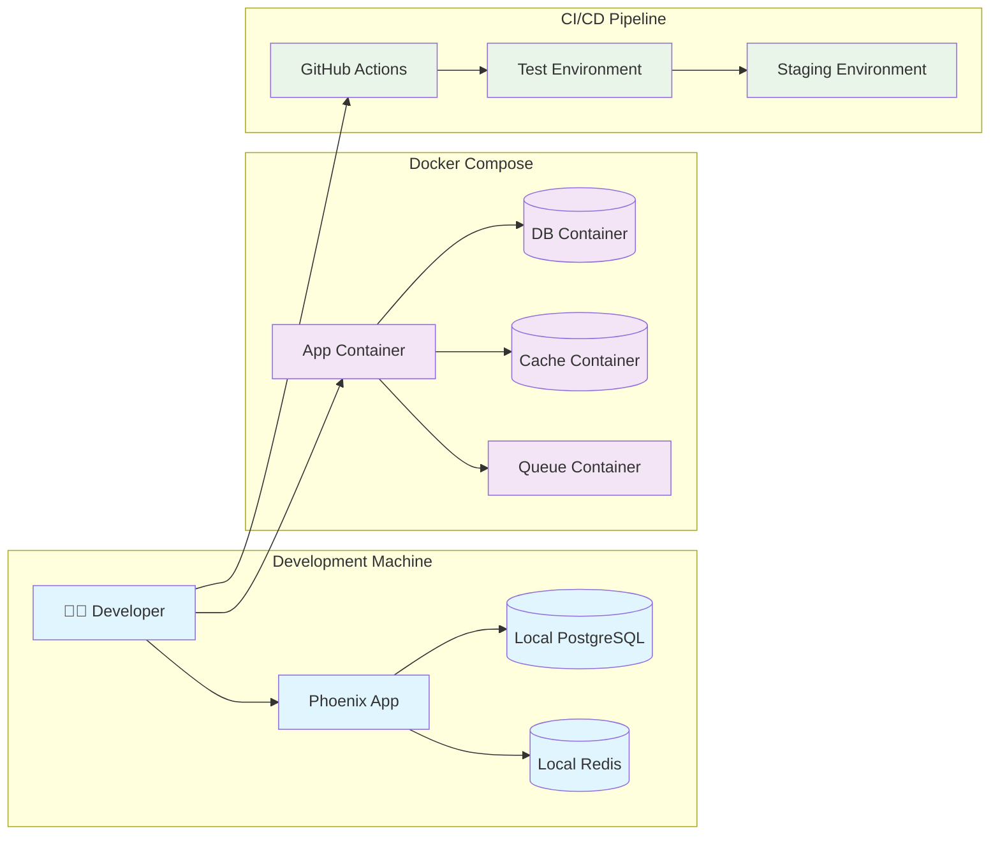

## Integration Architecture

### API Integration Patterns

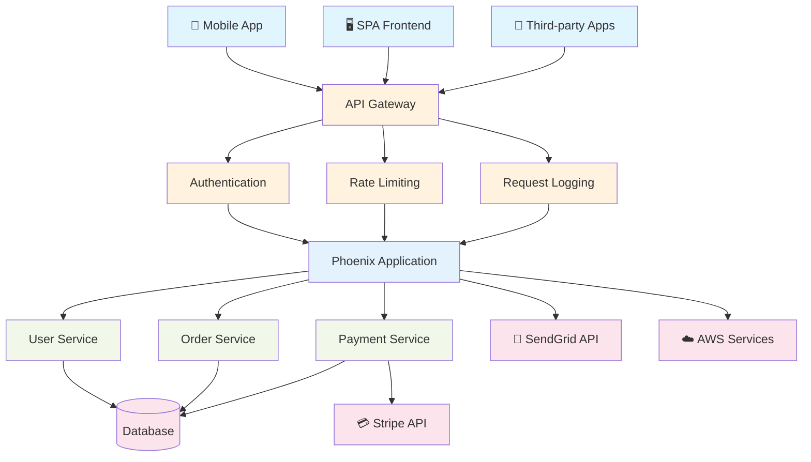

### Message Flow Architecture

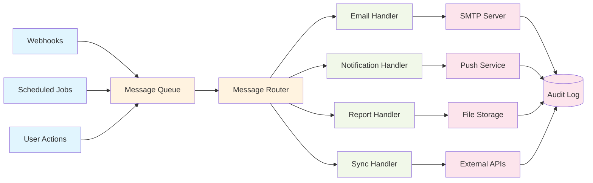

## Security Architecture

### Security Boundaries

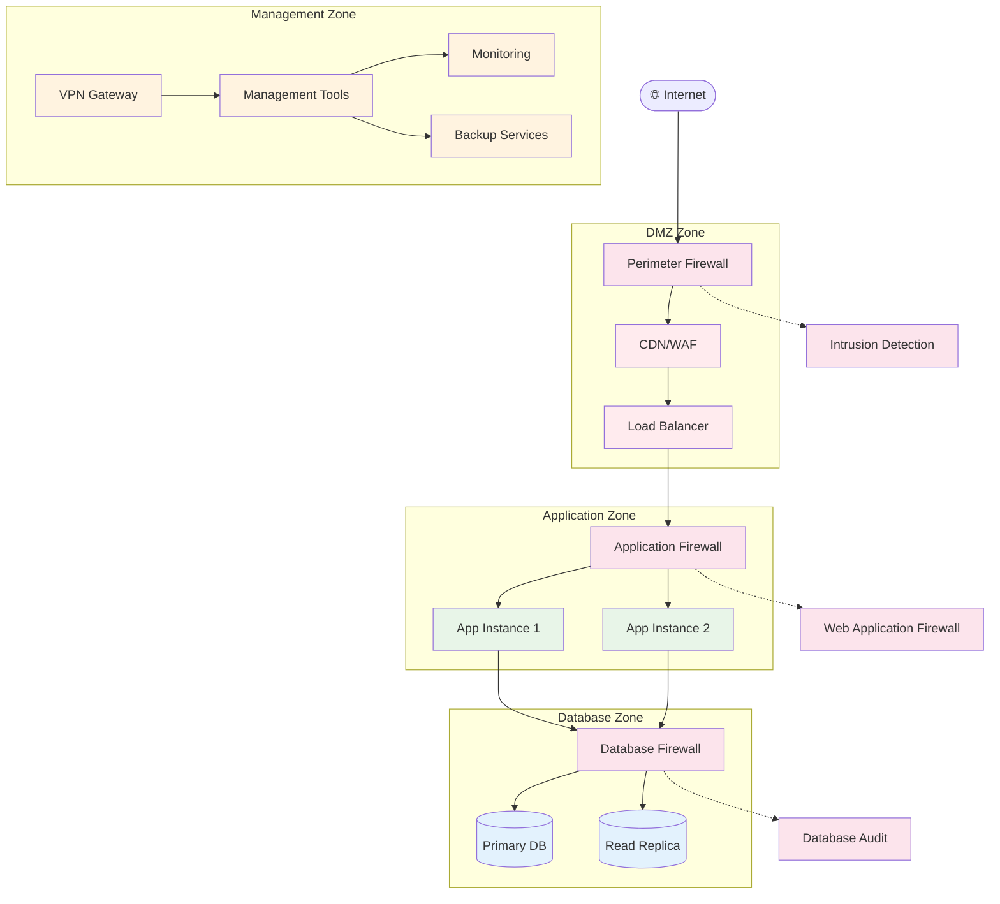

### Authentication and Authorization Flow

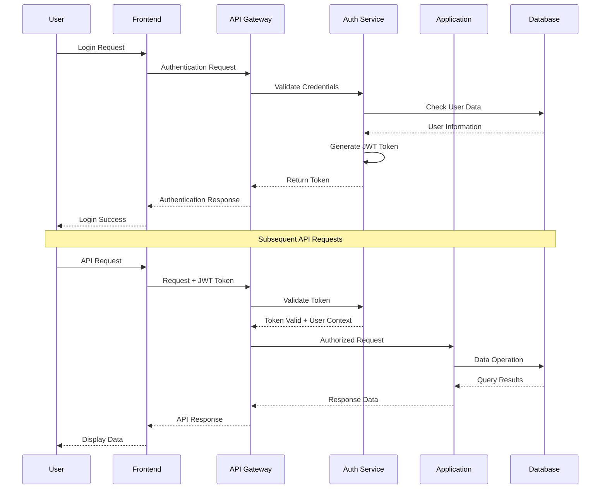

## Monitoring and Observability

### Monitoring Architecture

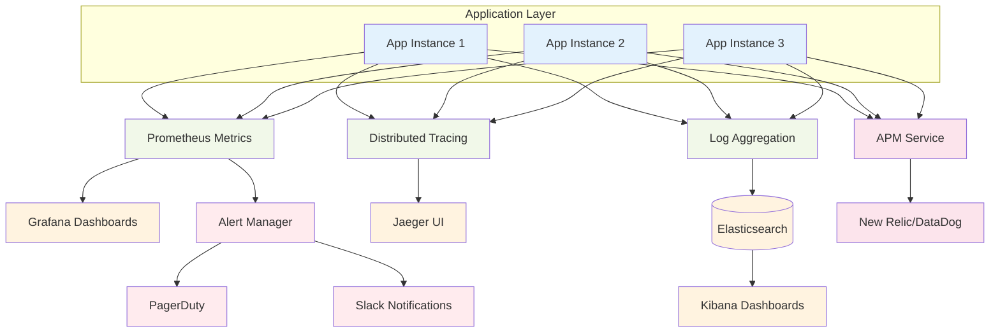

## Performance and Scaling

### Scaling Strategy

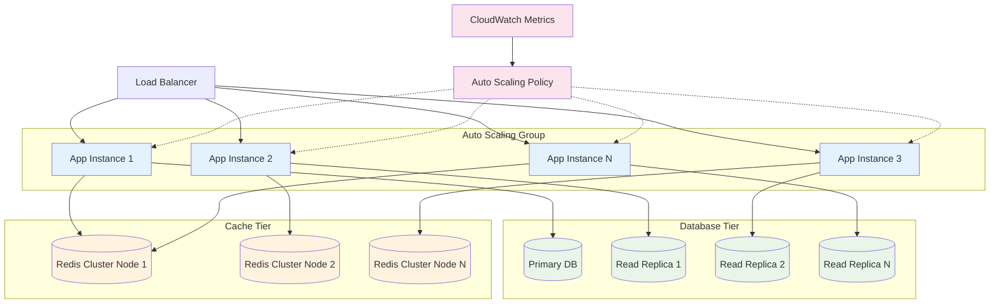

## Disaster Recovery Architecture

### Backup and Recovery Flow

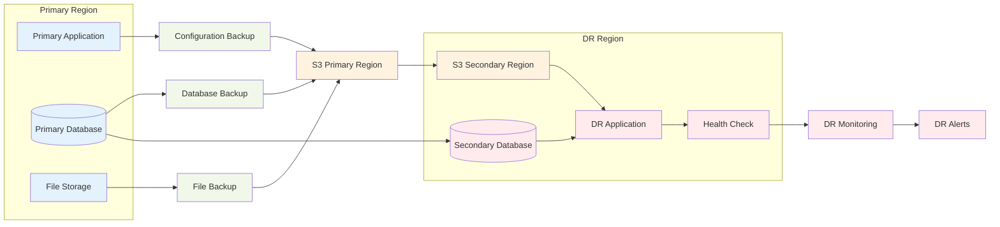

## Diagram Maintenance

### Updating Diagrams
- **Architecture Changes** - Update diagrams when system architecture changes
- **New Components** - Add new components and their relationships
- **Integration Updates** - Reflect changes in external integrations
- **Performance Modifications** - Update scaling and performance diagrams

### Diagram Validation
- **Consistency Checks** - Ensure diagrams match actual system implementation
- **Cross-Reference Validation** - Verify diagrams align with architecture documentation
- **Stakeholder Review** - Regular review with architecture and development teams
- **Version Control** - Maintain diagram versions alongside code changes

### Tools and Standards
- **Mermaid Syntax** - Use Mermaid for maintainable, version-controlled diagrams
- **Consistent Styling** - Apply consistent colors, shapes, and notation
- **Clear Labels** - Use descriptive labels and legends
- **Accessibility** - Ensure diagrams are accessible and well-documented

## Related Documentation

- [Architecture Overview](../core/architecture-overview.md) - Detailed textual description of system architecture
- [ADR-0001: Umbrella Structure](adr-0001-umbrella-structure.md) - Decision record for umbrella application architecture
- [ADR-0003: Security Model](adr-0003-security-model.md) - Security architecture decisions and implementation
- [Performance Optimization](../guides/performance-optimization.md) - Performance considerations reflected in system design
- [API Endpoints](../reference/api-endpoints.md) - API structure and endpoint documentation
- [Monitoring Setup](../operations/monitoring-setup.md) - Implementation details for monitoring architecture
- [Deployment Procedures](../operations/deployment-procedures.md) - Deployment processes for architecture shown in diagrams

---

**These diagrams are living documents that should be updated as the system evolves. They serve as both design communication tools and implementation reference materials.**