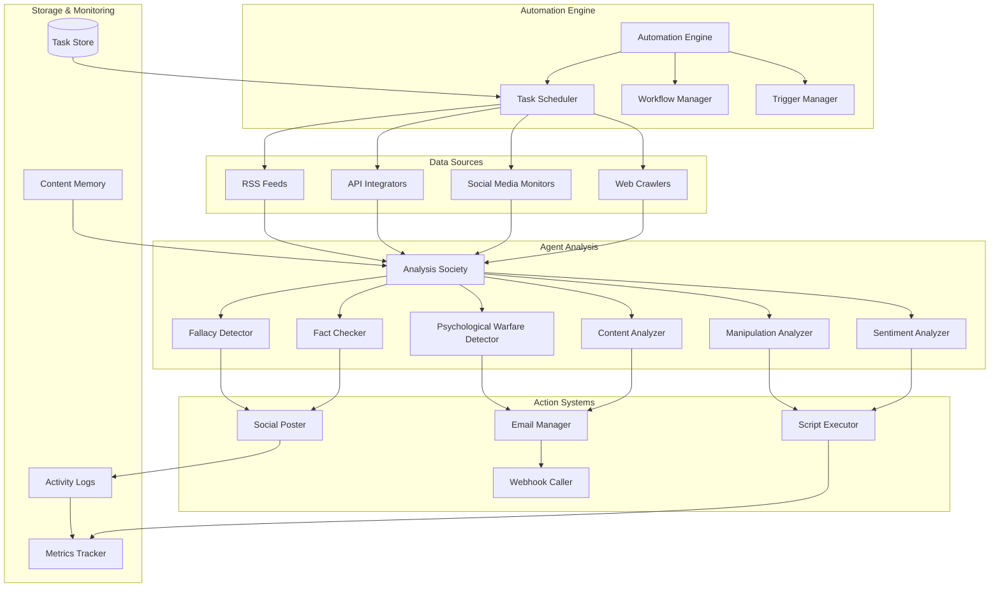

# Automation & Background Tasks Documentation

The automation system enables Prismatic agents to operate autonomously through background tasks, web crawling, social media monitoring, and reactive workflows.

## 📋 Overview

The automation system provides:
- **Background Task Scheduling**: Cron-like periodic task execution
- **Web Crawling**: Automated website monitoring and data extraction
- **Social Media Integration**: Twitter, Facebook, LinkedIn monitoring and interaction
- **Reactive Workflows**: Event-driven automation with agent analysis
- **Multi-Modal Actions**: Email, social posts, script execution, API calls
- **Content Analysis**: AI-powered content classification and fact-checking
- **[Psychological Warfare Integration](../psychological-warfare/)**: Automated detection and response to manipulation campaigns across all monitored channels

## 🏗️ Architecture



## 🕷️ Web Crawling System

### Crawler Configuration

```elixir
defmodule Prismatic.Automation.WebCrawler do
  defstruct [
    :id,
    :name,
    :target_url,
    :crawl_pattern,     # CSS selectors or XPath
    :schedule,          # Cron expression
    :rate_limit,        # Requests per minute
    :user_agent,
    :headers,
    :filters,           # Content filtering rules
    :extraction_rules,  # Data extraction patterns
    :change_detection,  # What constitutes a "change"
    :society_id,        # Which society analyzes the content
    :actions,           # What to do when triggers fire
    :metadata,
    :psychological_warfare_config  # Manipulation detection settings
  ]
end

### Example: Hacker News Monitoring

```elixir
# Configure Hacker News crawler
hn_crawler = %Prismatic.Automation.WebCrawler{
  id: "hackernews_monitor",
  name: "Hacker News Front Page Monitor",
  target_url: "https://news.ycombinator.com/",
  crawl_pattern: ".storylink",
  schedule: "*/5 * * * *",  # Every 5 minutes
  rate_limit: 12,           # 12 requests per minute
  extraction_rules: %{
    title: ".storylink",
    url: ".storylink @href",
    score: ".score",
    comments: ".subtext a:last-child",
    timestamp: ".age"
  },
  change_detection: :new_stories,
  society_id: "tech_analysis_society",
  psychological_warfare_config: %{
    manipulation_detection: true,
    fallacy_analysis: true,
    coordinated_campaign_detection: true,
    threat_escalation_threshold: 0.7
  },
  actions: [
    %{
      trigger: %{keywords: ["AI", "machine learning", "LLM"]},
      actions: [
        {:email, "tech-alerts@company.com", template: :tech_alert},
        {:tweet, template: :interesting_tech},
        {:slack, channel: "#tech-news", template: :tech_summary}
      ]
    },
    %{
      trigger: %{score: {:greater_than, 500}},
      actions: [
        {:analyze_deeply, society: "deep_tech_analysis"},
        {:save_to_research, category: "trending_tech"}
      ]
    }
  ]
}

# Register the crawler
Prismatic.Automation.register_crawler(hn_crawler)
```

## 📱 Social Media Monitoring

### Twitter Integration

```elixir
defmodule Prismatic.Automation.TwitterMonitor do
  defstruct [
    :id,
    :name,
    :monitor_type,      # :hashtag, :mention, :keyword, :user
    :query,             # Search query or hashtag
    :schedule,          # How often to check
    :filters,           # Language, location, etc.
    :analysis_society,  # Which society analyzes tweets
    :reaction_rules,    # When and how to react
    :rate_limits,       # API rate limiting
    :credentials,
    :psychological_warfare_config  # Bot detection, manipulation analysis
  ]
end

### Example: Crypto Trading Signals

```elixir
# Monitor crypto hashtags for trading signals
crypto_monitor = %Prismatic.Automation.TwitterMonitor{
  id: "crypto_sentiment_monitor",
  name: "Crypto Sentiment Analysis",
  monitor_type: :hashtag,
  query: "#crypto OR #bitcoin OR #ethereum",
  schedule: "*/2 * * * *",  # Every 2 minutes
  filters: %{
    language: "en",
    min_followers: 1000,
    exclude_retweets: true
  },
  analysis_society: "crypto_analysis_society",
  psychological_warfare_config: %{
    bot_detection: true,
    manipulation_campaign_detection: true,
    coordinated_inauthentic_behavior: true,
    pump_and_dump_detection: true
  },
  reaction_rules: [
    %{
      trigger: %{
        sentiment: :very_positive,
        confidence: {:greater_than, 0.8},
        volume: {:spike, 300}  # 300% increase in mentions
      },
      actions: [
        {:execute_script, "scripts/crypto_buy_signal.py"},
        {:webhook, "https://trading-bot.com/api/signal", method: :post},
        {:email, "trader@company.com", template: :buy_signal}
      ]
    },
    %{
      trigger: %{
        sentiment: :very_negative,
        keywords: ["crash", "dump", "sell"],
        confidence: {:greater_than, 0.7}
      },
      actions: [
        {:execute_script, "scripts/crypto_sell_signal.py"},
        {:slack, channel: "#trading-alerts", template: :sell_warning}
      ]
    }
  ]
}

# Register the monitor
Prismatic.Automation.register_social_monitor(crypto_monitor)
```

### Facebook Group Monitoring

```elixir
# Monitor Facebook groups for fake news
fb_monitor = %Prismatic.Automation.FacebookMonitor{
  id: "fake_news_detector",
  name: "Fake News Detection in Health Groups",
  monitor_type: :group,
  target_groups: [
    "health-wellness-community",
    "natural-remedies-group",
    "medical-advice-sharing"
  ],
  schedule: "0 */2 * * *",  # Every 2 hours
  analysis_society: "fact_checking_society",
  reaction_rules: [
    %{
      trigger: %{
        fake_news_probability: {:greater_than, 0.7},
        health_misinformation: true
      },
      actions: [
        {:comment, template: :fact_check_response},
        {:report_to_moderators, reason: :misinformation},
        {:log_incident, database: :misinformation_tracker}
      ]
    },
    %{
      trigger: %{
        medical_advice: true,
        unlicensed_source: true
      },
      actions: [
        {:comment, template: :medical_disclaimer},
        {:private_message, template: :health_warning}
      ]
    }
  ]
}
```

## 🤖 Agent Analysis Societies

### Content Analysis Society

```elixir
# Create specialized society for content analysis
analysis_society = %{
  id: "content_analysis_society",
  name: "Content Analysis & Fact Checking",
  agents: [
    %{
      role: :content_classifier,
      template: :content_classifier,
      specialization: :topic_detection
    },
    %{
      role: :fact_checker,
      template: :fact_checker,
      specialization: :health_misinformation
    },
    %{
      role: :sentiment_analyzer,
      template: :sentiment_analyzer,
      specialization: :social_media_sentiment
    },
    %{
      role: :trend_analyzer,
      template: :trend_analyzer,
      specialization: :viral_content_prediction
    },
    %{
      role: :psychological_warfare_analyst,
      template: :psychological_warfare_expert,
      specialization: :manipulation_detection
    },
    %{
      role: :fallacy_detector,
      template: :logical_reasoning_expert,
      specialization: :logical_fallacy_identification
    }
  ],
  workflow: :parallel_analysis,
  consensus_threshold: 0.75,
  escalation_rules: [
    %{
      condition: :high_confidence_fake_news,
      action: :immediate_response
    },
    %{
      condition: :uncertain_classification,
      action: :human_review_queue
    }
  ]
}
```

### Analysis Workflow

```elixir
defmodule Prismatic.Automation.ContentAnalysis do
  def analyze_content(content, source_info, society_id) do
    # 1. Parallel analysis by specialized agents
    analysis_tasks = [
      Task.async(fn -> classify_content(content, society_id) end),
      Task.async(fn -> check_facts(content, society_id) end),
      Task.async(fn -> analyze_sentiment(content, society_id) end),
      Task.async(fn -> detect_trends(content, source_info, society_id) end),
      Task.async(fn -> analyze_psychological_threats(content, source_info, society_id) end),
      Task.async(fn -> detect_logical_fallacies(content, society_id) end)
    ]
    
    # 2. Collect results
    results = Task.await_many(analysis_tasks, :timer.seconds(30))
    
    # 3. Synthesize findings
    synthesis = synthesize_analysis(results, society_id)
    
    # 4. Determine actions based on synthesis
    actions = determine_actions(synthesis, source_info)
    
    # 5. Execute actions if confidence threshold met
    if synthesis.confidence >= 0.7 do
      execute_actions(actions, synthesis)
    else
      queue_for_human_review(content, synthesis, source_info)
    end
    
    synthesis
  end
  
  defp classify_content(content, society_id) do
    # Use content classifier agent
    Prismatic.Society.request_analysis(
      society_id, 
      :content_classifier, 
      content,
      %{task: :topic_classification}
    )
  end
  
  defp check_facts(content, society_id) do
    # Use fact checker agent with external verification
    Prismatic.Society.request_analysis(
      society_id,
      :fact_checker,
      content,
      %{
        task: :fact_verification,
        sources: ["snopes.com", "factcheck.org", "politifact.com"]
      }
    )
  end
end
```

## ⚡ Action Systems

### Email Actions

```elixir
defmodule Prismatic.Automation.Actions.Email do
  def send_alert(template, data, recipients) do
    case template do
      :tech_alert ->
        subject = "🚨 Tech Alert: #{data.title}"
        body = render_tech_alert_template(data)
        
      :buy_signal ->
        subject = "📈 Crypto Buy Signal: #{data.symbol}"
        body = render_trading_signal_template(data)
        
      :fact_check_response ->
        subject = "⚠️ Fact Check Alert"
        body = render_fact_check_template(data)
    end
    
    Prismatic.Email.send(recipients, subject, body)
  end
end
```

### Social Media Actions

```elixir
defmodule Prismatic.Automation.Actions.Social do
  def post_tweet(template, data) do
    tweet_text = case template do
      :interesting_tech ->
        "🔥 Trending on HN: #{data.title} #{data.url} #tech #innovation"
        
      :crypto_alert ->
        "📊 Crypto Alert: #{data.symbol} showing #{data.sentiment} sentiment. Volume spike: #{data.volume_change}% #crypto"
    end
    
    Prismatic.Twitter.post_tweet(tweet_text)
  end
  
  def post_facebook_comment(post_id, template, data) do
    comment_text = case template do
      :fact_check_response ->
        """
        ⚠️ Fact Check Alert: This information may be inaccurate. 
        
        According to verified sources:
        #{data.fact_check_summary}
        
        Please verify health information with licensed medical professionals.
        Sources: #{Enum.join(data.sources, ", ")}
        """
        
      :medical_disclaimer ->
        """
        🏥 Medical Disclaimer: The information shared here should not replace professional medical advice. 
        Please consult with a licensed healthcare provider for medical concerns.
        """
    end
    
    Prismatic.Facebook.post_comment(post_id, comment_text)
  end
end
```

### Script Execution

```elixir
defmodule Prismatic.Automation.Actions.Scripts do
  def execute_script(script_path, data, options \\ []) do
    # Prepare environment variables
    env_vars = [
      {"PRISMATIC_DATA", Jason.encode!(data)},
      {"PRISMATIC_TIMESTAMP", DateTime.utc_now() |> DateTime.to_iso8601()},
      {"PRISMATIC_SOURCE", data.source || "unknown"}
    ]
    
    # Execute script with timeout and monitoring
    case System.cmd(script_path, [], 
      env: env_vars,
      timeout: Keyword.get(options, :timeout, 30_000),
      stderr_to_stdout: true
    ) do
      {output, 0} ->
        Logger.info("Script executed successfully: #{script_path}")
        {:ok, output}
        
      {error_output, exit_code} ->
        Logger.error("Script failed: #{script_path}, exit_code: #{exit_code}, output: #{error_output}")
        {:error, {exit_code, error_output}}
    end
  end
end
```

## 📊 Task Scheduling & Management

### Cron-like Scheduler

```elixir
defmodule Prismatic.Automation.Scheduler do
  use GenServer
  
  defstruct [
    :tasks,
    :running_tasks,
    :task_history,
    :metrics
  ]
  
  def schedule_task(task_config) do
    GenServer.call(__MODULE__, {:schedule_task, task_config})
  end
  
  def list_tasks do
    GenServer.call(__MODULE__, :list_tasks)
  end
  
  def pause_task(task_id) do
    GenServer.call(__MODULE__, {:pause_task, task_id})
  end
  
  def resume_task(task_id) do
    GenServer.call(__MODULE__, {:resume_task, task_id})
  end
  
  # Server implementation
  @impl true
  def init(_) do
    # Schedule periodic task execution check
    :timer.send_interval(60_000, :check_scheduled_tasks)  # Every minute
    
    state = %__MODULE__{
      tasks: %{},
      running_tasks: %{},
      task_history: [],
      metrics: %{}
    }
    
    {:ok, state}
  end
  
  @impl true
  def handle_info(:check_scheduled_tasks, state) do
    # Check which tasks should run now
    current_time = DateTime.utc_now()
    
    tasks_to_run = Enum.filter(state.tasks, fn {_id, task} ->
      should_run_task?(task, current_time) and not task_running?(task.id, state.running_tasks)
    end)
    
    # Start tasks
    updated_running_tasks = Enum.reduce(tasks_to_run, state.running_tasks, fn {task_id, task}, acc ->
      case start_task(task) do
        {:ok, pid} ->
          Map.put(acc, task_id, %{pid: pid, started_at: current_time})
        {:error, reason} ->
          Logger.error("Failed to start task #{task_id}: #{inspect(reason)}")
          acc
      end
    end)
    
    {:noreply, %{state | running_tasks: updated_running_tasks}}
  end
  
  defp should_run_task?(task, current_time) do
    case task.schedule_type do
      :cron ->
        Crontab.DateChecker.matches_date?(task.cron_expression, current_time)
      :interval ->
        time_since_last_run(task) >= task.interval
      :once ->
        not task.executed?
    end
  end
end
```

## 🔧 Configuration Examples

### Complete Automation Workflow

```elixir
# Example: Comprehensive social media monitoring and response system
automation_config = %{
  name: "Social Media Intelligence & Response System",
  
  # Data sources
  sources: [
    %{
      type: :twitter_monitor,
      config: %{
        hashtags: ["#AI", "#MachineLearning", "#TechNews"],
        keywords: ["artificial intelligence", "deep learning"],
        schedule: "*/3 * * * *"  # Every 3 minutes
      }
    },
    %{
      type: :web_crawler,
      config: %{
        urls: ["https://news.ycombinator.com", "https://reddit.com/r/MachineLearning"],
        schedule: "*/10 * * * *"  # Every 10 minutes
      }
    },
    %{
      type: :rss_feed,
      config: %{
        feeds: ["https://feeds.feedburner.com/oreilly/radar"],
        schedule: "0 */1 * * *"  # Every hour
      }
    }
  ],
  
  # Analysis society
  analysis_society: %{
    id: "ai_news_analysis",
    agents: [
      %{role: :content_classifier, template: :tech_classifier},
      %{role: :trend_analyzer, template: :trend_detector},
      %{role: :sentiment_analyzer, template: :sentiment_expert},
      %{role: :impact_assessor, template: :business_analyst}
    ]
  },
  
  # Reaction rules
  reactions: [
    %{
      name: "High Impact AI News",
      trigger: %{
        category: "AI breakthrough",
        impact_score: {:greater_than, 8.0},
        sentiment: :positive,
        source_credibility: {:greater_than, 0.8}
      },
      actions: [
        {:email, ["team@company.com"], template: :breakthrough_alert},
        {:slack, "#ai-news", template: :breakthrough_summary},
        {:tweet, template: :ai_breakthrough_tweet},
        {:save_to_research, category: "ai_breakthroughs"}
      ]
    },
    %{
      name: "Negative AI Sentiment Spike",
      trigger: %{
        sentiment: :very_negative,
        volume_spike: {:greater_than, 200},
        keywords: ["AI risk", "AI danger", "AI threat"]
      },
      actions: [
        {:analyze_deeply, society: "ai_risk_analysis"},
        {:prepare_response, template: :ai_safety_response},
        {:alert_pr_team, urgency: :high}
      ]
    }
  ]
}

# Deploy the automation system
Prismatic.Automation.deploy_workflow(automation_config)
```

## 🎯 Implementation Status

- [ ] **Phase 3**: Basic Automation Framework
  - [ ] Task scheduler with cron support
  - [ ] Basic web crawler
  - [ ] Simple action system (email, webhooks)
  - [ ] Task persistence and monitoring

- [ ] **Phase 5**: Social Media Integration
  - [ ] Twitter API integration
  - [ ] Facebook API integration
  - [ ] LinkedIn monitoring
  - [ ] Social media action system

- [ ] **Phase 6**: Advanced Analysis
  - [ ] Content analysis societies
  - [ ] Fact-checking integration
  - [ ] Sentiment analysis
  - [ ] Trend detection algorithms

- [ ] **Phase 7**: Reactive Workflows
  - [ ] Complex trigger systems
  - [ ] Multi-modal actions
  - [ ] Script execution framework
  - [ ] Workflow orchestration

## 📚 Documentation Structure

- [`web-crawling.md`](web-crawling.md) - Web scraping and monitoring systems
- [`social-media.md`](social-media.md) - Social platform integration and monitoring
- [`task-scheduling.md`](task-scheduling.md) - Cron-like scheduling and task management
- [`action-systems.md`](action-systems.md) - Email, social posting, script execution
- [`analysis-workflows.md`](analysis-workflows.md) - Agent-based content analysis
- [`trigger-systems.md`](trigger-systems.md) - Event detection and reaction rules
- [`api-reference.md`](api-reference.md) - Complete automation API documentation

## 🔗 Related Documentation

- [Agent System](../agents/README.md) - Core agent infrastructure for analysis
- [Society Management](../societies/README.md) - Agent coordination for analysis tasks
- [Scenarios](../scenarios/README.md) - Analysis scenario templates
- [Dynamic Configuration](../dynamic-configuration/README.md) - Runtime configuration management
- [Development Plan](../development-plan.md) - Overall project roadmap
- [Psychological Warfare](../psychological-warfare/README.md) - Automated manipulation detection and countermeasures across all monitored channels