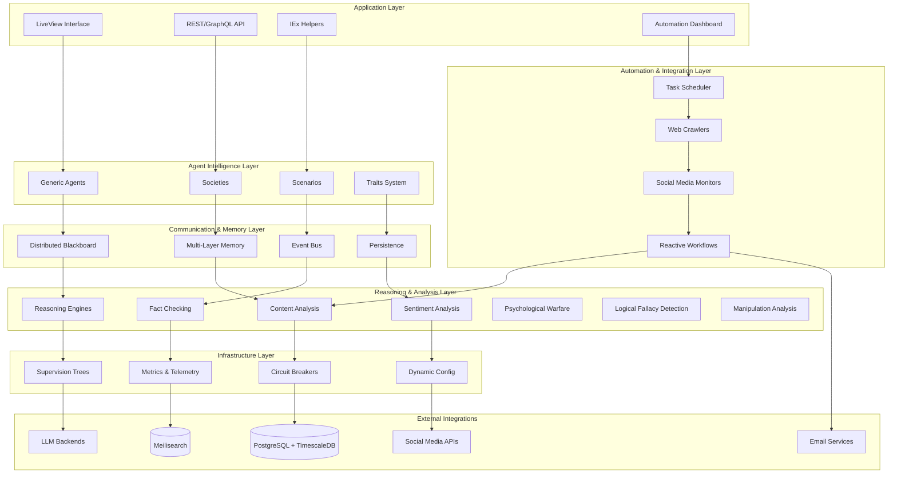

# 🏔️ Prismatic Next-Gen: Systems-First Alpine Development Plan

## 📋 Executive Summary

This document outlines a comprehensive 8-phase alpine-style development plan for building Prismatic from the ground up, starting with bulletproof core infrastructure and progressively adding advanced cognitive capabilities, automation systems, and production-ready features. The approach prioritizes rock-solid foundations, SOLID principles, and incremental value delivery.

## 🎯 Project Context & Philosophy

- **Current Workspace**: `/home/korczis/dev/prismatic` - Next-gen Elixir/Phoenix implementation
- **Legacy Source**: `/external/prismatic-legacy/` - Reference architecture and proven patterns
- **Development Philosophy**: Systems-first, bottom-up approach with bulletproof foundations
- **Core Principle**: Build generic, extensible agent infrastructure supporting any cognitive model
- **Quality Standard**: Production-ready, enterprise-grade architecture from day one
- **Psychological Warfare Integration**: [Logical fallacy detection](psychological-warfare/), manipulation analysis, and dark persuasion countermeasures integrated throughout all system layers

## 🏗️ Enhanced Systems Architecture Overview



## 🗺️ Enhanced 8-Phase Development Roadmap

### Phase Overview with Automation Integration

| Phase | Focus | Duration | Key Deliverables | Automation & Psychological Warfare |
|-------|-------|----------|------------------|-----------------------------------|
| **1** | [Core Agent System](agents/) | 2 weeks | Generic agents, LLM backends, basic memory | Task scheduling foundation, basic fallacy detection |
| **2** | [Communication System](blackboard/) | 2 weeks | Distributed blackboard, pub/sub, event bus | Basic web crawling, manipulation pattern recognition |
| **3** | [Agent Persistence](persistence/) | 2 weeks | State serialization, restoration, versioning | Simple automation triggers, psychological profile storage |
| **4** | [Society Management](societies/) | 2 weeks | Agent groups, scenarios, crisis training | Social media monitoring, dark persuasion countermeasures |
| **5** | [Reasoning & Analysis](reasoning/) | 2 weeks | Lean4, Prolog, content analysis societies | Advanced content analysis, comprehensive fallacy detection |
| **6** | [Advanced Memory & Traits](memory/) | 2 weeks | Trait-based memory, learning, analytics | Reactive workflows, manipulation resistance training |
| **7** | [Distributed Operations](distributed/) | 2 weeks | Multi-node societies, consensus, automation | Distributed task execution, coordinated psychological defense |
| **8** | [Management Interface](ui/) | 2 weeks | LiveView UI, automation dashboard, analytics | Complete automation platform, psychological warfare dashboard |

## 📋 Detailed Phase Specifications

### Phase 1: Foundation & Core Agent System (Weeks 1-2)
**Status**: 🎯 Ready for Implementation

#### Core Deliverables
- **Agent Protocol System**: Bulletproof protocol-based architecture with SOLID compliance
- **LLM Backend Integration**: Anthropic, OpenAI, Ollama, and local model support
- **Basic Memory System**: Working memory with conversation history
- **Supervision Architecture**: Fault-tolerant supervision trees with intelligent restart
- **IEx Helper Foundation**: Developer-friendly testing and interaction tools
- **Task Scheduling Core**: Basic cron-like scheduling infrastructure
- **[Psychological Warfare Foundation](psychological-warfare/)**: Basic logical fallacy detection and manipulation pattern recognition

#### Technical Specifications
```elixir
# Core Agent Protocol
defprotocol Prismatic.Agent.Protocol do
  def process_message(agent, message, context)
  def get_state(agent)
  def update_config(agent, config)
  def serialize(agent)
end

# Task Scheduler Foundation
defmodule Prismatic.Automation.Scheduler do
  def schedule_task(task_config)
  def list_tasks()
  def pause_task(task_id)
  def resume_task(task_id)
end

# Psychological Warfare Foundation
defmodule Prismatic.PsychologicalWarfare.Foundation do
  def detect_basic_fallacies(text, context)
  def identify_manipulation_patterns(content, metadata)
  def analyze_persuasion_techniques(message, sender_profile)
  def generate_countermeasures(threat_assessment)
end
```

#### Success Criteria
- [ ] Agent creation < 10ms with any LLM backend
- [ ] Multiple agents run concurrently without interference
- [ ] Memory system stores/retrieves conversation history reliably
- [ ] Supervision handles crashes gracefully with state recovery
- [ ] Basic agent API functional (send message, get response)
- [ ] Simple scheduled tasks execute on time
- [ ] Basic fallacy detection identifies common logical errors with >80% accuracy
- [ ] Manipulation pattern recognition flags suspicious content for review

#### Automation Foundation
- **Task Scheduler**: Basic cron expression support
- **Configuration System**: Dynamic task configuration
- **Monitoring**: Task execution logging and metrics
- **Error Handling**: Robust failure recovery for scheduled tasks

### Phase 2: Communication & Event Systems (Weeks 3-4)
**Status**: 🎯 Ready for Implementation

#### Core Deliverables
- **Event Bus System**: High-performance event bus with pattern matching and circuit breakers
- **Distributed Blackboard**: Mnesia-based distributed storage with pattern subscriptions
- **Circuit Breaker Integration**: Comprehensive fault tolerance with intelligent backoff
- **Integration Testing Framework**: End-to-end component interaction validation
- **Performance Benchmarking**: Scalability validation and optimization
- **Web Crawling System**: Basic website monitoring and content extraction
- **[Manipulation Pattern Recognition](psychological-warfare/)**: Advanced pattern matching for psychological manipulation techniques

#### Technical Specifications
```elixir
# Enhanced Event Bus
defmodule Prismatic.EventBus.Enhanced do
  def publish(event_type, payload, metadata \\ %{})
  def subscribe(pattern, handler, options \\ [])
  def replay_events(from_timestamp, to_timestamp, pattern \\ "*")
end

# Web Crawler
defmodule Prismatic.Automation.WebCrawler do
  def configure_crawler(crawler_config)
  def start_crawling(crawler_id)
  def extract_content(url, extraction_rules)
end

# Manipulation Pattern Recognition
defmodule Prismatic.PsychologicalWarfare.PatternRecognition do
  def analyze_communication_patterns(messages, context)
  def detect_gaslighting_techniques(conversation_history)
  def identify_emotional_manipulation(content, sender_metadata)
  def flag_coordinated_influence_campaigns(message_cluster)
end
```

#### Success Criteria
- [ ] Agents communicate across multiple nodes seamlessly
- [ ] Event system maintains ordering guarantees under load
- [ ] Circuit breakers prevent cascade failures effectively
- [ ] Blackboard operations perform under concurrent load
- [ ] Pattern-based subscriptions work correctly with wildcards
- [ ] Web crawlers extract content reliably from target sites

#### Automation Enhancements
- **Web Crawling**: CSS selector and XPath-based content extraction
- **Change Detection**: Intelligent content change identification
- **Rate Limiting**: Respectful crawling with configurable delays
- **Content Storage**: Structured storage of extracted content

### Phase 3: Persistence & State Management (Weeks 5-6)
**Status**: 🎯 Architecture Complete

#### Core Deliverables
- **State Serialization**: Complete agent state persistence with versioning
- **Recovery Mechanisms**: Automatic state restoration after failures
- **Migration System**: Seamless upgrades between system versions
- **Backup Strategies**: Comprehensive data protection and recovery
- **Configuration Persistence**: Dynamic configuration with rollback capabilities
- **Automation Triggers**: Event-driven automation with persistent state
- **[Psychological Profile Storage](psychological-warfare/)**: Persistent storage of manipulation patterns and psychological assessments

#### Technical Specifications
```elixir
# Persistence System
defmodule Prismatic.Persistence.Manager do
  def save_agent_state(agent_id, state, version)
  def restore_agent_state(agent_id, version \\ :latest)
  def create_system_snapshot(description)
  def rollback_to_snapshot(snapshot_id)
end

# Automation Triggers
defmodule Prismatic.Automation.Triggers do
  def register_trigger(trigger_config)
  def evaluate_triggers(content, source_info)
  def execute_actions(actions, context)
end

# Psychological Profile Storage
defmodule Prismatic.PsychologicalWarfare.ProfileStorage do
  def store_psychological_profile(entity_id, profile_data, version)
  def retrieve_manipulation_history(entity_id, timeframe)
  def update_threat_assessment(entity_id, new_assessment)
  def archive_psychological_evidence(case_id, evidence_data)
end
```

#### Success Criteria
- [ ] Agent state persists across system restarts
- [ ] State restoration maintains full functionality
- [ ] Migration between versions works seamlessly
- [ ] Backup and recovery procedures validated
- [ ] Configuration changes persist and can be rolled back
- [ ] Automation triggers fire reliably based on content changes

#### Automation Integration
- **Persistent Triggers**: Automation rules survive system restarts
- **State-Aware Actions**: Actions can access historical context
- **Workflow Persistence**: Long-running workflows maintain state
- **Audit Trail**: Complete history of automation decisions and actions

### Phase 4: Society Management & Crisis Training (Weeks 7-8)
**Status**: 🎯 Architecture Complete

#### Core Deliverables
- **Society Infrastructure**: IRC-style chat rooms and specialized group types
- **Crisis Negotiation System**: Professional-grade training scenarios with real-time analytics
- **Agent Impersonation**: Users can interact within scenarios as agents
- **Scenario Templates**: Pre-built crisis situations with defined success metrics
- **Real-time Analytics**: Modality tracking and performance measurement
- **Social Media Monitoring**: Twitter, Facebook, LinkedIn integration for content analysis
- **[Dark Persuasion Countermeasures](psychological-warfare/)**: Advanced defense against psychological manipulation in crisis scenarios

#### Technical Specifications
```elixir
# Society Management
defmodule Prismatic.Society.Manager do
  def create_society(name, type, config)
  def add_member(society_id, agent_id)
  def broadcast_message(society_id, message, sender_id)
  def start_scenario(society_id, scenario_template)
end

# Social Media Integration
defmodule Prismatic.Automation.SocialMedia do
  def monitor_hashtag(hashtag, analysis_society)
  def monitor_facebook_group(group_id, moderation_rules)
  def post_response(platform, content, response_template)
end

# Dark Persuasion Countermeasures
defmodule Prismatic.PsychologicalWarfare.Countermeasures do
  def detect_crisis_manipulation(scenario_data, participant_actions)
  def generate_resistance_strategies(manipulation_type, context)
  def train_psychological_resilience(agent_id, training_scenarios)
  def analyze_influence_attempts(communication_log, threat_indicators)
end
```

#### Success Criteria
- [ ] Societies support 50+ concurrent agents efficiently
- [ ] Crisis scenarios track modalities in real-time
- [ ] User impersonation works seamlessly within scenarios
- [ ] Social media monitoring captures relevant content
- [ ] Automated responses maintain appropriate tone and accuracy
- [ ] Analytics provide actionable insights for training improvement

#### Automation Capabilities
- **Social Media Monitoring**: Real-time hashtag and keyword tracking
- **Content Analysis Societies**: Specialized agent groups for content evaluation
- **Automated Responses**: Context-aware social media interactions
- **Fact-Checking Integration**: Automated misinformation detection and response

### Phase 5: Reasoning Engines & Content Analysis (Weeks 9-10)
**Status**: 🎯 Architecture Complete

#### Core Deliverables
- **Reasoning Engine Integration**: Lean4 and Prolog for formal reasoning
- **Content Analysis Societies**: Specialized agent groups for content evaluation
- **Fact-Checking System**: Automated misinformation detection with source verification
- **Sentiment Analysis**: Advanced emotion and opinion detection
- **Trend Detection**: Pattern recognition for viral content prediction
- **Advanced Automation**: Complex trigger systems with multi-modal analysis
- **[Comprehensive Fallacy Detection](psychological-warfare/)**: Advanced logical fallacy identification using formal reasoning engines

#### Technical Specifications
```elixir
# Reasoning Integration
defmodule Prismatic.Reasoning.Engine do
  def prove_theorem(theorem, axioms, engine \\ :lean4)
  def query_knowledge_base(query, facts, engine \\ :prolog)
  def validate_logic(argument, rules)
end

# Content Analysis
defmodule Prismatic.Analysis.ContentAnalyzer do
  def analyze_content(content, analysis_type)
  def fact_check(claim, sources)
  def detect_sentiment(text, context)
  def predict_virality(content, metadata)
end

# Comprehensive Fallacy Detection
defmodule Prismatic.PsychologicalWarfare.FallacyDetection do
  def detect_logical_fallacies(argument, reasoning_engine \\ :lean4)
  def classify_fallacy_type(fallacy_evidence, context)
  def generate_counter_arguments(fallacious_argument, logical_rules)
  def assess_argument_strength(premises, conclusion, evidence)
end
```

#### Success Criteria
- [ ] Reasoning engines integrate seamlessly with agent workflows
- [ ] Content analysis provides accurate classification and sentiment
- [ ] Fact-checking achieves >90% accuracy on test datasets
- [ ] Trend detection identifies viral content with >80% precision
- [ ] Complex automation workflows execute reliably
- [ ] Analysis societies coordinate effectively for comprehensive evaluation

#### Advanced Automation
- **Multi-Modal Analysis**: Combine text, sentiment, and trend analysis
- **Intelligent Triggers**: Context-aware automation based on complex conditions
- **Workflow Orchestration**: Coordinate multiple analysis agents for comprehensive evaluation
- **External API Integration**: Leverage fact-checking and verification services

### Phase 6: Advanced Memory & Dynamic Traits (Weeks 11-12)
**Status**: 🎯 Architecture Complete

#### Core Deliverables
- **Multi-Layer Memory System**: Working, episodic, semantic, and procedural memory
- **Dynamic Trait System**: Runtime-configurable personality traits with evolution
- **Learning Mechanisms**: Trait adaptation based on interaction outcomes
- **Memory Analytics**: Pattern recognition and knowledge extraction
- **Configuration Management**: Hot-swappable system components
- **Reactive Workflow Engine**: Complex automation with agent-based decision making
- **[Manipulation Resistance Training](psychological-warfare/)**: Advanced psychological resilience development for agents

#### Technical Specifications
```elixir
# Advanced Memory
defmodule Prismatic.Memory.MultiLayer do
  def store_memory(agent_id, type, content, metadata)
  def query_memory(agent_id, query, memory_types)
  def consolidate_memories(agent_id, criteria)
  def extract_patterns(agent_id, timeframe)
end

# Dynamic Traits
defmodule Prismatic.Traits.Dynamic do
  def define_trait(trait_definition)
  def apply_trait_to_agent(agent_id, trait_id, parameters)
  def evolve_trait(agent_id, trait_id, feedback)
end

# Manipulation Resistance Training
defmodule Prismatic.PsychologicalWarfare.ResistanceTraining do
  def design_resistance_scenarios(agent_profile, vulnerability_assessment)
  def conduct_psychological_inoculation(agent_id, manipulation_types)
  def measure_resistance_improvement(agent_id, pre_post_assessments)
  def adapt_training_based_on_performance(agent_id, training_results)
end
```

#### Success Criteria
- [ ] Memory system handles complex queries across multiple layers
- [ ] Traits evolve based on interaction feedback
- [ ] Configuration changes apply without system restart
- [ ] Learning mechanisms improve agent performance over time
- [ ] Memory analytics identify meaningful patterns
- [ ] Reactive workflows adapt to changing conditions

#### Automation Evolution
- **Adaptive Workflows**: Automation that learns from outcomes
- **Dynamic Configuration**: Runtime modification of automation rules
- **Pattern-Based Triggers**: Automation based on learned behavioral patterns
- **Intelligent Escalation**: Automated decision-making with human oversight

### Phase 7: Distributed Operations & Scale (Weeks 13-14)
**Status**: 🎯 Architecture Complete

#### Core Deliverables
- **Multi-Node Architecture**: Distributed agent societies across multiple nodes
- **Consensus Mechanisms**: Reliable distributed decision-making
- **Load Balancing**: Intelligent distribution of computational load
- **Fault Tolerance**: Comprehensive failure recovery across distributed systems
- **Distributed Automation**: Task execution across multiple nodes
- **Global Monitoring**: System-wide observability and performance tracking
- **[Coordinated Psychological Defense](psychological-warfare/)**: Multi-node coordination for large-scale manipulation detection and response

#### Technical Specifications
```elixir
# Distributed Operations
defmodule Prismatic.Distributed.Cluster do
  def join_cluster(node_config)
  def distribute_society(society_id, node_preferences)
  def coordinate_consensus(decision_id, participants)
  def balance_load(task_queue, available_nodes)
end

# Distributed Automation
defmodule Prismatic.Automation.Distributed do
  def schedule_distributed_task(task_config, node_constraints)
  def coordinate_multi_node_workflow(workflow_id, steps)
  def aggregate_results(task_id, partial_results)
end

# Coordinated Psychological Defense
defmodule Prismatic.PsychologicalWarfare.DistributedDefense do
  def coordinate_threat_detection(threat_data, participating_nodes)
  def synchronize_defense_strategies(strategy_updates, cluster_state)
  def aggregate_manipulation_intelligence(intelligence_reports, timeframe)
  def execute_coordinated_countermeasures(countermeasure_plan, target_nodes)
end
```

#### Success Criteria
- [ ] System scales to 10+ nodes without performance degradation
- [ ] Consensus mechanisms handle network partitions gracefully
- [ ] Load balancing optimizes resource utilization
- [ ] Fault tolerance maintains service availability
- [ ] Distributed automation executes reliably across nodes
- [ ] Monitoring provides comprehensive system visibility

#### Distributed Automation
- **Multi-Node Task Execution**: Distribute automation workloads across cluster
- **Coordinated Workflows**: Complex automation spanning multiple nodes
- **Distributed Content Analysis**: Parallel processing of large content volumes
- **Global State Management**: Consistent automation state across all nodes

### Phase 8: Management Interface & Production Readiness (Weeks 15-16)
**Status**: 🎯 Architecture Complete

#### Core Deliverables
- **LiveView Management Interface**: Real-time system management and monitoring
- **Automation Dashboard**: Comprehensive automation workflow management
- **Analytics Visualization**: Interactive charts and performance metrics
- **Configuration Management UI**: Visual configuration of all system components
- **Production Deployment**: Complete deployment automation and monitoring
- **Documentation Completion**: Comprehensive user and developer documentation
- **[Psychological Warfare Dashboard](psychological-warfare/)**: Comprehensive interface for monitoring and managing psychological defense systems

#### Technical Specifications
```elixir
# LiveView Interface
defmodule PrismaticWeb.Live.Dashboard do
  def mount(_params, _session, socket)
  def handle_event("create_agent", params, socket)
  def handle_event("start_automation", params, socket)
  def handle_info({:agent_update, data}, socket)
end

# Production Deployment
defmodule Prismatic.Deployment.Manager do
  def deploy_release(release_config)
  def health_check(component)
  def scale_cluster(target_nodes)
  def backup_system(backup_config)
end

# Psychological Warfare Dashboard
defmodule PrismaticWeb.Live.PsychologicalWarfareDashboard do
  def mount(_params, _session, socket)
  def handle_event("analyze_threat", params, socket)
  def handle_event("deploy_countermeasures", params, socket)
  def handle_info({:threat_detected, data}, socket)
  def handle_info({:defense_status_update, status}, socket)
end
```

#### Success Criteria
- [ ] LiveView interface provides real-time system control
- [ ] Automation dashboard enables non-technical users to manage workflows
- [ ] Analytics provide actionable insights for system optimization
- [ ] Configuration management supports all system components
- [ ] Production deployment achieves 99.9% uptime
- [ ] Documentation enables independent system operation

#### Complete Automation Platform
- **Visual Workflow Designer**: Drag-and-drop automation creation
- **Template Library**: Pre-built automation workflows for common use cases
- **Performance Analytics**: Detailed automation performance and ROI metrics
- **User Management**: Role-based access control for automation management

## 🔄 Implementation Strategy

### Development Principles
1. **Systems-First**: Build solid infrastructure before adding cognitive features
2. **Incremental Value**: Each phase delivers working, deployable functionality
3. **Bulletproof Quality**: Comprehensive testing at every level with chaos engineering
4. **Observable Systems**: Built-in monitoring and debugging from day 1
5. **Extensible Architecture**: Support future enhancements without core modifications
6. **Production Ready**: Enterprise-grade reliability and performance from the start

### Technical Stack Evolution
- **Phase 1-2**: Core Elixir/OTP with GenServer-based agents
- **Phase 3-4**: PostgreSQL + TimescaleDB for persistence, Phoenix PubSub for real-time
- **Phase 5-6**: Meilisearch for content search, external reasoning engines
- **Phase 7-8**: Multi-node clustering, comprehensive monitoring, production deployment

### Quality Assurance Strategy
- **Unit Tests**: 95%+ coverage for all modules with property-based testing
- **Integration Tests**: End-to-end scenarios for each phase with contract testing
- **Performance Tests**: Load testing for concurrent operations with specific benchmarks
- **Chaos Engineering**: Fault injection and recovery testing with automated validation
- **Security Testing**: Comprehensive security audit and penetration testing

## 📈 Success Metrics & KPIs

### Phase Completion Criteria
- **Functionality**: All specified features working correctly with comprehensive testing
- **Performance**: System handles expected load without degradation (specific targets per phase)
- **Reliability**: System recovers gracefully from failures with <1 minute downtime
- **Usability**: Management interface is intuitive and effective for target users
- **Documentation**: Complete API docs, usage examples, and operational procedures

### Overall Project Success Indicators
- **Scalability**: System supports 1,000+ concurrent agents per node
- **Reliability**: 99.9% uptime with proper fault tolerance and monitoring
- **Extensibility**: New reasoning engines and automation workflows added easily
- **Performance**: Sub-100ms response times for basic operations, <500ms for complex
- **Maintainability**: Clean, well-documented, testable codebase with <10% technical debt

### Automation-Specific Metrics
- **Content Processing**: >10,000 items/hour with <1% false positives
- **Response Time**: Automated responses within 5 minutes of trigger events
- **Accuracy**: >90% accuracy for fact-checking and sentiment analysis
- **Reliability**: 99.5% automation task success rate with proper error handling
- **Scalability**: Support for 100+ concurrent automation workflows

## 🎯 Next Steps & Immediate Actions

### Phase 1 Kickoff (Week 1)
1. **Environment Setup**: Configure development tools, CI/CD, and testing infrastructure
2. **Architecture Review**: Validate technical decisions with stakeholders and security team
3. **Team Coordination**: Establish development workflows, code review standards, and communication protocols
4. **Foundation Implementation**: Begin core agent protocol and supervision architecture
5. **Automation Planning**: Design task scheduling architecture and basic automation framework

### Success Tracking & Reporting
- **Weekly Progress Reviews**: Track phase completion against success criteria
- **Performance Monitoring**: Continuous benchmarking against established targets
- **Quality Gates**: Automated quality checks preventing regression
- **Stakeholder Updates**: Regular communication of progress, risks, and achievements
- **Documentation Updates**: Continuous documentation maintenance and improvement

## 📚 Related Documentation

### Core Architecture
- [Bulletproof Foundations](architecture/bulletproof-foundations.md) - SOLID-compliant architecture
- [Enhanced Architecture Specification](architecture/enhanced-architecture-specification.md) - Complete system specification
- [Agent System Design](agents/README.md) - Core agent infrastructure
- [Society Management](societies/README.md) - Agent group coordination

### Advanced Features
- [Automation System](automation/README.md) - Background tasks and reactive workflows
- [Crisis Training](scenarios/README.md) - Professional negotiation training system
- [Dynamic Configuration](dynamic-configuration/README.md) - Runtime system configuration
- [Distributed Operations](distributed/README.md) - Multi-node scaling and fault tolerance
- [Psychological Warfare](psychological-warfare/README.md) - Logical fallacy detection, manipulation analysis, and countermeasures

### Development & Operations
- [IEx Helpers](iex-helpers/README.md) - Developer tools and testing utilities
- [Analytics & Monitoring](analytics/README.md) - System observability and performance tracking
- [Persistence Strategy](persistence/README.md) - Data management and recovery procedures

---

*This development plan represents a comprehensive roadmap for building a production-ready, autonomous agent platform with advanced automation capabilities. Each phase builds solid foundations while delivering incremental value, ensuring the system remains functional and deployable at every iteration.*