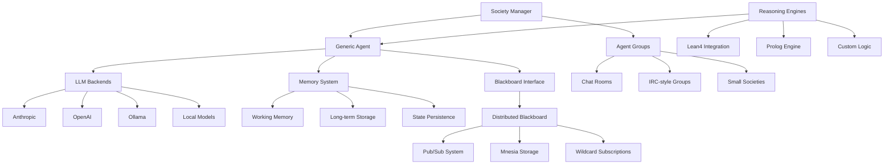

# 🏔️ Prismatic Next-Gen: Systems-First Alpine Development Plan

## 📋 Executive Summary

This document outlines a comprehensive 8-phase alpine-style development plan focused on building Prismatic from the ground up, starting with core agent infrastructure. The approach prioritizes low-level, foundational systems that can be incrementally enhanced with higher-level cognitive capabilities.

## 🎯 Project Context & Philosophy

- **Current Workspace**: `/home/korczis/dev/prismatic` - Next-gen Elixir/Phoenix implementation
- **Legacy Source**: `/home/korczis/dev/prismatic-legacy` - Reference architecture and patterns
- **Development Philosophy**: Systems-first, bottom-up approach with solid foundations
- **Core Principle**: Build generic, extensible agent infrastructure that can support any cognitive model

## 🏗️ Systems Architecture Overview

## 🗺️ 8-Phase Development Roadmap

### Phase Overview

| Phase | Focus | Duration | Key Deliverables |
|-------|-------|----------|------------------|
| **1** | [Core Agent System](agents/) | 2 weeks | Generic agents, LLM backends, basic memory |
| **2** | [Blackboard System](blackboard/) | 2 weeks | Distributed blackboard, pub/sub, Mnesia |
| **3** | [Agent Persistence](persistence/) | 2 weeks | State serialization, restoration, versioning |
| **4** | [Society Management](societies/) | 2 weeks | Agent groups, scenarios, impersonation |
| **5** | [Reasoning Engines](reasoning/) | 2 weeks | Lean4, Prolog, custom reasoning modules |
| **6** | [Advanced Memory](memory/) | 2 weeks | Trait-based memory, learning, analytics |
| **7** | [Distributed Operations](distributed/) | 2 weeks | Multi-node societies, consensus, fault tolerance |
| **8** | [Management Interface](ui/) | 2 weeks | LiveView UI, scenario management, analytics |

## 🔄 Implementation Strategy

### Development Principles:
1. **Systems-First**: Build solid infrastructure before adding cognitive features
2. **Incremental**: Each phase adds value while maintaining system stability
3. **Testable**: Comprehensive testing at every level
4. **Observable**: Built-in monitoring and debugging from day 1
5. **Extensible**: Architecture supports future enhancements

### Technical Stack:
- **Core**: Elixir/OTP with GenServer-based agents
- **Storage**: Mnesia for distributed state, PostgreSQL for persistence
- **Communication**: Phoenix PubSub for real-time messaging
- **Web Interface**: Phoenix LiveView for real-time management
- **External Tools**: Lean4, Prolog, various LLM APIs

### Quality Assurance:
- **Unit Tests**: 90%+ coverage for all modules
- **Integration Tests**: End-to-end scenarios for each phase
- **Performance Tests**: Load testing for concurrent operations
- **Chaos Engineering**: Fault injection and recovery testing

## 📈 Success Metrics & KPIs

### Phase Completion Criteria:
- **Functionality**: All specified features working correctly
- **Performance**: System handles expected load without degradation
- **Reliability**: System recovers gracefully from failures
- **Usability**: Management interface is intuitive and effective
- **Documentation**: Complete API docs and usage examples

### Overall Project Success:
- **Scalability**: System supports 100+ concurrent agents
- **Reliability**: 99.9% uptime with proper fault tolerance
- **Extensibility**: New reasoning engines can be added easily
- **Performance**: Sub-100ms response times for basic operations
- **Maintainability**: Clean, well-documented, testable codebase

## 🎯 Next Steps

1. **Phase 1 Kickoff**: Begin implementation of [core agent system](agents/)
2. **Environment Setup**: Configure development tools and CI/CD
3. **Architecture Review**: Validate technical decisions with stakeholders
4. **Team Coordination**: Establish development workflows and standards
5. **Progress Tracking**: Set up project monitoring and reporting

## 📚 Related Documentation

- [Architecture Overview](architecture/README.md)
- [Legacy Analysis](legacy-analysis.md)
- [Agent System Design](agents/README.md)
- [Blackboard Architecture](blackboard/README.md)
- [Society Management](societies/README.md)

---

*This plan follows alpine-style development principles: each phase builds solid foundations, minimizes risk through incremental progress, and ensures the system remains functional and deployable at every iteration.*