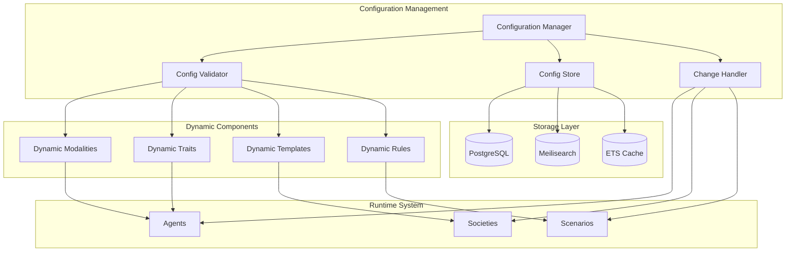

# Dynamic Configuration System

The dynamic configuration system allows runtime modification of modalities, traits, templates, and other system components without requiring application restarts.

## 📋 Overview

The dynamic configuration system enables:
- **Hot-swappable Modalities**: Add/modify psychological states during runtime
- **Dynamic Trait Definitions**: Create and update personality traits on-the-fly
- **Template Management**: Modify agent and scenario templates without deployment
- **Configuration Versioning**: Track changes and rollback capabilities
- **Live Validation**: Real-time constraint checking and validation

## 🏗️ Architecture



## 🧠 Dynamic Modalities

### Modality Definition Structure

```elixir
defmodule Prismatic.DynamicConfig.Modality do
  defstruct [
    :id,
    :name,
    :description,
    :scale_type,      # :linear, :logarithmic, :categorical
    :min_value,       # Minimum value (for numeric scales)
    :max_value,       # Maximum value (for numeric scales)
    :categories,      # List of categories (for categorical scales)
    :default_value,   # Default starting value
    :validation_rules,# Custom validation functions
    :ui_config,       # Visualization parameters
    :created_at,
    :updated_at,
    :version
  ]
end
```

### Example: Creating a New Modality

```elixir
# Define a new modality for "Cognitive Load"
cognitive_load_modality = %Prismatic.DynamicConfig.Modality{
  id: "cognitive_load",
  name: "Cognitive Load",
  description: "Mental processing burden and capacity utilization",
  scale_type: :linear,
  min_value: 0.0,
  max_value: 10.0,
  default_value: 5.0,
  validation_rules: [
    {:range, 0.0, 10.0},
    {:precision, 2}
  ],
  ui_config: %{
    color: "#FF6B6B",
    icon: "brain",
    chart_type: "line",
    alert_thresholds: %{high: 8.0, critical: 9.5}
  }
}

# Register the modality
Prismatic.DynamicConfig.register_modality(cognitive_load_modality)
```

### Runtime Modality Management

```elixir
# Add modality to existing agents
Prismatic.DynamicConfig.apply_modality_to_agents("cognitive_load", agent_ids)

# Update modality definition
updated_modality = %{cognitive_load_modality | max_value: 15.0}
Prismatic.DynamicConfig.update_modality("cognitive_load", updated_modality)

# Remove modality (with migration strategy)
Prismatic.DynamicConfig.remove_modality("cognitive_load", migration: :archive)
```

## 🎭 Dynamic Traits

### Trait Definition Structure

```elixir
defmodule Prismatic.DynamicConfig.Trait do
  defstruct [
    :id,
    :name,
    :category,        # :cognitive, :emotional, :behavioral, :social
    :description,
    :attributes,      # List of component attributes
    :interactions,    # How this trait affects others
    :evolution_rules, # Mutation, decay, learning parameters
    :constraints,     # Validation and boundary rules
    :templates,       # Pre-configured variations
    :metadata,
    :version
  ]
end
```

### Example: Dynamic Trait Creation

```elixir
# Create a new "Resilience" trait
resilience_trait = %Prismatic.DynamicConfig.Trait{
  id: "resilience",
  name: "Resilience",
  category: :emotional,
  description: "Ability to recover from setbacks and adapt to challenges",
  attributes: [
    %{name: :stress_tolerance, weight: 0.4, volatility: 0.1},
    %{name: :recovery_speed, weight: 0.3, volatility: 0.15},
    %{name: :adaptability, weight: 0.3, volatility: 0.2}
  ],
  interactions: [
    {:influences, :emotional_stability, 0.6},
    {:influenced_by, :stress_level, -0.4},
    {:synergizes_with, :optimism, 0.3}
  ],
  evolution_rules: %{
    base_decay: 0.01,
    learning_rate: 0.05,
    mutation_chance: 0.02,
    reinforcement_threshold: 0.7
  },
  constraints: [
    {:attribute_sum, :equals, 1.0},
    {:volatility_range, 0.0, 0.5},
    {:interaction_strength, -1.0, 1.0}
  ]
}

# Register the trait
Prismatic.DynamicConfig.register_trait(resilience_trait)
```

## 📋 Dynamic Templates

### Agent Template System

```elixir
defmodule Prismatic.DynamicConfig.AgentTemplate do
  defstruct [
    :id,
    :name,
    :description,
    :category,        # :negotiator, :subject, :observer, :specialist
    :base_traits,     # Default trait configuration
    :modalities,      # Initial modality values
    :llm_config,      # LLM backend and parameters
    :memory_config,   # Memory system configuration
    :behavior_rules,  # Behavioral constraints and patterns
    :prompt_template, # Base prompt structure
    :metadata
  ]
end
```

### Example: Crisis Negotiator Template

```elixir
crisis_negotiator_template = %Prismatic.DynamicConfig.AgentTemplate{
  id: "crisis_negotiator_v2",
  name: "Crisis Negotiator (Advanced)",
  description: "Specialized agent for crisis negotiation scenarios",
  category: :negotiator,
  base_traits: %{
    empathy: 0.9,
    patience: 0.8,
    analytical_thinking: 0.7,
    emotional_stability: 0.85,
    communication_skill: 0.9
  },
  modalities: %{
    stress_level: 3.0,
    confidence: 7.5,
    situational_awareness: 8.0,
    rapport_building: 6.0
  },
  llm_config: %{
    backend: :anthropic,
    model: "claude-3-sonnet",
    temperature: 0.3,
    max_tokens: 1000
  },
  behavior_rules: [
    {:always, :maintain_calm_tone},
    {:never, :make_promises_cannot_keep},
    {:when, :trust_below_threshold, :focus_on_rapport},
    {:escalation_response, :de_escalate_gradually}
  ],
  prompt_template: """
  You are an experienced crisis negotiator with the following characteristics:
  - Empathy: {{empathy}}
  - Patience: {{patience}}
  - Current stress level: {{stress_level}}
  
  Your goal is to de-escalate the situation while building trust and rapport.
  Always prioritize safety and human dignity.
  
  Current situation context: {{scenario_context}}
  """
}
```

## 🔄 Configuration Management API

### Core Operations

```elixir
# Configuration Manager API
defmodule Prismatic.DynamicConfig.Manager do
  # Modality management
  def register_modality(modality_def)
  def update_modality(modality_id, changes)
  def remove_modality(modality_id, opts \\ [])
  def list_modalities(filters \\ [])
  def get_modality(modality_id)
  
  # Trait management
  def register_trait(trait_def)
  def update_trait(trait_id, changes)
  def remove_trait(trait_id, opts \\ [])
  def list_traits(category \\ :all)
  def get_trait(trait_id)
  
  # Template management
  def register_template(template_def)
  def update_template(template_id, changes)
  def remove_template(template_id)
  def list_templates(category \\ :all)
  def get_template(template_id)
  
  # Configuration validation
  def validate_config(config_type, config_data)
  def check_dependencies(config_id, config_type)
  def preview_changes(config_id, changes)
  
  # Version management
  def create_snapshot(description)
  def rollback_to_snapshot(snapshot_id)
  def list_snapshots()
  def compare_snapshots(snapshot_id_1, snapshot_id_2)
end
```

### Live Configuration Updates

```elixir
# Hot-reload configuration changes
defmodule Prismatic.DynamicConfig.LiveUpdater do
  def apply_modality_changes(modality_id, changes) do
    # 1. Validate changes
    case validate_modality_changes(modality_id, changes) do
      {:ok, validated_changes} ->
        # 2. Update configuration store
        update_modality_store(modality_id, validated_changes)
        
        # 3. Notify affected agents
        notify_agents_of_modality_change(modality_id, validated_changes)
        
        # 4. Update UI components
        broadcast_config_change(:modality, modality_id, validated_changes)
        
        {:ok, :updated}
      
      {:error, reason} ->
        {:error, reason}
    end
  end
  
  def apply_trait_changes(trait_id, changes) do
    # Similar process for trait updates
    # Includes dependency checking and cascade updates
  end
end
```

## 📊 Configuration Storage

### Database Schema

```sql
-- Modality definitions
CREATE TABLE dynamic_modalities (
  id VARCHAR PRIMARY KEY,
  name VARCHAR NOT NULL,
  description TEXT,
  scale_type VARCHAR NOT NULL,
  min_value DECIMAL,
  max_value DECIMAL,
  categories JSONB,
  default_value DECIMAL,
  validation_rules JSONB,
  ui_config JSONB,
  created_at TIMESTAMPTZ DEFAULT NOW(),
  updated_at TIMESTAMPTZ DEFAULT NOW(),
  version INTEGER DEFAULT 1
);

-- Trait definitions
CREATE TABLE dynamic_traits (
  id VARCHAR PRIMARY KEY,
  name VARCHAR NOT NULL,
  category VARCHAR NOT NULL,
  description TEXT,
  attributes JSONB NOT NULL,
  interactions JSONB,
  evolution_rules JSONB,
  constraints JSONB,
  templates JSONB,
  metadata JSONB,
  created_at TIMESTAMPTZ DEFAULT NOW(),
  updated_at TIMESTAMPTZ DEFAULT NOW(),
  version INTEGER DEFAULT 1
);

-- Template definitions
CREATE TABLE dynamic_templates (
  id VARCHAR PRIMARY KEY,
  name VARCHAR NOT NULL,
  description TEXT,
  category VARCHAR NOT NULL,
  base_traits JSONB,
  modalities JSONB,
  llm_config JSONB,
  memory_config JSONB,
  behavior_rules JSONB,
  prompt_template TEXT,
  metadata JSONB,
  created_at TIMESTAMPTZ DEFAULT NOW(),
  updated_at TIMESTAMPTZ DEFAULT NOW(),
  version INTEGER DEFAULT 1
);

-- Configuration change history
CREATE TABLE config_changes (
  id SERIAL PRIMARY KEY,
  config_type VARCHAR NOT NULL,
  config_id VARCHAR NOT NULL,
  change_type VARCHAR NOT NULL, -- 'create', 'update', 'delete'
  old_value JSONB,
  new_value JSONB,
  changed_by VARCHAR,
  changed_at TIMESTAMPTZ DEFAULT NOW(),
  reason TEXT
);
```

## 🎯 Implementation Status

- [ ] **Phase 2**: Basic Dynamic Configuration
  - [ ] Configuration manager core
  - [ ] Modality registration system
  - [ ] Basic validation framework

- [ ] **Phase 4**: Advanced Dynamic Features
  - [ ] Dynamic trait system
  - [ ] Template management
  - [ ] Live configuration updates
  - [ ] Version control and rollback

- [ ] **Phase 6**: Full Dynamic System
  - [ ] Complex validation rules
  - [ ] Dependency management
  - [ ] Configuration migration tools
  - [ ] Advanced UI for configuration management

## 🔗 Related Documentation

- [Architecture Overview](../architecture/README.md) - System architecture
- [Traits System](../traits/README.md) - Trait modeling and evolution
- [Scenarios](../scenarios/README.md) - Scenario template system
- [Agent System](../agents/README.md) - Agent configuration and management