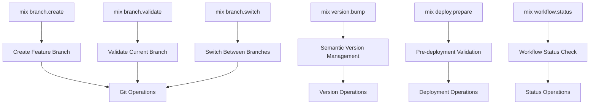

<!-- NAV_START -->
<div align="center">
  <strong>🔧 Mix Tasks Implementation Guide</strong><br>
  <em>Developer automation tooling for the Prismatic project</em><br><br>
  
  <a href="../../README.md">🏠 Home</a> | 
  <a href="../README.md">📖 All Guides</a> | 
  <a href="README.md">🤖 Automation</a><br>
  
  <strong>Quick Links:</strong>
  <a href="#task-architecture">Architecture</a> |
  <a href="#task-implementation-specifications">Tasks</a> |
  <a href="#mix-tasks-integration">Integration</a> |
  <a href="#usage-examples">Examples</a>
</div>
<!-- NAV_END -->

# Mix Tasks Implementation Guide

## Overview

This document provides comprehensive specifications for custom Mix tasks that support the feature branch workflow, semantic versioning, and automated branch management for the Prismatic project.

## Task Architecture



## Task Implementation Specifications

### 1. Branch Creation Task

**File**: `lib/mix/tasks/branch/create.ex`

```elixir
defmodule Mix.Tasks.Branch.Create do
  @shortdoc "Create a new feature branch following naming conventions"
  
  @moduledoc """
  Creates a new feature branch with proper naming validation and setup.
  
  ## Usage
  
      mix branch.create feature/user-authentication
      mix branch.create bugfix/login-validation  
      mix branch.create hotfix/security-patch
      mix branch.create docs/api-documentation
  
  ## Branch Types
  
  - `feature/` - New features and enhancements
  - `bugfix/` - Non-critical bug fixes
  - `hotfix/` - Critical production fixes
  - `release/` - Release preparation
  - `chore/` - Maintenance tasks
  - `docs/` - Documentation updates
  
  ## Options
  
      --from BRANCH    Create branch from specific branch (default: main)
      --push           Automatically push new branch to origin
      --no-switch      Don't switch to new branch after creation
      --template TYPE  Use branch template (feature, bugfix, etc.)
  
  ## Examples
  
      # Create and switch to feature branch
      mix branch.create feature/user-dashboard
      
      # Create from specific branch
      mix branch.create --from=release/v2.0.0 hotfix/critical-fix
      
      # Create and push immediately
      mix branch.create --push feature/new-component
      
      # Create but don't switch
      mix branch.create --no-switch docs/readme-update
  """
  
  use Mix.Task
  
  @branch_types ~w(feature bugfix hotfix release chore docs)
  @branch_pattern ~r/^(feature|bugfix|hotfix|release|chore|docs)\/[a-z0-9-]+$/
  
  @switches [
    from: :string,
    push: :boolean,
    no_switch: :boolean,
    template: :string,
    help: :boolean
  ]
  
  def run(args) do
    case OptionParser.parse(args, switches: @switches, aliases: [h: :help]) do
      {opts, [branch_name], _} ->
        create_branch(branch_name, opts)
        
      {opts, [], _} ->
        if opts[:help] do
          show_help()
        else
          Mix.shell().error("Branch name is required")
          show_usage()
        end
        
      {_, _, _} ->
        Mix.shell().error("Invalid arguments")
        show_usage()
    end
  end
  
  defp create_branch(branch_name, opts) do
    with :ok <- validate_branch_name(branch_name),
         :ok <- check_git_status(),
         :ok <- ensure_base_branch(opts[:from] || "main"),
         :ok <- create_git_branch(branch_name, opts),
         :ok <- setup_branch_template(branch_name, opts[:template]),
         :ok <- maybe_push_branch(branch_name, opts[:push]),
         :ok <- maybe_switch_branch(branch_name, !opts[:no_switch]) do
      
      Mix.shell().info([
        :green, "✅ Successfully created branch: ", :reset, branch_name
      ])
      
      show_next_steps(branch_name)
    else
      {:error, reason} ->
        Mix.shell().error("❌ Failed to create branch: #{reason}")
        System.halt(1)
    end
  end
  
  defp validate_branch_name(branch_name) do
    cond do
      String.length(branch_name) < 3 ->
        {:error, "Branch name too short (minimum 3 characters)"}
        
      String.length(branch_name) > 50 ->
        {:error, "Branch name too long (maximum 50 characters)"}
        
      not Regex.match?(@branch_pattern, branch_name) ->
        {:error, "Invalid branch name format. Use: type/description"}
        
      String.contains?(branch_name, ["_", " ", ".", ".."]) ->
        {:error, "Branch name contains invalid characters"}
        
      true ->
        :ok
    end
  end
  
  defp check_git_status do
    case System.cmd("git", ["status", "--porcelain"]) do
      {"", 0} ->
        :ok
        
      {output, 0} when output != "" ->
        Mix.shell().info("⚠️  You have uncommitted changes:")
        Mix.shell().info(output)
        
        if Mix.shell().yes?("Continue anyway?") do
          :ok
        else
          {:error, "Uncommitted changes present"}
        end
        
      {_, _} ->
        {:error, "Not in a git repository"}
    end
  end
  
  defp ensure_base_branch(base_branch) do
    # Fetch latest changes
    case System.cmd("git", ["fetch", "origin", base_branch]) do
      {_, 0} ->
        # Switch to base branch
        case System.cmd("git", ["checkout", base_branch]) do
          {_, 0} ->
            # Pull latest changes
            case System.cmd("git", ["pull", "origin", base_branch]) do
              {_, 0} -> :ok
              {error, _} -> {:error, "Failed to pull #{base_branch}: #{error}"}
            end
            
          {error, _} ->
            {:error, "Failed to checkout #{base_branch}: #{error}"}
        end
        
      {error, _} ->
        {:error, "Failed to fetch #{base_branch}: #{error}"}
    end
  end
  
  defp create_git_branch(branch_name, _opts) do
    case System.cmd("git", ["checkout", "-b", branch_name]) do
      {_, 0} ->
        :ok
        
      {error, _} ->
        {:error, "Failed to create branch: #{error}"}
    end
  end
  
  defp setup_branch_template(branch_name, template_type) do
    template_type = template_type || extract_branch_type(branch_name)
    
    case template_type do
      "feature" -> setup_feature_template()
      "bugfix" -> setup_bugfix_template()
      "hotfix" -> setup_hotfix_template()
      "docs" -> setup_docs_template()
      _ -> :ok
    end
  end
  
  defp setup_feature_template do
    create_branch_file(".branch-info", """
    # Feature Branch Information
    
    ## Description
    Brief description of the feature being implemented.
    
    ## Requirements
    - [ ] Requirement 1
    - [ ] Requirement 2
    
    ## Testing Checklist
    - [ ] Unit tests added
    - [ ] Integration tests updated
    - [ ] Manual testing completed
    
    ## Documentation
    - [ ] Code documentation updated
    - [ ] User documentation updated
    - [ ] API documentation updated (if applicable)
    """)
  end
  
  defp setup_bugfix_template do
    create_branch_file(".branch-info", """
    # Bugfix Branch Information
    
    ## Bug Description
    Description of the bug being fixed.
    
    ## Root Cause
    Analysis of what caused the bug.
    
    ## Solution
    Description of the implemented fix.
    
    ## Testing
    - [ ] Bug reproduction test added
    - [ ] Fix verification completed
    - [ ] Regression testing performed
    """)
  end
  
  defp setup_hotfix_template do
    create_branch_file(".branch-info", """
    # Hotfix Branch Information
    
    ## Critical Issue
    Description of the critical issue being addressed.
    
    ## Impact
    What systems/users are affected.
    
    ## Solution
    Quick fix implementation details.
    
    ## Verification
    - [ ] Fix tested in production-like environment
    - [ ] Rollback plan prepared
    - [ ] Stakeholders notified
    """)
  end
  
  defp setup_docs_template do
    create_branch_file(".branch-info", """
    # Documentation Branch Information
    
    ## Documentation Updates
    Description of documentation changes.
    
    ## Files Updated
    - [ ] README.md
    - [ ] API documentation
    - [ ] User guides
    - [ ] Code comments
    
    ## Validation
    - [ ] Links verified
    - [ ] Content reviewed for accuracy
    - [ ] Formatting checked
    """)
  end
  
  defp create_branch_file(filename, content) do
    File.write!(filename, content)
    :ok
  rescue
    _ -> :ok  # Don't fail if template creation fails
  end
  
  defp maybe_push_branch(branch_name, should_push) do
    if should_push do
      case System.cmd("git", ["push", "-u", "origin", branch_name]) do
        {_, 0} ->
          Mix.shell().info("📤 Branch pushed to origin")
          :ok
          
        {error, _} ->
          Mix.shell().info("⚠️  Failed to push branch: #{error}")
          :ok  # Don't fail the entire operation
      end
    else
      :ok
    end
  end
  
  defp maybe_switch_branch(branch_name, should_switch) do
    if should_switch do
      case System.cmd("git", ["checkout", branch_name]) do
        {_, 0} -> :ok
        {_, _} -> :ok  # Already on the branch
      end
    else
      :ok
    end
  end
  
  defp extract_branch_type(branch_name) do
    case String.split(branch_name, "/", parts: 2) do
      [type, _] -> type
      _ -> nil
    end
  end
  
  defp show_next_steps(branch_name) do
    Mix.shell().info([
      :yellow, "\n💡 Next Steps:\n",
      :reset, "1. Start working on your changes\n",
      "2. Run ", :cyan, "mix branch.validate", :reset, " to check branch status\n",
      "3. Commit your changes with conventional commit messages\n",
      "4. Push branch: ", :cyan, "git push origin #{branch_name}", :reset, "\n",
      "5. Create pull/merge request when ready\n"
    ])
  end
  
  defp show_help do
    Mix.shell().info(@moduledoc)
  end
  
  defp show_usage do
    Mix.shell().info("""
    Usage: mix branch.create <branch-name> [options]
    
    Examples:
      mix branch.create feature/user-authentication
      mix branch.create --push bugfix/login-validation
      mix branch.create --from=develop hotfix/security-patch
    
    Run 'mix help branch.create' for detailed documentation.
    """)
  end
end
```

### 2. Branch Validation Task

**File**: `lib/mix/tasks/branch/validate.ex`

```elixir
defmodule Mix.Tasks.Branch.Validate do
  @shortdoc "Validate current branch against workflow requirements"
  
  @moduledoc """
  Validates the current branch against feature branch workflow requirements.
  
  ## Usage
  
      mix branch.validate
      mix branch.validate --fix        # Attempt to fix issues
      mix branch.validate --verbose    # Show detailed information
  
  ## Validation Checks
  
  - Branch naming convention compliance
  - Branch synchronization with main
  - Commit message format validation
  - Code quality checks
  - Documentation requirements
  - Test coverage requirements
  
  ## Options
  
      --fix        Attempt to automatically fix issues
      --verbose    Show detailed validation information
      --strict     Use strict validation rules
      --ci         Run in CI mode (exit codes for automation)
  """
  
  use Mix.Task
  
  @switches [
    fix: :boolean,
    verbose: :boolean,
    strict: :boolean,
    ci: :boolean,
    help: :boolean
  ]
  
  def run(args) do
    {opts, _, _} = OptionParser.parse(args, switches: @switches, aliases: [h: :help])
    
    if opts[:help] do
      show_help()
    else
      validate_branch(opts)
    end
  end
  
  defp validate_branch(opts) do
    Mix.shell().info("🔍 Validating current branch...")
    
    validations = [
      &validate_git_status/1,
      &validate_branch_name/1,
      &validate_branch_sync/1,
      &validate_commit_messages/1,
      &validate_code_quality/1,
      &validate_tests/1,
      &validate_documentation/1
    ]
    
    results = Enum.map(validations, fn validation ->
      validation.(opts)
    end)
    
    show_validation_summary(results, opts)
    
    if opts[:ci] do
      exit_code = if Enum.all?(results, &(&1.status == :ok)), do: 0, else: 1
      System.halt(exit_code)
    end
  end
  
  defp validate_git_status(opts) do
    case System.cmd("git", ["status", "--porcelain"]) do
      {"", 0} ->
        %{check: "Git Status", status: :ok, message: "Working directory clean"}
        
      {output, 0} ->
        status = if opts[:strict], do: :error, else: :warning
        message = "Uncommitted changes present"
        
        if opts[:verbose] do
          %{check: "Git Status", status: status, message: message, details: output}
        else
          %{check: "Git Status", status: status, message: message}
        end
        
      {_, _} ->
        %{check: "Git Status", status: :error, message: "Not in git repository"}
    end
  end
  
  defp validate_branch_name(opts) do
    case System.cmd("git", ["rev-parse", "--abbrev-ref", "HEAD"]) do
      {branch_name, 0} ->
        branch_name = String.trim(branch_name)
        pattern = ~r/^(feature|bugfix|hotfix|release|chore|docs)\/[a-z0-9-]+$/
        
        if branch_name == "main" do
          %{check: "Branch Name", status: :warning, message: "On main branch"}
        else
          if Regex.match?(pattern, branch_name) do
            %{check: "Branch Name", status: :ok, message: "Valid: #{branch_name}"}
          else
            message = "Invalid format: #{branch_name}"
            fix_message = if opts[:fix], do: suggest_branch_fix(branch_name), else: nil
            
            %{check: "Branch Name", status: :error, message: message, fix: fix_message}
          end
        end
        
      {_, _} ->
        %{check: "Branch Name", status: :error, message: "Cannot determine branch"}
    end
  end
  
  defp validate_branch_sync(opts) do
    case System.cmd("git", ["rev-parse", "--abbrev-ref", "HEAD"]) do
      {branch_name, 0} ->
        branch_name = String.trim(branch_name)
        
        if branch_name == "main" do
          %{check: "Branch Sync", status: :ok, message: "On main branch"}
        else
          # Fetch latest main
          System.cmd("git", ["fetch", "origin", "main"])
          
          case System.cmd("git", ["merge-base", "HEAD", "origin/main"]) do
            {merge_base, 0} ->
              merge_base = String.trim(merge_base)
              
              case System.cmd("git", ["rev-parse", "origin/main"]) do
                {main_head, 0} ->
                  main_head = String.trim(main_head)
                  
                  if merge_base == main_head do
                    %{check: "Branch Sync", status: :ok, message: "Up to date with main"}
                  else
                    status = if opts[:strict], do: :error, else: :warning
                    message = "Behind main branch"
                    fix = if opts[:fix], do: "git rebase origin/main", else: nil
                    
                    %{check: "Branch Sync", status: status, message: message, fix: fix}
                  end
                  
                {_, _} ->
                  %{check: "Branch Sync", status: :error, message: "Cannot access origin/main"}
              end
              
            {_, _} ->
              %{check: "Branch Sync", status: :error, message: "Cannot determine merge base"}
          end
        end
        
      {_, _} ->
        %{check: "Branch Sync", status: :error, message: "Cannot determine current branch"}
    end
  end
  
  defp validate_commit_messages(_opts) do
    case System.cmd("git", ["log", "--oneline", "-n", "5", "--pretty=format:%s"]) do
      {output, 0} ->
        messages = String.split(output, "\n", trim: true)
        pattern = ~r/^(feat|fix|docs|style|refactor|test|chore|perf|ci|build|revert)(\(.+\))?: .+/
        
        invalid_messages = Enum.reject(messages, fn msg ->
          String.starts_with?(msg, "Merge") or Regex.match?(pattern, msg)
        end)
        
        if Enum.empty?(invalid_messages) do
          %{check: "Commit Messages", status: :ok, message: "All recent commits follow convention"}
        else
          %{
            check: "Commit Messages", 
            status: :warning, 
            message: "#{length(invalid_messages)} commits don't follow convention",
            details: invalid_messages
          }
        end
        
      {_, _} ->
        %{check: "Commit Messages", status: :error, message: "Cannot access commit history"}
    end
  end
  
  defp validate_code_quality(opts) do
    # Run mix format check
    case System.cmd("mix", ["format", "--check-formatted"]) do
      {_, 0} ->
        # Run compile check
        case System.cmd("mix", ["compile", "--warnings-as-errors"]) do
          {_, 0} ->
            %{check: "Code Quality", status: :ok, message: "Formatting and compilation clean"}
            
          {output, _} ->
            fix = if opts[:fix], do: "mix format", else: nil
            %{check: "Code Quality", status: :error, message: "Compilation warnings", fix: fix, details: output}
        end
        
      {output, _} ->
        fix = if opts[:fix], do: "mix format", else: nil
        %{check: "Code Quality", status: :error, message: "Formatting issues", fix: fix, details: output}
    end
  end
  
  defp validate_tests(_opts) do
    case System.cmd("mix", ["test", "--formatter", "Mix.Tasks.Test.Coverage"]) do
      {output, 0} ->
        # Extract coverage percentage if available
        coverage_regex = ~r/\[TOTAL\]\s+(\d+\.\d+)%/
        
        case Regex.run(coverage_regex, output) do
          [_, coverage_str] ->
            coverage = String.to_float(coverage_str)
            
            cond do
              coverage >= 80.0 ->
                %{check: "Test Coverage", status: :ok, message: "Coverage: #{coverage}%"}
                
              coverage >= 60.0 ->
                %{check: "Test Coverage", status: :warning, message: "Coverage: #{coverage}% (low)"}
                
              true ->
                %{check: "Test Coverage", status: :error, message: "Coverage: #{coverage}% (too low)"}
            end
            
          nil ->
            %{check: "Test Coverage", status: :ok, message: "Tests pass (coverage unknown)"}
        end
        
      {output, _} ->
        %{check: "Test Coverage", status: :error, message: "Tests failing", details: output}
    end
  end
  
  defp validate_documentation(_opts) do
    # Check if documentation files are present and up to date
    doc_files = [
      "README.md",
      "docs/",
      ".branch-info"
    ]
    
    missing_docs = Enum.reject(doc_files, fn file ->
      File.exists?(file)
    end)
    
    if Enum.empty?(missing_docs) do
      %{check: "Documentation", status: :ok, message: "Required documentation present"}
    else
      %{
        check: "Documentation", 
        status: :warning, 
        message: "Missing: #{Enum.join(missing_docs, ", ")}"
      }
    end
  end
  
  defp suggest_branch_fix(branch_name) do
    # Attempt to suggest a valid branch name
    cleaned = branch_name
    |> String.downcase()
    |> String.replace(~r/[^a-z0-9-]/, "-")
    |> String.replace(~r/-+/, "-")
    |> String.trim("-")
    
    "Suggested: feature/#{cleaned}"
  end
  
  defp show_validation_summary(results, opts) do
    Mix.shell().info("\n📊 Validation Summary:")
    
    Enum.each(results, fn result ->
      status_icon = case result.status do
        :ok -> "✅"
        :warning -> "⚠️ "
        :error -> "❌"
      end
      
      Mix.shell().info("  #{status_icon} #{result.check}: #{result.message}")
      
      if opts[:verbose] and Map.has_key?(result, :details) do
        Mix.shell().info("     Details: #{result.details}")
      end
      
      if opts[:fix] and Map.has_key?(result, :fix) and result.fix do
        Mix.shell().info("     Fix: #{result.fix}")
      end
    end)
    
    # Show overall status
    error_count = Enum.count(results, &(&1.status == :error))
    warning_count = Enum.count(results, &(&1.status == :warning))
    
    cond do
      error_count > 0 ->
        Mix.shell().info([
          :red, "\n❌ Validation failed with #{error_count} errors and #{warning_count} warnings"
        ])
        
      warning_count > 0 ->
        Mix.shell().info([
          :yellow, "\n⚠️  Validation passed with #{warning_count} warnings"
        ])
        
      true ->
        Mix.shell().info([
          :green, "\n✅ All validations passed!"
        ])
    end
  end
  
  defp show_help do
    Mix.shell().info(@moduledoc)
  end
end
```

### 3. Version Management Task

**File**: `lib/mix/tasks/version/bump.ex`

```elixir
defmodule Mix.Tasks.Version.Bump do
  @shortdoc "Bump project version following semantic versioning"
  
  @moduledoc """
  Bumps the project version in mix.exs following semantic versioning principles.
  
  ## Usage
  
      mix version.bump patch
      mix version.bump minor
      mix version.bump major
      mix version.bump --to=1.2.3
  
  ## Version Types
  
  - `patch` - Bug fixes and small changes (1.0.0 -> 1.0.1)
  - `minor` - New features, backward compatible (1.0.0 -> 1.1.0)
  - `major` - Breaking changes (1.0.0 -> 2.0.0)
  
  ## Options
  
      --to VERSION     Set specific version
      --dry-run        Show what would be changed without making changes
      --tag            Create git tag after version bump
      --push           Push changes and tags to origin
      --changelog      Update CHANGELOG.md file
  
  ## Examples
  
      # Bump patch version
      mix version.bump patch
      
      # Bump minor version and create tag
      mix version.bump minor --tag
      
      # Set specific version
      mix version.bump --to=2.0.0-rc.1
      
      # Dry run to see changes
      mix version.bump major --dry-run
  """
  
  use Mix.Task
  
  @switches [
    to: :string,
    dry_run: :boolean,
    tag: :boolean,
    push: :boolean,
    changelog: :boolean,
    help: :boolean
  ]
  
  def run(args) do
    {opts, args, _} = OptionParser.parse(args, switches: @switches, aliases: [h: :help])
    
    if opts[:help] do
      show_help()
    else
      bump_version(args, opts)
    end
  end
  
  defp bump_version(args, opts) do
    current_version = get_current_version()
    
    new_version = cond do
      opts[:to] ->
        validate_version_format(opts[:to])
        
      length(args) == 1 ->
        [bump_type] = args
        calculate_next_version(current_version, bump_type)
        
      true ->
        Mix.shell().error("Version bump type or --to option required")
        show_usage()
        System.halt(1)
    end
    
    if opts[:dry_run] do
      show_dry_run(current_version, new_version, opts)
    else
      perform_version_bump(current_version, new_version, opts)
    end
  end
  
  defp get_current_version do
    case File.read("mix.exs") do
      {:ok, content} ->
        case Regex.run(~r/version: "([^"]+)"/, content) do
          [_, version] -> version
          nil -> raise "Could not find version in mix.exs"
        end
        
      {:error, _} ->
        raise "Could not read mix.exs file"
    end
  end
  
  defp validate_version_format(version) do
    version_regex = ~r/^\d+\.\d+\.\d+(-[a-zA-Z0-9\.-]+)?(\+[a-zA-Z0-9\.-]+)?$/
    
    if Regex.match?(version_regex, version) do
      version
    else
      raise "Invalid version format: #{version}. Use semantic versioning (e.g., 1.2.3)"
    end
  end
  
  defp calculate_next_version(current_version, bump_type) do
    # Parse current version
    [version_part, prerelease] = case String.split(current_version, "-", parts: 2) do
      [version] -> [version, nil]
      [version, pre] -> [version, pre]
    end
    
    [major, minor, patch] = version_part
    |> String.split(".")
    |> Enum.map(&String.to_integer/1)
    
    {new_major, new_minor, new_patch} = case bump_type do
      "major" -> {major + 1, 0, 0}
      "minor" -> {major, minor + 1, 0}
      "patch" -> {major, minor, patch + 1}
      _ -> raise "Invalid bump type: #{bump_type}. Use major, minor, or patch"
    end
    
    new_version = "#{new_major}.#{new_minor}.#{new_patch}"
    
    # Add prerelease suffix if present and not a major bump
    if prerelease && bump_type != "major" do
      "#{new_version}-#{prerelease}"
    else
      new_version
    end
  end
  
  defp show_dry_run(current_version, new_version, opts) do
    Mix.shell().info("🔍 Dry Run - Version Bump Preview:")
    Mix.shell().info("  Current version: #{current_version}")
    Mix.shell().info("  New version:     #{new_version}")
    
    if opts[:tag] do
      Mix.shell().info("  Would create git tag: v#{new_version}")
    end
    
    if opts[:push] do
      Mix.shell().info("  Would push changes to origin")
    end
    
    if opts[:changelog] do
      Mix.shell().info("  Would update CHANGELOG.md")
    end
  end
  
  defp perform_version_bump(current_version, new_version, opts) do
    Mix.shell().info("📝 Bumping version: #{current_version} -> #{new_version}")
    
    # Update mix.exs
    update_mix_exs(current_version, new_version)
    
    # Update README if version is mentioned
    update_readme(current_version, new_version)
    
    # Update changelog if requested
    if opts[:changelog] do
      update_changelog(new_version)
    end
    
    # Commit changes
    commit_version_changes(new_version)
    
    # Create tag if requested
    if opts[:tag] do
      create_version_tag(new_version)
    end
    
    # Push if requested
    if opts[:push] do
      push_changes(opts[:tag])
    end
    
    Mix.shell().info([
      :green, "✅ Version successfully bumped to #{new_version}"
    ])
  end
  
  defp update_mix_exs(current_version, new_version) do
    content = File.read!("mix.exs")
    
    new_content = String.replace(
      content, 
      ~s(version: "#{current_version}"),
      ~s(version: "#{new_version}")
    )
    
    if content == new_content do
      raise "Failed to update version in mix.exs"
    end
    
    File.write!("mix.exs", new_content)
    Mix.shell().info("  ✅ Updated mix.exs")
  end
  
  defp update_readme(current_version, new_version) do
    if File.exists?("README.md") do
      content = File.read!("README.md")
      
      # Update version references in dependency examples
      new_content = String.replace(
        content,
        ~s("~> #{current_version}"),
        ~s("~> #{new_version}")
      )
      
      # Update any other version references
      new_content = String.replace(
        new_content,
        "v#{current_version}",
        "v#{new_version}"
      )
      
      if content != new_content do
        File.write!("README.md", new_content)
        Mix.shell().info("  ✅ Updated README.md")
      end
    end
  end
  
  defp update_changelog(new_version) do
    changelog_path = "CHANGELOG.md"
    
    if File.exists?(changelog_path) do
      content = File.read!(changelog_path)
      
      # Get recent commits for changelog entry
      {output, 0} = System.cmd("git", [
        "log", 
        "--oneline", 
        "--pretty=format:- %s", 
        "--since=1 week ago"
      ])
      
      changes = String.trim(output)
      
      new_entry = """
      ## [#{new_version}] - #{Date.utc_today()}
      
      #{changes}
      
      """
      
      # Insert new entry after the title
      new_content = String.replace(
        content,
        ~r/^(# Changelog\s*\n)/m,
        "\\1\n#{new_entry}"
      )
      
      File.write!(changelog_path, new_content)
      Mix.shell().info("  ✅ Updated CHANGELOG.md")
    else
      create_changelog(new_version)
    end
  end
  
  defp create_changelog(new_version) do
    changelog_content = """
    # Changelog
    
    All notable changes to this project will be documented in this file.
    
    The format is based on [Keep a Changelog](https://keepachangelog.com/en/1.0.0/),
    and this project adheres to [Semantic Versioning](https://semver.org/spec/v2.0.0.html).
    
    ## [#{new_version}] - #{Date.utc_today()}
    
    - Initial version
    """
    
    File.write!("CHANGELOG.md", changelog_content)
    Mix.shell().info("  ✅ Created CHANGELOG.md")
  end
  
  defp commit_version_changes(new_version) do
    # Stage changes
    System.cmd("git", ["add", "mix.exs", "README.md", "CHANGELOG.md"])
    
    # Commit with conventional commit message
    commit_message = "chore: bump version to #{new_version}"
    
    case System.cmd("git", ["commit", "-m", commit_message]) do
      {_, 0} ->
        Mix.shell().info("  ✅ Committed version changes")
        
      {error, _} ->
        Mix.shell().info("  ⚠️  Failed to commit changes: #{error}")
    end
  end
  
  defp create_version_tag(new_version) do
    tag_name = "v#{new_version}"
    tag_message = "Release version #{new_version}"
    
    case System.cmd("git", ["tag", "-a", tag_name, "-m", tag_message]) do
      {_, 0} ->
        Mix.shell().info("  ✅ Created git tag: #{tag_name}")
        
      {error, _} ->
        Mix.shell().info("  ⚠️  Failed to create tag: #{error}")
    end
  end
  
  defp push_changes(include_tags) do
    # Push commits  
    case System.cmd("git", ["push", "origin", "HEAD"]) do
      {_, 0} ->
        Mix.shell().info("  ✅ Pushed changes to origin")
        
        # Push tags if requested
        if include_tags do
          case System.cmd("git", ["push", "origin", "--tags"]) do
            {_, 0} ->
              Mix.shell().info("  ✅ Pushed tags to origin")
              
            {error, _} ->
              Mix.shell().info("  ⚠️  Failed to push tags: #{error}")
          end
        end
        
      {error, _} ->
        Mix.shell().info("  ⚠️  Failed to push changes: #{error}")
    end
  end
  
  defp show_help do
    Mix.shell().info(@moduledoc)
  end
  
  defp show_usage do
    Mix.shell().info("""
    Usage: mix version.bump <type> [options]
           mix version.bump --to=<version> [options]
    
    Types: major, minor, patch
    
    Examples:
      mix version.bump patch
      mix version.bump minor --tag --push
      mix version.bump --to=2.0.0-rc.1
    
    Run 'mix help version.bump' for detailed documentation.
    """)
  end
end
```

### 4. Workflow Status Task

**File**: `lib/mix/tasks/workflow/status.ex`

```elixir
defmodule Mix.Tasks.Workflow.Status do
  @shortdoc "Show comprehensive workflow status and branch information"
  
  @moduledoc """
  Displays comprehensive information about the current branch workflow status.
  
  ## Usage
  
      mix workflow.status
      mix workflow.status --verbose    # Show detailed information
      mix workflow.status --json       # Output in JSON format
  
  ## Information Displayed
  
  - Current branch and type
  - Branch sync status with main
  - Recent commits and their format
  - CI/CD pipeline status
  - Code quality metrics
  - Documentation status
  - Next recommended actions
  
  ## Options
  
      --verbose    Show detailed information
      --json       Output in JSON format
      --checks     Run all validation checks
  """
  
  use Mix.Task
  
  @switches [
    verbose: :boolean,
    json: :boolean,
    checks: :boolean,
    help: :boolean
  ]
  
  def run(args) do
    {opts, _, _} = OptionParser.parse(args, switches: @switches, aliases: [h: :help])
    
    if opts[:help] do
      show_help()
    else
      show_workflow_status(opts)
    end
  end
  
  defp show_workflow_status(opts) do
    status_data = gather_status_data(opts)
    
    if opts[:json] do
      output_json(status_data)
    else
      output_formatted(status_data, opts)
    end
  end
  
  defp gather_status_data(opts) do
    %{
      branch: get_branch_info(),
      git: get_git_status(),
      sync: get_sync_status(),
      commits: get_recent_commits(),
      quality: get_quality_status(),
      tests: get_test_status(),
      docs: get_documentation_status(),
      ci: get_ci_status(),
      recommendations: get_recommendations()
    }
  end
  
  defp get_branch_info do
    case System.cmd("git", ["rev-parse", "--abbrev-ref", "HEAD"]) do
      {branch_name, 0} ->
        branch_name = String.trim(branch_name)
        
        %{
          name: branch_name,
          type: extract_branch_type(branch_name),
          valid: validate_branch_name(branch_name)
        }
        
      {_, _} ->
        %{name: nil, type: nil, valid: false}
    end
  end
  
  defp get_git_status do
    case System.cmd("git", ["status", "--porcelain"]) do
      {"", 0} ->
        %{clean: true, changes: []}
        
      {output, 0} ->
        changes = String.split(output, "\n", trim: true)
        %{clean: false, changes: changes, count: length(changes)}
        
      {_, _} ->
        %{clean: false, error: "Not a git repository"}
    end
  end
  
  defp get_sync_status do
    case System.cmd("git", ["rev-parse", "--abbrev-ref", "HEAD"]) do
      {branch_name, 0} ->
        branch_name = String.trim(branch_name)
        
        if branch_name == "main" do
          %{status: :on_main, behind: 0, ahead: 0}
        else
          System.cmd("git", ["fetch", "origin", "main"])
          
          # Check commits behind
          case System.cmd("git", ["rev-list", "--count", "HEAD..origin/main"]) do
            {behind_str, 0} ->
              behind = String.trim(behind_str) |> String.to_integer()
              
              # Check commits ahead
              case System.cmd("git", ["rev-list", "--count", "origin/main..HEAD"]) do
                {ahead_str, 0} ->
                  ahead = String.trim(ahead_str) |> String.to_integer()
                  
                  status = cond do
                    behind == 0 && ahead == 0 -> :synced
                    behind > 0 && ahead == 0 -> :behind
                    behind == 0 && ahead > 0 -> :ahead
                    true -> :diverged
                  end
                  
                  %{status: status, behind: behind, ahead: ahead}
                  
                {_, _} ->
                  %{status: :error, message: "Cannot determine ahead count"}
              end
              
            {_, _} ->
              %{status: :error, message: "Cannot determine behind count"}
          end
        end
        
      {_, _} ->
        %{status: :error, message: "Cannot determine branch"}
    end
  end
  
  defp get_recent_commits do
    case System.cmd("git", ["log", "--oneline", "-n", "5", "--pretty=format:%h|%s|%an|%ar"]) do
      {output, 0} ->
        output
        |> String.split("\n", trim: true)
        |> Enum.map(fn line ->
          case String.split(line, "|", parts: 4) do
            [hash, message, author, date] ->
              %{
                hash: hash,
                message: message,
                author: author,
                date: date,
                conventional: validate_commit_message(message)
              }
              
            _ ->
              %{hash: "unknown", message: line, conventional: false}
          end
        end)
        
      {_, _} ->
        []
    end
  end
  
  defp get_quality_status do
    format_result = case System.cmd("mix", ["format", "--check-formatted"]) do
      {_, 0} -> %{status: :ok, message: "Code properly formatted"}
      {_, _} -> %{status: :error, message: "Formatting issues found"}
    end
    
    compile_result = case System.cmd("mix", ["compile", "--warnings-as-errors"]) do
      {_, 0} -> %{status: :ok, message: "No compilation warnings"}
      {_, _} -> %{status: :warning, message: "Compilation warnings present"}
    end
    
    %{
      formatting: format_result,
      compilation: compile_result
    }
  end
  
  defp get_test_status do
    case System.cmd("mix", ["test", "--formatter", "Mix.Tasks.Test.Coverage"]) do
      {output, 0} ->
        coverage = extract_coverage(output)
        
        %{
          status: :passing,
          coverage: coverage,
          message: "All tests passing"
        }
        
      {output, _} ->
        %{
          status: :failing,
          message: "Tests failing",
          details: String.slice(output, 0, 200)
        }
    end
  end
  
  defp get_documentation_status do
    doc_files = ["README.md", "docs/", ".branch-info"]
    
    existing_docs = Enum.filter(doc_files, &File.exists?/1)
    missing_docs = doc_files -- existing_docs
    
    %{
      present: existing_docs,
      missing: missing_docs,
      score: length(existing_docs) / length(doc_files) * 100
    }
  end
  
  defp get_ci_status do
    # This would integrate with actual CI/CD APIs
    # For now, return placeholder data
    %{
      provider: detect_ci_provider(),
      status: :unknown,
      message: "CI status not available"
    }
  end
  
  defp get_recommendations do
    # Generate recommendations based on current status
    recommendations = []
    
    # Add recommendations based on various checks
    recommendations
    |> maybe_add_recommendation("format_code", "Run 'mix format' to fix formatting")
    |> maybe_add_recommendation("sync_branch", "Run 'git rebase origin/main' to sync with main")
    |> maybe_add_recommendation("commit_message", "Use conventional commit format")
    |> maybe_add_recommendation("add_tests", "Add tests to improve coverage")
    |> maybe_add_recommendation("update_docs", "Update documentation")
  end
  
  # Helper functions
  
  defp extract_branch_type(branch_name) do
    case String.split(branch_name, "/", parts: 2) do
      [type, _] when type in ["feature", "bugfix", "hotfix", "release", "chore", "docs"] -> 
        type
      _ -> 
        "unknown"
    end
  end
  
  defp validate_branch_name(branch_name) do
    pattern = ~r/^(feature|bugfix|hotfix|release|chore|docs)\/[a-z0-9-]+$/
    Regex.match?(pattern, branch_name) || branch_name == "main"
  end
  
  defp validate_commit_message(message) do
    pattern = ~r/^(feat|fix|docs|style|refactor|test|chore|perf|ci|build|revert)(\(.+\))?: .+/
    String.starts_with?(message, "Merge") || Regex.match?(pattern, message)
  end
  
  defp extract_coverage(output) do
    case Regex.run(~r/\[TOTAL\]\s+(\d+\.\d+)%/, output) do
      [_, coverage_str] -> String.to_float(coverage_str)
      nil -> nil
    end
  end
  
  defp detect_ci_provider do
    cond do
      System.get_env("GITHUB_ACTIONS") -> "GitHub Actions"
      System.get_env("GITLAB_CI") -> "GitLab CI"
      System.get_env("JENKINS_URL") -> "Jenkins"
      true -> "Unknown"
    end
  end
  
  defp maybe_add_recommendation(recommendations, _condition, recommendation) do
    # This would check actual conditions and add recommendations
    [recommendation | recommendations]
  end
  
  # Output functions
  
  defp output_json(status_data) do
    Jason.encode!(status_data, pretty: true)
    |> Mix.shell().info()
  end
  
  defp output_formatted(status_data, opts) do
    Mix.shell().info("🔍 Workflow Status Report")
    Mix.shell().info("=" <> String.duplicate("=", 50))
    
    show_branch_status(status_data.branch)
    show_git_status(status_data.git)
    show_sync_status(status_data.sync)
    
    if opts[:verbose] do
      show_commits_status(status_data.commits)
      show_quality_status(status_data.quality)
      show_test_status(status_data.tests)
      show_documentation_status(status_data.docs)
    end
    
    show_recommendations(status_data.recommendations)
  end
  
  defp show_branch_status(branch_info) do
    Mix.shell().info("\n📋 Branch Information:")
    Mix.shell().info("  Name: #{branch_info.name}")
    Mix.shell().info("  Type: #{branch_info.type}")
    
    status_icon = if branch_info.valid, do: "✅", else: "❌"
    Mix.shell().info("  Valid: #{status_icon}")
  end
  
  defp show_git_status(git_info) do
    Mix.shell().info("\n📁 Git Status:")
    
    if git_info.clean do
      Mix.shell().info("  ✅ Working directory clean")
    else
      Mix.shell().info("  ⚠️  #{git_info.count} uncommitted changes")
    end
  end
  
  defp show_sync_status(sync_info) do
    Mix.shell().info("\n🔄 Sync Status:")
    
    case sync_info.status do
      :on_main ->
        Mix.shell().info("  📍 On main branch")
        
      :synced ->
        Mix.shell().info("  ✅ Up to date with main")
        
      :behind ->
        Mix.shell().info("  ⚠️  #{sync_info.behind} commits behind main")
        
      :ahead ->
        Mix.shell().info("  ⬆️  #{sync_info.ahead} commits ahead of main")
        
      :diverged ->
        Mix.shell().info("  🔀 #{sync_info.behind} behind, #{sync_info.ahead} ahead of main")
        
      :error ->
        Mix.shell().info("  ❌ #{sync_info.message}")
    end
  end
  
  defp show_commits_status(commits) do
    Mix.shell().info("\n📝 Recent Commits:")
    
    Enum.each(commits, fn commit ->
      icon = if commit.conventional, do: "✅", else: "⚠️ "
      Mix.shell().info("  #{icon} #{commit.hash} #{commit.message}")
    end)
  end
  
  defp show_quality_status(quality_info) do
    Mix.shell().info("\n🔍 Code Quality:")
    
    format_icon = if quality_info.formatting.status == :ok, do: "✅", else: "❌"
    Mix.shell().info("  #{format_icon} Formatting: #{quality_info.formatting.message}")
    
    compile_icon = if quality_info.compilation.status == :ok, do: "✅", else: "⚠️ "
    Mix.shell().info("  #{compile_icon} Compilation: #{quality_info.compilation.message}")
  end
  
  defp show_test_status(test_info) do
    Mix.shell().info("\n🧪 Test Status:")
    
    status_icon = if test_info.status == :passing, do: "✅", else: "❌"
    Mix.shell().info("  #{status_icon} #{test_info.message}")
    
    if test_info.coverage do
      coverage_icon = cond do
        test_info.coverage >= 80 -> "✅"
        test_info.coverage >= 60 -> "⚠️ "
        true -> "❌"
      end
      
      Mix.shell().info("  #{coverage_icon} Coverage: #{test_info.coverage}%")
    end
  end
  
  defp show_documentation_status(docs_info) do
    Mix.shell().info("\n📚 Documentation:")
    
    score_icon = cond do
      docs_info.score >= 80 -> "✅"
      docs_info.score >= 50 -> "⚠️ "
      true -> "❌"
    end
    
    Mix.shell().info("  #{score_icon} Score: #{round(docs_info.score)}%")
    
    if not Enum.empty?(docs_info.missing) do
      Mix.shell().info("  📝 Missing: #{Enum.join(docs_info.missing, ", ")}")
    end
  end
  
  defp show_recommendations(recommendations) do
    if not Enum.empty?(recommendations) do
      Mix.shell().info("\n💡 Recommendations:")
      
      Enum.each(recommendations, fn rec ->
        Mix.shell().info("  • #{rec}")
      end)
    end
  end
  
  defp show_help do
    Mix.shell().info(@moduledoc)
  end
end
```

## Mix Tasks Integration

### Integration with Umbrella Project

Add to root `mix.exs` aliases:

```elixir
defp aliases do
  [
    # Existing aliases
    setup: ["deps.get", "ecto.setup", "assets.setup", "assets.build", "hooks.install"],
    
    # New workflow aliases
    "branch.create": ["branch.create"],
    "branch.validate": ["branch.validate"],
    "branch.switch": ["branch.switch"],
    "version.bump": ["version.bump"],
    "workflow.status": ["workflow.status"],
    
    # Convenience aliases
    "feature": ["branch.create feature/"],
    "bugfix": ["branch.create bugfix/"],
    "hotfix": ["branch.create hotfix/"],
    
    # Development workflow
    "dev.check": ["branch.validate", "test", "format --check-formatted"],
    "dev.fix": ["format", "branch.validate --fix"],
    
    # Release workflow
    "release.patch": ["version.bump patch --tag --push"],
    "release.minor": ["version.bump minor --tag --push"],
    "release.major": ["version.bump major --tag --push"]
  ]
end
```

### Task Dependencies

Some tasks may need additional dependencies:

```elixir
defp deps do
  [
    # Existing deps...
    {:jason, "~> 1.4", only: [:dev, :test]},  # For JSON output
    {:ex_doc, "~> 0.30", only: :dev, runtime: false}  # For documentation
  ]
end
```

## Usage Examples

### Daily Development Workflow

```bash
# Start new feature
mix branch.create feature/user-dashboard --push

# Check status during development
mix workflow.status --verbose

# Validate before committing
mix branch.validate

# Check everything is ready
mix dev.check

# Quick fixes
mix dev.fix
```

### Release Workflow

```bash
# Prepare release
mix deploy.prepare

# Bump version and create release
mix release.minor

# Or manual version management
mix version.bump --to=2.1.0 --tag --changelog
```

### CI/CD Integration

```bash
# In CI/CD pipelines
mix branch.validate --ci --strict
mix workflow.status --json > workflow-status.json
mix version.bump patch --dry-run
```

## Testing Mix Tasks

### Unit Tests

Create tests in `test/mix/tasks/` directory:

```elixir
defmodule Mix.Tasks.Branch.CreateTest do
  use ExUnit.Case
  import Mix.Tasks.Branch.Create
  
  test "validates branch names correctly" do
    assert validate_branch_name("feature/user-auth") == :ok
    assert validate_branch_name("invalid-name") == {:error, _}
  end
end
```

### Integration Tests

Test tasks with real git repositories:

```elixir
defmodule Mix.Tasks.IntegrationTest do
  use ExUnit.Case
  
  setup do
    # Create temporary git repository for testing
    tmp_dir = System.tmp_dir!()
    git_dir = Path.join(tmp_dir, "test-repo")
    
    File.mkdir_p!(git_dir)
    File.cd!(git_dir)
    
    System.cmd("git", ["init"])
    System.cmd("git", ["config", "user.name", "Test User"])
    System.cmd("git", ["config", "user.email", "test@example.com"])
    
    on_exit(fn ->
      File.rm_rf!(git_dir)
    end)
    
    {:ok, git_dir: git_dir}
  end
  
  test "creates branch successfully", %{git_dir: _git_dir} do
    Mix.Task.run("branch.create", ["feature/test-feature"])
    
    {branch, 0} = System.cmd("git", ["rev-parse", "--abbrev-ref", "HEAD"])
    assert String.trim(branch) == "feature/test-feature"
  end
end
```

## Error Handling and Recovery

### Common Error Scenarios

1. **Git repository not initialized**
2. **Network connectivity issues**
3. **Merge conflicts**
4. **Invalid branch names**
5. **Missing dependencies**

### Recovery Procedures

```elixir
defmodule Mix.Tasks.Branch.Recover do
  @shortdoc "Recover from common branch workflow issues"
  
  def run(args) do
    case args do
      ["merge-conflict"] -> resolve_merge_conflict()
      ["invalid-branch"] -> fix_invalid_branch()
      ["sync-issues"] -> fix_sync_issues()
      _ -> show_recovery_options()
    end
  end
  
  defp resolve_merge_conflict do
    # Guide user through merge conflict resolution
  end
  
  defp fix_invalid_branch do
    # Help user rename or recreate branch
  end
  
  defp fix_sync_issues do
    # Resolve synchronization problems
  end
end
```

## Performance Optimization

### Caching Strategies

- Cache git status between operations
- Memoize expensive git operations
- Use concurrent operations where safe

### Efficient Git Operations

```elixir
defmodule GitUtils do
  def fetch_with_cache(remote, branch) do
    # Implement smart fetching with caching
  end
  
  def bulk_status_check(branches) do
    # Check multiple branches efficiently
  end
end
```

This comprehensive Mix tasks implementation provides powerful developer tooling that integrates seamlessly with the feature branch workflow, git hooks, and CI/CD pipelines to create a complete development experience.