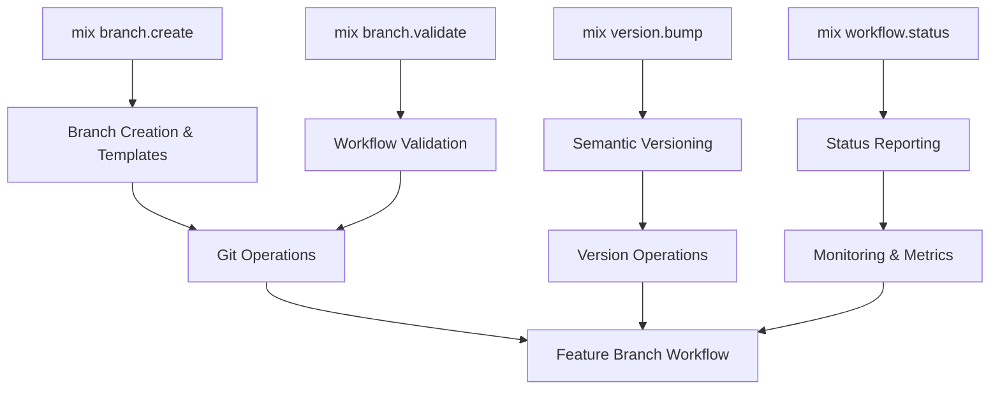

<!-- NAV_START -->
<div align="center">
  <strong>⚙️ Mix Tasks Implementation</strong><br>
  <em>Comprehensive developer automation tooling for the Prismatic project</em><br><br>
  
  <a href="../../../README.md">🏠 Home</a> | 
  <a href="../../README.md">📖 All Guides</a> | 
  <a href="../README.md">🤖 Automation</a><br>
  
  <strong>📖 Reading time:</strong> 5 min | 
  <strong>🔧 Implementation time:</strong> Varies by module | 
  <strong>📊 Skill level:</strong> Beginner to Advanced<br><br>
  
  <strong>Quick Links:</strong>
  <a href="#available-mix-tasks">Tasks</a> |
  <a href="#quick-start">Quick Start</a> |
  <a href="#integration">Integration</a> |
  <a href="#workflows">Workflows</a>
</div>
<!-- NAV_END -->

# Mix Tasks Implementation

## Overview

This directory contains focused, modular guides for implementing custom Mix tasks that support the feature branch workflow, semantic versioning, and automated branch management for the Prismatic project. Each guide covers a specific aspect of the automation tooling, making it easy to find and implement exactly what you need.

## Available Mix Tasks

### 🌿 [Branch Management](branch-management.md)
**📖 15 min | 🔧 30 min | 📊 Intermediate**

Automated branch creation, validation, and management tools that enforce naming conventions and streamline the feature branch workflow.

- **[`mix branch.create`](branch-management.md#branch-creation-task)** - Create feature branches with templates
- **[`mix branch.validate`](branch-management.md#branch-validation-task)** - Validate workflow compliance
- **Features**: Branch templates, naming validation, git integration

### 🔖 [Version Management](version-management.md)
**📖 12 min | 🔧 25 min | 📊 Intermediate**

Semantic versioning automation and release management tools that handle version bumping, changelog generation, and release automation.

- **[`mix version.bump`](version-management.md#version-bump-task)** - Automated semantic versioning
- **Features**: Changelog generation, git tagging, prerelease support

### 📊 [Workflow Status](workflow-status.md)
**📖 10 min | 🔧 20 min | 📊 Intermediate**

Comprehensive status reporting and monitoring tools that provide detailed workflow information and actionable recommendations.

- **[`mix workflow.status`](workflow-status.md#workflow-status-task)** - Complete workflow status reporting
- **Features**: JSON output, CI/CD integration, quality metrics

### 🧪 [Integration Testing](integration-testing.md)
**📖 8 min | 🔧 15 min | 📊 Advanced**

Testing strategies, CI/CD integration, error handling, and performance optimization for Mix tasks.

- **Testing**: Unit tests, integration tests, CI/CD pipelines
- **Features**: Error recovery, performance optimization, best practices

## Quick Start

### Installation

Add Mix tasks to your umbrella project:

```bash
# Clone the tasks to your project
cp -r docs/guides/automation/mix-tasks/lib/mix/tasks/* apps/prismatic/lib/mix/tasks/

# Add to mix.exs aliases
vim mix.exs
```

### Basic Usage

```bash
# Create a new feature branch
mix branch.create feature/user-authentication --push

# Validate current branch
mix branch.validate --verbose

# Check workflow status
mix workflow.status

# Bump version and create release
mix version.bump minor --tag --push --changelog
```

### Common Workflows

#### Daily Development
```bash
# Morning routine
mix workflow.status --verbose
mix branch.validate

# Before committing
mix branch.validate --fix
mix workflow.status
```

#### Release Process
```bash
# Prepare release
mix version.bump minor --changelog --dry-run
mix version.bump minor --tag --push --changelog
```

## Integration

### Mix Aliases

Add these aliases to your root `mix.exs`:

```elixir
defp aliases do
  [
    # Branch management
    "branch.create": ["branch.create"],
    "branch.validate": ["branch.validate"],
    
    # Version management
    "version.bump": ["version.bump"],
    
    # Workflow status
    "workflow.status": ["workflow.status"],
    
    # Convenience aliases
    "feature": ["branch.create feature/"],
    "bugfix": ["branch.create bugfix/"],
    "hotfix": ["branch.create hotfix/"],
    
    # Development workflow
    "dev.check": ["branch.validate", "test", "format --check-formatted"],
    "dev.fix": ["format", "branch.validate --fix"],
    
    # Release workflow
    "release.patch": ["version.bump patch --tag --push --changelog"],
    "release.minor": ["version.bump minor --tag --push --changelog"],
    "release.major": ["version.bump major --tag --push --changelog"]
  ]
end
```

### Dependencies

Add required dependencies:

```elixir
defp deps do
  [
    {:jason, "~> 1.4", only: [:dev, :test]},  # For JSON output
    {:ex_doc, "~> 0.30", only: :dev, runtime: false}
  ]
end
```

## Development Workflows

### Feature Development Workflow

```bash
# 1. Start new feature
mix branch.create feature/user-dashboard --push

# 2. Development cycle
mix workflow.status --verbose      # Check status
mix branch.validate               # Validate changes
mix dev.check                     # Run all checks

# 3. Before push
mix branch.validate --fix         # Fix issues
mix workflow.status              # Final check
git push origin feature/user-dashboard
```

### Release Workflow

```bash
# 1. Prepare release branch
git checkout -b release/v1.2.0

# 2. Update version
mix version.bump minor --changelog --dry-run
mix version.bump minor --changelog

# 3. Create release
mix version.bump --to=1.2.0 --tag --push

# 4. Merge to main
git checkout main
git merge release/v1.2.0
git push origin main
```

### CI/CD Integration Workflow

```bash
# In CI/CD pipelines
mix branch.validate --ci --strict
mix workflow.status --json > workflow-status.json
mix version.bump patch --dry-run
```

## Architecture Overview



## Task Dependencies

Each Mix task module has specific dependencies and integrations:

- **Branch Management**: Git operations, template system
- **Version Management**: File parsing, git tagging, changelog generation  
- **Workflow Status**: Git analysis, code quality checks, JSON output
- **Integration Testing**: Test framework, CI/CD pipelines, error recovery

## Best Practices

### Development
- Use `--dry-run` flags to preview changes
- Run `mix branch.validate` before committing
- Check `mix workflow.status` regularly
- Use branch templates for consistency

### CI/CD
- Use `--ci` flags for automation-friendly output
- Enable JSON output for parsing in scripts
- Set up automated validation in pipelines
- Cache Mix dependencies for performance

### Team Adoption
- Start with basic branch creation and validation
- Gradually introduce version management
- Set up shared aliases for consistency
- Provide training on workflow status interpretation

## Troubleshooting

### Common Issues

| Issue | Solution | Guide |
|-------|----------|-------|
| Branch name validation fails | Use `mix branch.validate --fix` | [Branch Management](branch-management.md) |
| Version format errors | Check semantic versioning format | [Version Management](version-management.md) |
| Workflow status errors | Run with `--verbose` for details | [Workflow Status](workflow-status.md) |
| CI/CD integration issues | Check pipeline configuration | [Integration Testing](integration-testing.md) |

### Getting Help

1. **Check the specific guide** for detailed implementation
2. **Run tasks with `--help`** for usage information
3. **Use `--verbose` flags** for detailed output
4. **Check the [Integration Testing](integration-testing.md)** guide for CI/CD issues

## Related Guides

- **[Automation Overview](../README.md)** - Main automation strategy
- **[Development Tools](../development-tools.md)** - Additional tooling
- **[Team Adoption](../team-adoption.md)** - Adoption strategies
- **[Workflow Guides](../../workflow/)** - Branch workflow and CI/CD

## Next Steps

1. **Choose your starting point**: Pick the Mix task module that fits your immediate needs
2. **Follow the implementation guide**: Each guide provides step-by-step instructions
3. **Set up integration**: Add aliases and dependencies to your project
4. **Test in development**: Use dry-run modes to validate setup
5. **Deploy to CI/CD**: Integrate with your automation pipelines

---

*This guide is part of the [Prismatic Automation Documentation](../README.md). For questions or improvements, please refer to the [contribution guidelines](../../../README.md).*