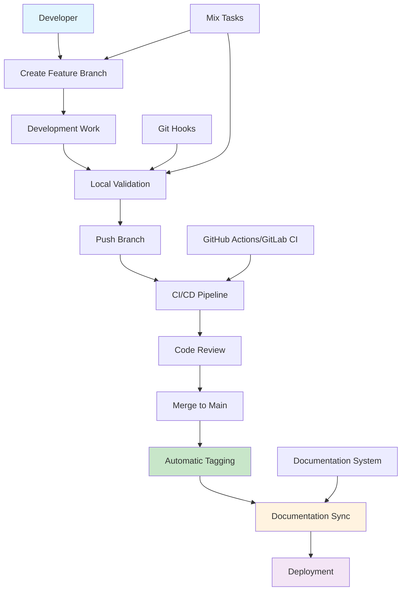
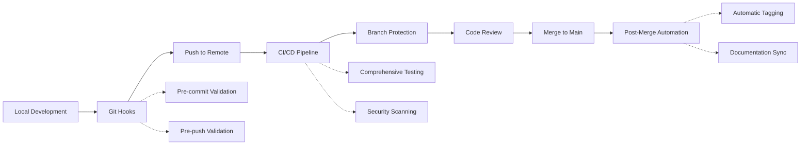
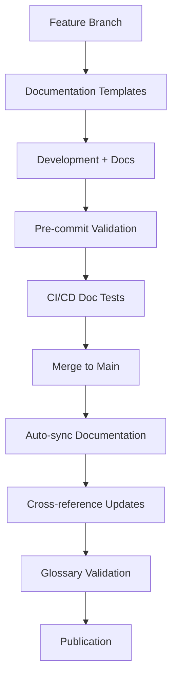

# Comprehensive Feature Branch Workflow Guide

Complete workflow system for feature branch development, automated tagging, and seamless integration with documentation and CI/CD pipelines.

## ⏱️ Time Estimates

📖 Reading time: 45 minutes | 🔧 Setup time: 5 minutes | 📊 Skill level: Beginner

<!-- NAV_START -->
## Navigation

**Current Location**: [Home](../README.md) > [Guides](README.md) > Comprehensive Feature Branch Workflow

### Quick Links

- **📚 [Parent Directory](README.md)** - Return to guides index
- **🏠 [Documentation Home](../README.md)** - Main documentation index
- **🔍 [Search Documentation](../reference/glossary.md)** - Find terms and concepts

### Related Documentation

- [Developer Experience](developer-experience.md) - Daily development workflow that integrates with this branching strategy
- [Coding Standards](coding-standards.md) - Code quality standards enforced by this workflow
- [Git Hooks Implementation](git-hooks-implementation.md) - Local enforcement mechanisms
- [GitHub Actions Implementation](github-actions-implementation.md) - CI/CD pipeline automation
- [Documentation Integration](documentation-integration.md) - Automatic documentation synchronization
<!-- NAV_END -->

## Overview

This document provides the complete guide to the Prismatic feature branch workflow - a comprehensive system that enforces proper branching practices, automated tagging, and seamless integration with documentation and CI/CD pipelines.

## Table of Contents

1. [Quick Start](#quick-start)
2. [Workflow Architecture](#workflow-architecture)
3. [Branch Types and Naming](#branch-types-and-naming)
4. [Daily Development Workflow](#daily-development-workflow)
5. [Enforcement Mechanisms](#enforcement-mechanisms)
6. [Documentation Integration](#documentation-integration)
7. [Release Management](#release-management)
8. [Team Adoption](#team-adoption)
9. [Troubleshooting](#troubleshooting)
10. [Advanced Usage](#advanced-usage)

## Quick Start

### Prerequisites

- Git configured with user name and email
- Elixir 1.15.7+ and Phoenix installed
- Project dependencies installed (`mix deps.get`)

### 5-Minute Setup

```bash
# 1. Install git hooks
./scripts/install-git-hooks.sh

# 2. Validate your setup  
mix branch.validate

# 3. Create your first feature branch
mix branch.create feature/getting-started

# 4. Check workflow status
mix workflow.status
```

### Essential Commands

| Command | Purpose | Example |
|---------|---------|---------|
| [`mix branch.create`](mix-tasks-implementation.md#branch-creation-task) | Create new branch | `mix branch.create feature/user-auth` |
| [`mix branch.validate`](mix-tasks-implementation.md#branch-validation-task) | Validate current branch | `mix branch.validate --verbose` |
| [`mix workflow.status`](mix-tasks-implementation.md#workflow-status-task) | Show workflow status | `mix workflow.status` |
| [`mix version.bump`](mix-tasks-implementation.md#version-management-task) | Bump version | `mix version.bump patch --tag` |

## Workflow Architecture



### Core Components

1. **[Git Hooks](git-hooks-implementation.md)** - Local enforcement and validation
2. **[GitHub Actions](github-actions-implementation.md)** - CI/CD pipeline automation  
3. **[GitLab CI](gitlab-ci-implementation.md)** - Alternative CI/CD implementation
4. **[Mix Tasks](mix-tasks-implementation.md)** - Developer tooling and utilities
5. **[Documentation Integration](documentation-integration.md)** - Automatic documentation sync
6. **[Configuration Files](workflow-configuration-files.md)** - Repository and team setup

## Branch Types and Naming

### Supported Branch Types

| Type | Pattern | Purpose | Auto-Tag | Example |
|------|---------|---------|----------|---------|
| **Feature** | `feature/description` | New functionality | Minor | `feature/user-authentication` |
| **Bugfix** | `bugfix/description` | Non-critical fixes | Patch | `bugfix/login-validation` |
| **Hotfix** | `hotfix/description` | Critical production fixes | Patch | `hotfix/security-vulnerability` |
| **Release** | `release/version` | Release preparation | Specific | `release/v2.1.0` |
| **Chore** | `chore/description` | Maintenance tasks | Patch | `chore/update-dependencies` |
| **Docs** | `docs/description` | Documentation updates | Patch | `docs/api-documentation` |

### Naming Conventions

#### ✅ Valid Branch Names
```bash
feature/user-dashboard
bugfix/memory-leak-fix  
hotfix/critical-security-patch
release/v2.1.0
chore/dependency-updates
docs/installation-guide
```

#### ❌ Invalid Branch Names
```bash
Feature/User-Dashboard    # Wrong case
fix-bug                  # Missing type prefix
feature/user_dashboard   # Underscore not allowed
my-branch               # No type specified
feature/               # Missing description
```

### Branch Name Validation

Branch names are automatically validated by:
- **Git hooks** - Local validation on commit/push
- **CI/CD pipelines** - Remote validation on PR/MR
- **Mix tasks** - Manual validation with `mix branch.validate`

## Daily Development Workflow

### 1. Starting New Work

```bash
# Check current workflow status
mix workflow.status

# Create and switch to feature branch  
mix branch.create feature/new-feature --push

# Verify branch setup
mix branch.validate
```

### 2. Development Cycle

```bash
# Regular development work
git add .
git commit -m "feat(auth): add user login functionality"

# Validate branch before pushing
mix branch.validate --verbose

# Push changes
git push origin feature/new-feature
```

### 3. Pre-Review Checklist

```bash
# Run comprehensive validation
mix branch.validate --strict

# Check workflow status
mix workflow.status --verbose  

# Ensure branch is up to date
git fetch origin main
git rebase origin/main

# Final push
git push origin feature/new-feature --force-with-lease
```

### 4. Creating Pull/Merge Request

Use the provided templates:
- **GitHub**: [Pull Request Template](.github/pull_request_template.md)
- **GitLab**: [Merge Request Template](.gitlab/merge_request_templates/feature.md)

### 5. Post-Merge Validation

After merge to main:
```bash
# Switch to main and pull latest
git checkout main
git pull origin main

# Verify automatic tagging worked
git tag --list --sort=-version:refname | head -5

# Check documentation sync
git log --oneline -5 --grep="docs:"
```

## Enforcement Mechanisms

### Multi-Layer Protection



### 1. Git Hooks (Local)

**Pre-commit Hook:**
- Branch naming validation
- Code formatting checks
- Quick test execution
- Documentation validation

**Pre-push Hook:**
- Prevent direct pushes to main
- Branch synchronization checks
- Commit message validation

**Post-merge Hook:**
- Automatic semantic versioning
- Tag creation and pushing
- Version file updates

See: [Git Hooks Implementation Guide](git-hooks-implementation.md)

### 2. CI/CD Pipeline (Remote)

**GitHub Actions:**
- Branch protection enforcement
- Comprehensive test suite
- Security vulnerability scanning
- Documentation validation
- Automatic release creation

**GitLab CI:**
- Parallel pipeline execution
- Artifact management
- Multi-environment deployment
- Pipeline optimization

See: [GitHub Actions](github-actions-implementation.md) | [GitLab CI](gitlab-ci-implementation.md)

### 3. Repository Protection

**Branch Protection Rules:**
- Require PR/MR for main branch
- Require status checks to pass
- Require code owner approval
- Prevent force pushes

**Push Rules:**
- Enforce commit message format
- Restrict file types
- Require signed commits (optional)

See: [Configuration Files Guide](workflow-configuration-files.md)

## Documentation Integration

### Automatic Documentation Sync

The workflow integrates seamlessly with the existing [documentation system](../docs/_meta/feature-documentation-workflow.md):



### Branch-Specific Documentation

- **Feature branches**: Automatic documentation templates
- **Documentation validation**: Cross-reference integrity  
- **Glossary management**: Automatic term suggestions
- **API documentation**: Auto-generated from code changes

See: [Documentation Integration Guide](documentation-integration.md)

## Release Management

### Semantic Versioning Strategy

The workflow implements automatic semantic versioning:

```
MAJOR.MINOR.PATCH

Examples:
- v1.2.3      (stable release)
- v1.2.4-rc.1 (release candidate)
- v1.2.4-dev.5 (development build)
```

### Version Bumping Rules

| Branch Type | Version Bump | Example | Trigger |
|-------------|--------------|---------|---------|
| `feature/*` | **MINOR** | 1.1.0 → 1.2.0 | New functionality |
| `bugfix/*` | **PATCH** | 1.1.0 → 1.1.1 | Bug fixes |
| `hotfix/*` | **PATCH** | 1.1.0 → 1.1.1 | Critical fixes |
| `release/*` | **SPECIFIC** | As specified | Release preparation |

### Automatic Tagging Process

1. **Merge Detection**: Post-merge hook detects branch type
2. **Version Calculation**: Determines next version based on type
3. **Tag Creation**: Creates annotated git tag with changelog
4. **Multi-remote Push**: Pushes tag to all configured remotes
5. **Release Creation**: Creates GitHub/GitLab release
6. **Notification**: Sends team notifications (if configured)

### Manual Version Management

```bash
# Bump patch version
mix version.bump patch

# Bump minor version with tag
mix version.bump minor --tag --push

# Set specific version  
mix version.bump --to=2.0.0-rc.1

# Dry run to preview changes
mix version.bump major --dry-run
```

## Team Adoption

### Onboarding New Team Members

1. **Setup Workflow**:
   ```bash
   ./scripts/setup-workflow.sh
   ```

2. **Validate Setup**:
   ```bash
   ./scripts/validate-workflow-setup.sh
   ```

3. **First Feature Branch**:
   ```bash  
   mix branch.create feature/onboarding-test --push
   ```

### Training Resources

- **Documentation**: Complete guides in [`docs/guides/`](../guides/)
- **Video Tutorials**: Team-recorded workflow demonstrations
- **Pair Programming**: Senior developers mentor newcomers
- **Workflow Checklists**: Step-by-step guides for common tasks

### Team Configuration

Use the [team setup template](workflow-configuration-files.md#team-configuration-templates) to ensure consistent configuration across all team members.

## Troubleshooting

### Common Issues

#### 1. Branch Name Validation Fails

**Problem**: `❌ Invalid branch name: my-feature`

**Solution**:
```bash
# Check current branch
git branch --show-current

# Create properly named branch
mix branch.create feature/my-feature

# Or rename existing branch
git branch -m feature/my-feature
```

#### 2. Git Hooks Not Working

**Problem**: Hooks don't execute or validation fails

**Solution**:
```bash
# Reinstall hooks
./scripts/install-git-hooks.sh

# Check hook permissions
ls -la .git/hooks/

# Make executable if needed
chmod +x .git/hooks/pre-commit
```

#### 3. CI/CD Pipeline Failures

**Problem**: Pipeline fails on valid changes

**Solution**:
```bash
# Run local validation first
mix branch.validate --strict

# Check specific failure in CI/CD logs
# Fix issues and push again

# For persistent issues, check:
# - Environment variables
# - Service dependencies
# - Pipeline configuration
```

#### 4. Merge Conflicts During Auto-tagging

**Problem**: Tagging fails due to conflicts

**Solution**:
```bash
# Check existing tags
git tag --list --sort=-version:refname

# Force update problematic tag (careful!)
git tag -d v1.0.0
git push origin :refs/tags/v1.0.0

# Re-run tagging
mix version.bump patch --tag
```

#### 5. Documentation Validation Errors

**Problem**: Documentation checks fail

**Solution**:
```bash
# Run documentation validation
python docs/scripts/enhanced_documentation_validator.py

# Fix broken links
find docs -name "*.md" -exec markdown-link-check {} \;

# Update glossary
python docs/scripts/branch_aware_glossary_manager.py
```

### Emergency Bypass

For critical production fixes:

```bash  
# Emergency bypass (use with caution!)
git commit --no-verify
git push --no-verify

# Or for hotfixes
mix branch.create hotfix/emergency-fix
# ... make changes ...
git commit -m "hotfix: critical production issue"
git push origin hotfix/emergency-fix
```

⚠️ **Always create a follow-up task to address bypassed validations**

### Getting Help

1. **Documentation**: Check relevant guides in [`docs/guides/`](../guides/)
2. **Workflow Status**: Run `mix workflow.status --verbose`
3. **Team Chat**: Ask in development channel
4. **Issue Tracker**: Create issue for persistent problems

## Advanced Usage

### Custom Branch Types

To add new branch types, update:
1. **Git hooks**: [`scripts/git-hooks/pre-commit`](git-hooks-implementation.md)
2. **CI/CD pipelines**: Workflow configuration files
3. **Mix tasks**: Branch validation patterns

### Integration with External Tools

#### Jira Integration

```bash
# Branch naming with Jira tickets
mix branch.create feature/PROJ-123-user-authentication
```

#### Slack/Teams Notifications

Configure webhooks in CI/CD variables:
```bash
SLACK_WEBHOOK_URL=https://hooks.slack.com/...
TEAMS_WEBHOOK_URL=https://outlook.office.com/webhook/...
```

#### Code Quality Tools

Integrate additional tools in CI/CD pipelines:
- **Sobelow**: Security scanning
- **Credo**: Static analysis  
- **ExDoc**: Documentation generation
- **Dialyzer**: Type checking

### Custom Validation Rules

Add project-specific validation:

```elixir
# lib/mix/tasks/branch/validate_custom.ex
defmodule Mix.Tasks.Branch.ValidateCustom do
  def run(args) do
    # Custom validation logic
    validate_database_migrations()
    validate_api_compatibility()
    validate_security_requirements()
  end
end
```

### Workflow Metrics

Track workflow adoption and effectiveness:

```bash
# Generate workflow metrics
mix workflow.metrics --since="1 month ago"

# Export to analytics platform
mix workflow.metrics --format=json > metrics.json
```

## Migration Guide

### From Existing Workflow

If migrating from an existing branching strategy:

1. **Audit Current Branches**:
   ```bash
   git branch -a | grep -E "(feature|develop|release)"
   ```

2. **Plan Migration**:
   - Document current workflow
   - Identify branches to migrate/close
   - Schedule team training

3. **Gradual Adoption**:
   - Start with new features only
   - Migrate existing branches over time
   - Maintain old workflow temporarily

4. **Full Cutover**:
   - Enable all enforcement mechanisms
   - Archive old documentation
   - Update team procedures

See: [Migration Plan](branch-workflow-migration-plan.md)

## Best Practices

### Development

- ✅ **Create feature branches for all changes**
- ✅ **Use conventional commit messages**  
- ✅ **Keep branches focused and small**
- ✅ **Regularly sync with main branch**
- ✅ **Run validation before pushing**

### Code Review

- ✅ **Review branch name and type**
- ✅ **Verify documentation updates**
- ✅ **Check test coverage**
- ✅ **Validate security implications**
- ✅ **Ensure CI/CD passes**

### Release Management

- ✅ **Use semantic versioning consistently**
- ✅ **Tag all releases**
- ✅ **Maintain changelog**
- ✅ **Document breaking changes**
- ✅ **Test before release**

## Conclusion

The Prismatic feature branch workflow provides:

- **Consistent Development Experience**: Standardized processes across the team
- **Automated Quality Assurance**: Multi-layer validation and testing
- **Seamless Documentation**: Auto-synchronized documentation
- **Reliable Release Management**: Semantic versioning and automated tagging
- **Enhanced Collaboration**: Clear code review and approval processes

### Success Metrics

Track these metrics to measure workflow effectiveness:

- Branch naming compliance rate (target: >95%)
- Direct commits to main (target: 0)
- Failed CI/CD pipelines due to workflow issues (target: <5%)
- Time from feature start to release (monitor trends)
- Team satisfaction with development experience (regular surveys)

### Continuous Improvement

The workflow is designed to evolve with your team:

- Regular retrospectives on workflow effectiveness
- Updates to validation rules based on team needs
- Integration of new tools and technologies
- Documentation updates based on user feedback

### Resources

- **Implementation Guides**: [`docs/guides/`](../guides/)
- **Configuration Templates**: [`docs/config/`](../config/) 
- **Scripts and Tools**: [`scripts/`](../../scripts/)
- **Examples and Templates**: [`.github/`](../../.github/), [`.gitlab/`](../../.gitlab/)

---

**Ready to get started?** Run `./scripts/setup-workflow.sh` and create your first feature branch with `mix branch.create feature/your-first-feature`!