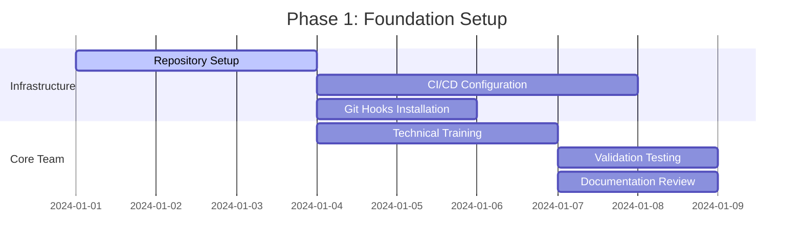
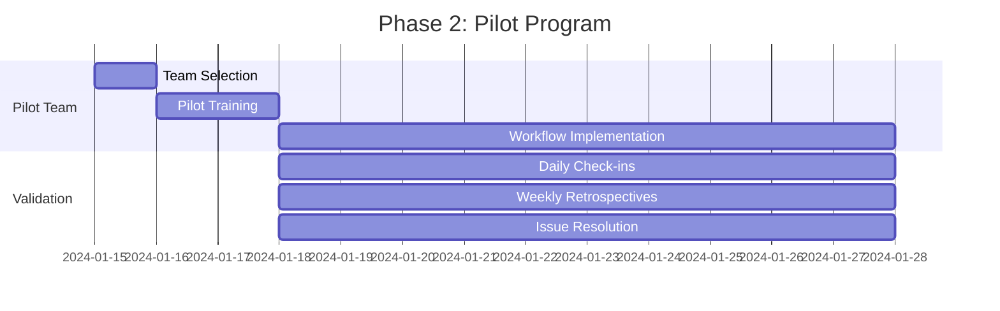
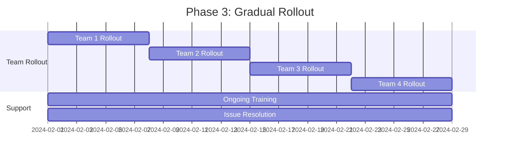
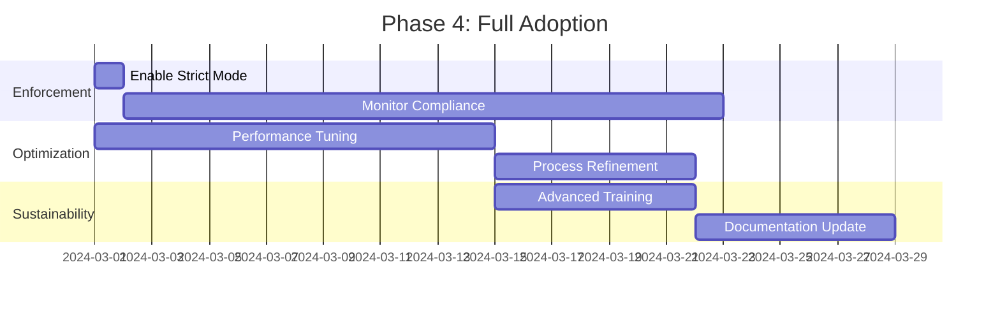
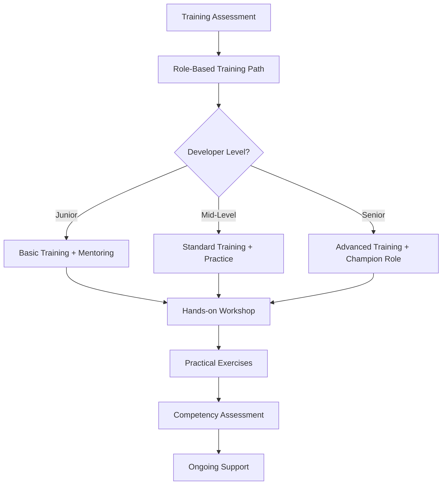
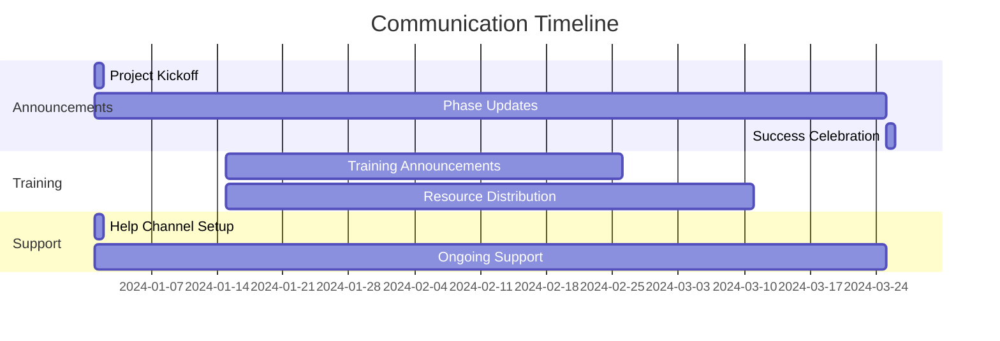
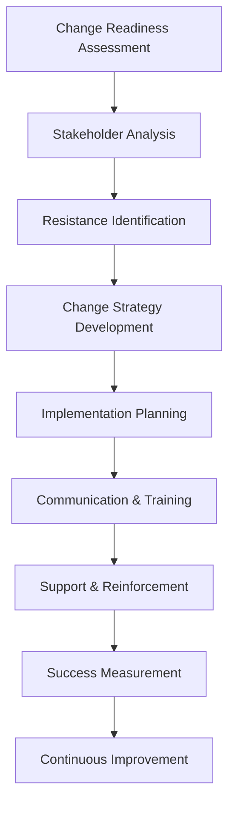
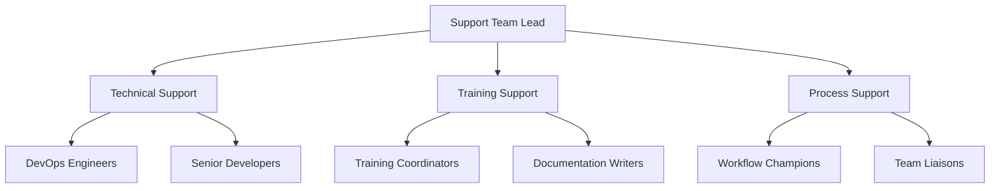
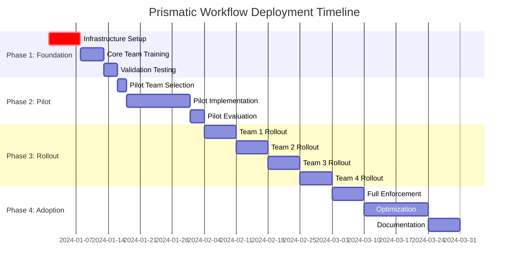
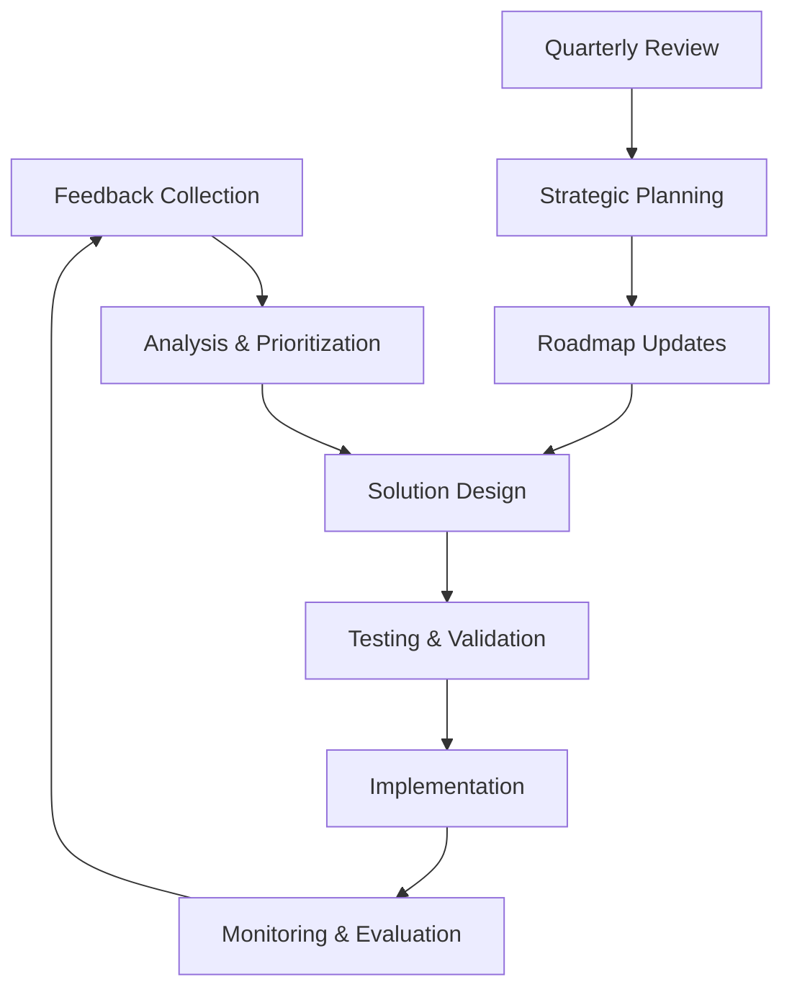

# Deployment and Team Adoption Strategy

Comprehensive strategy for deploying and adopting the Prismatic feature branch workflow across the development team, ensuring smooth transition, minimal disruption, and maximum adoption success.

## ⏱️ Time Estimates

📖 Reading time: 20 minutes | 🔧 Implementation time: 8-12 weeks | 📊 Skill level: Team Lead

<!-- NAV_START -->
## Navigation

**Current Location**: [Home](../../README.md) > [Guides](../README.md) > [Deployment](README.md) > Deployment Team Adoption Strategy

### Quick Links

- **📚 [Parent Directory](README.md)** - Return to deployment guides
- **🏠 [Documentation Home](../../README.md)** - Main documentation index
- **🔍 [Search Documentation](../../reference/glossary.md)** - Find terms and concepts

### Related Documentation

- [Feature Branch Workflow](../workflow/feature-branch-workflow.md) - The workflow system being deployed
- [Git Hooks Complete](../workflow/git-hooks-complete.md) - Local enforcement mechanisms
- [CI/CD Implementation](../workflow/ci-cd-implementation.md) - Pipeline automation
- [Mix Tasks Implementation](../automation/mix-tasks-implementation.md) - Developer tooling
- [Team Adoption](../automation/team-adoption.md) - Additional adoption strategies
<!-- NAV_END -->

## Overview

This document outlines the comprehensive strategy for deploying and adopting the Prismatic feature branch workflow across the development team, ensuring smooth transition, minimal disruption, and maximum adoption success.

## Table of Contents

1. [Executive Summary](#executive-summary)
2. [Deployment Phases](#deployment-phases)
3. [Team Training Strategy](#team-training-strategy)
4. [Communication Plan](#communication-plan)
5. [Change Management](#change-management)
6. [Success Metrics](#success-metrics)
7. [Risk Management](#risk-management)
8. [Support Structure](#support-structure)
9. [Timeline and Milestones](#timeline-and-milestones)
10. [Rollback Procedures](#rollback-procedures)
11. [Continuous Improvement](#continuous-improvement)

## Executive Summary

### Objectives

- **Primary Goal**: Implement consistent feature branch workflow across all development teams
- **Quality Goal**: Achieve 100% compliance with branch naming and automated tagging
- **Efficiency Goal**: Reduce integration issues and improve release reliability
- **Documentation Goal**: Maintain synchronized documentation with zero manual overhead

### Success Criteria

- ✅ 95%+ branch naming compliance within 30 days
- ✅ Zero direct commits to main branch after full rollout
- ✅ 90%+ team satisfaction with new workflow
- ✅ 50% reduction in integration conflicts
- ✅ Automated tagging for 100% of releases

### Key Benefits

- **Consistency**: Standardized development practices across teams
- **Quality**: Automated validation and testing at every step
- **Visibility**: Clear tracking of features from development to release
- **Documentation**: Auto-synchronized documentation and cross-references
- **Reliability**: Predictable release process with semantic versioning

## Deployment Phases

### Phase 1: Foundation Setup (Week 1-2)

**Objective**: Establish technical infrastructure and core team readiness



**Activities:**

1. **Technical Infrastructure**
   - [ ] Configure branch protection rules on GitHub/GitLab
   - [ ] Deploy CI/CD pipeline workflows
   - [ ] Install and test git hooks
   - [ ] Set up Mix tasks and validation tools
   - [ ] Configure repository settings and permissions

2. **Core Team Preparation**
   - [ ] Train 2-3 senior developers as workflow champions
   - [ ] Create team-specific documentation and examples
   - [ ] Test all workflow components in staging environment
   - [ ] Prepare troubleshooting guides and FAQs
   - [ ] Set up monitoring and alerting for workflow metrics

**Success Criteria:**
- All technical components functional and tested
- Core team demonstrates proficiency with workflow
- Documentation complete and validated

### Phase 2: Pilot Program (Week 3-4)

**Objective**: Test workflow with limited team subset and real projects



**Activities:**

1. **Pilot Team Selection**
   - Select 3-5 developers from different experience levels
   - Choose 2-3 active projects of varying complexity
   - Ensure mix of feature types (new features, bug fixes, documentation)

2. **Pilot Implementation**
   - [ ] Provide intensive hands-on training to pilot team
   - [ ] Implement workflow on pilot projects
   - [ ] Daily stand-ups to track progress and issues
   - [ ] Weekly retrospectives to gather feedback
   - [ ] Document lessons learned and workflow refinements

3. **Validation and Refinement**
   - [ ] Monitor workflow compliance and efficiency
   - [ ] Gather user experience feedback
   - [ ] Identify and resolve pain points
   - [ ] Refine documentation and training materials
   - [ ] Adjust automation rules based on real usage

**Success Criteria:**
- Pilot team achieves 90%+ workflow compliance
- No major blockers or showstopper issues
- Positive feedback from pilot team members
- Workflow performance meets established benchmarks

### Phase 3: Gradual Rollout (Week 5-8)

**Objective**: Expand to all teams with phased approach



**Activities:**

1. **Sequential Team Rollout**
   - **Week 5**: Frontend team (typically quick adopters)
   - **Week 6**: Backend team (core application logic)
   - **Week 7**: DevOps/Infrastructure team (workflow experts)
   - **Week 8**: QA/Testing team (workflow validators)

2. **Per-Team Activities**
   - [ ] Team-specific training session (2 hours)
   - [ ] Pair programming sessions with workflow champions
   - [ ] Team lead demonstration of common scenarios
   - [ ] First week daily check-ins for questions/issues
   - [ ] Week-end retrospective and feedback collection

3. **Support and Monitoring**
   - [ ] Daily workflow metrics monitoring
   - [ ] Real-time support via team chat channels
   - [ ] Weekly "office hours" for questions and training
   - [ ] Continuous documentation updates based on feedback

**Success Criteria:**
- Each team achieves 80%+ compliance within one week
- No more than 2 major issues per team during rollout
- Team satisfaction scores above 3.5/5
- Workflow adoption metrics trending upward

### Phase 4: Full Adoption (Week 9-12)

**Objective**: Achieve organization-wide adoption and optimization



**Activities:**

1. **Full Enforcement**
   - [ ] Enable strict branch protection (no bypasses)
   - [ ] Activate all CI/CD validation rules
   - [ ] Turn on automatic tagging for all repositories
   - [ ] Implement full documentation synchronization

2. **Performance Optimization**
   - [ ] Analyze workflow performance metrics
   - [ ] Optimize git hooks and CI/CD pipeline execution times
   - [ ] Streamline validation processes
   - [ ] Reduce friction points identified during rollout

3. **Advanced Training**
   - [ ] Advanced workflow techniques training
   - [ ] Troubleshooting and debugging sessions
   - [ ] Best practices workshops
   - [ ] Champion certification program

**Success Criteria:**
- 95%+ organization-wide compliance
- Zero direct commits to main branch
- Workflow performance benchmarks met
- Team satisfaction scores above 4/5

## Team Training Strategy

### Training Framework



### Training Components

#### 1. Pre-Training Assessment

**Skills Assessment Survey:**
```yaml
Git Proficiency:
  - Basic git operations (clone, commit, push): [ ] Beginner [ ] Intermediate [ ] Advanced
  - Branching and merging: [ ] Beginner [ ] Intermediate [ ] Advanced
  - Conflict resolution: [ ] Beginner [ ] Intermediate [ ] Advanced

Workflow Experience:
  - Feature branch experience: [ ] None [ ] Some [ ] Extensive
  - CI/CD pipeline usage: [ ] None [ ] Some [ ] Extensive
  - Code review processes: [ ] None [ ] Some [ ] Extensive

Tool Familiarity:
  - Elixir/Mix tasks: [ ] Beginner [ ] Intermediate [ ] Advanced
  - GitHub/GitLab: [ ] Beginner [ ] Intermediate [ ] Advanced
  - Command line comfort: [ ] Beginner [ ] Intermediate [ ] Advanced
```

#### 2. Role-Based Training Paths

**Developers (2 hours):**
- Workflow overview and benefits (15 minutes)
- Branch creation and naming conventions (20 minutes)
- Development workflow demonstration (30 minutes)
- Mix tasks and validation tools (25 minutes)
- Hands-on practice with real scenarios (40 minutes)
- Q&A and troubleshooting (10 minutes)

**Team Leads (3 hours):**
- Complete developer training (2 hours)
- Advanced workflow management (30 minutes)
- Team adoption strategies (15 minutes)
- Monitoring and metrics (15 minutes)

**DevOps/SRE (3.5 hours):**
- Complete developer training (2 hours)
- CI/CD pipeline configuration (45 minutes)
- Git hooks management (30 minutes)
- Infrastructure and monitoring setup (15 minutes)

#### 3. Training Materials

**Interactive Workshop Materials:**
- [ ] Live demonstration environment
- [ ] Step-by-step workflow scenarios
- [ ] Common problem simulations
- [ ] Real project examples
- [ ] Interactive troubleshooting exercises

**Self-Paced Resources:**
- [ ] Video tutorials for each workflow step
- [ ] Written guides with screenshots
- [ ] FAQ document with solutions
- [ ] Cheat sheets for quick reference
- [ ] Interactive decision trees for complex scenarios

#### 4. Competency Assessment

**Practical Assessment Checklist:**
- [ ] Create feature branch using correct naming convention
- [ ] Make commits with conventional commit format
- [ ] Run branch validation and interpret results
- [ ] Handle merge conflicts properly
- [ ] Use Mix tasks for workflow management
- [ ] Navigate CI/CD pipeline failures
- [ ] Demonstrate understanding of documentation requirements

**Assessment Rubric:**
- **Proficient**: Can complete all tasks independently
- **Developing**: Can complete most tasks with minimal guidance
- **Beginner**: Requires significant support and mentoring

### Training Schedule

**Week-by-Week Training Calendar:**

| Week | Activity | Audience | Duration |
|------|----------|----------|----------|
| 1 | Workflow Champions Training | Senior Developers | 4 hours |
| 2 | Team Lead Briefing | Team Leads | 2 hours |
| 3 | Pilot Team Training | Selected Developers | 3 hours |
| 4 | Pilot Team Practice & Support | Pilot Team | Ongoing |
| 5 | Frontend Team Training | Frontend Developers | 2.5 hours |
| 6 | Backend Team Training | Backend Developers | 2.5 hours |
| 7 | DevOps Team Training | DevOps/SRE | 3.5 hours |
| 8 | QA Team Training | QA Engineers | 2 hours |
| 9-12 | Ongoing Support & Advanced Training | All Teams | 1 hour/week |

## Communication Plan

### Stakeholder Communication Matrix

| Stakeholder | Information Needs | Communication Method | Frequency |
|-------------|-------------------|---------------------|-----------|
| **Executive Team** | High-level progress, ROI, risks | Executive summary, dashboards | Weekly |
| **Engineering Managers** | Team progress, issues, resources | Status reports, meetings | Bi-weekly |
| **Team Leads** | Implementation details, team status | Direct communication, Slack | Daily |
| **Developers** | Workflow updates, training, support | Team channels, documentation | As needed |
| **DevOps/SRE** | Technical implementation, monitoring | Technical documents, alerts | Real-time |

### Communication Timeline



### Communication Channels

#### 1. Project Announcement

**Initial Announcement Email Template:**
```
Subject: 🚀 Introducing Prismatic Feature Branch Workflow

Team,

We're excited to announce the rollout of our new feature branch workflow system, designed to improve code quality, streamline releases, and enhance team collaboration.

🎯 What's New:
- Standardized branch naming and creation process
- Automated quality validation and testing
- Semantic versioning with automatic tagging
- Integrated documentation synchronization

📅 Rollout Timeline:
- Week 1-2: Infrastructure setup and core team training
- Week 3-4: Pilot program with selected projects
- Week 5-8: Gradual team rollout
- Week 9-12: Full adoption and optimization

🧑‍🏫 Training & Support:
- Hands-on training sessions for each team
- Comprehensive documentation and guides
- Dedicated support channel: #workflow-support
- Weekly office hours for questions

📈 Expected Benefits:
- Consistent development practices
- Reduced integration conflicts
- Faster, more reliable releases
- Better code quality and documentation

Next Steps:
- Core team training begins [DATE]
- Pilot program starts [DATE]
- Your team training: [SCHEDULED DATE]

Questions? Join us in #workflow-support or attend office hours every Wednesday at 2 PM.

Best regards,
[Engineering Leadership]
```

#### 2. Progress Updates

**Weekly Status Update Template:**
```
📊 Workflow Adoption - Week [X] Update

🎯 This Week's Highlights:
- [Team] completed rollout with 95% compliance
- Resolved [X] support tickets
- [X] successful feature branch merges

📈 Overall Progress:
- Teams Trained: [X]/[Total]
- Workflow Compliance: [X]%
- Direct Commits to Main: [X] (Target: 0)
- Team Satisfaction: [X]/5

🚧 Current Challenges:
- [Issue]: [Resolution Plan]
- [Issue]: [Resolution Plan]

📅 Next Week:
- [Team] training scheduled
- [Milestone] completion expected
- Focus on [specific improvement area]

🙋‍♀️ Need Help? 
Join #workflow-support or Wednesday office hours.
```

#### 3. Support Channels

**Slack Channel Structure:**
- `#workflow-support` - General questions and support
- `#workflow-champions` - Champion coordination and advanced topics
- `#workflow-announcements` - Important updates and announcements
- `#workflow-feedback` - Feedback collection and suggestions

## Change Management

### Change Management Framework



### Stakeholder Analysis

#### Champions (High Influence, High Support)
- **Senior Developers**: Workflow architects and trainers
- **Team Leads**: Implementation coordinators
- **DevOps Engineers**: Technical implementation experts

**Engagement Strategy:**
- Deep involvement in design and implementation
- Recognition and additional responsibilities
- Advanced training and certification opportunities

#### Supporters (Low Influence, High Support)
- **Junior Developers**: Eager to learn best practices
- **QA Engineers**: Appreciate structured processes

**Engagement Strategy:**
- Comprehensive training and support
- Mentoring partnerships with champions
- Clear documentation and resources

#### Skeptics (High Influence, Low Support)
- **Experienced Developers**: Comfortable with current processes
- **Some Team Leads**: Concerned about disruption

**Engagement Strategy:**
- Early involvement in pilot program
- Address specific concerns with data
- Demonstrate quick wins and benefits
- Provide additional training and support

#### Neutral (Low Influence, Varying Support)
- **New Team Members**: No established preferences
- **External Contributors**: Occasional involvement

**Engagement Strategy:**
- Standard training and documentation
- Clear expectations and guidelines
- Accessible support channels

### Resistance Management

#### Common Sources of Resistance

1. **Fear of Change**
   - Concern about learning new processes
   - Worry about increased complexity
   - Fear of making mistakes

2. **Time Constraints**
   - Pressure to deliver features quickly
   - Concern about training time investment
   - Worry about initial productivity impact

3. **Technical Concerns**
   - Questions about tool reliability
   - Concerns about CI/CD pipeline complexity
   - Doubts about automation effectiveness

#### Resistance Mitigation Strategies

**For Fear of Change:**
- Start with pilot program to demonstrate success
- Provide comprehensive training and support
- Share success stories from early adopters
- Emphasize benefits and improved developer experience

**For Time Constraints:**
- Demonstrate long-term time savings
- Provide gradual implementation approach
- Show quick wins and immediate benefits
- Offer flexible training schedules

**For Technical Concerns:**
- Provide technical deep-dives and demonstrations
- Share performance metrics and reliability data
- Involve skeptics in technical design decisions
- Offer fallback procedures and safety nets

### Success Factors

#### Organizational Success Factors

1. **Strong Leadership Support**
   - Executive sponsorship and communication
   - Resource allocation and priority setting
   - Consistent messaging and expectations

2. **Clear Value Proposition**
   - Well-defined benefits and outcomes
   - Measurable success criteria
   - Regular progress communication

3. **Comprehensive Support Structure**
   - Dedicated support team and channels
   - Comprehensive training and documentation
   - Quick issue resolution processes

#### Technical Success Factors

1. **Robust Implementation**
   - Thoroughly tested automation and tools
   - Reliable CI/CD pipeline integration
   - Effective monitoring and alerting

2. **User-Friendly Design**
   - Intuitive workflows and processes
   - Clear error messages and guidance
   - Minimal friction and complexity

3. **Flexible Configuration**
   - Adaptable to team-specific needs
   - Configurable validation rules
   - Easy customization and extension

## Success Metrics

### Quantitative Metrics

#### Workflow Compliance Metrics

| Metric | Target | Measurement Method | Frequency |
|--------|--------|-------------------|-----------|
| **Branch Naming Compliance** | >95% | Git hook validation logs | Daily |
| **Direct Commits to Main** | 0 | Git repository analytics | Daily |
| **Automated Tagging Success Rate** | >99% | CI/CD pipeline logs | Daily |
| **Documentation Sync Success** | >95% | Documentation build logs | Daily |
| **CI/CD Pipeline Success Rate** | >90% | Pipeline analytics | Daily |

#### Quality Metrics

| Metric | Target | Measurement Method | Frequency |
|--------|--------|-------------------|-----------|
| **Integration Conflicts** | <5 per week | Git merge statistics | Weekly |
| **Rollback Frequency** | <1 per month | Deployment logs | Monthly |
| **Bug Escape Rate** | <2% | Bug tracking system | Monthly |
| **Code Review Coverage** | >95% | Pull request analytics | Weekly |
| **Test Coverage** | >80% | Test suite reports | Daily |

#### Efficiency Metrics

| Metric | Target | Measurement Method | Frequency |
|--------|--------|-------------------|-----------|
| **Average Branch Lifetime** | <5 days | Git branch analytics | Weekly |
| **Time to Production** | <3 days from merge | Deployment analytics | Weekly |
| **Developer Productivity** | Maintain/improve | Story point velocity | Sprint |
| **Support Ticket Volume** | <10 per week | Support system | Weekly |
| **Training Completion Rate** | >95% | Training system | Weekly |

### Qualitative Metrics

#### Team Satisfaction Survey (Monthly)

**Developer Experience Questions:**
1. How satisfied are you with the new workflow? (1-5 scale)
2. Has the workflow improved your development experience? (Yes/No/Neutral)
3. What aspects of the workflow do you find most valuable?
4. What aspects of the workflow are most challenging?
5. How would you rate the training and support provided? (1-5 scale)
6. Would you recommend this workflow to other teams? (Yes/No)

**Open-Ended Feedback:**
- What improvements would you suggest?
- What additional training or support do you need?
- Any other comments or concerns?

#### Success Benchmarks

**30-Day Targets:**
- [ ] 90% team completion of basic training
- [ ] 85% branch naming compliance
- [ ] <5 direct commits to main per week
- [ ] Team satisfaction score >3.5/5

**60-Day Targets:**
- [ ] 95% branch naming compliance  
- [ ] 0 direct commits to main
- [ ] 90% automated tagging success
- [ ] Team satisfaction score >4/5

**90-Day Targets:**
- [ ] Full workflow adoption across all teams
- [ ] 95% CI/CD pipeline success rate
- [ ] 50% reduction in integration conflicts
- [ ] Documentation sync accuracy >95%

### Metrics Dashboard

**Real-Time Monitoring Dashboard:**

```yaml
Workflow Health Dashboard:
  Compliance Metrics:
    - Branch Naming Compliance: [95.2%] ✅
    - Direct Commits to Main: [0] ✅
    - Automated Tagging: [98.7%] ✅
    
  Quality Metrics:
    - Integration Conflicts: [2/week] ✅
    - CI/CD Success Rate: [94.1%] ✅
    - Code Review Coverage: [97.3%] ✅
    
  Team Metrics:
    - Training Completion: [89%] ⚠️
    - Support Tickets: [7/week] ✅
    - Satisfaction Score: [4.2/5] ✅
    
  Recent Activity:
    - Last 24h: [47] feature branches created
    - Last 24h: [23] successful merges with auto-tagging
    - Last 24h: [3] validation failures resolved
```

## Risk Management

### Risk Assessment Matrix

| Risk | Impact | Probability | Mitigation Strategy | Owner |
|------|--------|-------------|-------------------|-------|
| **Team Resistance** | High | Medium | Change management, training, champions | Engineering Manager |
| **Technical Failures** | High | Low | Comprehensive testing, rollback procedures | DevOps Lead |
| **Productivity Impact** | Medium | Medium | Gradual rollout, comprehensive support | Team Leads |
| **Training Gaps** | Medium | Medium | Multiple training formats, ongoing support | Training Coordinator |
| **Integration Issues** | High | Low | Thorough testing, pilot program validation | Technical Lead |

### Risk Mitigation Strategies

#### Technical Risks

**Risk**: CI/CD Pipeline Failures
- **Mitigation**: Comprehensive testing in staging environment
- **Contingency**: Manual validation procedures as backup
- **Monitoring**: Real-time pipeline health monitoring
- **Response Plan**: Immediate rollback to previous configuration

**Risk**: Git Hook Malfunctions
- **Mitigation**: Extensive testing across different git versions
- **Contingency**: Hook bypass procedures for emergencies
- **Monitoring**: Hook execution logging and alerting
- **Response Plan**: Quick hook deactivation and manual validation

**Risk**: Performance Degradation
- **Mitigation**: Performance testing and optimization
- **Contingency**: Simplified validation rules for high-load periods
- **Monitoring**: Performance metrics tracking
- **Response Plan**: Dynamic rule adjustment based on load

#### Organizational Risks

**Risk**: Incomplete Training Adoption
- **Mitigation**: Multiple training formats and mandatory completion
- **Contingency**: One-on-one mentoring for struggling team members
- **Monitoring**: Training completion tracking and competency assessment
- **Response Plan**: Additional training resources and extended support

**Risk**: Champion Unavailability
- **Mitigation**: Train multiple champions per team
- **Contingency**: Cross-team champion support network
- **Monitoring**: Champion availability and support ticket resolution times
- **Response Plan**: Rapid champion recruitment and training

**Risk**: Executive Support Withdrawal
- **Mitigation**: Regular communication of benefits and ROI
- **Contingency**: Detailed business case for continued support
- **Monitoring**: Executive feedback and engagement levels
- **Response Plan**: Escalation procedures and alternative sponsorship

### Crisis Management

#### Emergency Response Procedures

**Workflow System Failure:**
1. Immediately notify all teams via emergency channels
2. Activate manual validation procedures
3. Document all issues and workarounds
4. Coordinate fix with technical team
5. Communicate resolution timeline
6. Conduct post-incident review

**Mass Training Failure:**
1. Assess scope and impact of training issues
2. Activate one-on-one mentoring network
3. Provide alternative training resources
4. Extend rollout timeline if necessary
5. Gather feedback for training improvements

**Severe Team Resistance:**
1. Meet with resistant team members individually
2. Address specific concerns with data and examples
3. Provide additional support and resources
4. Consider temporary workflow modifications
5. Escalate to management if necessary

## Support Structure

### Support Team Organization



### Support Channels

#### Primary Support Channels

1. **Slack Channels**
   - `#workflow-support` - General questions and assistance
   - `#workflow-champions` - Champion coordination and escalation
   - `#workflow-announcements` - Official updates and communications

2. **Office Hours**
   - **Schedule**: Wednesdays 2-3 PM, Fridays 10-11 AM
   - **Format**: Drop-in video calls with screen sharing
   - **Staffing**: Rotating workflow champions and technical leads

3. **Ticket System**
   - **Platform**: Jira Service Desk or internal ticketing system
   - **Categories**: Technical Issues, Training Requests, Process Questions
   - **SLA**: Response within 4 hours, resolution within 24 hours

#### Escalation Procedures

**Level 1 - Team Champion Support**
- Initial triage and basic issue resolution
- Standard troubleshooting and guidance
- Training reinforcement and clarification

**Level 2 - Technical Support Team**
- Complex technical issues and debugging
- CI/CD pipeline problems and configuration
- Integration issues and custom solutions

**Level 3 - Core Development Team**
- Critical system failures and bugs
- Major feature requests and modifications
- Architecture decisions and design changes

### Support Documentation

#### Knowledge Base Structure

```
Support Documentation/
├── Quick Start Guides/
│   ├── Developer Quick Start
│   ├── Team Lead Quick Start
│   └── DevOps Quick Start
├── Troubleshooting/
│   ├── Common Issues and Solutions
│   ├── Error Message Reference
│   └── Emergency Procedures
├── FAQ/
│   ├── General Workflow Questions
│   ├── Technical Questions
│   └── Process Questions
├── Video Tutorials/
│   ├── Basic Workflow Demo
│   ├── Advanced Features
│   └── Troubleshooting Guide
└── Reference/
    ├── Command Reference
    ├── Configuration Options
    └── API Documentation
```

#### Self-Service Resources

**Interactive Troubleshooting Tool:**
```yaml
Issue: "Branch validation failed"
Questions:
  - Is your branch name following the convention? (feature/description)
    - No: "Please rename your branch using: git branch -m new-name"
    - Yes: Continue to next question
  - Are you on the correct branch?
    - No: "Switch to your feature branch: git checkout feature/your-branch"
    - Yes: Continue to next question
  - Run: mix branch.validate --verbose
    - Shows specific errors: Follow error-specific guidance
    - No errors shown: Contact support with output
```

**Automated Help Bot (Slack):**
- Responds to common questions with instant answers
- Provides links to relevant documentation
- Can escalate to human support when needed
- Tracks frequently asked questions for documentation improvement

### Support Metrics and SLAs

#### Service Level Agreements

| Support Level | Response Time | Resolution Time | Availability |
|---------------|---------------|-----------------|--------------|
| **Critical Issues** | 30 minutes | 4 hours | 24/7 |
| **High Priority** | 2 hours | 24 hours | Business hours |
| **Medium Priority** | 4 hours | 72 hours | Business hours |
| **Low Priority** | 24 hours | 1 week | Business hours |

#### Support Quality Metrics

- **First Contact Resolution Rate**: >70%
- **Customer Satisfaction Score**: >4.5/5
- **Average Resolution Time**: <24 hours
- **Escalation Rate**: <15%
- **Knowledge Base Usage**: >60% of issues self-resolved

## Timeline and Milestones

### Master Timeline



### Critical Milestones

#### Week 2: Foundation Complete ✅
- [ ] All technical infrastructure deployed and tested
- [ ] Core team trained and certified
- [ ] Documentation complete and reviewed
- [ ] Support channels established and operational

#### Week 4: Pilot Success ✅
- [ ] Pilot team demonstrates 90%+ compliance
- [ ] No critical issues or blockers identified
- [ ] Performance benchmarks met or exceeded
- [ ] Pilot team provides positive feedback

#### Week 8: Rollout Complete ✅
- [ ] All teams trained and operational
- [ ] Organization-wide compliance >80%
- [ ] Support ticket volume stabilized
- [ ] Team satisfaction scores >3.5/5

#### Week 12: Full Adoption ✅
- [ ] 95%+ compliance across all teams
- [ ] Zero direct commits to main branch
- [ ] All automation functioning correctly
- [ ] Team satisfaction scores >4/5

### Success Celebrations

#### Milestone Celebration Plan

**Foundation Complete (Week 2):**
- Team announcement and recognition
- Technical achievement showcase
- Infrastructure team appreciation

**Pilot Success (Week 4):**
- Pilot team recognition and rewards
- Success story sharing across organization
- Lessons learned presentation

**Rollout Complete (Week 8):**
- Organization-wide announcement
- Team lead appreciation event
- Progress metrics celebration

**Full Adoption (Week 12):**
- Project completion celebration
- Team-wide recognition and rewards  
- Success metrics presentation to executives
- Documentation of lessons learned

## Rollback Procedures

### Rollback Triggers

#### Automatic Rollback Triggers
- System availability drops below 95%
- Critical bug affecting >50% of users
- Security vulnerability in workflow components
- Data integrity issues detected

#### Manual Rollback Criteria
- Team productivity drops >30% for 3+ days
- Support ticket volume exceeds 50/day
- Team satisfaction drops below 2/5 average
- Executive decision due to business impact

### Rollback Plans

#### Level 1: Partial Rollback (Disable Enforcement)
**Scope**: Disable strict validation while keeping tools available
**Timeline**: 15 minutes
**Actions**:
1. Disable branch protection rules
2. Remove required status checks
3. Allow bypass of git hooks
4. Maintain monitoring and logging
5. Communicate change to all teams

#### Level 2: Feature Rollback (Disable New Features)
**Scope**: Disable new workflow features, keep basic functionality
**Timeline**: 30 minutes
**Actions**:
1. Revert to basic branch validation only
2. Disable automatic tagging
3. Disable documentation synchronization
4. Maintain Mix tasks for voluntary use
5. Provide manual procedures for critical functions

#### Level 3: Full Rollback (Complete Reversion)
**Scope**: Return to pre-workflow state completely
**Timeline**: 2 hours
**Actions**:
1. Remove all branch protection rules
2. Disable CI/CD workflow validation
3. Uninstall git hooks from all repositories
4. Archive workflow documentation
5. Provide transition back to original processes
6. Conduct full team communication

### Recovery Procedures

#### Post-Rollback Assessment
1. **Root Cause Analysis**: Identify specific failure causes
2. **Impact Assessment**: Measure rollback effects on productivity
3. **Stakeholder Communication**: Update all stakeholders on status
4. **Improvement Planning**: Develop fixes for identified issues
5. **Re-deployment Strategy**: Plan approach for renewed implementation

#### Recovery Timeline
- **Day 1**: Complete rollback and stabilization
- **Day 2-3**: Root cause analysis and immediate fixes
- **Week 2**: Testing of fixes and improvement implementation
- **Week 3**: Phased re-deployment with enhanced monitoring
- **Week 4**: Full re-deployment with additional safeguards

## Continuous Improvement

### Feedback Collection

#### Feedback Mechanisms

1. **Monthly Team Surveys**
   - Structured questionnaire about workflow experience
   - Net Promoter Score (NPS) tracking
   - Open-ended improvement suggestions

2. **Quarterly Focus Groups**
   - Deep-dive sessions with representative team members
   - Workflow pain point identification
   - Feature request prioritization

3. **Continuous Feedback Channels**
   - Slack channel for real-time feedback
   - Anonymous suggestion box
   - Regular retrospectives integration

4. **Usage Analytics**
   - Workflow tool usage patterns
   - Performance metrics analysis
   - Error and failure pattern identification

### Improvement Process



#### Monthly Improvement Cycles

**Week 1**: Feedback collection and analysis
- Gather all feedback from various channels
- Analyze usage metrics and performance data
- Identify patterns and common issues

**Week 2**: Prioritization and planning
- Rank issues by impact and effort
- Define improvement initiatives
- Assign ownership and resources

**Week 3**: Implementation and testing
- Develop solutions for priority issues
- Test changes in staging environment
- Validate improvements with pilot groups

**Week 4**: Deployment and monitoring
- Roll out approved improvements
- Monitor impact and effectiveness
- Gather initial feedback on changes

### Success Metrics Evolution

#### Metric Maturity Model

**Level 1 - Basic Metrics** (Months 1-3)
- Compliance rates and basic adoption metrics
- Error rates and support ticket volumes
- Training completion and basic satisfaction

**Level 2 - Efficiency Metrics** (Months 4-6)
- Developer productivity and cycle time metrics
- Quality metrics and defect rates
- Process efficiency and bottleneck identification

**Level 3 - Business Impact Metrics** (Months 7-12)
- Release frequency and reliability
- Customer satisfaction and business value
- ROI measurement and cost-benefit analysis

**Level 4 - Predictive Metrics** (Year 2+)
- Trend analysis and forecasting
- Proactive issue identification
- Optimization recommendations

### Long-term Roadmap

#### Year 1 Goals
- [ ] Achieve and maintain >95% workflow compliance
- [ ] Reduce integration conflicts by 75%
- [ ] Improve release frequency by 50%
- [ ] Achieve team satisfaction score >4.5/5

#### Year 2 Goals
- [ ] Implement advanced workflow features (automated code review, intelligent merging)
- [ ] Expand workflow to external contributors and partners
- [ ] Develop workflow best practices for industry sharing
- [ ] Achieve industry-leading development efficiency metrics

#### Innovation Pipeline
- **AI-Powered Code Review**: Automated code quality assessment
- **Intelligent Branch Management**: Smart branch lifecycle management
- **Predictive Conflict Detection**: Early warning system for merge conflicts
- **Automated Documentation Generation**: AI-driven documentation updates

---

## Conclusion

This comprehensive deployment and team adoption strategy provides a structured, risk-managed approach to implementing the Prismatic feature branch workflow. Through careful planning, phased rollout, comprehensive training, and continuous improvement, we can achieve successful adoption while minimizing disruption and maximizing value.

### Key Success Factors

1. **Strong Foundation**: Robust technical implementation and thorough testing
2. **Gradual Adoption**: Phased approach allowing for learning and adjustment
3. **Comprehensive Support**: Multi-channel support with clear escalation paths
4. **Continuous Feedback**: Regular collection and integration of user feedback
5. **Change Management**: Proactive management of resistance and challenges

### Expected Outcomes

By following this strategy, we expect to achieve:
- Consistent, high-quality development practices across all teams
- Improved code quality and reduced integration issues
- Faster, more reliable release processes
- Enhanced developer experience and job satisfaction
- Better documentation and knowledge management

The success of this implementation will serve as a model for future development process improvements and demonstrate the value of systematic, well-planned organizational change.

## Related Documentation

- [Feature Branch Workflow](../workflow/feature-branch-workflow.md) - The workflow system being deployed
- [Git Hooks Complete](../workflow/git-hooks-complete.md) - Local enforcement mechanisms
- [CI/CD Implementation](../workflow/ci-cd-implementation.md) - Pipeline automation
- [Mix Tasks Implementation](../automation/mix-tasks-implementation.md) - Developer tooling
- [Team Adoption](../automation/team-adoption.md) - Additional adoption strategies
- [Developer Experience](../getting-started/developer-experience.md) - Developer onboarding integration

---

**💡 Deployment Tip**: Successful workflow adoption is 20% technology and 80% people. Focus on change management, clear communication, and comprehensive support to ensure lasting success.