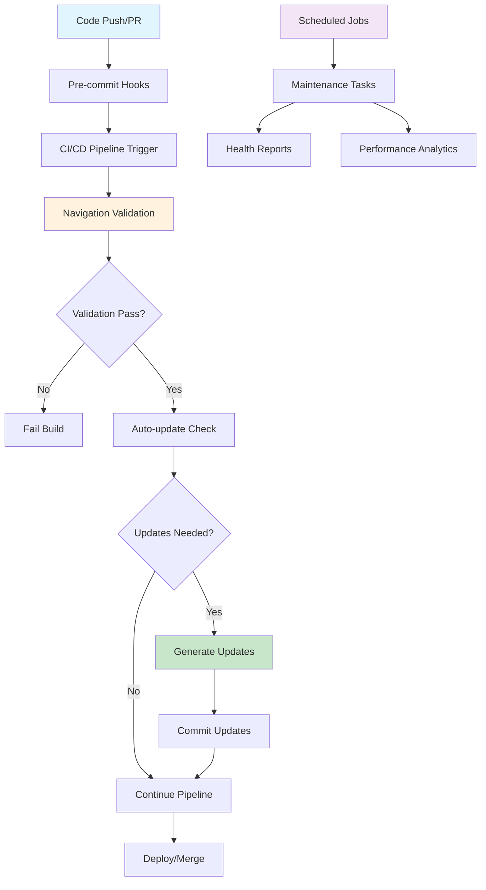

# Documentation Navigation CI/CD Integration

## Overview

This document provides comprehensive CI/CD integration for the documentation navigation system, including automated validation, updates, and maintenance workflows for both GitHub Actions and GitLab CI environments.

## Integration Architecture

### CI/CD Pipeline Flow



### Integration Points

1. **Pre-commit Hooks** - Local validation before commits
2. **Pull Request Validation** - Comprehensive checks on PRs/MRs
3. **Automatic Updates** - Auto-generate navigation when structure changes
4. **Deployment Validation** - Final checks before deployment
5. **Scheduled Maintenance** - Regular system health and optimization

## GitHub Actions Integration

### Complete Workflow Configuration

**File**: `.github/workflows/documentation-navigation.yml`

```yaml
name: Documentation Navigation System

on:
  push:
    branches: [main, develop]
    paths: ['docs/**']
  pull_request:
    branches: [main, develop]
    paths: ['docs/**']
  schedule:
    # Daily maintenance at 2 AM UTC
    - cron: '0 2 * * *'
  workflow_dispatch:
    inputs:
      maintenance_type:
        description: 'Type of maintenance to run'
        required: true
        default: 'validate'
        type: choice
        options:
          - validate
          - update
          - full-maintenance

env:
  MIX_ENV: test
  GITHUB_TOKEN: ${{ secrets.GITHUB_TOKEN }}

jobs:
  # Navigation validation job
  validate-navigation:
    name: Validate Navigation System
    runs-on: ubuntu-latest
    if: github.event_name == 'pull_request' || github.event_name == 'push'
    
    steps:
      - name: Checkout code
        uses: actions/checkout@v4
        
      - name: Setup Elixir
        uses: erlef/setup-beam@v1
        with:
          elixir-version: '1.15.7'
          otp-version: '26.0'
          
      - name: Cache dependencies
        uses: actions/cache@v3
        with:
          path: |
            deps
            _build
          key: ${{ runner.os }}-mix-${{ hashFiles('**/mix.lock') }}
          restore-keys: ${{ runner.os }}-mix-
          
      - name: Install dependencies
        run: mix deps.get
        
      - name: Compile project
        run: mix compile --warnings-as-errors
        
      - name: Validate navigation structure
        run: |
          echo "🔍 Validating navigation system..."
          mix docs.nav.validate --verbose --format=github-actions
          
      - name: Check navigation synchronization
        run: |
          echo "🔄 Checking directory synchronization..."
          mix docs.nav.validate --check-sync --strict
          
      - name: Generate validation report
        if: always()
        run: |
          mix docs.nav.validate --format=json > navigation-validation.json
          mix docs.nav.validate --format=markdown > navigation-report.md
          
      - name: Upload validation artifacts
        if: always()
        uses: actions/upload-artifact@v3
        with:
          name: navigation-validation-${{ github.sha }}
          path: |
            navigation-validation.json
            navigation-report.md
            
      - name: Comment PR with validation results
        if: github.event_name == 'pull_request' && failure()
        uses: actions/github-script@v6
        with:
          script: |
            const fs = require('fs');
            if (fs.existsSync('navigation-report.md')) {
              const report = fs.readFileSync('navigation-report.md', 'utf8');
              await github.rest.issues.createComment({
                issue_number: context.issue.number,
                owner: context.repo.owner,
                repo: context.repo.repo,
                body: `## 📊 Navigation Validation Report\n\n${report}`
              });
            }

  # Automatic navigation updates
  auto-update-navigation:
    name: Auto-Update Navigation
    runs-on: ubuntu-latest
    if: github.event_name == 'push' && github.ref == 'refs/heads/main'
    needs: validate-navigation
    
    steps:
      - name: Checkout code
        uses: actions/checkout@v4
        with:
          token: ${{ secrets.GITHUB_TOKEN }}
          fetch-depth: 0
          
      - name: Setup Elixir
        uses: erlef/setup-beam@v1
        with:
          elixir-version: '1.15.7'
          otp-version: '26.0'
          
      - name: Install dependencies
        run: mix deps.get
        
      - name: Check if navigation updates needed
        id: check-updates
        run: |
          echo "🔍 Checking if navigation updates are needed..."
          if mix docs.nav.update --dry-run --quiet; then
            echo "updates-needed=false" >> $GITHUB_OUTPUT
          else
            echo "updates-needed=true" >> $GITHUB_OUTPUT
          fi
          
      - name: Update navigation sections
        if: steps.check-updates.outputs.updates-needed == 'true'
        run: |
          echo "🔄 Updating navigation sections..."
          mix docs.nav.update --auto-mode --backup
          
      - name: Commit navigation updates
        if: steps.check-updates.outputs.updates-needed == 'true'
        run: |
          git config --local user.email "action@github.com"
          git config --local user.name "GitHub Action"
          git add docs/
          if [ -n "$(git status --porcelain)" ]; then
            git commit -m "docs: auto-update navigation sections
            
            - Updated navigation to reflect directory structure changes
            - Synchronized subdirectory listings and descriptions
            - Validated all navigation links and references
            
            [skip ci]"
            git push
          else
            echo "No navigation changes to commit"
          fi
          
      - name: Create update summary
        if: steps.check-updates.outputs.updates-needed == 'true'
        run: |
          echo "📊 Navigation Update Summary" > update-summary.md
          echo "================================" >> update-summary.md
          echo "" >> update-summary.md
          git log --oneline -1 >> update-summary.md
          echo "" >> update-summary.md
          mix docs.nav.validate --summary >> update-summary.md
          
      - name: Upload update summary
        if: steps.check-updates.outputs.updates-needed == 'true'
        uses: actions/upload-artifact@v3
        with:
          name: navigation-update-summary-${{ github.sha }}
          path: update-summary.md

  # Scheduled maintenance
  scheduled-maintenance:
    name: Scheduled Navigation Maintenance
    runs-on: ubuntu-latest
    if: github.event_name == 'schedule' || (github.event_name == 'workflow_dispatch' && github.event.inputs.maintenance_type == 'full-maintenance')
    
    steps:
      - name: Checkout code
        uses: actions/checkout@v4
        
      - name: Setup Elixir
        uses: erlef/setup-beam@v1
        with:
          elixir-version: '1.15.7'
          otp-version: '26.0'
          
      - name: Install dependencies
        run: mix deps.get
        
      - name: Run comprehensive validation
        run: |
          echo "🔍 Running comprehensive navigation validation..."
          mix docs.nav.validate --comprehensive --format=json > daily-validation.json
          
      - name: Generate health report
        run: |
          echo "📊 Generating navigation health report..."
          mix docs.nav.health-report --format=markdown > navigation-health.md
          
      - name: Run performance analysis
        run: |
          echo "⚡ Running performance analysis..."
          mix docs.nav.performance-analysis > performance-report.txt
          
      - name: Generate maintenance recommendations
        run: |
          echo "💡 Generating maintenance recommendations..."
          mix docs.nav.maintenance-recommendations > recommendations.md
          
      - name: Archive maintenance reports
        run: |
          mkdir -p maintenance-reports/$(date +%Y-%m)
          mv daily-validation.json maintenance-reports/$(date +%Y-%m)/
          mv navigation-health.md maintenance-reports/$(date +%Y-%m)/
          mv performance-report.txt maintenance-reports/$(date +%Y-%m)/
          mv recommendations.md maintenance-reports/$(date +%Y-%m)/
          
      - name: Upload maintenance reports
        uses: actions/upload-artifact@v3
        with:
          name: navigation-maintenance-$(date +%Y%m%d)
          path: maintenance-reports/
          
      - name: Create maintenance issue if problems found
        if: failure()
        uses: actions/github-script@v6
        with:
          script: |
            const date = new Date().toISOString().split('T')[0];
            await github.rest.issues.create({
              owner: context.repo.owner,
              repo: context.repo.repo,
              title: `🚨 Navigation System Maintenance Alert - ${date}`,
              body: `Scheduled navigation maintenance detected issues that require attention.
              
              Please review the maintenance reports and address any critical issues.
              
              **Maintenance Run**: ${date}
              **Workflow**: ${context.workflow}
              **Run ID**: ${context.runId}`,
              labels: ['documentation', 'maintenance', 'high-priority']
            });

  # Manual workflow dispatch jobs
  manual-update:
    name: Manual Navigation Update
    runs-on: ubuntu-latest
    if: github.event_name == 'workflow_dispatch' && github.event.inputs.maintenance_type == 'update'
    
    steps:
      - name: Checkout code
        uses: actions/checkout@v4
        with:
          token: ${{ secrets.GITHUB_TOKEN }}
          
      - name: Setup Elixir
        uses: erlef/setup-beam@v1
        with:
          elixir-version: '1.15.7'
          otp-version: '26.0'
          
      - name: Install dependencies
        run: mix deps.get
        
      - name: Force update navigation
        run: |
          echo "🔄 Force updating all navigation sections..."
          mix docs.nav.update --force --backup
          
      - name: Commit manual updates
        run: |
          git config --local user.email "action@github.com"
          git config --local user.name "GitHub Action (Manual)"
          git add docs/
          if [ -n "$(git status --porcelain)" ]; then
            git commit -m "docs: manual navigation system update
            
            - Force updated all navigation sections
            - Ensured synchronization with directory structure
            - Validated all links and references
            
            Triggered by: ${{ github.actor }}"
            git push
          fi
```

### Pre-commit Hook Integration

**File**: `.github/hooks/pre-commit-navigation`

```bash
#!/bin/sh
# Pre-commit hook for navigation validation

echo "🔍 Validating documentation navigation..."

# Check if any documentation files changed
if git diff --cached --name-only | grep -q "^docs/"; then
    # Run fast navigation validation
    if ! mix docs.nav.validate --fast --staged-files; then
        echo "❌ Navigation validation failed. Please fix the issues above."
        echo "💡 Run 'mix docs.nav.update' to automatically fix navigation issues."
        exit 1
    fi
    
    echo "✅ Navigation validation passed."
fi

exit 0
```

## GitLab CI Integration

### Complete Pipeline Configuration

**File**: `.gitlab-ci.yml` (navigation sections)

```yaml
# Documentation Navigation Pipeline
include:
  - local: '.gitlab/ci/documentation-navigation.yml'

variables:
  MIX_ENV: test
  # Navigation system variables
  NAV_VALIDATION_ENABLED: "true"
  NAV_AUTO_UPDATE: "true"
  NAV_STRICT_MODE: "false"

stages:
  - validate
  - test
  - update
  - deploy
  - maintain

# Navigation validation stage
validate-navigation:
  stage: validate
  image: elixir:1.15.7
  before_script:
    - mix local.hex --force
    - mix local.rebar --force
    - mix deps.get
    - mix compile
  script:
    - echo "🔍 Validating navigation system..."
    - mix docs.nav.validate --verbose --format=gitlab-ci
    - mix docs.nav.validate --check-sync --strict
  artifacts:
    reports:
      junit: navigation-validation.xml
    paths:
      - navigation-validation.json
      - navigation-report.md
    expire_in: 1 week
  rules:
    - if: '$CI_PIPELINE_SOURCE == "merge_request_event"'
      changes:
        - docs/**/*
    - if: '$CI_COMMIT_BRANCH == "main"'
      changes:
        - docs/**/*

# Auto-update navigation
auto-update-navigation:
  stage: update
  image: elixir:1.15.7
  before_script:
    - mix local.hex --force
    - mix local.rebar --force
    - mix deps.get
  script:
    - echo "🔄 Checking for navigation updates..."
    - |
      if mix docs.nav.update --dry-run --quiet; then
        echo "No navigation updates needed"
      else
        echo "Updating navigation sections..."
        mix docs.nav.update --auto-mode --backup
        
        # Configure git
        git config --global user.email "gitlab-ci@example.com"
        git config --global user.name "GitLab CI"
        
        # Commit changes if any
        git add docs/
        if [ -n "$(git status --porcelain)" ]; then
          git commit -m "docs: auto-update navigation sections [skip ci]"
          git push https://oauth2:${CI_PUSH_TOKEN}@${CI_SERVER_HOST}/${CI_PROJECT_PATH}.git HEAD:${CI_COMMIT_REF_NAME}
        fi
      fi
  rules:
    - if: '$CI_COMMIT_BRANCH == "main" && $NAV_AUTO_UPDATE == "true"'
      changes:
        - docs/**/*
  dependencies:
    - validate-navigation

# Scheduled maintenance
navigation-maintenance:
  stage: maintain
  image: elixir:1.15.7
  before_script:
    - mix local.hex --force
    - mix local.rebar --force
    - mix deps.get
  script:
    - echo "📊 Running navigation maintenance..."
    - mix docs.nav.validate --comprehensive --format=json > maintenance-validation.json
    - mix docs.nav.health-report --format=markdown > navigation-health.md
    - mix docs.nav.performance-analysis > performance-report.txt
  artifacts:
    paths:
      - maintenance-validation.json
      - navigation-health.md
      - performance-report.txt
    expire_in: 30 days
  rules:
    - if: '$CI_PIPELINE_SOURCE == "schedule"'
  allow_failure: true

# Manual navigation update job
manual-navigation-update:
  stage: update
  image: elixir:1.15.7
  before_script:
    - mix local.hex --force
    - mix local.rebar --force
    - mix deps.get
  script:
    - echo "🔄 Manual navigation update..."
    - mix docs.nav.update --force --backup
    - git config --global user.email "gitlab-ci@example.com"
    - git config --global user.name "GitLab CI (Manual)"
    - git add docs/
    - |
      if [ -n "$(git status --porcelain)" ]; then
        git commit -m "docs: manual navigation system update
        
        Triggered by: ${GITLAB_USER_LOGIN}"
        git push https://oauth2:${CI_PUSH_TOKEN}@${CI_SERVER_HOST}/${CI_PROJECT_PATH}.git HEAD:${CI_COMMIT_REF_NAME}
      fi
  rules:
    - if: '$CI_PIPELINE_SOURCE == "web"'
    - when: manual
```

### GitLab CI Detailed Configuration

**File**: `.gitlab/ci/documentation-navigation.yml`

```yaml
# Detailed GitLab CI configuration for navigation system

.navigation-base:
  image: elixir:1.15.7
  cache:
    key: ${CI_COMMIT_REF_SLUG}
    paths:
      - deps/
      - _build/
  before_script:
    - mix local.hex --force
    - mix local.rebar --force
    - mix deps.get
    - mix compile

.navigation-rules:
  rules:
    - if: '$CI_PIPELINE_SOURCE == "merge_request_event"'
      changes:
        - docs/**/*
    - if: '$CI_COMMIT_BRANCH == "main"'
      changes:
        - docs/**/*

navigation-lint:
  extends: 
    - .navigation-base
    - .navigation-rules
  stage: validate
  script:
    - echo "🔍 Linting navigation format..."
    - mix docs.nav.validate --check-format --strict
  artifacts:
    reports:
      codequality: navigation-codequality.json

navigation-links:
  extends: 
    - .navigation-base
    - .navigation-rules
  stage: validate
  script:
    - echo "🔗 Validating navigation links..."
    - mix docs.nav.validate --check-links --timeout=30
  artifacts:
    paths:
      - broken-links-report.md
    expire_in: 1 day

navigation-sync:
  extends: 
    - .navigation-base
    - .navigation-rules
  stage: validate
  script:
    - echo "🔄 Checking navigation synchronization..."
    - mix docs.nav.validate --check-sync --detailed
  artifacts:
    paths:
      - sync-report.json
    expire_in: 1 day

navigation-performance:
  extends: .navigation-base
  stage: test
  script:
    - echo "⚡ Testing navigation performance..."
    - mix docs.nav.performance-test --benchmark
  artifacts:
    paths:
      - performance-benchmark.json
    expire_in: 7 days
  rules:
    - if: '$CI_COMMIT_BRANCH == "main"'
```

## Deployment Integration

### Pre-deployment Validation

```bash
#!/bin/bash
# Pre-deployment navigation validation script

echo "🚀 Pre-deployment navigation validation..."

# Strict validation before deployment
if ! mix docs.nav.validate --strict --fail-on-warnings; then
    echo "❌ Navigation validation failed - blocking deployment"
    exit 1
fi

# Check navigation health score
HEALTH_SCORE=$(mix docs.nav.health-score --numeric)
MIN_HEALTH_SCORE=${NAV_MIN_HEALTH_SCORE:-80}

if [ "$HEALTH_SCORE" -lt "$MIN_HEALTH_SCORE" ]; then
    echo "❌ Navigation health score ($HEALTH_SCORE) below minimum ($MIN_HEALTH_SCORE)"
    exit 1
fi

echo "✅ Navigation validation passed - deployment approved"
```

### Post-deployment Verification

```bash
#!/bin/bash
# Post-deployment navigation verification

echo "✅ Post-deployment navigation verification..."

# Verify navigation system is working
if ! mix docs.nav.validate --deployed --timeout=60; then
    echo "⚠️ Post-deployment navigation issues detected"
    # Send alert but don't fail deployment
    curl -X POST "$SLACK_WEBHOOK" -d "{\"text\":\"Navigation issues detected after deployment to $ENVIRONMENT\"}"
fi

# Generate deployment report
mix docs.nav.deployment-report --environment="$ENVIRONMENT" > navigation-deployment-report.md
```

## Notification Integration

### Slack Integration

```yaml
# Slack notification configuration
slack-navigation-notification:
  stage: notify
  image: alpine:latest
  before_script:
    - apk add --no-cache curl jq
  script:
    - |
      if [ "$CI_JOB_STATUS" = "failed" ]; then
        MESSAGE="🚨 Navigation validation failed in $CI_PROJECT_NAME"
        COLOR="danger"
      else
        MESSAGE="✅ Navigation validation passed in $CI_PROJECT_NAME"
        COLOR="good"
      fi
      
      curl -X POST "$SLACK_WEBHOOK_URL" \
        -H 'Content-type: application/json' \
        --data "{
          \"attachments\": [{
            \"color\": \"$COLOR\",
            \"title\": \"Documentation Navigation Status\",
            \"text\": \"$MESSAGE\",
            \"fields\": [
              {\"title\": \"Branch\", \"value\": \"$CI_COMMIT_REF_NAME\", \"short\": true},
              {\"title\": \"Commit\", \"value\": \"$CI_COMMIT_SHORT_SHA\", \"short\": true},
              {\"title\": \"Pipeline\", \"value\": \"$CI_PIPELINE_URL\", \"short\": false}
            ]
          }]
        }"
  rules:
    - if: '$SLACK_WEBHOOK_URL'
      when: always
```

### Email Notification

```yaml
# Email notification for critical navigation issues
email-navigation-alert:
  stage: notify
  image: alpine:latest
  before_script:
    - apk add --no-cache mailx
  script:
    - |
      if [ -f "navigation-validation.json" ]; then
        CRITICAL_ERRORS=$(jq '.summary.critical_errors' navigation-validation.json)
        if [ "$CRITICAL_ERRORS" -gt 0 ]; then
          echo "Critical navigation errors detected: $CRITICAL_ERRORS" | \
            mailx -s "Navigation System Alert - $CI_PROJECT_NAME" \
            -r "gitlab-ci@example.com" \
            "$NAVIGATION_ALERT_EMAIL"
        fi
      fi
  rules:
    - if: '$NAVIGATION_ALERT_EMAIL && $CI_COMMIT_BRANCH == "main"'
      when: on_failure
```

## Monitoring and Alerting

### Health Monitoring Dashboard

```yaml
# Navigation health monitoring
navigation-monitoring:
  stage: maintain
  image: elixir:1.15.7
  script:
    - mix docs.nav.health-check --format=prometheus > navigation-metrics.txt
    - curl -X POST "$MONITORING_ENDPOINT/metrics" --data-binary @navigation-metrics.txt
  rules:
    - if: '$CI_PIPELINE_SOURCE == "schedule"'
  allow_failure: true
```

### Automated Issue Creation

```yaml
# Create issues for navigation problems
create-navigation-issues:
  stage: notify
  image: alpine:latest
  before_script:
    - apk add --no-cache curl jq
  script:
    - |
      if [ -f "navigation-validation.json" ]; then
        CRITICAL_ERRORS=$(jq '.summary.critical_errors' navigation-validation.json)
        if [ "$CRITICAL_ERRORS" -gt 0 ]; then
          # Create GitLab issue
          curl --request POST \
            --header "PRIVATE-TOKEN: $CI_JOB_TOKEN" \
            --header "Content-Type: application/json" \
            --data "{
              \"title\": \"Navigation System Issues - $(date +%Y-%m-%d)\",
              \"description\": \"Automated detection of navigation system issues.\n\nCritical errors: $CRITICAL_ERRORS\n\nPipeline: $CI_PIPELINE_URL\",
              \"labels\": \"documentation,navigation,critical\"
            }" \
            "$CI_API_V4_URL/projects/$CI_PROJECT_ID/issues"
        fi
      fi
  rules:
    - if: '$CI_COMMIT_BRANCH == "main"'
      when: on_failure
```

## Performance Optimization

### Pipeline Optimization

```yaml
# Optimized navigation validation for large repositories
navigation-validation-optimized:
  extends: .navigation-base
  stage: validate
  parallel:
    matrix:
      - VALIDATION_TYPE: [structure, links, sync, format]
  script:
    - |
      case $VALIDATION_TYPE in
        structure)
          mix docs.nav.validate --check-markers --check-format
          ;;
        links)
          mix docs.nav.validate --check-links --parallel
          ;;
        sync)
          mix docs.nav.validate --check-sync
          ;;
        format)
          mix docs.nav.validate --check-descriptions --check-content
          ;;
      esac
  artifacts:
    paths:
      - validation-${VALIDATION_TYPE}.json
    expire_in: 1 day
```

### Caching Strategy

```yaml
# Navigation validation cache optimization
.navigation-cache:
  cache:
    key: 
      files:
        - docs/**/*.md
        - mix.lock
    paths:
      - deps/
      - _build/
      - .navigation-cache/
  before_script:
    - mix local.hex --force
    - mix local.rebar --force
    - mix deps.get
    - mkdir -p .navigation-cache
```

## Related Documentation

- [Documentation Navigation Standards](documentation-navigation-standards.md) - Complete system standards
- [Navigation Mix Tasks](documentation-navigation-mix-tasks.md) - Automation tools implementation
- [Navigation Validation](documentation-navigation-validation.md) - Validation processes
- [GitHub Actions Implementation](github-actions-implementation.md) - Existing CI/CD workflows
- [GitLab CI Implementation](gitlab-ci-implementation.md) - Existing GitLab CI configuration

---

**This CI/CD integration ensures the documentation navigation system is automatically validated, updated, and maintained across all development workflows, providing consistent and reliable navigation throughout the documentation lifecycle.**