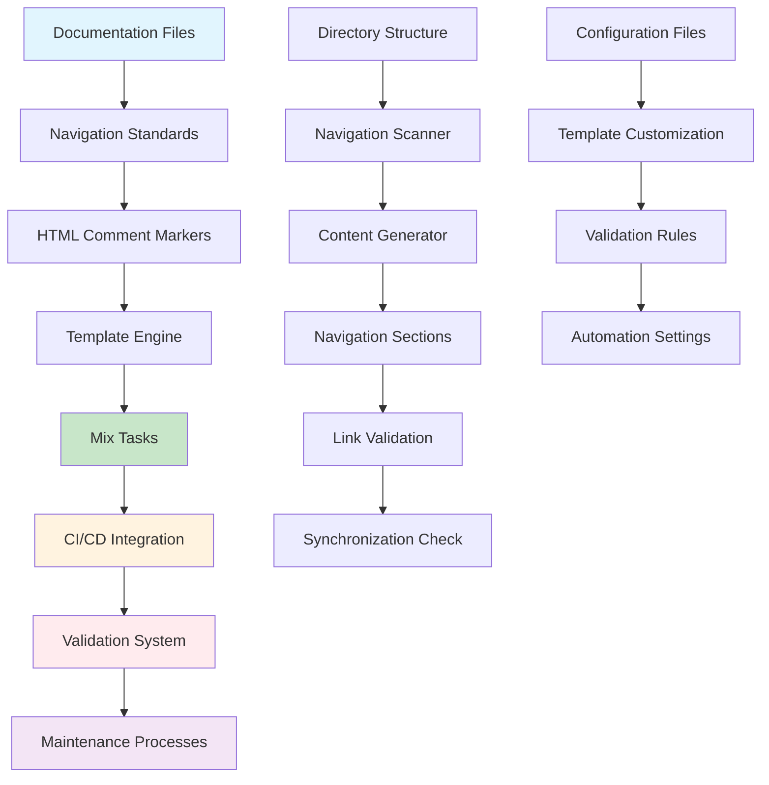

# Documentation Navigation System Implementation Guide

## Overview

This comprehensive guide provides step-by-step instructions for implementing and using the documentation navigation system in the Prismatic project. It serves as the master implementation document, bringing together all navigation system components into a complete, actionable guide.

## System Architecture Overview

### Complete Navigation System



### Component Integration

| Component | Purpose | Implementation | Status |
|-----------|---------|----------------|---------|
| **Standards** | Define navigation format and rules | [Navigation Standards](documentation-navigation-standards.md) | ✅ Complete |
| **Templates** | Provide consistent navigation structure | [Navigation Templates](documentation-navigation-templates.md) | ✅ Complete |
| **Mix Tasks** | Automate navigation management | [Mix Tasks](documentation-navigation-mix-tasks.md) | ✅ Complete |
| **Validation** | Ensure navigation integrity | [Validation System](documentation-navigation-validation.md) | ✅ Complete |
| **CI/CD** | Integrate with development workflows | [CI/CD Integration](documentation-navigation-cicd.md) | ✅ Complete |

## Implementation Roadmap

### Phase 1: Foundation Setup

#### Step 1: Install and Configure System

**Prerequisites Check:**
```bash
# Verify Elixir and Mix are installed
elixir --version  # Should be 1.15.7+
mix --version

# Verify project structure
ls -la docs/  # Should show existing documentation structure
```

**Configuration Setup:**
```bash
# 1. Create navigation configuration file
cat > docs/.navigation-config.yml << 'EOF'
# Documentation Navigation System Configuration
directory_descriptions:
  _meta: "Documentation system metadata and maintenance procedures"
  core: "Essential system architecture and design documentation"
  guides: "Step-by-step implementation and best practice guides"
  operations: "Deployment, monitoring, and maintenance procedures"
  reference: "Quick reference materials and API documentation"
  architecture: "Architectural decisions and system design documentation"
  shared: "Shared resources and templates"

navigation_settings:
  max_key_files: 3
  include_dates: false
  auto_generate_descriptions: true
  template: "standard"

validation_settings:
  check_external_links: false
  validate_anchors: true
  max_link_depth: 3

ci_settings:
  auto_commit: true
  commit_message: "docs: auto-update navigation sections"
EOF

# 2. Create validation configuration
cat > docs/.navigation-validation.yml << 'EOF'
validation_settings:
  check_markers: true
  check_format: true
  check_links: true
  check_anchors: true
  check_sync: true
  strictness: "standard"
  
exclude_directories:
  - "node_modules"
  - "_build"
  - ".git"
  - "tmp"

reporting:
  fail_on_warnings: false
  show_progress: true
  detailed_output: false
EOF
```

#### Step 2: Set Up Mix Tasks

**Create Mix Task Directory Structure:**
```bash
mkdir -p lib/mix/tasks/docs/nav
```

**Install Mix Tasks:**
The Mix tasks should be implemented according to the specifications in [Mix Tasks Implementation](documentation-navigation-mix-tasks.md). Key tasks include:

- `mix docs.nav.update` - Update navigation sections
- `mix docs.nav.validate` - Validate navigation integrity
- `mix docs.nav.migrate` - Migrate existing files
- `mix docs.nav.config` - Manage configuration

#### Step 3: Initial Migration

**Backup Existing Documentation:**
```bash
# Create backup of current documentation
cp -r docs docs_backup_$(date +%Y%m%d_%H%M%S)
echo "Backup created: docs_backup_$(date +%Y%m%d_%H%M%S)"
```

**Run Migration:**
```bash
# Migrate existing documentation to navigation system
mix docs.nav.migrate --backup --verbose

# Validate migration results
mix docs.nav.validate --comprehensive
```

**Verify Migration:**
```bash
# Check that all directories now have proper navigation
find docs -name "README.md" -exec grep -l "NAV_START" {} \;

# Should list all README.md files with navigation sections
```

### Phase 2: CI/CD Integration

#### Step 1: GitHub Actions Setup

**Create Workflow File:**
```bash
mkdir -p .github/workflows
```

**Install GitHub Actions Workflow:**
Copy the complete workflow from [CI/CD Integration Guide](documentation-navigation-cicd.md) to `.github/workflows/documentation-navigation.yml`.

**Configure Repository Settings:**
```bash
# Repository settings to configure:
# 1. Enable Actions in repository settings
# 2. Configure branch protection rules for main branch
# 3. Set up required status checks for navigation validation
# 4. Configure auto-merge settings if desired
```

#### Step 2: Pre-commit Hook Setup

**Install Pre-commit Hook:**
```bash
# Create git hooks directory if it doesn't exist
mkdir -p .git/hooks

# Create pre-commit hook
cat > .git/hooks/pre-commit << 'EOF'
#!/bin/sh
# Pre-commit hook for navigation validation

echo "🔍 Validating documentation navigation..."

# Check if any documentation files changed
if git diff --cached --name-only | grep -q "^docs/"; then
    # Run fast navigation validation
    if ! mix docs.nav.validate --fast --staged-files; then
        echo "❌ Navigation validation failed. Please fix the issues above."
        echo "💡 Run 'mix docs.nav.update' to automatically fix navigation issues."
        exit 1
    fi
    
    echo "✅ Navigation validation passed."
fi

exit 0
EOF

# Make hook executable
chmod +x .git/hooks/pre-commit
```

#### Step 3: GitLab CI Setup (if using GitLab)

**Configure GitLab CI:**
Add the GitLab CI configuration from [CI/CD Integration Guide](documentation-navigation-cicd.md) to your `.gitlab-ci.yml` file.

### Phase 3: Team Adoption

#### Step 1: Team Training

**Documentation Review Session:**
1. **System Overview** - Present the navigation system architecture
2. **Standards Training** - Review [Navigation Standards](documentation-navigation-standards.md)
3. **Tool Training** - Demonstrate Mix tasks and CI/CD integration
4. **Hands-on Practice** - Team members update documentation using new system

**Training Checklist:**
- [ ] System overview presentation completed
- [ ] Standards documentation reviewed
- [ ] Mix tasks demonstrated
- [ ] CI/CD integration explained
- [ ] Team members completed practice exercises
- [ ] Q&A session conducted

#### Step 2: Gradual Rollout

**Week 1: Core Team**
```bash
# Core team validates system with existing documentation
mix docs.nav.validate --comprehensive

# Address any critical issues found
mix docs.nav.update --force --backup
```

**Week 2: Extended Team**
```bash
# Extended team begins using system for new documentation
# Monitor for issues and provide support

# Weekly health check
mix docs.nav.health-report --format=markdown > weekly-health-report.md
```

**Week 3: Full Adoption**
```bash
# Enable strict validation in CI/CD
# All documentation changes must pass navigation validation

# Monitor adoption metrics
mix docs.nav.analytics --adoption-metrics
```

## Daily Usage Guide

### For Documentation Contributors

#### Creating New Documentation

**1. Check Existing Structure:**
```bash
# See current documentation organization
mix docs.nav.validate --show-structure

# Check if directory needs README.md
ls docs/your-section/README.md
```

**2. Create New Document:**
```bash
# Create new document with proper navigation
# Use template from Navigation Templates guide

# Example: Creating new guide
touch docs/guides/new-feature-guide.md

# Add content following template structure from
# docs/guides/documentation-navigation-templates.md
```

**3. Update Navigation:**
```bash
# Update navigation sections automatically
mix docs.nav.update

# Validate changes
mix docs.nav.validate --verbose
```

#### Updating Existing Documentation

**1. Make Content Changes:**
```bash
# Edit your documentation file
# Content outside <!-- NAV_START --> and <!-- NAV_END --> can be freely edited
```

**2. Update Navigation if Structure Changed:**
```bash
# If you added/removed directories or files
mix docs.nav.update --path=docs/your-section/

# Validate navigation is correct
mix docs.nav.validate --check-sync
```

**3. Validate Before Committing:**
```bash
# Run comprehensive validation
mix docs.nav.validate

# Check specific areas if needed
mix docs.nav.validate --check-links
mix docs.nav.validate --check-format
```

### For Maintainers

#### Weekly Maintenance

**Monday: Health Check**
```bash
# Generate weekly health report
mix docs.nav.health-report --week > reports/health-$(date +%Y%m%d).md

# Review critical issues
mix docs.nav.validate --critical-only
```

**Wednesday: Performance Review**
```bash
# Check system performance
mix docs.nav.performance-analysis > reports/performance-$(date +%Y%m%d).txt

# Review usage analytics
mix docs.nav.analytics --usage-patterns
```

**Friday: Optimization**
```bash
# Generate optimization recommendations
mix docs.nav.optimize --recommendations > reports/optimization-$(date +%Y%m%d).md

# Apply safe optimizations
mix docs.nav.optimize --apply-safe
```

#### Monthly Maintenance

**Complete System Review:**
```bash
# Comprehensive monthly maintenance
./scripts/monthly-navigation-maintenance.sh

# Review and update standards if needed
# Update configuration based on usage patterns
# Plan improvements for next month
```

## Common Use Cases

### Use Case 1: Adding New Documentation Section

**Scenario:** Adding a new `tutorials/` directory to docs.

**Steps:**
```bash
# 1. Create directory structure
mkdir -p docs/tutorials/getting-started

# 2. Create README.md files
touch docs/tutorials/README.md
touch docs/tutorials/getting-started/README.md

# 3. Add content to README files using navigation templates

# 4. Update navigation system
mix docs.nav.update

# 5. Validate everything is correct
mix docs.nav.validate --comprehensive

# 6. Commit changes
git add docs/tutorials/
git commit -m "docs: add tutorials section with navigation"
```

### Use Case 2: Restructuring Documentation

**Scenario:** Moving guides from `docs/guides/` to `docs/user-guides/` and `docs/dev-guides/`.

**Steps:**
```bash
# 1. Create backup
mix docs.nav.migrate --backup

# 2. Create new structure
mkdir -p docs/user-guides docs/dev-guides

# 3. Move files
mv docs/guides/user-*.md docs/user-guides/
mv docs/guides/developer-*.md docs/dev-guides/
mv docs/guides/deployment-*.md docs/dev-guides/

# 4. Create new README files
touch docs/user-guides/README.md
touch docs/dev-guides/README.md

# 5. Update navigation throughout system
mix docs.nav.update --force

# 6. Validate all links are correct
mix docs.nav.validate --check-links --strict

# 7. Clean up old structure if satisfied
rm -rf docs/guides/ # Only after validation passes
```

### Use Case 3: Integrating External Documentation

**Scenario:** Adding documentation for a new microservice.

**Steps:**
```bash
# 1. Create service documentation directory
mkdir -p docs/services/payment-service

# 2. Copy or link external documentation
cp -r /path/to/payment-service/docs/* docs/services/payment-service/

# 3. Create navigation-compliant README
# Use service-specific template

# 4. Update navigation
mix docs.nav.update --path=docs/services/

# 5. Validate integration
mix docs.nav.validate --check-sync --path=docs/services/

# 6. Set up automated sync if needed
# Configure CI/CD to update when external docs change
```

## Troubleshooting Guide

### Common Issues and Solutions

#### Issue: Navigation Validation Fails

**Symptoms:**
```bash
❌ Critical Error: Missing NAV_START marker in docs/guides/README.md
❌ Warning: Broken link to non-existent file in docs/core/README.md
```

**Solutions:**
```bash
# 1. Add missing navigation markers
mix docs.nav.migrate --add-markers

# 2. Fix broken links automatically
mix docs.nav.validate --fix-links

# 3. Force regenerate navigation
mix docs.nav.update --force

# 4. Validate fixes worked
mix docs.nav.validate --verbose
```

#### Issue: CI/CD Pipeline Failing

**Symptoms:**
- GitHub Actions/GitLab CI failing on navigation validation
- Auto-update commits not being created

**Solutions:**
```bash
# 1. Check local validation first
mix docs.nav.validate --strict

# 2. Ensure CI/CD configuration is correct
# Review .github/workflows/documentation-navigation.yml

# 3. Check repository permissions
# Ensure GitHub token has write permissions

# 4. Test CI/CD locally if possible
act -j validate-navigation  # Using act for GitHub Actions
```

#### Issue: Performance Problems

**Symptoms:**
- Navigation updates taking too long
- Validation timing out

**Solutions:**
```bash
# 1. Check system performance
mix docs.nav.performance-analysis

# 2. Optimize configuration
mix docs.nav.optimize --performance

# 3. Use incremental updates
mix docs.nav.update --incremental

# 4. Exclude unnecessary directories
# Update .navigation-validation.yml exclude list
```

#### Issue: Navigation Content Out of Sync

**Symptoms:**
- Navigation lists directories that don't exist
- Missing directories in navigation

**Solutions:**
```bash
# 1. Force synchronization
mix docs.nav.update --resync

# 2. Validate synchronization
mix docs.nav.validate --check-sync --detailed

# 3. Clear cache if using caching
rm -rf .navigation-cache/

# 4. Regenerate from scratch
mix docs.nav.update --force --clean
```

## Performance Optimization

### System Performance Tuning

#### Caching Configuration
```yaml
# .navigation-config.yml - Performance section
performance_settings:
  enable_caching: true
  cache_directory: ".navigation-cache"
  cache_ttl_hours: 24
  
  # Parallel processing settings
  enable_parallel_processing: true
  max_workers: 4
  
  # Optimization settings
  skip_unchanged_files: true
  use_git_status: true
  enable_incremental_updates: true
```

#### Large Repository Optimization
```bash
# For repositories with many documentation files
mix docs.nav.update --incremental --parallel --workers=8

# Use selective validation for faster feedback
mix docs.nav.validate --changed-files-only

# Enable aggressive caching
mix docs.nav.config set performance.enable_aggressive_caching true
```

### Monitoring Performance

#### Performance Metrics
```bash
# Generate performance report
mix docs.nav.performance-report

# Monitor validation times
mix docs.nav.validate --benchmark

# Analyze bottlenecks
mix docs.nav.analyze --performance --detailed
```

#### Performance Alerts
```bash
# Set up performance monitoring
mix docs.nav.monitor --performance-threshold=10s --alert-email=team@example.com

# Configure CI/CD performance checks
# Add performance thresholds to pipeline configuration
```

## Advanced Configuration

### Custom Templates

**Creating Custom Templates:**
```bash
# Create custom template directory
mkdir -p docs/shared/navigation-templates

# Create custom template
cat > docs/shared/navigation-templates/service-readme.md << 'EOF'
<!-- NAV_START -->
## Navigation

**Current Location**: {{BREADCRUMB_PATH}}

### Service Documentation

| Document | Description | Status |
|----------|-------------|--------|
{{#each SERVICE_DOCS}}
| [`{{file}}`]({{file}}) | {{description}} | {{status}} |
{{/each}}

### API Reference

| Endpoint | Description | Documentation |
|----------|-------------|---------------|
{{#each API_ENDPOINTS}}
| `{{method}} {{path}}` | {{description}} | [API Docs]({{docs_link}}) |
{{/each}}

### Quick Links

- **📚 [Parent Directory]({{PARENT_PATH}})** - Return to parent level
- **🏠 [Documentation Home]({{HOME_PATH}})** - Main documentation index
- **🔧 [Service Dashboard]({{SERVICE_DASHBOARD}})** - Live service metrics

### Related Documentation

{{#each RELATED_LINKS}}
- [{{title}}]({{path}}) - {{description}}
{{/each}}
<!-- NAV_END -->
EOF
```

**Using Custom Templates:**
```bash
# Configure custom template usage
mix docs.nav.config set templates.service_template "docs/shared/navigation-templates/service-readme.md"

# Apply custom template to specific directories
mix docs.nav.update --template=service --path=docs/services/
```

### Integration with External Systems

#### Wiki Integration
```bash
# Configure wiki synchronization
mix docs.nav.config set integrations.wiki.enabled true
mix docs.nav.config set integrations.wiki.url "https://wiki.example.com"

# Sync navigation with wiki
mix docs.nav.sync --wiki
```

#### API Documentation Integration
```bash
# Auto-generate API navigation from OpenAPI specs
mix docs.nav.generate --from-openapi --spec=api/openapi.yml --output=docs/api/

# Update API documentation navigation
mix docs.nav.update --path=docs/api/ --template=api
```

## Migration from Other Systems

### From Manual Navigation

**Assessment:**
```bash
# Analyze existing navigation patterns
mix docs.nav.analyze --existing-patterns

# Identify navigation inconsistencies
mix docs.nav.audit --manual-navigation
```

**Migration:**
```bash
# Migrate manual navigation to automated system
mix docs.nav.migrate --from-manual --preserve-content

# Validate migration results
mix docs.nav.validate --comprehensive --verbose
```

### From Other Documentation Systems

**From GitBook:**
```bash
# Convert GitBook SUMMARY.md to navigation system
mix docs.nav.import --from-gitbook --summary=SUMMARY.md

# Update navigation structure
mix docs.nav.update --post-import
```

**From Confluence:**
```bash
# Export Confluence space structure
mix docs.nav.import --from-confluence --space-key=DEV --base-url=https://company.atlassian.net

# Generate navigation from imported structure
mix docs.nav.update --template=confluence-import
```

## Related Documentation

- [Documentation Navigation Standards](documentation-navigation-standards.md) - Complete system standards and specifications
- [Navigation Templates](documentation-navigation-templates.md) - Template formats and positioning rules
- [Mix Tasks Implementation](documentation-navigation-mix-tasks.md) - Detailed automation tools implementation
- [Validation System](documentation-navigation-validation.md) - Comprehensive validation and maintenance processes
- [CI/CD Integration](documentation-navigation-cicd.md) - Complete CI/CD workflow integration
- [Cross-Reference Guide](../_meta/cross-reference-guide.md) - General documentation linking standards

---

**This implementation guide provides everything needed to successfully deploy, use, and maintain the documentation navigation system in any development environment. Follow the phases sequentially for smooth adoption and optimal results.**