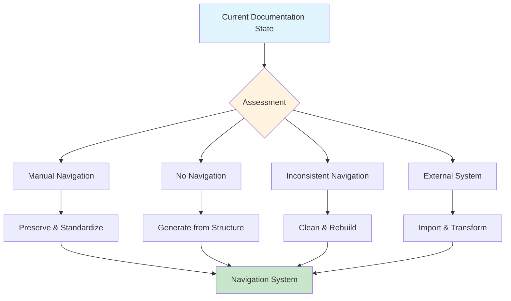

i# Documentation Navigation Migration Guide

## Overview

This comprehensive migration guide provides detailed procedures for migrating existing documentation to the navigation system, handling future structural changes, and managing documentation evolution while maintaining navigation integrity.

## Migration Strategies

### Migration Approach Matrix



### Migration Complexity Assessment

| Current State | Complexity | Time Estimate | Risk Level | Strategy |
|---------------|------------|---------------|------------|----------|
| **No Navigation** | Low | 1-2 days | Low | Generate from directory structure |
| **Manual Navigation** | Medium | 3-5 days | Medium | Preserve content, standardize format |
| **Inconsistent Navigation** | High | 1-2 weeks | Medium | Clean up, rebuild systematically |
| **External System** | Very High | 2-4 weeks | High | Import, transform, validate extensively |

## Pre-Migration Assessment

### Documentation Audit

**Automated Assessment:**
```bash
# Run comprehensive documentation audit
mix docs.nav.audit --comprehensive > migration-assessment.md

# Analyze current navigation patterns
mix docs.nav.audit --existing-patterns > current-patterns.md

# Identify potential migration issues
mix docs.nav.audit --migration-risks > migration-risks.md

# Generate migration plan
mix docs.nav.migration-plan --auto-generate > proposed-migration-plan.md
```

**Manual Assessment Checklist:**
- [ ] Document current navigation approach
- [ ] Identify all documentation locations
- [ ] Catalog existing cross-references
- [ ] List external documentation dependencies
- [ ] Assess team workflow integration points
- [ ] Document current maintenance procedures
- [ ] Identify stakeholders and communication needs

### Current State Documentation

**Create Migration Baseline:**
```bash
# Document current state
echo "# Pre-Migration Documentation State" > migration-baseline.md
echo "**Assessment Date**: $(date)" >> migration-baseline.md
echo "" >> migration-baseline.md

# Directory structure snapshot
echo "## Directory Structure" >> migration-baseline.md
tree docs/ >> migration-baseline.md

# Existing navigation analysis
echo "## Current Navigation Patterns" >> migration-baseline.md
find docs -name "*.md" -exec grep -l "Table of Contents\|Navigation\|Index" {} \; >> migration-baseline.md

# Link analysis
echo "## Existing Cross-References" >> migration-baseline.md
find docs -name "*.md" -exec grep -o "\[.*\](.*\.md.*)" {} \; | sort | uniq >> migration-baseline.md
```

## Migration Procedures

### Scenario 1: No Existing Navigation

**Characteristics:**
- Documentation exists but lacks navigation structure
- README files may be missing or minimal
- No consistent cross-referencing

**Migration Steps:**

#### Step 1: Backup and Prepare
```bash
# Create comprehensive backup
cp -r docs docs_backup_no_nav_$(date +%Y%m%d_%H%M%S)

# Initialize navigation system
mix docs.nav.config init --template=basic

# Create initial configuration
mix docs.nav.config update --auto-detect-structure
```

#### Step 2: Generate Base Navigation
```bash
# Generate navigation from directory structure
mix docs.nav.generate --from-structure --comprehensive

# Create missing README files
mix docs.nav.create-missing --readme-files

# Validate initial generation
mix docs.nav.validate --initial-generation
```

#### Step 3: Content Integration
```bash
# Analyze existing content for descriptions
mix docs.nav.analyze --extract-descriptions

# Update navigation with extracted content
mix docs.nav.update --integrate-existing-content

# Validate content integration
mix docs.nav.validate --content-integration
```

#### Step 4: Refinement
```bash
# Manual review and refinement phase
# Edit generated descriptions and key document selections

# Final validation
mix docs.nav.validate --comprehensive --strict

# Generate migration report
mix docs.nav.migration-report --scenario=no-existing-nav
```

### Scenario 2: Manual Navigation Exists

**Characteristics:**
- Existing manual navigation in various formats
- Inconsistent styling and structure
- Some cross-referencing already in place

**Migration Steps:**

#### Step 1: Preserve Existing Content
```bash
# Backup with content preservation analysis
mix docs.nav.backup --preserve-navigation-content

# Analyze existing navigation patterns
mix docs.nav.analyze --existing-navigation > existing-nav-analysis.md

# Extract useful navigation content
mix docs.nav.extract --manual-navigation > extracted-content.json
```

#### Step 2: Transform to Standard Format
```bash
# Convert existing navigation to standard format
mix docs.nav.transform --from-manual --preserve-content

# Apply HTML comment markers
mix docs.nav.migrate --add-markers --preserve-existing

# Standardize format while preserving content
mix docs.nav.standardize --preserve-descriptions
```

#### Step 3: Enhance and Validate
```bash
# Enhance navigation with missing elements
mix docs.nav.enhance --add-missing-sections

# Validate transformation results
mix docs.nav.validate --transformation --detailed

# Manual review phase for content accuracy
# Review and adjust generated navigation sections
```

#### Step 4: Finalization
```bash
# Final comprehensive validation
mix docs.nav.validate --comprehensive --strict

# Generate detailed migration report
mix docs.nav.migration-report --scenario=manual-to-automated --detailed
```

### Scenario 3: Inconsistent Navigation

**Characteristics:**
- Navigation exists but varies significantly between sections
- Mixed formats and standards
- Potential broken links and outdated references

**Migration Steps:**

#### Step 1: Comprehensive Analysis
```bash
# Analyze inconsistencies
mix docs.nav.analyze --inconsistencies --detailed > inconsistency-report.md

# Identify broken links
mix docs.nav.validate --check-links --report-broken > broken-links.md

# Catalog different navigation styles
mix docs.nav.catalog --navigation-styles > style-catalog.md
```

#### Step 2: Clean and Standardize
```bash
# Clean up existing navigation
mix docs.nav.clean --remove-inconsistent --backup

# Rebuild from scratch with content preservation
mix docs.nav.rebuild --preserve-content --standardize

# Apply consistent formatting
mix docs.nav.format --standardize-all
```

#### Step 3: Comprehensive Validation
```bash
# Validate all links and references
mix docs.nav.validate --comprehensive --fix-broken-links

# Check for content loss during migration
mix docs.nav.validate --content-preservation

# Performance validation for large documentation sets
mix docs.nav.validate --performance --optimization
```

#### Step 4: Team Review and Approval
```bash
# Generate review documentation
mix docs.nav.review-package --before-after-comparison

# Create team review checklist
mix docs.nav.generate-review-checklist > team-review.md

# Final approval and deployment
mix docs.nav.deploy --team-approved
```

### Scenario 4: External System Migration

**Characteristics:**
- Documentation managed in external systems (GitBook, Confluence, etc.)
- May require format conversion
- Complex linking and reference structures

**Migration Steps:**

#### Step 1: Export and Import
```bash
# Export from external system (varies by system)
# GitBook example:
mix docs.nav.import --from-gitbook --export-path=/path/to/gitbook-export

# Confluence example:
mix docs.nav.import --from-confluence --space-key=DEV --credentials-file=confluence-creds.json

# Generic markdown import:
mix docs.nav.import --from-markdown --source-dir=/path/to/external-docs
```

#### Step 2: Structure Transformation
```bash
# Transform external structure to docs/ organization
mix docs.nav.transform --external-to-internal --map-structure

# Convert external linking to relative paths
mix docs.nav.convert-links --external-to-relative

# Preserve external assets and resources
mix docs.nav.import-assets --from-external
```

#### Step 3: Content Adaptation
```bash
# Adapt content to internal standards
mix docs.nav.adapt --content-standards --format-conversion

# Generate navigation for imported content
mix docs.nav.generate --for-imported-content

# Validate import completeness
mix docs.nav.validate --import-completeness
```

#### Step 4: Integration Testing
```bash
# Comprehensive integration testing
mix docs.nav.test --integration --external-migration

# Performance testing with imported content
mix docs.nav.test --performance --imported-content

# User acceptance testing preparation
mix docs.nav.prepare-uat --external-migration
```

## Future Change Management

### Structural Change Procedures

#### Adding New Documentation Sections

**Procedure:**
```bash
# 1. Plan the new section
mix docs.nav.plan --new-section=tutorials --impact-analysis

# 2. Create section structure
mkdir -p docs/tutorials/{beginner,intermediate,advanced}

# 3. Create README files with navigation
mix docs.nav.create --section=tutorials --template=tutorial-section

# 4. Update parent navigation
mix docs.nav.update --parent-sections --new-child=tutorials

# 5. Validate integration
mix docs.nav.validate --new-section=tutorials --comprehensive
```

#### Reorganizing Existing Documentation

**Major Reorganization Procedure:**
```bash
# 1. Create reorganization plan
mix docs.nav.reorganize --plan --from=current-structure.json --to=target-structure.json

# 2. Backup current state
mix docs.nav.backup --reorganization --comprehensive

# 3. Execute reorganization in phases
mix docs.nav.reorganize --execute --phase=1  # Move content
mix docs.nav.reorganize --execute --phase=2  # Update navigation
mix docs.nav.reorganize --execute --phase=3  # Update cross-references

# 4. Validate each phase
mix docs.nav.validate --reorganization --phase=1
mix docs.nav.validate --reorganization --phase=2
mix docs.nav.validate --reorganization --phase=3

# 5. Final comprehensive validation
mix docs.nav.validate --comprehensive --reorganization-complete
```

#### Removing Documentation Sections

**Safe Removal Procedure:**
```bash
# 1. Analyze impact of removal
mix docs.nav.analyze --removal-impact --section=deprecated-section

# 2. Identify and update incoming links
mix docs.nav.update-links --remove-target=deprecated-section --redirect-to=alternative

# 3. Archive content before removal
mix docs.nav.archive --section=deprecated-section --location=archive/deprecated/

# 4. Remove section and update navigation
mix docs.nav.remove --section=deprecated-section --update-navigation

# 5. Validate removal completeness
mix docs.nav.validate --removal-verification --no-broken-links
```

### Version Migration

#### Documentation Format Updates

**When Navigation Standards Change:**
```bash
# 1. Assess current compliance with new standards
mix docs.nav.assess --new-standards=v2.0 --compliance-report

# 2. Generate migration plan for standards update
mix docs.nav.migration-plan --standards-update --from=v1.0 --to=v2.0

# 3. Execute standards migration
mix docs.nav.migrate --standards-update --version=v2.0 --backup

# 4. Validate standards compliance
mix docs.nav.validate --standards=v2.0 --comprehensive

# 5. Update team documentation and training
mix docs.nav.update-training --standards=v2.0
```

#### Tool Version Updates

**When Mix Tasks or Automation Changes:**
```bash
# 1. Backup before tool updates
mix docs.nav.backup --tool-update --version-tag=pre-v2.0

# 2. Update tools and dependencies
mix deps.update docs_nav
mix compile

# 3. Migrate configuration if needed
mix docs.nav.config migrate --from-version=v1.0 --to-version=v2.0

# 4. Test new tools with existing documentation
mix docs.nav.test --tool-compatibility --existing-docs

# 5. Update automation and CI/CD
# Update .github/workflows/documentation-navigation.yml with new tool versions
```

## Rollback Procedures

### Emergency Rollback

**When Migration Fails Critically:**
```bash
# 1. Immediate rollback to backup
cp -r docs_backup_$(ls -t | grep docs_backup | head -1)/* docs/

# 2. Restore git state if needed
git checkout HEAD~1 -- docs/  # Or specific commit

# 3. Verify rollback success
mix docs.nav.validate --rollback-verification

# 4. Document rollback reasons
echo "# Migration Rollback Report" > rollback-report.md
echo "**Date**: $(date)" >> rollback-report.md
echo "**Reason**: [Document specific failure reason]" >> rollback-report.md

# 5. Plan remediation
mix docs.nav.plan --remediation --from-rollback
```

### Partial Rollback

**When Some Sections Need Reverting:**
```bash
# 1. Identify problematic sections
mix docs.nav.identify --problems --section-level

# 2. Selective rollback
mix docs.nav.rollback --selective --sections=guides,operations --backup-date=20240115

# 3. Validate partial rollback
mix docs.nav.validate --partial-rollback --affected-sections

# 4. Fix issues with rolled-back sections
mix docs.nav.fix --selective --sections=guides,operations

# 5. Incremental re-migration
mix docs.nav.migrate --incremental --sections=guides,operations --lessons-learned
```

## Team Change Management

### Communication Strategy

#### Pre-Migration Communication

**Team Announcement Template:**
```markdown
# Documentation Navigation System Migration

## Overview
We're implementing a new standardized navigation system for our documentation to improve discoverability and maintenance.

## Timeline
- **Planning Phase**: Week 1-2
- **Migration Phase**: Week 3-4
- **Training Phase**: Week 5
- **Full Adoption**: Week 6

## Impact on Your Work
- [List specific impacts]
- [Training schedule]
- [Support resources]

## Migration Schedule
[Detailed schedule with milestones]

## Questions and Support
[Contact information and support channels]
```

#### During Migration Communication

**Daily Standup Updates:**
```bash
# Generate daily migration status
mix docs.nav.status --daily-report > daily-migration-status.md

# Include in team communications:
# - Sections migrated today
# - Issues encountered and resolved
# - Next day's plan
# - Support needs
```

#### Post-Migration Communication

**Success Communication:**
```bash
# Generate migration success report
mix docs.nav.success-report --comprehensive > migration-success.md

# Include:
# - Migration statistics
# - Before/after comparisons
# - Team feedback summary
# - Next steps and ongoing support
```

### Training and Support

#### Training Program Structure

**Week 1: System Overview**
- Introduction to navigation system
- Benefits and objectives
- High-level architecture overview

**Week 2: Hands-on Training**
- Mix task demonstrations
- Practice with sample documentation
- Q&A sessions

**Week 3: Advanced Features**
- CI/CD integration
- Troubleshooting procedures
- Performance optimization

**Week 4: Ongoing Support**
- Office hours for questions
- Peer mentoring setup
- Documentation of lessons learned

#### Support Resources

**Self-Service Resources:**
```bash
# Create comprehensive help system
mix docs.nav.create-help --interactive

# Generate FAQ from common issues
mix docs.nav.generate-faq --from-support-logs

# Create troubleshooting guide
mix docs.nav.create-troubleshooting --interactive
```

**Live Support:**
- Weekly office hours
- Slack/Teams support channel
- Escalation procedures for critical issues
- Pair programming sessions for complex cases

## Quality Assurance

### Migration Validation

#### Automated Validation
```bash
# Comprehensive migration validation suite
mix docs.nav.validate --migration-complete --comprehensive

# Performance validation
mix docs.nav.validate --performance --post-migration

# Content preservation validation
mix docs.nav.validate --content-preservation --detailed

# User experience validation
mix docs.nav.validate --user-experience --navigation-usability
```

#### Manual Validation Checklist

**Content Quality:**
- [ ] All original content preserved
- [ ] Navigation descriptions accurate and helpful
- [ ] Cross-references maintained and updated
- [ ] No broken links or missing references

**User Experience:**
- [ ] Navigation is intuitive and consistent
- [ ] Key documents are easily discoverable
- [ ] Breadcrumb navigation works correctly
- [ ] Search functionality intact

**Technical Quality:**
- [ ] All HTML markers properly placed
- [ ] Template format compliance verified
- [ ] CI/CD integration functioning
- [ ] Performance meets acceptance criteria

### Success Metrics

#### Quantitative Metrics
```bash
# Generate success metrics report
mix docs.nav.metrics --migration-success

# Key metrics to track:
# - Navigation compliance rate (target: >95%)
# - Link validity rate (target: >98%)
# - User satisfaction score (target: >4.0/5.0)
# - Documentation discovery time (target: <30s)
# - Maintenance effort reduction (target: >50%)
```

#### Qualitative Metrics
- Team satisfaction surveys
- User feedback collection
- Developer productivity assessment
- Documentation quality evaluation

## Continuous Improvement

### Post-Migration Review

#### 30-Day Review
```bash
# Generate 30-day post-migration report
mix docs.nav.review --30-day --comprehensive

# Focus areas:
# - User adoption and feedback
# - System performance and reliability
# - Issue resolution effectiveness
# - Training effectiveness
```

#### 90-Day Review
```bash
# Generate 90-day assessment
mix docs.nav.review --90-day --strategic

# Focus areas:
# - Long-term benefits realization
# - Process optimization opportunities
# - Tool enhancement needs
# - Expansion planning
```

### Iterative Improvements

#### Feedback Integration Process
```bash
# Collect and analyze feedback
mix docs.nav.feedback --collect --analyze > feedback-analysis.md

# Plan improvements based on feedback
mix docs.nav.improve --plan --from-feedback

# Implement improvements incrementally
mix docs.nav.improve --implement --incremental
```

#### System Evolution
- Regular standards review and updates
- Tool enhancement based on usage patterns
- Integration with new development tools
- Expansion to additional documentation types

## Related Documentation

- [Documentation Navigation Standards](documentation-navigation-standards.md) - Complete system standards
- [Navigation Implementation Guide](documentation-navigation-implementation.md) - Step-by-step implementation
- [Mix Tasks Implementation](documentation-navigation-mix-tasks.md) - Automation tools
- [Validation System](documentation-navigation-validation.md) - Quality assurance processes
- [CI/CD Integration](documentation-navigation-cicd.md) - Automated workflows
- [Cross-Reference Guide](../_meta/cross-reference-guide.md) - General linking standards

---

**This migration guide provides comprehensive procedures for successfully transitioning to and maintaining the documentation navigation system, ensuring smooth adoption and long-term success.**