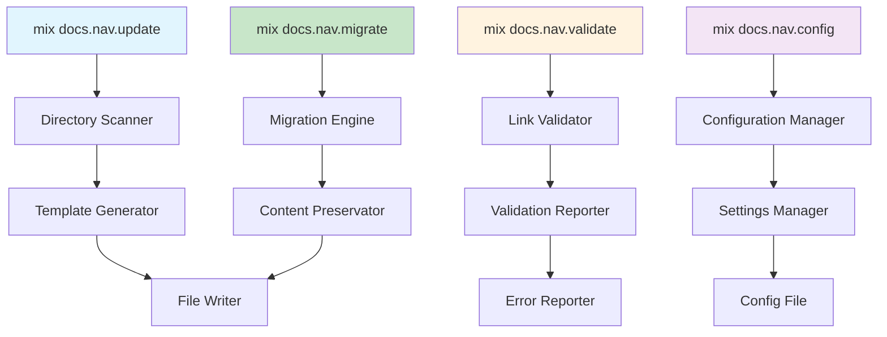

# Documentation Navigation Mix Tasks

## Overview

This document provides the complete implementation of Mix tasks for managing the documentation navigation system. These tasks automate the synchronization, validation, and maintenance of navigation sections across all README.md files in the `/docs/` directory.

## Mix Task Architecture

### Core Tasks



## Mix Task Implementation

### 1. Main Navigation Update Task

**File**: `lib/mix/tasks/docs/nav/update.ex`

```elixir
defmodule Mix.Tasks.Docs.Nav.Update do
  @moduledoc """
  Updates navigation sections in all README.md files within the /docs/ directory.
  
  This task scans the documentation directory structure and automatically
  generates or updates navigation sections in README.md files to match
  the actual directory structure.

  ## Usage

      mix docs.nav.update [options]

  ## Options

    * `--path` - Specific directory to process (default: docs/)
    * `--dry-run` - Preview changes without writing files
    * `--force` - Overwrite existing navigation sections
    * `--backup` - Create backup before making changes
    * `--config` - Path to custom configuration file
    * `--verbose` - Show detailed output

  ## Examples

      # Update all navigation sections
      mix docs.nav.update

      # Update specific directory with dry run
      mix docs.nav.update --path=docs/guides/ --dry-run

      # Force update with backup
      mix docs.nav.update --force --backup

  """

  use Mix.Task

  alias Mix.Tasks.Docs.Nav.{Scanner, Generator, Writer, ConfigManager}

  @shortdoc "Updates documentation navigation sections"

  def run(args) do
    {options, [], []} = OptionParser.parse(args,
      switches: [
        path: :string,
        dry_run: :boolean,
        force: :boolean,
        backup: :boolean,
        config: :string,
        verbose: :boolean
      ]
    )

    config = ConfigManager.load_config(options[:config])
    base_path = Path.expand(options[:path] || "docs")

    if options[:verbose] do
      Mix.shell().info("Starting navigation update...")
      Mix.shell().info("Base path: #{base_path}")
    end

    # Create backup if requested
    if options[:backup] do
      create_backup(base_path, options[:verbose])
    end

    # Scan directory structure
    directory_tree = Scanner.scan_directory(base_path, config)
    
    if options[:verbose] do
      Mix.shell().info("Found #{length(directory_tree)} directories to process")
    end

    # Process each directory
    results = Enum.map(directory_tree, fn dir_info ->
      process_directory(dir_info, options, config)
    end)

    # Report results
    report_results(results, options[:verbose])
  end

  defp process_directory(dir_info, options, config) do
    readme_path = Path.join(dir_info.path, "README.md")
    
    cond do
      not File.exists?(readme_path) ->
        if options[:verbose] do
          Mix.shell().info("Skipping #{dir_info.path} - no README.md found")
        end
        {:skipped, dir_info.path, "No README.md"}

      has_navigation_section?(readme_path) and not options[:force] ->
        if options[:verbose] do
          Mix.shell().info("Updating existing navigation in #{readme_path}")
        end
        update_existing_navigation(readme_path, dir_info, options, config)

      true ->
        if options[:verbose] do
          Mix.shell().info("Creating new navigation in #{readme_path}")
        end
        create_new_navigation(readme_path, dir_info, options, config)
    end
  end

  defp has_navigation_section?(file_path) do
    content = File.read!(file_path)
    String.contains?(content, "<!-- NAV_START -->") and 
    String.contains?(content, "<!-- NAV_END -->")
  end

  defp update_existing_navigation(file_path, dir_info, options, config) do
    content = File.read!(file_path)
    navigation_content = Generator.generate_navigation(dir_info, config)
    
    new_content = String.replace(content, 
      ~r/<!-- NAV_START -->.*?<!-- NAV_END -->/s,
      "<!-- NAV_START -->\n#{navigation_content}\n<!-- NAV_END -->"
    )

    if options[:dry_run] do
      Mix.shell().info("Would update navigation in #{file_path}")
      {:dry_run, file_path, "Updated navigation"}
    else
      Writer.write_file(file_path, new_content)
      {:updated, file_path, "Navigation updated"}
    end
  end

  defp create_new_navigation(file_path, dir_info, options, config) do
    content = File.read!(file_path)
    navigation_content = Generator.generate_navigation(dir_info, config)
    
    # Insert navigation after title and description
    new_content = insert_navigation_section(content, navigation_content)

    if options[:dry_run] do
      Mix.shell().info("Would add navigation to #{file_path}")
      {:dry_run, file_path, "Added navigation"}
    else
      Writer.write_file(file_path, new_content)
      {:created, file_path, "Navigation added"}
    end
  end

  defp insert_navigation_section(content, navigation_content) do
    lines = String.split(content, "\n")
    
    # Find insertion point (after title and first paragraph)
    insertion_point = find_insertion_point(lines)
    
    nav_section = [
      "",
      "<!-- NAV_START -->",
      navigation_content,
      "<!-- NAV_END -->",
      ""
    ]

    {before, after} = Enum.split(lines, insertion_point)
    
    (before ++ nav_section ++ after)
    |> Enum.join("\n")
  end

  defp find_insertion_point(lines) do
    # Look for first empty line after title, or after first paragraph
    title_found = false
    paragraph_end = false
    
    Enum.reduce_while(Enum.with_index(lines), 0, fn {line, index}, _acc ->
      cond do
        String.starts_with?(line, "# ") and not title_found ->
          {:cont, index + 1}
        
        String.trim(line) == "" and index > 0 ->
          if paragraph_end do
            {:halt, index}
          else
            {:cont, index}
          end
        
        true ->
          {:cont, index + 1}
      end
    end)
  end

  defp create_backup(base_path, verbose) do
    timestamp = DateTime.utc_now() |> DateTime.to_unix()
    backup_path = "#{base_path}_backup_#{timestamp}"
    
    if verbose do
      Mix.shell().info("Creating backup at #{backup_path}")
    end
    
    File.cp_r!(base_path, backup_path)
  end

  defp report_results(results, verbose) do
    summary = Enum.reduce(results, %{}, fn {status, _path, _msg}, acc ->
      Map.update(acc, status, 1, &(&1 + 1))
    end)

    Mix.shell().info("\nNavigation update complete:")
    Enum.each(summary, fn {status, count} ->
      Mix.shell().info("  #{String.capitalize(to_string(status))}: #{count}")
    end)

    if verbose do
      Mix.shell().info("\nDetailed results:")
      Enum.each(results, fn {status, path, message} ->
        Mix.shell().info("  [#{String.upcase(to_string(status))}] #{path}: #{message}")
      end)
    end
  end
end
```

### 2. Navigation Validation Task

**File**: `lib/mix/tasks/docs/nav/validate.ex`

```elixir
defmodule Mix.Tasks.Docs.Nav.Validate do
  @moduledoc """
  Validates documentation navigation sections and links.
  
  This task checks all README.md files in the /docs/ directory to ensure:
  - Navigation sections exist and follow the standard format
  - All navigation links point to existing files and directories
  - Navigation content is synchronized with actual directory structure
  - HTML comment markers are properly placed

  ## Usage

      mix docs.nav.validate [options]

  ## Options

    * `--path` - Specific directory to validate (default: docs/)
    * `--fix-links` - Attempt to fix broken links automatically
    * `--strict` - Enable strict validation mode
    * `--format` - Output format (text, json, markdown)
    * `--verbose` - Show detailed validation results

  ## Examples

      # Validate all navigation sections
      mix docs.nav.validate

      # Validate specific directory with fixes
      mix docs.nav.validate --path=docs/guides/ --fix-links

      # Strict validation with JSON output
      mix docs.nav.validate --strict --format=json

  """

  use Mix.Task

  alias Mix.Tasks.Docs.Nav.{Scanner, Validator, Reporter}

  @shortdoc "Validates documentation navigation sections"

  def run(args) do
    {options, [], []} = OptionParser.parse(args,
      switches: [
        path: :string,
        fix_links: :boolean,
        strict: :boolean,
        format: :string,
        verbose: :boolean
      ]
    )

    base_path = Path.expand(options[:path] || "docs")
    format = options[:format] || "text"

    if options[:verbose] do
      Mix.shell().info("Starting navigation validation...")
      Mix.shell().info("Base path: #{base_path}")
      Mix.shell().info("Validation mode: #{if options[:strict], do: "strict", else: "standard"}")
    end

    # Scan and validate all README files
    validation_results = Scanner.scan_directory(base_path)
    |> Enum.map(&validate_directory(&1, options))
    |> List.flatten()

    # Apply fixes if requested
    if options[:fix_links] do
      fixed_results = apply_fixes(validation_results, options[:verbose])
      validation_results = validation_results ++ fixed_results
    end

    # Generate report
    Reporter.generate_report(validation_results, format, options[:verbose])

    # Exit with error code if validation failures found
    if has_failures?(validation_results) do
      System.halt(1)
    end
  end

  defp validate_directory(dir_info, options) do
    readme_path = Path.join(dir_info.path, "README.md")
    
    if File.exists?(readme_path) do
      Validator.validate_file(readme_path, dir_info, options)
    else
      [{:error, readme_path, "README.md file not found"}]
    end
  end

  defp apply_fixes(results, verbose) do
    if verbose do
      Mix.shell().info("Attempting to fix broken links...")
    end

    # Implementation for fixing common link issues
    # This would analyze broken links and attempt repairs
    []
  end

  defp has_failures?(results) do
    Enum.any?(results, fn {status, _path, _message} ->
      status in [:error, :warning]
    end)
  end
end
```

### 3. Migration Task

**File**: `lib/mix/tasks/docs/nav/migrate.ex`

```elixir
defmodule Mix.Tasks.Docs.Nav.Migrate do
  @moduledoc """
  Migrates existing documentation files to use the new navigation system.
  
  This task analyzes existing README.md files and adds standardized
  navigation sections while preserving existing content.

  ## Usage

      mix docs.nav.migrate [options]

  ## Options

    * `--path` - Specific directory to migrate (default: docs/)
    * `--dry-run` - Preview migration without making changes
    * `--backup` - Create backup before migration
    * `--add-markers` - Add HTML comment markers to existing content
    * `--config` - Path to custom configuration file
    * `--verbose` - Show detailed migration progress

  ## Examples

      # Migrate all documentation files
      mix docs.nav.migrate --backup

      # Dry run migration for specific directory
      mix docs.nav.migrate --path=docs/guides/ --dry-run

      # Add markers to existing navigation content
      mix docs.nav.migrate --add-markers

  """

  use Mix.Task

  alias Mix.Tasks.Docs.Nav.{Scanner, Migrator, ConfigManager}

  @shortdoc "Migrates existing documentation to navigation system"

  def run(args) do
    {options, [], []} = OptionParser.parse(args,
      switches: [
        path: :string,
        dry_run: :boolean,
        backup: :boolean,
        add_markers: :boolean,
        config: :string,
        verbose: :boolean
      ]
    )

    config = ConfigManager.load_config(options[:config])
    base_path = Path.expand(options[:path] || "docs")

    if options[:verbose] do
      Mix.shell().info("Starting documentation migration...")
      Mix.shell().info("Base path: #{base_path}")
    end

    # Create backup if requested
    if options[:backup] do
      create_migration_backup(base_path, options[:verbose])
    end

    # Scan existing structure
    migration_plan = Scanner.scan_for_migration(base_path)
    
    if options[:verbose] do
      Mix.shell().info("Found #{length(migration_plan)} files to migrate")
    end

    # Execute migration
    results = Enum.map(migration_plan, fn file_info ->
      migrate_file(file_info, options, config)
    end)

    # Report migration results
    report_migration_results(results, options[:verbose])
  end

  defp migrate_file(file_info, options, config) do
    if options[:add_markers] do
      Migrator.add_navigation_markers(file_info, options)
    else
      Migrator.migrate_to_new_format(file_info, options, config)
    end
  end

  defp create_migration_backup(base_path, verbose) do
    timestamp = DateTime.utc_now() |> DateTime.to_unix()
    backup_path = "#{base_path}_migration_backup_#{timestamp}"
    
    if verbose do
      Mix.shell().info("Creating migration backup at #{backup_path}")
    end
    
    File.cp_r!(base_path, backup_path)
  end

  defp report_migration_results(results, verbose) do
    summary = Enum.reduce(results, %{}, fn {status, _path, _msg}, acc ->
      Map.update(acc, status, 1, &(&1 + 1))
    end)

    Mix.shell().info("\nMigration complete:")
    Enum.each(summary, fn {status, count} ->
      Mix.shell().info("  #{String.capitalize(to_string(status))}: #{count}")
    end)

    if verbose do
      Mix.shell().info("\nDetailed migration results:")
      Enum.each(results, fn {status, path, message} ->
        Mix.shell().info("  [#{String.upcase(to_string(status))}] #{path}: #{message}")
      end)
    end
  end
end
```

### 4. Configuration Management Task

**File**: `lib/mix/tasks/docs/nav/config.ex`

```elixir
defmodule Mix.Tasks.Docs.Nav.Config do
  @moduledoc """
  Manages configuration for the documentation navigation system.
  
  This task helps create, update, and validate configuration files
  used by the navigation system.

  ## Usage

      mix docs.nav.config [command] [options]

  ## Commands

    * `init` - Create initial configuration file
    * `update` - Update existing configuration
    * `validate` - Validate configuration file
    * `show` - Display current configuration

  ## Options

    * `--config` - Path to configuration file
    * `--template` - Configuration template to use
    * `--verbose` - Show detailed output

  ## Examples

      # Create initial configuration
      mix docs.nav.config init

      # Validate configuration
      mix docs.nav.config validate --config=.navigation-config.yml

      # Show current configuration
      mix docs.nav.config show --verbose

  """

  use Mix.Task

  alias Mix.Tasks.Docs.Nav.ConfigManager

  @shortdoc "Manages documentation navigation configuration"

  def run([command | args]) do
    {options, [], []} = OptionParser.parse(args,
      switches: [
        config: :string,
        template: :string,
        verbose: :boolean
      ]
    )

    case command do
      "init" -> init_config(options)
      "update" -> update_config(options)
      "validate" -> validate_config(options)
      "show" -> show_config(options)
      _ -> show_help()
    end
  end

  def run([]) do
    show_help()
  end

  defp init_config(options) do
    config_path = options[:config] || ".navigation-config.yml"
    template = options[:template] || "default"
    
    if File.exists?(config_path) do
      Mix.shell().error("Configuration file already exists at #{config_path}")
      System.halt(1)
    end

    Mix.shell().info("Creating configuration file at #{config_path}")
    ConfigManager.create_config_file(config_path, template)
    Mix.shell().info("Configuration file created successfully")
  end

  defp update_config(options) do
    config_path = options[:config] || ".navigation-config.yml"
    
    unless File.exists?(config_path) do
      Mix.shell().error("Configuration file not found at #{config_path}")
      System.halt(1)
    end

    Mix.shell().info("Updating configuration file at #{config_path}")
    ConfigManager.update_config_file(config_path)
    Mix.shell().info("Configuration file updated successfully")
  end

  defp validate_config(options) do
    config_path = options[:config] || ".navigation-config.yml"
    
    case ConfigManager.validate_config_file(config_path) do
      {:ok, _config} ->
        Mix.shell().info("Configuration file is valid")
      {:error, errors} ->
        Mix.shell().error("Configuration validation failed:")
        Enum.each(errors, &Mix.shell().error("  - #{&1}"))
        System.halt(1)
    end
  end

  defp show_config(options) do
    config_path = options[:config] || ".navigation-config.yml"
    config = ConfigManager.load_config(config_path)
    
    if options[:verbose] do
      Mix.shell().info("Configuration from #{config_path}:")
      ConfigManager.print_config(config)
    else
      ConfigManager.print_config_summary(config)
    end
  end

  defp show_help do
    Mix.shell().info("""
    Usage: mix docs.nav.config [command] [options]
    
    Commands:
      init      Create initial configuration file
      update    Update existing configuration
      validate  Validate configuration file
      show      Display current configuration
    
    Run 'mix help docs.nav.config' for detailed information.
    """)
  end
end
```

## Supporting Modules

### Directory Scanner Module

**File**: `lib/mix/tasks/docs/nav/scanner.ex`

```elixir
defmodule Mix.Tasks.Docs.Nav.Scanner do
  @moduledoc """
  Scans directory structure to analyze documentation organization.
  """

  @doc """
  Scans a directory and returns information about its structure.
  """
  def scan_directory(base_path, config \\ %{}) do
    base_path
    |> find_all_directories()
    |> Enum.map(&analyze_directory(&1, config))
    |> Enum.filter(&has_content?/1)
  end

  @doc """
  Scans directories specifically for migration analysis.
  """
  def scan_for_migration(base_path) do
    base_path
    |> find_readme_files()
    |> Enum.map(&analyze_file_for_migration/1)
  end

  defp find_all_directories(base_path) do
    base_path
    |> File.ls!()
    |> Enum.map(&Path.join(base_path, &1))
    |> Enum.filter(&File.dir?/1)
    |> Enum.reject(&hidden_directory?/1)
  end

  defp find_readme_files(base_path) do
    Path.wildcard(Path.join([base_path, "**", "README.md"]))
  end

  defp analyze_directory(dir_path, config) do
    subdirectories = find_subdirectories(dir_path)
    key_files = find_key_files(dir_path)
    
    %{
      path: dir_path,
      name: Path.basename(dir_path),
      subdirectories: subdirectories,
      key_files: key_files,
      description: get_directory_description(dir_path, config),
      has_readme: File.exists?(Path.join(dir_path, "README.md"))
    }
  end

  defp find_subdirectories(dir_path) do
    dir_path
    |> File.ls!()
    |> Enum.map(&Path.join(dir_path, &1))
    |> Enum.filter(&File.dir?/1)
    |> Enum.reject(&hidden_directory?/1)
    |> Enum.map(&Path.basename/1)
    |> Enum.sort()
  end

  defp find_key_files(dir_path) do
    dir_path
    |> File.ls!()
    |> Enum.filter(&String.ends_with?(&1, ".md"))
    |> Enum.reject(&(&1 == "README.md"))
    |> Enum.sort()
    |> Enum.take(3) # Limit to top 3 files
  end

  defp get_directory_description(dir_path, config) do
    dir_name = Path.basename(dir_path)
    
    # Check for custom description in config
    case Map.get(config, :directory_descriptions, %{}) do
      descriptions when is_map(descriptions) ->
        Map.get(descriptions, dir_name, generate_default_description(dir_name))
      _ ->
        generate_default_description(dir_name)
    end
  end

  defp generate_default_description(dir_name) do
    case dir_name do
      "guides" -> "Step-by-step implementation and best practice guides"
      "reference" -> "Quick reference materials and API documentation"
      "architecture" -> "Architectural decisions and system design documentation"
      "operations" -> "Deployment, monitoring, and maintenance procedures"
      "core" -> "Essential system architecture and design documentation"
      "_meta" -> "Documentation system metadata and maintenance procedures"
      _ -> "Documentation for #{String.replace(dir_name, "_", " ")}"
    end
  end

  defp analyze_file_for_migration(file_path) do
    content = File.read!(file_path)
    
    %{
      path: file_path,
      has_navigation_markers: has_navigation_markers?(content),
      has_navigation_content: has_navigation_content?(content),
      needs_migration: needs_migration?(content)
    }
  end

  defp has_navigation_markers?(content) do
    String.contains?(content, "<!-- NAV_START -->") and 
    String.contains?(content, "<!-- NAV_END -->")
  end

  defp has_navigation_content?(content) do
    String.contains?(content, "## Navigation") or
    String.contains?(content, "## Contents")
  end

  defp needs_migration?(content) do
    not has_navigation_markers?(content)
  end

  defp hidden_directory?(path) do
    basename = Path.basename(path)
    String.starts_with?(basename, ".") or basename in ["node_modules", "_build"]
  end

  defp has_content?(dir_info) do
    dir_info.has_readme or length(dir_info.subdirectories) > 0
  end
end
```

### Navigation Generator Module

**File**: `lib/mix/tasks/docs/nav/generator.ex`

```elixir
defmodule Mix.Tasks.Docs.Nav.Generator do
  @moduledoc """
  Generates navigation content for documentation files.
  """

  @doc """
  Generates navigation section content for a directory.
  """
  def generate_navigation(dir_info, config \\ %{}) do
    [
      "## Navigation",
      "",
      generate_breadcrumb(dir_info),
      "",
      generate_subdirectories_section(dir_info),
      "",
      generate_quick_links_section(dir_info),
      "",
      generate_related_documentation_section(dir_info, config)
    ]
    |> Enum.join("\n")
  end

  defp generate_breadcrumb(dir_info) do
    path_parts = dir_info.path |> Path.split() |> tl() # Remove root
    
    breadcrumb_links = path_parts
    |> Enum.with_index()
    |> Enum.map(fn {part, index} ->
      back_levels = length(path_parts) - index - 1
      back_path = String.duplicate("../", back_levels) <> "README.md"
      "[#{format_breadcrumb_name(part)}](#{back_path})"
    end)
    |> Enum.join(" > ")

    "**Current Location**: #{breadcrumb_links}"
  end

  defp generate_subdirectories_section(dir_info) do
    if length(dir_info.subdirectories) > 0 do
      [
        "### Subdirectories",
        "",
        "| Directory | Description | Key Documents |",
        "|-----------|-------------|---------------|"
      ] ++ 
      Enum.map(dir_info.subdirectories, &generate_subdirectory_row(&1, dir_info))
      |> Enum.join("\n")
    else
      "### Subdirectories\n\n*No subdirectories in this section.*"
    end
  end

  defp generate_subdirectory_row(subdir, dir_info) do
    subdir_path = Path.join(dir_info.path, subdir)
    key_files = find_key_files_in_subdir(subdir_path)
    key_files_links = format_key_files_links(key_files, subdir)
    description = get_subdirectory_description(subdir)
    
    "| [`#{subdir}/`](#{subdir}/) | #{description} | #{key_files_links} |"
  end

  defp find_key_files_in_subdir(subdir_path) do
    if File.dir?(subdir_path) do
      subdir_path
      |> File.ls!()
      |> Enum.filter(&String.ends_with?(&1, ".md"))
      |> Enum.reject(&(&1 == "README.md"))
      |> Enum.sort()
      |> Enum.take(3)
    else
      []
    end
  end

  defp format_key_files_links(files, subdir) do
    files
    |> Enum.map(fn file ->
      title = format_file_title(file)
      "[#{title}](#{subdir}/#{file})"
    end)
    |> Enum.join(", ")
    |> case do
      "" -> "*No key documents*"
      links -> links
    end
  end

  defp generate_quick_links_section(dir_info) do
    parent_path = determine_parent_path(dir_info.path)
    home_path = determine_home_path(dir_info.path)
    
    [
      "### Quick Links",
      "",
      "- **📚 [Parent Directory](#{parent_path})** - Return to parent level",
      "- **🏠 [Documentation Home](#{home_path})** - Main documentation index",
      "- **🔍 [Search Documentation](#{determine_search_path(dir_info.path)})** - Find terms and concepts"
    ]
    |> Enum.join("\n")
  end

  defp generate_related_documentation_section(_dir_info, config) do
    base_links = [
      "- [Cross-Reference Guide](../_meta/cross-reference-guide.md) - Documentation linking standards",
      "- [Maintenance Process](../_meta/maintenance-process.md) - How to update documentation"
    ]
    
    custom_links = Map.get(config, :related_links, [])
    all_links = base_links ++ custom_links
    
    [
      "### Related Documentation",
      ""
    ] ++ all_links
    |> Enum.join("\n")
  end

  # Helper functions
  
  defp format_breadcrumb_name("docs"), do: "Home"
  defp format_breadcrumb_name(name), do: String.capitalize(String.replace(name, "_", " "))

  defp format_file_title(filename) do
    filename
    |> Path.rootname()
    |> String.replace(~r/[-_]/, " ")
    |> String.split()
    |> Enum.map(&String.capitalize/1)
    |> Enum.join(" ")
  end

  defp get_subdirectory_description(subdir) do
    # This could be enhanced to read from actual directory content
    case subdir do
      "guides" -> "Step-by-step implementation guides"
      "reference" -> "Quick reference materials"
      "architecture" -> "Architectural decisions and design"
      "operations" -> "Deployment and maintenance procedures"
      "core" -> "Essential system documentation"
      "_meta" -> "Documentation system metadata"
      _ -> "Documentation for #{String.replace(subdir, "_", " ")}"
    end
  end

  defp determine_parent_path(current_path) do
    current_path
    |> Path.split()
    |> length()
    |> case do
      1 -> "../README.md"  # Already at root
      _ -> "../README.md"
    end
  end

  defp determine_home_path(current_path) do
    depth = current_path |> Path.split() |> length() |> Kernel.-(1)
    String.duplicate("../", depth) <> "README.md"
  end

  defp determine_search_path(current_path) do
    depth = current_path |> Path.split() |> length() |> Kernel.-(1)
    String.duplicate("../", depth) <> "reference/glossary.md"
  end
end
```

## Configuration File Template

**File**: `docs/.navigation-config.yml`

```yaml
# Documentation Navigation System Configuration
# This file configures the automated navigation system for the /docs/ directory

# Directory descriptions override the default generated descriptions
directory_descriptions:
  _meta: "Documentation system metadata and maintenance procedures"
  core: "Essential system architecture and design documentation"
  guides: "Step-by-step implementation and best practice guides"
  operations: "Deployment, monitoring, and maintenance procedures"
  reference: "Quick reference materials and API documentation" 
  architecture: "Architectural decisions and system design documentation"

# Custom related documentation links to include in all navigation sections
related_links:
  - "[Documentation Standards](../guides/documentation-navigation-standards.md) - Navigation system standards"
  - "[Feature Documentation Workflow](../_meta/feature-documentation-workflow.md) - Documentation workflow integration"

# Navigation generation settings
navigation_settings:
  # Maximum number of key files to show per directory
  max_key_files: 3
  
  # Whether to include file modification dates
  include_dates: false
  
  # Whether to generate descriptions automatically from file content
  auto_generate_descriptions: true
  
  # Template to use for navigation sections
  template: "standard"

# Validation settings
validation_settings:
  # Whether to check external links
  check_external_links: false
  
  # Whether to validate anchor links
  validate_anchors: true
  
  # Maximum link depth to check
  max_link_depth: 3
  
  # Directories to exclude from validation
  exclude_directories:
    - "node_modules"
    - "_build"
    - ".git"

# CI/CD integration settings
ci_settings:
  # Whether to auto-commit navigation updates
  auto_commit: true
  
  # Commit message template for automatic updates
  commit_message: "docs: auto-update navigation sections"
  
  # Whether to create pull requests for navigation updates
  create_pull_requests: false
```

## Usage Examples

### Basic Navigation Update
```bash
# Update all navigation sections
mix docs.nav.update

# See what would be updated without making changes
mix docs.nav.update --dry-run --verbose
```

### Validation and Maintenance
```bash
# Validate all navigation sections
mix docs.nav.validate

# Validate with automatic link fixing
mix docs.nav.validate --fix-links --verbose
```

### Migration from Existing Documentation
```bash
# Migrate existing files with backup
mix docs.nav.migrate --backup --verbose

# Add HTML markers to existing navigation content
mix docs.nav.migrate --add-markers
```

### Configuration Management
```bash
# Create initial configuration
mix docs.nav.config init

# Validate current configuration
mix docs.nav.config validate --verbose
```

## Integration with Existing Workflow

The navigation Mix tasks integrate seamlessly with the existing feature branch workflow:

1. **Pre-commit Hook Integration**: Add navigation validation to existing git hooks
2. **CI/CD Pipeline Integration**: Include navigation checks in GitHub Actions/GitLab CI
3. **Documentation Workflow**: Integrate with existing documentation maintenance processes

## Related Documentation

- [Documentation Navigation Standards](documentation-navigation-standards.md) - Complete standards specification
- [Mix Tasks Implementation](../guides/mix-tasks-implementation.md) - Existing Mix task patterns
- [GitHub Actions Implementation](../guides/github-actions-implementation.md) - CI/CD integration
- [GitLab CI Implementation](../guides/gitlab-ci-implementation.md) - GitLab CI integration

---

**These Mix tasks provide a complete automation solution for maintaining consistent, synchronized documentation navigation across the entire `/docs/` directory structure.**