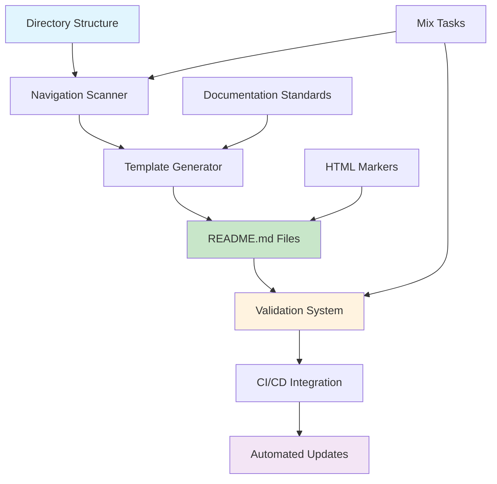

# Documentation Navigation Standards

## Overview

This document establishes the standards for implementing a comprehensive documentation navigation system across all `/docs/` directory README.md files. The system ensures consistent, automated navigation that stays synchronized with the actual directory structure.

## Navigation System Architecture

### Core Components



### System Objectives

1. **Consistency**: Every README.md file follows identical navigation format
2. **Automation**: Navigation sections update automatically when directory structure changes
3. **Synchronization**: Prevent drift between actual structure and navigation links
4. **Maintainability**: Clear processes for ongoing navigation management
5. **Validation**: Automated checking of navigation integrity and link validity

## Navigation Section Format

### Standard Template Structure

Every README.md file in the `/docs/` directory must include a standardized navigation section:

```markdown
# [Directory Title]

[Brief description of directory purpose]

<!-- NAV_START -->
## Navigation

**Current Location**: [Breadcrumb Path]

### Subdirectories

| Directory | Description | Key Documents |
|-----------|-------------|---------------|
| [`subdirectory1/`](subdirectory1/) | Purpose of subdirectory1 | [Key Doc 1](subdirectory1/key-doc.md), [Key Doc 2](subdirectory1/other-doc.md) |
| [`subdirectory2/`](subdirectory2/) | Purpose of subdirectory2 | [Important Guide](subdirectory2/guide.md) |

### Quick Links

- **📚 [Parent Directory](../README.md)** - Return to parent level
- **🏠 [Documentation Home](../README.md)** - Main documentation index
- **🔍 [Search Documentation](../reference/glossary.md)** - Find terms and concepts

### Related Documentation

- [Cross-Reference Guide](../_meta/cross-reference-guide.md) - Documentation linking standards
- [Maintenance Process](../_meta/maintenance-process.md) - How to update documentation
<!-- NAV_END -->

[Rest of document content...]
```

### Section Components

#### 1. Navigation Header
- **Required**: `## Navigation` heading
- **Purpose**: Clearly identifies the navigation section
- **Positioning**: Must be within HTML comment markers

#### 2. Current Location
- **Format**: `**Current Location**: [Breadcrumb Path]`
- **Example**: `**Current Location**: [Home](../README.md) > [Guides](../guides/README.md) > Branch Workflow`
- **Purpose**: Provides hierarchical context

#### 3. Subdirectories Table
- **Required Columns**: Directory, Description, Key Documents
- **Link Format**: Clickable directory names with descriptions
- **Key Documents**: Up to 3 most important files in each subdirectory

#### 4. Quick Links Section
- **Parent Directory**: Link to immediate parent README.md
- **Documentation Home**: Link to root docs/README.md
- **Search/Reference**: Link to glossary or search functionality

#### 5. Related Documentation
- **Cross-references**: Links to related documentation sections
- **Context-aware**: Relevant links based on directory purpose

## HTML Comment Markers

### Marker System
Use HTML comments to define navigation section boundaries:

```html
<!-- NAV_START -->
[Navigation content here]
<!-- NAV_END -->
```

### Marker Rules
1. **Required**: All navigation sections must be wrapped in these markers
2. **Exact Format**: Use exact text `NAV_START` and `NAV_END`
3. **Placement**: Markers must be on separate lines
4. **Content Preservation**: All content outside markers is preserved during updates
5. **Single Section**: Only one navigation section per file

## Positioning Requirements

### Standard Positioning
The navigation section should be positioned:

1. **After**: Main heading (`# Title`) and brief description
2. **Before**: Detailed content sections
3. **Within**: First 20% of document length
4. **Separate**: Clear visual separation from other content

### Example Document Structure
```markdown
# Document Title

Brief description of document purpose (1-2 paragraphs).

<!-- NAV_START -->
## Navigation
[Navigation content]
<!-- NAV_END -->

## Main Content Section 1
[Detailed content begins here]
```

## Directory Description Standards

### Description Requirements
- **Length**: 1-2 sentences maximum
- **Purpose-focused**: Clearly state what the directory contains
- **Action-oriented**: Use active voice
- **Consistent tone**: Professional, helpful language

### Description Templates

#### Feature Directories
```
Implementation guides and procedures for [feature/domain]
```

#### Reference Directories  
```
Quick reference materials and specifications for [topic]
```

#### Architecture Directories
```
Design decisions and architectural documentation for [system/component]
```

#### Operations Directories
```
Deployment, maintenance, and operational procedures for [environment/process]
```

### Custom Descriptions
For directories requiring custom descriptions, maintain a configuration file:

```yaml
# docs/.navigation-config.yml
directory_descriptions:
  _meta: "Documentation system metadata and maintenance procedures"
  core: "Essential system architecture and design documentation"
  guides: "Step-by-step implementation and best practice guides"
  operations: "Deployment, monitoring, and maintenance procedures"
  reference: "Quick reference materials and API documentation"
  architecture: "Architectural decisions and system design documentation"
```

## Key Documents Selection

### Selection Criteria
Choose up to 3 key documents per subdirectory based on:

1. **Frequency of Access**: Most commonly referenced files
2. **Entry Points**: Best starting documents for new readers
3. **Critical Information**: Essential procedures or references
4. **Recent Updates**: Recently modified or added content

### Link Format Standards
```markdown
[Document Title](path/to/document.md)
```

### Link Text Guidelines
- **Descriptive**: Use meaningful, descriptive text
- **Consistent**: Follow established naming patterns
- **Concise**: Avoid overly long link text
- **Context-aware**: Provide enough context without being verbose

## Automation System Specifications

### Mix Task Interface

#### Primary Commands
```bash
# Update all navigation sections
mix docs.nav.update

# Validate navigation integrity  
mix docs.nav.validate

# Migrate existing files to new format
mix docs.nav.migrate

# Generate navigation for specific directory
mix docs.nav.update --path=docs/guides/

# Dry run to preview changes
mix docs.nav.update --dry-run

# Force update ignoring existing content
mix docs.nav.update --force
```

#### Task Parameters
- `--path`: Specific directory to process
- `--dry-run`: Preview changes without applying
- `--force`: Overwrite existing navigation sections
- `--verbose`: Detailed output during processing
- `--config`: Custom configuration file path

### Automation Rules

#### Directory Scanning
1. **Recursive Processing**: Scan all subdirectories within `/docs/`
2. **README Detection**: Process only directories containing README.md
3. **Ignore Patterns**: Skip hidden directories and temporary files
4. **Structure Analysis**: Identify subdirectories and key files

#### Content Generation
1. **Template Application**: Apply standard navigation template
2. **Dynamic Content**: Generate descriptions and links automatically
3. **Preservation**: Maintain existing content outside navigation markers
4. **Validation**: Verify all generated links are valid

#### Error Handling
1. **Missing Files**: Report directories without README.md
2. **Broken Links**: Identify and report invalid links
3. **Format Errors**: Detect malformed navigation sections
4. **Backup Creation**: Create backups before major updates

## Validation Standards

### Link Validation Rules
1. **Existence Check**: All links must point to existing files/directories
2. **Relative Paths**: Use relative paths exclusively within docs/
3. **Anchor Validation**: Verify section anchors exist in target documents
4. **Case Sensitivity**: Ensure consistent case usage
5. **Extension Validation**: Confirm .md extensions for markdown files

### Navigation Completeness
1. **Required Sections**: All README.md files must have navigation sections
2. **Marker Presence**: HTML comment markers must be present and correct
3. **Content Standards**: Navigation content must follow template format
4. **Breadcrumb Accuracy**: Current location must reflect actual hierarchy

### Synchronization Checks
1. **Directory Mismatch**: Detect when navigation doesn't match actual directories
2. **Missing Directories**: Identify directories not listed in navigation
3. **Orphaned Links**: Find navigation links pointing to non-existent directories
4. **Description Updates**: Ensure descriptions reflect current directory content

## CI/CD Integration Requirements

### GitHub Actions Integration
```yaml
# .github/workflows/documentation-navigation.yml
name: Documentation Navigation

on:
  push:
    paths:
      - 'docs/**'
  pull_request:
    paths:
      - 'docs/**'

jobs:
  validate-navigation:
    runs-on: ubuntu-latest
    steps:
      - uses: actions/checkout@v3
      - name: Setup Elixir
        uses: erlef/setup-beam@v1
        with:
          elixir-version: '1.15.7'
          otp-version: '26.0'
      - name: Install dependencies
        run: mix deps.get
      - name: Validate navigation
        run: mix docs.nav.validate
      - name: Update navigation if needed
        run: mix docs.nav.update --dry-run
        
  auto-update-navigation:
    runs-on: ubuntu-latest
    if: github.event_name == 'push' && github.ref == 'refs/heads/main'
    steps:
      - uses: actions/checkout@v3
        with:
          token: ${{ secrets.GITHUB_TOKEN }}
      - name: Setup Elixir
        uses: erlef/setup-beam@v1
      - name: Update navigation
        run: mix docs.nav.update
      - name: Commit changes
        run: |
          git config --local user.email "action@github.com"
          git config --local user.name "GitHub Action"
          git add docs/
          git diff --staged --quiet || git commit -m "docs: auto-update navigation sections"
          git push
```

### GitLab CI Integration
```yaml
# .gitlab-ci.yml
documentation-navigation:
  stage: validate
  image: elixir:1.15.7
  before_script:
    - mix local.hex --force
    - mix local.rebar --force
    - mix deps.get
  script:
    - mix docs.nav.validate
  only:
    changes:
      - docs/**/*

auto-update-navigation:
  stage: deploy
  image: elixir:1.15.7
  before_script:
    - mix local.hex --force
    - mix local.rebar --force
    - mix deps.get
  script:
    - mix docs.nav.update
    - |
      if [ -n "$(git status --porcelain)" ]; then
        git config --global user.email "gitlab-ci@example.com"
        git config --global user.name "GitLab CI"
        git add docs/
        git commit -m "docs: auto-update navigation sections"
        git push https://oauth2:${CI_PUSH_TOKEN}@${CI_SERVER_HOST}/${CI_PROJECT_PATH}.git HEAD:${CI_COMMIT_REF_NAME}
      fi
  only:
    - main
  when: manual
```

### Pipeline Integration Points
1. **Pre-commit Hooks**: Validate navigation before commits
2. **Pull Request Checks**: Ensure navigation is synchronized
3. **Automated Updates**: Update navigation on directory structure changes
4. **Deployment Validation**: Verify navigation integrity before releases

## Migration Process

### Existing File Assessment
1. **Content Audit**: Review existing README.md files
2. **Navigation Detection**: Identify files with partial navigation
3. **Structure Analysis**: Map current directory organization
4. **Preservation Plan**: Identify content that must be preserved

### Migration Strategy
1. **Backup Creation**: Create full backup of docs/ directory
2. **Incremental Processing**: Migrate files in batches
3. **Validation**: Verify each migration step
4. **Testing**: Ensure all links work after migration

### Migration Commands
```bash
# Full migration with backup
mix docs.nav.migrate --backup

# Migrate specific directory
mix docs.nav.migrate --path=docs/guides/

# Preview migration changes
mix docs.nav.migrate --dry-run

# Migrate with custom config
mix docs.nav.migrate --config=.navigation-config.yml
```

## Maintenance Procedures

### Regular Maintenance Tasks
1. **Weekly**: Run navigation validation
2. **Monthly**: Review and update directory descriptions
3. **Quarterly**: Assess navigation effectiveness and user feedback
4. **After structural changes**: Update navigation immediately

### Maintenance Commands
```bash
# Weekly validation
mix docs.nav.validate --verbose

# Monthly description review
mix docs.nav.update --descriptions-only

# Quarterly full refresh
mix docs.nav.update --force --backup
```

### Quality Assurance
1. **Link Testing**: Automated link validation
2. **User Testing**: Manual navigation testing by team members
3. **Performance Monitoring**: Track navigation update performance
4. **Feedback Collection**: Gather user experience feedback

## Error Handling and Troubleshooting

### Common Issues
1. **Missing HTML Markers**: Navigation section boundaries not defined
2. **Broken Links**: Links pointing to non-existent files
3. **Format Inconsistencies**: Navigation not following template
4. **Synchronization Drift**: Navigation out of sync with directory structure

### Resolution Procedures
```bash
# Fix missing markers
mix docs.nav.migrate --add-markers

# Repair broken links
mix docs.nav.validate --fix-links

# Restore format consistency
mix docs.nav.update --force

# Resynchronize with directory structure
mix docs.nav.update --resync
```

### Recovery Procedures
1. **Backup Restoration**: Restore from automated backups
2. **Manual Intervention**: Hand-edit problematic files
3. **Fresh Generation**: Regenerate navigation from scratch
4. **Rollback**: Revert to previous working version

## Performance Considerations

### Optimization Strategies
1. **Incremental Updates**: Only update changed directories
2. **Caching**: Cache directory structure between runs
3. **Parallel Processing**: Process multiple directories simultaneously
4. **Selective Scanning**: Skip unchanged directories

### Performance Monitoring
- **Update Time**: Track time for full navigation updates
- **Validation Speed**: Monitor validation performance
- **File Size Impact**: Measure impact on repository size
- **CI/CD Performance**: Monitor pipeline execution time

## Security Considerations

### Content Security
1. **Input Validation**: Validate all directory names and file paths
2. **Path Traversal**: Prevent directory traversal attacks
3. **Content Sanitization**: Sanitize generated markdown content
4. **Permission Checks**: Verify file system permissions

### Automation Security
1. **CI/CD Tokens**: Secure storage of automation tokens
2. **Commit Signing**: Sign automated commits
3. **Access Control**: Limit automation permissions
4. **Audit Logging**: Log all automated changes

## Success Metrics

### Quantitative Metrics
- **Navigation Compliance**: Percentage of README.md files with proper navigation
- **Link Validity**: Percentage of working navigation links
- **Synchronization Rate**: Frequency of navigation-directory mismatches
- **Update Frequency**: How often navigation updates are needed

### Qualitative Metrics
- **User Satisfaction**: Developer feedback on navigation usefulness
- **Documentation Discoverability**: Ease of finding relevant documentation
- **Maintenance Burden**: Time spent on navigation maintenance
- **Adoption Rate**: Usage of automated navigation tools

## Related Documentation

- [Cross-Reference Guide](../_meta/cross-reference-guide.md) - Documentation linking standards
- [Maintenance Process](../_meta/maintenance-process.md) - General documentation maintenance
- [Naming Conventions](../_meta/naming-conventions.md) - File and directory naming standards
- [Feature Documentation Workflow](../_meta/feature-documentation-workflow.md) - Documentation workflow integration

---

**This navigation system ensures consistent, automated, and maintainable documentation navigation across the entire `/docs/` directory structure.**