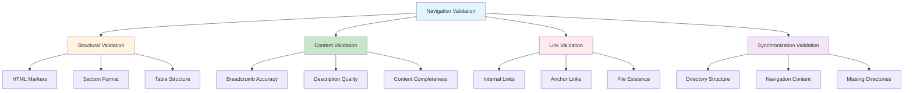
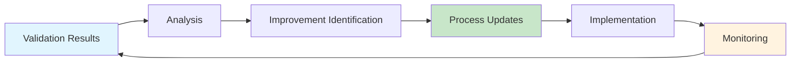

# Documentation Navigation Validation and Maintenance

## Overview

This document establishes comprehensive validation and maintenance processes for the documentation navigation system. It defines procedures for ensuring navigation integrity, link validity, and synchronization between directory structure and navigation content.

## Validation Framework

### Validation Types



### 1. Structural Validation

#### HTML Marker Validation
Ensures proper navigation section boundaries:

```bash
# Check for missing or malformed HTML markers
mix docs.nav.validate --check-markers

# Validation criteria:
# - Presence of <!-- NAV_START --> and <!-- NAV_END -->
# - Markers on separate lines
# - No additional text on marker lines
# - Only one navigation section per file
```

**Validation Rules:**
- **Required Markers**: Both `NAV_START` and `NAV_END` must be present
- **Marker Format**: Exact text without modifications
- **Placement**: Markers must be on separate lines
- **Uniqueness**: Only one navigation section per README.md file

#### Section Format Validation
Validates navigation section structure:

```bash
# Check navigation section format
mix docs.nav.validate --check-format

# Validation criteria:
# - Correct heading levels (## Navigation, ### Subsections)
# - Required sections present (Current Location, Subdirectories, Quick Links)
# - Table format compliance
# - Consistent emoji usage in Quick Links
```

**Format Requirements:**
- **Navigation Header**: Must be `## Navigation` (level 2)
- **Subsection Headers**: Must use level 3 (`###`)
- **Table Format**: Subdirectories table with 3 columns
- **Quick Links**: Must use standard emoji icons

### 2. Content Validation

#### Breadcrumb Accuracy Validation
Ensures breadcrumb navigation reflects actual hierarchy:

```bash
# Validate breadcrumb paths
mix docs.nav.validate --check-breadcrumbs

# Validation process:
# 1. Parse current file location
# 2. Calculate expected breadcrumb path
# 3. Compare with actual breadcrumb content
# 4. Report mismatches
```

**Breadcrumb Rules:**
- **Path Accuracy**: Must reflect actual directory hierarchy
- **Link Validity**: All breadcrumb links must point to existing files
- **Separator**: Use ` > ` (space-greater-than-space) between links
- **Current Location**: Last element should be plain text

#### Description Quality Validation
Validates directory and document descriptions:

```bash
# Check description quality
mix docs.nav.validate --check-descriptions

# Quality criteria:
# - Length appropriate (1-2 sentences)
# - No placeholder text
# - Consistent style and tone
# - Grammatically correct
```

**Description Standards:**
- **Length**: 1-2 sentences maximum
- **Clarity**: Clear, descriptive purpose statement
- **Consistency**: Consistent style across all descriptions
- **Accuracy**: Reflects actual directory/document content

### 3. Link Validation

#### Internal Link Validation
Comprehensive validation of all internal links:

```bash
# Validate all internal links
mix docs.nav.validate --check-links

# Link validation process:
# 1. Extract all markdown links from navigation sections
# 2. Resolve relative paths from current document location
# 3. Check file/directory existence
# 4. Validate anchor links within documents
# 5. Report broken or missing links
```

**Link Validation Rules:**
- **File Existence**: All linked files and directories must exist
- **Path Accuracy**: Relative paths must be correctly calculated
- **Anchor Validity**: Section anchors must exist in target documents
- **Link Format**: Proper markdown link syntax

#### Anchor Link Validation
Validates section anchor links within documents:

```bash
# Validate anchor links
mix docs.nav.validate --check-anchors

# Anchor validation:
# 1. Parse target documents for headings
# 2. Generate expected anchor names
# 3. Compare with actual anchor links
# 4. Report invalid anchors
```

### 4. Synchronization Validation

#### Directory Structure Synchronization
Ensures navigation reflects actual directory structure:

```bash
# Check directory synchronization
mix docs.nav.validate --check-sync

# Synchronization validation:
# 1. Scan actual directory structure
# 2. Parse navigation content
# 3. Identify missing directories in navigation
# 4. Identify navigation entries for non-existent directories
# 5. Report synchronization issues
```

**Synchronization Rules:**
- **Complete Coverage**: All subdirectories must be listed in navigation
- **No Orphans**: Navigation must not reference non-existent directories
- **Accurate Descriptions**: Directory descriptions must reflect actual content
- **Key Files**: Listed key files must exist and be relevant

## Validation Execution

### Manual Validation Commands

```bash
# Complete validation suite
mix docs.nav.validate

# Specific validation types
mix docs.nav.validate --check-markers
mix docs.nav.validate --check-format
mix docs.nav.validate --check-links
mix docs.nav.validate --check-sync

# Validation with automatic fixes
mix docs.nav.validate --fix-issues

# Verbose output with detailed reporting
mix docs.nav.validate --verbose

# JSON output for automation
mix docs.nav.validate --format=json
```

### Validation Configuration

**Configuration File**: `docs/.navigation-validation.yml`

```yaml
# Navigation validation configuration
validation_settings:
  # Enable/disable validation types
  check_markers: true
  check_format: true
  check_links: true
  check_anchors: true
  check_sync: true
  check_descriptions: true
  
  # Validation strictness levels
  strictness: "standard"  # options: lenient, standard, strict
  
  # Files and directories to exclude from validation
  exclude_files:
    - "README-template.md"
    - "DRAFT-*.md"
  
  exclude_directories:
    - "node_modules"
    - "_build"
    - ".git"
    - "tmp"
  
  # Link validation settings
  link_validation:
    check_external_links: false
    max_anchor_depth: 6
    timeout_seconds: 10
  
  # Description validation rules
  description_validation:
    min_length: 10
    max_length: 200
    require_punctuation: false
    check_spelling: false
  
  # Error reporting settings
  reporting:
    fail_on_warnings: false
    show_progress: true
    detailed_output: false
    max_errors_per_file: 20
```

## Maintenance Processes

### Scheduled Maintenance

#### Daily Maintenance
Automated daily checks via CI/CD:

```yaml
# .github/workflows/daily-nav-check.yml
name: Daily Navigation Check
on:
  schedule:
    - cron: '0 2 * * *'  # Run at 2 AM UTC daily

jobs:
  validate-navigation:
    runs-on: ubuntu-latest
    steps:
      - uses: actions/checkout@v3
      - name: Setup Elixir
        uses: erlef/setup-beam@v1
      - name: Validate navigation
        run: mix docs.nav.validate --format=json > validation-report.json
      - name: Upload report
        uses: actions/upload-artifact@v3
        with:
          name: daily-navigation-report
          path: validation-report.json
```

**Daily Maintenance Tasks:**
- Link validity checking
- Structural validation
- Synchronization verification
- Report generation and archiving

#### Weekly Maintenance
Comprehensive weekly review:

```bash
# Weekly maintenance script
#!/bin/bash
echo "Starting weekly navigation maintenance..."

# Full validation with detailed reporting
mix docs.nav.validate --verbose > weekly-validation-report.txt

# Update navigation sections if needed
mix docs.nav.update --dry-run > navigation-update-preview.txt

# Generate maintenance report
mix docs.nav.maintenance-report --week > weekly-maintenance-report.md

# Archive reports
mkdir -p reports/$(date +%Y-%m)
mv *.txt *.md reports/$(date +%Y-%m)/
```

**Weekly Maintenance Tasks:**
- Comprehensive validation
- Navigation update preview
- Performance analysis
- Maintenance report generation

#### Monthly Maintenance
Comprehensive monthly review and optimization:

```bash
# Monthly maintenance script
#!/bin/bash
echo "Starting monthly navigation maintenance..."

# Full system health check
mix docs.nav.health-check > monthly-health-report.txt

# Performance analysis
mix docs.nav.performance-analysis > performance-report.txt

# Usage analytics
mix docs.nav.analytics --month > usage-analytics.txt

# Optimization recommendations
mix docs.nav.optimize --recommendations > optimization-report.txt
```

**Monthly Maintenance Tasks:**
- System health assessment
- Performance optimization
- Usage analytics review
- Process improvement recommendations

### Maintenance Automation

#### Automatic Navigation Updates
Automated updates when directory structure changes:

```yaml
# .github/workflows/auto-nav-update.yml
name: Auto Navigation Update
on:
  push:
    paths:
      - 'docs/**'
    branches:
      - main

jobs:
  update-navigation:
    runs-on: ubuntu-latest
    steps:
      - uses: actions/checkout@v3
        with:
          token: ${{ secrets.GITHUB_TOKEN }}
      - name: Setup Elixir
        uses: erlef/setup-beam@v1
      - name: Update navigation
        run: |
          mix docs.nav.update --auto-mode
          if [ -n "$(git status --porcelain)" ]; then
            git config --local user.email "action@github.com"
            git config --local user.name "GitHub Action"
            git add docs/
            git commit -m "docs: auto-update navigation sections"
            git push
          fi
```

#### Link Monitoring
Continuous link health monitoring:

```bash
# Link monitoring service
mix docs.nav.monitor --continuous \
  --check-interval=1h \
  --alert-threshold=5 \
  --notification-webhook=$SLACK_WEBHOOK
```

## Error Handling and Reporting

### Error Classification

#### Critical Errors (Fail Build)
- **Missing HTML Markers**: Navigation sections without proper boundaries
- **Broken Internal Links**: Links to non-existent files or directories
- **Invalid Structure**: Malformed navigation sections
- **Synchronization Failure**: Major mismatches between structure and navigation

#### Warnings (Report Only)
- **Suboptimal Descriptions**: Descriptions that could be improved
- **Missing Key Files**: Key files that no longer exist
- **Format Inconsistencies**: Minor formatting issues
- **Performance Issues**: Slow validation or large navigation sections

#### Informational
- **Optimization Suggestions**: Recommendations for improvement
- **Usage Statistics**: Navigation system usage metrics
- **Maintenance Reminders**: Scheduled maintenance notifications

### Error Reporting Formats

#### Console Output
```bash
# Standard console output
❌ Critical Error: Missing NAV_START marker in docs/guides/README.md (line 1)
⚠️  Warning: Broken link to non-existent file in docs/core/README.md (line 15)
ℹ️  Info: Consider adding description for directory 'workflows' in docs/guides/README.md

Validation Summary:
  Files Checked: 25
  Critical Errors: 1
  Warnings: 3
  Info Messages: 5
  Validation Time: 2.3s
```

#### JSON Output
```json
{
  "validation_timestamp": "2024-01-15T10:30:00Z",
  "summary": {
    "files_checked": 25,
    "critical_errors": 1,
    "warnings": 3,
    "info_messages": 5,
    "validation_time_seconds": 2.3
  },
  "results": [
    {
      "file": "docs/guides/README.md",
      "line": 1,
      "type": "critical",
      "code": "MISSING_NAV_MARKER",
      "message": "Missing NAV_START marker",
      "suggestion": "Add <!-- NAV_START --> marker before navigation content"
    }
  ]
}
```

#### Markdown Report
```markdown
# Navigation Validation Report
**Generated**: 2024-01-15 10:30:00 UTC  
**Files Checked**: 25  
**Duration**: 2.3 seconds

## Summary
- ❌ **Critical Errors**: 1
- ⚠️ **Warnings**: 3  
- ℹ️ **Info Messages**: 5

## Critical Errors
### docs/guides/README.md (Line 1)
**Issue**: Missing NAV_START marker  
**Impact**: Navigation section cannot be automatically updated  
**Solution**: Add `<!-- NAV_START -->` marker before navigation content

## Recommendations
- Review and update navigation descriptions for clarity
- Consider adding more key files to directory listings
- Optimize navigation section performance
```

## Quality Assurance

### Quality Metrics

#### Navigation Health Score
Composite score based on multiple factors:

```elixir
# Navigation health calculation
defmodule NavigationHealth do
  def calculate_health_score(validation_results) do
    base_score = 100
    
    # Deduct points for issues
    critical_errors = count_critical_errors(validation_results)
    warnings = count_warnings(validation_results)
    
    score = base_score 
            - (critical_errors * 10)  # 10 points per critical error
            - (warnings * 2)          # 2 points per warning
    
    max(score, 0)  # Minimum score of 0
  end
end
```

**Health Score Ranges:**
- **90-100**: Excellent - Navigation system is healthy
- **80-89**: Good - Minor issues that should be addressed
- **70-79**: Fair - Several issues requiring attention
- **60-69**: Poor - Significant problems need immediate resolution
- **0-59**: Critical - Major problems affecting navigation functionality

#### Key Performance Indicators (KPIs)

```bash
# Navigation system KPIs
mix docs.nav.kpis

# Sample output:
Navigation System KPIs:
  Health Score: 94/100
  Link Validity: 98.5% (197/200 links working)
  Structure Compliance: 100% (all files have proper navigation)
  Synchronization Rate: 96% (24/25 directories synchronized)
  Average Update Time: 1.2 seconds
  Last Full Validation: 2024-01-15 10:30:00 UTC
```

### Continuous Improvement

#### Feedback Loop


#### Process Evolution
- **Quarterly Review**: Assess validation effectiveness and process improvements
- **Tool Enhancement**: Upgrade validation tools based on discovered issues
- **Standard Updates**: Evolve navigation standards based on usage patterns
- **Team Training**: Update team training based on common validation failures

## Integration with Development Workflow

### Pre-commit Validation
```bash
# Git pre-commit hook integration
#!/bin/sh
echo "Running navigation validation..."
mix docs.nav.validate --fast || exit 1
```

### Pull Request Validation
```yaml
# PR validation workflow
name: PR Navigation Check
on:
  pull_request:
    paths:
      - 'docs/**'

jobs:
  validate-navigation:
    runs-on: ubuntu-latest
    steps:
      - uses: actions/checkout@v3
      - name: Validate navigation changes
        run: |
          mix docs.nav.validate --changed-files-only
          mix docs.nav.validate --check-new-files
```

### Deployment Validation
```bash
# Pre-deployment navigation check
mix docs.nav.validate --strict --fail-on-warnings || {
  echo "Navigation validation failed - blocking deployment"
  exit 1
}
```

## Related Documentation

- [Documentation Navigation Standards](documentation-navigation-standards.md) - Complete system standards
- [Navigation Templates](documentation-navigation-templates.md) - Template specifications
- [Mix Tasks Implementation](documentation-navigation-mix-tasks.md) - Automation tools
- [Cross-Reference Guide](../_meta/cross-reference-guide.md) - General linking standards

---

**This validation and maintenance framework ensures the documentation navigation system remains accurate, functional, and synchronized with the actual directory structure through automated checks and regular maintenance procedures.**