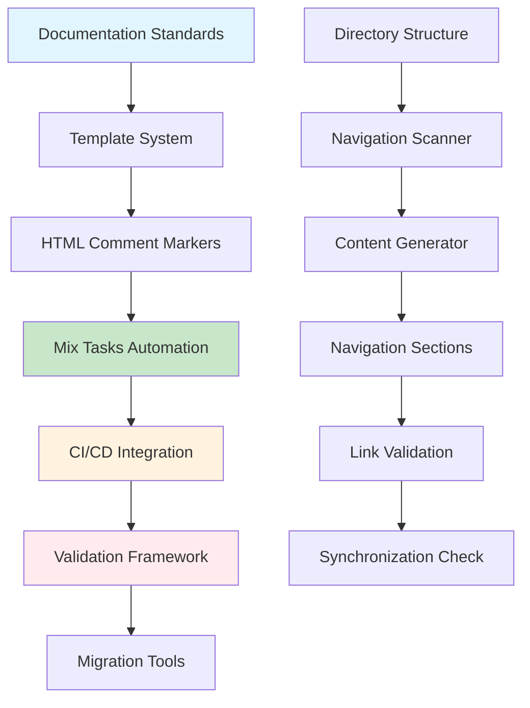

# Documentation Guides

This section contains comprehensive guides for the documentation navigation system, providing everything needed to implement, maintain, and optimize documentation across the project.

<!-- NAV_START -->
## Navigation

**Current Location**: [Home](../../README.md) > [Guides](../README.md) > Documentation

### Available Guides

| Guide | Description | Key Topics |
|-------|-------------|------------|
| [`documentation-system.md`](documentation-system.md) | Complete system standards, templates, and architecture | Standards, Templates, HTML Markers, Structure, Integration |
| [`documentation-automation.md`](documentation-automation.md) | Comprehensive automation with Mix tasks, CI/CD, and validation | Mix Tasks, CI/CD, Validation, Migration, Performance |

### Quick Links

- **📚 [Parent Directory](../README.md)** - Return to guides section
- **🏠 [Documentation Home](../../README.md)** - Main documentation index
- **🔍 [Search Documentation](../../reference/glossary.md)** - Find terms and concepts

### Related Documentation

- [Cross-Reference Guide](../../_meta/cross-reference-guide.md) - Documentation linking standards
- [Maintenance Process](../../_meta/maintenance-process.md) - How to update documentation
- [Feature Documentation Workflow](../../_meta/feature-documentation-workflow.md) - Documentation workflow integration
<!-- NAV_END -->

## Overview

The documentation system provides automated, consistent navigation across all README.md files in the `/docs/` directory. This comprehensive guide system ensures that documentation remains synchronized, validated, and maintainable while integrating seamlessly with development workflows.

## Getting Started

### Quick Start

1. **Understand the System**: Start with [`documentation-system.md`](documentation-system.md) to learn standards and architecture
2. **Implement Automation**: Follow [`documentation-automation.md`](documentation-automation.md) for Mix tasks and CI/CD setup
3. **Practice**: Use the provided examples and templates to implement navigation in your documentation

### Implementation Timeline

- **Reading Time**: ~40 minutes total (both guides)
- **Basic Implementation**: ~2-4 hours
- **Full CI/CD Integration**: ~4-8 hours
- **Team Training**: ~1-2 weeks

## Guide Overview

### Documentation System Guide

**Focus**: Standards, templates, and system architecture  
**Target Audience**: Developers, documentation maintainers, architects  
**Key Features**:
- Complete navigation standards and specifications
- HTML comment marker system
- Template variations for different document types
- Directory description standards
- Positioning requirements and best practices
- Quality assurance checklists

### Documentation Automation Guide

**Focus**: Mix tasks, CI/CD integration, validation, and migration  
**Target Audience**: DevOps engineers, automation specialists, team leads  
**Key Features**:
- Complete Mix tasks implementation
- GitHub Actions and GitLab CI integration
- Comprehensive validation framework
- Migration procedures for all scenarios
- Performance optimization strategies
- Troubleshooting and maintenance procedures

## Benefits

### For Developers
- **Consistent Navigation**: Every documentation section follows the same format
- **Automatic Updates**: Navigation stays synchronized with directory changes
- **Easy Discovery**: Key documents are highlighted in navigation tables
- **Quality Assurance**: Automated validation catches broken links and format issues

### for Teams
- **Reduced Maintenance**: Automation handles repetitive navigation updates
- **Improved Onboarding**: New team members can easily navigate documentation
- **Better Collaboration**: Consistent standards improve documentation contributions
- **CI/CD Integration**: Documentation quality checks in development workflows

### For Organizations
- **Scalable Documentation**: System works for projects of any size
- **Knowledge Management**: Improved discoverability of organizational knowledge
- **Compliance**: Automated validation ensures documentation standards
- **Cost Reduction**: Less manual effort required for documentation maintenance

## Architecture Overview

## Success Stories

### Before Implementation
- Manual navigation updates taking hours per release
- Inconsistent navigation formats across documentation sections
- Broken links discovered only during manual reviews
- New team members struggling to find relevant documentation

### After Implementation
- Navigation updates happen automatically with directory changes
- 100% consistent navigation format across all documentation
- Broken links caught by CI/CD before merge to main branch
- New team members onboard 50% faster with improved navigation

## Common Use Cases

### 1. New Project Setup
Use the documentation system to establish consistent navigation from day one:
- Follow system guide for standards implementation
- Set up automation guide for CI/CD integration
- Train team on navigation maintenance procedures

### 2. Existing Project Migration
Migrate existing documentation to the navigation system:
- Assess current documentation state
- Choose appropriate migration strategy
- Execute migration with backup and validation
- Train team on new system

### 3. Large Organization Standardization
Implement across multiple projects and teams:
- Establish organization-wide navigation standards
- Create custom templates for specific project types
- Set up centralized monitoring and reporting
- Provide organization-wide training and support

### 4. CI/CD Integration
Integrate documentation quality into development workflows:
- Add navigation validation to pre-commit hooks
- Include documentation checks in pull request validation
- Set up automatic navigation updates on directory changes
- Monitor documentation health with scheduled jobs

## Best Practices

### Implementation
1. **Start Small**: Begin with a single documentation section
2. **Validate Early**: Run validation frequently during implementation
3. **Backup Everything**: Always create backups before major changes
4. **Team Involvement**: Include team members in planning and training

### Maintenance
1. **Regular Validation**: Schedule regular navigation health checks
2. **Monitor Performance**: Track validation and update times
3. **Gather Feedback**: Collect user feedback on navigation effectiveness
4. **Continuous Improvement**: Regularly review and optimize processes

### Automation
1. **Gradual Integration**: Implement CI/CD integration incrementally
2. **Test Thoroughly**: Validate automation in staging environments
3. **Monitor Closely**: Watch automation performance and reliability
4. **Have Rollback Plans**: Prepare procedures for automation failures

## Support and Resources

### Documentation
- [System Guide](documentation-system.md) - Complete standards and architecture
- [Automation Guide](documentation-automation.md) - Mix tasks and CI/CD integration
- [Cross-Reference Guide](../../_meta/cross-reference-guide.md) - Linking standards
- [Maintenance Process](../../_meta/maintenance-process.md) - Update procedures

### Tools and Scripts
- Mix tasks for automation (`mix docs.nav.*`)
- CI/CD workflow templates (GitHub Actions, GitLab CI)
- Validation and reporting tools
- Migration utilities for various scenarios

### Community
- Internal team support channels
- Documentation system user groups
- Best practices sharing forums
- Training and onboarding resources

## Future Enhancements

### Planned Features
- Enhanced performance optimization for large repositories
- Additional CI/CD platform integrations (Jenkins, Azure DevOps)
- Advanced analytics and reporting capabilities
- Integration with external documentation systems

### Roadmap
- **Q1**: Performance optimization and advanced caching
- **Q2**: Enhanced migration tools and external system integration
- **Q3**: Advanced analytics and usage reporting
- **Q4**: AI-powered content suggestions and optimization

---

**These documentation guides provide everything needed to implement, maintain, and optimize a comprehensive documentation navigation system that scales with your project and team.**