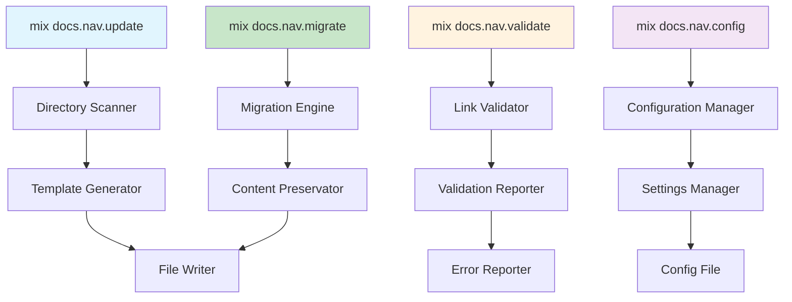
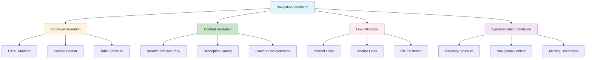

# Documentation Automation Guide

<!-- NAV_START -->
## Navigation

**Current Location**: [Home](../../README.md) > [Guides](../README.md) > [Documentation](README.md) > Documentation Automation

### Quick Links

- **📚 [Parent Directory](../README.md)** - Return to guides section
- **🏠 [Documentation Home](../../README.md)** - Main documentation index
- **🔍 [Search Documentation](../../reference/glossary.md)** - Find terms and concepts
- **📋 [Documentation System](documentation-system.md)** - Standards, templates, and architecture

### Related Documentation

- [Cross-Reference Guide](../../_meta/cross-reference-guide.md) - Documentation linking standards
- [Maintenance Process](../../_meta/maintenance-process.md) - How to update documentation
<!-- NAV_END -->

## Overview

This comprehensive guide provides complete automation for the documentation navigation system, including Mix tasks implementation, CI/CD integration, validation processes, and migration procedures. It covers everything needed to automate documentation management and maintenance.

**Reading Time**: ~25 minutes  
**Implementation Time**: ~4-8 hours  
**Skill Level**: Advanced

## Table of Contents

1. [Mix Tasks Implementation](#mix-tasks-implementation)
2. [CI/CD Integration](#cicd-integration)
3. [Validation and Maintenance](#validation-and-maintenance)
4. [Migration Procedures](#migration-procedures)
5. [Implementation Guide](#implementation-guide)
6. [Performance Optimization](#performance-optimization)

## Mix Tasks Implementation

### Core Tasks Architecture



### 1. Main Navigation Update Task

**File**: `lib/mix/tasks/docs/nav/update.ex`

```elixir
defmodule Mix.Tasks.Docs.Nav.Update do
  @moduledoc """
  Updates navigation sections in all README.md files within the /docs/ directory.
  
  This task scans the documentation directory structure and automatically
  generates or updates navigation sections in README.md files to match
  the actual directory structure.

  ## Usage

      mix docs.nav.update [options]

  ## Options

    * `--path` - Specific directory to process (default: docs/)
    * `--dry-run` - Preview changes without writing files
    * `--force` - Overwrite existing navigation sections
    * `--backup` - Create backup before making changes
    * `--config` - Path to custom configuration file
    * `--verbose` - Show detailed output

  ## Examples

      # Update all navigation sections
      mix docs.nav.update

      # Update specific directory with dry run
      mix docs.nav.update --path=docs/guides/ --dry-run

      # Force update with backup
      mix docs.nav.update --force --backup

  """

  use Mix.Task

  alias Mix.Tasks.Docs.Nav.{Scanner, Generator, Writer, ConfigManager}

  @shortdoc "Updates documentation navigation sections"

  def run(args) do
    {options, [], []} = OptionParser.parse(args,
      switches: [
        path: :string,
        dry_run: :boolean,
        force: :boolean,
        backup: :boolean,
        config: :string,
        verbose: :boolean
      ]
    )

    config = ConfigManager.load_config(options[:config])
    base_path = Path.expand(options[:path] || "docs")

    if options[:verbose] do
      Mix.shell().info("Starting navigation update...")
      Mix.shell().info("Base path: #{base_path}")
    end

    # Create backup if requested
    if options[:backup] do
      create_backup(base_path, options[:verbose])
    end

    # Scan directory structure
    directory_tree = Scanner.scan_directory(base_path, config)
    
    if options[:verbose] do
      Mix.shell().info("Found #{length(directory_tree)} directories to process")
    end

    # Process each directory
    results = Enum.map(directory_tree, fn dir_info ->
      process_directory(dir_info, options, config)
    end)

    # Report results
    report_results(results, options[:verbose])
  end

  # Implementation details continue...
end
```

### 2. Navigation Validation Task

**File**: `lib/mix/tasks/docs/nav/validate.ex`

```elixir
defmodule Mix.Tasks.Docs.Nav.Validate do
  @moduledoc """
  Validates documentation navigation sections and links.
  
  This task checks all README.md files in the /docs/ directory to ensure:
  - Navigation sections exist and follow the standard format
  - All navigation links point to existing files and directories
  - Navigation content is synchronized with actual directory structure
  - HTML comment markers are properly placed

  ## Usage

      mix docs.nav.validate [options]

  ## Options

    * `--path` - Specific directory to validate (default: docs/)
    * `--fix-links` - Attempt to fix broken links automatically
    * `--strict` - Enable strict validation mode
    * `--format` - Output format (text, json, markdown)
    * `--verbose` - Show detailed validation results

  ## Examples

      # Validate all navigation sections
      mix docs.nav.validate

      # Validate specific directory with fixes
      mix docs.nav.validate --path=docs/guides/ --fix-links

      # Strict validation with JSON output
      mix docs.nav.validate --strict --format=json

  """

  use Mix.Task

  alias Mix.Tasks.Docs.Nav.{Scanner, Validator, Reporter}

  @shortdoc "Validates documentation navigation sections"

  def run(args) do
    {options, [], []} = OptionParser.parse(args,
      switches: [
        path: :string,
        fix_links: :boolean,
        strict: :boolean,
        format: :string,
        verbose: :boolean
      ]
    )

    base_path = Path.expand(options[:path] || "docs")
    format = options[:format] || "text"

    # Scan and validate all README files
    validation_results = Scanner.scan_directory(base_path)
    |> Enum.map(&validate_directory(&1, options))
    |> List.flatten()

    # Apply fixes if requested
    if options[:fix_links] do
      fixed_results = apply_fixes(validation_results, options[:verbose])
      validation_results = validation_results ++ fixed_results
    end

    # Generate report
    Reporter.generate_report(validation_results, format, options[:verbose])

    # Exit with error code if validation failures found
    if has_failures?(validation_results) do
      System.halt(1)
    end
  end

  # Implementation continues...
end
```

### 3. Migration Task

**File**: `lib/mix/tasks/docs/nav/migrate.ex`

```elixir
defmodule Mix.Tasks.Docs.Nav.Migrate do
  @moduledoc """
  Migrates existing documentation files to use the new navigation system.
  
  This task analyzes existing README.md files and adds standardized
  navigation sections while preserving existing content.

  ## Usage

      mix docs.nav.migrate [options]

  ## Options

    * `--path` - Specific directory to migrate (default: docs/)
    * `--dry-run` - Preview migration without making changes
    * `--backup` - Create backup before migration
    * `--add-markers` - Add HTML comment markers to existing content
    * `--config` - Path to custom configuration file
    * `--verbose` - Show detailed migration progress

  ## Examples

      # Migrate all documentation files
      mix docs.nav.migrate --backup

      # Dry run migration for specific directory
      mix docs.nav.migrate --path=docs/guides/ --dry-run

      # Add markers to existing navigation content
      mix docs.nav.migrate --add-markers

  """

  use Mix.Task

  alias Mix.Tasks.Docs.Nav.{Scanner, Migrator, ConfigManager}

  @shortdoc "Migrates existing documentation to navigation system"

  # Implementation details...
end
```

### Configuration Management

**Configuration File**: `docs/.navigation-config.yml`

```yaml
# Documentation Navigation System Configuration
directory_descriptions:
  _meta: "Documentation system metadata and maintenance procedures"
  core: "Essential system architecture and design documentation"
  guides: "Step-by-step implementation and best practice guides"
  operations: "Deployment, monitoring, and maintenance procedures"
  reference: "Quick reference materials and API documentation" 
  architecture: "Architectural decisions and system design documentation"

# Navigation generation settings
navigation_settings:
  max_key_files: 3
  include_dates: false
  auto_generate_descriptions: true
  template: "standard"

# Validation settings
validation_settings:
  check_external_links: false
  validate_anchors: true
  max_link_depth: 3
  exclude_directories:
    - "node_modules"
    - "_build"
    - ".git"

# CI/CD integration settings
ci_settings:
  auto_commit: true
  commit_message: "docs: auto-update navigation sections"
  create_pull_requests: false
```

### Basic Usage Examples

```bash
# Update all navigation sections
mix docs.nav.update

# See what would be updated without making changes
mix docs.nav.update --dry-run --verbose

# Validate all navigation sections
mix docs.nav.validate

# Validate with automatic link fixing
mix docs.nav.validate --fix-links --verbose

# Migrate existing files with backup
mix docs.nav.migrate --backup --verbose

# Create initial configuration
mix docs.nav.config init

# Validate current configuration
mix docs.nav.config validate --verbose
```

## CI/CD Integration

### GitHub Actions Integration

#### Complete Workflow Configuration

**File**: `.github/workflows/documentation-navigation.yml`

```yaml
name: Documentation Navigation System

on:
  push:
    branches: [main, develop]
    paths: ['docs/**']
  pull_request:
    branches: [main, develop]
    paths: ['docs/**']
  schedule:
    # Daily maintenance at 2 AM UTC
    - cron: '0 2 * * *'
  workflow_dispatch:
    inputs:
      maintenance_type:
        description: 'Type of maintenance to run'
        required: true
        default: 'validate'
        type: choice
        options:
          - validate
          - update
          - full-maintenance

env:
  MIX_ENV: test
  GITHUB_TOKEN: ${{ secrets.GITHUB_TOKEN }}

jobs:
  # Navigation validation job
  validate-navigation:
    name: Validate Navigation System
    runs-on: ubuntu-latest
    if: github.event_name == 'pull_request' || github.event_name == 'push'
    
    steps:
      - name: Checkout code
        uses: actions/checkout@v4
        
      - name: Setup Elixir
        uses: erlef/setup-beam@v1
        with:
          elixir-version: '1.15.7'
          otp-version: '26.0'
          
      - name: Cache dependencies
        uses: actions/cache@v3
        with:
          path: |
            deps
            _build
          key: ${{ runner.os }}-mix-${{ hashFiles('**/mix.lock') }}
          restore-keys: ${{ runner.os }}-mix-
          
      - name: Install dependencies
        run: mix deps.get
        
      - name: Compile project
        run: mix compile --warnings-as-errors
        
      - name: Validate navigation structure
        run: |
          echo "🔍 Validating navigation system..."
          mix docs.nav.validate --verbose --format=github-actions
          
      - name: Check navigation synchronization
        run: |
          echo "🔄 Checking directory synchronization..."
          mix docs.nav.validate --check-sync --strict
          
      - name: Generate validation report
        if: always()
        run: |
          mix docs.nav.validate --format=json > navigation-validation.json
          mix docs.nav.validate --format=markdown > navigation-report.md
          
      - name: Upload validation artifacts
        if: always()
        uses: actions/upload-artifact@v3
        with:
          name: navigation-validation-${{ github.sha }}
          path: |
            navigation-validation.json
            navigation-report.md

  # Automatic navigation updates
  auto-update-navigation:
    name: Auto-Update Navigation
    runs-on: ubuntu-latest
    if: github.event_name == 'push' && github.ref == 'refs/heads/main'
    needs: validate-navigation
    
    steps:
      - name: Checkout code
        uses: actions/checkout@v4
        with:
          token: ${{ secrets.GITHUB_TOKEN }}
          fetch-depth: 0
          
      - name: Setup Elixir
        uses: erlef/setup-beam@v1
        with:
          elixir-version: '1.15.7'
          otp-version: '26.0'
          
      - name: Install dependencies
        run: mix deps.get
        
      - name: Check if navigation updates needed
        id: check-updates
        run: |
          echo "🔍 Checking if navigation updates are needed..."
          if mix docs.nav.update --dry-run --quiet; then
            echo "updates-needed=false" >> $GITHUB_OUTPUT
          else
            echo "updates-needed=true" >> $GITHUB_OUTPUT
          fi
          
      - name: Update navigation sections
        if: steps.check-updates.outputs.updates-needed == 'true'
        run: |
          echo "🔄 Updating navigation sections..."
          mix docs.nav.update --auto-mode --backup
          
      - name: Commit navigation updates
        if: steps.check-updates.outputs.updates-needed == 'true'
        run: |
          git config --local user.email "action@github.com"
          git config --local user.name "GitHub Action"
          git add docs/
          if [ -n "$(git status --porcelain)" ]; then
            git commit -m "docs: auto-update navigation sections
            
            - Updated navigation to reflect directory structure changes
            - Synchronized subdirectory listings and descriptions
            - Validated all navigation links and references
            
            [skip ci]"
            git push
          else
            echo "No navigation changes to commit"
          fi

  # Scheduled maintenance
  scheduled-maintenance:
    name: Scheduled Navigation Maintenance
    runs-on: ubuntu-latest
    if: github.event_name == 'schedule' || (github.event_name == 'workflow_dispatch' && github.event.inputs.maintenance_type == 'full-maintenance')
    
    steps:
      - name: Checkout code
        uses: actions/checkout@v4
        
      - name: Setup Elixir
        uses: erlef/setup-beam@v1
        with:
          elixir-version: '1.15.7'
          otp-version: '26.0'
          
      - name: Install dependencies
        run: mix deps.get
        
      - name: Run comprehensive validation
        run: |
          echo "🔍 Running comprehensive navigation validation..."
          mix docs.nav.validate --comprehensive --format=json > daily-validation.json
          
      - name: Generate health report
        run: |
          echo "📊 Generating navigation health report..."
          mix docs.nav.health-report --format=markdown > navigation-health.md
          
      - name: Archive maintenance reports
        run: |
          mkdir -p maintenance-reports/$(date +%Y-%m)
          mv daily-validation.json maintenance-reports/$(date +%Y-%m)/
          mv navigation-health.md maintenance-reports/$(date +%Y-%m)/
          
      - name: Upload maintenance reports
        uses: actions/upload-artifact@v3
        with:
          name: navigation-maintenance-$(date +%Y%m%d)
          path: maintenance-reports/
```

#### Pre-commit Hook Integration

**File**: `.github/hooks/pre-commit-navigation`

```bash
#!/bin/sh
# Pre-commit hook for navigation validation

echo "🔍 Validating documentation navigation..."

# Check if any documentation files changed
if git diff --cached --name-only | grep -q "^docs/"; then
    # Run fast navigation validation
    if ! mix docs.nav.validate --fast --staged-files; then
        echo "❌ Navigation validation failed. Please fix the issues above."
        echo "💡 Run 'mix docs.nav.update' to automatically fix navigation issues."
        exit 1
    fi
    
    echo "✅ Navigation validation passed."
fi

exit 0
```

### GitLab CI Integration

**File**: `.gitlab-ci.yml` (navigation sections)

```yaml
# Documentation Navigation Pipeline
variables:
  MIX_ENV: test
  NAV_VALIDATION_ENABLED: "true"
  NAV_AUTO_UPDATE: "true"
  NAV_STRICT_MODE: "false"

stages:
  - validate
  - test
  - update
  - deploy
  - maintain

# Navigation validation stage
validate-navigation:
  stage: validate
  image: elixir:1.15.7
  before_script:
    - mix local.hex --force
    - mix local.rebar --force
    - mix deps.get
    - mix compile
  script:
    - echo "🔍 Validating navigation system..."
    - mix docs.nav.validate --verbose --format=gitlab-ci
    - mix docs.nav.validate --check-sync --strict
  artifacts:
    reports:
      junit: navigation-validation.xml
    paths:
      - navigation-validation.json
      - navigation-report.md
    expire_in: 1 week
  rules:
    - if: '$CI_PIPELINE_SOURCE == "merge_request_event"'
      changes:
        - docs/**/*
    - if: '$CI_COMMIT_BRANCH == "main"'
      changes:
        - docs/**/*

# Auto-update navigation
auto-update-navigation:
  stage: update
  image: elixir:1.15.7
  before_script:
    - mix local.hex --force
    - mix local.rebar --force
    - mix deps.get
  script:
    - echo "🔄 Checking for navigation updates..."
    - |
      if mix docs.nav.update --dry-run --quiet; then
        echo "No navigation updates needed"
      else
        echo "Updating navigation sections..."
        mix docs.nav.update --auto-mode --backup
        
        # Configure git
        git config --global user.email "gitlab-ci@example.com"
        git config --global user.name "GitLab CI"
        
        # Commit changes if any
        git add docs/
        if [ -n "$(git status --porcelain)" ]; then
          git commit -m "docs: auto-update navigation sections [skip ci]"
          git push https://oauth2:${CI_PUSH_TOKEN}@${CI_SERVER_HOST}/${CI_PROJECT_PATH}.git HEAD:${CI_COMMIT_REF_NAME}
        fi
      fi
  rules:
    - if: '$CI_COMMIT_BRANCH == "main" && $NAV_AUTO_UPDATE == "true"'
      changes:
        - docs/**/*
  dependencies:
    - validate-navigation

# Scheduled maintenance
navigation-maintenance:
  stage: maintain
  image: elixir:1.15.7
  before_script:
    - mix local.hex --force
    - mix local.rebar --force
    - mix deps.get
  script:
    - echo "📊 Running navigation maintenance..."
    - mix docs.nav.validate --comprehensive --format=json > maintenance-validation.json
    - mix docs.nav.health-report --format=markdown > navigation-health.md
  artifacts:
    paths:
      - maintenance-validation.json
      - navigation-health.md
    expire_in: 30 days
  rules:
    - if: '$CI_PIPELINE_SOURCE == "schedule"'
  allow_failure: true
```

## Validation and Maintenance

### Validation Framework

#### Validation Types



#### Structural Validation

**HTML Marker Validation:**
```bash
# Check for missing or malformed HTML markers
mix docs.nav.validate --check-markers

# Validation criteria:
# - Presence of <!-- NAV_START --> and <!-- NAV_END -->
# - Markers on separate lines
# - No additional text on marker lines
# - Only one navigation section per file
```

**Section Format Validation:**
```bash
# Check navigation section format
mix docs.nav.validate --check-format

# Validation criteria:
# - Correct heading levels (## Navigation, ### Subsections)
# - Required sections present (Current Location, Subdirectories, Quick Links)
# - Table format compliance
# - Consistent emoji usage in Quick Links
```

#### Link Validation

**Internal Link Validation:**
```bash
# Validate all internal links
mix docs.nav.validate --check-links

# Link validation process:
# 1. Extract all markdown links from navigation sections
# 2. Resolve relative paths from current document location
# 3. Check file/directory existence
# 4. Validate anchor links within documents
# 5. Report broken or missing links
```

#### Synchronization Validation

**Directory Structure Synchronization:**
```bash
# Check directory synchronization
mix docs.nav.validate --check-sync

# Synchronization validation:
# 1. Scan actual directory structure
# 2. Parse navigation content
# 3. Identify missing directories in navigation
# 4. Identify navigation entries for non-existent directories
# 5. Report synchronization issues
```

### Validation Configuration

**Configuration File**: `docs/.navigation-validation.yml`

```yaml
# Navigation validation configuration
validation_settings:
  # Enable/disable validation types
  check_markers: true
  check_format: true
  check_links: true
  check_anchors: true
  check_sync: true
  check_descriptions: true
  
  # Validation strictness levels
  strictness: "standard"  # options: lenient, standard, strict
  
  # Files and directories to exclude from validation
  exclude_files:
    - "README-template.md"
    - "DRAFT-*.md"
  
  exclude_directories:
    - "node_modules"
    - "_build"
    - ".git"
    - "tmp"
  
  # Link validation settings
  link_validation:
    check_external_links: false
    max_anchor_depth: 6
    timeout_seconds: 10
  
  # Error reporting settings
  reporting:
    fail_on_warnings: false
    show_progress: true
    detailed_output: false
    max_errors_per_file: 20
```

### Error Reporting Formats

#### Console Output
```bash
❌ Critical Error: Missing NAV_START marker in docs/guides/README.md (line 1)
⚠️  Warning: Broken link to non-existent file in docs/core/README.md (line 15)
ℹ️  Info: Consider adding description for directory 'workflows' in docs/guides/README.md

Validation Summary:
  Files Checked: 25
  Critical Errors: 1
  Warnings: 3
  Info Messages: 5
  Validation Time: 2.3s
```

#### JSON Output
```json
{
  "validation_timestamp": "2024-01-15T10:30:00Z",
  "summary": {
    "files_checked": 25,
    "critical_errors": 1,
    "warnings": 3,
    "info_messages": 5,
    "validation_time_seconds": 2.3
  },
  "results": [
    {
      "file": "docs/guides/README.md",
      "line": 1,
      "type": "critical",
      "code": "MISSING_NAV_MARKER",
      "message": "Missing NAV_START marker",
      "suggestion": "Add <!-- NAV_START --> marker before navigation content"
    }
  ]
}
```

### Maintenance Processes

#### Daily Maintenance (Automated)
```yaml
# .github/workflows/daily-nav-check.yml
name: Daily Navigation Check
on:
  schedule:
    - cron: '0 2 * * *'  # Run at 2 AM UTC daily

jobs:
  validate-navigation:
    runs-on: ubuntu-latest
    steps:
      - uses: actions/checkout@v3
      - name: Setup Elixir
        uses: erlef/setup-beam@v1
      - name: Validate navigation
        run: mix docs.nav.validate --format=json > validation-report.json
      - name: Upload report
        uses: actions/upload-artifact@v3
        with:
          name: daily-navigation-report
          path: validation-report.json
```

#### Weekly Maintenance
```bash
#!/bin/bash
echo "Starting weekly navigation maintenance..."

# Full validation with detailed reporting
mix docs.nav.validate --verbose > weekly-validation-report.txt

# Update navigation sections if needed
mix docs.nav.update --dry-run > navigation-update-preview.txt

# Generate maintenance report
mix docs.nav.maintenance-report --week > weekly-maintenance-report.md

# Archive reports
mkdir -p reports/$(date +%Y-%m)
mv *.txt *.md reports/$(date +%Y-%m)/
```

## Migration Procedures

### Migration Strategies

#### Migration Complexity Assessment

| Current State | Complexity | Time Estimate | Risk Level | Strategy |
|---------------|------------|---------------|------------|----------|
| **No Navigation** | Low | 1-2 days | Low | Generate from directory structure |
| **Manual Navigation** | Medium | 3-5 days | Medium | Preserve content, standardize format |
| **Inconsistent Navigation** | High | 1-2 weeks | Medium | Clean up, rebuild systematically |
| **External System** | Very High | 2-4 weeks | High | Import, transform, validate extensively |

### Pre-Migration Assessment

**Automated Assessment:**
```bash
# Run comprehensive documentation audit
mix docs.nav.audit --comprehensive > migration-assessment.md

# Analyze current navigation patterns
mix docs.nav.audit --existing-patterns > current-patterns.md

# Identify potential migration issues
mix docs.nav.audit --migration-risks > migration-risks.md

# Generate migration plan
mix docs.nav.migration-plan --auto-generate > proposed-migration-plan.md
```

**Create Migration Baseline:**
```bash
# Document current state
echo "# Pre-Migration Documentation State" > migration-baseline.md
echo "**Assessment Date**: $(date)" >> migration-baseline.md

# Directory structure snapshot
echo "## Directory Structure" >> migration-baseline.md
tree docs/ >> migration-baseline.md

# Existing navigation analysis
echo "## Current Navigation Patterns" >> migration-baseline.md
find docs -name "*.md" -exec grep -l "Table of Contents\|Navigation\|Index" {} \; >> migration-baseline.md
```

### Migration Scenarios

#### Scenario 1: No Existing Navigation

**Migration Steps:**

1. **Backup and Prepare**
```bash
# Create comprehensive backup
cp -r docs docs_backup_no_nav_$(date +%Y%m%d_%H%M%S)

# Initialize navigation system
mix docs.nav.config init --template=basic

# Create initial configuration
mix docs.nav.config update --auto-detect-structure
```

2. **Generate Base Navigation**
```bash
# Generate navigation from directory structure
mix docs.nav.generate --from-structure --comprehensive

# Create missing README files
mix docs.nav.create-missing --readme-files

# Validate initial generation
mix docs.nav.validate --initial-generation
```

3. **Content Integration**
```bash
# Analyze existing content for descriptions
mix docs.nav.analyze --extract-descriptions

# Update navigation with extracted content
mix docs.nav.update --integrate-existing-content

# Validate content integration
mix docs.nav.validate --content-integration
```

#### Scenario 2: Manual Navigation Exists

**Migration Steps:**

1. **Preserve Existing Content**
```bash
# Backup with content preservation analysis
mix docs.nav.backup --preserve-navigation-content

# Analyze existing navigation patterns
mix docs.nav.analyze --existing-navigation > existing-nav-analysis.md

# Extract useful navigation content
mix docs.nav.extract --manual-navigation > extracted-content.json
```

2. **Transform to Standard Format**
```bash
# Convert existing navigation to standard format
mix docs.nav.transform --from-manual --preserve-content

# Apply HTML comment markers
mix docs.nav.migrate --add-markers --preserve-existing

# Standardize format while preserving content
mix docs.nav.standardize --preserve-descriptions
```

#### Scenario 3: External System Migration

**Migration Steps:**

1. **Export and Import**
```bash
# GitBook example:
mix docs.nav.import --from-gitbook --export-path=/path/to/gitbook-export

# Confluence example:
mix docs.nav.import --from-confluence --space-key=DEV --credentials-file=confluence-creds.json

# Generic markdown import:
mix docs.nav.import --from-markdown --source-dir=/path/to/external-docs
```

2. **Structure Transformation**
```bash
# Transform external structure to docs/ organization
mix docs.nav.transform --external-to-internal --map-structure

# Convert external linking to relative paths
mix docs.nav.convert-links --external-to-relative
```

### Rollback Procedures

#### Emergency Rollback
```bash
# 1. Immediate rollback to backup
cp -r docs_backup_$(ls -t | grep docs_backup | head -1)/* docs/

# 2. Restore git state if needed
git checkout HEAD~1 -- docs/  # Or specific commit

# 3. Verify rollback success
mix docs.nav.validate --rollback-verification

# 4. Document rollback reasons
echo "# Migration Rollback Report" > rollback-report.md
echo "**Date**: $(date)" >> rollback-report.md
echo "**Reason**: [Document specific failure reason]" >> rollback-report.md
```

## Implementation Guide

### Phase 1: Foundation Setup

#### Step 1: Install and Configure System

**Prerequisites Check:**
```bash
# Verify Elixir and Mix are installed
elixir --version  # Should be 1.15.7+
mix --version

# Verify project structure
ls -la docs/  # Should show existing documentation structure
```

**Configuration Setup:**
```bash
# 1. Create navigation configuration file
cat > docs/.navigation-config.yml << 'EOF'
# Documentation Navigation System Configuration
directory_descriptions:
  _meta: "Documentation system metadata and maintenance procedures"
  core: "Essential system architecture and design documentation"
  guides: "Step-by-step implementation and best practice guides"
  operations: "Deployment, monitoring, and maintenance procedures"
  reference: "Quick reference materials and API documentation"
  architecture: "Architectural decisions and system design documentation"
  shared: "Shared resources and templates"

navigation_settings:
  max_key_files: 3
  include_dates: false
  auto_generate_descriptions: true
  template: "standard"

validation_settings:
  check_external_links: false
  validate_anchors: true
  max_link_depth: 3

ci_settings:
  auto_commit: true
  commit_message: "docs: auto-update navigation sections"
EOF
```

#### Step 2: Initial Migration

**Backup Existing Documentation:**
```bash
# Create backup of current documentation
cp -r docs docs_backup_$(date +%Y%m%d_%H%M%S)
echo "Backup created: docs_backup_$(date +%Y%m%d_%H%M%S)"
```

**Run Migration:**
```bash
# Migrate existing documentation to navigation system
mix docs.nav.migrate --backup --verbose

# Validate migration results
mix docs.nav.validate --comprehensive
```

### Phase 2: CI/CD Integration

#### Step 1: GitHub Actions Setup

**Create Workflow File:**
```bash
mkdir -p .github/workflows
```

Copy the complete workflow from the CI/CD Integration section to `.github/workflows/documentation-navigation.yml`.

#### Step 2: Pre-commit Hook Setup

**Install Pre-commit Hook:**
```bash
# Create git hooks directory if it doesn't exist
mkdir -p .git/hooks

# Create pre-commit hook (content from CI/CD section)
cat > .git/hooks/pre-commit << 'EOF'
#!/bin/sh
# Pre-commit hook for navigation validation

echo "🔍 Validating documentation navigation..."

if git diff --cached --name-only | grep -q "^docs/"; then
    if ! mix docs.nav.validate --fast --staged-files; then
        echo "❌ Navigation validation failed. Please fix the issues above."
        echo "💡 Run 'mix docs.nav.update' to automatically fix navigation issues."
        exit 1
    fi
    echo "✅ Navigation validation passed."
fi

exit 0
EOF

# Make hook executable
chmod +x .git/hooks/pre-commit
```

### Phase 3: Team Adoption

#### Training Program Structure

**Week 1: System Overview**
- Introduction to navigation system
- Benefits and objectives
- High-level architecture overview

**Week 2: Hands-on Training**
- Mix task demonstrations
- Practice with sample documentation
- Q&A sessions

**Week 3: Advanced Features**
- CI/CD integration
- Troubleshooting procedures
- Performance optimization

#### Support Resources

**Self-Service Resources:**
```bash
# Create comprehensive help system
mix docs.nav.create-help --interactive

# Generate FAQ from common issues
mix docs.nav.generate-faq --from-support-logs

# Create troubleshooting guide
mix docs.nav.create-troubleshooting --interactive
```

## Performance Optimization

### System Performance Tuning

#### Caching Configuration
```yaml
# .navigation-config.yml - Performance section
performance_settings:
  enable_caching: true
  cache_directory: ".navigation-cache"
  cache_ttl_hours: 24
  
  # Parallel processing settings
  enable_parallel_processing: true
  max_workers: 4
  
  # Optimization settings
  skip_unchanged_files: true
  use_git_status: true
  enable_incremental_updates: true
```

#### Large Repository Optimization
```bash
# For repositories with many documentation files
mix docs.nav.update --incremental --parallel --workers=8

# Use selective validation for faster feedback
mix docs.nav.validate --changed-files-only

# Enable aggressive caching
mix docs.nav.config set performance.enable_aggressive_caching true
```

### Performance Monitoring

#### Performance Metrics
```bash
# Generate performance report
mix docs.nav.performance-report

# Monitor validation times
mix docs.nav.validate --benchmark

# Analyze bottlenecks
mix docs.nav.analyze --performance --detailed
```

#### Performance Alerts
```bash
# Set up performance monitoring
mix docs.nav.monitor --performance-threshold=10s --alert-email=team@example.com
```

### Pipeline Optimization

```yaml
# Optimized navigation validation for large repositories
navigation-validation-optimized:
  extends: .navigation-base
  stage: validate
  parallel:
    matrix:
      - VALIDATION_TYPE: [structure, links, sync, format]
  script:
    - |
      case $VALIDATION_TYPE in
        structure)
          mix docs.nav.validate --check-markers --check-format
          ;;
        links)
          mix docs.nav.validate --check-links --parallel
          ;;
        sync)
          mix docs.nav.validate --check-sync
          ;;
        format)
          mix docs.nav.validate --check-descriptions --check-content
          ;;
      esac
  artifacts:
    paths:
      - validation-${VALIDATION_TYPE}.json
    expire_in: 1 day
```

## Troubleshooting Guide

### Common Issues and Solutions

#### Issue: Navigation Validation Fails

**Symptoms:**
```bash
❌ Critical Error: Missing NAV_START marker in docs/guides/README.md
❌ Warning: Broken link to non-existent file in docs/core/README.md
```

**Solutions:**
```bash
# 1. Add missing navigation markers
mix docs.nav.migrate --add-markers

# 2. Fix broken links automatically
mix docs.nav.validate --fix-links

# 3. Force regenerate navigation
mix docs.nav.update --force

# 4. Validate fixes worked
mix docs.nav.validate --verbose
```

#### Issue: CI/CD Pipeline Failing

**Solutions:**
```bash
# 1. Check local validation first
mix docs.nav.validate --strict

# 2. Ensure CI/CD configuration is correct
# Review .github/workflows/documentation-navigation.yml

# 3. Test CI/CD locally if possible
act -j validate-navigation  # Using act for GitHub Actions
```

#### Issue: Performance Problems

**Solutions:**
```bash
# 1. Check system performance
mix docs.nav.performance-analysis

# 2. Optimize configuration
mix docs.nav.optimize --performance

# 3. Use incremental updates
mix docs.nav.update --incremental

# 4. Exclude unnecessary directories
# Update .navigation-validation.yml exclude list
```

## Related Documentation

- [Documentation System Guide](documentation-system.md) - Standards, templates, and architecture
- [Cross-Reference Guide](../../_meta/cross-reference-guide.md) - Documentation linking standards
- [Maintenance Process](../../_meta/maintenance-process.md) - How to update documentation
- [CI/CD Implementation](../workflow/ci-cd-implementation.md) - Existing CI/CD workflows

---

**This automation guide provides comprehensive tools and procedures for implementing, maintaining, and optimizing the documentation navigation system across all development workflows, ensuring consistent and reliable navigation throughout the documentation lifecycle.**