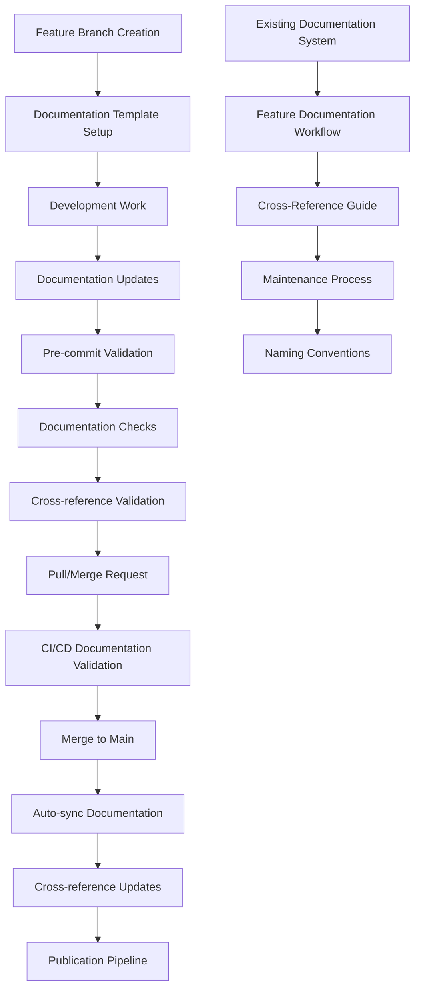

# Documentation Integration Guide

## Overview

This document outlines how the feature branch workflow integrates with the existing comprehensive documentation system in Prismatic, ensuring that documentation remains synchronized, validated, and up-to-date with code changes.

## Integration Architecture



## Existing Documentation System Integration

### Current Documentation Structure

The Prismatic project already has a sophisticated documentation system:

```
docs/
├── README.md                           # Navigation hub
├── core/                              # Essential system knowledge
│   ├── architecture-overview.md
│   └── tech-stack.md
├── guides/                            # How-to and best practices
│   ├── developer-experience.md
│   └── coding-standards.md
├── reference/                         # Lookups and specifications
│   └── glossary.md
├── architecture/                      # Design decisions and ADRs
├── operations/                        # Deployment and maintenance
│   ├── deployment-procedures.md
│   └── troubleshooting.md
└── _meta/                            # Documentation system metadata
    ├── naming-conventions.md
    ├── maintenance-process.md
    ├── cross-reference-guide.md
    └── feature-documentation-workflow.md
```

### Integration Points

#### 1. Feature Documentation Workflow Enhancement

Extend the existing [`docs/_meta/feature-documentation-workflow.md`](../docs/_meta/feature-documentation-workflow.md) to include branch workflow requirements:

**Enhanced Feature Request Documentation Requirements:**

| Component | Existing Requirements | New Branch Workflow Requirements |
|-----------|----------------------|----------------------------------|
| **Source Code** | Inline documentation (`@moduledoc`, `@doc`, comments) | Branch-specific documentation templates |
| **API Documentation** | Endpoint specifications, request/response schemas | Automatic API change detection from branch type |
| **User Guides** | Usage instructions, configuration examples | Feature-specific user impact documentation |
| **Technical Specifications** | Architecture impacts, system interactions | Branch impact assessment documentation |
| **Reference Materials** | Updated commands, configuration options | Automated cross-reference validation |
| **Glossary Updates** | New terms, concept definitions | Branch-triggered glossary validation |

#### 2. Branch-Specific Documentation Templates

**Feature Branch Template Integration:**

```markdown
# Feature Branch Documentation Template
# Auto-generated when creating feature branches

## Feature Overview
<!-- Brief description of the feature being implemented -->

## Documentation Updates Required

### Code Documentation
- [ ] Module documentation updated: `[module_path]`
- [ ] Function documentation added: `[function_list]`
- [ ] Examples provided for all public APIs
- [ ] Inline comments added for complex logic

### API Documentation  
- [ ] Endpoint specifications: `[endpoint_list]`
- [ ] Request/response schemas: `[schema_files]`
- [ ] Authentication requirements documented
- [ ] Error responses specified

### User Documentation
- [ ] User guide updated: `[guide_sections]`
- [ ] Configuration examples provided
- [ ] Troubleshooting section updated
- [ ] Migration guide created (if applicable)

### Cross-References
- [ ] Related documentation links updated
- [ ] Glossary terms added/updated
- [ ] Navigation updated in README.md

## Validation Checklist
- [ ] Documentation completeness validated
- [ ] Cross-reference integrity verified
- [ ] Glossary compliance checked
- [ ] Links tested and functional

## Integration Points
- Related to: [Link to related documentation]
- Impacts: [List of affected documentation sections]
- Dependencies: [Documentation dependencies]
```

#### 3. Automated Documentation Validation

**Enhanced Validation Pipeline:**

```bash
#!/bin/bash
# Enhanced documentation validation script
# Integrates with existing docs/scripts/validate_completeness.sh

echo "🔍 Enhanced Documentation Validation (Branch Workflow)"

# Get current branch information
BRANCH_NAME=$(git rev-parse --abbrev-ref HEAD)
BRANCH_TYPE=$(echo $BRANCH_NAME | cut -d'/' -f1)

echo "📋 Branch: $BRANCH_NAME (Type: $BRANCH_TYPE)"

# Branch-specific validation rules
case $BRANCH_TYPE in
  "feature")
    echo "🔍 Validating feature branch documentation requirements..."
    validate_feature_documentation
    ;;
  "bugfix")
    echo "🔍 Validating bugfix branch documentation requirements..."
    validate_bugfix_documentation
    ;;
  "hotfix")
    echo "🔍 Validating hotfix branch documentation requirements..."
    validate_hotfix_documentation
    ;;
  "docs")
    echo "🔍 Validating documentation-only changes..."
    validate_docs_only_changes
    ;;
  *)
    echo "🔍 Validating general documentation requirements..."
    validate_general_documentation
    ;;
esac

# Existing validation checks (enhanced)
validate_completeness_enhanced
validate_cross_references_enhanced
validate_glossary_enhanced

echo "✅ Enhanced documentation validation complete!"
```

**Branch-Specific Validation Functions:**

```bash
validate_feature_documentation() {
  # Check for feature-specific documentation requirements
  
  # 1. Verify feature documentation template is present
  if [ ! -f ".feature-docs.md" ]; then
    echo "❌ Feature documentation template missing"
    echo "💡 Run: mix branch.create feature/name --template=feature"
    return 1
  fi
  
  # 2. Check for API documentation updates
  check_api_documentation_changes
  
  # 3. Validate user guide impacts
  check_user_guide_requirements
  
  # 4. Verify cross-reference updates
  check_cross_reference_impacts
}

validate_bugfix_documentation() {
  # Check for bugfix-specific documentation requirements
  
  # 1. Verify bug documentation is present
  if [ ! -f ".bugfix-docs.md" ]; then
    echo "⚠️  Bugfix documentation recommended"
    echo "💡 Consider documenting the fix for future reference"
  fi
  
  # 2. Check if troubleshooting docs need updates
  check_troubleshooting_updates
  
  # 3. Validate any API changes are documented
  check_api_compatibility_docs
}

validate_hotfix_documentation() {
  # Check for hotfix-specific documentation requirements
  
  # 1. Verify critical issue documentation
  if [ ! -f ".hotfix-docs.md" ]; then
    echo "❌ Hotfix documentation required for critical changes"
    return 1
  fi
  
  # 2. Check deployment procedure updates
  check_deployment_procedure_updates
  
  # 3. Validate security documentation if applicable
  check_security_documentation_updates
}

check_api_documentation_changes() {
  # Detect API changes and verify documentation
  
  # Check for new or modified API endpoints
  if git diff --name-only main...HEAD | grep -E "(controllers|live|schemas)" > /dev/null; then
    echo "🔍 API changes detected, checking documentation..."
    
    # Verify API documentation is updated
    if git diff --name-only main...HEAD | grep -E "docs.*api" > /dev/null; then
      echo "✅ API documentation updates found"
    else
      echo "⚠️  API changes detected but no API documentation updates"
      echo "💡 Consider updating API documentation in docs/"
    fi
  fi
}
```

#### 4. Cross-Reference Management

**Enhanced Cross-Reference Validation:**

```python
#!/usr/bin/env python3
# Enhanced cross-reference validation
# Extends existing docs/scripts/validate_cross_references.py

import re
import os
import sys
from pathlib import Path
import subprocess

class EnhancedCrossReferenceValidator:
    def __init__(self):
        self.docs_path = Path("docs")
        self.branch_name = self.get_current_branch()
        self.branch_type = self.branch_name.split('/')[0] if '/' in self.branch_name else 'unknown'
        
    def get_current_branch(self):
        """Get current git branch name."""
        result = subprocess.run(['git', 'rev-parse', '--abbrev-ref', 'HEAD'], 
                              capture_output=True, text=True)
        return result.stdout.strip()
        
    def validate_branch_specific_references(self):
        """Validate cross-references based on branch type."""
        print(f"🔍 Validating cross-references for {self.branch_type} branch")
        
        if self.branch_type == "feature":
            return self.validate_feature_references()
        elif self.branch_type == "docs":
            return self.validate_docs_references()
        else:
            return self.validate_general_references()
            
    def validate_feature_references(self):
        """Validate references for feature branches."""
        issues = []
        
        # Check for new features in code that need documentation links
        new_modules = self.get_new_modules()
        for module in new_modules:
            if not self.has_documentation_reference(module):
                issues.append(f"New module {module} lacks documentation reference")
                
        # Check for broken references in modified docs
        modified_docs = self.get_modified_documentation_files()
        for doc_file in modified_docs:
            issues.extend(self.check_file_references(doc_file))
            
        return issues
        
    def validate_docs_references(self):
        """Validate references for documentation-only branches."""
        issues = []
        
        # More strict validation for docs-only changes
        all_docs = self.get_all_documentation_files()
        for doc_file in all_docs:
            issues.extend(self.check_file_references(doc_file))
            
        # Check for orphaned documentation
        issues.extend(self.check_orphaned_documentation())
        
        return issues
        
    def get_new_modules(self):
        """Get list of new Elixir modules in this branch."""
        result = subprocess.run([
            'git', 'diff', '--name-only', '--diff-filter=A', 'main...HEAD'
        ], capture_output=True, text=True)
        
        new_files = result.stdout.strip().split('\n')
        return [f for f in new_files if f.endswith('.ex') and 'lib/' in f]
        
    def has_documentation_reference(self, module_path):
        """Check if module has corresponding documentation reference."""
        module_name = self.extract_module_name(module_path)
        
        # Search for references in documentation
        for doc_file in self.get_all_documentation_files():
            with open(doc_file, 'r') as f:
                content = f.read()
                if module_name.lower() in content.lower():
                    return True
                    
        return False
        
    def check_orphaned_documentation(self):
        """Check for documentation that references non-existent code."""
        issues = []
        
        # Find all code references in documentation
        code_references = self.extract_code_references()
        
        for ref in code_references:
            if not self.code_reference_exists(ref):
                issues.append(f"Documentation references non-existent code: {ref}")
                
        return issues
        
    def generate_cross_reference_report(self):
        """Generate comprehensive cross-reference report."""
        report = {
            'branch': self.branch_name,
            'branch_type': self.branch_type,
            'validation_results': self.validate_branch_specific_references(),
            'reference_map': self.build_reference_map(),
            'recommendations': self.generate_recommendations()
        }
        
        return report
        
    def build_reference_map(self):
        """Build map of all cross-references in the project."""
        reference_map = {}
        
        for doc_file in self.get_all_documentation_files():
            references = self.extract_references_from_file(doc_file)
            reference_map[str(doc_file)] = references
            
        return reference_map
        
    def generate_recommendations(self):
        """Generate recommendations for improving cross-references."""
        recommendations = []
        
        # Analyze reference patterns and suggest improvements
        if self.branch_type == "feature":
            recommendations.append("Consider adding feature overview to main README.md")
            recommendations.append("Update relevant user guides with new feature usage")
            
        return recommendations

# Integration with existing validation
if __name__ == "__main__":
    validator = EnhancedCrossReferenceValidator()
    issues = validator.validate_branch_specific_references()
    
    if issues:
        print("❌ Cross-reference validation issues found:")
        for issue in issues:
            print(f"  • {issue}")
        sys.exit(1)
    else:
        print("✅ Cross-reference validation passed!")
        sys.exit(0)
```

#### 5. Glossary Integration

**Enhanced Glossary Management:**

```python
#!/usr/bin/env python3
# Enhanced glossary validation and management
# Extends existing docs/scripts/validate_glossary.py

import re
import sys
import subprocess
from pathlib import Path

class BranchAwareGlossaryManager:
    def __init__(self):
        self.glossary_path = Path("docs/reference/glossary.md")
        self.branch_name = self.get_current_branch()
        self.branch_type = self.branch_name.split('/')[0] if '/' in self.branch_name else 'unknown'
        
    def get_current_branch(self):
        """Get current git branch name."""
        result = subprocess.run(['git', 'rev-parse', '--abbrev-ref', 'HEAD'], 
                              capture_output=True, text=True)
        return result.stdout.strip()
        
    def extract_new_terms_from_branch(self):
        """Extract potentially new terms from branch changes."""
        # Get changed files
        result = subprocess.run([
            'git', 'diff', '--name-only', 'main...HEAD'
        ], capture_output=True, text=True)
        
        changed_files = result.stdout.strip().split('\n')
        new_terms = set()
        
        for file_path in changed_files:
            if file_path.endswith(('.ex', '.md')):
                new_terms.update(self.extract_terms_from_file(file_path))
                
        return new_terms
        
    def extract_terms_from_file(self, file_path):
        """Extract potential glossary terms from a file."""
        terms = set()
        
        try:
            with open(file_path, 'r') as f:
                content = f.read()
                
            # Look for capitalized technical terms
            technical_terms = re.findall(r'\b[A-Z][a-z]+(?:[A-Z][a-z]*)*\b', content)
            
            # Look for terms in backticks (likely technical terms)
            backtick_terms = re.findall(r'`([^`]+)`', content)
            
            # Look for terms that might need explanation
            # This is a simplified heuristic - could be enhanced
            potential_terms = technical_terms + backtick_terms
            
            for term in potential_terms:
                if len(term) > 3 and not term.lower() in ['true', 'false', 'null', 'this', 'that']:
                    terms.add(term)
                    
        except FileNotFoundError:
            pass
            
        return terms
        
    def suggest_glossary_additions(self):
        """Suggest new terms to add to glossary based on branch changes."""
        new_terms = self.extract_new_terms_from_branch()
        existing_terms = self.get_existing_glossary_terms()
        
        suggested_terms = new_terms - existing_terms
        
        suggestions = []
        for term in suggested_terms:
            if self.should_suggest_term(term):
                suggestions.append({
                    'term': term,
                    'context': self.get_term_context(term),
                    'suggested_definition': self.generate_suggested_definition(term)
                })
                
        return suggestions
        
    def get_existing_glossary_terms(self):
        """Get set of existing terms in glossary."""
        terms = set()
        
        with open(self.glossary_path, 'r') as f:
            content = f.read()
            
        # Extract terms from ### headings
        term_matches = re.findall(r'^### (.+)$', content, re.MULTILINE)
        for term in term_matches:
            terms.add(term.lower())
            
        return terms
        
    def should_suggest_term(self, term):
        """Determine if a term should be suggested for glossary."""
        # Filter out common words, very short terms, etc.
        if len(term) < 4:
            return False
            
        # Skip common programming terms
        common_terms = {'true', 'false', 'null', 'void', 'int', 'string', 'list', 'map'}
        if term.lower() in common_terms:
            return False
            
        # Skip file extensions
        if term.startswith('.'):
            return False
            
        return True
        
    def validate_branch_glossary_requirements(self):
        """Validate glossary requirements based on branch type."""
        issues = []
        
        if self.branch_type == "feature":
            # Feature branches should update glossary if introducing new concepts
            suggestions = self.suggest_glossary_additions()
            if len(suggestions) > 2:  # Threshold for suggesting glossary updates
                issues.append(f"Consider adding {len(suggestions)} new terms to glossary")
                
        elif self.branch_type == "docs":
            # Documentation branches should maintain glossary quality
            issues.extend(self.validate_glossary_quality())
            
        return issues
        
    def validate_glossary_quality(self):
        """Validate overall glossary quality and consistency."""
        issues = []
        
        with open(self.glossary_path, 'r') as f:
            content = f.read()
            
        # Check alphabetical order (existing check)
        terms = re.findall(r'^### (.+)$', content, re.MULTILINE)
        sorted_terms = sorted(terms, key=str.lower)
        
        if terms != sorted_terms:
            issues.append("Glossary terms not in alphabetical order")
            
        # Check for empty definitions
        sections = content.split('### ')[1:]  # Skip header
        for i, section in enumerate(sections):
            lines = section.split('\n')
            term = lines[0].strip()
            
            # Check if definition exists and is meaningful
            definition_lines = [line.strip() for line in lines[1:] if line.strip()]
            if not definition_lines:
                issues.append(f"Term '{term}' has no definition")
            elif len(' '.join(definition_lines)) < 20:
                issues.append(f"Term '{term}' has very short definition")
                
        return issues
        
    def generate_glossary_update_suggestions(self):
        """Generate suggestions for glossary improvements."""
        suggestions = {
            'new_terms': self.suggest_glossary_additions(),
            'quality_issues': self.validate_glossary_quality(),
            'cross_references': self.find_missing_cross_references()
        }
        
        return suggestions
        
    def find_missing_cross_references(self):
        """Find terms mentioned in docs that should be linked to glossary."""
        missing_refs = []
        glossary_terms = self.get_existing_glossary_terms()
        
        # Search documentation files for unlinked glossary terms
        for doc_file in Path("docs").rglob("*.md"):
            if doc_file.name == "glossary.md":
                continue
                
            with open(doc_file, 'r') as f:
                content = f.read()
                
            for term in glossary_terms:
                # Simple check - could be enhanced
                if term in content.lower() and f"[{term}]" not in content.lower():
                    missing_refs.append({
                        'file': str(doc_file),
                        'term': term,
                        'suggested_link': f"[{term}](../reference/glossary.md#{term.lower().replace(' ', '-')})"
                    })
                    
        return missing_refs[:10]  # Limit suggestions

# Integration with branch workflow
if __name__ == "__main__":
    manager = BranchAwareGlossaryManager()
    
    # Run branch-specific validation
    issues = manager.validate_branch_glossary_requirements()
    suggestions = manager.generate_glossary_update_suggestions()
    
    if issues:
        print("⚠️  Glossary validation issues:")
        for issue in issues:
            print(f"  • {issue}")
            
    if suggestions['new_terms']:
        print("\n💡 Suggested new glossary terms:")
        for suggestion in suggestions['new_terms'][:5]:  # Show top 5
            print(f"  • {suggestion['term']}: {suggestion['suggested_definition'][:100]}...")
            
    # Exit with appropriate code
    sys.exit(1 if issues else 0)
```

## Automated Documentation Synchronization

### Pre-Commit Documentation Checks

**Integration with Git Hooks:**

```bash
#!/bin/bash
# Enhanced pre-commit hook with documentation checks
# Extends existing pre-commit hook from git-hooks-complete.md

# ... existing pre-commit checks ...

# Enhanced documentation validation
echo "📚 Running enhanced documentation validation..."

# Run branch-aware documentation validation
if ! python docs/scripts/enhanced_documentation_validator.py; then
    echo -e "${RED}❌ Documentation validation failed${NC}"
    echo -e "${YELLOW}💡 Fix documentation issues before committing${NC}"
    exit 1
fi

# Run glossary validation with branch awareness
if ! python docs/scripts/branch_aware_glossary_manager.py; then
    echo -e "${YELLOW}⚠️  Glossary validation issues found${NC}"
    echo -e "${YELLOW}💡 Consider updating glossary with new terms${NC}"
    # Don't fail for glossary suggestions, just warn
fi

# Validate cross-references
if ! python docs/scripts/enhanced_cross_reference_validator.py; then
    echo -e "${RED}❌ Cross-reference validation failed${NC}"
    echo -e "${YELLOW}💡 Fix broken links and references${NC}"
    exit 1
fi

echo -e "${GREEN}✅ Enhanced documentation validation passed${NC}"
```

### CI/CD Documentation Pipeline

**GitHub Actions Integration:**

```yaml
# Enhanced documentation validation job
# Extends .github/workflows/documentation-sync.yml

docs-validation-enhanced:
  runs-on: ubuntu-latest
  steps:
    - uses: actions/checkout@v4
      with:
        fetch-depth: 0  # Need full history for comparison
        
    - name: Setup Python for enhanced validation
      uses: actions/setup-python@v4
      with:
        python-version: '3.x'
        
    - name: Install enhanced documentation tools
      run: |
        pip install markdown-link-check jinja2 gitpython
        npm install -g markdown-link-check markdownlint-cli2
        
    - name: Run branch-aware documentation validation
      run: |
        echo "🔍 Running enhanced documentation validation for branch: ${{ github.head_ref }}"
        python docs/scripts/enhanced_documentation_validator.py
        
    - name: Run glossary validation and suggestions
      run: |
        echo "📚 Running glossary validation with branch awareness"
        python docs/scripts/branch_aware_glossary_manager.py
        
    - name: Run enhanced cross-reference validation
      run: |
        echo "🔗 Running enhanced cross-reference validation"
        python docs/scripts/enhanced_cross_reference_validator.py
        
    - name: Generate documentation report
      run: |
        echo "📊 Generating documentation quality report"
        python docs/scripts/generate_docs_report.py > docs-report.md
        
    - name: Upload documentation report
      uses: actions/upload-artifact@v3
      with:
        name: documentation-report
        path: docs-report.md
```

### Post-Merge Documentation Updates

**Automatic Documentation Synchronization:**

```python
#!/usr/bin/env python3
# Post-merge documentation synchronization
# Runs after successful merge to main branch

import subprocess
import json
import re
from pathlib import Path

class PostMergeDocumentationSync:
    def __init__(self):
        self.merge_commit = self.get_merge_commit_info()
        self.branch_name = self.extract_branch_from_merge()
        self.branch_type = self.branch_name.split('/')[0] if '/' in self.branch_name else 'unknown'
        
    def get_merge_commit_info(self):
        """Get information about the merge commit."""
        result = subprocess.run([
            'git', 'log', '-1', '--pretty=format:%H|%s|%b'
        ], capture_output=True, text=True)
        
        parts = result.stdout.split('|', 2)
        return {
            'hash': parts[0],
            'subject': parts[1],
            'body': parts[2] if len(parts) > 2 else ''
        }
        
    def extract_branch_from_merge(self):
        """Extract original branch name from merge commit."""
        subject = self.merge_commit['subject']
        
        # Try different merge commit formats
        patterns = [
            r'Merge pull request #\d+ from [^/]+/(.+)',
            r'Merge branch \'(.+)\' into',
            r'^(feature|bugfix|hotfix|release|chore|docs)/.+'
        ]
        
        for pattern in patterns:
            match = re.search(pattern, subject)
            if match:
                return match.group(1)
                
        return 'unknown'
        
    def sync_documentation_post_merge(self):
        """Perform post-merge documentation synchronization."""
        print(f"🔄 Starting post-merge documentation sync for {self.branch_name}")
        
        updates_made = []
        
        # 1. Update cross-references
        cross_ref_updates = self.update_cross_references()
        if cross_ref_updates:
            updates_made.extend(cross_ref_updates)
            
        # 2. Update navigation and table of contents
        nav_updates = self.update_navigation()
        if nav_updates:
            updates_made.extend(nav_updates)
            
        # 3. Generate API documentation if needed
        api_updates = self.update_api_documentation()
        if api_updates:
            updates_made.extend(api_updates)
            
        # 4. Update glossary cross-references
        glossary_updates = self.update_glossary_cross_references()
        if glossary_updates:
            updates_made.extend(glossary_updates)
            
        # 5. Validate documentation completeness
        self.validate_documentation_completeness()
        
        if updates_made:
            self.commit_documentation_updates(updates_made)
            
        return updates_made
        
    def update_cross_references(self):
        """Update cross-references based on merged changes."""
        updates = []
        
        # Get list of changed files in the merge
        result = subprocess.run([
            'git', 'diff-tree', '--no-commit-id', '--name-only', '-r', 
            self.merge_commit['hash']
        ], capture_output=True, text=True)
        
        changed_files = result.stdout.strip().split('\n')
        
        # Check if any Elixir modules were added/modified
        new_modules = [f for f in changed_files if f.endswith('.ex') and 'lib/' in f]
        
        for module_file in new_modules:
            module_name = self.extract_module_name(module_file)
            if module_name:
                # Add reference to appropriate documentation
                doc_updates = self.add_module_references(module_name, module_file)
                updates.extend(doc_updates)
                
        return updates
        
    def update_navigation(self):
        """Update navigation and README links."""
        updates = []
        
        # Check if new documentation files were added
        result = subprocess.run([
            'git', 'diff-tree', '--no-commit-id', '--name-only', '--diff-filter=A', '-r',
            self.merge_commit['hash']
        ], capture_output=True, text=True)
        
        new_files = result.stdout.strip().split('\n')
        new_docs = [f for f in new_files if f.startswith('docs/') and f.endswith('.md')]
        
        for doc_file in new_docs:
            # Add to appropriate navigation sections
            nav_update = self.add_to_navigation(doc_file)
            if nav_update:
                updates.append(nav_update)
                
        return updates
        
    def update_api_documentation(self):
        """Update API documentation if Phoenix controllers changed."""
        updates = []
        
        # Check for controller changes
        result = subprocess.run([
            'git', 'diff-tree', '--no-commit-id', '--name-only', '-r',
            self.merge_commit['hash']
        ], capture_output=True, text=True)
        
        changed_files = result.stdout.strip().split('\n')
        controller_changes = [f for f in changed_files if 'controller' in f.lower() and f.endswith('.ex')]
        
        if controller_changes:
            print("🔍 Detected controller changes, updating API documentation...")
            
            # Run mix docs to regenerate API documentation
            subprocess.run(['mix', 'docs'], check=True)
            updates.append("API documentation regenerated due to controller changes")
            
        return updates
        
    def update_glossary_cross_references(self):
        """Update cross-references to glossary terms."""
        updates = []
        
        # Get glossary terms
        with open('docs/reference/glossary.md', 'r') as f:
            content = f.read()
            
        terms = re.findall(r'^### (.+)$', content, re.MULTILINE)
        
        # Check recently modified documentation files for terms that should be linked
        recent_docs = self.get_recently_modified_docs()
        
        for doc_file in recent_docs:
            links_added = self.add_glossary_links(doc_file, terms)
            if links_added:
                updates.append(f"Added {links_added} glossary links to {doc_file}")
                
        return updates
        
    def validate_documentation_completeness(self):
        """Validate that all documentation requirements are met."""
        print("✅ Running final documentation completeness validation...")
        
        # Run the existing validation script
        result = subprocess.run([
            'bash', 'docs/scripts/validate_completeness.sh'
        ], capture_output=True, text=True)
        
        if result.returncode != 0:
            print("⚠️  Documentation completeness issues found:")
            print(result.stdout)
            # Don't fail, just report
            
    def commit_documentation_updates(self, updates):
        """Commit any documentation updates made during sync."""
        if not updates:
            return
            
        print(f"📝 Committing {len(updates)} documentation updates...")
        
        # Stage all documentation changes
        subprocess.run(['git', 'add', 'docs/'])
        
        # Create commit message
        commit_message = f"""docs: automatic post-merge synchronization

Updates from merge of {self.branch_name}:
""" + '\n'.join(f"- {update}" for update in updates) + """

[skip ci]
"""
        
        # Commit changes
        result = subprocess.run([
            'git', 'commit', '-m', commit_message
        ], capture_output=True, text=True)
        
        if result.returncode == 0:
            print("✅ Documentation updates committed successfully")
            
            # Push changes
            subprocess.run(['git', 'push', 'origin', 'main'])
            print("📤 Documentation updates pushed to remote")
        else:
            print("ℹ️  No documentation changes to commit")

# Integration point for post-merge hook
if __name__ == "__main__":
    syncer = PostMergeDocumentationSync()
    updates = syncer.sync_documentation_post_merge()
    
    if updates:
        print(f"✅ Post-merge documentation sync completed with {len(updates)} updates")
    else:
        print("✅ Post-merge documentation sync completed - no updates needed")
```

## Integration Summary

### Workflow Integration Points

1. **Branch Creation** → Documentation template setup
2. **Development** → Continuous documentation validation  
3. **Pre-commit** → Documentation completeness checks
4. **CI/CD Pipeline** → Comprehensive documentation validation
5. **Pre-merge** → Cross-reference integrity verification
6. **Post-merge** → Automatic documentation synchronization
7. **Release** → Documentation publication and archiving

### Integration Benefits

- **Automated Consistency**: Documentation stays synchronized with code changes
- **Quality Assurance**: Multi-level validation ensures documentation quality
- **Developer Experience**: Seamless integration with existing development workflow
- **Comprehensive Coverage**: All documentation aspects covered by automation
- **Maintainability**: Self-maintaining documentation system

### Configuration Requirements

To enable full integration, ensure these configurations:

```yaml
# .github/workflows/documentation-enhanced.yml
name: Enhanced Documentation Workflow
on:
  push:
    branches: [main]
  pull_request:
    branches: [main]
# ... (full configuration in ci-cd-implementation.md)
```

```bash
# .git/hooks/post-merge (addition)
# Run documentation synchronization after merge
python docs/scripts/post_merge_documentation_sync.py
```

```elixir
# mix.exs (additions)
defp aliases do
  [
    # ... existing aliases ...
    "docs.validate": ["cmd python docs/scripts/enhanced_documentation_validator.py"],
    "docs.sync": ["cmd python docs/scripts/post_merge_documentation_sync.py"],
    "docs.report": ["cmd python docs/scripts/generate_docs_report.py"]
  ]
end
```

This comprehensive integration ensures that the feature branch workflow works seamlessly with the existing sophisticated documentation system, maintaining quality and consistency while reducing manual overhead.