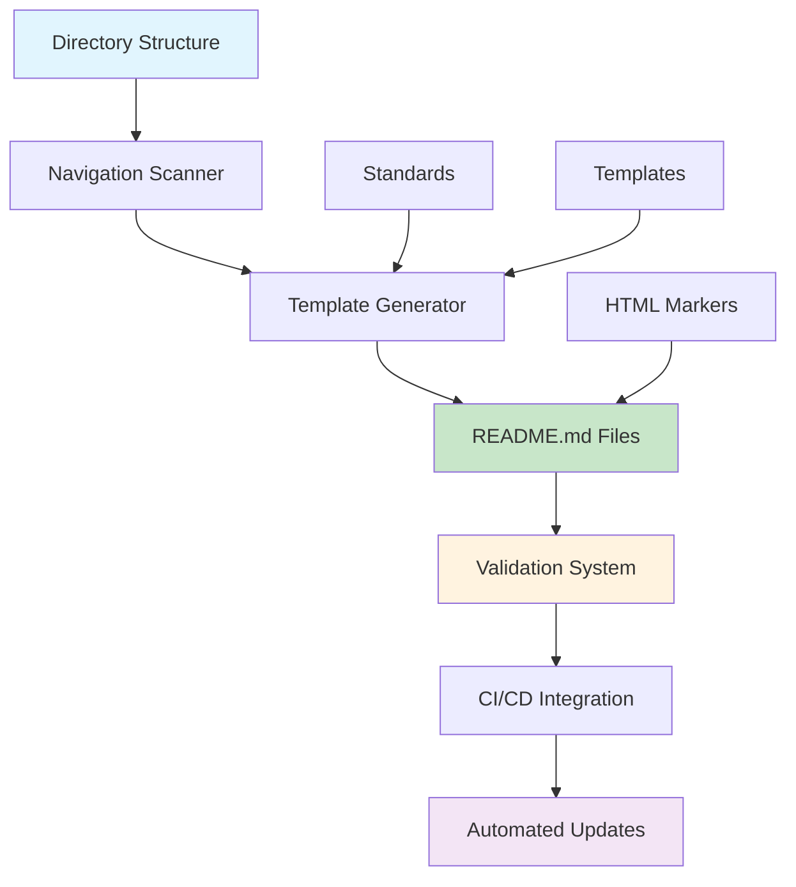

# Documentation System Guide

<!-- NAV_START -->
## Navigation

**Current Location**: [Home](../../README.md) > [Guides](../README.md) > [Documentation](README.md) > Documentation System

### Quick Links

- **📚 [Parent Directory](../README.md)** - Return to guides section
- **🏠 [Documentation Home](../../README.md)** - Main documentation index
- **🔍 [Search Documentation](../../reference/glossary.md)** - Find terms and concepts
- **🤖 [Documentation Automation](documentation-automation.md)** - CI/CD, Mix tasks, and validation

### Related Documentation

- [Cross-Reference Guide](../../_meta/cross-reference-guide.md) - Documentation linking standards
- [Maintenance Process](../../_meta/maintenance-process.md) - How to update documentation
<!-- NAV_END -->

## Overview

This comprehensive guide establishes the standards, templates, and system architecture for implementing a robust documentation navigation system across all `/docs/` directory README.md files. The system ensures consistent, automated navigation that stays synchronized with the actual directory structure.

**Reading Time**: ~15 minutes  
**Implementation Time**: ~2-4 hours  
**Skill Level**: Intermediate

## System Architecture

### Core Components



### System Objectives

1. **Consistency**: Every README.md file follows identical navigation format
2. **Automation**: Navigation sections update automatically when directory structure changes
3. **Synchronization**: Prevent drift between actual structure and navigation links
4. **Maintainability**: Clear processes for ongoing navigation management
5. **Validation**: Automated checking of navigation integrity and link validity

## Navigation Standards

### Standard Template Structure

Every README.md file in the `/docs/` directory must include a standardized navigation section:

```markdown
# [Directory Title]

[Brief description of directory purpose]

<!-- NAV_START -->
## Navigation

**Current Location**: [Breadcrumb Path]

### Subdirectories

| Directory | Description | Key Documents |
|-----------|-------------|---------------|
| [`subdirectory1/`](subdirectory1/) | Purpose of subdirectory1 | [Key Doc 1](subdirectory1/key-doc.md), [Key Doc 2](subdirectory1/other-doc.md) |
| [`subdirectory2/`](subdirectory2/) | Purpose of subdirectory2 | [Important Guide](subdirectory2/guide.md) |

### Quick Links

- **📚 [Parent Directory](../README.md)** - Return to parent level
- **🏠 [Documentation Home](../README.md)** - Main documentation index
- **🔍 [Search Documentation](../reference/glossary.md)** - Find terms and concepts

### Related Documentation

- [Cross-Reference Guide](../_meta/cross-reference-guide.md) - Documentation linking standards
- [Maintenance Process](../_meta/maintenance-process.md) - How to update documentation
<!-- NAV_END -->

[Rest of document content...]
```

### HTML Comment Markers

#### Marker System
Use HTML comments to define navigation section boundaries:

```html
<!-- NAV_START -->
[Navigation content here]
<!-- NAV_END -->
```

#### Marker Rules
1. **Required**: All navigation sections must be wrapped in these markers
2. **Exact Format**: Use exact text `NAV_START` and `NAV_END`
3. **Placement**: Markers must be on separate lines
4. **Content Preservation**: All content outside markers is preserved during updates
5. **Single Section**: Only one navigation section per file

### Section Components

#### 1. Navigation Header
- **Format**: `## Navigation` (level 2 heading)
- **Purpose**: Clearly identifies the navigation section
- **Positioning**: Must be within HTML comment markers

#### 2. Current Location (Breadcrumb)
- **Format**: `**Current Location**: [Link1](path) > [Link2](path) > Current Document`
- **Rules**: 
  - Use bold formatting for "Current Location" label
  - Separate links with ` > ` (space-greater-than-space)
  - Last item should be plain text (current document title)
  - Maximum breadcrumb depth: 5 levels

**Examples**:
```markdown
<!-- Root level -->
**Current Location**: Documentation Home

<!-- Second level -->
**Current Location**: [Home](../README.md) > Guides

<!-- Third level -->
**Current Location**: [Home](../../README.md) > [Guides](../README.md) > Feature Branch Workflow
```

#### 3. Subdirectories Table
- **Format**: Table with exactly 3 columns (Directory, Description, Key Documents)
- **Rules**:
  - Directory column: Use backticks around directory name with trailing slash
  - Directory column: Link to directory (not README.md specifically)
  - Description column: Single sentence, no period at end
  - Key Documents column: Maximum 3 documents, comma-separated
  - Sort directories alphabetically
  - If no subdirectories exist, show: `*No subdirectories in this section.*`

#### 4. Quick Links Section
- **Standard Links**:
  - **Parent Directory**: Always `../README.md`
  - **Documentation Home**: `../` repeated for each level above root
  - **Search Documentation**: Typically points to `reference/glossary.md`
- **Icons**: Use consistent emoji icons (📚 parent, 🏠 home, 🔍 search)

#### 5. Related Documentation Section
- **Standard Links**: Always include cross-reference and maintenance links
- **Custom Links**: Add context-relevant links
- **Maximum**: 5 links total

## Template Variations

### Root Directory Template (docs/README.md)

```markdown
<!-- NAV_START -->
## Navigation

**Current Location**: Documentation Home

### Documentation Sections

| Section | Description | Key Documents |
|---------|-------------|---------------|
| [`core/`](core/) | Essential system architecture and design | [Architecture Overview](core/architecture-overview.md), [Tech Stack](core/tech-stack.md) |
| [`guides/`](guides/) | Step-by-step implementation guides | [Developer Experience](guides/developer-experience.md), [Coding Standards](guides/coding-standards.md) |
| [`operations/`](operations/) | Deployment and maintenance procedures | [Deployment Procedures](operations/deployment-procedures.md) |

### Quick Links

- **🚀 [Getting Started](guides/developer-experience.md)** - New developer onboarding
- **📖 [API Documentation](reference/api-endpoints.md)** - Complete API reference
- **🔧 [Troubleshooting](operations/troubleshooting.md)** - Common issues and solutions

### Related Documentation

- [Cross-Reference Guide](_meta/cross-reference-guide.md) - Documentation linking standards
- [Maintenance Process](_meta/maintenance-process.md) - How to update documentation
<!-- NAV_END -->
```

### Section Directory Template (e.g., docs/guides/README.md)

```markdown
<!-- NAV_START -->
## Navigation

**Current Location**: [Home](../README.md) > Guides

### Available Guides

| Guide | Description | Key Topics |
|-------|-------------|------------|
| [`developer-experience.md`](developer-experience.md) | Complete onboarding guide for new developers | Setup, Tools, Workflow |
| [`coding-standards.md`](coding-standards.md) | Code quality and style guidelines | Formatting, Best Practices, Review |

### Quick Links

- **📚 [Parent Directory](../README.md)** - Return to documentation home
- **🏠 [Documentation Home](../README.md)** - Main documentation index
- **🔍 [Search Documentation](../reference/glossary.md)** - Find terms and concepts

### Related Documentation

- [Cross-Reference Guide](../_meta/cross-reference-guide.md) - Documentation linking standards
- [Operations Guides](../operations/README.md) - Deployment and maintenance procedures
<!-- NAV_END -->
```

### Individual Document Template

```markdown
<!-- NAV_START -->
## Navigation

**Current Location**: [Home](../README.md) > [Guides](README.md) > Feature Branch Workflow

### Quick Links

- **📚 [Parent Directory](README.md)** - Return to guides section
- **🏠 [Documentation Home](../README.md)** - Main documentation index
- **🔍 [Search Documentation](../reference/glossary.md)** - Find terms and concepts

### Related Documentation

- [Cross-Reference Guide](../_meta/cross-reference-guide.md) - Documentation linking standards
- [Git Hooks Implementation](git-hooks-implementation.md) - Related workflow automation
- [GitHub Actions Implementation](github-actions-implementation.md) - CI/CD integration
<!-- NAV_END -->
```

## Directory Description Standards

### Description Requirements
- **Length**: 1-2 sentences maximum
- **Purpose-focused**: Clearly state what the directory contains
- **Action-oriented**: Use active voice
- **Consistent tone**: Professional, helpful language

### Description Templates

#### Feature Directories
```
Implementation guides and procedures for [feature/domain]
```

#### Reference Directories  
```
Quick reference materials and specifications for [topic]
```

#### Architecture Directories
```
Design decisions and architectural documentation for [system/component]
```

#### Operations Directories
```
Deployment, maintenance, and operational procedures for [environment/process]
```

### Custom Descriptions Configuration

```yaml
# docs/.navigation-config.yml
directory_descriptions:
  _meta: "Documentation system metadata and maintenance procedures"
  core: "Essential system architecture and design documentation"
  guides: "Step-by-step implementation and best practice guides"
  operations: "Deployment, monitoring, and maintenance procedures"
  reference: "Quick reference materials and API documentation"
  architecture: "Architectural decisions and system design documentation"
```

## Key Documents Selection

### Selection Criteria
Choose up to 3 key documents per subdirectory based on:

1. **Frequency of Access**: Most commonly referenced files
2. **Entry Points**: Best starting documents for new readers
3. **Critical Information**: Essential procedures or references
4. **Recent Updates**: Recently modified or added content

### Link Format Standards
```markdown
[Document Title](path/to/document.md)
```

### Link Text Guidelines
- **Descriptive**: Use meaningful, descriptive text
- **Consistent**: Follow established naming patterns
- **Concise**: Avoid overly long link text
- **Context-aware**: Provide enough context without being verbose

## System Integration

### Feature Documentation Workflow Enhancement

The navigation system integrates with existing documentation workflows by extending requirements:

| Component | Existing Requirements | New Navigation Requirements |
|-----------|----------------------|----------------------------------|
| **Source Code** | Inline documentation (`@moduledoc`, `@doc`, comments) | Branch-specific documentation templates |
| **API Documentation** | Endpoint specifications, request/response schemas | Automatic API change detection from branch type |
| **User Guides** | Usage instructions, configuration examples | Feature-specific user impact documentation |
| **Technical Specifications** | Architecture impacts, system interactions | Branch impact assessment documentation |
| **Reference Materials** | Updated commands, configuration options | Automated cross-reference validation |
| **Glossary Updates** | New terms, concept definitions | Branch-triggered glossary validation |

### Branch-Specific Documentation Templates

When creating feature branches, the system can auto-generate documentation templates:

```markdown
# Feature Branch Documentation Template
# Auto-generated when creating feature branches

## Feature Overview
<!-- Brief description of the feature being implemented -->

## Documentation Updates Required

### Code Documentation
- [ ] Module documentation updated: `[module_path]`
- [ ] Function documentation added: `[function_list]`
- [ ] Examples provided for all public APIs
- [ ] Inline comments added for complex logic

### API Documentation  
- [ ] Endpoint specifications: `[endpoint_list]`
- [ ] Request/response schemas: `[schema_files]`
- [ ] Authentication requirements documented
- [ ] Error responses specified

### User Documentation
- [ ] User guide updated: `[guide_sections]`
- [ ] Configuration examples provided
- [ ] Troubleshooting section updated
- [ ] Migration guide created (if applicable)

### Cross-References
- [ ] Related documentation links updated
- [ ] Glossary terms added/updated
- [ ] Navigation updated in README.md

## Validation Checklist
- [ ] Documentation completeness validated
- [ ] Cross-reference integrity verified
- [ ] Glossary compliance checked
- [ ] Links tested and functional

## Integration Points
- Related to: [Link to related documentation]
- Impacts: [List of affected documentation sections]
- Dependencies: [Documentation dependencies]
```

## Documentation Tasks Refactoring

### Refactored Module Hierarchy

The documentation system leverages a well-organized module hierarchy that eliminates code duplication and creates focused testable components:

```
apps/prismatic/lib/mix/tasks/docs/
├── dispatcher.ex                 # Main command dispatcher
├── shared/                       # Shared utilities
│   ├── config.ex                # Configuration management
│   ├── error_handler.ex         # Centralized error handling
│   ├── output_formatter.ex      # Output formatting and file handling
│   └── progress_monitor.ex      # Progress tracking
└── tasks/                       # Individual task implementations
    ├── analyze.ex               # Comprehensive analysis
    ├── extract_adrs.ex          # ADR extraction
    ├── extract_examples.ex      # Code example extraction
    ├── trace.ex                 # Traceability analysis
    ├── ai_data.ex              # AI data generation
    ├── validate.ex             # Documentation validation
    └── report.ex               # Report generation
```

### Key Improvements

#### 1. Single Responsibility Principle
Each module now has a single, well-defined responsibility:
- **Dispatcher**: Route commands to appropriate task modules
- **Config**: Manage configuration and validation
- **ErrorHandler**: Provide consistent error handling and troubleshooting
- **OutputFormatter**: Handle all output formats (JSON, YAML, HTML, text)
- **ProgressMonitor**: Manage progress tracking for long-running operations
- **Task modules**: Implement specific analysis functionality

#### 2. Code Duplication Elimination
Common functionality has been extracted into shared modules:
- Option parsing and validation → [`Config`](../../apps/prismatic/lib/mix/tasks/docs/shared/config.ex)
- Output file handling → [`OutputFormatter`](../../apps/prismatic/lib/mix/tasks/docs/shared/output_formatter.ex)
- Error handling → [`ErrorHandler`](../../apps/prismatic/lib/mix/tasks/docs/shared/error_handler.ex)
- Progress monitoring → [`ProgressMonitor`](../../apps/prismatic/lib/mix/tasks/docs/shared/progress_monitor.ex)

#### 3. Consistent Coding Patterns
All modules follow the same patterns:

```elixir
defmodule Mix.Tasks.Docs.Tasks.ExampleTask do
  use Mix.Task
  
  alias Mix.Tasks.Docs.Shared.{Config, ErrorHandler, OutputFormatter, ProgressMonitor}
  
  @impl Mix.Task
  def run(args) do
    ErrorHandler.safe_execute("task_name", "operation", fn ->
      case parse_and_validate_options(args) do
        {:ok, %{help: true}} -> show_help()
        {:ok, options} -> execute_task(options)
        {:error, reason} -> ErrorHandler.handle_validation_error(reason, "task_name")
      end
    end)
  end
  
  # Implementation...
end
```

### Backward Compatibility

The refactored system maintains complete backward compatibility:

- **Command Interface**: All existing commands continue to work exactly as before
- **API Compatibility**: The main [`Mix.Tasks.Docs`](../../apps/prismatic/lib/mix/tasks/docs.ex) module maintains the same public interface
- **Output Formats**: All output formats remain identical (JSON, YAML, HTML, text)

## Positioning Requirements

### Document Structure Requirements

Every README.md file should follow this structure:

```markdown
# Document Title

Brief description of the document's purpose (1-3 paragraphs maximum).

<!-- NAV_START -->
## Navigation
[Navigation content as specified above]
<!-- NAV_END -->

## First Content Section

[Main document content begins here]
```

### Positioning Guidelines

#### 1. After Title and Description
- Navigation must come after the main title (`# Title`)
- Navigation must come after the brief description
- Brief description should be 1-3 paragraphs maximum
- Leave one blank line before `<!-- NAV_START -->`

#### 2. Before Main Content
- Navigation must come before all other content sections
- Navigation should be within the first 20% of document
- Leave one blank line after `<!-- NAV_END -->`

#### 3. Visual Separation
- Clear visual separation from title/description above
- Clear visual separation from main content below
- Consistent whitespace around navigation section

## Quality Assurance

### Template Compliance Validation

- [ ] Navigation section wrapped in HTML comment markers
- [ ] Correct heading levels used (## for Navigation, ### for subsections)
- [ ] Breadcrumb shows accurate path
- [ ] Subdirectories table has correct format and columns
- [ ] Quick links use standard emojis and descriptions
- [ ] Related documentation includes standard links
- [ ] All links use relative paths
- [ ] No broken links or missing files
- [ ] Consistent formatting and spacing

### Content Quality Validation

- [ ] Directory descriptions are concise and informative
- [ ] Key documents represent most important/useful files
- [ ] Breadcrumb accurately reflects directory hierarchy
- [ ] Related links are relevant to current section
- [ ] No duplicate links within navigation section
- [ ] All descriptions follow consistent style and tone

## Common Mistakes and Corrections

### Incorrect HTML Markers

❌ **Wrong**:
```html
<!-- NAVIGATION_START -->
<!-- NAV_BEGIN -->
<!-- START_NAV -->
```

✅ **Correct**:
```html
<!-- NAV_START -->
<!-- NAV_END -->
```

### Incorrect Heading Levels

❌ **Wrong**:
```markdown
# Navigation
### Navigation
#### Subdirectories
```

✅ **Correct**:
```markdown
## Navigation
### Subdirectories
```

### Incorrect Link Formats

❌ **Wrong**:
```markdown
| [subdirectory](subdirectory/README.md) | Description | Links |
| subdirectory/ | Description | Links |
```

✅ **Correct**:
```markdown
| [`subdirectory/`](subdirectory/) | Description | Links |
```

### Incorrect Path Calculations

❌ **Wrong**:
```markdown
**Current Location**: [Home](/README.md) > [Guides](/guides/README.md)
```

✅ **Correct**:
```markdown
**Current Location**: [Home](../README.md) > [Guides](README.md)
```

## Security Considerations

### Content Security
1. **Input Validation**: Validate all directory names and file paths
2. **Path Traversal**: Prevent directory traversal attacks
3. **Content Sanitization**: Sanitize generated markdown content
4. **Permission Checks**: Verify file system permissions

### Automation Security
1. **CI/CD Tokens**: Secure storage of automation tokens
2. **Commit Signing**: Sign automated commits
3. **Access Control**: Limit automation permissions
4. **Audit Logging**: Log all automated changes

## Performance Considerations

### Optimization Strategies
1. **Incremental Updates**: Only update changed directories
2. **Caching**: Cache directory structure between runs
3. **Parallel Processing**: Process multiple directories simultaneously
4. **Selective Scanning**: Skip unchanged directories

### Performance Monitoring
- **Update Time**: Track time for full navigation updates
- **Validation Speed**: Monitor validation performance
- **File Size Impact**: Measure impact on repository size
- **CI/CD Performance**: Monitor pipeline execution time

## Success Metrics

### Quantitative Metrics
- **Navigation Compliance**: Percentage of README.md files with proper navigation
- **Link Validity**: Percentage of working navigation links
- **Synchronization Rate**: Frequency of navigation-directory mismatches
- **Update Frequency**: How often navigation updates are needed

### Qualitative Metrics
- **User Satisfaction**: Developer feedback on navigation usefulness
- **Documentation Discoverability**: Ease of finding relevant documentation
- **Maintenance Burden**: Time spent on navigation maintenance
- **Adoption Rate**: Usage of automated navigation tools

## Related Documentation

- [Documentation Automation Guide](documentation-automation.md) - CI/CD, Mix tasks, validation, and migration
- [Cross-Reference Guide](../../_meta/cross-reference-guide.md) - Documentation linking standards
- [Maintenance Process](../../_meta/maintenance-process.md) - General documentation maintenance
- [Naming Conventions](../../_meta/naming-conventions.md) - File and directory naming standards
- [Feature Documentation Workflow](../../_meta/feature-documentation-workflow.md) - Documentation workflow integration

---

**This navigation system ensures consistent, automated, and maintainable documentation navigation across the entire `/docs/` directory structure while integrating seamlessly with development workflows.**