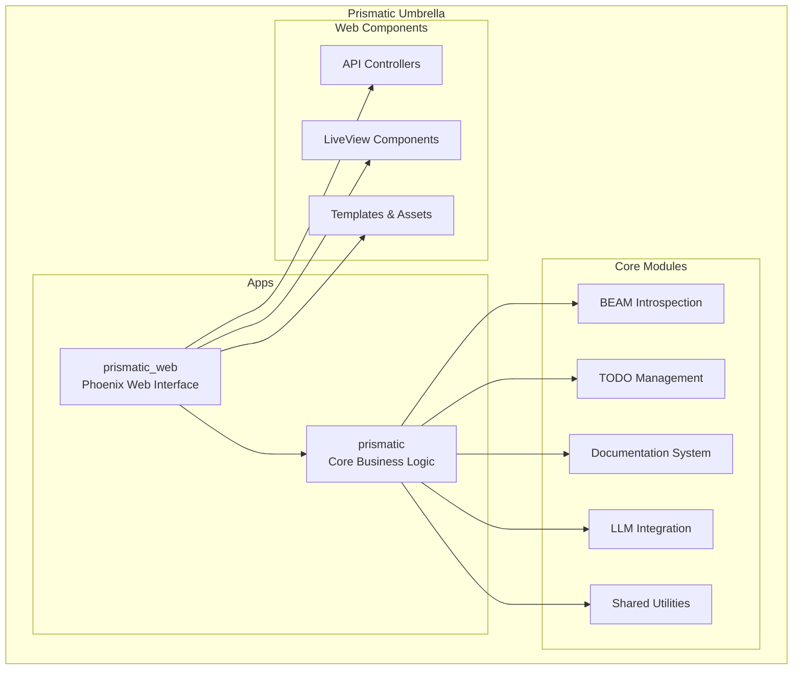
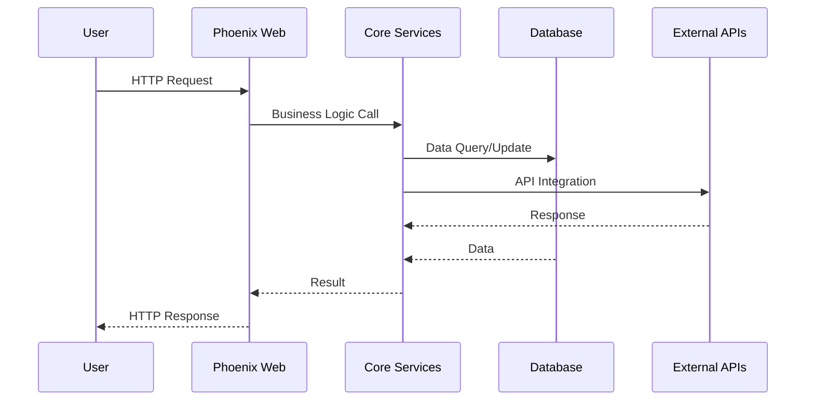

<!-- NAV_START -->
<div align="center">
  <strong>🧭 Project Orientation Guide</strong><br>
  <em>Understanding the Prismatic codebase, architecture, and key components</em><br><br>
  
  <a href="../../README.md">🏠 Home</a> | 
  <a href="../README.md">📖 All Guides</a> | 
  <a href="README.md">🚀 Getting Started</a><br>
  
  <strong>Quick Links:</strong>
  <a href="new-contributor-quickstart.md">Quick Start</a> |
  <a href="first-time-setup.md">First-Time Setup</a> |
  <a href="contribution-workflow.md">Contribution Workflow</a>
</div>

### Related Documentation
- [Architecture Overview](../../architecture/README.md) - Detailed system architecture
- [API Reference](../../api/README.md) - Generated API documentation
- [Development Guide](../development/README.md) - Development practices and standards
- [Mix Tasks Guide](../mix-tasks/README.md) - Prismatic-specific commands
<!-- NAV_END -->

# Project Orientation Guide

> **🎯 Learn the Codebase**  
> This guide helps new contributors understand the Prismatic project architecture, navigate the codebase effectively, and locate key components and resources.

## Table of Contents

- [Project Overview](#project-overview)
- [Architecture Deep Dive](#architecture-deep-dive)
- [Codebase Navigation](#codebase-navigation)
- [Key Files & Directories](#key-files--directories)
- [Core Modules Guide](#core-modules-guide)
- [Development Patterns](#development-patterns)
- [Communication & Help](#communication--help)
- [Learning Path](#learning-path)

## Project Overview

### What is Prismatic?

**Prismatic** is an advanced AI agent framework built with Elixir/Phoenix that provides:

- 🔍 **BEAM VM Introspection** - Deep runtime analysis and monitoring
- 📝 **TODO Management System** - Automated discovery, analysis, and tracking
- 📚 **Documentation Generation** - Intelligent documentation management
- 🔧 **Consolidation Tools** - Advanced dependency mapping and conflict resolution
- 🌐 **Web Interface** - Phoenix-based web UI with LiveView

### Core Philosophy

**Enterprise-Grade Quality**
- Production-ready components with comprehensive testing
- Fault-tolerant design using OTP principles
- Scalable architecture for enterprise deployments

**Developer Experience First**
- Extensive documentation and examples
- Comprehensive tooling and automation
- Clear error messages and debugging support

**Community-Driven**
- Open contribution process
- Transparent development practices
- Comprehensive onboarding for new contributors

## Architecture Deep Dive

### Umbrella Application Structure

Prismatic uses Phoenix's umbrella application pattern for clean separation:



### Application Boundaries

**[`apps/prismatic/`](../../../apps/prismatic/)** - Core Application
- Business logic and domain models
- Mix tasks and CLI tools
- Core services and protocols
- Database schemas and migrations

**[`apps/prismatic_web/`](../../../apps/prismatic_web/)** - Web Application
- Phoenix controllers and routes
- LiveView interfaces
- Web-specific logic and templates
- API endpoints

### Data Flow Architecture



## Codebase Navigation

### Quick Exploration Commands

```bash
# Get overview of project structure
tree -d -L 3

# Find all Elixir modules
find . -name "*.ex" | head -20

# Search for specific functionality
grep -r "TODO" apps/prismatic/lib --include="*.ex"

# View module documentation
mix docs && open doc/index.html

# See all available Mix tasks
mix help | grep prismatic
```

### Navigating by Feature

#### BEAM VM Introspection
```bash
# Core module
less apps/prismatic/lib/prismatic/beam/introspection.ex

# Tests
less apps/prismatic/test/prismatic/beam/introspection_test.exs

# Mix tasks
ls apps/prismatic/lib/mix/tasks/prismatic/beam/

# Try it out
mix prismatic.beam.inspect --target=system
```

#### TODO Management System
```bash
# Scanner module
less apps/prismatic/lib/prismatic/todo/scanner.ex

# Parser logic
less apps/prismatic/lib/prismatic/todo/parser.ex

# Mix tasks
ls apps/prismatic/lib/mix/tasks/prismatic/todo/

# Test scanning
mix prismatic.todo.scan --paths="lib" --format=json
```

#### Documentation System
```bash
# Core docs module
less apps/prismatic/lib/prismatic/docs/generator.ex

# Analysis tools
less apps/prismatic/lib/prismatic/docs/analyzer.ex

# Try documentation generation
mix prismatic.docs.generate --format=html
```

### Code Reading Strategy

**1. Start with Tests** (Recommended for beginners)
```bash
# Tests often show usage patterns clearly
less test/prismatic/todo/scanner_test.exs

# Look for integration tests
find test -name "*integration*" -type f
```

**2. Follow the Mix Tasks**
```bash
# Mix tasks show practical usage
less lib/mix/tasks/prismatic/todo/scan.ex

# See all available tasks
find lib/mix/tasks -name "*.ex" | sort
```

**3. Explore Core Modules**
```bash
# Start with module documentation
head -50 apps/prismatic/lib/prismatic/todo/scanner.ex

# Look at public API functions
grep -n "def " apps/prismatic/lib/prismatic/todo/scanner.ex
```

## Key Files & Directories

### Essential Configuration Files

| File | Purpose | What to Know |
|------|---------|---------------|
| [`mix.exs`](../../../mix.exs) | Main project config | Dependencies, aliases, docs config |
| [`config/config.exs`](../../../config/config.exs) | Application config | Environment settings, feature flags |
| [`config/dev.exs`](../../../config/dev.exs) | Development config | Database, debugging, live reload |
| [`config/test.exs`](../../../config/test.exs) | Test environment | Test database, logging levels |
| [`config/prod.exs`](../../../config/prod.exs) | Production config | Performance, security settings |

### Core Business Logic

```
apps/prismatic/lib/prismatic/
├── beam/                    # BEAM VM introspection
│   ├── introspection.ex    # Main introspection module
│   ├── process_analyzer.ex # Process analysis
│   └── memory_tracker.ex   # Memory monitoring
├── todo/                   # TODO management system
│   ├── scanner.ex          # File scanning logic
│   ├── parser.ex           # TODO comment parsing
│   ├── analyzer.ex         # TODO analysis
│   └── reporter.ex         # Report generation
├── docs/                   # Documentation system
│   ├── generator.ex        # Doc generation
│   ├── analyzer.ex         # Gap analysis
│   └── validator.ex        # Link validation
├── llm/                    # LLM integration
│   ├── backend/            # LLM backends
│   └── impl/               # Implementations
└── shared/                 # Shared utilities
    ├── utils.ex            # Common utilities
    ├── file_utils.ex       # File operations
    └── config.ex           # Configuration helpers
```

### Mix Tasks (CLI Interface)

```
apps/prismatic/lib/mix/tasks/prismatic/
├── beam/
│   ├── inspect.ex          # BEAM inspection commands
│   └── monitor.ex          # System monitoring
├── todo/
│   ├── scan.ex             # TODO scanning
│   ├── analyze.ex          # TODO analysis
│   └── report.ex           # Report generation
├── docs/
│   ├── generate.ex         # Documentation generation
│   ├── analyze.ex          # Documentation analysis
│   └── validate.ex         # Validation tools
└── consolidation/
    ├── analyze.ex          # Dependency analysis
    ├── resolve.ex          # Conflict resolution
    └── plan.ex             # Migration planning
```

### Web Interface Components

```
apps/prismatic_web/lib/prismatic_web/
├── controllers/            # REST API endpoints
│   ├── todo_controller.ex  # TODO API endpoints
│   ├── beam_controller.ex  # BEAM introspection API
│   └── docs_controller.ex  # Documentation API
├── live/                   # LiveView interfaces
│   ├── todo_live.ex        # TODO management UI
│   ├── beam_live.ex        # System monitoring UI
│   └── dashboard_live.ex   # Main dashboard
├── components/             # Reusable components
│   ├── todo_component.ex   # TODO display components
│   └── chart_component.ex  # Data visualization
└── templates/              # HTML templates
    └── layout/             # Application layouts
```

### Testing Structure

```
test/
├── integration/            # End-to-end tests
│   ├── todo_workflow_test.exs
│   └── beam_introspection_test.exs
├── prismatic/              # Unit tests
│   ├── beam/
│   ├── todo/
│   ├── docs/
│   └── shared/
└── support/                # Test helpers
    ├── fixtures/           # Test data
    ├── factory.ex          # Test data generation
    └── test_helpers.ex     # Common test utilities
```

## Core Modules Guide

### 1. BEAM Introspection System

**Purpose:** Deep runtime analysis of the BEAM VM

**Key Modules:**
- [`Prismatic.BEAM.Introspection`](../../../apps/prismatic/lib/prismatic/beam/introspection.ex) - Main interface
- [`Prismatic.BEAM.ProcessAnalyzer`](../../../apps/prismatic/lib/prismatic/beam/process_analyzer.ex) - Process analysis
- [`Prismatic.BEAM.MemoryTracker`](../../../apps/prismatic/lib/prismatic/beam/memory_tracker.ex) - Memory monitoring

**Common Usage:**
```elixir
# Get system overview
{:ok, info} = Prismatic.BEAM.Introspection.system_info()

# Analyze specific process
{:ok, analysis} = Prismatic.BEAM.Introspection.analyze_process(pid)

# Monitor memory usage
{:ok, monitor} = Prismatic.BEAM.Introspection.start_memory_monitor()
```

**CLI Commands:**
```bash
mix prismatic.beam.inspect --target=system
mix prismatic.beam.inspect --target=processes
mix prismatic.beam.monitor --duration=60
```

### 2. TODO Management System

**Purpose:** Automated TODO discovery, analysis, and lifecycle management

**Key Modules:**
- [`Prismatic.TODO.Scanner`](../../../apps/prismatic/lib/prismatic/todo/scanner.ex) - File scanning
- [`Prismatic.TODO.Parser`](../../../apps/prismatic/lib/prismatic/todo/parser.ex) - Comment parsing
- [`Prismatic.TODO.Analyzer`](../../../apps/prismatic/lib/prismatic/todo/analyzer.ex) - Analysis and categorization
- [`Prismatic.TODO.Reporter`](../../../apps/prismatic/lib/prismatic/todo/reporter.ex) - Report generation

**Common Usage:**
```elixir
# Scan for TODOs
{:ok, results} = Prismatic.TODO.Scanner.scan_directories(["lib", "apps"])

# Analyze TODO patterns
{:ok, analysis} = Prismatic.TODO.Analyzer.analyze_todos(results.todos)

# Generate reports
{:ok, report} = Prismatic.TODO.Reporter.generate_report(analysis, :html)
```

**CLI Commands:**
```bash
mix prismatic.todo.scan --paths="lib,apps" --format=json
mix prismatic.todo.analyze --input=scan_results.json
mix prismatic.todo.report --type=executive --format=html
```

### 3. Documentation System

**Purpose:** Intelligent documentation generation and analysis

**Key Modules:**
- [`Prismatic.Docs.Generator`](../../../apps/prismatic/lib/prismatic/docs/generator.ex) - Documentation generation
- [`Prismatic.Docs.Analyzer`](../../../apps/prismatic/lib/prismatic/docs/analyzer.ex) - Gap analysis
- [`Prismatic.Docs.Validator`](../../../apps/prismatic/lib/prismatic/docs/validator.ex) - Link and reference validation

**Common Usage:**
```elixir
# Generate documentation
{:ok, docs} = Prismatic.Docs.Generator.generate_all()

# Analyze documentation gaps
{:ok, gaps} = Prismatic.Docs.Analyzer.find_documentation_gaps()

# Validate documentation
{:ok, validation} = Prismatic.Docs.Validator.validate_all_links()
```

**CLI Commands:**
```bash
mix prismatic.docs.generate --format=html,markdown
mix prismatic.docs.analyze --check-gaps
mix prismatic.docs.validate --check-links
```

### 4. Shared Utilities

**Purpose:** Common utilities used across all modules

**Key Modules:**
- [`Prismatic.Shared.Utils`](../../../apps/prismatic/lib/prismatic/shared/utils.ex) - General utilities
- [`Prismatic.Shared.FileUtils`](../../../apps/prismatic/lib/prismatic/shared/file_utils.ex) - File operations
- [`Prismatic.Shared.Config`](../../../apps/prismatic/lib/prismatic/shared/config.ex) - Configuration management

**Common Patterns:**
```elixir
# File operations
{:ok, files} = Prismatic.Shared.FileUtils.find_files("lib", ~r/\.ex$/)

# Configuration access
config = Prismatic.Shared.Config.get_config(:todo, :scan_patterns)

# Common utilities
result = Prismatic.Shared.Utils.safe_execute(fn -> risky_operation() end)
```

## Development Patterns

### Error Handling Patterns

**Consistent Return Types:**
```elixir
# Standard success/error tuples
{:ok, result} | {:error, reason}

# With bang versions for exceptions
process_data!(data)  # Raises on error
```

**Using `with` for Complex Operations:**
```elixir
def complex_operation(params) do
  with {:ok, validated} <- validate_params(params),
       {:ok, processed} <- process_data(validated),
       {:ok, result} <- finalize_result(processed) do
    {:ok, result}
  else
    {:error, reason} -> {:error, reason}
    error -> {:error, {:unexpected_error, error}}
  end
end
```

### Configuration Patterns

**Application Configuration:**
```elixir
# In config files
config :prismatic, Prismatic.TODO.Scanner,
  default_patterns: ["TODO", "FIXME", "HACK"],
  exclude_dirs: ["deps", "_build", "node_modules"],
  max_file_size: 1_000_000

# In modules
defp get_config(key, default \\ nil) do
  Application.get_env(:prismatic, __MODULE__, [])
  |> Keyword.get(key, default)
end
```

### Testing Patterns

**Comprehensive Test Structure:**
```elixir
defmodule Prismatic.TODO.ScannerTest do
  use ExUnit.Case, async: true
  doctest Prismatic.TODO.Scanner
  
  describe "scan_files/2" do
    test "finds TODO comments in Elixir files" do
      # Test implementation
    end
    
    test "handles files with no TODOs" do
      # Test implementation
    end
    
    test "respects exclude patterns" do
      # Test implementation
    end
  end
end
```

### Documentation Patterns

**Module Documentation:**
```elixir
defmodule Prismatic.TODO.Scanner do
  @moduledoc """
  Provides file scanning functionality for TODO detection.
  
  The scanner supports multiple comment formats and provides
  configurable filtering and analysis options.
  
  ## Examples
  
      iex> Scanner.scan_files(["lib/my_module.ex"])
      {:ok, %{todos: [...], stats: %{}}}
  
  ## Configuration
  
      config :prismatic, Prismatic.TODO.Scanner,
        patterns: ["TODO", "FIXME"],
        exclude_dirs: ["deps"]
  """
end
```

## Communication & Help

### Getting Help

**🆘 Immediate Help (< 1 hour response)**

1. **Search Existing Documentation**
   ```bash
   # Search all documentation
   grep -r "your topic" docs/
   
   # Search API docs
   mix docs && grep -r "function_name" doc/
   ```

2. **Check GitHub Issues**
   ```bash
   # Search existing issues
   gh issue list --search "your topic"
   
   # Look at closed issues for solutions
   gh issue list --state closed --search "error message"
   ```

3. **Review Test Examples**
   ```bash
   # Find usage examples in tests
   find test -name "*.exs" -exec grep -l "YourModule" {} \;
   ```

**🤝 Community Help (1-24 hours response)**

4. **GitHub Discussions**
   - General questions: [Project Discussions](https://github.com/korczis/prismatic/discussions)
   - Feature requests: [Ideas Category](https://github.com/korczis/prismatic/discussions/categories/ideas)
   - Show and tell: [Share your work](https://github.com/korczis/prismatic/discussions/categories/show-and-tell)

5. **Create GitHub Issues**
   - Bug reports: Use the bug report template
   - Feature requests: Use the feature request template
   - Documentation issues: Use the documentation template

### Communication Channels

**📝 Asynchronous Communication (Preferred)**
- **GitHub Issues** - Bug reports, feature requests
- **GitHub Discussions** - Questions, ideas, general discussion
- **Pull Request Comments** - Code-specific discussions
- **Documentation Comments** - Suggestions for improving docs

**💬 Real-time Communication**
- **Code Reviews** - Best place for learning and getting help
- **GitHub Live Comments** - During active PR discussions
- **Project Calls** - Monthly contributor meetings (when established)

### Asking Good Questions

**❌ Poor Question:**
> "The TODO scanner doesn't work. Help!"

**✅ Good Question:**
> **Title:** "TODO scanner fails with 'file not found' error when scanning apps/ directory"
> 
> **Description:**
> I'm trying to scan for TODOs in the `apps/` directory but getting this error:
> 
> ```
> ** (File.Error) could not read file "apps/prismatic/lib/prismatic/todo": no such file or directory
> ```
> 
> **Environment:**
> - Elixir 1.17.2
> - macOS 13.2
> - Fresh clone from main branch
> 
> **Steps to reproduce:**
> 1. `git clone https://github.com/korczis/prismatic.git`
> 2. `cd prismatic && mix deps.get`
> 3. `mix prismatic.todo.scan --paths="apps"`
> 
> **Expected behavior:**
> Should scan all `.ex` files in the apps directory and find TODO comments.
> 
> **Actual behavior:**
> Fails with file not found error.
> 
> **Additional context:**
> The directory exists and contains files. Running `ls -la apps/prismatic/lib/prismatic/todo/` shows several `.ex` files.

### Team Processes

**📋 Issue Triage Process**
1. **New issues** are labeled within 48 hours
2. **Bug reports** get priority labels (P0-P3)
3. **Feature requests** are evaluated for roadmap fit
4. **Good first issues** are identified for new contributors

**🔄 Code Review Process**
1. **Initial review** within 1-2 business days
2. **Follow-up reviews** within 24 hours
3. **Approval and merge** within 1 business day after approval
4. **Emergency fixes** fast-tracked same day

**📅 Release Process**
1. **Minor releases** every 2-4 weeks
2. **Patch releases** as needed for bug fixes
3. **Major releases** quarterly with breaking changes
4. **Pre-release testing** in staging environment

## Learning Path

### Week 1: Foundation

**Day 1-2: Environment and Overview**
- [ ] Complete [First-Time Setup Guide](first-time-setup.md)
- [ ] Run all Prismatic Mix tasks to see capabilities
- [ ] Read main [README.md](../../../README.md) thoroughly
- [ ] Explore project structure with `tree` command

**Day 3-4: Core Concepts**
- [ ] Study [Architecture Overview](../../architecture/README.md)
- [ ] Read through one core module completely (start with TODO scanner)
- [ ] Run comprehensive tests and understand test structure
- [ ] Generate and browse API documentation

**Day 5-7: First Contribution**
- [ ] Find a good first issue or documentation improvement
- [ ] Follow [Contribution Workflow Guide](contribution-workflow.md)
- [ ] Submit your first PR
- [ ] Participate in code review process

### Week 2: Deep Dive

**Understanding Business Logic**
- [ ] Study all four core systems (BEAM, TODO, Docs, LLM)
- [ ] Understand how Mix tasks expose functionality
- [ ] Learn the shared utilities and common patterns
- [ ] Explore the web interface and API endpoints

**Development Skills**
- [ ] Master the testing patterns used in the project
- [ ] Understand error handling and configuration patterns
- [ ] Learn the documentation standards and tooling
- [ ] Practice code review by reviewing others' PRs

### Week 3: Advanced Contributions

**Technical Depth**
- [ ] Understand OTP patterns used in the project
- [ ] Learn Phoenix and LiveView patterns
- [ ] Study database schemas and migrations
- [ ] Explore deployment and operations aspects

**Community Participation**
- [ ] Help other new contributors
- [ ] Suggest improvements to documentation or processes
- [ ] Participate in technical discussions
- [ ] Consider becoming a regular contributor

### Month 2+: Expertise Building

**Specialized Knowledge**
- [ ] Become expert in one or more core systems
- [ ] Contribute to architectural decisions
- [ ] Mentor new contributors
- [ ] Lead feature development

**Project Leadership**
- [ ] Help with issue triage and management
- [ ] Contribute to roadmap and planning
- [ ] Represent the project in community forums
- [ ] Consider maintainer responsibilities

---

**🎯 Success Metrics**

After following this orientation guide, you should be able to:

- ✅ **Navigate the codebase** confidently and find relevant code quickly
- ✅ **Understand the architecture** and how components interact
- ✅ **Identify where to make changes** for different types of issues
- ✅ **Use all the development tools** effectively (tests, docs, CLI)
- ✅ **Get help quickly** when you encounter problems
- ✅ **Contribute meaningfully** to code reviews and discussions

**📚 Continuous Learning**

- Study merged PRs to learn from other contributors
- Read Elixir and Phoenix documentation for deeper understanding
- Participate in the broader Elixir community
- Share your knowledge by improving documentation

**🌟 Next Steps**

You're now ready to make meaningful contributions to Prismatic! Choose a path:

- **🐛 Bug Fixer**: Look for issues labeled `bug` and `good first issue`
- **📝 Documentation Improver**: Find gaps in documentation or examples
- **✨ Feature Developer**: Explore `enhancement` and `feature request` issues
- **🧪 Test Writer**: Improve test coverage or add integration tests
- **🎨 UI/UX Contributor**: Work on the Phoenix web interface

**Remember**: Every expert was once a beginner. Take your time, ask questions, and enjoy the journey of learning this powerful codebase!