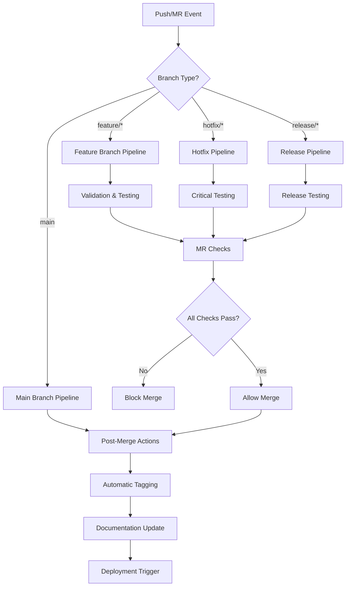

# GitLab CI Implementation Guide

## Overview

This document provides comprehensive specifications for GitLab CI/CD pipelines that enforce the feature branch workflow, provide automated testing, and handle semantic versioning with automatic tagging as an alternative or complement to GitHub Actions.

## Pipeline Architecture



## Configuration Files Structure

All pipeline files are configured in the repository root:

```
.gitlab-ci.yml                  # Main pipeline configuration
.gitlab/
├── ci/
│   ├── branch-protection.yml   # Branch validation jobs
│   ├── testing.yml            # Test execution jobs
│   ├── security.yml           # Security scanning jobs
│   ├── release.yml            # Release and tagging jobs
│   └── deployment.yml         # Deployment automation
└── merge_request_templates/
    └── default.md             # MR template with checklist
```

## Main Pipeline Configuration

**File**: `.gitlab-ci.yml`

```yaml
# GitLab CI Configuration for Prismatic Feature Branch Workflow

# Global settings
default:
  image: elixir:1.15.7
  
variables:
  MIX_ENV: "test"
  POSTGRES_DB: "prismatic_test"
  POSTGRES_USER: "postgres"
  POSTGRES_PASSWORD: "postgres"
  POSTGRES_HOST: "postgres"
  DATABASE_URL: "postgresql://$POSTGRES_USER:$POSTGRES_PASSWORD@$POSTGRES_HOST/$POSTGRES_DB"

# Pipeline stages
stages:
  - validate
  - test
  - security
  - build
  - release
  - deploy

# Include additional pipeline configurations
include:
  - local: '.gitlab/ci/branch-protection.yml'
  - local: '.gitlab/ci/testing.yml'
  - local: '.gitlab/ci/security.yml'
  - local: '.gitlab/ci/release.yml'
  - local: '.gitlab/ci/deployment.yml'

# Cache configuration for dependencies
.cache_template: &cache_definition
  cache:
    key: "$CI_COMMIT_REF_SLUG-$MIX_ENV"
    paths:
      - deps/
      - _build/
    policy: pull-push

# Before script template
.before_script_template: &before_script_definition
  before_script:
    - apt-get update -qq && apt-get install -y -qq git nodejs npm
    - mix local.hex --force
    - mix local.rebar --force
    - mix deps.get --only $MIX_ENV
    - mix deps.compile

# Basic job template
.basic_job:
  <<: *cache_definition
  <<: *before_script_definition
  
# Test services
services:
  - name: postgres:15
    alias: postgres
    variables:
      POSTGRES_DB: $POSTGRES_DB
      POSTGRES_USER: $POSTGRES_USER
      POSTGRES_PASSWORD: $POSTGRES_PASSWORD
```

## Branch Protection Configuration

**File**: `.gitlab/ci/branch-protection.yml`

```yaml
# Branch protection and validation jobs

# Prevent direct pushes to main branch
validate:direct-push-protection:
  stage: validate
  script:
    - |
      if [ "$CI_COMMIT_BRANCH" = "main" ] && [ "$CI_PIPELINE_SOURCE" = "push" ]; then
        echo "❌ Direct pushes to main branch are not allowed!"
        echo "Use feature branch workflow:"
        echo "1. Create feature branch: git checkout -b feature/description"
        echo "2. Push branch: git push origin feature/description"
        echo "3. Create merge request"
        echo "4. Merge via GitLab interface"
        exit 1
      fi
  rules:
    - if: '$CI_COMMIT_BRANCH == "main" && $CI_PIPELINE_SOURCE == "push"'
      when: always
  allow_failure: false

# Validate branch naming for merge requests
validate:branch-naming:
  stage: validate
  script:
    - |
      if [ -n "$CI_MERGE_REQUEST_SOURCE_BRANCH_NAME" ]; then
        BRANCH_NAME="$CI_MERGE_REQUEST_SOURCE_BRANCH_NAME"
        echo "🔍 Validating branch name: $BRANCH_NAME"
        
        # Branch naming pattern
        PATTERN="^(feature|bugfix|hotfix|release|chore|docs)/[a-z0-9-]+$"
        
        if [[ ! $BRANCH_NAME =~ $PATTERN ]]; then
          echo "❌ Invalid branch name: $BRANCH_NAME"
          echo "Must follow pattern: type/description"
          echo "Valid types: feature, bugfix, hotfix, release, chore, docs"
          echo "Example: feature/user-authentication"
          exit 1
        fi
        
        echo "✅ Branch name is valid"
      fi
  rules:
    - if: '$CI_PIPELINE_SOURCE == "merge_request_event"'
      when: always

# Validate commit message format
validate:commit-message:
  stage: validate
  script:
    - |
      echo "📝 Validating commit message format..."
      COMMIT_MSG=$(git log -1 --pretty=%B)
      echo "Commit message: $COMMIT_MSG"
      
      # Skip validation for merge commits
      if [[ $COMMIT_MSG =~ ^Merge ]]; then
        echo "✅ Merge commit - skipping validation"
        exit 0
      fi
      
      # Conventional commit pattern
      PATTERN="^(feat|fix|docs|style|refactor|test|chore|perf|ci|build|revert)(\(.+\))?: .{1,72}"
      
      if [[ ! $COMMIT_MSG =~ $PATTERN ]]; then
        echo "❌ Invalid commit message format"
        echo "Valid format: type(scope): description"
        echo "Types: feat, fix, docs, style, refactor, test, chore, perf, ci, build, revert"
        echo "Examples:"
        echo "- feat(auth): add user login functionality"
        echo "- fix(api): resolve memory leak in user service"
        echo "- docs: update installation instructions"
        exit 1
      fi
      
      echo "✅ Commit message format is valid"
  rules:
    - if: '$CI_PIPELINE_SOURCE == "push" || $CI_PIPELINE_SOURCE == "merge_request_event"'
      when: always

# Check if branch is up to date with main
validate:branch-sync:
  stage: validate
  script:
    - |
      if [ -n "$CI_MERGE_REQUEST_SOURCE_BRANCH_NAME" ] && [ "$CI_MERGE_REQUEST_SOURCE_BRANCH_NAME" != "main" ]; then
        echo "🔄 Checking if branch is up to date with main..."
        
        # Fetch latest main
        git fetch origin main:main
        
        # Check if branch needs rebasing
        MERGE_BASE=$(git merge-base HEAD main)
        MAIN_HEAD=$(git rev-parse main)
        
        if [ "$MERGE_BASE" != "$MAIN_HEAD" ]; then
          echo "⚠️ Warning: Your branch may be behind main"
          echo "Consider rebasing: git rebase origin/main"
          # Don't fail the pipeline, just warn
        else
          echo "✅ Branch is up to date with main"
        fi
      fi
  rules:
    - if: '$CI_PIPELINE_SOURCE == "merge_request_event"'
      when: always
  allow_failure: true
```

## Testing Configuration

**File**: `.gitlab/ci/testing.yml`

```yaml
# Testing and code quality jobs

# Code quality checks
test:formatting:
  extends: .basic_job
  stage: test
  script:
    - echo "📝 Checking code formatting..."
    - mix format --check-formatted
  rules:
    - if: '$CI_PIPELINE_SOURCE == "push" || $CI_PIPELINE_SOURCE == "merge_request_event"'
      when: always

test:unused-deps:
  extends: .basic_job
  stage: test
  script:
    - echo "🔍 Checking for unused dependencies..."
    - mix deps.unlock --check-unused
  rules:
    - if: '$CI_PIPELINE_SOURCE == "push" || $CI_PIPELINE_SOURCE == "merge_request_event"'
      when: always

test:compile-warnings:
  extends: .basic_job
  stage: test
  script:
    - echo "🔨 Compiling with warnings as errors..."
    - mix compile --warnings-as-errors
  rules:
    - if: '$CI_PIPELINE_SOURCE == "push" || $CI_PIPELINE_SOURCE == "merge_request_event"'
      when: always

test:credo:
  extends: .basic_job
  stage: test
  script:
    - echo "🔍 Running Credo static analysis..."
    - mix credo --strict
  rules:
    - if: '$CI_PIPELINE_SOURCE == "push" || $CI_PIPELINE_SOURCE == "merge_request_event"'
      when: always
  allow_failure: true

# Unit tests
test:unit:
  extends: .basic_job
  stage: test
  services:
    - name: postgres:15
      alias: postgres
  script:
    - echo "🧪 Setting up test database..."
    - mix ecto.create
    - mix ecto.migrate
    - echo "🧪 Running unit tests..."
    - mix test --cover --export-coverage default
    - echo "📊 Generating coverage report..."
    - mix test.coverage
  coverage: '/\[TOTAL\]\s+(\d+\.\d+)%/'
  artifacts:
    reports:
      coverage_report:
        coverage_format: cobertura
        path: cover/cobertura.xml
    paths:
      - cover/
    expire_in: 1 week
  rules:
    - if: '$CI_PIPELINE_SOURCE == "push" || $CI_PIPELINE_SOURCE == "merge_request_event"'
      when: always

# Integration tests
test:integration:
  extends: .basic_job
  stage: test
  services:
    - name: postgres:15
      alias: postgres
  script:
    - echo "🧪 Setting up integration test environment..."
    - mix ecto.create
    - mix ecto.migrate
    - echo "🧪 Running integration tests..."
    - mix test --only integration
  rules:
    - if: '$CI_PIPELINE_SOURCE == "push" || $CI_PIPELINE_SOURCE == "merge_request_event"'
      when: always
  allow_failure: true

# Property-based tests
test:property:
  extends: .basic_job
  stage: test
  script:
    - echo "🧪 Running property-based tests..."
    - mix test --only property
  rules:
    - if: '$CI_PIPELINE_SOURCE == "push" || $CI_PIPELINE_SOURCE == "merge_request_event"'
      when: always
  allow_failure: true

# Load tests
test:load:
  extends: .basic_job
  stage: test
  services:
    - name: postgres:15
      alias: postgres
  script:
    - echo "🧪 Running load tests..."
    - mix ecto.create
    - mix ecto.migrate
    - mix test --only load
  rules:
    - if: '$CI_PIPELINE_SOURCE == "push" || $CI_PIPELINE_SOURCE == "merge_request_event"'
      when: manual
  allow_failure: true
  when: manual
```

## Security Configuration

**File**: `.gitlab/ci/security.yml`

```yaml
# Security scanning and vulnerability assessment

# Dependency vulnerability scanning
security:deps-audit:
  extends: .basic_job
  stage: security
  script:
    - echo "🔒 Checking for known security vulnerabilities..."
    - mix deps.audit
  rules:
    - if: '$CI_PIPELINE_SOURCE == "push" || $CI_PIPELINE_SOURCE == "merge_request_event"'
      when: always
  allow_failure: true

# Sobelow security scan
security:sobelow:
  extends: .basic_job
  stage: security
  script:
    - echo "🔒 Running Sobelow security scan..."
    - mix sobelow --config --exit-on-fail
  rules:
    - if: '$CI_PIPELINE_SOURCE == "push" || $CI_PIPELINE_SOURCE == "merge_request_event"'
      when: always
  allow_failure: true

# Secret detection
security:secret-scan:
  stage: security
  image: registry.gitlab.com/gitlab-org/security-products/analyzers/secrets:latest
  script:
    - echo "🔒 Scanning for secrets and sensitive data..."
    - /analyzer run
  artifacts:
    reports:
      secret_detection: gl-secret-detection-report.json
    expire_in: 1 week
  rules:
    - if: '$CI_PIPELINE_SOURCE == "push" || $CI_PIPELINE_SOURCE == "merge_request_event"'
      when: always
  allow_failure: true

# License compliance
security:license-scan:
  extends: .basic_job
  stage: security
  script:
    - echo "📜 Checking license compliance..."
    - mix hex.audit
  rules:
    - if: '$CI_PIPELINE_SOURCE == "push" || $CI_PIPELINE_SOURCE == "merge_request_event"'
      when: always
  allow_failure: true

# Docker image security scan (if using containers)
security:container-scan:
  stage: security
  image: registry.gitlab.com/gitlab-org/security-products/analyzers/docker:latest
  services:
    - docker:20.10.16-dind
  variables:
    DOCKER_DRIVER: overlay2
    DOCKER_TLS_CERTDIR: ""
  script:
    - echo "🐳 Scanning Docker images for vulnerabilities..."
    # Only run if Dockerfile exists
    - |
      if [ -f "Dockerfile" ]; then
        docker build -t $CI_PROJECT_NAME:$CI_COMMIT_SHA .
        /analyzer run
      else
        echo "No Dockerfile found, skipping container scan"
      fi
  artifacts:
    reports:
      container_scanning: gl-container-scanning-report.json
    expire_in: 1 week
  rules:
    - if: '$CI_PIPELINE_SOURCE == "push" || $CI_PIPELINE_SOURCE == "merge_request_event"'
      exists:
        - Dockerfile
      when: always
  allow_failure: true
```

## Release Configuration

**File**: `.gitlab/ci/release.yml`

```yaml
# Release automation and tagging

# Detect merge to main and determine version bump
release:detect-merge:
  stage: release
  script:
    - |
      echo "🔍 Detecting merge type and version bump..."
      
      # Check if this is a merge commit
      if git log -1 --pretty=%P | grep -q ' '; then
        echo "IS_MERGE=true" >> release.env
        
        # Extract branch name from merge commit message
        MERGE_MSG=$(git log -1 --pretty=%B)
        echo "Merge message: $MERGE_MSG"
        
        # Determine branch type and version bump
        if [[ $MERGE_MSG =~ feature/ ]]; then
          echo "BRANCH_TYPE=feature" >> release.env
          echo "VERSION_TYPE=minor" >> release.env
        elif [[ $MERGE_MSG =~ hotfix/ ]]; then
          echo "BRANCH_TYPE=hotfix" >> release.env
          echo "VERSION_TYPE=patch" >> release.env
        elif [[ $MERGE_MSG =~ bugfix/ ]]; then
          echo "BRANCH_TYPE=bugfix" >> release.env
          echo "VERSION_TYPE=patch" >> release.env
        elif [[ $MERGE_MSG =~ release/ ]]; then
          echo "BRANCH_TYPE=release" >> release.env
          # Extract version from branch name if possible
          if [[ $MERGE_MSG =~ release/v([0-9]+\.[0-9]+\.[0-9]+) ]]; then
            echo "VERSION_TYPE=specific" >> release.env
            echo "SPECIFIC_VERSION=${BASH_REMATCH[1]}" >> release.env
          else
            echo "VERSION_TYPE=minor" >> release.env
          fi
        else
          echo "BRANCH_TYPE=other" >> release.env
          echo "VERSION_TYPE=patch" >> release.env
        fi
      else
        echo "IS_MERGE=false" >> release.env
      fi
      
      cat release.env
  artifacts:
    reports:
      dotenv: release.env
    expire_in: 1 hour
  rules:
    - if: '$CI_COMMIT_BRANCH == "main" && $CI_PIPELINE_SOURCE == "push"'
      when: always

# Generate next version
release:generate-version:
  stage: release
  needs: ["release:detect-merge"]
  script:
    - |
      if [ "$IS_MERGE" = "true" ]; then
        echo "📝 Generating next version..."
        
        # Get latest tag
        CURRENT=$(git describe --tags --abbrev=0 2>/dev/null || echo "v0.0.0")
        echo "Current version: $CURRENT"
        
        # Calculate next version
        CURRENT_NUM=${CURRENT#v}
        IFS='.' read -ra PARTS <<< "$CURRENT_NUM"
        MAJOR=${PARTS[0]:-0}
        MINOR=${PARTS[1]:-0}  
        PATCH=${PARTS[2]:-0}
        
        case $VERSION_TYPE in
          major)
            MAJOR=$((MAJOR + 1))
            MINOR=0
            PATCH=0
            ;;
          minor)
            MINOR=$((MINOR + 1))
            PATCH=0
            ;;
          patch)
            PATCH=$((PATCH + 1))
            ;;
          specific)
            NEXT="v$SPECIFIC_VERSION"
            echo "NEXT_VERSION=$NEXT" >> version.env
            echo "Generated specific version: $NEXT"
            exit 0
            ;;
        esac
        
        NEXT="v$MAJOR.$MINOR.$PATCH"
        echo "NEXT_VERSION=$NEXT" >> version.env
        echo "Generated version: $NEXT"
        
        # Generate changelog
        CHANGES=$(git log ${CURRENT}..HEAD --oneline --pretty=format:"- %s" | head -20)
        echo "CHANGELOG<<EOF" >> version.env
        echo "$CHANGES" >> version.env
        echo "EOF" >> version.env
      else
        echo "Not a merge commit, skipping version generation"
      fi
  artifacts:
    reports:
      dotenv: version.env
    expire_in: 1 hour
  rules:
    - if: '$CI_COMMIT_BRANCH == "main" && $CI_PIPELINE_SOURCE == "push"'
      when: always

# Create release tag
release:create-tag:
  stage: release
  needs: ["release:detect-merge", "release:generate-version"]
  before_script:
    - apt-get update -qq && apt-get install -y -qq git
    - git config user.name "GitLab CI"
    - git config user.email "gitlab-ci@prismatic.com"
  script:
    - |
      if [ "$IS_MERGE" = "true" ] && [ -n "$NEXT_VERSION" ]; then
        echo "🏷️ Creating release tag: $NEXT_VERSION"
        
        # Create annotated tag
        TAG_MESSAGE="Release $NEXT_VERSION

Automated release created by GitLab CI
Commit: $CI_COMMIT_SHA
Date: $(date -u '+%Y-%m-%d %H:%M:%S UTC')
Branch Type: $BRANCH_TYPE
Pipeline: $CI_PIPELINE_URL

Recent Changes:
$CHANGELOG
"
        
        git tag -a "$NEXT_VERSION" -m "$TAG_MESSAGE"
        
        # Push tag using CI token
        git remote set-url origin https://gitlab-ci-token:${CI_JOB_TOKEN}@${CI_SERVER_HOST}/${CI_PROJECT_PATH}.git
        git push origin "$NEXT_VERSION"
        
        echo "✅ Created and pushed tag: $NEXT_VERSION"
        echo "TAG_CREATED=true" >> tag.env
      else
        echo "Skipping tag creation"
        echo "TAG_CREATED=false" >> tag.env
      fi
  artifacts:
    reports:
      dotenv: tag.env
    expire_in: 1 hour
  rules:
    - if: '$CI_COMMIT_BRANCH == "main" && $CI_PIPELINE_SOURCE == "push"'
      when: always

# Update mix.exs version
release:update-version:
  extends: .basic_job
  stage: release
  needs: ["release:detect-merge", "release:generate-version", "release:create-tag"]
  before_script:
    - apt-get update -qq && apt-get install -y -qq git sed
    - git config user.name "GitLab CI"
    - git config user.email "gitlab-ci@prismatic.com"
  script:
    - |
      if [ "$TAG_CREATED" = "true" ] && [ -n "$NEXT_VERSION" ]; then
        echo "📝 Updating version in mix.exs..."
        VERSION_NUM=${NEXT_VERSION#v}
        
        # Update version in mix.exs
        sed -i "s/version: \"[^\"]*\"/version: \"$VERSION_NUM\"/" mix.exs
        
        # Commit version update if changed
        if git diff --quiet mix.exs; then
          echo "No version update needed"
        else
          git add mix.exs
          git commit -m "chore: bump version to $VERSION_NUM [skip ci]"
          
          # Push version update
          git remote set-url origin https://gitlab-ci-token:${CI_JOB_TOKEN}@${CI_SERVER_HOST}/${CI_PROJECT_PATH}.git
          git push origin main
          
          echo "✅ Version updated in mix.exs and committed"
        fi
      else
        echo "Skipping version update"
      fi
  rules:
    - if: '$CI_COMMIT_BRANCH == "main" && $CI_PIPELINE_SOURCE == "push"'
      when: always

# Create GitLab release
release:create-release:
  stage: release
  needs: ["release:detect-merge", "release:generate-version", "release:create-tag"]
  image: registry.gitlab.com/gitlab-org/release-cli:latest
  script:
    - |
      if [ "$TAG_CREATED" = "true" ] && [ -n "$NEXT_VERSION" ]; then
        echo "📦 Creating GitLab release: $NEXT_VERSION"
        
        # Create release using GitLab Release CLI
        release-cli create \
          --name "Release $NEXT_VERSION" \
          --tag-name "$NEXT_VERSION" \
          --description "## Changes in this Release

**Version**: $NEXT_VERSION
**Branch Type**: $BRANCH_TYPE
**Pipeline**: $CI_PIPELINE_URL

### Recent Changes
$CHANGELOG

### Installation
\`\`\`bash
# Update your dependency in mix.exs
{:prismatic, \"~> $NEXT_VERSION\"}
\`\`\`

---
*This release was automatically generated by GitLab CI*"
      else
        echo "Skipping GitLab release creation"
      fi
  rules:
    - if: '$CI_COMMIT_BRANCH == "main" && $CI_PIPELINE_SOURCE == "push"'
      when: always

# Notify team channels
release:notify:
  stage: release
  needs: ["release:detect-merge", "release:generate-version", "release:create-tag"]
  image: alpine:latest
  before_script:
    - apk add --no-cache curl
  script:
    - |
      if [ "$TAG_CREATED" = "true" ] && [ -n "$NEXT_VERSION" ]; then
        echo "📢 Sending release notifications..."
        
        # Slack notification
        if [ -n "$SLACK_WEBHOOK_URL" ]; then
          curl -X POST -H 'Content-type: application/json' \
            --data "{\"text\":\"🚀 New release: $NEXT_VERSION is now available!\\n\\nChanges:\\n$CHANGELOG\"}" \
            "$SLACK_WEBHOOK_URL"
        fi
        
        # Microsoft Teams notification
        if [ -n "$TEAMS_WEBHOOK_URL" ]; then
          curl -H "Content-Type: application/json" -d "{
            \"@type\": \"MessageCard\",
            \"@context\": \"http://schema.org/extensions\",
            \"summary\": \"New Release Available\",
            \"themeColor\": \"0076D7\",
            \"sections\": [{
              \"activityTitle\": \"🚀 New Release: $NEXT_VERSION\",
              \"activitySubtitle\": \"Prismatic\",
              \"facts\": [{
                \"name\": \"Version\",
                \"value\": \"$NEXT_VERSION\"
              }, {
                \"name\": \"Pipeline\",
                \"value\": \"$CI_PIPELINE_URL\"
              }],
              \"text\": \"Recent changes:\\n$CHANGELOG\"
            }]
          }" "$TEAMS_WEBHOOK_URL"
        fi
        
        echo "✅ Notifications sent"
      else
        echo "Skipping notifications"
      fi
  rules:
    - if: '$CI_COMMIT_BRANCH == "main" && $CI_PIPELINE_SOURCE == "push"'
      when: always
  allow_failure: true
```

## Documentation Sync Configuration

**File**: `.gitlab/ci/deployment.yml`

```yaml
# Documentation synchronization and deployment

# Validate documentation
docs:validate:
  stage: validate
  image: node:18-alpine
  before_script:
    - apk add --no-cache python3 py3-pip git
    - pip install markdown-link-check
    - npm install -g markdown-link-check markdownlint-cli2
  script:
    - echo "📚 Validating documentation..."
    - markdownlint-cli2 "docs/**/*.md"
    - find docs -name "*.md" -exec markdown-link-check {} \;
    - echo "✅ Documentation validation complete"
  rules:
    - if: '$CI_PIPELINE_SOURCE == "push" || $CI_PIPELINE_SOURCE == "merge_request_event"'
      changes:
        - docs/**/*
      when: always
  allow_failure: true

# Generate API documentation
docs:generate:
  extends: .basic_job
  stage: build
  script:
    - echo "📚 Generating API documentation..."
    - mix docs
    - echo "✅ API documentation generated"
  artifacts:
    paths:
      - doc/
    expire_in: 1 week
  rules:
    - if: '$CI_COMMIT_BRANCH == "main" && $CI_PIPELINE_SOURCE == "push"'
      when: always

# Sync documentation on merge to main
docs:sync:
  stage: deploy
  needs: ["docs:generate"]
  before_script:
    - apt-get update -qq && apt-get install -y -qq git
    - git config user.name "GitLab CI"
    - git config user.email "gitlab-ci@prismatic.com"
  script:
    - |
      echo "🔗 Syncing documentation updates..."
      
      # Update cross-references and documentation links
      # This could integrate with existing documentation tools
      
      # Commit documentation updates if any
      if git diff --quiet; then
        echo "No documentation updates needed"
      else
        git add .
        git commit -m "docs: automatic documentation sync [skip ci]"
        
        # Push documentation updates
        git remote set-url origin https://gitlab-ci-token:${CI_JOB_TOKEN}@${CI_SERVER_HOST}/${CI_PROJECT_PATH}.git
        git push origin main
        
        echo "✅ Documentation updates committed"
      fi
  rules:
    - if: '$CI_COMMIT_BRANCH == "main" && $CI_PIPELINE_SOURCE == "push"'
      when: always
  allow_failure: true

# Deploy to staging environment
deploy:staging:
  stage: deploy
  environment:
    name: staging
    url: https://staging.prismatic.com
  script:
    - echo "🚀 Deploying to staging environment..."
    - mix phx.digest
    - mix release --overwrite
    - echo "✅ Staging deployment complete"
  rules:
    - if: '$CI_COMMIT_BRANCH == "main" && $CI_PIPELINE_SOURCE == "push"'
      when: manual
  when: manual

# Deploy to production environment
deploy:production:
  stage: deploy
  environment:
    name: production
    url: https://prismatic.com
  script:
    - echo "🚀 Deploying to production environment..."
    - mix phx.digest  
    - mix release --overwrite
    - echo "✅ Production deployment complete"
  rules:
    - if: '$CI_COMMIT_TAG && $CI_COMMIT_TAG =~ /^v[0-9]+\.[0-9]+\.[0-9]+$/'
      when: manual
  when: manual
```

## Merge Request Template

**File**: `.gitlab/merge_request_templates/default.md`

```markdown
## Description

Brief description of the changes in this merge request.

## Type of Change

- [ ] 🐛 Bug fix (non-breaking change which fixes an issue)
- [ ] ✨ New feature (non-breaking change which adds functionality)
- [ ] 💥 Breaking change (fix or feature that would cause existing functionality to not work as expected)
- [ ] 📚 Documentation update
- [ ] 🔧 Chore (maintenance, dependencies, etc.)
- [ ] ♻️ Refactoring (no functional changes)
- [ ] 🧪 Tests (adding or updating tests)

## Branch Naming

- [ ] Branch follows naming convention: `type/description`
- [ ] Branch type matches change type above

## Testing

- [ ] Tests pass locally with my changes
- [ ] I have added tests that prove my fix is effective or that my feature works
- [ ] New and existing unit tests pass locally with my changes
- [ ] Any dependent changes have been merged and published in downstream modules

## Documentation

- [ ] My changes generate no new warnings
- [ ] I have made corresponding changes to the documentation
- [ ] Any new or updated dependencies are documented
- [ ] Breaking changes are documented in the changelog

## Code Quality

- [ ] My code follows the style guidelines of this project
- [ ] I have performed a self-review of my own code
- [ ] I have commented my code, particularly in hard-to-understand areas
- [ ] My changes generate no new warnings

## Security

- [ ] I have checked for potential security vulnerabilities
- [ ] No sensitive information is exposed in the code
- [ ] Dependencies are up to date and secure

## Related Issues

Closes #(issue_number)

## Screenshots (if applicable)

Add screenshots to help explain your changes.

## Additional Notes

Any additional information that reviewers should know.

---

**Reviewer Checklist:**

- [ ] Code follows project conventions and best practices
- [ ] Tests are comprehensive and pass
- [ ] Documentation is updated appropriately
- [ ] No security vulnerabilities introduced
- [ ] Performance impact is acceptable
- [ ] Changes are backward compatible (or breaking changes are justified)
```

## Pipeline Variables

Configure the following variables in GitLab project settings:

### CI/CD Variables

| Variable Name | Description | Type | Required |
|---------------|-------------|------|----------|
| `DATABASE_URL` | Test database connection string | Variable | ✅ |
| `SLACK_WEBHOOK_URL` | Slack notifications webhook | Variable | ⚪ |
| `TEAMS_WEBHOOK_URL` | Microsoft Teams webhook | Variable | ⚪ |
| `MIX_ENV` | Mix environment (default: test) | Variable | ✅ |
| `CI_JOB_TOKEN` | Auto-provided by GitLab | Protected | ✅ |

### Environment Variables

```yaml
variables:
  MIX_ENV: "test"
  POSTGRES_DB: "prismatic_test"  
  POSTGRES_USER: "postgres"
  POSTGRES_PASSWORD: "postgres"
  POSTGRES_HOST: "postgres"
  ELIXIR_VERSION: "1.15.7"
  OTP_VERSION: "26.1.2"
```

## Branch Protection Rules

Configure the following in GitLab project settings under **Repository > Push Rules**:

### Push Rules
- ✅ Deny deleting a tag
- ✅ Restrict commits by author (email)
- ✅ GitLab will reject unsigned commits
- ✅ Require expression in commit messages: `^(feat|fix|docs|style|refactor|test|chore|perf|ci|build|revert)(\(.+\))?: .+`

### Protected Branches
Configure `main` branch with:
- ✅ Push access: No one
- ✅ Merge access: Maintainers
- ✅ Unprotect access: Maintainers
- ✅ Code owner approval required

## Integration with Existing Systems

### Phoenix Umbrella Integration

The pipeline is designed to work with umbrella projects:

```yaml
# Test each application separately
test:apps:
  extends: .basic_job
  stage: test
  parallel:
    matrix:
      - APP: [prismatic, prismatic_web]
  script:
    - cd apps/$APP && mix test
```

### Documentation System Integration

Integrates with existing documentation workflow:
- Validates documentation completeness
- Syncs cross-references automatically
- Maintains glossary formatting standards

### Mix Tasks Integration

```yaml
# Use custom Mix tasks in pipeline
custom:branch-validate:
  extends: .basic_job
  script:
    - mix branch.validate

custom:version-bump:
  extends: .basic_job
  script:
    - mix version.bump $VERSION_TYPE
```

## Monitoring and Maintenance

### Pipeline Monitoring

- Monitor pipeline success rates in GitLab CI/CD analytics
- Set up pipeline failure notifications
- Regular review of pipeline performance metrics

### Regular Updates

- Update Docker images and dependencies quarterly
- Review and optimize pipeline performance
- Monitor for security vulnerabilities in CI/CD tools

### Team Training

- Document pipeline behavior for team onboarding
- Provide troubleshooting guides for common issues
- Regular training on GitLab CI/CD best practices

## Troubleshooting

### Common Issues

1. **Pipeline not triggering**
   - Check `.gitlab-ci.yml` syntax
   - Verify branch protection rules
   - Check project permissions

2. **Tests failing in CI but passing locally**
   - Verify environment variables
   - Check service dependencies
   - Review Docker image versions

3. **Merge request blocked**
   - Check required pipeline status
   - Verify branch naming convention
   - Review pipeline failure logs

### Debug Commands

```yaml
# Add to jobs for debugging
debug:pipeline:
  stage: validate
  script:
    - echo "CI_COMMIT_BRANCH: $CI_COMMIT_BRANCH"
    - echo "CI_MERGE_REQUEST_SOURCE_BRANCH_NAME: $CI_MERGE_REQUEST_SOURCE_BRANCH_NAME"
    - echo "CI_PIPELINE_SOURCE: $CI_PIPELINE_SOURCE"
    - git log -1 --pretty=format:"%H %s"
  when: manual
```

## Performance Optimization

### Caching Strategy

```yaml
cache:
  key: "$CI_COMMIT_REF_SLUG-$MIX_ENV"
  paths:
    - deps/
    - _build/
  policy: pull-push
```

### Parallel Execution

```yaml
test:parallel:
  extends: .basic_job
  parallel: 4
  script:
    - mix test --partitions 4
```

This comprehensive GitLab CI implementation provides robust branch protection, automated testing, semantic versioning, and seamless integration with the existing Phoenix umbrella project structure, serving as an excellent alternative or complement to GitHub Actions.