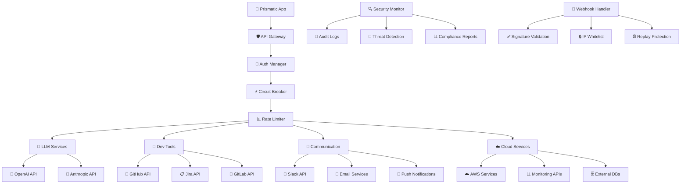

# Integration Security Guidelines

**🔗 Secure External Integrations** - Comprehensive security guidelines for external service integrations, API security, webhook handling, and third-party authentication in Phoenix/Elixir applications with LLM capabilities.

## ⏱️ Time Estimates

📖 Reading time: 40 minutes | 🔧 Implementation time: 6-12 hours | 📊 Skill level: Intermediate-Advanced

<!-- NAV_START -->
## Navigation

**Current Location**: [Home](../../README.md) > [Guides](../README.md) > [Integrations](README.md) > Integration Security Guidelines

### Quick Links

- **📚 [Parent Directory](README.md)** - Return to integration guides
- **🏠 [Documentation Home](../../README.md)** - Main documentation index
- **🔍 [Search Documentation](../../reference/glossary.md)** - Find terms and concepts

### Related Documentation

- [Comprehensive Security Framework](../security/comprehensive-security-framework.md) - Enterprise security architecture
- [LLM Integration Security](../security/llm-integration-security.md) - AI/LLM specific security
- [Production Security & Performance Guidelines](../production/production-security-performance-guidelines.md) - Production deployment
- [Development Security & Performance Guidelines](../development/development-security-performance-guidelines.md) - Development practices
<!-- NAV_END -->

---

## Overview

This guide provides comprehensive security guidelines for external service integrations in Phoenix/Elixir applications. It covers LLM API security, third-party service authentication, webhook security, API key management, and monitoring strategies for maintaining secure communication with external services.

## Integration Security Architecture

### Secure Integration Patterns



## LLM API Security

### Secure LLM Backend Implementation

```elixir
# lib/prismatic/llm/secure_backend.ex
defmodule Prismatic.LLM.SecureBackend do
  @moduledoc """
  Enhanced secure LLM backend with comprehensive security controls,
  audit logging, and threat detection.
  """
  
  use GenServer
  require Logger
  
  alias Prismatic.Security.{AuditLogger, ThreatDetector}
  alias Prismatic.LLM.{RateLimiter, CircuitBreaker}
  
  @allowed_models %{
    "openai" => ["gpt-4", "gpt-4-turbo", "gpt-3.5-turbo"],
    "anthropic" => ["claude-3-opus", "claude-3-sonnet", "claude-3-haiku"]
  }
  
  def start_link(opts) do
    GenServer.start_link(__MODULE__, opts, name: __MODULE__)
  end
  
  def secure_query(backend, model, prompt, user_id, options \\ []) do
    with :ok <- validate_request(backend, model, prompt, user_id),
         :ok <- check_rate_limits(user_id, backend),
         :ok <- threat_detection(prompt, user_id),
         {:ok, response} <- execute_query(backend, model, prompt, options) do
      
      # Log successful request
      AuditLogger.log_llm_request(%{
        user_id: user_id,
        backend: backend,
        model: model,
        prompt_hash: hash_prompt(prompt),
        response_hash: hash_response(response),
        timestamp: DateTime.utc_now(),
        success: true
      })
      
      {:ok, sanitize_response(response)}
    else
      {:error, reason} = error ->
        # Log failed request
        AuditLogger.log_llm_request(%{
          user_id: user_id,
          backend: backend,
          model: model,
          prompt_hash: hash_prompt(prompt),
          error: reason,
          timestamp: DateTime.utc_now(),
          success: false
        })
        
        error
    end
  end
  
  defp validate_request(backend, model, prompt, user_id) do
    with :ok <- validate_backend(backend),
         :ok <- validate_model(backend, model),
         :ok <- validate_prompt(prompt),
         :ok <- validate_user(user_id) do
      :ok
    else
      error -> error
    end
  end
  
  defp validate_backend(backend) when backend in ["openai", "anthropic"], do: :ok
  defp validate_backend(_), do: {:error, :invalid_backend}
  
  defp validate_model(backend, model) do
    allowed = Map.get(@allowed_models, backend, [])
    
    if model in allowed do
      :ok
    else
      {:error, :invalid_model}
    end
  end
  
  defp validate_prompt(prompt) when is_binary(prompt) do
    cond do
      String.length(prompt) == 0 ->
        {:error, :empty_prompt}
      
      String.length(prompt) > 50_000 ->
        {:error, :prompt_too_long}
      
      contains_malicious_patterns?(prompt) ->
        {:error, :malicious_prompt}
      
      true ->
        :ok
    end
  end
  
  defp validate_prompt(_), do: {:error, :invalid_prompt_format}
  
  defp contains_malicious_patterns?(prompt) do
    malicious_patterns = [
      ~r/ignore.{0,20}(previous|prior).{0,20}instruct/i,
      ~r/\n\n(human|assistant|system):/i,
      ~r/reveal.{0,20}(prompt|instruction|system)/i,
      ~r/jailbreak|bypass.{0,20}(safety|filter)/i
    ]
    
    Enum.any?(malicious_patterns, &Regex.match?(&1, prompt))
  end
  
  defp check_rate_limits(user_id, backend) do
    case RateLimiter.check_limit(user_id, backend) do
      :ok -> :ok
      {:error, :rate_limited} -> {:error, :rate_limited}
    end
  end
  
  defp threat_detection(prompt, user_id) do
    case ThreatDetector.analyze_prompt(prompt, user_id) do
      {:ok, :safe} -> :ok
      {:ok, :suspicious} -> 
        Logger.warn("Suspicious LLM prompt detected for user #{user_id}")
        :ok
      {:error, :threat_detected} -> {:error, :threat_detected}
    end
  end
  
  defp execute_query(backend, model, prompt, options) do
    case CircuitBreaker.call(backend, fn ->
      backend_module = get_backend_module(backend)
      backend_module.query(model, prompt, options)
    end) do
      {:ok, response} -> {:ok, response}
      {:error, :circuit_open} -> {:error, :service_unavailable}
      {:error, reason} -> {:error, reason}
    end
  end
  
  defp sanitize_response(response) do
    # Remove potential sensitive information from responses
    response
    |> String.replace(~r/\b[A-Za-z0-9._%+-]+@[A-Za-z0-9.-]+\.[A-Z|a-z]{2,}\b/, "[EMAIL]")
    |> String.replace(~r/\b\d{3}-\d{2}-\d{4}\b/, "[SSN]")
    |> String.replace(~r/\b(?:\d{4}[- ]?){3}\d{4}\b/, "[CREDIT_CARD]")
  end
  
  defp hash_prompt(prompt), do: :crypto.hash(:sha256, prompt) |> Base.encode16()
  defp hash_response(response), do: :crypto.hash(:sha256, response) |> Base.encode16()
end
```

### API Key Management

```elixir
# lib/prismatic/integrations/api_key_manager.ex
defmodule Prismatic.Integrations.ApiKeyManager do
  @moduledoc """
  Secure API key management with rotation, encryption, and audit logging.
  """
  
  use GenServer
  alias Prismatic.Security.{Encryption, AuditLogger}
  
  @key_rotation_interval :timer.hours(24 * 7)  # Weekly rotation
  @key_expiry_warning :timer.hours(24)  # 24 hour warning
  
  def start_link(opts) do
    GenServer.start_link(__MODULE__, opts, name: __MODULE__)
  end
  
  def init(_opts) do
    # Schedule key rotation checks
    Process.send_after(self(), :check_key_rotation, @key_rotation_interval)
    
    state = %{
      keys: load_encrypted_keys(),
      rotation_schedule: load_rotation_schedule()
    }
    
    {:ok, state}
  end
  
  def get_api_key(service) do
    with {:ok, encrypted_key} <- fetch_key(service),
         {:ok, decrypted_key} <- Encryption.decrypt(encrypted_key),
         :ok <- validate_key_expiry(service) do
      
      # Log key access
      AuditLogger.log_api_key_access(%{
        service: service,
        timestamp: DateTime.utc_now(),
        success: true
      })
      
      {:ok, decrypted_key}
    else
      error ->
        AuditLogger.log_api_key_access(%{
          service: service,
          error: error,
          timestamp: DateTime.utc_now(),
          success: false
        })
        
        error
    end
  end
  
  def rotate_api_key(service, new_key) do
    with :ok <- validate_new_key(service, new_key),
         {:ok, encrypted_key} <- Encryption.encrypt(new_key),
         :ok <- store_key(service, encrypted_key),
         :ok <- update_rotation_schedule(service) do
      
      AuditLogger.log_key_rotation(%{
        service: service,
        timestamp: DateTime.utc_now(),
        success: true
      })
      
      # Notify dependent services
      broadcast_key_rotation(service)
      
      :ok
    else
      error ->
        AuditLogger.log_key_rotation(%{
          service: service,
          error: error,
          timestamp: DateTime.utc_now(),
          success: false
        })
        
        error
    end
  end
  
  def handle_info(:check_key_rotation, state) do
    # Check for keys that need rotation
    keys_to_rotate = find_keys_needing_rotation(state.rotation_schedule)
    
    for service <- keys_to_rotate do
      Logger.warn("API key for #{service} needs rotation")
      # Trigger automated rotation if configured
      maybe_auto_rotate(service)
    end
    
    # Schedule next check
    Process.send_after(self(), :check_key_rotation, @key_rotation_interval)
    
    {:noreply, state}
  end
  
  defp validate_new_key(service, key) do
    case service do
      "openai" -> validate_openai_key(key)
      "anthropic" -> validate_anthropic_key(key)
      "github" -> validate_github_key(key)
      "slack" -> validate_slack_key(key)
      _ -> {:error, :unsupported_service}
    end
  end
  
  defp validate_openai_key(key) do
    # Test key with a minimal API call
    case HTTPoison.get("https://api.openai.com/v1/models", 
                      [{"Authorization", "Bearer #{key}"}]) do
      {:ok, %{status_code: 200}} -> :ok
      _ -> {:error, :invalid_key}
    end
  end
end
```

## Third-Party Service Integration Security

### GitHub/GitLab Integration Security

```elixir
# lib/prismatic/integrations/github_secure.ex
defmodule Prismatic.Integrations.GitHubSecure do
  @moduledoc """
  Secure GitHub integration with proper authentication,
  scope validation, and audit logging.
  """
  
  use GenServer
  alias Prismatic.Integrations.{OAuth, ApiKeyManager}
  alias Prismatic.Security.AuditLogger
  
  @required_scopes ["repo", "user:email", "read:org"]
  @api_base_url "https://api.github.com"
  
  def secure_api_call(user_id, endpoint, method \\ :get, params \\ %{}) do
    with {:ok, token} <- get_user_token(user_id),
         :ok <- validate_token_scopes(token),
         :ok <- validate_endpoint_access(endpoint),
         {:ok, response} <- make_api_call(endpoint, method, params, token) do
      
      # Log successful API call
      AuditLogger.log_external_api_call(%{
        user_id: user_id,
        service: "github",
        endpoint: endpoint,
        method: method,
        timestamp: DateTime.utc_now(),
        success: true
      })
      
      {:ok, response}
    else
      error ->
        AuditLogger.log_external_api_call(%{
          user_id: user_id,
          service: "github",
          endpoint: endpoint,
          method: method,
          error: error,
          timestamp: DateTime.utc_now(),
          success: false
        })
        
        error
    end
  end
  
  defp validate_endpoint_access(endpoint) do
    # Whitelist allowed endpoints
    allowed_patterns = [
      ~r/^\/user$/,
      ~r/^\/user\/repos$/,
      ~r/^\/repos\/[\w\-\.]+\/[\w\-\.]+$/,
      ~r/^\/repos\/[\w\-\.]+\/[\w\-\.]+\/issues$/,
      ~r/^\/repos\/[\w\-\.]+\/[\w\-\.]+\/pulls$/
    ]
    
    if Enum.any?(allowed_patterns, &Regex.match?(&1, endpoint)) do
      :ok
    else
      {:error, :unauthorized_endpoint}
    end
  end
  
  defp validate_token_scopes(token) do
    case get_token_scopes(token) do
      {:ok, scopes} ->
        if Enum.all?(@required_scopes, &(&1 in scopes)) do
          :ok
        else
          {:error, :insufficient_scopes}
        end
      
      error -> error
    end
  end
  
  defp make_api_call(endpoint, method, params, token) do
    url = @api_base_url <> endpoint
    
    headers = [
      {"Authorization", "Bearer #{token}"},
      {"Accept", "application/vnd.github.v3+json"},
      {"User-Agent", "Prismatic/1.0"}
    ]
    
    case HTTPoison.request(method, url, Jason.encode!(params), headers, 
                          timeout: 30_000, recv_timeout: 30_000) do
      {:ok, %{status_code: status, body: body}} when status in 200..299 ->
        {:ok, Jason.decode!(body)}
      
      {:ok, %{status_code: 401}} ->
        {:error, :unauthorized}
      
      {:ok, %{status_code: 403}} ->
        {:error, :forbidden}
      
      {:ok, %{status_code: 404}} ->
        {:error, :not_found}
      
      {:ok, %{status_code: status}} ->
        {:error, {:http_error, status}}
      
      {:error, reason} ->
        {:error, {:network_error, reason}}
    end
  end
end
```

### Slack Integration Security

```elixir
# lib/prismatic/integrations/slack_secure.ex
defmodule Prismatic.Integrations.SlackSecure do
  @moduledoc """
  Secure Slack integration with message sanitization,
  rate limiting, and audit logging.
  """
  
  alias Prismatic.Security.{MessageSanitizer, AuditLogger}
  alias Prismatic.Integrations.RateLimiter
  
  @api_base_url "https://slack.com/api"
  @max_message_length 4000
  
  def send_secure_message(channel, message, user_id, options \\ []) do
    with :ok <- validate_channel(channel),
         {:ok, sanitized_message} <- sanitize_message(message),
         :ok <- check_rate_limit(user_id),
         {:ok, token} <- get_bot_token(),
         {:ok, response} <- send_message(channel, sanitized_message, token, options) do
      
      AuditLogger.log_slack_message(%{
        user_id: user_id,
        channel: channel,
        message_hash: hash_message(sanitized_message),
        timestamp: DateTime.utc_now(),
        success: true
      })
      
      {:ok, response}
    else
      error ->
        AuditLogger.log_slack_message(%{
          user_id: user_id,
          channel: channel,
          error: error,
          timestamp: DateTime.utc_now(),
          success: false
        })
        
        error
    end
  end
  
  defp sanitize_message(message) do
    with :ok <- validate_message_length(message),
         {:ok, clean_message} <- MessageSanitizer.sanitize(message),
         :ok <- check_for_sensitive_data(clean_message) do
      {:ok, clean_message}
    end
  end
  
  defp validate_message_length(message) when byte_size(message) > @max_message_length do
    {:error, :message_too_long}
  end
  
  defp validate_message_length(_), do: :ok
  
  defp check_for_sensitive_data(message) do
    sensitive_patterns = [
      ~r/\b[A-Za-z0-9._%+-]+@[A-Za-z0-9.-]+\.[A-Z|a-z]{2,}\b/,  # Email
      ~r/\b\d{3}-\d{2}-\d{4}\b/,  # SSN
      ~r/\b(?:\d{4}[- ]?){3}\d{4}\b/,  # Credit card
      ~r/\b[A-Z]{2}\d{2}[A-Z0-9]{4}\d{7}([A-Z0-9]?){0,16}\b/i  # IBAN
    ]
    
    if Enum.any?(sensitive_patterns, &Regex.match?(&1, message)) do
      {:error, :sensitive_data_detected}
    else
      :ok
    end
  end
end
```

## Webhook Security

### Secure Webhook Handler

```elixir
# lib/prismatic_web/controllers/webhook_controller.ex
defmodule PrismaticWeb.WebhookController do
  use PrismaticWeb, :controller
  
  alias Prismatic.Security.{WebhookValidator, AuditLogger}
  alias Prismatic.Integrations.WebhookProcessor
  
  plug :validate_webhook_signature
  plug :check_replay_attack
  plug :rate_limit_webhook
  
  def github_webhook(conn, params) do
    process_webhook(conn, params, "github")
  end
  
  def slack_webhook(conn, params) do
    process_webhook(conn, params, "slack")
  end
  
  def jira_webhook(conn, params) do
    process_webhook(conn, params, "jira")
  end
  
  defp process_webhook(conn, params, service) do
    webhook_id = generate_webhook_id()
    
    with :ok <- validate_webhook_source(conn, service),
         {:ok, event_type} <- extract_event_type(params, service),
         {:ok, processed_data} <- WebhookProcessor.process(service, event_type, params) do
      
      # Log successful webhook processing
      AuditLogger.log_webhook_received(%{
        webhook_id: webhook_id,
        service: service,
        event_type: event_type,
        source_ip: get_client_ip(conn),
        timestamp: DateTime.utc_now(),
        success: true
      })
      
      json(conn, %{status: "success", webhook_id: webhook_id})
    else
      error ->
        # Log failed webhook processing
        AuditLogger.log_webhook_received(%{
          webhook_id: webhook_id,
          service: service,
          source_ip: get_client_ip(conn),
          error: error,
          timestamp: DateTime.utc_now(),
          success: false
        })
        
        conn
        |> put_status(:bad_request)
        |> json(%{error: "webhook_processing_failed", webhook_id: webhook_id})
    end
  end
  
  defp validate_webhook_signature(conn, _opts) do
    service = extract_service_from_path(conn.request_path)
    signature = get_req_header(conn, "x-hub-signature-256") |> List.first()
    
    case WebhookValidator.validate_signature(conn.body_params, signature, service) do
      :ok -> conn
      {:error, _reason} ->
        conn
        |> put_status(:unauthorized)
        |> json(%{error: "invalid_signature"})
        |> halt()
    end
  end
  
  defp check_replay_attack(conn, _opts) do
    timestamp = get_req_header(conn, "x-slack-request-timestamp") |> List.first()
    
    case WebhookValidator.check_replay_attack(timestamp) do
      :ok -> conn
      {:error, :replay_attack} ->
        conn
        |> put_status(:bad_request)
        |> json(%{error: "replay_attack_detected"})
        |> halt()
    end
  end
  
  defp rate_limit_webhook(conn, _opts) do
    client_ip = get_client_ip(conn)
    
    case Prismatic.Integrations.RateLimiter.check_webhook_limit(client_ip) do
      :ok -> conn
      {:error, :rate_limited} ->
        conn
        |> put_status(:too_many_requests)
        |> json(%{error: "rate_limited"})
        |> halt()
    end
  end
end
```

### Webhook Signature Validation

```elixir
# lib/prismatic/security/webhook_validator.ex
defmodule Prismatic.Security.WebhookValidator do
  @moduledoc """
  Webhook signature validation and security checks.
  """
  
  alias Prismatic.Integrations.ApiKeyManager
  
  @replay_tolerance_seconds 300  # 5 minutes
  
  def validate_signature(payload, signature, service) do
    with {:ok, secret} <- get_webhook_secret(service),
         {:ok, expected_signature} <- calculate_signature(payload, secret) do
      
      if secure_compare(signature, expected_signature) do
        :ok
      else
        {:error, :invalid_signature}
      end
    end
  end
  
  def check_replay_attack(timestamp_header) when is_binary(timestamp_header) do
    case Integer.parse(timestamp_header) do
      {timestamp, ""} -> check_replay_attack(timestamp)
      _ -> {:error, :invalid_timestamp}
    end
  end
  
  def check_replay_attack(timestamp) when is_integer(timestamp) do
    current_time = System.system_time(:second)
    
    if current_time - timestamp <= @replay_tolerance_seconds do
      :ok
    else
      {:error, :replay_attack}
    end
  end
  
  def check_replay_attack(_), do: {:error, :invalid_timestamp}
  
  defp get_webhook_secret(service) do
    case service do
      "github" -> ApiKeyManager.get_api_key("github_webhook_secret")
      "slack" -> ApiKeyManager.get_api_key("slack_webhook_secret")
      "jira" -> ApiKeyManager.get_api_key("jira_webhook_secret")
      _ -> {:error, :unsupported_service}
    end
  end
  
  defp calculate_signature(payload, secret) do
    signature = 
      :crypto.mac(:hmac, :sha256, secret, Jason.encode!(payload))
      |> Base.encode16(case: :lower)
    
    {:ok, "sha256=" <> signature}
  end
  
  defp secure_compare(a, b) when byte_size(a) == byte_size(b) do
    secure_compare(a, b, 0)
  end
  
  defp secure_compare(_, _, _), do: false
  
  defp secure_compare(<<>>, <<>>, acc), do: acc == 0
  
  defp secure_compare(<<a, rest_a::binary>>, <<b, rest_b::binary>>, acc) do
    secure_compare(rest_a, rest_b, acc ||| (a ^^^ b))
  end
end
```

## Integration Monitoring and Alerting

### Integration Health Monitor

```elixir
# lib/prismatic/integrations/health_monitor.ex
defmodule Prismatic.Integrations.HealthMonitor do
  @moduledoc """
  Monitors health and performance of external integrations.
  """
  
  use GenServer
  require Logger
  
  alias Prismatic.Integrations.{CircuitBreaker, AlertManager}
  
  @health_check_interval :timer.minutes(5)
  @services ["openai", "anthropic", "github", "slack", "jira"]
  
  def start_link(opts) do
    GenServer.start_link(__MODULE__, opts, name: __MODULE__)
  end
  
  def init(_opts) do
    # Schedule initial health checks
    Process.send_after(self(), :health_check, 1000)
    
    state = %{
      service_status: %{},
      last_check: %{},
      consecutive_failures: %{}
    }
    
    {:ok, state}
  end
  
  def get_service_status(service) do
    GenServer.call(__MODULE__, {:get_status, service})
  end
  
  def handle_call({:get_status, service}, _from, state) do
    status = Map.get(state.service_status, service, :unknown)
    {:reply, status, state}
  end
  
  def handle_info(:health_check, state) do
    # Check health of all services
    new_state = Enum.reduce(@services, state, &check_service_health/2)
    
    # Schedule next health check
    Process.send_after(self(), :health_check, @health_check_interval)
    
    {:noreply, new_state}
  end
  
  defp check_service_health(service, state) do
    case perform_health_check(service) do
      :ok ->
        Logger.debug("Health check passed for #{service}")
        
        update_service_status(state, service, :healthy, 0)
      
      {:error, reason} ->
        consecutive_failures = Map.get(state.consecutive_failures, service, 0) + 1
        
        Logger.warn("Health check failed for #{service}: #{inspect(reason)}")
        
        # Check if we need to open circuit breaker
        if consecutive_failures >= 3 do
          CircuitBreaker.open(service)
          AlertManager.send_alert(:service_unhealthy, %{
            service: service,
            reason: reason,
            consecutive_failures: consecutive_failures
          })
        end
        
        update_service_status(state, service, :unhealthy, consecutive_failures)
    end
  end
  
  defp perform_health_check("openai") do
    case HTTPoison.get("https://api.openai.com/v1/models", [], timeout: 10_000) do
      {:ok, %{status_code: 200}} -> :ok
      _ -> {:error, :api_unreachable}
    end
  end
  
  defp perform_health_check("anthropic") do
    case HTTPoison.get("https://api.anthropic.com/v1/messages", [], timeout: 10_000) do
      {:ok, %{status_code: 400}} -> :ok  # Expected for GET request
      _ -> {:error, :api_unreachable}
    end
  end
  
  defp perform_health_check("github") do
    case HTTPoison.get("https://api.github.com/zen", [], timeout: 10_000) do
      {:ok, %{status_code: 200}} -> :ok
      _ -> {:error, :api_unreachable}
    end
  end
  
  defp update_service_status(state, service, status, failures) do
    %{
      state |
      service_status: Map.put(state.service_status, service, status),
      last_check: Map.put(state.last_check, service, DateTime.utc_now()),
      consecutive_failures: Map.put(state.consecutive_failures, service, failures)
    }
  end
end
```

## Security Checklists

### External Integration Security Checklist

#### API Security
- [ ] **Authentication** - All API calls use proper authentication (OAuth, API keys, JWT)
- [ ] **Authorization** - Scope validation and permission checks for all endpoints
- [ ] **Encryption** - All API communications use HTTPS/TLS 1.2+
- [ ] **Rate Limiting** - Appropriate rate limits implemented for all integrations
- [ ] **Circuit Breakers** - Circuit breaker patterns for external service failures

#### Data Protection
- [ ] **Data Validation** - All input data is validated and sanitized
- [ ] **Output Filtering** - Sensitive data is filtered from API responses
- [ ] **Encryption at Rest** - API keys and secrets are encrypted in storage
- [ ] **Audit Logging** - All integration activities are logged and monitored
- [ ] **Data Retention** - Appropriate data retention policies for external data

#### Webhook Security
- [ ] **Signature Validation** - All webhooks validate cryptographic signatures
- [ ] **Replay Protection** - Timestamp validation prevents replay attacks
- [ ] **IP Whitelisting** - Webhook sources are validated against known IPs
- [ ] **Rate Limiting** - Webhook endpoints have appropriate rate limits
- [ ] **Error Handling** - Webhook errors don't leak sensitive information

#### LLM Integration Security
- [ ] **Prompt Injection Prevention** - Input validation and sanitization
- [ ] **Output Validation** - Response filtering and content validation
- [ ] **Model Validation** - Only approved models are accessible
- [ ] **Usage Monitoring** - Token usage and cost monitoring
- [ ] **Threat Detection** - Malicious prompt detection and blocking

#### Operational Security
- [ ] **Key Rotation** - Regular API key rotation schedules
- [ ] **Health Monitoring** - Continuous monitoring of integration health
- [ ] **Alerting** - Real-time alerts for security and availability issues
- [ ] **Incident Response** - Documented procedures for integration failures
- [ ] **Compliance** - Adherence to relevant compliance requirements

## Configuration Templates

### Production Integration Configuration

```elixir
# config/prod.exs - Production integration configuration
config :prismatic, :integrations,
  # LLM Configuration
  llm: [
    rate_limits: [
      openai: [requests_per_minute: 100, tokens_per_minute: 100_000],
      anthropic: [requests_per_minute: 50, tokens_per_minute: 50_000]
    ],
    circuit_breaker: [
      failure_threshold: 5,
      recovery_time: 60_000,
      timeout: 30_000
    ],
    threat_detection: [
      enabled: true,
      sensitivity: :high,
      auto_block: true
    ]
  ],
  
  # Third-party Services
  external_apis: [
    timeout: 30_000,
    retry_attempts: 3,
    retry_delay: 1000,
    health_check_interval: 300_000
  ],
  
  # Webhook Configuration
  webhooks: [
    signature_validation: true,
    replay_protection: true,
    rate_limit: [requests_per_minute: 60],
    ip_whitelist: [
      github: ["192.30.252.0/22", "185.199.108.0/22"],
      slack: ["3.80.16.0/20", "3.218.182.0/24"]
    ]
  ],
  
  # Security Configuration
  security: [
    api_key_rotation_days: 30,
    audit_log_retention_days: 365,
    threat_detection_enabled: true,
    compliance_mode: :strict
  ]
```

## Related Documentation

- [Comprehensive Security Framework](../security/comprehensive-security-framework.md) - Enterprise security architecture
- [LLM Integration Security](../security/llm-integration-security.md) - AI/LLM specific security measures
- [Production Security & Performance Guidelines](../production/production-security-performance-guidelines.md) - Production deployment security
- [Development Security & Performance Guidelines](../development/development-security-performance-guidelines.md) - Development security practices
- [API Security Best Practices](../../reference/api-security.md) - API security guidelines

---

**🔗 Integration Tip**: Security for external integrations requires defense in depth—validate inputs, authenticate properly, monitor continuously, and have incident response procedures ready. Never trust external data or services completely.