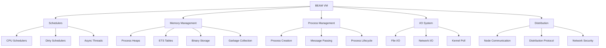

# BEAM VM Optimization

**🚀 BEAM VM Performance Tuning** - Specialized optimization techniques for the Erlang BEAM virtual machine in Phoenix/Elixir applications, covering scheduler tuning, memory management, garbage collection, and distribution optimization.

## ⏱️ Time Estimates

📖 Reading time: 25 minutes | 🔧 Implementation time: 3-6 hours | 📊 Skill level: Expert

<!-- NAV_START -->
## Navigation

**Current Location**: [Home](../../README.md) > [Guides](../README.md) > [Performance](README.md) > BEAM VM Optimization

### Quick Links

- **📚 [Parent Directory](README.md)** - Return to performance guides
- **🏠 [Documentation Home](../../README.md)** - Main documentation index
- **🔍 [Search Documentation](../../reference/glossary.md)** - Find terms and concepts

### Related Documentation

- [Comprehensive Performance Optimization](comprehensive-performance-optimization.md) - Complete performance guide
- [Production Performance Guidelines](production-performance-guidelines.md) - Production-specific optimization
- [Security Framework](../security/comprehensive-security-framework.md) - Security considerations for VM tuning
<!-- NAV_END -->

---

## Overview

This guide focuses specifically on BEAM VM optimization techniques for high-performance Elixir applications. The BEAM virtual machine provides numerous tuning parameters that can significantly impact application performance when properly configured.

## BEAM VM Architecture Overview

### VM Components Performance Impact



## Scheduler Optimization

### CPU Scheduler Configuration

```bash
# Optimal scheduler configuration for different workloads

# High-throughput web applications
export ERL_FLAGS="+S 16:16 +SP true +K true"

# CPU-intensive applications
export ERL_FLAGS="+S 32:32 +SP false +K true"

# I/O intensive applications
export ERL_FLAGS="+S 8:8 +SP true +K true +A 64"

# Mixed workload (recommended for most applications)
export ERL_FLAGS="+S $(nproc):$(nproc) +SP true +K true +A 32"
```

### Scheduler Utilization Monitoring

```elixir
# BEAM VM Scheduler Monitoring
defmodule Prismatic.Performance.SchedulerMonitor do
  @moduledoc """
  Monitor and optimize BEAM scheduler utilization.
  """
  
  require Logger
  
  @doc "Get current scheduler utilization statistics"
  def get_scheduler_stats do
    # Get scheduler utilization over 1 second interval
    utilization = :scheduler.utilization(1)
    
    %{
      total_schedulers: :erlang.system_info(:schedulers),
      online_schedulers: :erlang.system_info(:schedulers_online),
      utilization: parse_scheduler_utilization(utilization),
      run_queue_lengths: get_run_queue_lengths(),
      context_switches: :erlang.statistics(:context_switches)
    }
  end
  
  @doc "Analyze scheduler performance and provide recommendations"
  def analyze_scheduler_performance do
    stats = get_scheduler_stats()
    
    recommendations = []
    
    # Check for scheduler imbalance
    if scheduler_imbalance?(stats.utilization) do
      recommendations = [{:scheduler_imbalance, "Consider redistributing load or adjusting process spawning"} | recommendations]
    end
    
    # Check for high run queue lengths
    if high_run_queues?(stats.run_queue_lengths) do
      recommendations = [{:high_run_queues, "Consider increasing scheduler count or optimizing process execution time"} | recommendations]
    end
    
    # Check for low utilization
    avg_utilization = calculate_average_utilization(stats.utilization)
    if avg_utilization < 0.3 do
      recommendations = [{:low_utilization, "Consider reducing scheduler count to improve cache locality"} | recommendations]
    end
    
    %{
      stats: stats,
      average_utilization: avg_utilization,
      recommendations: recommendations
    }
  end
  
  defp parse_scheduler_utilization(utilization) do
    Enum.map(utilization, fn {scheduler_id, active, total} ->
      %{
        scheduler_id: scheduler_id,
        utilization: if(total > 0, do: active / total, else: 0.0),
        active_time: active,
        total_time: total
      }
    end)
  end
  
  defp get_run_queue_lengths do
    %{
      total: :erlang.statistics(:total_run_queue_lengths),
      cpu: :erlang.statistics(:total_run_queue_lengths_all),
      io: :erlang.statistics(:total_active_tasks)
    }
  end
  
  defp scheduler_imbalance?(utilization) do
    utilizations = Enum.map(utilization, & &1.utilization)
    max_util = Enum.max(utilizations)
    min_util = Enum.min(utilizations)
    
    # Consider imbalanced if difference is > 30%
    (max_util - min_util) > 0.3
  end
  
  defp high_run_queues?(run_queues) do
    # High if average run queue length > number of schedulers
    scheduler_count = :erlang.system_info(:schedulers)
    run_queues.total > scheduler_count * 2
  end
end
```

### Dirty Scheduler Configuration

```elixir
# Dirty Scheduler Optimization
defmodule Prismatic.Performance.DirtySchedulerConfig do
  @moduledoc """
  Configuration and monitoring for dirty schedulers.
  Dirty schedulers handle CPU and I/O intensive operations.
  """
  
  @doc "Configure dirty schedulers based on workload"
  def configure_dirty_schedulers(workload_type) do
    cpu_count = System.schedulers_online()
    
    case workload_type do
      :cpu_intensive ->
        # More dirty CPU schedulers for CPU-bound work
        %{
          dirty_cpu_schedulers: cpu_count,
          dirty_io_schedulers: max(2, div(cpu_count, 4))
        }
        
      :io_intensive ->
        # More dirty I/O schedulers for I/O-bound work
        %{
          dirty_cpu_schedulers: max(2, div(cpu_count, 2)),
          dirty_io_schedulers: cpu_count * 2
        }
        
      :mixed ->
        # Balanced configuration
        %{
          dirty_cpu_schedulers: max(2, div(cpu_count, 2)),
          dirty_io_schedulers: cpu_count
        }
    end
  end
  
  @doc "Monitor dirty scheduler utilization"
  def monitor_dirty_schedulers do
    dirty_cpu_schedulers = :erlang.system_info(:dirty_cpu_schedulers)
    dirty_io_schedulers = :erlang.system_info(:dirty_io_schedulers)
    
    %{
      dirty_cpu_schedulers: dirty_cpu_schedulers,
      dirty_io_schedulers: dirty_io_schedulers,
      dirty_cpu_utilization: get_dirty_cpu_utilization(),
      dirty_io_utilization: get_dirty_io_utilization()
    }
  end
  
  defp get_dirty_cpu_utilization do
    # Monitor dirty CPU scheduler work
    :erlang.statistics(:microstate_accounting)
  end
  
  defp get_dirty_io_utilization do
    # Monitor dirty I/O scheduler work
    :erlang.system_info(:dirty_io_schedulers)
  end
end
```

## Memory Management Optimization

### Advanced Memory Configuration

```bash
# Production memory configuration
export ERL_FLAGS="
  +MBas aobf
  +MBlmbcs 512
  +MBmmbcs 512
  +MBsbcs 32
  +MMmcs 30
  +MHas bf
  +MHlmbcs 512
  +MHmmbcs 512
  +MHsbcs 32
  +MEas bf
  +MElmbcs 1024
  +MEmmbcs 1024
  +MEsbcs 128
  +MSas bf
  +MSlmbcs 128
  +MSmmbcs 128
  +MSsbcs 32
  +Mulmbcs 8192
  +Mummbcs 8192
  +Musbcs 1024
  +Mfas bf
  +Mflmbcs 2048
  +Mfmmbcs 2048
  +Mfsbcs 256
"
```

### Memory Allocator Monitoring

```elixir
# Memory Allocator Performance Monitoring
defmodule Prismatic.Performance.MemoryMonitor do
  @moduledoc """
  Monitor and optimize BEAM memory allocators.
  """
  
  require Logger
  
  @doc "Get detailed memory allocator statistics"
  def get_allocator_stats do
    allocator_info = :erlang.system_info(:allocator)
    
    allocators = [
      :binary_alloc,      # Binary data
      :driver_alloc,      # Driver data
      :eheap_alloc,       # Process heaps
      :ets_alloc,         # ETS tables
      :fix_alloc,         # Fixed-size allocations
      :ll_alloc,          # Long-lived data
      :sl_alloc,          # Short-lived data
      :std_alloc,         # Standard allocations
      :temp_alloc         # Temporary allocations
    ]
    
    stats = Enum.reduce(allocators, %{}, fn allocator, acc ->
      case :erlang.system_info({:allocator, allocator}) do
        false -> acc
        info -> Map.put(acc, allocator, parse_allocator_info(info))
      end
    end)
    
    %{
      total_memory: :erlang.memory(:total),
      allocator_stats: stats,
      memory_breakdown: :erlang.memory(),
      fragmentation_analysis: analyze_fragmentation(stats)
    }
  end
  
  @doc "Analyze memory fragmentation"
  def analyze_fragmentation(allocator_stats \\ nil) do
    stats = allocator_stats || get_allocator_stats().allocator_stats
    
    fragmentation_metrics = Enum.reduce(stats, %{}, fn {allocator, info}, acc ->
      if Map.has_key?(info, :mbcs) and Map.has_key?(info, :sbcs) do
        # Calculate fragmentation ratio
        total_allocated = info.mbcs.blocks_size + info.sbcs.blocks_size
        total_available = info.mbcs.carriers_size + info.sbcs.carriers_size
        
        fragmentation_ratio = if total_available > 0 do
          1.0 - (total_allocated / total_available)
        else
          0.0
        end
        
        Map.put(acc, allocator, %{
          fragmentation_ratio: fragmentation_ratio,
          total_allocated: total_allocated,
          total_available: total_available,
          efficiency: if(total_available > 0, do: total_allocated / total_available, else: 0)
        })
      else
        acc
      end
    end)
    
    %{
      per_allocator: fragmentation_metrics,
      overall_fragmentation: calculate_overall_fragmentation(fragmentation_metrics),
      recommendations: generate_fragmentation_recommendations(fragmentation_metrics)
    }
  end
  
  defp parse_allocator_info(info) do
    # Parse allocator information structure
    Enum.reduce(info, %{}, fn {key, value}, acc ->
      case key do
        :mbcs -> Map.put(acc, :mbcs, parse_carrier_info(value))
        :sbcs -> Map.put(acc, :sbcs, parse_carrier_info(value))
        _ -> Map.put(acc, key, value)
      end
    end)
  end
  
  defp parse_carrier_info(carrier_info) when is_list(carrier_info) do
    Enum.reduce(carrier_info, %{}, fn {key, value}, acc ->
      Map.put(acc, key, value)
    end)
  end
  
  defp parse_carrier_info(carrier_info), do: carrier_info
end
```

### Garbage Collection Optimization

```elixir
# Garbage Collection Performance Tuning
defmodule Prismatic.Performance.GCOptimizer do
  @moduledoc """
  Optimize garbage collection for different process types and workloads.
  """
  
  @doc "Configure GC for long-lived processes"
  def configure_long_lived_process(pid) do
    # Reduce GC frequency for long-lived processes
    Process.flag(pid, :fullsweep_after, 65535)
    Process.flag(pid, :min_heap_size, 46422)
    Process.flag(pid, :min_bin_vheap_size, 46422)
  end
  
  @doc "Configure GC for short-lived processes"
  def configure_short_lived_process(pid) do
    # More frequent GC for short-lived processes
    Process.flag(pid, :fullsweep_after, 10)
    Process.flag(pid, :min_heap_size, 233)
    Process.flag(pid, :min_bin_vheap_size, 46422)
  end
  
  @doc "Configure GC for memory-intensive processes"
  def configure_memory_intensive_process(pid) do
    # Larger heap sizes to reduce GC frequency
    Process.flag(pid, :fullsweep_after, 40)
    Process.flag(pid, :min_heap_size, 6765)
    Process.flag(pid, :min_bin_vheap_size, 46422)
    
    # Enable hibernation for idle periods
    Process.flag(pid, :sensitive, false)
  end
  
  @doc "Monitor GC performance across all processes"
  def monitor_gc_performance do
    processes = Process.list()
    
    gc_stats = Enum.reduce(processes, %{total_collections: 0, total_reclaimed: 0}, fn pid, acc ->
      case Process.info(pid, [:garbage_collection, :memory]) do
        [{:garbage_collection, gc_info}, {:memory, memory}] ->
          collections = Keyword.get(gc_info, :minor_gcs, 0) + Keyword.get(gc_info, :fullsweep_after, 0)
          reclaimed = Keyword.get(gc_info, :heap_size, 0)
          
          %{
            total_collections: acc.total_collections + collections,
            total_reclaimed: acc.total_reclaimed + reclaimed
          }
        _ ->
          acc
      end
    end)
    
    system_gc_info = :erlang.statistics(:garbage_collection)
    
    %{
      system_gc_stats: system_gc_info,
      process_gc_stats: gc_stats,
      gc_efficiency: calculate_gc_efficiency(gc_stats, system_gc_info),
      recommendations: generate_gc_recommendations(gc_stats, system_gc_info)
    }
  end
  
  defp calculate_gc_efficiency(process_stats, system_stats) do
    {total_collections, words_reclaimed, _reductions} = system_stats
    
    if total_collections > 0 do
      %{
        words_per_collection: words_reclaimed / total_collections,
        collection_frequency: total_collections / :erlang.statistics(:wall_clock) |> elem(0),
        efficiency_score: calculate_efficiency_score(process_stats, total_collections)
      }
    else
      %{words_per_collection: 0, collection_frequency: 0, efficiency_score: 0}
    end
  end
end
```

## Process Management Optimization

### Efficient Process Spawning

```elixir
# Optimized Process Management
defmodule Prismatic.Performance.ProcessManager do
  @moduledoc """
  Optimize process creation, lifecycle, and communication patterns.
  """
  
  @doc "Spawn process with optimal configuration"
  def spawn_optimized(module, function, args, opts \\ []) do
    spawn_opts = build_spawn_options(opts)
    
    case Keyword.get(opts, :type, :standard) do
      :high_priority ->
        spawn_opt(module, function, args, [{:priority, :high} | spawn_opts])
      :memory_intensive ->
        spawn_opt(module, function, args, [{:min_heap_size, 6765} | spawn_opts])
      :long_lived ->
        spawn_opt(module, function, args, [{:fullsweep_after, 65535} | spawn_opts])
      :standard ->
        spawn_opt(module, function, args, spawn_opts)
    end
  end
  
  @doc "Create optimized GenServer pool"
  def create_worker_pool(worker_module, pool_size, opts \\ []) do
    pool_name = Keyword.get(opts, :name, worker_module)
    
    children = Enum.map(1..pool_size, fn i ->
      %{
        id: {worker_module, i},
        start: {worker_module, :start_link, [Keyword.put(opts, :name, {pool_name, i})]},
        restart: :permanent,
        type: :worker
      }
    end)
    
    supervisor_opts = [
      strategy: :one_for_one,
      max_restarts: 3,
      max_seconds: 5
    ]
    
    Supervisor.start_link(children, supervisor_opts)
  end
  
  @doc "Monitor process performance metrics"
  def monitor_process_performance do
    processes = Process.list()
    process_count = length(processes)
    
    # Sample a subset of processes for detailed analysis
    sample_size = min(1000, process_count)
    sample_processes = Enum.take_random(processes, sample_size)
    
    metrics = Enum.reduce(sample_processes, %{
      total_memory: 0,
      total_reductions: 0,
      message_queue_lengths: [],
      heap_sizes: [],
      binary_memory: 0
    }, fn pid, acc ->
      case Process.info(pid, [:memory, :reductions, :message_queue_len, :heap_size, :binary]) do
        info when is_list(info) ->
          memory = Keyword.get(info, :memory, 0)
          reductions = Keyword.get(info, :reductions, 0)
          queue_len = Keyword.get(info, :message_queue_len, 0)
          heap_size = Keyword.get(info, :heap_size, 0)
          binary_memory = Keyword.get(info, :binary, []) |> length()
          
          %{
            total_memory: acc.total_memory + memory,
            total_reductions: acc.total_reductions + reductions,
            message_queue_lengths: [queue_len | acc.message_queue_lengths],
            heap_sizes: [heap_size | acc.heap_sizes],
            binary_memory: acc.binary_memory + binary_memory
          }
        _ ->
          acc
      end
    end)
    
    %{
      total_processes: process_count,
      sample_size: sample_size,
      average_memory_per_process: metrics.total_memory / sample_size,
      average_reductions_per_process: metrics.total_reductions / sample_size,
      max_message_queue_length: Enum.max(metrics.message_queue_lengths, fn -> 0 end),
      average_heap_size: Enum.sum(metrics.heap_sizes) / length(metrics.heap_sizes),
      total_binary_memory: metrics.binary_memory,
      performance_score: calculate_process_performance_score(metrics, process_count)
    }
  end
  
  defp build_spawn_options(opts) do
    base_opts = [:link, :monitor]
    
    # Add additional options based on requirements
    base_opts
    |> maybe_add_option(:fullsweep_after, Keyword.get(opts, :fullsweep_after))
    |> maybe_add_option(:min_heap_size, Keyword.get(opts, :min_heap_size))
    |> maybe_add_option(:min_bin_vheap_size, Keyword.get(opts, :min_bin_vheap_size))
  end
  
  defp maybe_add_option(opts, _key, nil), do: opts
  defp maybe_add_option(opts, key, value), do: [{key, value} | opts]
end
```

## I/O System Optimization

### Kernel Poll and Async Threads

```bash
# I/O system optimization flags
export ERL_FLAGS="
  +K true
  +A 64
  +SDio 64
  +P 2000000
  +Q 1000000
"

# For high I/O throughput applications
export ERL_FLAGS="
  +K true
  +A 128
  +SDio 128
  +P 4000000
  +Q 2000000
"
```

### I/O Performance Monitoring

```elixir
# I/O System Performance Monitor
defmodule Prismatic.Performance.IOMonitor do
  @moduledoc """
  Monitor and optimize I/O system performance.
  """
  
  @doc "Monitor I/O system performance"
  def monitor_io_performance do
    %{
      kernel_poll_enabled: :erlang.system_info(:kernel_poll),
      async_threads: :erlang.system_info(:thread_pool_size),
      io_statistics: get_io_statistics(),
      port_count: :erlang.system_info(:port_count),
      port_limit: :erlang.system_info(:port_limit)
    }
  end
  
  @doc "Get detailed I/O statistics"
  def get_io_statistics do
    {input_bytes, output_bytes} = :erlang.statistics(:io)
    
    %{
      input_bytes: input_bytes,
      output_bytes: output_bytes,
      total_io_bytes: input_bytes + output_bytes,
      io_efficiency: calculate_io_efficiency(input_bytes, output_bytes)
    }
  end
  
  @doc "Optimize I/O for specific workloads"
  def optimize_for_workload(workload_type) do
    case workload_type do
      :high_throughput_web ->
        %{
          recommended_async_threads: System.schedulers_online() * 2,
          kernel_poll: true,
          dirty_io_schedulers: System.schedulers_online(),
          notes: "Configuration optimized for high-throughput web applications"
        }
        
      :database_intensive ->
        %{
          recommended_async_threads: System.schedulers_online() * 4,
          kernel_poll: true,
          dirty_io_schedulers: System.schedulers_online() * 2,
          notes: "Configuration optimized for database-intensive operations"
        }
        
      :file_processing ->
        %{
          recommended_async_threads: 64,
          kernel_poll: true,
          dirty_io_schedulers: System.schedulers_online(),
          notes: "Configuration optimized for file processing workloads"
        }
    end
  end
  
  defp calculate_io_efficiency(input, output) do
    total = input + output
    if total > 0 do
      %{
        read_write_ratio: input / output,
        io_balance_score: 1.0 - abs(input - output) / total
      }
    else
      %{read_write_ratio: 0, io_balance_score: 1.0}
    end
  end
end
```

## Distribution Optimization

### Node Communication Optimization

```elixir
# Distributed System Performance Optimization
defmodule Prismatic.Performance.DistributionOptimizer do
  @moduledoc """
  Optimize distributed Erlang performance and monitoring.
  """
  
  @doc "Configure distribution for performance"
  def configure_distribution(node_type) do
    base_config = %{
      # Network tick time for faster failure detection
      net_ticktime: 30,
      # Distribution buffer size
      dist_buffer_size: 32768,
      # Enable distribution keepalive
      dist_keepalive: true
    }
    
    case node_type do
      :high_throughput ->
        Map.merge(base_config, %{
          net_ticktime: 15,
          dist_buffer_size: 65536,
          tcp_dist_options: [
            {:packet, 4},
            {:nodelay, true},
            {:delay_send, false},
            {:send_timeout, 5000},
            {:send_timeout_close, true}
          ]
        })
        
      :reliable ->
        Map.merge(base_config, %{
          net_ticktime: 60,
          dist_buffer_size: 16384,
          tcp_dist_options: [
            {:packet, 4},
            {:nodelay, false},
            {:delay_send, true},
            {:send_timeout, 30000}
          ]
        })
        
      :balanced ->
        base_config
    end
  end
  
  @doc "Monitor distribution performance"
  def monitor_distribution_performance do
    nodes = [node() | Node.list()]
    
    stats = Enum.reduce(nodes, %{}, fn target_node, acc ->
      if target_node == node() do
        Map.put(acc, target_node, %{type: :local, stats: get_local_node_stats()})
      else
        Map.put(acc, target_node, %{type: :remote, stats: get_remote_node_stats(target_node)})
      end
    end)
    
    %{
      total_nodes: length(nodes),
      node_statistics: stats,
      distribution_health: calculate_distribution_health(stats),
      network_performance: get_network_performance_metrics()
    }
  end
  
  defp get_local_node_stats do
    %{
      memory: :erlang.memory(),
      process_count: :erlang.system_info(:process_count),
      load: :cpu_sup.avg1() / 256,  # 1-minute load average
      uptime: :erlang.statistics(:wall_clock) |> elem(0)
    }
  end
  
  defp get_remote_node_stats(node) do
    try do
      :rpc.call(node, __MODULE__, :get_local_node_stats, [], 5000)
    catch
      :exit, reason ->
        %{error: reason, status: :unreachable}
    end
  end
  
  defp calculate_distribution_health(node_stats) do
    healthy_nodes = Enum.count(node_stats, fn {_node, stats} ->
      not Map.has_key?(stats.stats, :error)
    end)
    
    total_nodes = map_size(node_stats)
    
    %{
      healthy_nodes: healthy_nodes,
      total_nodes: total_nodes,
      health_percentage: if(total_nodes > 0, do: healthy_nodes / total_nodes * 100, else: 0),
      cluster_status: determine_cluster_status(healthy_nodes, total_nodes)
    }
  end
  
  defp determine_cluster_status(healthy, total) do
    health_ratio = healthy / total
    
    cond do
      health_ratio >= 0.9 -> :healthy
      health_ratio >= 0.7 -> :degraded
      health_ratio >= 0.5 -> :unstable
      true -> :critical
    end
  end
end
```

## Performance Monitoring and Diagnostics

### Comprehensive VM Diagnostics

```elixir
# BEAM VM Performance Diagnostics
defmodule Prismatic.Performance.VMDiagnostics do
  @moduledoc """
  Comprehensive BEAM VM performance diagnostics and health checks.
  """
  
  @doc "Run complete VM performance diagnostic"
  def run_full_diagnostic do
    %{
      system_info: get_system_info(),
      memory_analysis: analyze_memory_usage(),
      scheduler_analysis: analyze_scheduler_performance(),
      process_analysis: analyze_process_performance(),
      io_analysis: analyze_io_performance(),
      gc_analysis: analyze_gc_performance(),
      distribution_analysis: analyze_distribution_performance(),
      recommendations: generate_optimization_recommendations()
    }
  end
  
  defp get_system_info do
    %{
      otp_release: :erlang.system_info(:otp_release),
      system_version: :erlang.system_info(:system_version),
      system_architecture: :erlang.system_info(:system_architecture),
      wordsize: :erlang.system_info(:wordsize),
      smp_support: :erlang.system_info(:smp_support),
      threads: :erlang.system_info(:threads),
      thread_pool_size: :erlang.system_info(:thread_pool_size)
    }
  end
  
  defp analyze_memory_usage do
    memory = :erlang.memory()
    total = memory[:total]
    
    %{
      total_memory_mb: div(total, 1024 * 1024),
      memory_breakdown: Enum.map(memory, fn {type, bytes} ->
        {type, %{bytes: bytes, percentage: bytes / total * 100}}
      end) |> Map.new(),
      memory_efficiency: calculate_memory_efficiency(memory),
      fragmentation_score: calculate_fragmentation_score()
    }
  end
  
  defp calculate_memory_efficiency(memory) do
    processes = memory[:processes]
    system = memory[:system]
    
    if processes + system > 0 do
      processes / (processes + system)
    else
      0
    end
  end
  
  defp generate_optimization_recommendations do
    diagnostics = [
      check_scheduler_utilization(),
      check_memory_usage(),
      check_gc_performance(),
      check_process_limits(),
      check_io_performance()
    ]
    
    Enum.reject(diagnostics, &is_nil/1)
  end
  
  defp check_scheduler_utilization do
    stats = Prismatic.Performance.SchedulerMonitor.analyze_scheduler_performance()
    
    if stats.average_utilization < 0.3 do
      %{
        type: :scheduler_optimization,
        priority: :medium,
        message: "Low scheduler utilization detected. Consider reducing scheduler count.",
        current_utilization: stats.average_utilization
      }
    end
  end
  
  defp check_memory_usage do
    memory = :erlang.memory()
    total_mb = div(memory[:total], 1024 * 1024)
    
    if total_mb > 1000 do  # > 1GB
      %{
        type: :memory_optimization,
        priority: :high,
        message: "High memory usage detected. Consider memory optimization strategies.",
        current_memory_mb: total_mb
      }
    end
  end
end
```

## Production Configuration Templates

### High-Performance Production Configuration

```bash
#!/bin/bash
# production_vm_config.sh - High-performance BEAM VM configuration

# Calculate optimal values based on system resources
CPU_CORES=$(nproc)
TOTAL_MEMORY_KB=$(grep MemTotal /proc/meminfo | awk '{print $2}')
TOTAL_MEMORY_MB=$((TOTAL_MEMORY_KB / 1024))

# Scheduler configuration
SCHEDULERS="+S ${CPU_CORES}:${CPU_CORES}"
DIRTY_CPU_SCHEDULERS="+SDcpu $((CPU_CORES / 2))"
DIRTY_IO_SCHEDULERS="+SDio ${CPU_CORES}"
ASYNC_THREADS="+A $((CPU_CORES * 2))"

# Memory configuration
PROCESS_LIMIT="+P 2000000"
PORT_LIMIT="+Q 1000000"

# Memory allocator tuning
MEMORY_CONFIG="
  +MBas aobf
  +MBlmbcs 512
  +MBmmbcs 512
  +MBsbcs 32
  +MHas bf
  +MHlmbcs 512
  +MHmmbcs 512
  +MHsbcs 32
  +MEas bf
  +MElmbcs 1024
  +MEmmbcs 1024
  +MEsbcs 128
  +MSas bf
  +MSlmbcs 128
  +MSmmbcs 128
  +MSsbcs 32
"

# I/O optimization
IO_CONFIG="+K true +stbt db +sbwt none +swt low"

# JIT compilation (OTP 24+)
JIT_CONFIG="+JMsingle true"

# Performance monitoring
MONITORING_CONFIG="+Mim true +Mis true +Mit X"

# Export final configuration
export ERL_FLAGS="
  ${SCHEDULERS}
  ${DIRTY_CPU_SCHEDULERS}
  ${DIRTY_IO_SCHEDULERS}
  ${ASYNC_THREADS}
  ${PROCESS_LIMIT}
  ${PORT_LIMIT}
  ${MEMORY_CONFIG}
  ${IO_CONFIG}
  ${JIT_CONFIG}
  ${MONITORING_CONFIG}
"

echo "BEAM VM configured for high performance:"
echo "CPU Cores: ${CPU_CORES}"
echo "Total Memory: ${TOTAL_MEMORY_MB}MB"
echo "Schedulers: ${CPU_CORES}"
echo "Async Threads: $((CPU_CORES * 2))"
echo "Process Limit: 2,000,000"
echo "Port Limit: 1,000,000"
```

## Performance Testing and Validation

### VM Performance Benchmarks

```elixir
# BEAM VM Performance Benchmarks
defmodule Prismatic.Performance.VMBenchmarks do
  @moduledoc """
  Benchmarks for validating BEAM VM performance optimizations.
  """
  
  def run_all_benchmarks do
    [
      scheduler_benchmark(),
      memory_benchmark(),
      process_benchmark(),
      message_passing_benchmark(),
      gc_benchmark()
    ]
  end
  
  def scheduler_benchmark do
    Benchee.run(%{
      "scheduler_utilization" => fn ->
        tasks = for _ <- 1..System.schedulers_online() * 4 do
          Task.async(fn -> cpu_intensive_work(1000) end)
        end
        
        Task.await_many(tasks, 30_000)
      end
    }, time: 10, memory_time: 2, parallel: 1)
  end
  
  def memory_benchmark do
    Benchee.run(%{
      "memory_allocation" => fn ->
        # Allocate and deallocate memory
        data = for _ <- 1..10_000, do: :crypto.strong_rand_bytes(1024)
        Enum.each(data, fn _ -> :ok end)
      end,
      "ets_operations" => fn ->
        table = :ets.new(:bench, [:set, :public])
        for i <- 1..10_000, do: :ets.insert(table, {i, i * 2})
        for i <- 1..10_000, do: :ets.lookup(table, i)
        :ets.delete(table)
      end
    }, time: 10, memory_time: 2)
  end
  
  def process_benchmark do
    Benchee.run(%{
      "process_spawning" => fn ->
        pids = for _ <- 1..1000 do
          spawn(fn -> Process.sleep(10) end)
        end
        Enum.each(pids, &Process.alive?/1)
      end,
      "genserver_calls" => fn ->
        {:ok, pid} = GenServer.start_link(TestGenServer, %{})
        for _ <- 1..1000, do: GenServer.call(pid, :get_state)
        GenServer.stop(pid)
      end
    }, time: 10, memory_time: 2)
  end
  
  defp cpu_intensive_work(0), do: :ok
  defp cpu_intensive_work(n) do
    # Simulate CPU-intensive work
    :math.sqrt(n * n + 1)
    cpu_intensive_work(n - 1)
  end
end

defmodule TestGenServer do
  use GenServer
  
  def init(state), do: {:ok, state}
  def handle_call(:get_state, _from, state), do: {:reply, state, state}
end
```

## Related Documentation

- [Comprehensive Performance Optimization](comprehensive-performance-optimization.md) - Complete performance guide
- [Production Performance Guidelines](production-performance-guidelines.md) - Production-specific optimization
- [Security Framework](../security/comprehensive-security-framework.md) - Security considerations for VM tuning
- [Monitoring Setup](../../operations/monitoring-setup.md) - Performance monitoring configuration

---

**🚀 BEAM VM Tip**: BEAM VM optimization is highly dependent on your specific workload. Always measure performance before and after applying optimizations, and tune parameters based on your application's actual usage patterns.