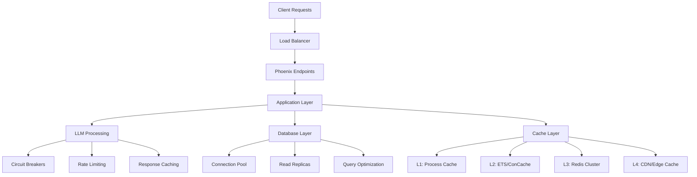

# Comprehensive Performance Optimization

**⚡ Advanced Performance Engineering** - Enterprise-grade performance optimization for Phoenix/Elixir applications with LLM integrations, covering BEAM VM tuning, advanced caching, scalability patterns, and production optimization.

## ⏱️ Time Estimates

📖 Reading time: 40 minutes | 🔧 Implementation time: 6-12 hours | 📊 Skill level: Advanced

<!-- NAV_START -->
## Navigation

**Current Location**: [Home](../../README.md) > [Guides](../README.md) > [Performance](README.md) > Comprehensive Performance Optimization

### Quick Links

- **📚 [Parent Directory](README.md)** - Return to performance guides
- **🏠 [Documentation Home](../../README.md)** - Main documentation index
- **🔍 [Search Documentation](../../reference/glossary.md)** - Find terms and concepts

### Related Documentation

- [Performance Optimization](performance-optimization.md) - Foundational performance practices
- [BEAM VM Optimization](beam-vm-optimization.md) - BEAM VM specific tuning
- [Security Framework](../security/comprehensive-security-framework.md) - Security considerations for performance
- [Production Guidelines](production-performance-guidelines.md) - Production deployment optimization
<!-- NAV_END -->

---

## Overview

This comprehensive performance optimization guide extends the foundational performance practices with advanced techniques specifically designed for Phoenix/Elixir applications with LLM integrations. It covers BEAM VM optimization, advanced concurrency patterns, sophisticated caching strategies, and enterprise-scale performance engineering.

## Performance Architecture

### High-Performance System Design



### Performance Principles for LLM-Integrated Systems

1. **Latency Optimization**: Minimize response times through intelligent caching and preprocessing
2. **Throughput Maximization**: Maximize concurrent request handling with proper resource management
3. **Resource Efficiency**: Optimize memory, CPU, and network utilization
4. **Fault Tolerance**: Maintain performance under failure conditions
5. **Scalability**: Design for horizontal and vertical scaling

## Advanced BEAM VM Optimization

### VM Configuration for High Performance

```bash
# rel/env.sh.eex - Production VM Configuration
#!/bin/sh

# BEAM VM Performance Tuning
export ERL_MAX_PORTS=65536
export ERL_MAX_ETS_TABLES=32768

# Scheduler Configuration
export ERL_THREAD_POOL_SIZE=64
export ERL_ASYNC_THREADS=64

# Memory Management
export ERL_FLAGS="
  +P 2000000
  +Q 1000000
  +K true
  +A 64
  +SDio 64
  +S 16:16
  +stbt db
  +sbwt none
  +swt low
  +swct 1000
  +sws 2048
  +swtdms 1ms
  +swtdcpu 85
  +sub true
  +Mulmbcs 8192
  +Mmbcgs 10
  +Mlmbcs 2048
  +Msbcs 1024
"

# JIT Compilation (Erlang/OTP 24+)
export ERL_FLAGS="$ERL_FLAGS +JMsingle true"

# Performance Monitoring
export ERL_FLAGS="$ERL_FLAGS +Mim true +Mis true +Mit X"
```

### Advanced Process Management

```elixir
# High-Performance GenServer Implementation
defmodule Prismatic.Performance.OptimizedGenServer do
  use GenServer
  require Logger
  
  @max_queue_length 10_000
  @memory_check_interval 5_000
  
  def start_link(opts) do
    GenServer.start_link(__MODULE__, opts, [
      spawn_opt: [priority: :high, fullsweep_after: 20],
      hibernate_after: 30_000
    ])
  end
  
  @impl true
  def init(opts) do
    # Enable process monitoring
    Process.flag(:trap_exit, true)
    Process.flag(:message_queue_data, :off_heap)
    
    # Schedule memory monitoring
    :timer.send_interval(@memory_check_interval, :check_memory)
    
    state = %{
      config: opts,
      stats: initialize_stats(),
      cache: :ets.new(:process_cache, [:set, :protected])
    }
    
    {:ok, state}
  end
  
  @impl true
  def handle_call(request, from, state) do
    # Check queue length for backpressure
    case :erlang.process_info(self(), :message_queue_len) do
      {:message_queue_len, len} when len > @max_queue_length ->
        {:reply, {:error, :overloaded}, state}
      _ ->
        handle_optimized_call(request, from, state)
    end
  end
  
  @impl true
  def handle_info(:check_memory, state) do
    case :erlang.process_info(self(), :memory) do
      {:memory, memory} when memory > 100_000_000 -> # 100MB threshold
        Logger.warning("High memory usage detected: #{memory} bytes")
        :erlang.garbage_collect(self())
        {:noreply, state}
      _ ->
        {:noreply, state}
    end
  end
end
```

### Memory-Efficient Data Structures

```elixir
# Optimized Data Structures for Performance
defmodule Prismatic.Performance.DataStructures do
  # Binary-optimized string operations
  def efficient_string_concat(strings) when is_list(strings) do
    # Use IO lists for efficient concatenation
    strings |> IO.iodata_to_binary()
  end
  
  # Memory-efficient large dataset processing
  def process_large_dataset(dataset) do
    dataset
    |> Stream.chunk_every(1000)  # Process in chunks
    |> Stream.map(&process_chunk/1)
    |> Stream.reject(&is_nil/1)
    |> Enum.to_list()
  end
  
  # ETS-based caching for frequently accessed data
  def create_high_performance_cache(name, options \\ []) do
    ets_options = [
      :set, :public, :named_table,
      {:write_concurrency, true},
      {:read_concurrency, true},
      {:decentralized_counters, true}
    ] ++ options
    
    :ets.new(name, ets_options)
  end
end
```

## Advanced Caching Strategies

### Multi-Level Intelligent Caching

```elixir
# Sophisticated Multi-Level Caching System
defmodule Prismatic.Performance.IntelligentCache do
  use GenServer
  require Logger
  
  @cache_levels [
    {:l1_process, %{size: 100, ttl: :timer.minutes(5)}},
    {:l2_ets, %{size: 10_000, ttl: :timer.minutes(30)}},
    {:l3_redis, %{size: 1_000_000, ttl: :timer.hours(6)}}
  ]
  
  def start_link(opts) do
    GenServer.start_link(__MODULE__, opts, name: __MODULE__)
  end
  
  def get(key, options \\ []) do
    GenServer.call(__MODULE__, {:get, key, options})
  end
  
  @impl true
  def init(_opts) do
    state = %{
      l1_cache: %{},
      l2_table: :ets.new(:l2_cache, [:set, :protected, {:read_concurrency, true}]),
      l3_connection: connect_to_redis_cluster(),
      cache_stats: initialize_cache_stats()
    }
    {:ok, state}
  end
  
  @impl true
  def handle_call({:get, key, options}, _from, state) do
    result = fetch_from_cache_hierarchy(key, state)
    {:reply, result, state}
  end
  
  defp fetch_from_cache_hierarchy(key, state) do
    # L1: Process cache (fastest)
    case Map.get(state.l1_cache, key) do
      nil ->
        # L2: ETS cache (very fast)
        case :ets.lookup(state.l2_table, key) do
          [{^key, value, expiry}] when expiry > :erlang.system_time(:second) ->
            {:hit, :l2, value}
          _ ->
            # L3: Redis cache (fast)
            case fetch_from_redis(key, state.l3_connection) do
              {:ok, value} -> {:hit, :l3, value}
              {:error, _} -> {:miss, :all_levels}
            end
        end
      {value, expiry} when expiry > :erlang.system_time(:second) ->
        {:hit, :l1, value}
      _ ->
        {:miss, :expired}
    end
  end
end
```

### Semantic Caching for LLM Responses

```elixir
# Semantic Caching for LLM Responses
defmodule Prismatic.Performance.SemanticCache do
  use GenServer
  require Logger
  
  @similarity_threshold 0.85
  @max_cache_size 100_000
  
  def start_link(opts) do
    GenServer.start_link(__MODULE__, opts, name: __MODULE__)
  end
  
  def get_similar_response(prompt, context \\ %{}) do
    GenServer.call(__MODULE__, {:get_similar, prompt, context}, 30_000)
  end
  
  @impl true
  def init(_opts) do
    state = %{
      cache_table: :ets.new(:semantic_cache, [:set, :protected, {:read_concurrency, true}]),
      embedding_cache: :ets.new(:embedding_cache, [:set, :protected]),
      cache_stats: %{hits: 0, misses: 0, total_requests: 0}
    }
    {:ok, state}
  end
  
  @impl true
  def handle_call({:get_similar, prompt, context}, _from, state) do
    result = find_similar_cached_response(prompt, context, state)
    {:reply, result, state}
  end
  
  defp find_similar_cached_response(prompt, context, state) do
    case generate_embedding(prompt) do
      {:ok, prompt_embedding} ->
        similar_entries = search_similar_embeddings(prompt_embedding, state)
        case similar_entries do
          [] -> {:not_found, :no_similar_embeddings}
          [{cache_key, similarity_score} | _] ->
            case :ets.lookup(state.cache_table, cache_key) do
              [{^cache_key, cached_data}] ->
                {:found, cached_data.response, similarity_score}
              [] ->
                {:not_found, :cache_entry_missing}
            end
        end
      {:error, reason} ->
        {:not_found, {:embedding_generation_failed, reason}}
    end
  end
end
```

## Database Performance Optimization

### Advanced Query Optimization

```elixir
# Advanced Database Query Optimization
defmodule Prismatic.Performance.DatabaseOptimizer do
  import Ecto.Query
  alias Prismatic.Repo
  
  # Optimized query patterns for common operations
  def popular_users_query do
    # Use database aggregation functions
    from(u in User,
      left_join: p in assoc(u, :posts),
      group_by: u.id,
      having: count(p.id) > 10,
      select: %{
        user: u,
        post_count: count(p.id),
        avg_likes: avg(p.likes_count),
        last_post_date: max(p.inserted_at)
      },
      order_by: [desc: count(p.id)]
    )
  end
  
  def paginated_users_query(cursor \\ nil, limit \\ 20) do
    # Cursor-based pagination for better performance
    base_query = from(u in User, order_by: [desc: u.id], limit: ^limit)
    
    case cursor do
      nil -> base_query
      cursor_id -> from(u in base_query, where: u.id < ^cursor_id)
    end
  end
  
  # Advanced connection pool configuration
  def configure_optimized_repo do
    config = [
      pool_size: calculate_optimal_pool_size(),
      queue_target: 50,
      queue_interval: 1000,
      checkout_timeout: 5_000,
      ownership_timeout: 10_000,
      timeout: 15_000
    ]
    
    Application.put_env(:prismatic, Prismatic.Repo, config)
  end
  
  defp calculate_optimal_pool_size do
    cpu_cores = System.schedulers_online()
    expected_load = Application.get_env(:prismatic, :expected_load, 1000)
    base_size = cpu_cores * 3
    overhead = 5
    load_factor = min(expected_load / 100, 5)
    round(base_size + overhead + load_factor)
  end
end
```

## LLM Performance Optimization

### Circuit Breaker Performance Tuning

```elixir
# High-Performance Circuit Breaker Implementation
defmodule Prismatic.Performance.OptimizedCircuitBreaker do
  use GenServer
  require Logger
  
  defstruct [:name, :state, :failure_count, :success_count, :performance_metrics]
  
  @performance_window_ms 60_000
  @latency_threshold_ms 5000
  
  def start_link({name, config}) do
    GenServer.start_link(__MODULE__, {name, config}, name: via_tuple(name))
  end
  
  def call(name, fun, timeout \\ 5000) do
    GenServer.call(via_tuple(name), {:call, fun}, timeout)
  end
  
  @impl true
  def init({name, config}) do
    state = %__MODULE__{
      name: name,
      state: :closed,
      failure_count: 0,
      success_count: 0,
      performance_metrics: initialize_performance_metrics()
    }
    {:ok, state}
  end
  
  @impl true
  def handle_call({:call, fun}, _from, state) do
    start_time = :erlang.monotonic_time(:millisecond)
    
    case state.state do
      :closed ->
        execute_with_monitoring(fun, start_time, state)
      :open ->
        if should_attempt_recovery?(state) do
          execute_with_monitoring(fun, start_time, %{state | state: :half_open})
        else
          {:reply, {:error, :circuit_breaker_open}, state}
        end
      :half_open ->
        execute_with_monitoring(fun, start_time, state)
    end
  end
  
  defp execute_with_monitoring(fun, start_time, state) do
    try do
      result = fun.()
      end_time = :erlang.monotonic_time(:millisecond)
      duration = end_time - start_time
      
      # Check for performance degradation
      performance_failure = duration > @latency_threshold_ms
      
      case {result, performance_failure} do
        {{:ok, response}, false} ->
          new_state = handle_success(state)
          {:reply, {:ok, response}, new_state}
        {{:ok, response}, true} ->
          new_state = handle_performance_degradation(state, duration)
          {:reply, {:ok, response}, new_state}
        {{:error, reason}, _} ->
          new_state = handle_failure(state, reason)
          {:reply, {:error, reason}, new_state}
      end
    rescue
      error ->
        new_state = handle_failure(state, error)
        {:reply, {:error, error}, new_state}
    end
  end
  
  defp via_tuple(name), do: {:via, Registry, {Prismatic.CircuitBreakerRegistry, name}}
end
```

## Infrastructure Performance

### Load Balancer Optimization

```nginx
# High-Performance Nginx Configuration
user nginx;
worker_processes auto;
worker_cpu_affinity auto;
worker_rlimit_nofile 65535;

events {
    worker_connections 4096;
    use epoll;
    multi_accept on;
    accept_mutex off;
}

http {
    # Performance Optimizations
    sendfile on;
    tcp_nopush on;
    tcp_nodelay on;
    
    # Timeouts
    keepalive_timeout 30;
    keepalive_requests 1000;
    
    # Buffer Sizes
    client_header_buffer_size 1k;
    large_client_header_buffers 4 4k;
    client_body_buffer_size 8k;
    
    # Gzip Configuration
    gzip on;
    gzip_vary on;
    gzip_min_length 1000;
    gzip_comp_level 6;
    
    # Upstream Configuration
    upstream prismatic_backend {
        least_conn;
        keepalive 32;
        keepalive_requests 1000;
        keepalive_timeout 60s;
        
        server app1:4000 max_fails=3 fail_timeout=30s weight=1;
        server app2:4000 max_fails=3 fail_timeout=30s weight=1;
        server app3:4000 max_fails=3 fail_timeout=30s weight=1;
    }
}
```

## Performance Monitoring

### Advanced Telemetry Configuration

```elixir
# Comprehensive Performance Telemetry
defmodule Prismatic.Performance.Telemetry do
  use Supervisor
  import Telemetry.Metrics
  
  def start_link(arg) do
    Supervisor.start_link(__MODULE__, arg, name: __MODULE__)
  end
  
  @impl true
  def init(_arg) do
    children = [
      {:telemetry_poller, measurements: measurements(), period: 5_000},
      {TelemetryMetricsPrometheus, metrics: prometheus_metrics()}
    ]
    
    Supervisor.init(children, strategy: :one_for_one)
  end
  
  def prometheus_metrics do
    [
      # Application Performance Metrics
      histogram("phoenix.endpoint.stop.duration",
        unit: {:native, :millisecond},
        tags: [:method, :route],
        buckets: [1, 5, 10, 25, 50, 100, 250, 500, 1000, 2500, 5000, 10000]
      ),
      
      # Database Performance Metrics
      histogram("prismatic.repo.query.total_time",
        unit: {:native, :millisecond},
        tags: [:source, :command],
        buckets: [1, 5, 10, 25, 50, 100, 250, 500, 1000, 2500, 5000]
      ),
      
      # LLM Performance Metrics
      histogram("prismatic.llm.request.duration",
        unit: {:native, :millisecond},
        tags: [:backend, :model, :result],
        buckets: [100, 500, 1000, 2000, 5000, 10000, 30000, 60000]
      ),
      
      # Cache Performance Metrics
      counter("prismatic.cache.operation.count",
        tags: [:cache_level, :operation, :result]
      ),
      
      # System Performance Metrics
      gauge("vm.memory.total", unit: {:byte, :megabyte}),
      gauge("vm.memory.processes", unit: {:byte, :megabyte}),
      gauge("vm.total_run_queue_lengths.total"),
      gauge("vm.process_count")
    ]
  end
  
  def measurements do
    [
      {__MODULE__, :dispatch_vm_measurements, []},
      {__MODULE__, :dispatch_application_measurements, []}
    ]
  end
  
  def dispatch_vm_measurements do
    memory = :erlang.memory()
    :telemetry.execute([:vm, :memory], memory, %{})
    
    process_count = :erlang.system_info(:process_count)
    :telemetry.execute([:vm, :system], %{process_count: process_count}, %{})
  end
end
```

## Performance Testing

### Load Testing with k6

```javascript
// k6 Load Testing Script for Prismatic
import http from 'k6/http';
import { check, sleep } from 'k6';
import { Rate, Counter } from 'k6/metrics';

const errorRate = new Rate('errors');
const apiCalls = new Counter('api_calls_total');

export let options = {
  stages: [
    { duration: '2m', target: 100 },   // Ramp up
    { duration: '5m', target: 100 },   // Stay at 100 users
    { duration: '2m', target: 200 },   // Ramp up to 200 users
    { duration: '5m', target: 200 },   // Stay at 200 users
    { duration: '2m', target: 0 },     // Ramp down
  ],
  thresholds: {
    http_req_duration: ['p(95)<500', 'p(99)<1000'],
    http_req_failed: ['rate<0.01'],
    errors: ['rate<0.01'],
  },
};

export default function() {
  const response = http.get('http://localhost:4000/api/health');
  
  const success = check(response, {
    'status is 200': (r) => r.status === 200,
    'response time < 500ms': (r) => r.timings.duration < 500,
  });
  
  errorRate.add(!success);
  apiCalls.add(1);
  
  sleep(1);
}
```

## Performance Optimization Checklist

### Development Phase
- [ ] **Code Review** - Review code for performance anti-patterns
- [ ] **Database Queries** - Optimize N+1 queries and add appropriate indexes
- [ ] **Caching Strategy** - Implement multi-level caching where appropriate
- [ ] **Memory Management** - Monitor for memory leaks and optimize garbage collection
- [ ] **Concurrency Design** - Use appropriate concurrency patterns

### Testing Phase
- [ ] **Load Testing** - Run load tests to identify bottlenecks
- [ ] **Performance Benchmarks** - Establish performance baselines
- [ ] **Database Performance** - Analyze query execution plans
- [ ] **Memory Profiling** - Profile memory usage under load
- [ ] **Monitoring Setup** - Configure performance monitoring

### Production Phase
- [ ] **Infrastructure Scaling** - Scale resources based on load patterns
- [ ] **CDN Configuration** - Optimize content delivery
- [ ] **Database Optimization** - Tune database configuration
- [ ] **Cache Warming** - Implement cache warming strategies
- [ ] **Performance Monitoring** - Continuous monitoring and alerting

## Related Documentation

- [Performance Optimization](performance-optimization.md) - Foundational performance practices
- [BEAM VM Optimization](beam-vm-optimization.md) - BEAM VM specific tuning
- [Security Framework](../security/comprehensive-security-framework.md) - Security considerations
- [Production Guidelines](production-performance-guidelines.md) - Production optimization
- [Monitoring Setup](../../operations/monitoring-setup.md) - Performance monitoring

---

**⚡ Performance Tip**: Great performance is achieved through consistent attention to performance considerations throughout the development lifecycle, not just during optimization phases. Measure first, optimize based on data, and monitor continuously.