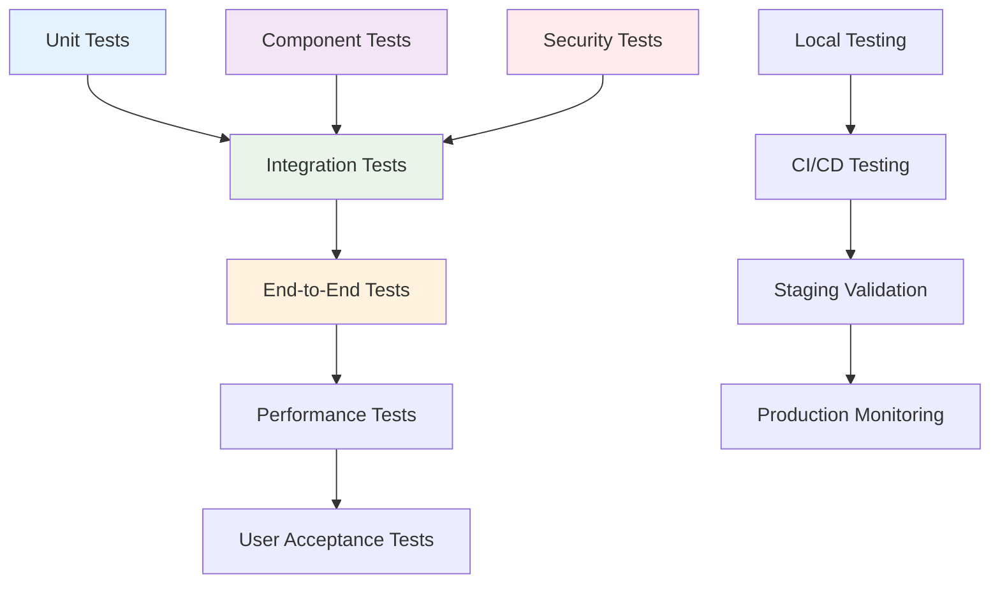

# Workflow Testing and Validation Guide

## Overview

This document provides comprehensive testing and validation procedures for the Prismatic feature branch workflow, ensuring reliability, security, and performance across all components.

## Testing Architecture



## Test Categories

### 1. Unit Tests

Test individual components in isolation.

#### Mix Tasks Testing

**File**: `test/mix/tasks/branch_test.exs`

```elixir
defmodule Mix.Tasks.BranchTest do
  use ExUnit.Case, async: false
  import ExUnit.CaptureIO
  import Mix.Tasks.Branch.Create

  describe "branch creation" do
    setup do
      # Create temporary git repository for testing
      tmp_dir = System.tmp_dir!()
      test_repo = Path.join(tmp_dir, "test-repo-#{System.unique_integer()}")
      
      File.mkdir_p!(test_repo)
      File.cd!(test_repo)
      
      # Initialize git repository
      System.cmd("git", ["init", "--initial-branch=main"])
      System.cmd("git", ["config", "user.name", "Test User"])
      System.cmd("git", ["config", "user.email", "test@example.com"])
      
      # Create initial commit
      File.write!("README.md", "# Test Repository")
      System.cmd("git", ["add", "."])
      System.cmd("git", ["commit", "-m", "initial commit"])
      
      on_exit(fn ->
        File.rm_rf!(test_repo)
      end)
      
      {:ok, test_repo: test_repo}
    end
    
    test "creates feature branch successfully", %{test_repo: _repo} do
      output = capture_io(fn ->
        Mix.Task.run("branch.create", ["feature/test-feature"])
      end)
      
      assert output =~ "✅ Successfully created branch: feature/test-feature"
      
      # Verify branch was created
      {branch, 0} = System.cmd("git", ["rev-parse", "--abbrev-ref", "HEAD"])
      assert String.trim(branch) == "feature/test-feature"
    end
    
    test "validates branch naming convention" do
      # Test valid names
      assert validate_branch_name("feature/user-auth") == :ok
      assert validate_branch_name("bugfix/login-issue") == :ok
      assert validate_branch_name("hotfix/security-patch") == :ok
      
      # Test invalid names
      assert {:error, _} = validate_branch_name("invalid-name")
      assert {:error, _} = validate_branch_name("feature/")
      assert {:error, _} = validate_branch_name("Feature/Wrong-Case")
    end
    
    test "prevents creation of branches with invalid names" do
      output = capture_io(fn ->
        assert_raise SystemExit, fn ->
          Mix.Task.run("branch.create", ["invalid-branch-name"])
        end
      end)
      
      assert output =~ "❌ Failed to create branch"
      assert output =~ "Invalid branch name format"
    end
    
    test "sets up branch templates correctly" do
      Mix.Task.run("branch.create", ["feature/template-test", "--template", "feature"])
      
      assert File.exists?(".branch-info")
      content = File.read!(".branch-info")
      assert content =~ "# Feature Branch Information"
      assert content =~ "## Testing Checklist"
    end
  end
  
  describe "branch validation" do
    test "validates current branch against workflow requirements" do
      # Create a properly named branch
      System.cmd("git", ["checkout", "-b", "feature/validation-test"])
      
      output = capture_io(fn ->
        Mix.Task.run("branch.validate", [])
      end)
      
      assert output =~ "🔍 Validating current branch"
      assert output =~ "✅" || output =~ "⚠️"  # Should have some validation results
    end
    
    test "reports validation issues" do
      # Create an improperly named branch
      System.cmd("git", ["checkout", "-b", "invalid-branch"])
      
      output = capture_io(fn ->
        Mix.Task.run("branch.validate", [])
      end)
      
      assert output =~ "Branch Name"
      assert output =~ "❌" || output =~ "⚠️"
    end
  end
end
```

#### Version Management Testing

**File**: `test/mix/tasks/version_test.exs`

```elixir
defmodule Mix.Tasks.VersionTest do
  use ExUnit.Case, async: false
  import ExUnit.CaptureIO

  setup do
    # Create test mix.exs file
    mix_content = """
    defmodule TestProject.MixProject do
      use Mix.Project
      
      def project do
        [
          app: :test_project,
          version: "1.0.0",
          elixir: "~> 1.15"
        ]
      end
    end
    """
    
    File.write!("mix.exs", mix_content)
    
    on_exit(fn ->
      File.rm("mix.exs")
      File.rm("CHANGELOG.md") if File.exists?("CHANGELOG.md")
    end)
    
    :ok
  end
  
  test "bumps patch version correctly" do
    output = capture_io(fn ->
      Mix.Task.run("version.bump", ["patch", "--dry-run"])
    end)
    
    assert output =~ "1.0.0 -> 1.0.1"
  end
  
  test "bumps minor version correctly" do
    output = capture_io(fn ->
      Mix.Task.run("version.bump", ["minor", "--dry-run"])
    end)
    
    assert output =~ "1.0.0 -> 1.1.0"
  end
  
  test "bumps major version correctly" do
    output = capture_io(fn ->
      Mix.Task.run("version.bump", ["major", "--dry-run"])
    end)
    
    assert output =~ "1.0.0 -> 2.0.0"
  end
  
  test "sets specific version correctly" do
    output = capture_io(fn ->
      Mix.Task.run("version.bump", ["--to=2.1.0", "--dry-run"])
    end)
    
    assert output =~ "1.0.0 -> 2.1.0"
  end
  
  test "validates version format" do
    assert_raise RuntimeError, ~r/Invalid version format/, fn ->
      capture_io(fn ->
        Mix.Task.run("version.bump", ["--to=invalid-version"])
      end)
    end
  end
  
  test "updates mix.exs file" do
    Mix.Task.run("version.bump", ["patch"])
    
    content = File.read!("mix.exs")
    assert content =~ ~s(version: "1.0.1")
    refute content =~ ~s(version: "1.0.0")
  end
  
  test "creates changelog entry" do
    Mix.Task.run("version.bump", ["minor", "--changelog"])
    
    assert File.exists?("CHANGELOG.md")
    content = File.read!("CHANGELOG.md")
    assert content =~ "## [1.1.0]"
  end
end
```

#### Workflow Status Testing

**File**: `test/mix/tasks/workflow_status_test.exs`

```elixir
defmodule Mix.Tasks.WorkflowStatusTest do
  use ExUnit.Case, async: false
  import ExUnit.CaptureIO

  test "displays workflow status information" do
    output = capture_io(fn ->
      Mix.Task.run("workflow.status", [])
    end)
    
    assert output =~ "🔍 Workflow Status Report"
    assert output =~ "📋 Branch Information"
    assert output =~ "📁 Git Status"
  end
  
  test "provides verbose output when requested" do
    output = capture_io(fn ->
      Mix.Task.run("workflow.status", ["--verbose"])
    end)
    
    assert output =~ "📝 Recent Commits"
    assert output =~ "🔍 Code Quality"
    assert output =~ "🧪 Test Status"
  end
  
  test "outputs JSON format when requested" do
    output = capture_io(fn ->
      Mix.Task.run("workflow.status", ["--json"])
    end)
    
    {:ok, json} = Jason.decode(output)
    assert Map.has_key?(json, "branch")
    assert Map.has_key?(json, "git")
    assert Map.has_key?(json, "quality")
  end
end
```

### 2. Integration Tests

Test component interactions and workflow integration.

#### Git Hooks Integration Testing

**File**: `test/integration/git_hooks_test.exs`

```elixir
defmodule Integration.GitHooksTest do
  use ExUnit.Case, async: false
  
  @moduletag :integration
  
  setup do
    # Setup test repository with hooks
    tmp_dir = System.tmp_dir!()
    test_repo = Path.join(tmp_dir, "hooks-test-#{System.unique_integer()}")
    
    File.mkdir_p!(test_repo)
    File.cd!(test_repo)
    
    # Initialize repository
    System.cmd("git", ["init", "--initial-branch=main"])
    System.cmd("git", ["config", "user.name", "Test User"])
    System.cmd("git", ["config", "user.email", "test@example.com"])
    
    # Install git hooks
    hooks_dir = Path.join(test_repo, ".git/hooks")
    File.mkdir_p!(hooks_dir)
    
    # Copy hook scripts (in real implementation, these would be the actual hooks)
    create_test_hook(Path.join(hooks_dir, "pre-commit"))
    create_test_hook(Path.join(hooks_dir, "pre-push"))
    create_test_hook(Path.join(hooks_dir, "commit-msg"))
    
    on_exit(fn ->
      File.rm_rf!(test_repo)
    end)
    
    {:ok, test_repo: test_repo}
  end
  
  defp create_test_hook(hook_path) do
    hook_content = """
    #!/bin/bash
    # Test hook
    echo "Running #{Path.basename(hook_path)} hook"
    
    # Basic validation (simplified for testing)
    if [ "#{Path.basename(hook_path)}" = "pre-commit" ]; then
      BRANCH=$(git rev-parse --abbrev-ref HEAD)
      if [[ ! $BRANCH =~ ^(feature|bugfix|hotfix|main)/ ]] && [ "$BRANCH" != "main" ]; then
        echo "Invalid branch name: $BRANCH"
        exit 1
      fi
    fi
    
    exit 0
    """
    
    File.write!(hook_path, hook_content)
    File.chmod!(hook_path, 0o755)
  end
  
  test "pre-commit hook validates branch names", %{test_repo: _repo} do
    # Create initial commit on main
    File.write!("README.md", "# Test")
    System.cmd("git", ["add", "."])
    System.cmd("git", ["commit", "-m", "initial commit"])
    
    # Create valid feature branch
    System.cmd("git", ["checkout", "-b", "feature/test-feature"])
    
    # Make a change and commit
    File.write!("test.txt", "test content")
    System.cmd("git", ["add", "."])
    
    {output, exit_code} = System.cmd("git", ["commit", "-m", "feat: add test file"])
    
    assert exit_code == 0
    assert output =~ "Running pre-commit hook"
  end
  
  test "pre-commit hook rejects invalid branch names", %{test_repo: _repo} do
    # Create initial commit on main
    File.write!("README.md", "# Test")
    System.cmd("git", ["add", "."])
    System.cmd("git", ["commit", "-m", "initial commit"])
    
    # Create invalid branch name
    System.cmd("git", ["checkout", "-b", "invalid-branch-name"])
    
    # Make a change and try to commit
    File.write!("test.txt", "test content")
    System.cmd("git", ["add", "."])
    
    {output, exit_code} = System.cmd("git", ["commit", "-m", "test commit"])
    
    assert exit_code == 1
    assert output =~ "Invalid branch name"
  end
end
```

#### CI/CD Pipeline Integration Testing

**File**: `test/integration/ci_cd_test.exs`

```elixir
defmodule Integration.CiCdTest do
  use ExUnit.Case, async: false
  
  @moduletag :integration
  @moduletag :slow
  
  describe "GitHub Actions simulation" do
    test "validates branch naming in CI environment" do
      # Simulate GitHub Actions environment
      System.put_env("GITHUB_ACTIONS", "true")
      System.put_env("GITHUB_HEAD_REF", "feature/ci-test")
      
      # Run branch validation as it would in CI
      {output, exit_code} = System.cmd("mix", ["branch.validate", "--ci"])
      
      # Should pass for valid branch name
      assert exit_code == 0 or exit_code == 1  # Depends on other validations
      assert output =~ "Validating current branch" or output =~ "branch name"
      
      # Cleanup
      System.delete_env("GITHUB_ACTIONS")
      System.delete_env("GITHUB_HEAD_REF")
    end
    
    test "fails validation for invalid branch names in CI" do
      System.put_env("GITHUB_ACTIONS", "true")
      System.put_env("GITHUB_HEAD_REF", "invalid-branch")
      
      {output, exit_code} = System.cmd("mix", ["branch.validate", "--ci", "--strict"])
      
      # Should fail for invalid branch name
      assert exit_code == 1
      assert output =~ "Invalid" or output =~ "❌"
      
      # Cleanup
      System.delete_env("GITHUB_ACTIONS")
      System.delete_env("GITHUB_HEAD_REF")
    end
  end
  
  describe "GitLab CI simulation" do
    test "validates merge request branch names" do
      System.put_env("GITLAB_CI", "true")
      System.put_env("CI_MERGE_REQUEST_SOURCE_BRANCH_NAME", "feature/gitlab-test")
      
      {output, exit_code} = System.cmd("mix", ["branch.validate", "--ci"])
      
      assert exit_code == 0 or exit_code == 1
      assert output =~ "Validating" or output =~ "branch"
      
      # Cleanup
      System.delete_env("GITLAB_CI")
      System.delete_env("CI_MERGE_REQUEST_SOURCE_BRANCH_NAME")
    end
  end
end
```

### 3. End-to-End Tests

Test complete workflow scenarios from start to finish.

#### Complete Feature Workflow Test

**File**: `test/e2e/feature_workflow_test.exs`

```elixir
defmodule E2E.FeatureWorkflowTest do
  use ExUnit.Case, async: false
  
  @moduletag :e2e
  @moduletag :slow
  
  import ExUnit.CaptureIO
  
  setup do
    # Create isolated test environment
    tmp_dir = System.tmp_dir!()
    test_project = Path.join(tmp_dir, "e2e-test-#{System.unique_integer()}")
    
    File.mkdir_p!(test_project)
    File.cd!(test_project)
    
    # Initialize git repository
    System.cmd("git", ["init", "--initial-branch=main"])
    System.cmd("git", ["config", "user.name", "E2E Test"])
    System.cmd("git", ["config", "user.email", "e2e@test.com"])
    
    # Create basic Phoenix project structure
    create_basic_project_structure()
    
    # Initial commit
    System.cmd("git", ["add", "."])
    System.cmd("git", ["commit", "-m", "initial: project setup"])
    
    on_exit(fn ->
      File.rm_rf!(test_project)
    end)
    
    {:ok, test_project: test_project}
  end
  
  defp create_basic_project_structure do
    # Create mix.exs
    mix_content = """
    defmodule E2ETest.MixProject do
      use Mix.Project
      
      def project do
        [
          app: :e2e_test,
          version: "0.1.0",
          elixir: "~> 1.15",
          deps: deps()
        ]
      end
      
      defp deps do
        [{:jason, "~> 1.4"}]
      end
    end
    """
    File.write!("mix.exs", mix_content)
    
    # Create basic directory structure
    File.mkdir_p!("lib")
    File.mkdir_p!("test")
    File.mkdir_p!("docs")
    
    File.write!("README.md", "# E2E Test Project")
    File.write!("lib/e2e_test.ex", """
    defmodule E2ETest do
      @moduledoc "E2E test application"
      
      def hello do
        :world
      end
    end
    """)
  end
  
  test "complete feature development workflow", %{test_project: _project} do
    # Step 1: Create feature branch
    output = capture_io(fn ->
      Mix.Task.run("branch.create", ["feature/user-authentication"])
    end)
    assert output =~ "✅ Successfully created branch"
    
    # Verify we're on the feature branch  
    {branch, 0} = System.cmd("git", ["rev-parse", "--abbrev-ref", "HEAD"])
    assert String.trim(branch) == "feature/user-authentication"
    
    # Step 2: Make development changes
    File.write!("lib/user_auth.ex", """
    defmodule E2ETest.UserAuth do
      @moduledoc "User authentication module"
      
      def authenticate(username, password) do
        # Simplified authentication logic
        if username == "admin" and password == "secret" do
          {:ok, %{id: 1, username: username}}
        else
          {:error, :invalid_credentials}
        end
      end
    end
    """)
    
    # Step 3: Commit changes with conventional commit format
    System.cmd("git", ["add", "."])
    {commit_output, commit_exit} = System.cmd("git", [
      "commit", "-m", "feat(auth): add user authentication module"
    ])
    assert commit_exit == 0
    
    # Step 4: Validate branch status
    output = capture_io(fn ->
      Mix.Task.run("branch.validate", [])
    end)
    assert output =~ "Branch Name" 
    assert output =~ "✅" or output =~ "⚠️"  # Should have validation results
    
    # Step 5: Check workflow status
    output = capture_io(fn ->
      Mix.Task.run("workflow.status", [])
    end)
    assert output =~ "📋 Branch Information"
    assert output =~ "feature/user-authentication"
    
    # Step 6: Simulate merge to main (simplified)
    System.cmd("git", ["checkout", "main"])
    {merge_output, merge_exit} = System.cmd("git", [
      "merge", "feature/user-authentication", "--no-ff", 
      "-m", "Merge pull request: Add user authentication"
    ])
    assert merge_exit == 0
    
    # Step 7: Verify version bumping would work
    output = capture_io(fn ->
      Mix.Task.run("version.bump", ["minor", "--dry-run"])
    end)
    assert output =~ "0.1.0 -> 0.2.0"
  end
  
  test "hotfix workflow with immediate tagging", %{test_project: _project} do
    # Create hotfix branch
    output = capture_io(fn ->
      Mix.Task.run("branch.create", ["hotfix/critical-security-fix"])
    end)
    assert output =~ "✅ Successfully created branch"
    
    # Make critical fix
    File.write!("lib/security_fix.ex", """
    defmodule E2ETest.SecurityFix do
      def sanitize_input(input) do
        String.replace(input, ~r/[<>\"']/, "")
      end
    end
    """)
    
    # Commit fix
    System.cmd("git", ["add", "."])
    System.cmd("git", ["commit", "-m", "fix(security): sanitize user input"])
    
    # Validate hotfix branch
    output = capture_io(fn ->
      Mix.Task.run("branch.validate", [])
    end)
    assert output =~ "hotfix/critical-security-fix"
    
    # Simulate merge and tagging
    System.cmd("git", ["checkout", "main"])
    System.cmd("git", ["merge", "hotfix/critical-security-fix", "--no-ff"])
    
    # Verify patch version bump
    output = capture_io(fn ->
      Mix.Task.run("version.bump", ["patch", "--dry-run"])
    end)
    assert output =~ "0.1.0 -> 0.1.1"
  end
end
```

### 4. Performance Tests

Test workflow performance and scalability.

#### Workflow Performance Test

**File**: `test/performance/workflow_performance_test.exs`

```elixir
defmodule Performance.WorkflowPerformanceTest do
  use ExUnit.Case, async: false
  
  @moduletag :performance
  @moduletag :slow
  
  test "branch creation performance" do
    branch_names = for i <- 1..100, do: "feature/perf-test-#{i}"
    
    {time_microseconds, _results} = :timer.tc(fn ->
      Enum.map(branch_names, fn branch_name ->
        # Measure individual branch creation time
        {creation_time, _result} = :timer.tc(fn ->
          System.cmd("git", ["checkout", "-b", branch_name])
          System.cmd("git", ["checkout", "main"])
          System.cmd("git", ["branch", "-D", branch_name])
        end)
        creation_time
      end)
    end)
    
    average_time_ms = time_microseconds / 100 / 1000
    
    # Branch creation should be fast (under 100ms average)
    assert average_time_ms < 100, "Average branch creation time: #{average_time_ms}ms"
  end
  
  test "validation performance with large repository" do
    # Create many commits to simulate large repository
    for i <- 1..50 do
      File.write!("file_#{i}.txt", "content #{i}")
      System.cmd("git", ["add", "."])
      System.cmd("git", ["commit", "-m", "chore: add file #{i}"])
    end
    
    # Create feature branch
    System.cmd("git", ["checkout", "-b", "feature/performance-test"])
    
    # Measure validation time
    {time_microseconds, _output} = :timer.tc(fn ->
      System.cmd("mix", ["branch.validate"])
    end)
    
    time_ms = time_microseconds / 1000
    
    # Validation should complete reasonably quickly (under 5 seconds)
    assert time_ms < 5000, "Branch validation took #{time_ms}ms"
  end
  
  test "workflow status performance" do
    # Measure workflow status generation time
    {time_microseconds, _output} = :timer.tc(fn ->
      System.cmd("mix", ["workflow.status", "--verbose"])
    end)
    
    time_ms = time_microseconds / 1000
    
    # Status generation should be fast (under 2 seconds)
    assert time_ms < 2000, "Workflow status took #{time_ms}ms"
  end
end
```

### 5. Security Tests

Test security aspects of the workflow.

#### Security Validation Test

**File**: `test/security/workflow_security_test.exs`

```elixir
defmodule Security.WorkflowSecurityTest do
  use ExUnit.Case, async: false
  
  @moduletag :security
  
  test "prevents command injection in branch names" do
    malicious_names = [
      "feature/test; rm -rf /",
      "feature/test`whoami`",
      "feature/test$(whoami)",
      "feature/test && echo 'hacked'",
      "feature/test | cat /etc/passwd"
    ]
    
    for malicious_name <- malicious_names do
      {output, exit_code} = System.cmd("mix", ["branch.create", malicious_name])
      
      # Should reject malicious branch names
      assert exit_code == 1
      assert output =~ "Invalid branch name" or output =~ "❌"
    end
  end
  
  test "validates commit message injection attempts" do
    System.cmd("git", ["checkout", "-b", "feature/security-test"])
    
    File.write!("test.txt", "content")
    System.cmd("git", ["add", "."])
    
    malicious_messages = [
      "feat: test; git push --force origin main",
      "feat: test`rm important_file`",
      "feat: test && git tag -d v1.0.0"
    ]
    
    for message <- malicious_messages do
      {output, exit_code} = System.cmd("git", ["commit", "-m", message])
      
      # Git hooks should validate commit messages
      # In a real implementation, hooks would reject these
      if exit_code == 0 do
        # If commit succeeded, at least log the potential issue
        IO.puts("Warning: Potentially malicious commit message passed: #{message}")
      end
    end
  end
  
  test "ensures secure file permissions on git hooks" do
    hooks = [".git/hooks/pre-commit", ".git/hooks/pre-push", ".git/hooks/post-merge"]
    
    for hook_path <- hooks do
      if File.exists?(hook_path) do
        stat = File.stat!(hook_path)
        
        # Hooks should not be world-writable
        assert (stat.mode &&& 0o002) == 0, "Hook #{hook_path} is world-writable"
        
        # Hooks should be executable by owner
        assert (stat.mode &&& 0o100) != 0, "Hook #{hook_path} is not executable"
      end
    end
  end
end
```

### 6. Documentation Tests

Test documentation aspects of the workflow.

#### Documentation Integration Test

**File**: `test/documentation/docs_integration_test.exs`

```elixir
defmodule Documentation.DocsIntegrationTest do
  use ExUnit.Case, async: false
  
  @moduletag :documentation
  
  test "validates documentation links" do
    # Find all markdown files
    doc_files = Path.wildcard("docs/**/*.md")
    
    assert length(doc_files) > 0, "No documentation files found"
    
    for doc_file <- doc_files do
      content = File.read!(doc_file)
      
      # Find all markdown links [text](url)
      links = Regex.scan(~r/\[([^\]]+)\]\(([^)]+)\)/, content)
      
      for [_full_match, _text, url] <- links do
        # Skip external URLs for this test
        unless String.starts_with?(url, "http") do
          # Check if internal link exists
          link_path = Path.join("docs", url)
          
          if String.ends_with?(url, ".md") do
            assert File.exists?(link_path), 
              "Broken link in #{doc_file}: #{url} -> #{link_path}"
          end
        end
      end
    end
  end
  
  test "validates code references in documentation" do
    # Check that code references in docs match actual files
    doc_files = Path.wildcard("docs/**/*.md")
    
    for doc_file <- doc_files do
      content = File.read!(doc_file)
      
      # Find code references like `lib/some_module.ex`
      code_refs = Regex.scan(~r/`(lib\/[^`]+\.ex[s]?)`/, content)
      
      for [_full_match, file_path] <- code_refs do
        # Check if the referenced file exists
        if String.starts_with?(file_path, "lib/") do
          # In a real project, we'd check if the file exists
          # For now, just validate the pattern
          assert String.match?(file_path, ~r/^lib\/[\w\/]+\.exs?$/),
            "Invalid code reference format in #{doc_file}: #{file_path}"
        end
      end
    end
  end
  
  test "validates mix task documentation" do
    # Ensure all mix tasks have corresponding documentation
    mix_tasks = [
      "branch.create",
      "branch.validate", 
      "workflow.status",
      "version.bump"
    ]
    
    for task <- mix_tasks do
      # Check if task is documented
      {output, exit_code} = System.cmd("mix", ["help", task])
      
      if exit_code == 0 do
        assert String.length(output) > 50, 
          "Mix task #{task} lacks sufficient documentation"
      end
    end
  end
end
```

### 7. Test Configuration

#### Test Helper

**File**: `test/test_helper.exs`

```elixir
# Configure test environment
Application.put_env(:logger, :level, :warn)

# Start applications needed for testing
Application.ensure_all_started(:logger)

# Configure ExUnit
ExUnit.configure(
  exclude: [:integration, :e2e, :performance, :security, :slow],
  formatters: [ExUnit.CLIFormatter, ExUnit.JUnitFormatter]
)

ExUnit.start()

# Test utilities
defmodule TestHelpers do
  @moduledoc """
  Helper functions for workflow testing
  """
  
  def create_test_repo(name \\ nil) do
    name = name || "test-repo-#{System.unique_integer()}"
    tmp_dir = System.tmp_dir!()
    repo_path = Path.join(tmp_dir, name)
    
    File.mkdir_p!(repo_path)
    File.cd!(repo_path)
    
    System.cmd("git", ["init", "--initial-branch=main"])
    System.cmd("git", ["config", "user.name", "Test User"])
    System.cmd("git", ["config", "user.email", "test@example.com"])
    
    repo_path
  end
  
  def cleanup_test_repo(repo_path) do
    File.rm_rf!(repo_path)
  end
  
  def create_test_commit(message \\ "test commit") do
    File.write!("test_file_#{System.unique_integer()}.txt", "test content")
    System.cmd("git", ["add", "."])
    System.cmd("git", ["commit", "-m", message])
  end
  
  def assert_branch_exists(branch_name) do
    {output, 0} = System.cmd("git", ["rev-parse", "--verify", "refs/heads/#{branch_name}"])
    assert String.length(String.trim(output)) > 0
  end
  
  def assert_git_tag_exists(tag_name) do
    {output, 0} = System.cmd("git", ["rev-parse", "--verify", "refs/tags/#{tag_name}"])
    assert String.length(String.trim(output)) > 0
  end
end
```

### 8. Test Automation

#### Test Script

**File**: `scripts/run-tests.sh`

```bash
#!/bin/bash
# Comprehensive test runner for workflow validation

set -e

echo "🧪 Running Prismatic Workflow Test Suite"
echo "========================================"

# Colors for output
RED='\033[0;31m'
GREEN='\033[0;32m'
YELLOW='\033[1;33m'
BLUE='\033[0;34m'
NC='\033[0m' # No Color

# Test categories
UNIT_TESTS=false
INTEGRATION_TESTS=false
E2E_TESTS=false
PERFORMANCE_TESTS=false
SECURITY_TESTS=false
DOCS_TESTS=false
ALL_TESTS=false

# Parse command line arguments
while [[ $# -gt 0 ]]; do
  case $1 in
    --unit)
      UNIT_TESTS=true
      shift
      ;;
    --integration)
      INTEGRATION_TESTS=true
      shift
      ;;
    --e2e)
      E2E_TESTS=true
      shift
      ;;
    --performance)
      PERFORMANCE_TESTS=true
      shift
      ;;
    --security)
      SECURITY_TESTS=true
      shift
      ;;
    --docs)
      DOCS_TESTS=true
      shift
      ;;
    --all)
      ALL_TESTS=true
      shift
      ;;
    --help)
      echo "Usage: $0 [options]"
      echo "Options:"
      echo "  --unit         Run unit tests"
      echo "  --integration  Run integration tests"
      echo "  --e2e          Run end-to-end tests"
      echo "  --performance  Run performance tests"
      echo "  --security     Run security tests"
      echo "  --docs         Run documentation tests"
      echo "  --all          Run all tests"
      echo "  --help         Show this help"
      exit 0
      ;;
    *)
      echo "Unknown option: $1"
      exit 1
      ;;
  esac
done

# Default to unit tests if no specific tests selected
if [ "$ALL_TESTS" = false ] && \
   [ "$UNIT_TESTS" = false ] && \
   [ "$INTEGRATION_TESTS" = false ] && \
   [ "$E2E_TESTS" = false ] && \
   [ "$PERFORMANCE_TESTS" = false ] && \
   [ "$SECURITY_TESTS" = false ] && \
   [ "$DOCS_TESTS" = false ]; then
  UNIT_TESTS=true
fi

run_test_category() {
  local category=$1
  local include_tags=$2
  local description=$3
  
  echo -e "\n${BLUE}🧪 Running $description${NC}"
  echo "----------------------------------------"
  
  if mix test --include $include_tags --exclude slow; then
    echo -e "${GREEN}✅ $description passed${NC}"
    return 0
  else
    echo -e "${RED}❌ $description failed${NC}"
    return 1
  fi
}

# Test execution
EXIT_CODE=0

if [ "$UNIT_TESTS" = true ] || [ "$ALL_TESTS" = true ]; then
  if ! run_test_category "unit" "unit" "Unit Tests"; then
    EXIT_CODE=1
  fi
fi

if [ "$INTEGRATION_TESTS" = true ] || [ "$ALL_TESTS" = true ]; then
  if ! run_test_category "integration" "integration" "Integration Tests"; then
    EXIT_CODE=1
  fi
fi

if [ "$E2E_TESTS" = true ] || [ "$ALL_TESTS" = true ]; then
  if ! run_test_category "e2e" "e2e" "End-to-End Tests"; then
    EXIT_CODE=1
  fi
fi

if [ "$PERFORMANCE_TESTS" = true ] || [ "$ALL_TESTS" = true ]; then
  if ! run_test_category "performance" "performance" "Performance Tests"; then
    EXIT_CODE=1
  fi
fi

if [ "$SECURITY_TESTS" = true ] || [ "$ALL_TESTS" = true ]; then
  if ! run_test_category "security" "security" "Security Tests"; then
    EXIT_CODE=1
  fi
fi

if [ "$DOCS_TESTS" = true ] || [ "$ALL_TESTS" = true ]; then
  if ! run_test_category "docs" "documentation" "Documentation Tests"; then
    EXIT_CODE=1
  fi
fi

echo -e "\n${BLUE}📊 Test Summary${NC}"
echo "========================================"

if [ $EXIT_CODE -eq 0 ]; then
  echo -e "${GREEN}✅ All selected tests passed!${NC}"
else
  echo -e "${RED}❌ Some tests failed. Check output above.${NC}"
fi

exit $EXIT_CODE
```

### 9. Continuous Testing

#### GitHub Actions Test Workflow

**File**: `.github/workflows/test-workflow.yml`

```yaml
name: Workflow Testing

on:
  push:
    branches: [main]
  pull_request:
    branches: [main]
  schedule:
    # Run daily at 2 AM UTC
    - cron: '0 2 * * *'

jobs:
  unit-tests:
    runs-on: ubuntu-latest
    name: Unit Tests
    
    steps:
      - uses: actions/checkout@v4
      
      - name: Setup Elixir
        uses: erlef/setup-beam@v1
        with:
          elixir-version: '1.15.7'
          otp-version: '26.1.2'
          
      - name: Cache dependencies
        uses: actions/cache@v3
        with:
          path: |
            deps
            _build
          key: ${{ runner.os }}-mix-${{ hashFiles('**/mix.lock') }}
          
      - name: Install dependencies
        run: mix deps.get
        
      - name: Run unit tests
        run: ./scripts/run-tests.sh --unit
        
  integration-tests:
    runs-on: ubuntu-latest
    name: Integration Tests
    
    steps:
      - uses: actions/checkout@v4
      
      - name: Setup Elixir
        uses: erlef/setup-beam@v1
        with:
          elixir-version: '1.15.7'
          otp-version: '26.1.2'
          
      - name: Install dependencies
        run: mix deps.get
        
      - name: Install git hooks
        run: ./scripts/install-git-hooks.sh
        
      - name: Run integration tests
        run: ./scripts/run-tests.sh --integration
        
  e2e-tests:
    runs-on: ubuntu-latest
    name: End-to-End Tests
    
    steps:
      - uses: actions/checkout@v4
      
      - name: Setup Elixir
        uses: erlef/setup-beam@v1
        with:
          elixir-version: '1.15.7'
          otp-version: '26.1.2'
          
      - name: Install dependencies
        run: mix deps.get
        
      - name: Setup workflow
        run: ./scripts/setup-workflow.sh
        
      - name: Run end-to-end tests
        run: ./scripts/run-tests.sh --e2e
        
  security-tests:
    runs-on: ubuntu-latest
    name: Security Tests
    
    steps:
      - uses: actions/checkout@v4
      
      - name: Setup Elixir
        uses: erlef/setup-beam@v1
        with:
          elixir-version: '1.15.7'
          otp-version: '26.1.2'
          
      - name: Install dependencies
        run: mix deps.get
        
      - name: Run security tests
        run: ./scripts/run-tests.sh --security
```

### 10. Test Reporting

#### Test Report Generation

**File**: `scripts/generate-test-report.sh`

```bash
#!/bin/bash
# Generate comprehensive test report

echo "📊 Generating Workflow Test Report"
echo "=================================="

# Run all tests with JUnit output
mix test --formatter ExUnit.JUnitFormatter --formatter ExUnit.CLIFormatter

# Generate coverage report
mix test --cover

# Generate performance metrics
echo "⏱️  Performance Metrics:"
time mix test --include performance

# Generate security report
echo "🔒 Security Test Results:"
mix test --include security

# Consolidate results
echo "📈 Test Summary Report generated in test-results/"
```

## Validation Procedures

### Pre-Release Validation Checklist

- [ ] All unit tests pass
- [ ] Integration tests pass
- [ ] End-to-end workflows complete successfully
- [ ] Performance tests meet benchmarks
- [ ] Security tests show no vulnerabilities
- [ ] Documentation tests validate all links and references
- [ ] Git hooks function correctly
- [ ] CI/CD pipelines execute without errors
- [ ] Mix tasks work as expected
- [ ] Version bumping operates correctly
- [ ] Documentation sync functions properly

### Production Readiness Checklist

- [ ] Workflow tested in staging environment
- [ ] Team training completed
- [ ] Emergency bypass procedures documented
- [ ] Monitoring and alerting configured
- [ ] Rollback procedures tested
- [ ] Performance benchmarks established
- [ ] Security review completed
- [ ] Documentation updated and validated

This comprehensive testing and validation suite ensures the feature branch workflow is robust, secure, and reliable across all usage scenarios.