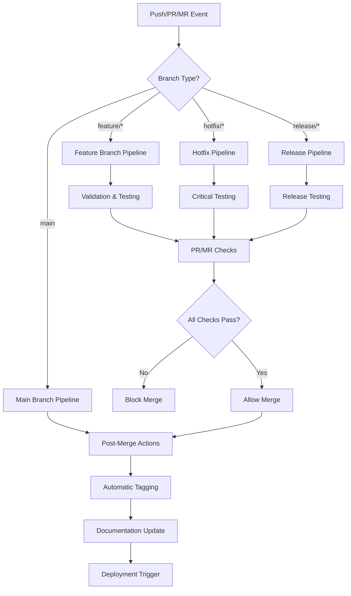

<!-- NAV_START -->
<div align="center">
  <strong>🚀 CI/CD Implementation Guide</strong><br>
  <em>Comprehensive GitHub Actions and GitLab CI/CD implementation for the Prismatic workflow</em><br><br>
  
  <a href="../../README.md">🏠 Home</a> | 
  <a href="../README.md">📖 All Guides</a> | 
  <a href="README.md">⚡ Workflow</a><br>
  
  <strong>Quick Links:</strong>
  <a href="#overview">Overview</a> |
  <a href="#github-actions-implementation">GitHub Actions</a> |
  <a href="#gitlab-ci-implementation">GitLab CI</a> |
  <a href="#platform-comparison">Comparison</a> |
  <a href="#integration-points">Integration</a>
</div>

### Related Documentation
- [Feature Branch Workflow](feature-branch-workflow.md) - Core workflow enforced by CI/CD
- [Git Hooks Complete Guide](git-hooks-complete.md) - Local validation that complements CI/CD
- [Development Standards](../development/coding-standards.md) - Code quality standards enforced
- [Security Guidelines](../security/security-guidelines.md) - Security validation in CI/CD
- [Mix Tasks Implementation](../automation/mix-tasks-implementation.md) - Developer automation tools
<!-- NAV_END -->

# CI/CD Implementation Guide

## Overview

This comprehensive guide provides complete implementations for both GitHub Actions and GitLab CI/CD pipelines that enforce the feature branch workflow, provide automated testing, security scanning, and handle semantic versioning with automatic tagging. Choose the platform that best fits your infrastructure or implement both for maximum flexibility.

### Platform Comparison

| Feature | GitHub Actions | GitLab CI |
|---------|----------------|-----------|
| **Ease of Setup** | ⭐⭐⭐⭐⭐ | ⭐⭐⭐⭐ |
| **Built-in Security** | ⭐⭐⭐⭐ | ⭐⭐⭐⭐⭐ |
| **Parallel Execution** | ⭐⭐⭐⭐ | ⭐⭐⭐⭐⭐ |
| **Caching** | ⭐⭐⭐⭐ | ⭐⭐⭐⭐⭐ |
| **Matrix Builds** | ⭐⭐⭐⭐⭐ | ⭐⭐⭐⭐ |
| **Release Management** | ⭐⭐⭐⭐ | ⭐⭐⭐⭐⭐ |
| **Self-hosted Runners** | ⭐⭐⭐⭐ | ⭐⭐⭐⭐⭐ |

### Architecture Overview

Both implementations follow the same architectural pattern:



## GitHub Actions Implementation

### File Structure

```
.github/
└── workflows/
    ├── branch-protection.yml        # Main branch protection
    ├── release-automation.yml       # Automatic tagging & releases
    ├── documentation-sync.yml       # Doc updates on merge
    └── deployment.yml              # Deployment automation
```

### Core Configuration

#### 1. Branch Protection Workflow

**File**: `.github/workflows/branch-protection.yml`

```yaml
name: Branch Protection & Validation

on:
  push:
    branches: [main]
  pull_request:
    branches: [main]
  workflow_dispatch:

concurrency:
  group: ${{ github.workflow }}-${{ github.ref }}
  cancel-in-progress: true

env:
  MIX_ENV: test
  ELIXIR_VERSION: "1.15.7"
  OTP_VERSION: "26.1.2"

jobs:
  # Prevent direct pushes to main
  prevent-direct-push:
    if: github.event_name == 'push' && github.ref == 'refs/heads/main' && !contains(github.event.head_commit.message, 'Merge pull request')
    runs-on: ubuntu-latest
    steps:
      - name: Block direct push to main
        run: |
          echo "❌ Direct pushes to main branch are not allowed!"
          echo "Use feature branch workflow:"
          echo "1. Create feature branch: git checkout -b feature/description"
          echo "2. Push branch: git push origin feature/description"  
          echo "3. Create pull request"
          echo "4. Merge via GitHub interface"
          exit 1

  # Validate branch naming for PRs
  validate-branch-name:
    if: github.event_name == 'pull_request'
    runs-on: ubuntu-latest
    steps:
      - name: Check branch naming convention
        run: |
          BRANCH_NAME="${{ github.head_ref }}"
          echo "🔍 Validating branch name: $BRANCH_NAME"
          
          # Branch naming pattern
          PATTERN="^(feature|bugfix|hotfix|release|chore|docs)/[a-z0-9-]+$"
          
          if [[ ! $BRANCH_NAME =~ $PATTERN ]]; then
            echo "❌ Invalid branch name: $BRANCH_NAME"
            echo "Must follow pattern: type/description"
            echo "Valid types: feature, bugfix, hotfix, release, chore, docs"
            echo "Example: feature/user-authentication"
            exit 1
          fi
          
          echo "✅ Branch name is valid"

  # Setup and dependency management
  setup:
    runs-on: ubuntu-latest
    outputs:
      cache-key: ${{ steps.cache-deps.outputs.cache-hit }}
    steps:
      - uses: actions/checkout@v4
      
      - name: Setup Elixir
        uses: erlef/setup-beam@v1
        with:
          elixir-version: ${{ env.ELIXIR_VERSION }}
          otp-version: ${{ env.OTP_VERSION }}
          
      - name: Cache dependencies
        id: cache-deps
        uses: actions/cache@v3
        with:
          path: |
            deps
            _build
          key: ${{ runner.os }}-mix-${{ hashFiles('**/mix.lock') }}
          restore-keys: |
            ${{ runner.os }}-mix-
            
      - name: Install dependencies
        if: steps.cache-deps.outputs.cache-hit != 'true'
        run: |
          mix deps.get
          mix deps.compile

  # Code quality checks
  code-quality:
    runs-on: ubuntu-latest
    needs: setup
    steps:
      - uses: actions/checkout@v4
      
      - name: Setup Elixir
        uses: erlef/setup-beam@v1
        with:
          elixir-version: ${{ env.ELIXIR_VERSION }}
          otp-version: ${{ env.OTP_VERSION }}
          
      - name: Restore dependencies
        uses: actions/cache@v3
        with:
          path: |
            deps
            _build
          key: ${{ runner.os }}-mix-${{ hashFiles('**/mix.lock') }}
          
      - name: Check formatting
        run: mix format --check-formatted
        
      - name: Check unused dependencies
        run: mix deps.unlock --check-unused
        
      - name: Compile with warnings as errors
        run: mix compile --warnings-as-errors
        
      - name: Run Credo static analysis
        run: mix credo --strict
        continue-on-error: true

  # Test execution
  test:
    runs-on: ubuntu-latest
    needs: setup
    
    services:
      postgres:
        image: postgres:15
        env:
          POSTGRES_PASSWORD: postgres
          POSTGRES_DB: prismatic_test
        options: >-
          --health-cmd pg_isready
          --health-interval 10s
          --health-timeout 5s
          --health-retries 5
        ports:
          - 5432:5432
          
    steps:
      - uses: actions/checkout@v4
      
      - name: Setup Elixir
        uses: erlef/setup-beam@v1
        with:
          elixir-version: ${{ env.ELIXIR_VERSION }}
          otp-version: ${{ env.OTP_VERSION }}
          
      - name: Restore dependencies
        uses: actions/cache@v3
        with:
          path: |
            deps
            _build
          key: ${{ runner.os }}-mix-${{ hashFiles('**/mix.lock') }}
          
      - name: Setup database
        run: |
          mix ecto.create
          mix ecto.migrate
          
      - name: Run tests
        run: mix test --cover --export-coverage default
        
      - name: Generate coverage report
        run: mix test.coverage
        continue-on-error: true
        
      - name: Upload coverage reports
        uses: codecov/codecov-action@v3
        with:
          file: ./cover/excoveralls.json
        continue-on-error: true

  # Security scanning
  security:
    runs-on: ubuntu-latest
    needs: setup
    steps:
      - uses: actions/checkout@v4
      
      - name: Setup Elixir
        uses: erlef/setup-beam@v1
        with:
          elixir-version: ${{ env.ELIXIR_VERSION }}
          otp-version: ${{ env.OTP_VERSION }}
          
      - name: Restore dependencies
        uses: actions/cache@v3
        with:
          path: |
            deps
            _build
          key: ${{ runner.os }}-mix-${{ hashFiles('**/mix.lock') }}
          
      - name: Check for known security vulnerabilities
        run: mix deps.audit
        continue-on-error: true
        
      - name: Run Sobelow security scan
        run: mix sobelow --config
        continue-on-error: true
```

#### 2. Release Automation Workflow

**File**: `.github/workflows/release-automation.yml`

```yaml
name: Release Automation & Tagging

on:
  push:
    branches: [main]
  workflow_dispatch:
    inputs:
      version_type:
        description: 'Version bump type'
        required: true
        default: 'patch'
        type: choice
        options:
          - patch
          - minor  
          - major

concurrency:
  group: release-${{ github.ref }}
  cancel-in-progress: false

jobs:
  # Only run on actual merges to main
  detect-merge:
    runs-on: ubuntu-latest
    outputs:
      is-merge: ${{ steps.check.outputs.is-merge }}
      branch-type: ${{ steps.check.outputs.branch-type }}
      version-type: ${{ steps.check.outputs.version-type }}
    steps:
      - uses: actions/checkout@v4
        with:
          fetch-depth: 2
          
      - name: Check if this is a merge commit
        id: check
        run: |
          # Check if this is a merge commit
          if git log -1 --pretty=%P | grep -q ' '; then
            echo "is-merge=true" >> $GITHUB_OUTPUT
            
            # Extract branch name from merge commit message
            MERGE_MSG=$(git log -1 --pretty=%B)
            echo "Merge message: $MERGE_MSG"
            
            # Determine branch type and version bump
            if [[ $MERGE_MSG =~ feature/ ]]; then
              echo "branch-type=feature" >> $GITHUB_OUTPUT
              echo "version-type=minor" >> $GITHUB_OUTPUT
            elif [[ $MERGE_MSG =~ hotfix/ ]]; then
              echo "branch-type=hotfix" >> $GITHUB_OUTPUT  
              echo "version-type=patch" >> $GITHUB_OUTPUT
            elif [[ $MERGE_MSG =~ bugfix/ ]]; then
              echo "branch-type=bugfix" >> $GITHUB_OUTPUT
              echo "version-type=patch" >> $GITHUB_OUTPUT
            elif [[ $MERGE_MSG =~ release/ ]]; then
              echo "branch-type=release" >> $GITHUB_OUTPUT
              # Extract version from branch name if possible
              if [[ $MERGE_MSG =~ release/v([0-9]+\.[0-9]+\.[0-9]+) ]]; then
                echo "version-type=specific" >> $GITHUB_OUTPUT
                echo "specific-version=${BASH_REMATCH[1]}" >> $GITHUB_OUTPUT
              else
                echo "version-type=minor" >> $GITHUB_OUTPUT
              fi
            else
              echo "branch-type=other" >> $GITHUB_OUTPUT
              echo "version-type=patch" >> $GITHUB_OUTPUT
            fi
          else
            echo "is-merge=false" >> $GITHUB_OUTPUT
          fi

  # Generate next version
  generate-version:
    needs: detect-merge
    if: needs.detect-merge.outputs.is-merge == 'true' || github.event_name == 'workflow_dispatch'
    runs-on: ubuntu-latest
    outputs:
      current-version: ${{ steps.version.outputs.current }}
      next-version: ${{ steps.version.outputs.next }}
      changelog: ${{ steps.changelog.outputs.changes }}
    steps:
      - uses: actions/checkout@v4
        with:
          fetch-depth: 0
          
      - name: Get current version
        id: version
        run: |
          # Get latest tag
          CURRENT=$(git describe --tags --abbrev=0 2>/dev/null || echo "v0.0.0")
          echo "current=$CURRENT" >> $GITHUB_OUTPUT
          
          # Calculate next version
          VERSION_TYPE="${{ needs.detect-merge.outputs.version-type }}"
          if [ "${{ github.event_name }}" = "workflow_dispatch" ]; then
            VERSION_TYPE="${{ github.event.inputs.version_type }}"
          fi
          
          # Remove 'v' prefix for calculation
          CURRENT_NUM=${CURRENT#v}
          IFS='.' read -ra PARTS <<< "$CURRENT_NUM"
          MAJOR=${PARTS[0]:-0}
          MINOR=${PARTS[1]:-0}
          PATCH=${PARTS[2]:-0}
          
          case $VERSION_TYPE in
            major)
              MAJOR=$((MAJOR + 1))
              MINOR=0
              PATCH=0
              ;;
            minor)
              MINOR=$((MINOR + 1))
              PATCH=0
              ;;
            patch)
              PATCH=$((PATCH + 1))
              ;;
            specific)
              # Use specific version from release branch
              NEXT="v${{ needs.detect-merge.outputs.specific-version }}"
              echo "next=$NEXT" >> $GITHUB_OUTPUT
              exit 0
              ;;
          esac
          
          NEXT="v$MAJOR.$MINOR.$PATCH"
          echo "next=$NEXT" >> $GITHUB_OUTPUT
          
      - name: Generate changelog
        id: changelog
        run: |
          CURRENT="${{ steps.version.outputs.current }}"
          
          # Generate changelog since last tag
          CHANGES=$(git log ${CURRENT}..HEAD --oneline --pretty=format:"- %s" | head -20)
          
          # Handle multiline output for GitHub Actions
          {
            echo 'changes<<EOF'
            echo "$CHANGES"
            echo EOF
          } >> $GITHUB_OUTPUT

  # Create release
  create-release:
    needs: [detect-merge, generate-version]
    runs-on: ubuntu-latest
    outputs:
      tag-created: ${{ steps.tag.outputs.created }}
    steps:
      - uses: actions/checkout@v4
        with:
          token: ${{ secrets.GITHUB_TOKEN }}
          fetch-depth: 0
          
      - name: Create and push tag
        id: tag
        run: |
          VERSION="${{ needs.generate-version.outputs.next-version }}"
          
          # Create annotated tag
          git config user.name "github-actions[bot]"
          git config user.email "github-actions[bot]@users.noreply.github.com"
          
          TAG_MESSAGE="Release $VERSION

Automated release created by GitHub Actions
Commit: ${{ github.sha }}
Date: $(date -u '+%Y-%m-%d %H:%M:%S UTC')
Branch Type: ${{ needs.detect-merge.outputs.branch-type }}

Recent Changes:
${{ needs.generate-version.outputs.changelog }}
"
          
          git tag -a "$VERSION" -m "$TAG_MESSAGE"
          git push origin "$VERSION"
          
          echo "created=true" >> $GITHUB_OUTPUT
          echo "Created and pushed tag: $VERSION"
          
      - name: Update mix.exs version
        run: |
          VERSION="${{ needs.generate-version.outputs.next-version }}"
          VERSION_NUM=${VERSION#v}
          
          # Update version in mix.exs
          sed -i "s/version: \"[^\"]*\"/version: \"$VERSION_NUM\"/" mix.exs
          
          # Commit version update
          git config user.name "github-actions[bot]"  
          git config user.email "github-actions[bot]@users.noreply.github.com"
          
          if git diff --quiet mix.exs; then
            echo "No version update needed"
          else
            git add mix.exs
            git commit -m "chore: bump version to $VERSION_NUM [skip ci]"
            git push origin main
            echo "Version updated in mix.exs"
          fi
          
      - name: Create GitHub Release
        uses: actions/create-release@v1
        env:
          GITHUB_TOKEN: ${{ secrets.GITHUB_TOKEN }}
        with:
          tag_name: ${{ needs.generate-version.outputs.next-version }}
          release_name: Release ${{ needs.generate-version.outputs.next-version }}
          body: |
            ## Changes in this Release
            
            **Version**: ${{ needs.generate-version.outputs.next-version }}
            **Previous Version**: ${{ needs.generate-version.outputs.current-version }}
            **Branch Type**: ${{ needs.detect-merge.outputs.branch-type }}
            
            ### Recent Changes
            ${{ needs.generate-version.outputs.changelog }}
            
            ### Installation
            ```bash
            # Update your dependency in mix.exs
            {:prismatic, "~> ${{ needs.generate-version.outputs.next-version }}"}
            ```
            
            ---
            *This release was automatically generated by GitHub Actions*
          draft: false
          prerelease: false

  # Notify team channels
  notify:
    needs: [create-release, generate-version]
    if: needs.create-release.outputs.tag-created == 'true'
    runs-on: ubuntu-latest
    steps:
      - name: Notify Slack
        if: env.SLACK_WEBHOOK_URL != ''
        env:
          SLACK_WEBHOOK_URL: ${{ secrets.SLACK_WEBHOOK_URL }}
        run: |
          curl -X POST -H 'Content-type: application/json' \
            --data '{"text":"🚀 New release: ${{ needs.generate-version.outputs.next-version }} is now available!\n\nChanges:\n${{ needs.generate-version.outputs.changelog }}"}' \
            $SLACK_WEBHOOK_URL
```

#### 3. Documentation Synchronization

**File**: `.github/workflows/documentation-sync.yml`

```yaml
name: Documentation Synchronization

on:
  push:
    branches: [main]
    paths: ['docs/**', 'lib/**', 'apps/**']
  pull_request:
    branches: [main]
    paths: ['docs/**', 'lib/**', 'apps/**']

jobs:
  validate-docs:
    runs-on: ubuntu-latest
    steps:
      - uses: actions/checkout@v4
      
      - name: Setup Python
        uses: actions/setup-python@v4
        with:
          python-version: '3.x'
          
      - name: Setup Node.js
        uses: actions/setup-node@v3
        with:
          node-version: '18'
          
      - name: Install documentation tools
        run: |
          pip install markdown-link-check
          npm install -g markdown-link-check
          npm install -g markdownlint-cli2
          
      - name: Validate markdown syntax
        run: markdownlint-cli2 "docs/**/*.md"
        continue-on-error: true
        
      - name: Check documentation links
        run: |
          find docs -name "*.md" -exec markdown-link-check {} \;
        continue-on-error: true

  sync-documentation:
    if: github.event_name == 'push' && github.ref == 'refs/heads/main'
    runs-on: ubuntu-latest
    needs: validate-docs
    steps:
      - uses: actions/checkout@v4
        with:
          token: ${{ secrets.GITHUB_TOKEN }}
          
      - name: Setup Elixir for docs generation
        uses: erlef/setup-beam@v1
        with:
          elixir-version: "1.15.7"
          otp-version: "26.1.2"
          
      - name: Install dependencies
        run: |
          mix deps.get
          mix deps.compile
          
      - name: Generate API documentation
        run: |
          mix docs
          echo "📚 API documentation generated"
          
      - name: Commit documentation updates
        run: |
          git config user.name "github-actions[bot]"
          git config user.email "github-actions[bot]@users.noreply.github.com"
          
          if git diff --quiet; then
            echo "No documentation updates needed"
          else
            git add .
            git commit -m "docs: automatic documentation sync [skip ci]"
            git push origin main
            echo "✅ Documentation updates committed"
          fi
```

### GitHub Repository Configuration

#### Branch Protection Rules
Configure in GitHub repository settings:

```json
{
  "branch": "main",
  "protection": {
    "required_status_checks": {
      "strict": true,
      "contexts": [
        "validate-branch-name",
        "code-quality", 
        "test",
        "security"
      ]
    },
    "enforce_admins": true,
    "required_pull_request_reviews": {
      "required_approving_review_count": 1,
      "dismiss_stale_reviews": true,
      "require_code_owner_reviews": true
    },
    "restrictions": null,
    "allow_force_pushes": false,
    "allow_deletions": false
  }
}
```

#### Required Secrets

| Secret Name | Description | Required |
|-------------|-------------|----------|
| `GITHUB_TOKEN` | Auto-provided by GitHub | ✅ |
| `SLACK_WEBHOOK_URL` | Slack notifications (optional) | ⚪ |
| `TEAMS_WEBHOOK_URL` | Microsoft Teams notifications (optional) | ⚪ |
| `CODECOV_TOKEN` | Code coverage reporting (optional) | ⚪ |

## GitLab CI Implementation

### File Structure

```
.gitlab-ci.yml                  # Main pipeline configuration
.gitlab/
├── ci/
│   ├── branch-protection.yml   # Branch validation jobs
│   ├── testing.yml            # Test execution jobs
│   ├── security.yml           # Security scanning jobs
│   ├── release.yml            # Release and tagging jobs
│   └── deployment.yml         # Deployment automation
└── merge_request_templates/
    └── default.md             # MR template with checklist
```

### Core Configuration

#### Main Pipeline Configuration

**File**: `.gitlab-ci.yml`

```yaml
# GitLab CI Configuration for Prismatic Feature Branch Workflow

# Global settings
default:
  image: elixir:1.15.7
  
variables:
  MIX_ENV: "test"
  POSTGRES_DB: "prismatic_test"
  POSTGRES_USER: "postgres"
  POSTGRES_PASSWORD: "postgres"
  POSTGRES_HOST: "postgres"
  DATABASE_URL: "postgresql://$POSTGRES_USER:$POSTGRES_PASSWORD@$POSTGRES_HOST/$POSTGRES_DB"

# Pipeline stages
stages:
  - validate
  - test
  - security
  - build
  - release
  - deploy

# Include additional pipeline configurations
include:
  - local: '.gitlab/ci/branch-protection.yml'
  - local: '.gitlab/ci/testing.yml'
  - local: '.gitlab/ci/security.yml'
  - local: '.gitlab/ci/release.yml'
  - local: '.gitlab/ci/deployment.yml'

# Cache configuration for dependencies
.cache_template: &cache_definition
  cache:
    key: "$CI_COMMIT_REF_SLUG-$MIX_ENV"
    paths:
      - deps/
      - _build/
    policy: pull-push

# Before script template
.before_script_template: &before_script_definition
  before_script:
    - apt-get update -qq && apt-get install -y -qq git nodejs npm
    - mix local.hex --force
    - mix local.rebar --force
    - mix deps.get --only $MIX_ENV
    - mix deps.compile

# Basic job template
.basic_job:
  <<: *cache_definition
  <<: *before_script_definition
  
# Test services
services:
  - name: postgres:15
    alias: postgres
    variables:
      POSTGRES_DB: $POSTGRES_DB
      POSTGRES_USER: $POSTGRES_USER
      POSTGRES_PASSWORD: $POSTGRES_PASSWORD
```

#### Branch Protection Configuration

**File**: `.gitlab/ci/branch-protection.yml`

```yaml
# Branch protection and validation jobs

# Prevent direct pushes to main branch
validate:direct-push-protection:
  stage: validate
  script:
    - |
      if [ "$CI_COMMIT_BRANCH" = "main" ] && [ "$CI_PIPELINE_SOURCE" = "push" ]; then
        echo "❌ Direct pushes to main branch are not allowed!"
        echo "Use feature branch workflow:"
        echo "1. Create feature branch: git checkout -b feature/description"
        echo "2. Push branch: git push origin feature/description"
        echo "3. Create merge request"
        echo "4. Merge via GitLab interface"
        exit 1
      fi
  rules:
    - if: '$CI_COMMIT_BRANCH == "main" && $CI_PIPELINE_SOURCE == "push"'
      when: always
  allow_failure: false

# Validate branch naming for merge requests
validate:branch-naming:
  stage: validate
  script:
    - |
      if [ -n "$CI_MERGE_REQUEST_SOURCE_BRANCH_NAME" ]; then
        BRANCH_NAME="$CI_MERGE_REQUEST_SOURCE_BRANCH_NAME"
        echo "🔍 Validating branch name: $BRANCH_NAME"
        
        # Branch naming pattern
        PATTERN="^(feature|bugfix|hotfix|release|chore|docs)/[a-z0-9-]+$"
        
        if [[ ! $BRANCH_NAME =~ $PATTERN ]]; then
          echo "❌ Invalid branch name: $BRANCH_NAME"
          echo "Must follow pattern: type/description"
          echo "Valid types: feature, bugfix, hotfix, release, chore, docs"
          echo "Example: feature/user-authentication"
          exit 1
        fi
        
        echo "✅ Branch name is valid"
      fi
  rules:
    - if: '$CI_PIPELINE_SOURCE == "merge_request_event"'
      when: always

# Validate commit message format
validate:commit-message:
  stage: validate
  script:
    - |
      echo "📝 Validating commit message format..."
      COMMIT_MSG=$(git log -1 --pretty=%B)
      echo "Commit message: $COMMIT_MSG"
      
      # Skip validation for merge commits
      if [[ $COMMIT_MSG =~ ^Merge ]]; then
        echo "✅ Merge commit - skipping validation"
        exit 0
      fi
      
      # Conventional commit pattern
      PATTERN="^(feat|fix|docs|style|refactor|test|chore|perf|ci|build|revert)(\(.+\))?: .{1,72}"
      
      if [[ ! $COMMIT_MSG =~ $PATTERN ]]; then
        echo "❌ Invalid commit message format"
        echo "Valid format: type(scope): description"
        echo "Types: feat, fix, docs, style, refactor, test, chore, perf, ci, build, revert"
        echo "Examples:"
        echo "- feat(auth): add user login functionality"
        echo "- fix(api): resolve memory leak in user service"
        echo "- docs: update installation instructions"
        exit 1
      fi
      
      echo "✅ Commit message format is valid"
  rules:
    - if: '$CI_PIPELINE_SOURCE == "push" || $CI_PIPELINE_SOURCE == "merge_request_event"'
      when: always
```

#### Testing Configuration

**File**: `.gitlab/ci/testing.yml`

```yaml
# Testing and code quality jobs

# Code quality checks
test:formatting:
  extends: .basic_job
  stage: test
  script:
    - echo "📝 Checking code formatting..."
    - mix format --check-formatted
  rules:
    - if: '$CI_PIPELINE_SOURCE == "push" || $CI_PIPELINE_SOURCE == "merge_request_event"'
      when: always

test:unused-deps:
  extends: .basic_job
  stage: test
  script:
    - echo "🔍 Checking for unused dependencies..."
    - mix deps.unlock --check-unused
  rules:
    - if: '$CI_PIPELINE_SOURCE == "push" || $CI_PIPELINE_SOURCE == "merge_request_event"'
      when: always

test:compile-warnings:
  extends: .basic_job
  stage: test
  script:
    - echo "🔨 Compiling with warnings as errors..."
    - mix compile --warnings-as-errors
  rules:
    - if: '$CI_PIPELINE_SOURCE == "push" || $CI_PIPELINE_SOURCE == "merge_request_event"'
      when: always

test:credo:
  extends: .basic_job
  stage: test
  script:
    - echo "🔍 Running Credo static analysis..."
    - mix credo --strict
  rules:
    - if: '$CI_PIPELINE_SOURCE == "push" || $CI_PIPELINE_SOURCE == "merge_request_event"'
      when: always
  allow_failure: true

# Unit tests
test:unit:
  extends: .basic_job
  stage: test
  services:
    - name: postgres:15
      alias: postgres
  script:
    - echo "🧪 Setting up test database..."
    - mix ecto.create
    - mix ecto.migrate
    - echo "🧪 Running unit tests..."
    - mix test --cover --export-coverage default
    - echo "📊 Generating coverage report..."
    - mix test.coverage
  coverage: '/\[TOTAL\]\s+(\d+\.\d+)%/'
  artifacts:
    reports:
      coverage_report:
        coverage_format: cobertura
        path: cover/cobertura.xml
    paths:
      - cover/
    expire_in: 1 week
  rules:
    - if: '$CI_PIPELINE_SOURCE == "push" || $CI_PIPELINE_SOURCE == "merge_request_event"'
      when: always
```

#### Security Configuration

**File**: `.gitlab/ci/security.yml`

```yaml
# Security scanning and vulnerability assessment

# Dependency vulnerability scanning
security:deps-audit:
  extends: .basic_job
  stage: security
  script:
    - echo "🔒 Checking for known security vulnerabilities..."
    - mix deps.audit
  rules:
    - if: '$CI_PIPELINE_SOURCE == "push" || $CI_PIPELINE_SOURCE == "merge_request_event"'
      when: always
  allow_failure: true

# Sobelow security scan
security:sobelow:
  extends: .basic_job
  stage: security
  script:
    - echo "🔒 Running Sobelow security scan..."
    - mix sobelow --config --exit-on-fail
  rules:
    - if: '$CI_PIPELINE_SOURCE == "push" || $CI_PIPELINE_SOURCE == "merge_request_event"'
      when: always
  allow_failure: true

# Secret detection
security:secret-scan:
  stage: security
  image: registry.gitlab.com/gitlab-org/security-products/analyzers/secrets:latest
  script:
    - echo "🔒 Scanning for secrets and sensitive data..."
    - /analyzer run
  artifacts:
    reports:
      secret_detection: gl-secret-detection-report.json
    expire_in: 1 week
  rules:
    - if: '$CI_PIPELINE_SOURCE == "push" || $CI_PIPELINE_SOURCE == "merge_request_event"'
      when: always
  allow_failure: true
```

#### Release Configuration

**File**: `.gitlab/ci/release.yml`

```yaml
# Release automation and tagging

# Detect merge to main and determine version bump
release:detect-merge:
  stage: release
  script:
    - |
      echo "🔍 Detecting merge type and version bump..."
      
      # Check if this is a merge commit
      if git log -1 --pretty=%P | grep -q ' '; then
        echo "IS_MERGE=true" >> release.env
        
        # Extract branch name from merge commit message
        MERGE_MSG=$(git log -1 --pretty=%B)
        echo "Merge message: $MERGE_MSG"
        
        # Determine branch type and version bump
        if [[ $MERGE_MSG =~ feature/ ]]; then
          echo "BRANCH_TYPE=feature" >> release.env
          echo "VERSION_TYPE=minor" >> release.env
        elif [[ $MERGE_MSG =~ hotfix/ ]]; then
          echo "BRANCH_TYPE=hotfix" >> release.env
          echo "VERSION_TYPE=patch" >> release.env
        elif [[ $MERGE_MSG =~ bugfix/ ]]; then
          echo "BRANCH_TYPE=bugfix" >> release.env
          echo "VERSION_TYPE=patch" >> release.env
        elif [[ $MERGE_MSG =~ release/ ]]; then
          echo "BRANCH_TYPE=release" >> release.env
          # Extract version from branch name if possible
          if [[ $MERGE_MSG =~ release/v([0-9]+\.[0-9]+\.[0-9]+) ]]; then
            echo "VERSION_TYPE=specific" >> release.env
            echo "SPECIFIC_VERSION=${BASH_REMATCH[1]}" >> release.env
          else
            echo "VERSION_TYPE=minor" >> release.env
          fi
        else
          echo "BRANCH_TYPE=other" >> release.env
          echo "VERSION_TYPE=patch" >> release.env
        fi
      else
        echo "IS_MERGE=false" >> release.env
      fi
      
      cat release.env
  artifacts:
    reports:
      dotenv: release.env
    expire_in: 1 hour
  rules:
    - if: '$CI_COMMIT_BRANCH == "main" && $CI_PIPELINE_SOURCE == "push"'
      when: always

# Generate next version
release:generate-version:
  stage: release
  needs: ["release:detect-merge"]
  script:
    - |
      if [ "$IS_MERGE" = "true" ]; then
        echo "📝 Generating next version..."
        
        # Get latest tag
        CURRENT=$(git describe --tags --abbrev=0 2>/dev/null || echo "v0.0.0")
        echo "Current version: $CURRENT"
        
        # Calculate next version
        CURRENT_NUM=${CURRENT#v}
        IFS='.' read -ra PARTS <<< "$CURRENT_NUM"
        MAJOR=${PARTS[0]:-0}
        MINOR=${PARTS[1]:-0}  
        PATCH=${PARTS[2]:-0}
        
        case $VERSION_TYPE in
          major)
            MAJOR=$((MAJOR + 1))
            MINOR=0
            PATCH=0
            ;;
          minor)
            MINOR=$((MINOR + 1))
            PATCH=0
            ;;
          patch)
            PATCH=$((PATCH + 1))
            ;;
          specific)
            NEXT="v$SPECIFIC_VERSION"
            echo "NEXT_VERSION=$NEXT" >> version.env
            echo "Generated specific version: $NEXT"
            exit 0
            ;;
        esac
        
        NEXT="v$MAJOR.$MINOR.$PATCH"
        echo "NEXT_VERSION=$NEXT" >> version.env
        echo "Generated version: $NEXT"
        
        # Generate changelog
        CHANGES=$(git log ${CURRENT}..HEAD --oneline --pretty=format:"- %s" | head -20)
        echo "CHANGELOG<<EOF" >> version.env
        echo "$CHANGES" >> version.env
        echo "EOF" >> version.env
      else
        echo "Not a merge commit, skipping version generation"
      fi
  artifacts:
    reports:
      dotenv: version.env
    expire_in: 1 hour
  rules:
    - if: '$CI_COMMIT_BRANCH == "main" && $CI_PIPELINE_SOURCE == "push"'
      when: always

# Create release tag
release:create-tag:
  stage: release
  needs: ["release:detect-merge", "release:generate-version"]
  before_script:
    - apt-get update -qq && apt-get install -y -qq git
    - git config user.name "GitLab CI"
    - git config user.email "gitlab-ci@prismatic.com"
  script:
    - |
      if [ "$IS_MERGE" = "true" ] && [ -n "$NEXT_VERSION" ]; then
        echo "🏷️ Creating release tag: $NEXT_VERSION"
        
        # Create annotated tag
        TAG_MESSAGE="Release $NEXT_VERSION

Automated release created by GitLab CI
Commit: $CI_COMMIT_SHA
Date: $(date -u '+%Y-%m-%d %H:%M:%S UTC')
Branch Type: $BRANCH_TYPE
Pipeline: $CI_PIPELINE_URL

Recent Changes:
$CHANGELOG
"
        
        git tag -a "$NEXT_VERSION" -m "$TAG_MESSAGE"
        
        # Push tag using CI token
        git remote set-url origin https://gitlab-ci-token:${CI_JOB_TOKEN}@${CI_SERVER_HOST}/${CI_PROJECT_PATH}.git
        git push origin "$NEXT_VERSION"
        
        echo "✅ Created and pushed tag: $NEXT_VERSION"
        echo "TAG_CREATED=true" >> tag.env
      else
        echo "Skipping tag creation"
        echo "TAG_CREATED=false" >> tag.env
      fi
  artifacts:
    reports:
      dotenv: tag.env
    expire_in: 1 hour
  rules:
    - if: '$CI_COMMIT_BRANCH == "main" && $CI_PIPELINE_SOURCE == "push"'
      when: always
```

### GitLab Repository Configuration

#### Push Rules
Configure in GitLab project settings:
- ✅ Deny deleting a tag
- ✅ Restrict commits by author (email)
- ✅ GitLab will reject unsigned commits
- ✅ Require expression in commit messages: `^(feat|fix|docs|style|refactor|test|chore|perf|ci|build|revert)(\(.+\))?: .+`

#### Protected Branches
Configure `main` branch with:
- ✅ Push access: No one
- ✅ Merge access: Maintainers
- ✅ Unprotect access: Maintainers
- ✅ Code owner approval required

#### CI/CD Variables

| Variable Name | Description | Type | Required |
|---------------|-------------|------|----------|
| `DATABASE_URL` | Test database connection string | Variable | ✅ |
| `SLACK_WEBHOOK_URL` | Slack notifications webhook | Variable | ⚪ |
| `TEAMS_WEBHOOK_URL` | Microsoft Teams webhook | Variable | ⚪ |
| `MIX_ENV` | Mix environment (default: test) | Variable | ✅ |
| `CI_JOB_TOKEN` | Auto-provided by GitLab | Protected | ✅ |

## Platform Comparison

### When to Choose GitHub Actions

**Best for:**
- Projects already hosted on GitHub
- Teams familiar with GitHub ecosystem
- Simpler setup and configuration
- Matrix builds and parallel execution
- Rich marketplace of pre-built actions

**Considerations:**
- Limited to GitHub-hosted repositories
- Requires GitHub-specific knowledge
- Less flexible caching options

### When to Choose GitLab CI

**Best for:**
- Self-hosted GitLab instances
- Teams requiring advanced CI/CD features
- Projects needing sophisticated caching
- Organizations with strict security requirements
- Complex deployment scenarios

**Considerations:**
- Steeper learning curve
- More configuration required
- Better suited for larger teams

### Hybrid Approach

You can implement both platforms simultaneously:

1. **Primary Platform**: Choose based on your hosting
2. **Secondary Platform**: Use for cross-validation
3. **Mirroring**: Sync repositories between platforms
4. **Specialized Workflows**: Use each platform's strengths

## Integration Points

### Phoenix Umbrella Structure

Both implementations work with umbrella projects:

```yaml
# GitHub Actions
- name: Test all applications
  run: |
    cd apps/prismatic && mix test
    cd apps/prismatic_web && mix test

# GitLab CI
test:apps:
  extends: .basic_job
  stage: test
  parallel:
    matrix:
      - APP: [prismatic, prismatic_web]
  script:
    - cd apps/$APP && mix test
```

### Mix Tasks Integration

Both platforms can utilize custom Mix tasks:

```yaml
# GitHub Actions
- name: Run custom branch validation
  run: mix branch.validate

# GitLab CI
custom:branch-validate:
  extends: .basic_job
  script:
    - mix branch.validate
```

### Git Hooks Compatibility

CI/CD pipelines complement local git hooks:
- **Local hooks**: Immediate feedback during development
- **CI/CD**: Comprehensive validation and deployment
- **Consistency**: Both use same validation rules

### Documentation Integration

Both platforms integrate with documentation systems:
- Auto-generate API documentation
- Validate cross-references
- Sync documentation updates
- Maintain glossary standards

## Monitoring and Maintenance

### Performance Monitoring

**GitHub Actions:**
- Monitor workflow success rates in Actions tab
- Use workflow run analytics
- Set up status badges for repositories

**GitLab CI:**
- Use CI/CD analytics dashboard
- Monitor pipeline success rates
- Set up pipeline failure notifications

### Regular Updates

**Both Platforms:**
- Update runner images quarterly
- Review and update dependency versions
- Monitor for security vulnerabilities
- Optimize caching strategies

### Team Training

**GitHub Actions:**
- GitHub Actions documentation
- Workflow troubleshooting guides
- Best practices workshops

**GitLab CI:**
- GitLab CI/CD certification
- Pipeline optimization training
- Security scanning workshops

## Troubleshooting

### Common Issues

#### Pipeline/Workflow Not Triggering
```yaml
# Debug pipeline triggers
debug:triggers:
  script:
    - echo "Event: $GITHUB_EVENT_NAME" # GitHub
    - echo "Source: $CI_PIPELINE_SOURCE" # GitLab
    - echo "Branch: $GITHUB_HEAD_REF" # GitHub
    - echo "Branch: $CI_MERGE_REQUEST_SOURCE_BRANCH_NAME" # GitLab
```

#### Tests Failing in CI
- Verify environment variables
- Check service dependencies
- Review caching configurations
- Compare local vs CI environments

#### Version Tagging Issues
- Check merge commit detection
- Verify repository permissions
- Review tag creation process
- Validate version calculation logic

### Debug Commands

**GitHub Actions:**
```yaml
- name: Debug workflow
  run: |
    echo "Event: ${{ github.event_name }}"
    echo "Ref: ${{ github.ref }}"
    echo "Branch: ${{ github.head_ref }}"
    echo "Commit: ${{ github.sha }}"
    git log -1 --pretty=format:"%H %s"
```

**GitLab CI:**
```yaml
debug:pipeline:
  stage: validate
  script:
    - echo "CI_COMMIT_BRANCH: $CI_COMMIT_BRANCH"
    - echo "CI_MERGE_REQUEST_SOURCE_BRANCH_NAME: $CI_MERGE_REQUEST_SOURCE_BRANCH_NAME"
    - echo "CI_PIPELINE_SOURCE: $CI_PIPELINE_SOURCE"
    - git log -1 --pretty=format:"%H %s"
  when: manual
```

## Best Practices

### Security
- Use secrets for sensitive data
- Limit workflow permissions
- Regular security audits
- Sign commits and tags

### Performance
- Optimize caching strategies
- Use parallel execution
- Minimize workflow complexity
- Monitor execution times

### Maintainability
- Document workflow decisions
- Use consistent naming conventions
- Regular workflow reviews
- Version control workflow files

---

**This comprehensive CI/CD implementation ensures consistent code quality, automated testing, semantic versioning, and seamless integration with both GitHub Actions and GitLab CI platforms while supporting the feature branch workflow.**