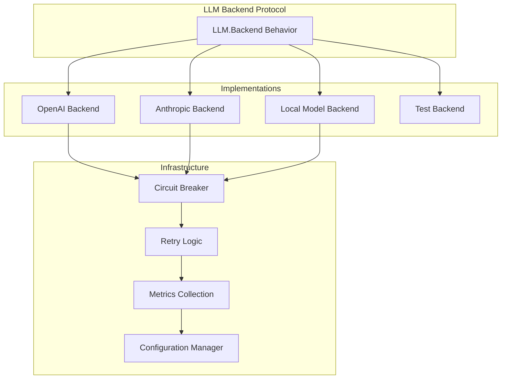

+++
title = "LLM Backend System"
description = "Large Language Model backend abstraction layer for the Prismatic AI Agent Framework"
date = 2025-01-27
weight = 30

[taxonomies]
tags = ["llm", "backend", "ai", "protocols", "implementation"]
categories = ["core", "protocols"]
audience = ["developers", "architects"]
difficulty = ["intermediate", "advanced"]
content_type = ["documentation", "reference"]
language = ["english"]
status = ["in-development"]

[extra]
toc = true
github_edit = true
living_document = true
update_frequency = "weekly"
+++

# LLM Backend System

The LLM Backend System provides a unified abstraction layer for integrating multiple Large Language Model providers into the Prismatic AI Agent Framework. This system enables seamless switching between different LLM providers while maintaining consistent interfaces and robust error handling.

## 🎯 Overview

The LLM Backend System is built on a protocol-driven architecture that supports:

- **Multiple Providers**: OpenAI, Anthropic, local models, and custom implementations
- **Unified Interface**: Consistent API across all backend implementations
- **Fault Tolerance**: Circuit breakers, retries, and graceful degradation
- **Performance Monitoring**: Comprehensive metrics and benchmarking
- **Configuration Management**: Dynamic configuration and validation

## 📊 Implementation Status

| Component | Status | Coverage | Documentation |
|-----------|--------|----------|---------------|
| Core Protocol | 🚧 In Progress | 0% | 📝 This Document |
| OpenAI Backend | 📋 Planned | 0% | 📋 Planned |
| Anthropic Backend | 📋 Planned | 0% | 📋 Planned |
| Local Model Backend | 📋 Planned | 0% | 📋 Planned |
| Test Implementation | 📋 Planned | 0% | 📋 Planned |
| Circuit Breaker | 📋 Planned | 0% | 📋 Planned |
| Retry Logic | 📋 Planned | 0% | 📋 Planned |
| Configuration Validation | 📋 Planned | 0% | 📋 Planned |

**Legend**: ✅ Complete | 🚧 In Progress | 📋 Planned | ❌ Blocked

## 🏗️ Architecture

### Protocol Definition

The [`Prismatic.LLM.Backend`](../../lib/prismatic/llm/backend.ex) behavior defines the contract that all LLM backend implementations must follow:

```elixir
@callback generate_response(config(), prompt(), context()) ::
  {:ok, response()} | {:error, term()}

@callback validate_config(config()) :: :ok | {:error, term()}

@callback health_check(config()) :: :ok | {:error, term()}

@callback get_model_info(config()) :: {:ok, model_info()} | {:error, term()}
```

### Backend Implementations



## 🔧 Configuration

### Backend Configuration Structure

```elixir
%{
  backend_type: :openai | :anthropic | :local | :test,
  api_key: String.t(),
  model: String.t(),
  timeout: integer(),
  max_retries: integer(),
  circuit_breaker: %{
    failure_threshold: integer(),
    recovery_timeout: integer(),
    success_threshold: integer()
  }
}
```

### Environment Configuration

```elixir
# config/config.exs
config :prismatic, :llm_backends,
  openai: %{
    api_key: {:system, "OPENAI_API_KEY"},
    default_model: "gpt-4",
    timeout: 30_000,
    max_retries: 3
  },
  anthropic: %{
    api_key: {:system, "ANTHROPIC_API_KEY"},
    default_model: "claude-3-sonnet-20240229",
    timeout: 30_000,
    max_retries: 3
  }
```

## 🚀 Usage Examples

### Basic Usage

```elixir
# Create backend configuration
{:ok, config} = Prismatic.LLM.Backend.create_config(:openai, %{
  api_key: "your-api-key",
  model: "gpt-4"
})

# Generate response
{:ok, response} = Prismatic.LLM.Backend.generate_response(
  config,
  "What is the meaning of life?",
  %{temperature: 0.7, max_tokens: 1000}
)
```

### With Circuit Breaker

```elixir
# The circuit breaker is automatically integrated
{:ok, config} = Prismatic.LLM.Backend.create_config(:openai, %{
  api_key: "your-api-key",
  model: "gpt-4",
  circuit_breaker: %{
    failure_threshold: 5,
    recovery_timeout: 60_000,
    success_threshold: 3
  }
})

# Calls are automatically protected by circuit breaker
case Prismatic.LLM.Backend.generate_response(config, prompt, context) do
  {:ok, response} -> handle_success(response)
  {:error, :circuit_breaker_open} -> handle_circuit_breaker_open()
  {:error, reason} -> handle_other_error(reason)
end
```

## 🧪 Testing

### Unit Tests

```elixir
# test/prismatic/llm/backend_test.exs
defmodule Prismatic.LLM.BackendTest do
  use ExUnit.Case
  
  describe "create_config/2" do
    test "creates valid configuration for supported backends" do
      {:ok, config} = Prismatic.LLM.Backend.create_config(:test, %{})
      assert config.backend_type == :test
    end
  end
end
```

### Property-Based Tests

```elixir
# Using StreamData for property-based testing
property "all backend configurations are validated correctly" do
  check all backend_type <- member_of([:openai, :anthropic, :test]),
            config_opts <- llm_config_generator() do
    
    case Prismatic.LLM.Backend.create_config(backend_type, config_opts) do
      {:ok, config} ->
        assert Prismatic.LLM.Backend.validate_config(config) == :ok
      {:error, _reason} ->
        # Invalid configurations should be rejected
        :ok
    end
  end
end
```

## 📈 Performance Considerations

### Benchmarking

The LLM Backend System includes comprehensive benchmarking:

```bash
# Run LLM backend benchmarks
mix bench

# Run memory usage analysis
mix bench.memory
```

### Optimization Strategies

1. **Response Caching**: Cache responses for identical prompts
2. **Request Batching**: Batch multiple requests when supported
3. **Connection Pooling**: Reuse HTTP connections
4. **Streaming**: Support streaming responses for real-time applications

## 🔍 Monitoring and Observability

### Metrics Collection

The system collects comprehensive metrics:

- Response times and latencies
- Success/failure rates
- Circuit breaker state changes
- Token usage and costs
- Model performance comparisons

### Health Checks

```elixir
# Check backend health
case Prismatic.LLM.Backend.health_check(config) do
  :ok -> IO.puts("Backend is healthy")
  {:error, reason} -> IO.puts("Backend health check failed: #{reason}")
end
```

## 🛠️ Development

### Adding New Backends

To add a new LLM backend:

1. Implement the `Prismatic.LLM.Backend` behavior
2. Add configuration validation
3. Implement health checks
4. Add comprehensive tests
5. Update documentation

### Example Implementation

```elixir
defmodule Prismatic.LLM.CustomBackend do
  @behaviour Prismatic.LLM.Backend
  
  @impl true
  def generate_response(config, prompt, context) do
    # Implementation here
  end
  
  @impl true
  def validate_config(config) do
    # Validation logic here
  end
  
  # ... other callbacks
end
```

## 📚 Related Documentation

- [Agent Protocol](../agents/README.md) - How agents use LLM backends
- [Memory System](../memory/README.md) - Memory integration with LLM responses
- [Architecture Overview](../architecture/README.md) - System architecture
- [Testing Guide](../testing/README.md) - Testing strategies and examples

## 🔗 External Resources

- [OpenAI API Documentation](https://platform.openai.com/docs)
- [Anthropic API Documentation](https://docs.anthropic.com)
- [Elixir Behaviours Guide](https://elixir-lang.org/getting-started/typespecs-and-behaviours.html)

---

*This documentation is automatically updated as the implementation progresses. Last updated: 2025-01-27*