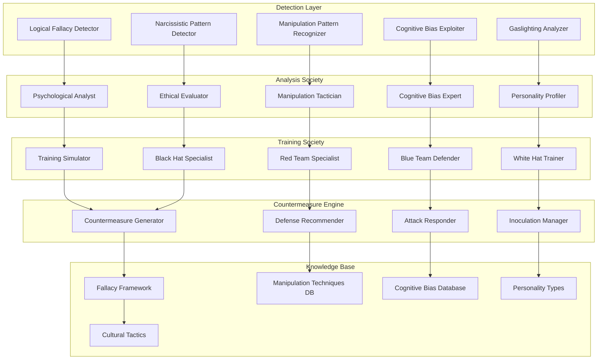

# Psychological Warfare & Manipulation Detection System

## 📋 Executive Summary

The Prismatic Psychological Warfare System provides comprehensive detection, analysis, and countermeasures for logical fallacies, manipulation techniques, dark persuasion patterns, and psychological annihilation tactics. This system operates across white-hat (defensive), grey-hat (analytical), and black-hat (offensive) domains, enabling both protection against psychological attacks and training in advanced persuasion techniques.

### Core Capabilities
- **Logical Fallacy Detection**: Identify and classify 200+ logical fallacies in real-time
- **Manipulation Pattern Recognition**: Detect dark persuasion and psychological manipulation
- **Cognitive Bias Exploitation**: Analyze and counter cognitive bias-based attacks
- **Psychological Profiling**: Deep personality analysis for targeted defense/offense
- **Training Simulations**: Safe environments for learning psychological warfare techniques
- **Countermeasure Generation**: Automated responses to psychological attacks

## 🎯 Problem Statement

### Psychological Warfare Challenges
- **Sophisticated Attacks**: Advanced psychological manipulation in digital communications
- **Scale**: Millions of interactions requiring real-time analysis
- **Subtlety**: Detecting subtle manipulation techniques and gaslighting
- **Context Sensitivity**: Understanding cultural and personal psychological vulnerabilities
- **Ethical Boundaries**: Balancing defensive capabilities with ethical considerations

### Current Limitations
- **Human Detection**: Limited ability to detect sophisticated psychological manipulation
- **Speed Requirements**: Real-time analysis needed for effective countermeasures
- **Training Gaps**: Insufficient training in recognizing and countering manipulation
- **Systematic Approach**: Lack of comprehensive frameworks for psychological defense
- **Offensive Capabilities**: Limited understanding of advanced persuasion techniques

## 🏗️ System Architecture

### Prismatic Components Integration



## 🧠 Core Detection Systems

### Logical Fallacy Detection Engine

```elixir
defmodule Prismatic.PsychWarfare.LogicalFallacies do
  @moduledoc """
  Comprehensive logical fallacy detection system covering 200+ fallacy types
  with real-time analysis and contextual understanding.
  """
  
  @fallacy_categories [
    :formal_fallacies,
    :informal_fallacies,
    :statistical_fallacies,
    :causal_fallacies,
    :relevance_fallacies,
    :presumption_fallacies,
    :ambiguity_fallacies,
    :emotional_manipulation,
    :authority_fallacies,
    :ad_hominem_variants
  ]
  
  def detect_fallacies(text, context \\ %{}) do
    # Parallel analysis across all fallacy categories
    detection_tasks = Enum.map(@fallacy_categories, fn category ->
      Task.async(fn -> detect_category_fallacies(text, category, context) end)
    end)
    
    # Collect results with timeout
    results = Task.await_many(detection_tasks, :timer.seconds(5))
    
    # Synthesize and rank fallacies by confidence and impact
    synthesize_fallacy_analysis(results, text, context)
  end
  
  defp detect_category_fallacies(text, :ad_hominem_variants, context) do
    patterns = [
      %{
        type: :ad_hominem_abusive,
        pattern: ~r/you're (stupid|idiot|moron|dumb)/i,
        severity: :high,
        description: "Direct personal attack to discredit argument"
      },
      %{
        type: :ad_hominem_circumstantial,
        pattern: ~r/of course you'd say that, you're a/i,
        severity: :medium,
        description: "Attacking person's circumstances rather than argument"
      },
      %{
        type: :tu_quoque,
        pattern: ~r/you do it too|what about when you/i,
        severity: :medium,
        description: "Deflecting criticism by pointing to opponent's hypocrisy"
      },
      %{
        type: :poisoning_the_well,
        pattern: ~r/before.*tells you|don't listen to.*because/i,
        severity: :high,
        description: "Preemptively discrediting opponent before they speak"
      }
    ]
    
    detected_fallacies = Enum.filter(patterns, fn pattern ->
      Regex.match?(pattern.pattern, text)
    end)
    
    %{
      category: :ad_hominem_variants,
      detected: detected_fallacies,
      confidence: calculate_detection_confidence(detected_fallacies, text),
      context_factors: analyze_context_factors(context, :ad_hominem_variants)
    }
  end
  
  defp detect_category_fallacies(text, :emotional_manipulation, context) do
    emotional_patterns = [
      %{
        type: :appeal_to_fear,
        indicators: ["terrible things will happen", "you'll regret", "dangerous"],
        severity: :high,
        description: "Using fear to manipulate decision-making"
      },
      %{
        type: :appeal_to_pity,
        indicators: ["feel sorry", "poor me", "suffered so much"],
        severity: :medium,
        description: "Manipulating through sympathy and pity"
      },
      %{
        type: :bandwagon_fallacy,
        indicators: ["everyone else", "all the cool kids", "majority believes"],
        severity: :medium,
        description: "Pressure to conform to popular opinion"
      },
      %{
        type: :appeal_to_flattery,
        indicators: ["you're so smart", "someone like you", "special person"],
        severity: :medium,
        description: "Using flattery to lower critical thinking defenses"
      }
    ]
    
    detected_patterns = analyze_emotional_manipulation(text, emotional_patterns)
    
    %{
      category: :emotional_manipulation,
      detected: detected_patterns,
      emotional_intensity: measure_emotional_intensity(text),
      manipulation_sophistication: assess_manipulation_sophistication(detected_patterns)
    }
  end
end
```

### Dark Persuasion Pattern Recognition

```elixir
defmodule Prismatic.PsychWarfare.DarkPersuasion do
  @moduledoc """
  Advanced detection of dark persuasion techniques including gaslighting,
  love bombing, triangulation, and other psychological manipulation tactics.
  """
  
  @dark_patterns [
    :gaslighting,
    :love_bombing,
    :triangulation,
    :hoovering,
    :future_faking,
    :breadcrumbing,
    :stonewalling,
    :projection,
    :scapegoating,
    :isolation_tactics,
    :financial_abuse_patterns,
    :emotional_blackmail,
    :silent_treatment,
    :word_salad,
    :circular_conversations
  ]
  
  def analyze_dark_persuasion(conversation_history, participant_profiles) do
    # Analyze conversation patterns over time
    temporal_analysis = analyze_temporal_patterns(conversation_history)
    
    # Detect manipulation techniques
    manipulation_analysis = detect_manipulation_techniques(conversation_history)
    
    # Assess psychological impact
    impact_analysis = assess_psychological_impact(conversation_history, participant_profiles)
    
    # Generate comprehensive report
    %{
      detected_patterns: manipulation_analysis.patterns,
      severity_assessment: calculate_manipulation_severity(manipulation_analysis),
      victim_impact: impact_analysis.psychological_damage,
      perpetrator_profile: analyze_perpetrator_patterns(manipulation_analysis),
      countermeasures: generate_countermeasures(manipulation_analysis),
      escalation_risk: assess_escalation_risk(temporal_analysis)
    }
  end
  
  defp detect_manipulation_techniques(conversation_history) do
    techniques = Enum.map(@dark_patterns, fn pattern ->
      case pattern do
        :gaslighting ->
          detect_gaslighting_patterns(conversation_history)
        :love_bombing ->
          detect_love_bombing_patterns(conversation_history)
        :triangulation ->
          detect_triangulation_patterns(conversation_history)
        :future_faking ->
          detect_future_faking_patterns(conversation_history)
        _ ->
          detect_generic_pattern(conversation_history, pattern)
      end
    end)
    
    %{
      patterns: Enum.filter(techniques, &(&1.confidence > 0.6)),
      sophistication_level: calculate_sophistication_level(techniques),
      consistency: analyze_pattern_consistency(techniques)
    }
  end
  
  defp detect_gaslighting_patterns(conversation_history) do
    gaslighting_indicators = [
      # Reality denial patterns
      %{
        pattern: ~r/that never happened|you're imagining things|you're crazy/i,
        type: :reality_denial,
        severity: :high
      },
      # Memory manipulation
      %{
        pattern: ~r/you're remembering wrong|that's not what I said|you're confused/i,
        type: :memory_manipulation,
        severity: :high
      },
      # Minimization
      %{
        pattern: ~r/you're overreacting|it's not that bad|you're too sensitive/i,
        type: :minimization,
        severity: :medium
      },
      # Blame shifting
      %{
        pattern: ~r/you made me do it|it's your fault|you started it/i,
        type: :blame_shifting,
        severity: :high
      }
    ]
    
    detected_indicators = analyze_conversation_for_patterns(
      conversation_history, 
      gaslighting_indicators
    )
    
    %{
      technique: :gaslighting,
      indicators: detected_indicators,
      confidence: calculate_gaslighting_confidence(detected_indicators),
      temporal_pattern: analyze_gaslighting_escalation(conversation_history),
      psychological_impact: assess_gaslighting_damage(detected_indicators)
    }
  end
end
```

### Cognitive Bias Exploitation Detection

```elixir
defmodule Prismatic.PsychWarfare.CognitiveBiases do
  @moduledoc """
  Detection and analysis of cognitive bias exploitation in persuasion attempts.
  Covers 100+ cognitive biases and their manipulation patterns.
  """
  
  @cognitive_biases [
    # Decision-making biases
    :anchoring_bias,
    :availability_heuristic,
    :confirmation_bias,
    :loss_aversion,
    :sunk_cost_fallacy,
    
    # Social biases
    :authority_bias,
    :halo_effect,
    :in_group_bias,
    :social_proof,
    :reciprocity_bias,
    
    # Temporal biases
    :present_bias,
    :planning_fallacy,
    :hindsight_bias,
    :optimism_bias,
    
    # Memory biases
    :rosy_retrospection,
    :peak_end_rule,
    :serial_position_effect,
    
    # Attention biases
    :attentional_bias,
    :focusing_illusion,
    :salience_bias
  ]
  
  def detect_bias_exploitation(content, target_profile, context) do
    # Analyze content for bias exploitation attempts
    exploitation_analysis = analyze_bias_exploitation_attempts(content)
    
    # Assess target susceptibility
    susceptibility_analysis = assess_target_susceptibility(target_profile)
    
    # Calculate exploitation effectiveness
    effectiveness_score = calculate_exploitation_effectiveness(
      exploitation_analysis,
      susceptibility_analysis,
      context
    )
    
    %{
      detected_exploitations: exploitation_analysis.exploitations,
      target_vulnerabilities: susceptibility_analysis.vulnerabilities,
      effectiveness_score: effectiveness_score,
      countermeasures: generate_bias_countermeasures(exploitation_analysis),
      inoculation_strategies: create_inoculation_strategies(susceptibility_analysis)
    }
  end
  
  defp analyze_bias_exploitation_attempts(content) do
    exploitations = Enum.map(@cognitive_biases, fn bias ->
      case bias do
        :anchoring_bias ->
          detect_anchoring_exploitation(content)
        :loss_aversion ->
          detect_loss_aversion_exploitation(content)
        :social_proof ->
          detect_social_proof_exploitation(content)
        :authority_bias ->
          detect_authority_bias_exploitation(content)
        _ ->
          detect_generic_bias_exploitation(content, bias)
      end
    end)
    
    %{
      exploitations: Enum.filter(exploitations, &(&1.confidence > 0.7)),
      sophistication: calculate_exploitation_sophistication(exploitations),
      coordination: detect_coordinated_bias_attacks(exploitations)
    }
  end
  
  defp detect_anchoring_exploitation(content) do
    anchoring_patterns = [
      # High initial offers
      %{
        pattern: ~r/originally \$\d+|was \$\d+|normally costs/i,
        type: :price_anchoring,
        description: "Setting high initial price point to anchor expectations"
      },
      # Extreme position anchoring
      %{
        pattern: ~r/some people say|experts believe|studies show/i,
        type: :position_anchoring,
        description: "Anchoring with extreme positions to make moderate seem reasonable"
      },
      # Numerical anchoring
      %{
        pattern: ~r/up to \d+%|as much as \d+|over \d+ people/i,
        type: :statistical_anchoring,
        description: "Using large numbers to anchor perception of scale"
      }
    ]
    
    detected_patterns = Enum.filter(anchoring_patterns, fn pattern ->
      Regex.match?(pattern.pattern, content)
    end)
    
    %{
      bias: :anchoring_bias,
      patterns: detected_patterns,
      confidence: calculate_pattern_confidence(detected_patterns, content),
      sophistication: assess_anchoring_sophistication(detected_patterns)
    }
  end
end
```

## 🎭 Training & Simulation Systems

### Psychological Warfare Training Society

```elixir
defmodule Prismatic.PsychWarfare.TrainingSociety do
  @moduledoc """
  Comprehensive training system for psychological warfare techniques
  across white-hat (defensive), grey-hat (analytical), and black-hat (offensive) domains.
  """
  
  def create_training_scenario(scenario_type, participants, ethical_boundaries) do
    case scenario_type do
      :defensive_training ->
        create_defensive_scenario(participants, ethical_boundaries)
      :analytical_training ->
        create_analytical_scenario(participants, ethical_boundaries)
      :offensive_training ->
        create_offensive_scenario(participants, ethical_boundaries)
      :red_team_exercise ->
        create_red_team_scenario(participants, ethical_boundaries)
      :blue_team_defense ->
        create_blue_team_scenario(participants, ethical_boundaries)
    end
  end
  
  defp create_defensive_scenario(participants, ethical_boundaries) do
    %{
      scenario_id: generate_scenario_id(),
      type: :defensive_training,
      objective: "Learn to recognize and counter psychological manipulation",
      participants: participants,
      training_modules: [
        %{
          module: :fallacy_recognition,
          description: "Identify logical fallacies in real-time conversations",
          exercises: [
            :ad_hominem_detection,
            :strawman_identification,
            :false_dilemma_recognition,
            :appeal_to_emotion_spotting
          ]
        },
        %{
          module: :manipulation_defense,
          description: "Counter dark persuasion techniques",
          exercises: [
            :gaslighting_resistance,
            :love_bombing_recognition,
            :triangulation_defense,
            :emotional_blackmail_immunity
          ]
        },
        %{
          module: :cognitive_bias_awareness,
          description: "Recognize when your biases are being exploited",
          exercises: [
            :anchoring_resistance,
            :social_proof_immunity,
            :authority_bias_questioning,
            :loss_aversion_management
          ]
        }
      ],
      ethical_constraints: ethical_boundaries,
      success_metrics: [
        :detection_accuracy,
        :response_time,
        :emotional_resilience,
        :countermeasure_effectiveness
      ]
    }
  end
  
  defp create_offensive_scenario(participants, ethical_boundaries) do
    # Only available with strict ethical oversight and legitimate training purposes
    case validate_offensive_training_authorization(participants, ethical_boundaries) do
      {:authorized, training_context} ->
        %{
          scenario_id: generate_scenario_id(),
          type: :offensive_training,
          objective: "Understand persuasion techniques for defensive purposes",
          authorization: training_context,
          participants: participants,
          training_modules: [
            %{
              module: :persuasion_techniques,
              description: "Ethical persuasion and influence methods",
              exercises: [
                :reciprocity_application,
                :commitment_consistency,
                :social_proof_utilization,
                :authority_establishment
              ],
              ethical_guidelines: "Only for understanding defensive countermeasures"
            },
            %{
              module: :negotiation_tactics,
              description: "Advanced negotiation and persuasion",
              exercises: [
                :anchoring_strategies,
                :framing_techniques,
                :concession_patterns,
                :deadline_pressure
              ],
              ethical_guidelines: "Business and diplomatic contexts only"
            }
          ],
          ethical_constraints: [
            :no_personal_attacks,
            :no_psychological_harm,
            :educational_purpose_only,
            :supervised_environment,
            :consent_required,
            :debrief_mandatory
          ],
          monitoring: :continuous_ethical_oversight
        }
        
      {:unauthorized, reason} ->
        {:error, {:training_not_authorized, reason}}
    end
  end
end
```

### Red Team vs Blue Team Exercises

```elixir
defmodule Prismatic.PsychWarfare.RedBlueExercises do
  @moduledoc """
  Advanced red team vs blue team psychological warfare exercises
  for training and capability assessment.
  """
  
  def create_red_blue_exercise(exercise_config) do
    %{
      exercise_id: generate_exercise_id(),
      red_team: configure_red_team(exercise_config.red_team_config),
      blue_team: configure_blue_team(exercise_config.blue_team_config),
      scenario: create_exercise_scenario(exercise_config.scenario_type),
      objectives: define_team_objectives(exercise_config),
      rules_of_engagement: establish_roe(exercise_config.ethical_boundaries),
      monitoring: setup_exercise_monitoring(),
      duration: exercise_config.duration,
      success_metrics: define_success_metrics(exercise_config)
    }
  end
  
  defp configure_red_team(config) do
    %{
      team_id: "red_team_#{generate_team_id()}",
      role: :psychological_attackers,
      objective: "Test blue team's psychological defenses",
      agents: [
        %{
          role: :manipulation_specialist,
          template: :dark_persuasion_expert,
          specialization: :gaslighting_techniques,
          ethical_constraints: config.ethical_boundaries
        },
        %{
          role: :fallacy_deployer,
          template: :logical_fallacy_expert,
          specialization: :sophisticated_fallacies,
          ethical_constraints: config.ethical_boundaries
        },
        %{
          role: :bias_exploiter,
          template: :cognitive_bias_expert,
          specialization: :bias_exploitation,
          ethical_constraints: config.ethical_boundaries
        },
        %{
          role: :social_engineer,
          template: :social_manipulation_expert,
          specialization: :trust_exploitation,
          ethical_constraints: config.ethical_boundaries
        }
      ],
      tactics_allowed: filter_tactics_by_ethics(config.available_tactics, config.ethical_boundaries),
      success_metrics: [
        :successful_manipulations,
        :undetected_fallacies,
        :bias_exploitations,
        :psychological_impact_achieved
      ]
    }
  end
  
  defp configure_blue_team(config) do
    %{
      team_id: "blue_team_#{generate_team_id()}",
      role: :psychological_defenders,
      objective: "Detect and counter red team psychological attacks",
      agents: [
        %{
          role: :manipulation_detector,
          template: :manipulation_defense_expert,
          specialization: :real_time_detection,
          training_data: "manipulation_defense_corpus"
        },
        %{
          role: :fallacy_identifier,
          template: :logical_analysis_expert,
          specialization: :fallacy_classification,
          training_data: "logical_fallacy_database"
        },
        %{
          role: :bias_guardian,
          template: :cognitive_bias_expert,
          specialization: :bias_protection,
          training_data: "bias_resistance_training"
        },
        %{
          role: :countermeasure_generator,
          template: :defense_strategy_expert,
          specialization: :adaptive_countermeasures,
          training_data: "countermeasure_strategies"
        }
      ],
      defensive_tools: [
        :real_time_fallacy_detection,
        :manipulation_pattern_recognition,
        :bias_exploitation_alerts,
        :countermeasure_generation,
        :psychological_inoculation
      ],
      success_metrics: [
        :detection_accuracy,
        :response_time,
        :countermeasure_effectiveness,
        :psychological_resilience_maintained
      ]
    }
  end
end
```

## 🛡️ Countermeasure Systems

### Automated Defense Generation

```elixir
defmodule Prismatic.PsychWarfare.Countermeasures do
  @moduledoc """
  Automated generation of countermeasures against psychological attacks,
  including inoculation strategies and real-time defense mechanisms.
  """
  
  def generate_countermeasures(attack_analysis, target_profile, context) do
    # Analyze attack patterns
    attack_patterns = analyze_attack_patterns(attack_analysis)
    
    # Assess target vulnerabilities
    vulnerabilities = assess_target_vulnerabilities(target_profile)
    
    # Generate specific countermeasures
    countermeasures = create_targeted_countermeasures(attack_patterns, vulnerabilities)
    
    # Create inoculation strategies
    inoculation = create_inoculation_strategies(attack_patterns, target_profile)
    
    %{
      immediate_countermeasures: countermeasures.immediate,
      long_term_defenses: countermeasures.long_term,
      inoculation_strategies: inoculation,
      monitoring_recommendations: create_monitoring_plan(attack_patterns),
      training_recommendations: create_training_plan(vulnerabilities)
    }
  end
  
  defp create_targeted_countermeasures(attack_patterns, vulnerabilities) do
    immediate_countermeasures = Enum.map(attack_patterns, fn pattern ->
      case pattern.type do
        :gaslighting ->
          create_gaslighting_countermeasures(pattern, vulnerabilities)
        :logical_fallacy ->
          create_fallacy_countermeasures(pattern, vulnerabilities)
        :bias_exploitation ->
          create_bias_countermeasures(pattern, vulnerabilities)
        :emotional_manipulation ->
          create_emotional_countermeasures(pattern, vulnerabilities)
      end
    end)
    
    long_term_defenses = create_long_term_defense_strategies(attack_patterns, vulnerabilities)
    
    %{
      immediate: immediate_countermeasures,
      long_term: long_term_defenses
    }
  end
  
  defp create_gaslighting_countermeasures(gaslighting_pattern, vulnerabilities) do
    %{
      attack_type: :gaslighting,
      pattern: gaslighting_pattern,
      countermeasures: [
        %{
          type: :reality_anchoring,
          description: "Maintain external reality checks and documentation",
          implementation: [
            "Keep detailed logs of interactions",
            "Seek third-party perspective validation",
            "Use recording when legally permissible",
            "Maintain support network for reality checking"
          ]
        },
        %{
          type: :emotional_regulation,
          description: "Maintain emotional stability under gaslighting pressure",
          implementation: [
            "Practice mindfulness and grounding techniques",
            "Recognize emotional manipulation triggers",
            "Use predetermined response scripts",
            "Take breaks to process and evaluate"
          ]
        },
        %{
          type: :boundary_enforcement,
          description: "Establish and maintain clear boundaries",
          implementation: [
            "Clearly state when behavior is unacceptable",
            "Remove yourself from manipulative situations",
            "Refuse to engage with reality-denying statements",
            "Seek professional support when needed"
          ]
        }
      ],
      effectiveness_prediction: calculate_countermeasure_effectiveness(gaslighting_pattern, vulnerabilities)
    }
  end
end
```

## 📚 Documentation Structure

### Core Documentation Files
- [`logical-fallacies.md`](logical-fallacies.md) - Comprehensive fallacy detection and classification system
- [`dark-persuasion.md`](dark-persuasion.md) - Advanced manipulation technique recognition and analysis
- [`cognitive-biases.md`](cognitive-biases.md) - Cognitive bias exploitation detection and countermeasures
- [`training-systems.md`](training-systems.md) - Psychological warfare training and simulation environments
- [`countermeasures.md`](countermeasures.md) - Automated defense generation and inoculation strategies
- [`ethical-framework.md`](ethical-framework.md) - Ethical guidelines and boundaries for psychological warfare capabilities
- [`api-reference.md`](api-reference.md) - Complete API documentation for psychological warfare systems

### Integration Guides
- [`crisis-integration.md`](crisis-integration.md) - Integration with crisis intervention systems
- [`content-moderation-integration.md`](content-moderation-integration.md) - Psychological manipulation detection in content moderation
- [`trading-psychology.md`](trading-psychology.md) - Psychological manipulation in financial markets
- [`social-media-warfare.md`](social-media-warfare.md) - Detecting and countering social media psychological attacks

## 🎯 Implementation Status

### Phase 2: Advanced Analysis (Weeks 3-4) - 🎯 Architecture Complete
- [ ] **Logical Fallacy Detection**: Real-time identification of 200+ fallacy types
- [ ] **Manipulation Pattern Recognition**: Advanced dark persuasion technique detection
- [ ] **Cognitive Bias Analysis**: Exploitation detection and countermeasure generation

### Phase 5: Reasoning & Analysis (Weeks 9-10) - 🎯 Architecture Complete
- [ ] **Training Simulation Systems**: White-hat, grey-hat, and black-hat training environments
- [ ] **Red Team vs Blue Team**: Advanced psychological warfare exercises
- [ ] **Countermeasure Generation**: Automated defense and inoculation strategies

### Phase 6: Advanced Memory & Traits (Weeks 11-12) - 🎯 Architecture Complete
- [ ] **Psychological Profiling**: Deep personality analysis for targeted defense/offense
- [ ] **Adaptive Learning**: System learns from psychological attack patterns
- [ ] **Cultural Sensitivity**: Context-aware psychological warfare detection

## 🔗 Related Documentation

### Core Systems
- [Agent System](../agents/README.md) - Psychological warfare agents and specialized roles
- [Society Management](../societies/README.md) - Training societies and red team exercises
- [Scenarios](../scenarios/README.md) - Psychological warfare training scenarios
- [Memory System](../memory/README.md) - Psychological pattern memory and learning

### Applications
- [Crisis Intervention](../applications/crisis-intervention.md) - Psychological manipulation in crisis situations
- [Content Moderation](../applications/content-moderation.md) - Detecting manipulation in social media
- [Algorithmic Trading](../applications/algorithmic-trading.md) - Market manipulation and psychological warfare

### Infrastructure
- [Dynamic Configuration](../dynamic-configuration/README.md) - Runtime configuration of psychological warfare parameters
- [Analytics & Monitoring](../analytics/README.md) - Psychological warfare detection metrics and analysis
- [Automation System](../automation/README.md) - Automated psychological defense and countermeasures

---

*The Prismatic Psychological Warfare System provides comprehensive capabilities for detecting, analyzing, and countering sophisticated psychological manipulation while maintaining strict ethical boundaries and enabling advanced training in psychological defense techniques.*