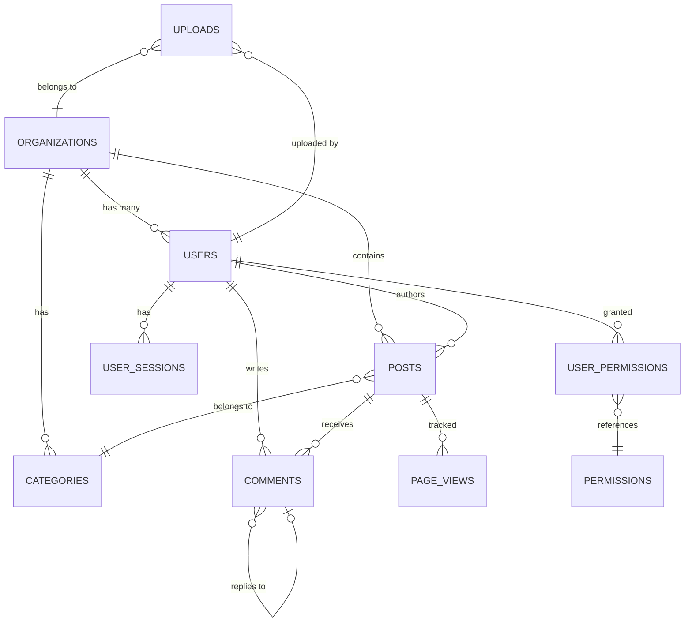

# Database Schema

Comprehensive reference for the Prismatic application database schema, including table structures, relationships, indexes, and data constraints.

<!-- NAV_START -->
## Navigation

**Current Location**: [Home](../README.md) > [Reference](README.md) > Database Schema

### Quick Links

- **📚 [Parent Directory](README.md)** - Return to reference index
- **🏠 [Documentation Home](../README.md)** - Main documentation index
- **🔍 [Search Documentation](glossary.md)** - Find terms and concepts

### Related Documentation

- [API Endpoints](api-endpoints.md) - API endpoints that interact with database entities
- [API Authentication](api-authentication.md) - User and permission data structures
- [Security Guidelines](../guides/security-guidelines.md) - Database security practices
- [Performance Optimization](../guides/performance-optimization.md) - Database performance tuning
- [ADR-0001: Umbrella Structure](../architecture/adr-0001-umbrella-structure.md) - Data layer architecture
<!-- NAV_END -->

## Overview

The Prismatic application uses PostgreSQL as its primary database, organized around domain-driven contexts that align with the umbrella application structure. This schema reference provides comprehensive details about table structures, relationships, and data constraints.

## Schema Organization

### Context-Based Organization
The database schema is organized by business contexts, matching the application's umbrella structure:

```
prismatic_db/
├── accounts/          # User management and authentication
├── content/           # Posts, comments, and media
├── organizations/     # Multi-tenant organization data
├── billing/          # Payment and subscription data
├── analytics/        # Usage tracking and metrics
└── system/           # Application-level data (migrations, etc.)
```

### Naming Conventions
- **Tables**: Plural nouns in snake_case (e.g., `users`, `blog_posts`)
- **Columns**: snake_case with descriptive names
- **Primary Keys**: `id` (UUID v4)
- **Foreign Keys**: `{table}_id` (e.g., `user_id`, `organization_id`)
- **Timestamps**: `inserted_at`, `updated_at` (UTC)
- **Soft Deletes**: `deleted_at` (nullable timestamp)

## Core Tables

### Users Table

#### Schema Definition
```sql
CREATE TABLE users (
    id UUID PRIMARY KEY DEFAULT gen_random_uuid(),
    email VARCHAR(255) NOT NULL UNIQUE,
    email_verified_at TIMESTAMP WITH TIME ZONE,
    password_hash VARCHAR(255) NOT NULL,
    name VARCHAR(255) NOT NULL,
    avatar_url TEXT,
    bio TEXT,
    status VARCHAR(50) DEFAULT 'active' CHECK (status IN ('active', 'inactive', 'suspended', 'deleted')),
    role VARCHAR(50) DEFAULT 'user' CHECK (role IN ('super_admin', 'org_admin', 'editor', 'user', 'viewer')),
    organization_id UUID REFERENCES organizations(id),
    last_login_at TIMESTAMP WITH TIME ZONE,
    login_count INTEGER DEFAULT 0,
    mfa_enabled BOOLEAN DEFAULT FALSE,
    mfa_secret_encrypted BYTEA,
    preferences JSONB DEFAULT '{}',
    metadata JSONB DEFAULT '{}',
    inserted_at TIMESTAMP WITH TIME ZONE DEFAULT NOW(),
    updated_at TIMESTAMP WITH TIME ZONE DEFAULT NOW(),
    deleted_at TIMESTAMP WITH TIME ZONE
);
```

#### Indexes
```sql
CREATE INDEX idx_users_email ON users(email) WHERE deleted_at IS NULL;
CREATE INDEX idx_users_organization_id ON users(organization_id) WHERE deleted_at IS NULL;
CREATE INDEX idx_users_status ON users(status) WHERE deleted_at IS NULL;
CREATE INDEX idx_users_role ON users(role);
CREATE INDEX idx_users_last_login ON users(last_login_at DESC);
CREATE INDEX idx_users_preferences ON users USING GIN(preferences) WHERE preferences IS NOT NULL;
```

#### Constraints and Rules
- **Email uniqueness**: Enforced with partial unique index (excluding soft-deleted records)
- **Password security**: Minimum length enforced at application level
- **MFA secret**: Encrypted using application-level encryption
- **Soft delete**: Records marked as deleted but not physically removed

### Organizations Table

#### Schema Definition
```sql
CREATE TABLE organizations (
    id UUID PRIMARY KEY DEFAULT gen_random_uuid(),
    name VARCHAR(255) NOT NULL,
    slug VARCHAR(100) NOT NULL UNIQUE,
    description TEXT,
    website_url TEXT,
    logo_url TEXT,
    status VARCHAR(50) DEFAULT 'active' CHECK (status IN ('active', 'inactive', 'suspended')),
    plan VARCHAR(50) DEFAULT 'free' CHECK (plan IN ('free', 'starter', 'professional', 'enterprise')),
    settings JSONB DEFAULT '{}',
    billing_email VARCHAR(255),
    tax_id VARCHAR(100),
    address JSONB,
    inserted_at TIMESTAMP WITH TIME ZONE DEFAULT NOW(),
    updated_at TIMESTAMP WITH TIME ZONE DEFAULT NOW()
);
```

#### Indexes
```sql
CREATE UNIQUE INDEX idx_organizations_slug ON organizations(slug);
CREATE INDEX idx_organizations_status ON organizations(status);
CREATE INDEX idx_organizations_plan ON organizations(plan);
CREATE INDEX idx_organizations_settings ON organizations USING GIN(settings);
```

### Posts Table

#### Schema Definition
```sql
CREATE TABLE posts (
    id UUID PRIMARY KEY DEFAULT gen_random_uuid(),
    title VARCHAR(500) NOT NULL,
    slug VARCHAR(200) NOT NULL,
    content TEXT,
    excerpt TEXT,
    status VARCHAR(50) DEFAULT 'draft' CHECK (status IN ('draft', 'pending', 'published', 'archived')),
    visibility VARCHAR(50) DEFAULT 'public' CHECK (visibility IN ('public', 'private', 'organization', 'unlisted')),
    featured BOOLEAN DEFAULT FALSE,
    author_id UUID NOT NULL REFERENCES users(id),
    organization_id UUID REFERENCES organizations(id),
    category_id UUID REFERENCES categories(id),
    published_at TIMESTAMP WITH TIME ZONE,
    reading_time INTEGER, -- Estimated reading time in minutes
    view_count INTEGER DEFAULT 0,
    like_count INTEGER DEFAULT 0,
    comment_count INTEGER DEFAULT 0,
    tags TEXT[], -- Array of tag strings
    meta_title VARCHAR(300),
    meta_description VARCHAR(500),
    custom_fields JSONB DEFAULT '{}',
    inserted_at TIMESTAMP WITH TIME ZONE DEFAULT NOW(),
    updated_at TIMESTAMP WITH TIME ZONE DEFAULT NOW(),
    deleted_at TIMESTAMP WITH TIME ZONE
);
```

#### Indexes
```sql
CREATE UNIQUE INDEX idx_posts_slug_org ON posts(slug, organization_id) WHERE deleted_at IS NULL;
CREATE INDEX idx_posts_author_id ON posts(author_id) WHERE deleted_at IS NULL;
CREATE INDEX idx_posts_organization_id ON posts(organization_id) WHERE deleted_at IS NULL;
CREATE INDEX idx_posts_status ON posts(status) WHERE deleted_at IS NULL;
CREATE INDEX idx_posts_visibility ON posts(visibility);
CREATE INDEX idx_posts_published_at ON posts(published_at DESC) WHERE status = 'published';
CREATE INDEX idx_posts_featured ON posts(featured) WHERE featured = TRUE AND status = 'published';
CREATE INDEX idx_posts_tags ON posts USING GIN(tags);
CREATE INDEX idx_posts_full_text ON posts USING GIN(to_tsvector('english', title || ' ' || COALESCE(content, '')));
```

### Comments Table

#### Schema Definition
```sql
CREATE TABLE comments (
    id UUID PRIMARY KEY DEFAULT gen_random_uuid(),
    content TEXT NOT NULL,
    status VARCHAR(50) DEFAULT 'published' CHECK (status IN ('published', 'pending', 'spam', 'deleted')),
    author_id UUID REFERENCES users(id),
    author_name VARCHAR(255), -- For guest comments
    author_email VARCHAR(255), -- For guest comments
    post_id UUID NOT NULL REFERENCES posts(id) ON DELETE CASCADE,
    parent_id UUID REFERENCES comments(id), -- For threaded comments
    like_count INTEGER DEFAULT 0,
    reply_count INTEGER DEFAULT 0,
    metadata JSONB DEFAULT '{}',
    inserted_at TIMESTAMP WITH TIME ZONE DEFAULT NOW(),
    updated_at TIMESTAMP WITH TIME ZONE DEFAULT NOW(),
    deleted_at TIMESTAMP WITH TIME ZONE
);
```

#### Indexes
```sql
CREATE INDEX idx_comments_post_id ON comments(post_id) WHERE deleted_at IS NULL;
CREATE INDEX idx_comments_author_id ON comments(author_id) WHERE deleted_at IS NULL;
CREATE INDEX idx_comments_parent_id ON comments(parent_id) WHERE parent_id IS NOT NULL;
CREATE INDEX idx_comments_status ON comments(status);
CREATE INDEX idx_comments_inserted_at ON comments(inserted_at DESC);
```

### Categories Table

#### Schema Definition
```sql
CREATE TABLE categories (
    id UUID PRIMARY KEY DEFAULT gen_random_uuid(),
    name VARCHAR(255) NOT NULL,
    slug VARCHAR(200) NOT NULL,
    description TEXT,
    color VARCHAR(7), -- Hex color code
    icon VARCHAR(100),
    parent_id UUID REFERENCES categories(id),
    organization_id UUID REFERENCES organizations(id),
    sort_order INTEGER DEFAULT 0,
    post_count INTEGER DEFAULT 0,
    is_active BOOLEAN DEFAULT TRUE,
    inserted_at TIMESTAMP WITH TIME ZONE DEFAULT NOW(),
    updated_at TIMESTAMP WITH TIME ZONE DEFAULT NOW()
);
```

#### Indexes
```sql
CREATE UNIQUE INDEX idx_categories_slug_org ON categories(slug, organization_id);
CREATE INDEX idx_categories_parent_id ON categories(parent_id);
CREATE INDEX idx_categories_organization_id ON categories(organization_id);
CREATE INDEX idx_categories_sort_order ON categories(sort_order);
CREATE INDEX idx_categories_active ON categories(is_active) WHERE is_active = TRUE;
```

## Authentication & Authorization

### User Sessions Table

#### Schema Definition
```sql
CREATE TABLE user_sessions (
    id UUID PRIMARY KEY DEFAULT gen_random_uuid(),
    user_id UUID NOT NULL REFERENCES users(id) ON DELETE CASCADE,
    session_token VARCHAR(255) NOT NULL UNIQUE,
    refresh_token_hash VARCHAR(255),
    ip_address INET,
    user_agent TEXT,
    device_info JSONB,
    last_activity_at TIMESTAMP WITH TIME ZONE DEFAULT NOW(),
    expires_at TIMESTAMP WITH TIME ZONE NOT NULL,
    is_active BOOLEAN DEFAULT TRUE,
    inserted_at TIMESTAMP WITH TIME ZONE DEFAULT NOW()
);
```

#### Indexes
```sql
CREATE INDEX idx_user_sessions_user_id ON user_sessions(user_id);
CREATE INDEX idx_user_sessions_token ON user_sessions(session_token);
CREATE INDEX idx_user_sessions_expires_at ON user_sessions(expires_at);
CREATE INDEX idx_user_sessions_active ON user_sessions(is_active) WHERE is_active = TRUE;
```

### Permissions Table

#### Schema Definition
```sql
CREATE TABLE permissions (
    id UUID PRIMARY KEY DEFAULT gen_random_uuid(),
    name VARCHAR(100) NOT NULL UNIQUE,
    description TEXT,
    resource VARCHAR(100) NOT NULL,
    action VARCHAR(100) NOT NULL,
    scope VARCHAR(100) DEFAULT 'own',
    is_system BOOLEAN DEFAULT FALSE,
    inserted_at TIMESTAMP WITH TIME ZONE DEFAULT NOW(),
    updated_at TIMESTAMP WITH TIME ZONE DEFAULT NOW()
);
```

### User Permissions Table

#### Schema Definition
```sql
CREATE TABLE user_permissions (
    id UUID PRIMARY KEY DEFAULT gen_random_uuid(),
    user_id UUID NOT NULL REFERENCES users(id) ON DELETE CASCADE,
    permission_id UUID NOT NULL REFERENCES permissions(id) ON DELETE CASCADE,
    granted_by UUID REFERENCES users(id),
    granted_at TIMESTAMP WITH TIME ZONE DEFAULT NOW(),
    expires_at TIMESTAMP WITH TIME ZONE,
    UNIQUE(user_id, permission_id)
);
```

## Audit and Logging

### Audit Logs Table

#### Schema Definition
```sql
CREATE TABLE audit_logs (
    id UUID PRIMARY KEY DEFAULT gen_random_uuid(),
    user_id UUID REFERENCES users(id),
    organization_id UUID REFERENCES organizations(id),
    action VARCHAR(100) NOT NULL,
    resource_type VARCHAR(100) NOT NULL,
    resource_id UUID,
    ip_address INET,
    user_agent TEXT,
    changes JSONB, -- Before/after values for updates
    metadata JSONB DEFAULT '{}',
    inserted_at TIMESTAMP WITH TIME ZONE DEFAULT NOW()
);
```

#### Indexes
```sql
CREATE INDEX idx_audit_logs_user_id ON audit_logs(user_id);
CREATE INDEX idx_audit_logs_organization_id ON audit_logs(organization_id);
CREATE INDEX idx_audit_logs_action ON audit_logs(action);
CREATE INDEX idx_audit_logs_resource ON audit_logs(resource_type, resource_id);
CREATE INDEX idx_audit_logs_inserted_at ON audit_logs(inserted_at DESC);
```

### Security Events Table

#### Schema Definition
```sql
CREATE TABLE security_events (
    id UUID PRIMARY KEY DEFAULT gen_random_uuid(),
    event_type VARCHAR(100) NOT NULL,
    severity VARCHAR(50) DEFAULT 'info' CHECK (severity IN ('info', 'warning', 'error', 'critical')),
    user_id UUID REFERENCES users(id),
    ip_address INET,
    user_agent TEXT,
    details JSONB DEFAULT '{}',
    resolved BOOLEAN DEFAULT FALSE,
    resolved_by UUID REFERENCES users(id),
    resolved_at TIMESTAMP WITH TIME ZONE,
    inserted_at TIMESTAMP WITH TIME ZONE DEFAULT NOW()
);
```

#### Indexes
```sql
CREATE INDEX idx_security_events_type ON security_events(event_type);
CREATE INDEX idx_security_events_severity ON security_events(severity);
CREATE INDEX idx_security_events_user_id ON security_events(user_id);
CREATE INDEX idx_security_events_resolved ON security_events(resolved) WHERE resolved = FALSE;
CREATE INDEX idx_security_events_inserted_at ON security_events(inserted_at DESC);
```

## File Management

### Uploads Table

#### Schema Definition
```sql
CREATE TABLE uploads (
    id UUID PRIMARY KEY DEFAULT gen_random_uuid(),
    filename VARCHAR(500) NOT NULL,
    original_filename VARCHAR(500) NOT NULL,
    content_type VARCHAR(100) NOT NULL,
    file_size BIGINT NOT NULL,
    file_hash VARCHAR(64) NOT NULL, -- SHA-256 hash
    storage_path TEXT NOT NULL,
    storage_provider VARCHAR(50) DEFAULT 'local',
    uploaded_by UUID REFERENCES users(id),
    organization_id UUID REFERENCES organizations(id),
    is_public BOOLEAN DEFAULT FALSE,
    metadata JSONB DEFAULT '{}', -- Image dimensions, etc.
    status VARCHAR(50) DEFAULT 'pending' CHECK (status IN ('pending', 'processed', 'failed', 'deleted')),
    expires_at TIMESTAMP WITH TIME ZONE,
    inserted_at TIMESTAMP WITH TIME ZONE DEFAULT NOW(),
    updated_at TIMESTAMP WITH TIME ZONE DEFAULT NOW(),
    deleted_at TIMESTAMP WITH TIME ZONE
);
```

#### Indexes
```sql
CREATE INDEX idx_uploads_uploaded_by ON uploads(uploaded_by);
CREATE INDEX idx_uploads_organization_id ON uploads(organization_id);
CREATE INDEX idx_uploads_hash ON uploads(file_hash);
CREATE INDEX idx_uploads_status ON uploads(status);
CREATE INDEX idx_uploads_expires_at ON uploads(expires_at) WHERE expires_at IS NOT NULL;
CREATE INDEX idx_uploads_public ON uploads(is_public) WHERE is_public = TRUE;
```

## Analytics and Metrics

### Page Views Table

#### Schema Definition
```sql
CREATE TABLE page_views (
    id UUID PRIMARY KEY DEFAULT gen_random_uuid(),
    url TEXT NOT NULL,
    post_id UUID REFERENCES posts(id),
    user_id UUID REFERENCES users(id),
    organization_id UUID REFERENCES organizations(id),
    ip_address INET,
    user_agent TEXT,
    referrer TEXT,
    session_id UUID,
    duration INTEGER, -- Time spent on page in seconds
    viewed_at TIMESTAMP WITH TIME ZONE DEFAULT NOW()
);
```

#### Partitioning
```sql
-- Partition by month for better performance
CREATE TABLE page_views_y2024m01 PARTITION OF page_views
FOR VALUES FROM ('2024-01-01') TO ('2024-02-01');

CREATE TABLE page_views_y2024m02 PARTITION OF page_views
FOR VALUES FROM ('2024-02-01') TO ('2024-03-01');
```

#### Indexes
```sql
CREATE INDEX idx_page_views_post_id ON page_views(post_id);
CREATE INDEX idx_page_views_user_id ON page_views(user_id);
CREATE INDEX idx_page_views_viewed_at ON page_views(viewed_at DESC);
CREATE INDEX idx_page_views_session ON page_views(session_id);
```

## Application Metadata

### Schema Migrations Table

#### Schema Definition
```sql
CREATE TABLE schema_migrations (
    version BIGINT PRIMARY KEY,
    inserted_at TIMESTAMP WITH TIME ZONE DEFAULT NOW()
);
```

### Application Settings Table

#### Schema Definition
```sql
CREATE TABLE application_settings (
    id UUID PRIMARY KEY DEFAULT gen_random_uuid(),
    key VARCHAR(255) NOT NULL UNIQUE,
    value JSONB NOT NULL,
    description TEXT,
    is_public BOOLEAN DEFAULT FALSE,
    updated_by UUID REFERENCES users(id),
    inserted_at TIMESTAMP WITH TIME ZONE DEFAULT NOW(),
    updated_at TIMESTAMP WITH TIME ZONE DEFAULT NOW()
);
```

## Database Functions and Triggers

### Timestamp Triggers
```sql
-- Function to update the updated_at timestamp
CREATE OR REPLACE FUNCTION update_updated_at_column()
RETURNS TRIGGER AS $$
BEGIN
    NEW.updated_at = NOW();
    RETURN NEW;
END;
$$ language 'plpgsql';

-- Apply to all tables with updated_at column
CREATE TRIGGER update_users_updated_at 
    BEFORE UPDATE ON users 
    FOR EACH ROW EXECUTE FUNCTION update_updated_at_column();

CREATE TRIGGER update_posts_updated_at 
    BEFORE UPDATE ON posts 
    FOR EACH ROW EXECUTE FUNCTION update_updated_at_column();
```

### Counter Maintenance
```sql
-- Function to maintain comment counts on posts
CREATE OR REPLACE FUNCTION update_post_comment_count()
RETURNS TRIGGER AS $$
BEGIN
    IF TG_OP = 'INSERT' THEN
        UPDATE posts SET comment_count = comment_count + 1 WHERE id = NEW.post_id;
        RETURN NEW;
    ELSIF TG_OP = 'DELETE' THEN
        UPDATE posts SET comment_count = comment_count - 1 WHERE id = OLD.post_id;
        RETURN OLD;
    END IF;
    RETURN NULL;
END;
$$ language 'plpgsql';

CREATE TRIGGER update_post_comment_count_trigger
    AFTER INSERT OR DELETE ON comments
    FOR EACH ROW EXECUTE FUNCTION update_post_comment_count();
```

### Full-Text Search
```sql
-- Function to update search vectors
CREATE OR REPLACE FUNCTION update_post_search_vector()
RETURNS TRIGGER AS $$
BEGIN
    NEW.search_vector := to_tsvector('english', NEW.title || ' ' || COALESCE(NEW.content, ''));
    RETURN NEW;
END;
$$ language 'plpgsql';

CREATE TRIGGER update_post_search_vector_trigger
    BEFORE INSERT OR UPDATE ON posts
    FOR EACH ROW EXECUTE FUNCTION update_post_search_vector();
```

## Data Relationships

### Entity Relationship Diagram


### Key Relationships
- **Organizations ↔ Users**: One-to-many (multi-tenant)
- **Users ↔ Posts**: One-to-many (authorship)
- **Posts ↔ Comments**: One-to-many (hierarchical with self-reference)
- **Categories ↔ Posts**: One-to-many
- **Users ↔ Permissions**: Many-to-many through user_permissions

## Performance Considerations

### Indexing Strategy
- **Primary indexes**: All foreign keys and frequently queried columns
- **Composite indexes**: Multi-column queries and unique constraints
- **Partial indexes**: Status-based filtering and soft deletes
- **GIN indexes**: JSONB columns and full-text search
- **Covering indexes**: Include frequently accessed columns

### Query Optimization
```sql
-- Example optimized query with proper indexing
EXPLAIN ANALYZE
SELECT p.id, p.title, p.published_at, u.name as author_name
FROM posts p
JOIN users u ON p.author_id = u.id
WHERE p.status = 'published' 
  AND p.organization_id = $1
  AND p.published_at >= $2
ORDER BY p.published_at DESC
LIMIT 20;

-- Uses indexes:
-- - idx_posts_status
-- - idx_posts_organization_id  
-- - idx_posts_published_at
```

### Partitioning Strategy
- **Time-based partitioning**: Analytics tables (page_views, audit_logs)
- **Hash partitioning**: Large tables with even distribution
- **Range partitioning**: Historical data archival

## Database Maintenance

### Regular Maintenance Tasks
```sql
-- Analyze table statistics (weekly)
ANALYZE;

-- Vacuum to reclaim space (daily for active tables)
VACUUM (ANALYZE, VERBOSE) posts;
VACUUM (ANALYZE, VERBOSE) comments;

-- Reindex to maintain performance (monthly)
REINDEX TABLE posts;
REINDEX TABLE users;
```

### Data Cleanup
```sql
-- Clean up expired sessions
DELETE FROM user_sessions 
WHERE expires_at < NOW() - INTERVAL '7 days';

-- Archive old page views (keep 1 year)
DELETE FROM page_views 
WHERE viewed_at < NOW() - INTERVAL '1 year';

-- Clean up soft-deleted records (after 90 days)
DELETE FROM posts 
WHERE deleted_at IS NOT NULL 
  AND deleted_at < NOW() - INTERVAL '90 days';
```

## Migration Management

### Migration Naming Convention
```
YYYYMMDDHHMMSS_descriptive_name.exs
20240115120000_create_users_table.exs
20240115121500_add_mfa_to_users.exs
20240115130000_create_posts_table.exs
```

### Migration Best Practices
```elixir
# Safe migration example
defmodule Prismatic.Repo.Migrations.AddMfaToUsers do
  use Ecto.Migration

  def up do
    alter table(:users) do
      add :mfa_enabled, :boolean, default: false, null: false
      add :mfa_secret_encrypted, :binary
    end

    create index(:users, [:mfa_enabled])
  end

  def down do
    alter table(:users) do
      remove :mfa_enabled
      remove :mfa_secret_encrypted
    end
  end
end
```

## Security Considerations

### Data Protection
- **Encryption**: Sensitive fields encrypted at application level
- **Hashing**: Passwords use Argon2 with salt
- **Access Control**: Row-level security for multi-tenant data
- **Audit Trail**: All data changes logged in audit_logs

### Connection Security
```elixir
# Database connection configuration
config :prismatic, Prismatic.Repo,
  ssl: true,
  ssl_opts: [
    verify: :verify_peer,
    cacerts: :public_key.cacerts_get(),
    server_name_indication: 'db.example.com',
    customize_hostname_check: [
      match_fun: :public_key.pkix_verify_hostname_match_fun(:https)
    ]
  ]
```

## Related Documentation

- [API Endpoints](api-endpoints.md) - API endpoints that interact with these database entities
- [API Authentication](api-authentication.md) - User authentication and permission system implementation
- [Security Guidelines](../guides/security-guidelines.md) - Database security best practices
- [Performance Optimization](../guides/performance-optimization.md) - Database performance tuning strategies
- [ADR-0001: Umbrella Structure](../architecture/adr-0001-umbrella-structure.md) - Data layer architecture decisions
- [System Diagrams](../architecture/system-diagrams.md) - Visual representation of data architecture

---

**This schema documentation should be updated whenever database structure changes. All schema modifications should be done through proper migrations and reviewed for performance and security implications.**