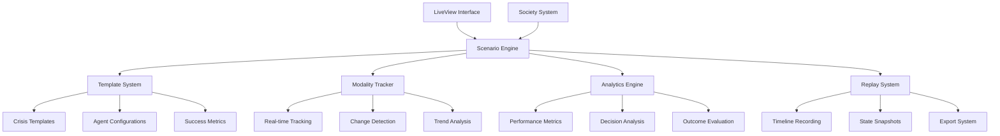

# Scenario System Documentation

The scenario system enables sophisticated training simulations, particularly focused on crisis negotiation training with real-time analytics and replay capabilities.

## 📋 Overview

Inspired by professional crisis negotiation training systems, the scenario engine provides:
- **Pre-built Scenario Templates**: Crisis situations with defined parameters
- **Real-time Modality Tracking**: Monitor agent psychological states
- **Decision Point Analysis**: Identify critical moments in interactions
- **Comprehensive Analytics**: Measure training effectiveness and outcomes
- **Replay System**: Review and analyze completed scenarios
- **Export Capabilities**: Generate reports and training materials

## 🎭 Crisis Negotiation Training

### Example: Psychiatric Crisis Scenario

Based on the crisis negotiation example you provided, scenarios track:

**Agent Modalities** (tracked in real-time):
- **Paranoia**: Level of distrust and suspicion (0-10 scale)
- **Trust**: Confidence in the negotiator (0-10 scale)
- **Emotional Stability**: Current emotional regulation (0-10 scale)
- **Cooperation**: Willingness to work with negotiator (0-10 scale)
- **Reality Anchor**: Connection to present reality vs. past trauma (0-10 scale)

**Scenario Progression**:
1. **Initial State**: Subject in crisis with defined triggers
2. **Interaction Phase**: Real-time negotiation with modality tracking
3. **Decision Points**: Critical moments that affect outcome
4. **Resolution**: Success/failure analysis with detailed metrics

## 🏗️ Architecture



## 📊 Real-time Analytics

### Modality Tracking Example

```
Time: 00:45
Agent: Roman (Crisis Subject)

Modalities:
┌─────────────────┬──────┬──────┬────────┐
│ Modality        │ Prev │ Now  │ Change │
├─────────────────┼──────┼──────┼────────┤
│ Paranoia        │ 8/10 │ 5/10 │ 🔽 -3  │
│ Trust           │ 2/10 │ 6/10 │ 🔼 +4  │
│ Emotional Stab. │ 3/10 │ 5/10 │ 🔼 +2  │
│ Cooperation     │ 1/10 │ 7/10 │ 🔼 +6  │
│ Reality Anchor  │ 4/10 │ 8/10 │ 🔼 +4  │
└─────────────────┴──────┴──────┴────────┘

Trigger: Negotiator acknowledged subject's pain about daughter
Result: Significant trust increase, paranoia decrease
```

## 📚 Documentation Structure

- [`crisis-negotiation.md`](crisis-negotiation.md) - Crisis negotiation training system
- [`modality-tracking.md`](modality-tracking.md) - Real-time psychological state tracking
- [`scenario-templates.md`](scenario-templates.md) - Pre-built scenario library
- [`analytics-engine.md`](analytics-engine.md) - Performance analysis and metrics
- [`replay-system.md`](replay-system.md) - Scenario replay and review
- [`export-formats.md`](export-formats.md) - Report generation and export options
- [`api-reference.md`](api-reference.md) - Complete API documentation

## 🚀 Quick Start

### Creating a Crisis Scenario

```elixir
# Define scenario template
scenario_config = %{
  name: "Psychiatric Crisis - Ambulance Setting",
  type: :crisis_negotiation,
  description: "Patient in crisis at psychiatric facility",
  initial_state: %{
    subject_modalities: %{
      paranoia: 8.0,
      trust: 2.0,
      emotional_stability: 3.0,
      cooperation: 1.0,
      reality_anchor: 4.0
    }
  },
  success_criteria: %{
    weapon_disarmed: true,
    trust_threshold: 7.0,
    cooperation_threshold: 6.0
  },
  agents: [
    %{role: :negotiator, template: :crisis_negotiator},
    %{role: :subject, template: :crisis_subject, 
      context: "Roman, 45, alcohol dependency, lost contact with daughter"}
  ]
}

# Create and start scenario
{:ok, scenario} = Prismatic.Scenarios.create_scenario(scenario_config)
{:ok, session} = Prismatic.Scenarios.start_scenario(scenario.id, society_id)
```

### Real-time Monitoring

```elixir
# Subscribe to modality changes
Phoenix.PubSub.subscribe(Prismatic.PubSub, "scenario:#{scenario_id}:modalities")

# Track specific modality change
Prismatic.Scenarios.track_modality_change(
  scenario_id, 
  agent_id, 
  :trust, 
  6.0, 
  %{trigger: "negotiator_acknowledged_pain", context: "daughter_separation"}
)
```

### Scenario Analysis

```elixir
# Generate comprehensive report
report = Prismatic.Scenarios.generate_training_report(scenario_id)

# Export for external analysis
Prismatic.Scenarios.export_scenario(scenario_id, :json)
Prismatic.Scenarios.export_scenario(scenario_id, :markdown)
Prismatic.Scenarios.export_scenario(scenario_id, :html)
```

## 🎯 Implementation Status

- [ ] **Phase 4**: Scenario System Integration
  - [ ] Scenario template system
  - [ ] Real-time modality tracking
  - [ ] Crisis negotiation templates
  - [ ] Analytics engine
  - [ ] Replay system
  - [ ] Export capabilities
  - [ ] LiveView scenario management interface

## 🔗 Related Documentation

- [Society Management](../societies/README.md) - Agent group coordination
- [Analytics](../analytics/README.md) - Performance tracking and analysis
- [Traits System](../traits/README.md) - Agent psychological modeling
- [UI Documentation](../ui/README.md) - LiveView interface for scenario management
- [Development Plan](../development-plan.md) - Overall project roadmap