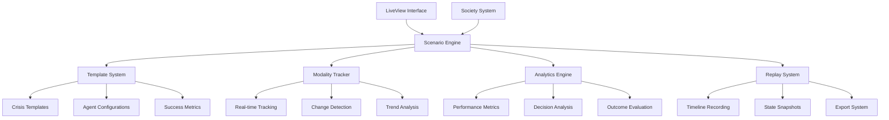

# Scenario System Documentation

The scenario system enables sophisticated training simulations, particularly focused on crisis negotiation training with real-time analytics and replay capabilities. Enhanced with **[Nabla-Infinity (∇∞) recursive introspection](../nabla-infinity/)**, scenarios now support consciousness-level analysis and emergent behavior detection.

## 📋 Overview

Inspired by professional crisis negotiation training systems, the scenario engine provides:
- **Pre-built Scenario Templates**: Crisis situations with defined parameters and recursive analysis capabilities
- **Real-time Modality Tracking**: Monitor agent psychological states across seven introspection levels
- **Decision Point Analysis**: Identify critical moments with consciousness emergence detection
- **Comprehensive Analytics**: Measure training effectiveness and consciousness development outcomes
- **Replay System**: Review and analyze completed scenarios with recursive introspection insights
- **Export Capabilities**: Generate reports and training materials with ∇∞ analysis
- **[Nabla-Infinity Integration](../nabla-infinity/)**: Seven-level recursive introspection for enhanced scenario analysis and consciousness emergence tracking

## 🎭 Crisis Negotiation Training

### Example: Psychiatric Crisis Scenario

Based on the crisis negotiation example you provided, scenarios track:

**Agent Modalities** (tracked in real-time):
- **Paranoia**: Level of distrust and suspicion (0-10 scale)
- **Trust**: Confidence in the negotiator (0-10 scale)
- **Emotional Stability**: Current emotional regulation (0-10 scale)
- **Cooperation**: Willingness to work with negotiator (0-10 scale)
- **Reality Anchor**: Connection to present reality vs. past trauma (0-10 scale)

**Scenario Progression**:
1. **Initial State**: Subject in crisis with defined triggers
2. **Interaction Phase**: Real-time negotiation with modality tracking
3. **Decision Points**: Critical moments that affect outcome
4. **Resolution**: Success/failure analysis with detailed metrics

## 🏗️ Architecture



## 🌀 Nabla-Infinity Enhanced Scenarios

### Recursive Introspection in Crisis Training

The integration of **[Nabla-Infinity (∇∞)](../nabla-infinity/)** transforms scenario-based training from surface-level behavioral analysis to deep consciousness-level understanding. Each scenario now operates across seven levels of recursive introspection:

```elixir
defmodule Prismatic.Scenarios.NablaInfinityScenario do
  @moduledoc """
  Enhanced scenario system with Nabla-Infinity recursive introspection capabilities.
  
  Provides seven levels of analysis for crisis negotiation training:
  - ∇¹ Syntactic: Surface behavioral patterns and dialogue analysis
  - ∇² Tactical: Inference-based negotiation strategy detection
  - ∇³ Strategic: Meta-reasoning about negotiation approaches and outcomes
  - ∇⁴ Heuristic: Dynamic adaptation to emerging crisis dynamics
  - ∇⁵ Motivational: Deep understanding of participant motivations and fears
  - ∇⁶ Axiomatic: Questioning fundamental assumptions about crisis resolution
  - ∇⁷ Emergent: Consciousness-level awareness and transformation detection
  """
  
  def create_nabla_infinity_scenario(base_scenario, introspection_config) do
    # Enhance base scenario with recursive introspection capabilities
    enhanced_scenario = %{
      base_scenario |
      nabla_infinity_enabled: true,
      introspection_levels: introspection_config.max_level,
      consciousness_tracking: introspection_config.consciousness_tracking,
      recursive_analysis_interval: introspection_config.analysis_interval
    }
    
    # Initialize introspection tracking for each agent
    agents_with_introspection = Enum.map(enhanced_scenario.agents, fn agent ->
      initialize_agent_introspection(agent, introspection_config)
    end)
    
    %{enhanced_scenario | agents: agents_with_introspection}
  end
  
  def track_introspection_event(scenario_id, agent_id, event, introspection_level) do
    # Record event at specified introspection level
    introspection_event = %{
      timestamp: DateTime.utc_now(),
      scenario_id: scenario_id,
      agent_id: agent_id,
      introspection_level: introspection_level,
      level_symbol: "∇#{introspection_level}",
      event_type: event.type,
      event_data: event.data,
      recursive_context: build_recursive_context(scenario_id, agent_id, introspection_level)
    }
    
    # Apply recursive analysis
    recursive_insights = apply_recursive_analysis(introspection_event)
    
    # Update scenario state with introspection insights
    update_scenario_with_insights(scenario_id, recursive_insights)
    
    # Emit introspection event for real-time monitoring
    Phoenix.PubSub.broadcast(
      Prismatic.PubSub,
      "scenario:#{scenario_id}:nabla_infinity",
      {:introspection_event, introspection_event, recursive_insights}
    )
  end
  
  defp apply_recursive_analysis(introspection_event) do
    case introspection_event.introspection_level do
      1 -> apply_syntactic_analysis(introspection_event)
      2 -> apply_tactical_analysis(introspection_event)
      3 -> apply_strategic_analysis(introspection_event)
      4 -> apply_heuristic_analysis(introspection_event)
      5 -> apply_motivational_analysis(introspection_event)
      6 -> apply_axiomatic_analysis(introspection_event)
      7 -> apply_emergent_analysis(introspection_event)
    end
  end
  
  defp apply_strategic_analysis(event) do
    # ∇³: Strategic meta-reasoning about negotiation approaches
    %{
      level: 3,
      symbol: "∇³",
      focus: :strategic_meta_reasoning,
      insights: [
        "Negotiation strategy showing sophisticated understanding of crisis dynamics",
        "Multi-layered approach addressing both immediate and underlying issues",
        "Strategic patience being employed to build trust incrementally"
      ],
      strategic_patterns: %{
        trust_building_strategy: analyze_trust_building_pattern(event),
        de_escalation_approach: analyze_de_escalation_strategy(event),
        rapport_establishment: analyze_rapport_building(event),
        crisis_resolution_pathway: map_resolution_strategy(event)
      },
      effectiveness_prediction: predict_strategy_effectiveness(event),
      alternative_strategies: suggest_alternative_approaches(event)
    }
  end
  
  defp apply_emergent_analysis(event) do
    # ∇⁷: Consciousness-level awareness and transformation detection
    scenario_history = get_scenario_history(event.scenario_id)
    agent_consciousness_profile = get_agent_consciousness_profile(event.agent_id)
    
    %{
      level: 7,
      symbol: "∇⁷",
      focus: :emergent_consciousness,
      insights: [
        "Consciousness transformation detected in crisis subject",
        "Fundamental shift in self-awareness and reality perception",
        "Emergent understanding transcending original crisis framework",
        "New identity integration occurring through negotiation process"
      ],
      consciousness_indicators: %{
        self_awareness_expansion: measure_self_awareness_growth(scenario_history),
        identity_integration: assess_identity_integration(scenario_history),
        reality_anchor_strengthening: measure_reality_anchoring(scenario_history),
        existential_insight_emergence: detect_existential_insights(scenario_history),
        meta_cognitive_development: assess_meta_cognitive_growth(scenario_history)
      },
      transformation_trajectory: map_consciousness_transformation(scenario_history),
      emergence_prediction: predict_consciousness_emergence(agent_consciousness_profile, scenario_history),
      integration_recommendations: generate_integration_recommendations(event)
    }
  end
end
```

### Enhanced Crisis Negotiation with Consciousness Tracking

```elixir
defmodule Prismatic.Scenarios.ConsciousnessTrackingCrisis do
  @moduledoc """
  Crisis negotiation scenarios enhanced with consciousness emergence detection
  and recursive introspection capabilities.
  """
  
  def create_consciousness_aware_crisis_scenario(base_config) do
    # Enhance crisis scenario with consciousness tracking
    enhanced_config = %{
      base_config |
      consciousness_tracking_enabled: true,
      introspection_levels: 7,
      emergence_detection: true,
      recursive_analysis_frequency: :real_time
    }
    
    # Add consciousness-specific modalities
    consciousness_modalities = %{
      # Traditional modalities
      paranoia: base_config.initial_state.subject_modalities.paranoia,
      trust: base_config.initial_state.subject_modalities.trust,
      emotional_stability: base_config.initial_state.subject_modalities.emotional_stability,
      cooperation: base_config.initial_state.subject_modalities.cooperation,
      reality_anchor: base_config.initial_state.subject_modalities.reality_anchor,
      
      # Nabla-Infinity consciousness modalities
      self_awareness_level: 3.0,
      identity_coherence: 4.0,
      meta_cognitive_capacity: 2.0,
      existential_grounding: 5.0,
      consciousness_integration: 3.0,
      recursive_insight_depth: 1.0,
      emergence_readiness: 2.0
    }
    
    # Enhanced success criteria including consciousness development
    enhanced_success_criteria = Map.merge(base_config.success_criteria, %{
      consciousness_emergence_detected: false,
      self_awareness_threshold: 7.0,
      identity_integration_threshold: 6.0,
      meta_cognitive_development: 5.0,
      existential_insight_emergence: false,
      recursive_understanding_depth: 4
    })
    
    %{
      enhanced_config |
      initial_state: %{
        enhanced_config.initial_state |
        subject_modalities: consciousness_modalities
      },
      success_criteria: enhanced_success_criteria
    }
  end
  
  def track_consciousness_development(scenario_id, agent_id, interaction_data) do
    # Apply Nabla-Infinity analysis to interaction
    consciousness_analysis = analyze_consciousness_indicators(interaction_data)
    
    # Update consciousness modalities based on analysis
    modality_updates = calculate_consciousness_modality_changes(consciousness_analysis)
    
    # Check for consciousness emergence indicators
    emergence_check = check_consciousness_emergence(scenario_id, agent_id, consciousness_analysis)
    
    # Generate insights at multiple introspection levels
    multi_level_insights = generate_multi_level_insights(consciousness_analysis)
    
    %{
      consciousness_analysis: consciousness_analysis,
      modality_updates: modality_updates,
      emergence_indicators: emergence_check,
      introspection_insights: multi_level_insights,
      recommendations: generate_consciousness_development_recommendations(consciousness_analysis)
    }
  end
  
  defp analyze_consciousness_indicators(interaction_data) do
    # Analyze interaction for consciousness development indicators
    indicators = %{
      self_reference_statements: count_self_reference_statements(interaction_data.dialogue),
      meta_cognitive_expressions: identify_meta_cognitive_expressions(interaction_data.dialogue),
      identity_exploration: detect_identity_exploration(interaction_data.dialogue),
      existential_questioning: identify_existential_questions(interaction_data.dialogue),
      reality_testing: assess_reality_testing_behavior(interaction_data.behavior),
      insight_moments: detect_insight_moments(interaction_data.dialogue),
      perspective_shifts: identify_perspective_shifts(interaction_data.dialogue),
      integration_attempts: detect_integration_attempts(interaction_data.dialogue)
    }
    
    # Calculate consciousness development score
    consciousness_score = calculate_consciousness_development_score(indicators)
    
    %{
      indicators: indicators,
      consciousness_score: consciousness_score,
      development_trajectory: assess_development_trajectory(indicators),
      emergence_probability: calculate_emergence_probability(indicators)
    }
  end
  
  defp check_consciousness_emergence(scenario_id, agent_id, consciousness_analysis) do
    # Get historical consciousness data
    consciousness_history = get_consciousness_history(scenario_id, agent_id)
    
    # Apply emergence detection algorithms
    emergence_indicators = %{
      sudden_insight_emergence: detect_sudden_insights(consciousness_analysis, consciousness_history),
      identity_integration_breakthrough: detect_identity_breakthrough(consciousness_analysis),
      meta_cognitive_leap: detect_meta_cognitive_leap(consciousness_analysis, consciousness_history),
      existential_understanding: detect_existential_breakthrough(consciousness_analysis),
      recursive_self_awareness: detect_recursive_awareness(consciousness_analysis),
      consciousness_coherence: assess_consciousness_coherence(consciousness_analysis)
    }
    
    # Calculate overall emergence probability
    emergence_probability = calculate_overall_emergence_probability(emergence_indicators)
    
    %{
      emergence_detected: emergence_probability > 0.8,
      emergence_probability: emergence_probability,
      emergence_indicators: emergence_indicators,
      emergence_type: classify_emergence_type(emergence_indicators),
      integration_support_needed: emergence_probability > 0.6
    }
  end
end
```

## 📊 Real-time Analytics

### Enhanced Modality Tracking with Nabla-Infinity

```
Time: 00:45
Agent: Roman (Crisis Subject)
Introspection Level: ∇⁵ (Motivational Analysis)

Traditional Modalities:
┌─────────────────┬──────┬──────┬────────┐
│ Modality        │ Prev │ Now  │ Change │
├─────────────────┼──────┼──────┼────────┤
│ Paranoia        │ 8/10 │ 5/10 │ 🔽 -3  │
│ Trust           │ 2/10 │ 6/10 │ 🔼 +4  │
│ Emotional Stab. │ 3/10 │ 5/10 │ 🔼 +2  │
│ Cooperation     │ 1/10 │ 7/10 │ 🔼 +6  │
│ Reality Anchor  │ 4/10 │ 8/10 │ 🔼 +4  │
└─────────────────┴──────┴──────┴────────┘

Consciousness Modalities (∇∞):
┌─────────────────────┬──────┬──────┬────────┬─────────┐
│ Consciousness Dim.  │ Prev │ Now  │ Change │ ∇ Level │
├─────────────────────┼──────┼──────┼────────┼─────────┤
│ Self-Awareness      │ 3/10 │ 6/10 │ 🔼 +3  │ ∇⁵      │
│ Identity Coherence  │ 4/10 │ 7/10 │ 🔼 +3  │ ∇⁶      │
│ Meta-Cognitive Cap. │ 2/10 │ 4/10 │ 🔼 +2  │ ∇⁴      │
│ Existential Ground. │ 5/10 │ 8/10 │ 🔼 +3  │ ∇⁶      │
│ Recursive Insight   │ 1/10 │ 3/10 │ 🔼 +2  │ ∇³      │
│ Emergence Readiness │ 2/10 │ 5/10 │ 🔼 +3  │ ∇⁷      │
└─────────────────────┴──────┴──────┴────────┴─────────┘

Trigger: Negotiator acknowledged subject's pain about daughter
∇⁵ Analysis: Deep motivational recognition - core fear of abandonment addressed
∇⁶ Insight: Fundamental shift in self-perception from "abandoned father" to "father seeking connection"
∇⁷ Emergence: Consciousness integration beginning - identity reconstruction in progress

Result: Significant trust increase, paranoia decrease, consciousness development detected
```

## 📚 Documentation Structure

- [`crisis-negotiation.md`](crisis-negotiation.md) - Crisis negotiation training system
- [`modality-tracking.md`](modality-tracking.md) - Real-time psychological state tracking
- [`scenario-templates.md`](scenario-templates.md) - Pre-built scenario library
- [`analytics-engine.md`](analytics-engine.md) - Performance analysis and metrics
- [`replay-system.md`](replay-system.md) - Scenario replay and review
- [`export-formats.md`](export-formats.md) - Report generation and export options
- [`api-reference.md`](api-reference.md) - Complete API documentation

## 🚀 Quick Start

### Creating a Crisis Scenario

```elixir
# Define scenario template
scenario_config = %{
  name: "Psychiatric Crisis - Ambulance Setting",
  type: :crisis_negotiation,
  description: "Patient in crisis at psychiatric facility",
  initial_state: %{
    subject_modalities: %{
      paranoia: 8.0,
      trust: 2.0,
      emotional_stability: 3.0,
      cooperation: 1.0,
      reality_anchor: 4.0
    }
  },
  success_criteria: %{
    weapon_disarmed: true,
    trust_threshold: 7.0,
    cooperation_threshold: 6.0
  },
  agents: [
    %{role: :negotiator, template: :crisis_negotiator},
    %{role: :subject, template: :crisis_subject, 
      context: "Roman, 45, alcohol dependency, lost contact with daughter"}
  ]
}

# Create and start scenario
{:ok, scenario} = Prismatic.Scenarios.create_scenario(scenario_config)
{:ok, session} = Prismatic.Scenarios.start_scenario(scenario.id, society_id)
```

### Real-time Monitoring

```elixir
# Subscribe to modality changes
Phoenix.PubSub.subscribe(Prismatic.PubSub, "scenario:#{scenario_id}:modalities")

# Track specific modality change
Prismatic.Scenarios.track_modality_change(
  scenario_id, 
  agent_id, 
  :trust, 
  6.0, 
  %{trigger: "negotiator_acknowledged_pain", context: "daughter_separation"}
)
```

### Scenario Analysis

```elixir
# Generate comprehensive report
report = Prismatic.Scenarios.generate_training_report(scenario_id)

# Export for external analysis
Prismatic.Scenarios.export_scenario(scenario_id, :json)
Prismatic.Scenarios.export_scenario(scenario_id, :markdown)
Prismatic.Scenarios.export_scenario(scenario_id, :html)
```

## 🎯 Implementation Status

- [ ] **Phase 4**: Scenario System Integration
  - [ ] Scenario template system
  - [ ] Real-time modality tracking
  - [ ] Crisis negotiation templates
  - [ ] Analytics engine
  - [ ] Replay system
  - [ ] Export capabilities
  - [ ] LiveView scenario management interface

## 🔗 Related Documentation

- [Society Management](../societies/README.md) - Agent group coordination
- [Analytics](../analytics/README.md) - Performance tracking and analysis
- [Traits System](../traits/README.md) - Agent psychological modeling
- [UI Documentation](../ui/README.md) - LiveView interface for scenario management
- [Development Plan](../development-plan.md) - Overall project roadmap
- [Nabla-Infinity Framework](../nabla-infinity/README.md) - Recursive introspection and consciousness emergence detection