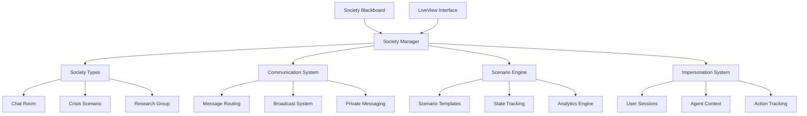

# Society Management Documentation

Societies are groups of agents that interact within shared contexts, supporting various interaction patterns from simple chat rooms to complex crisis negotiation training scenarios.

## 📋 Overview

The society system enables:
- **IRC-style Chat Rooms**: Simple group communication
- **Crisis Negotiation Training**: Scenario-based training with real-time analytics
- **Research Groups**: Collaborative knowledge building
- **Agent Impersonation**: Users can act as agents within scenarios
- **Persistent Scenarios**: Save and restore complex interaction states
- **Real-time Analytics**: Track agent traits and interaction patterns

## 🏗️ Architecture



## 🎭 Society Types

### IRC-style Chat Rooms
- Public messages to all members
- Private messages between members
- Topic management
- Member join/leave notifications

### Crisis Negotiation Training
Inspired by professional crisis negotiation training systems:
- **Scenario Templates**: Pre-built crisis scenarios (psychiatric crisis, hostage situation, etc.)
- **Real-time Modality Tracking**: Track agent states (paranoia, trust, cooperation, etc.)
- **Decision Point Analysis**: Identify key moments in negotiations
- **Outcome Analytics**: Measure training effectiveness
- **Replay System**: Review and analyze completed scenarios

### Research Groups
- Shared knowledge base
- Task distribution
- Result aggregation
- Peer review processes

## 📚 Documentation Structure

- [`society-types.md`](society-types.md) - Detailed society type implementations
- [`scenarios.md`](scenarios.md) - Scenario system and crisis training
- [`impersonation.md`](impersonation.md) - User impersonation system
- [`communication.md`](communication.md) - Inter-agent communication patterns
- [`persistence.md`](persistence.md) - Society state persistence
- [`analytics.md`](analytics.md) - Real-time analytics and tracking
- [`liverview-interface.md`](liverview-interface.md) - Web interface documentation
- [`api-reference.md`](api-reference.md) - Complete API documentation

## 🚀 Quick Start

### Creating a Simple Chat Room

```elixir
# Create a chat room society
{:ok, society} = Prismatic.Society.create_society("General Chat", :chat_room)

# Add agents to the society
agent1 = Prismatic.IExHelpers.create_agent("Alice", :anthropic)
agent2 = Prismatic.IExHelpers.create_agent("Bob", :openai)

Prismatic.Society.add_member(society.id, agent1.id)
Prismatic.Society.add_member(society.id, agent2.id)

# Send a message to the group
Prismatic.Society.Communication.broadcast_to_society(
  society.id, 
  "Hello everyone!", 
  agent1.id
)
```

### Setting up Crisis Negotiation Training

```elixir
# Create crisis scenario society
{:ok, society} = Prismatic.Society.create_society("Crisis Room 1", :crisis_scenario, %{
  global_prompt: "This is a psychiatric crisis training scenario. Maintain professional demeanor.",
  scenario_template: "psychiatric_crisis"
})

# Create specialized agents
negotiator = Prismatic.IExHelpers.create_agent("Negotiator", :anthropic, 
  template: :crisis_negotiator)
subject = Prismatic.IExHelpers.create_agent("Subject", :anthropic, 
  template: :crisis_subject)

# Add to society
Prismatic.Society.add_member(society.id, negotiator.id)
Prismatic.Society.add_member(society.id, subject.id)

# Start scenario
Prismatic.Society.Scenarios.start_scenario(society.id, "psychiatric_crisis_001")

# User can impersonate the negotiator
Prismatic.Society.Impersonation.start_impersonation(user_id, negotiator.id, society.id)
```

### Advanced IEx Helpers

```elixir
# Quick crisis room setup
society = Prismatic.IExAdvanced.setup_crisis_room("Training Room Alpha", 1, 1)

# Monitor society in real-time
Prismatic.IExAdvanced.monitor_society(society.id, :timer.minutes(10))

# Export scenario for analysis
Prismatic.IExAdvanced.export_session(society.id, :json)
```

## 🎯 Implementation Status

- [ ] **Phase 4**: Society Management System
  - [ ] Core society infrastructure
  - [ ] Society types (chat room, crisis scenario, research group)
  - [ ] Communication system
  - [ ] Scenario engine with crisis training templates
  - [ ] Agent impersonation system
  - [ ] Society persistence
  - [ ] LiveView management interface

## 🔗 Related Documentation

- [Development Plan](../development-plan.md) - Overall project roadmap
- [Agent System](../agents/README.md) - Core agent infrastructure
- [Blackboard System](../blackboard/README.md) - Communication backbone
- [Analytics](../analytics/README.md) - Real-time tracking and analysis
- [UI Documentation](../ui/README.md) - LiveView interface details