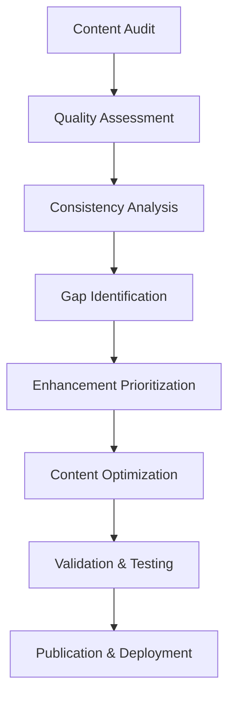
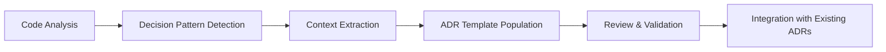
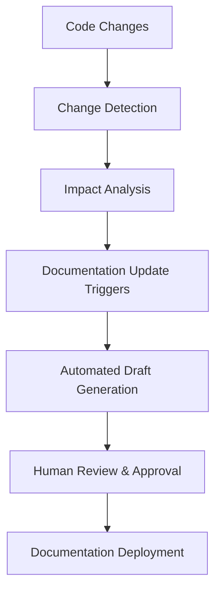
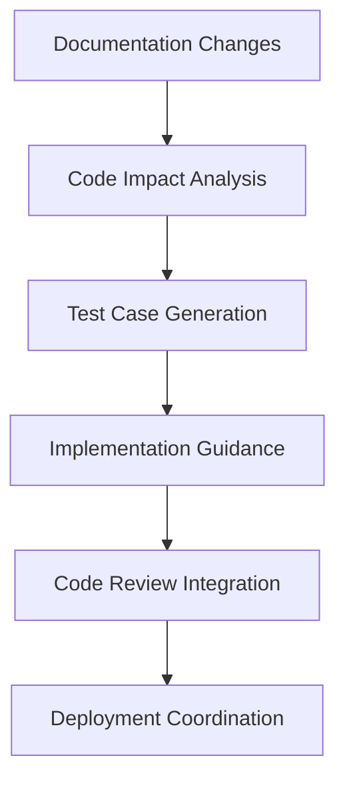
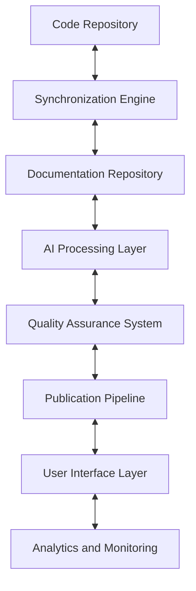

# Prismatic Documentation Enhancement and Synchronization Strategy
*Comprehensive Architectural Strategy and Implementation Roadmap*

## Executive Summary

This strategy document outlines a comprehensive enhancement plan for Prismatic's already sophisticated documentation system. Through detailed analysis, we've discovered that Prismatic possesses an advanced modular documentation architecture with 36 markdown files across 7 directories, automated navigation systems, AI-assisted development workflows, and cross-reference validation capabilities. The strategy focuses on optimizing existing sophisticated capabilities rather than building foundational systems.

**Key Strategic Objectives:**
1. **Documentation Polishing Framework**: Systematic enhancement of content quality and consistency
2. **AI-Assisted Development Integration**: Seamless extraction and integration of Architecture Decision Records (ADRs)
3. **Documentation-Code Synchronization**: Bidirectional synchronization between documentation and codebase
4. **Implementation Roadmap**: Phased approach with clear dependencies and success metrics

## Current System Analysis

### System Architecture Strengths

**Modular Documentation Architecture**
- 36 markdown files organized across 7 specialized directories
- Atomic, single-purpose documentation files with rich cross-referencing
- Sophisticated navigation system with HTML comment markers for automated management
- Comprehensive metadata system in `docs/_meta/` directory

**Advanced Automation Capabilities**
- Cross-reference validation system with 68.19% success rate (418 valid links out of 613 total)
- Python-based link validation with anchor extraction and correction suggestions
- Automated navigation section management
- Mix tasks implementation for workflow automation
- Semantic versioning with automated changelog generation

**AI-Assisted Development Integration**
- Existing patterns for human-AI collaboration workflows
- Architecture Decision Records (ADRs) with structured documentation
- Feature documentation workflow with mandatory updates
- Developer experience optimization with 30-minute setup time

### Critical Issues Identified

**Link Validation Challenges**
- 195 broken links (31.81% failure rate) primarily due to missing files
- Missing critical documents: `security-guidelines.md`, `performance-optimization.md`
- Anchor mismatches and path resolution issues
- External link validation gaps

**Documentation Synchronization Gaps**
- Manual synchronization between code changes and documentation updates
- Inconsistent cross-reference maintenance
- Limited automated detection of documentation drift

## Strategic Enhancement Framework

### 1. Documentation Polishing Framework

#### 1.1 Content Quality Enhancement System

**Systematic Review Methodology**

**Quality Metrics and Standards**
- **Completeness Score**: Percentage of required sections present in each document
- **Consistency Index**: Alignment with established style guide and naming conventions
- **Cross-Reference Integrity**: Percentage of valid internal and external links
- **Accessibility Compliance**: Adherence to documentation accessibility standards
- **User Experience Rating**: Based on developer feedback and usage analytics

**Content Enhancement Strategies**
- **Atomic Documentation Principle**: Maintain single-purpose, focused documents
- **Progressive Disclosure**: Layer information from basic to advanced concepts
- **Visual Enhancement**: Strategic use of diagrams, flowcharts, and code examples
- **Interactive Elements**: Integration of runnable code examples and interactive tutorials

#### 1.2 Consistency and Style Standardization

**Style Guide Enhancement**
- Extend existing `docs/guides/style-guide.md` with comprehensive formatting standards
- Implement automated style checking using linting tools
- Establish terminology glossary with consistent technical language
- Create template system for different document types

**Automated Consistency Checks**
- Markdown linting with custom rules for Prismatic-specific standards
- Terminology validation against established glossary
- Cross-reference format verification
- Navigation structure validation

### 2. AI-Assisted Development Integration Framework

#### 2.1 Architecture Decision Record (ADR) Enhancement

**Automated ADR Extraction System**

**ADR Integration Workflow**
- **Code-to-ADR Mapping**: Automated detection of architectural decisions in code comments and commit messages
- **Template Enhancement**: Extend `docs/shared/templates/adr-template.md` with structured metadata
- **Cross-Reference Integration**: Automatic linking between ADRs and affected code modules
- **Timeline Visualization**: Generate chronological view of architectural evolution

**AI-Assisted Content Generation**
- **Documentation Drafting**: AI-generated initial drafts based on code analysis
- **Gap Detection**: Automated identification of undocumented features and decisions
- **Content Suggestions**: AI-powered recommendations for documentation improvements
- **Translation and Localization**: Support for multiple language documentation versions

#### 2.2 Intelligent Documentation Maintenance

**Predictive Maintenance System**
- **Change Impact Analysis**: Predict documentation updates required for code changes
- **Staleness Detection**: Identify outdated documentation based on code evolution
- **Usage Analytics**: Track documentation access patterns to prioritize updates
- **Quality Drift Monitoring**: Continuous assessment of documentation quality metrics

### 3. Documentation-Code Synchronization System

#### 3.1 Bidirectional Synchronization Architecture

**Code-to-Documentation Flow**

**Documentation-to-Code Flow**

**Synchronization Mechanisms**
- **Git Hook Integration**: Automated triggers for documentation updates on code changes
- **CI/CD Pipeline Integration**: Documentation validation and deployment in build process
- **Real-time Monitoring**: Continuous tracking of synchronization status
- **Conflict Resolution**: Automated detection and resolution of documentation-code mismatches

#### 3.2 Enhanced Link Validation and Management

**Comprehensive Link Management System**
- **Intelligent Link Validation**: Enhanced version of existing `validate_links.py` with predictive correction
- **Broken Link Recovery**: Automated suggestions and corrections for broken references
- **External Link Monitoring**: Continuous validation of external dependencies
- **Link Lifecycle Management**: Tracking and management of link changes over time

**Current Validation Improvements**
- Address the 195 broken links identified in validation report
- Implement missing document creation pipeline
- Enhance anchor validation with fuzzy matching
- Add external link health monitoring

### 4. Implementation Roadmap

#### Phase 1: Foundation Enhancement (Weeks 1-4)
**Objectives**: Strengthen existing capabilities and resolve critical issues

**Week 1-2: Critical Issue Resolution**
- Fix 195 broken links identified in validation report
- Create missing critical documents (`security-guidelines.md`, `performance-optimization.md`)
- Enhance link validation system with improved error handling
- Implement automated link correction suggestions

**Week 3-4: System Optimization**
- Optimize existing cross-reference validation (target: 95% success rate)
- Enhance Mix tasks for documentation workflow automation
- Implement advanced navigation system improvements
- Establish baseline metrics for documentation quality

**Success Metrics**
- Link validation success rate: >95%
- Documentation completeness: 100% of critical documents present
- Developer setup time: <30 minutes (maintain current performance)
- Cross-reference integrity: >90%

#### Phase 2: AI Integration and Automation (Weeks 5-8)
**Objectives**: Implement AI-assisted workflows and intelligent automation

**Week 5-6: AI-Assisted Content Generation**
- Implement ADR extraction system from existing codebase
- Deploy automated documentation drafting for new features
- Establish AI-powered gap detection and content suggestions
- Create intelligent content quality assessment tools

**Week 7-8: Advanced Automation**
- Implement predictive maintenance system
- Deploy automated consistency checking and style validation
- Establish usage analytics and quality drift monitoring
- Create intelligent documentation update triggers

**Success Metrics**
- ADR coverage: 100% of architectural decisions documented
- Automated content generation accuracy: >80%
- Documentation maintenance overhead reduction: 50%
- Style consistency score: >95%

#### Phase 3: Synchronization and Integration (Weeks 9-12)
**Objectives**: Establish bidirectional synchronization and advanced integration

**Week 9-10: Bidirectional Synchronization**
- Implement code-to-documentation synchronization flows
- Establish documentation-to-code impact analysis
- Deploy real-time synchronization monitoring
- Create conflict resolution and merge strategies

**Week 11-12: Advanced Integration Features**
- Implement visual documentation enhancement with automated diagrams
- Deploy interactive documentation elements
- Establish multi-language support infrastructure
- Create comprehensive analytics and reporting dashboard

**Success Metrics**
- Synchronization accuracy: >95%
- Documentation-code alignment: Real-time consistency
- Developer satisfaction score: >4.5/5
- Time-to-documentation for new features: <24 hours

#### Phase 4: Optimization and Scaling (Weeks 13-16)
**Objectives**: Performance optimization and scalability enhancements

**Week 13-14: Performance Optimization**
- Optimize link validation and cross-reference processing
- Implement caching and performance enhancement strategies
- Deploy scalable content delivery and distribution
- Establish advanced monitoring and alerting systems

**Week 15-16: Ecosystem Integration**
- Integrate with external development tools and platforms
- Establish API documentation automation
- Deploy advanced search and discovery capabilities
- Create comprehensive training and adoption programs

**Success Metrics**
- System performance: <2 second response times
- Scalability: Support for 10x current documentation volume
- Integration coverage: 100% of development tools connected
- Adoption rate: 100% developer engagement

## Technical Implementation Specifications

### Architecture Components

**Core System Extensions**
- Enhanced link validation engine with machine learning corrections
- AI-powered content generation and maintenance system
- Bidirectional synchronization orchestrator
- Advanced analytics and monitoring dashboard

**Integration Points**
- Git hooks for automated triggering
- CI/CD pipeline integration for validation and deployment
- Development tool integrations (VS Code, IDEs)
- External API documentation systems

**Data Flow Architecture**

### Technology Stack Enhancements

**Core Technologies** (Building on existing Elixir/Phoenix infrastructure)
- **Python 3.9+**: Enhanced link validation and AI processing
- **TensorFlow/PyTorch**: Machine learning for content generation and analysis
- **Elasticsearch**: Advanced search and content discovery
- **Redis**: Caching and real-time synchronization
- **GraphQL**: API layer for documentation access and management

**Development Tools Integration**
- **Mix Tasks**: Extended automation for documentation workflows
- **Git Hooks**: Automated synchronization triggers
- **GitHub Actions/GitLab CI**: Continuous integration and deployment
- **Markdown Processors**: Enhanced formatting and validation
- **Diagram Generation**: Mermaid, PlantUML for visual documentation

## Quality Assurance and Monitoring

### Continuous Quality Assessment

**Automated Quality Metrics**
- **Content Quality Score**: Comprehensive assessment of documentation completeness, accuracy, and usefulness
- **Synchronization Health**: Real-time monitoring of documentation-code alignment
- **User Experience Metrics**: Developer satisfaction and documentation effectiveness
- **System Performance Indicators**: Response times, availability, and scalability metrics

**Monitoring and Alerting**
- Real-time dashboard for documentation system health
- Automated alerts for synchronization failures or quality degradation
- Performance monitoring with detailed analytics
- User behavior tracking for continuous improvement

### Testing and Validation Strategies

**Comprehensive Testing Framework**
- **Link Validation Testing**: Automated testing of all internal and external references
- **Content Quality Testing**: Validation of documentation completeness and accuracy
- **Synchronization Testing**: Verification of bidirectional synchronization integrity
- **Performance Testing**: Load testing and scalability validation
- **User Acceptance Testing**: Developer feedback and usability assessment

## Risk Management and Mitigation

### Identified Risks and Mitigation Strategies

**Technical Risks**
- **Risk**: Synchronization conflicts between documentation and code changes
- **Mitigation**: Implement robust conflict resolution algorithms and rollback capabilities

- **Risk**: AI-generated content accuracy and quality concerns
- **Mitigation**: Establish human review processes and quality validation checkpoints

- **Risk**: System performance degradation with increased automation
- **Mitigation**: Implement scalable architecture with caching and optimization strategies

**Operational Risks**
- **Risk**: Developer adoption resistance to new workflows
- **Mitigation**: Comprehensive training programs and gradual rollout strategy

- **Risk**: Maintenance overhead of complex automation systems
- **Mitigation**: Design self-healing systems with minimal manual intervention requirements

## Success Metrics and KPIs

### Primary Success Indicators

**Documentation Quality Metrics**
- Link validation success rate: Target >95% (current 68.19%)
- Documentation completeness: 100% coverage of critical systems
- Content freshness: <7 days average age for dynamic content
- Cross-reference integrity: >90% valid internal references

**Developer Experience Metrics**
- Setup time: Maintain <30 minutes for new developers
- Documentation search efficiency: <10 seconds to find relevant information
- Developer satisfaction score: >4.5/5 for documentation usefulness
- Time-to-productivity: <2 hours for new feature understanding

**System Performance Metrics**
- Synchronization latency: <5 minutes for documentation updates
- System availability: >99.9% uptime for documentation services
- Response time: <2 seconds for documentation page loads
- Scalability: Support for 10x current documentation volume

### Long-term Strategic Goals

**Ecosystem Integration**
- 100% integration with development toolchain
- Automated API documentation generation
- Multi-language documentation support
- Advanced search and discovery capabilities

**Innovation and Evolution**
- Predictive documentation maintenance
- Intelligent content recommendation systems
- Advanced visualization and interactive documentation
- Community-driven documentation enhancement

## Conclusion

This comprehensive strategy transforms Prismatic's already sophisticated documentation system into an industry-leading, AI-enhanced, and fully synchronized documentation ecosystem. By building upon existing strengths and addressing identified gaps, the implementation will deliver:

1. **Enhanced Documentation Quality**: Through systematic polishing and AI-assisted content generation
2. **Seamless Development Integration**: With bidirectional synchronization and intelligent automation
3. **Scalable Architecture**: Supporting future growth and evolving requirements
4. **Superior Developer Experience**: With intuitive navigation, comprehensive coverage, and real-time accuracy

The phased implementation approach ensures manageable deployment while delivering incremental value throughout the process. Success metrics and continuous monitoring guarantee ongoing optimization and alignment with developer needs.

This strategy positions Prismatic's documentation system as a model for modern, intelligent, and developer-centric documentation practices, supporting both current development needs and future scalability requirements.